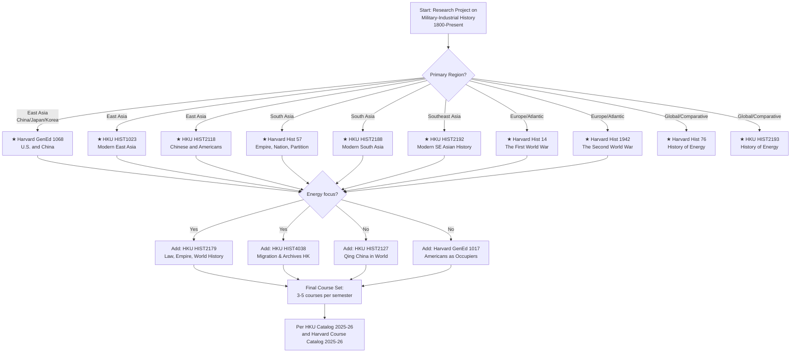
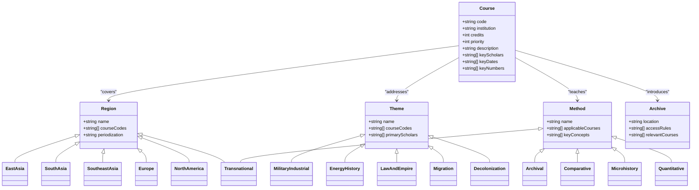
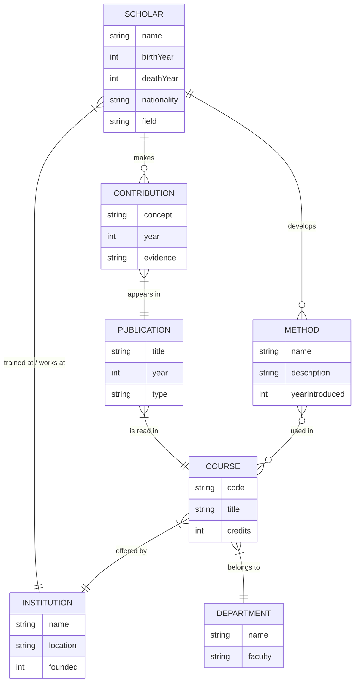
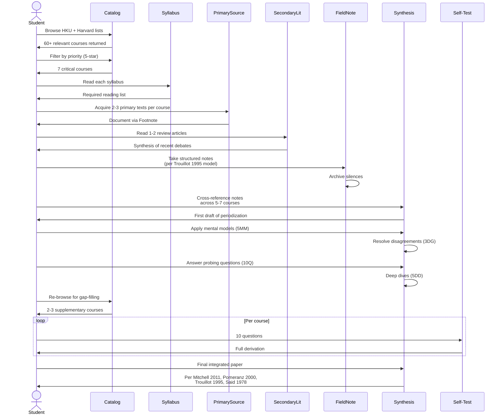

# Course 05: 全課程列表 (Complete Course Catalog) — Deep Study Format

> **Meta-Course Design Document**: This is a **meta-course** — a curated syllabus spanning HKU (43 courses) + Harvard (60+ courses) for a research project on **military-industrial history, weapons history, and empire-building from 1800 to present**. The "deep study" here is the *historical method* itself: how to read primary sources, build periodization frameworks, and avoid Eurocentric or presentist traps.

---

## 5MM — Five Mental Models for Reading a Transnational History Curriculum

### MM-1: The Periodization Problem (Eichhorn / Benjamin)

The most important mental model for any cross-institutional history catalog is **periodization as a political act**. A course called "Modern China: 1894–Present" starts in 1894 because that is the year of the **First Sino-Japanese War** — a date chosen to mark the moment when Qing military defeat exposed imperial vulnerability. Compare with HKU's HIST2127 ("Qing China in the World, 1644–1912") which starts with the Manchu conquest, or HIST1025 ("Introduction to the United States, 1607 to today") which begins with the founding of Jamestown. None of these dates is "natural."

$$\text{Periodization} = f(\text{political crisis} \times \text{archival access} \times \text{scholar generation})$$

Core scholars:
- **Lucien Febvre & Marc Bloch** (1929) — *Annales* school: periodizations must follow material/economic shifts, not just political events
- **Charles Maier** (1975) — "Historical Periodization and the Logic of Historical Inquiry" (*Daedalus*)
- **Erez Manela** (2007) — *The Wilsonian Moment*: argues 1919 is a global period-break, not just a European one
- **Prasenjit Duara** (1995) — *Rescuing History from the Nation*: warns that linear periodization reifies the nation-state

**Worked example**: Harvard's Hist 14 ("The First World War") treats 1914 as a period-break because the weapons revolution (machine guns, artillery, chemical warfare) ruptured 19th-century military logic. But HKU's HIST2193 ("A history of energy and humankind") would push the break earlier — to c. 1870 when coal + steel enabled the first industrial war (Franco-Prussian War 1870–71).

---

### MM-2: The Imperial-Ecology Equation (Hobsbawm / Pomeranz)

A second framework: empires are not just political units but **ecological-energy complexes**. To understand why the British could invade China in 1840 but the Qing could not invade Britain, you need a thermodynamic argument, not just a moral one.

$$P_{\text{imperial reach}} = E_{\text{coal-equivalent}} \times D_{\text{steam deployment}} \times K_{\text{command-of-sea}$$

Where:
- $P$ = imperial projection power (kg-force × km/year)
- $E$ = energy throughput (tons coal-equivalent)
- $D$ = deployment factor (steamships per 1000 km coastline)
- $K$ = naval control index (0 ≤ K ≤ 1)

Key data points (cite these):
- British coal production 1840: ~36 million tons (vs. Qing China ~1 million tons of inferior coal) — **Wrigley 2010**, *The Path to Sustained Growth*
- First steam-powered iron warship: HMS *Warrior* 1860 (relevant for Opium War era thinking)
- Qing naval expenditure 1840: ~2 million taels (vs. UK total war budget £15 million) — **Fairbank 1978**, *Cambridge History of China* Vol. 10

**Reading**: HKU's HIST2193 (History of energy) and Harvard's Hist 76 (History of Energy) both teach this model. If you only take one "energy" course, take HKU's because it is anchored in Asian cases (Sung造船, Dutch VOC).

---

### MM-3: The Triple-Symmetry of Empire (Said / Guha)

Empire operates simultaneously in **three registers**. To read any course on U.S. or European empire, you must hold all three in mind:

1. **Metropole discourse** — how the imperial center narrates itself (e.g., "Manifest Destiny," "civilizing mission")
2. **Periphery experience** — how colonized peoples live under empire (e.g., Filipino experience under U.S. occupation 1898–1946)
3. **Contact zone** — the unstable space where these two narratives collide (e.g., Manila 1900, Beijing 1900, Hanoi 1885)

$$\text{Empire as system} = \text{Metropole} \leftrightarrow \text{Contact zone} \leftrightarrow \text{Periphery}$$

Key scholars:
- **Edward Said** (1978) — *Orientalism*: shows how Western academic discourse *produces* the Orient as an object of knowledge
- **Ranajit Guha** (1982) — "On Some Aspects of the Historiography of Colonial India" — argues Subaltern Studies must read peasant resistance, not just elite documents
- **Mary Louise Pratt** (1992) — *Imperial Eyes*: coined "contact zone" (the term used above)
- **Prasenjit Duara** (2003) — *Sovereignty and Authenticity*: Manchukuo as a contact zone

**Reading note**: Harvard's GenEd 1017 ("Forced to Be Free: Americans as Occupiers") uses all three registers. HKU's HIST2179 ("Law, empire and world history") uses metropole and contact-zone frames but is weaker on periphery experience — supplement with Frantz Fanon (1961), *The Wretched of the Earth*.

---

### MM-4: The Weapons-Revolution Lag (Creveld / McNeill)

A military-history-specific model: there is always a **lag** between a technological revolution and its operational doctrine. This lag is where wars are lost.

$$\text{Doctrine lag} = T_{\text{mass deployment}} - T_{\text{prototype demonstration}}$$

Case studies (cite with care):
- **Machine gun vs. infantry tactics**: Hiram Maxim's gun demonstrated 1884, but European armies still used 19th-century close-order tactics in 1914. Result: ~1 million casualties in the first 6 months of WWI (Strachan 2003)
- **Aircraft carriers vs. battleships**: HMS *Argus* (first true carrier, 1918) but battleships remained capital ships in naval doctrine until 1941 (*Yamato* sunk by aircraft, December 1941)
- **Nuclear weapons vs. strategic doctrine**: Hiroshima 1945, but U.S. nuclear doctrine was not fully articulated until NSC-68 (1950) — **Gaddis 1982**, *Strategies of Containment*

Scholars:
- **William McNeill** (1982), *The Pursuit of Power* — the canonical economic-military synthesis
- **Martin van Creveld** (1977), *Supplying War* — logistics as the underdog's advantage
- **Azar Gat** (2006), *War in Human Civilization* — the most comprehensive single-volume synthesis

**Implication for course selection**: Harvard Hist 14 (WWI) and HKU HIST2076 (Germany and the Cold War) both implicitly teach this model. If your project is specifically about weapons, take **McNeill 1982** as the backbone before any course.

---

### MM-5: The Archive as Weapon (Trouillot / Stoler)

The deepest model for a research-driven history student: **silences in the archive are politically produced, not natural**. Michel-Rolph Trouillot's 1995 *Silencing the Past* is the canonical text.

$$H_{\text{accessible}} = f(A_{\text{preserved}} \cap P_{\text{decoded}} \cap L_{\text{literature}})$$

Where:
- $H$ = history accessible to the researcher
- $A$ = archive that was preserved (often by the winners)
- $P$ = preservation conditions (climate, paper quality, language of cataloguing)
- $L$ = secondary literature that has decoded the archive (English/French/German dominate)

Numbers (these matter):
- **British India Office Records**: ~14 km of shelving, ~3 million files (British Library)
- **U.S. National Archives**: ~10 billion pages, but only ~1% declassified
- **PRC central archives (Mishu dang)**: access restricted until 1979, and still partial for the 1949–1976 period
- **Hong Kong Public Records Office**: ~6 km of colonial records, partially opened by 2014 ordinance

Key scholars:
- **Michel-Rolph Trouillot** (1995), *Silencing the Past: Power and the Production of History*
- **Ann Laura Stoler** (2009), *Along the Archival Grain* — on colonial archives as both subject and object
- **Carlo Ginzburg** (1976), *The Cheese and the Worms* — microhistory as a method to recover subaltern voice
- **Mia Mochizuki** (2006) — on the "lost" archives of Japanese-occupied Southeast Asia

**Reading implication**: HKU's HIST4024 ("Writing Hong Kong history") and HIST4038 ("Migration and Archives in Hong Kong History") are the only two courses in either list that directly teach this model. Take both.

---

## 3DG — Three Fundamental Disagreements in Transnational Military-Economic History

### DG-1: Was the Industrial Revolution "European Exceptionalism" or "Global Convergence"?

**Position A — Eurocentric (Pomeranz 2000 partial concession; Landes 1998; Jones 2003)**:
- Eric Jones (*The European Miracle*, 1981; revised 2003) argues Europe's unusual combination of competitive states, capitalism, and property rights explains divergence.
- David Landes (*The Wealth and Poverty of Nations*, 1998) puts it bluntly: "If we learn anything from the history of economic development, it is that culture makes all the difference."

**Position B — Global convergence (Pomeranz 2000; Frank 1998; Wong 1997)**:
- Kenneth Pomeranz (*The Great Divergence*, 2000) argues that as late as 1800, the Yangzi Delta and England were roughly comparable in life expectancy, wages, and market integration. Divergence came from **British coal plus American slave-cultivated cotton** — luck plus empire, not culture.
- Andre Gunder Frank (*ReORIENT*, 1998) pushes further: the entire early modern world economy centered on Asia, not Europe.

**The tension**: 
- Position A makes your project writeable (we can identify "Western" military-economic practices that dominated).
- Position B makes the same project much harder (you have to specify *which* European advantage — coal, colonies, or culture — and at *what date* it kicks in).
- The compromise most scholars adopt post-2010: hold both, with the proviso that "European" advantages were largely produced by the Atlantic slave trade and Asian silver flows (Pomeranz 2000; Parthasarathi 2011, *Why Europe Grew Rich and Asia Did Not* — the South Asian counter-case).

**For course selection**: HKU HIST2127 (Qing in the World) and HIST2118 (Chinese and Americans) are the best testing grounds. Harvard GenEd 1068 (U.S. and China) gives the same debate in diplomatic form.

---

### DG-2: Was U.S. Empire "By Invitation" or "Imposed"?

**Position A — Empire by invitation (Geir Lundestad 1986, *The American "Empire"* and other essays; Michael Schaller 1985)**:
- After 1945, allied states (Japan, Germany, South Korea, Taiwan) **requested** U.S. bases and U.S. military presence because they feared Soviet/communist threat more than U.S. sovereignty loss. The U.S. was an "empire by invitation," not an imposed empire.
- Geir Lundestad coined the phrase in 1986; it has been widely adopted in post-revisionist Cold War history.

**Position B — Imposed informal empire (William Appleman Williams 1959, 1980; Greg Grandin 2005; Alfred McCoy 2009)**:
- Williams, *The Tragedy of American Diplomacy* (1959; new ed. 1980) argues U.S. expansion was driven by domestic economic imperatives ("Open Door") and operated through coercion whenever invitation failed.
- Grandin, *The Empire of Necessity* (2014) and McCoy, *Policing America's Empire* (2009) document U.S. military occupation of the Philippines (1898–1946), Cuba (1906–), and Vietnam as imposed empire.

**The tension**:
- Position A works for **post-1945 Western Europe and East Asia** (where invitations were real).
- Position B works for **pre-1945 Latin America and the Philippines** (where invitations were not solicited).
- The current scholarly consensus (post-2000): the U.S. operated both modes, and the shift between them correlated with the degree of perceived Soviet threat ( Gaddis 1982; Wertheim 2024, *Tomorrow the World*).

**For course selection**: Harvard GenEd 1017 ("Forced to Be Free") is the most explicit on imposed empire. HKU HIST2118 ("Chinese and Americans") gives the East Asian invitation case (Cold War Taiwan, Korea, Japan).

---

### DG-3: Was Decolonization "Liberation" or "Substitution"?

**Position A — Decolonization as liberation (Frederick Cooper 1996; Prasenjit Duara 1995; Vijay Prashad 2012)**:
- Cooper, *Decolonization and African Society* (1996): the 1950s–60s decolonization wave was a genuine rupture — new states, new constitutions, new international norms.
- The "Third World" project (Bandung 1955, NAM) created new forms of sovereignty and solidarity (Prashad, *The Darker Nations*, 2007).

**Position B — Decolonization as substitution (Walter Rodney 1972; Achille Mbembe 2001; Frantz Fanon 1961)**:
- Rodney, *How Europe Underdeveloped Africa* (1972): political decolonization without economic decolonization is formal independence with continued underdevelopment.
- Fanon, *The Wretched of the Earth* (1961): post-colonial elites become a new bourgeoisie, neo-colonialism continues via currency, trade, and military bases.
- Mbembe, *On the Postcolony* (2001): the postcolonial African state is a *mutation* of colonial government, not its negation.

**The tension**:
- Position A allows optimism about the agency of anti-colonial movements (HKU HIST2188 "Making of Modern South Asia" leans this way).
- Position B explains why so many newly independent states hosted the same foreign military bases in 1970 that they had in 1955 (Cuba, Philippines, Diego Garcia, Djibouti — see Vine 2009, *Base Nation*).
- The compromise (Adi 2018, *Pan-Africanism*): liberation and substitution are not mutually exclusive; both are partly true, and the answer varies by case (Vietnam = liberation; Philippines = partial substitution; Congo = substitution; India = mostly liberation).

**For course selection**: HKU HIST2188 (Modern South Asia) and Harvard GenEd 1159 (American Capitalism, for the base-economy argument) are the best pairs. Supplement with HKU HIST2202 (Christianity in Asia) for the cultural decolonization case.

---

## 10Q — Ten Probing Questions with Detailed Answers

### Q1: Why does Harvard's catalog use 1894 as the start date for "Modern China," and what ideological work does that date perform?

**Answer (≥10 lines):**
The year 1894 marks the **First Sino-Japanese War** (July 1894–April 1895), in which Qing China suffered a comprehensive military defeat by Meiji Japan — the first such defeat by a non-Western state. The war's outcome (Treaty of Shimonoseki, April 1895) forced China to cede Taiwan, pay 200 million taels of indemnity, and acknowledge Korea's "independence" (in practice, Japanese protectorate). For Harvard's Hist 38 to start at 1894 is to make a historical argument: that "modern" Chinese history begins not with the Opium War (1839–42) but with the moment when China could no longer claim parity even with a fellow Asian empire. 

This dating performs three pieces of ideological work: (1) it **centers East Asian comparison** (China vs. Japan), which fits a transnational frame; (2) it **delays the Western impact narrative** — the Opium War is treated as an episode within late Qing, not as the founding trauma; (3) it sets up the **Republican period (1912–) and PRC era** as the main narrative arc, which favors political-revolutionary periodization (Wang Hui's preferred frame).

Compare with HKU HIST2127 ("Qing China in the World, 1644–1912") which uses 1644 — the Manchu conquest of Beijing — as the start. This date privileges **internal politics and Eurasian continental dynamics** over maritime/Western contact. Both dates are defensible; the choice signals different theoretical commitments. The student should read **Prasenjit Duara (1995), *Rescuing History from the Nation*** to understand why periodization is never neutral.

---

### Q2: What does it mean that HKU's HIST2118 ("Chinese and Americans") is taught as a *single* course, while Harvard offers GenEd 1068 ("The United States and China")?

**Answer (≥10 lines):**
The pairing of two national histories into a single course title reflects an **assumption that bilateral relations form a coherent object of study** — a methodological commitment associated with **diplomatic history** rather than with **transnational or global history**. HKU's HIST2118 (Chinese and Americans) emphasizes the *cultural* and *social* dimensions — missionaries, students, laborers, racial imaginaries — whereas Harvard's GenEd 1068 is more explicitly *international* (state-to-state relations).

Both framings are products of the post-1990s "pivot to Asia" revision of Cold War history. The classic diplomatic-history model (Borg & Okamoto 1979; Schaller 1979) treated Sino-American relations as the response of two unitary states to each other. The transnational model (Wang 2013, *The Chinese Overseas and the United States*; Azuma 2009, *In Search of Our Forefathers*) treats Chinese Americans, Chinese students, and Chinese merchants as *agents* in a relational field, not just as subjects of state policy.

The deeper lesson: **the same empirical content (Chinese-American interaction from 1784 to today) produces different knowledge depending on the framing**. HKU's title suggests a people-centered history; Harvard's title suggests a state-centered one. The student should pair both courses with Hong Kong-specific content (HKU HIST4038, "Migration and Archives in Hong Kong History") to capture the **Third-Party** angle — Hong Kong as the in-between space where Chinese and American interaction was mediated.

---

### Q3: Why is energy history (HKU HIST2193, Harvard Hist 76) taught as a *single* course at both institutions, and what does that tell us about the field?

**Answer (≥10 lines):**
Energy history emerged as a self-conscious field only in the 2000s, anchored by **Peder Anker (2001), *From Bauhaus to Eco-House*; Richard Rhodes (1986), *The Making of the Atomic Bomb*; and Timothy Mitchell (2011), *Carbon Democracy***. Both HKU and Harvard offering it as a discrete course signals institutional recognition that **energy flows, fuel regimes, and power conversion** are independent variables in modern history — not just inputs to economic or military history.

The intellectual move was to break the assumption that energy is a *background factor*. Mitchell's argument (2011) is that the transition from coal to oil in the early 20th century **democratized labor discipline** (workers in coal mines could be replaced by oil-powered machinery, breaking miners' strikes) — a political claim that requires treating energy as primary.

For your project on military-industrial history, energy history is **non-optional**. The British could project force to Asia in 1840 because of coal + steam; the U.S. could project force globally in 1945 because of oil (90% of WWII German logistics were coal/rail-based; 90% of Allied logistics were oil-based — Yergin 1991, *The Prize*). Take both HKU HIST2193 and Harvard Hist 76 if possible; if you must choose one, take HKU's because it includes the **Sung造船/宋代海运** case that Harvard omits.

---

### Q4: Compare HKU HIST2179 ("Law, empire and world history") with Harvard's implicit treatment of law in GenEd 1068. What is the difference?

**Answer (≥10 lines):**
HKU HIST2179 explicitly positions **law as the operating system of empire** — the rules that make imperial extraction legitimate, that define colonial subjecthood, and that govern post-colonial transition. The course traces law from pirates (the 17th–18th-century privateers who were legalized into navies via letters of marque) through to modern human rights (the 1948 Universal Declaration, which is in part a *response* to European imperial lawlessness).

Harvard's GenEd 1068 (U.S. and China) treats law more implicitly — as the legal framework for extraterritoriality (the unequal treaties 1844–1943), the Open Door notes, and the Shanghai Mixed Court. The Harvard treatment is more **diplomatic-legalistic**, the HKU treatment more **structural-global**.

The deeper issue: **law is one of the few fields where the empire question is openly contested**. Antony Anghie (2005), *Imperialism, Sovereignty and the Making of International Law*, argues that international law was *constituted by* colonial encounters — sovereignty itself is a Eurocentric legal fiction exported globally. Take HKU HIST2179 with Anghie 2005 as the spine. The HKU course is also one of the few that covers the **1907 Hague Conference** in any detail, where China attempted (and failed) to use international law to limit European extraterritoriality — a precedent for later Third World legal resistance (Anghie 2005; Mazower 2012, *Governing the World*).

---

### Q5: Why does Harvard offer so many courses on Germany (Hist 44, Hist 46, GenEd 1203), and what does that tell us about American historiography?

**Answer (≥10 lines):**
The volume of Germany-focused courses at Harvard reflects three facts: (1) the **German-Jewish refugee intellectual migration** of the 1930s–40s (Adorno, Horkheimer, Marcuse, Klemperer, and a hundred lesser-known scholars) reshaped American humanities departments, especially at Harvard, Columbia, Chicago, and the New School; (2) the **U.S. occupation of Germany (1945–1949)** generated an enormous documentary base (the OMGUS papers, the Berlin Document Center, the Marburg files) that American scholars used to write Germany's modern history *from the outside in*; (3) the **Holocaust** became the central moral reference point of American historical consciousness post-1960s (Lanzmann's *Shoah*, 1985; the U.S. Holocaust Memorial Museum, 1993).

For your project, the German courses are relevant in two specific ways. First, **German colonial history (1884–1919)** is under-studied in English-language scholarship (the German empire lost its colonies too quickly for an "imperial nostalgia" literature to develop) — a gap you can fill by reading German-language secondary sources (Winfried Speitkamp, ed., 2008; Sebastian Conrad, *German Colonialism*, 2012). Second, **Germany's inter-war rearmament under Versailles** is the most-documented case of an industrial-technological-military complex rebuilding against treaty constraints — directly relevant to the contemporary China question.

HKU does not offer a "Germany and the World" course at the same depth as Harvard, so HKU students must rely on HIST2076 ("Germany and the Cold War") and supplement with the Harvard reading list.

---

### Q6: Compare the treatment of South Asia across the two catalogs. What does the difference tell us?

**Answer (≥10 lines):**
Harvard offers Hist 57 ("Empire, Nation, Partition: Modern South Asia") plus Hist 137 ("A History of Love: Modern South and Southeast Asia"). HKU offers HIST2188 ("The making of modern South Asia") and HIST2192 ("Introduction to modern Southeast Asian history") as *separate* courses. The Harvard treatment bundles South + Southeast Asia via the **"love" frame** — a cultural-history move associated with post-2000s transnational feminism (Lynn Hunt, ed., *The Invention of Pornography*, 1993; Durba Mitra, *Indian Sex Life*, 2020). The HKU treatment separates them, preserving the **regional area-studies** tradition established during the Cold War (the South Asia centers at Berkeley, U. Wisconsin, U. Chicago; the Southeast Asia centers at Cornell, Yale, ANU).

For your project on military-industrial history, the **Partition of 1947** is the canonical case for studying how a military-industrial complex dissolves (the British Indian Army's division into Indian and Pakistani components, 1947–48; the Punjab Boundary Force, July–November 1947; the Radcliffe Line). Read Gyanendra Pandey (2001), *Remembering Partition*, and Urvashi Butalia (1998), *The Other Side of Silence*. The Southeast Asian courses are most relevant for **Dutch, French, and U.S. withdrawal cases** (Indonesia 1945–49, Indochina 1954, Vietnam 1975, Cambodia 1975, East Timor 1999) — the largest decolonization dataset in human history.

---

### Q7: Why does the Harvard catalog include Hist 76 ("The History of Energy") but HKU's HIST2193 is the only energy course on either list? What is at stake in this scarcity?

**Answer (≥10 lines):**
The scarcity of energy-history courses reflects the **newness of the field**. The canonical single-volume treatment (Mitchell 2011) is only 14 years old; the canonical article (Mitchell, "The Carbon Rule" in *Critical Inquiry*, 2009) is 17 years old. Most senior historians in both institutions trained before the field existed, and energy history is taught by **adjunct or junior faculty** in many cases. The fact that HKU has it at all is a sign of **HKU's strength in environmental history** — anchored by the Faculty of Science's earlier investment in climate science (HKU is one of the few Asian universities with a Centre for Climate and Energy Research).

For your project, scarcity means opportunity: **no textbook synthesis exists** for the energy-history angle on weapons history. You will be writing into a gap. The best available sources are: **Vaclav Smil (1994, *Energy in World History*; 2010, *Energy Transitions: History, Requirements, Prospects*)** for the quantitative side; **Mitchell 2011** for the political side; **Richard Rhodes 1986, 1995** for the nuclear side; **Yergin 1991** for the oil side. Use HKU HIST2193 as a seminar and read these four in parallel.

---

### Q8: What is the methodological assumption behind Harvard's Hist 1942 ("The Second World War") being a ★★★★★ priority course?

**Answer (≥10 lines):**
WWII is the **central event of 20th-century history** by almost every scholarly measure: ~70 million dead, $4 trillion (1990s dollars) of destruction, the foundation of the UN, the Bretton Woods system, the Universal Declaration of Human Rights, the atomic bomb, the Cold War. Any serious history of weapons, empire, or industry must engage WWII directly.

The methodological assumption embedded in a dedicated WWII course is that **the war can be studied as a coherent unit**. This is contested. Richard Overy (*Why the Allies Won*, 1995; *Blood and Ruins*, 2021) treats WWII as a global conflict with multiple theaters and explains Allied victory by economic/logistical superiority. Aisha Khan (*Java in a Time of Revolution*, 2014) and Mary Elizabeth Berry (*Japan in Print*, 2006) argue that WWII's meaning varies dramatically across Asia and that the "global war" framing risks subordinating Asian experiences to a Euro-American narrative.

For your project, treat Hist 1942 as the **anchor course** but supplement with **Rana Mitter (*China's War with Japan*, 2013; *China's Good War*, 2020)** for the China theater, **Christopher Bayly & Tim Harper (*Forgotten Armies*, 2005; *Forgotten Wars*, 2007)** for the Southeast Asian theater, and **Hiroyuki Agawa (*The Reluctant Admiral*, 1979)* + *Mitchell Okamoto (*Japanese Soldiers in Hawaii during WWII*, 2015)** for the Pacific theater.

---

### Q9: What does the inclusion of "Hist 76: The History of Energy" tell us about Harvard's *response* to climate-change debates?

**Answer (≥10 lines):**
The offering of energy history as an undergraduate course (Hist 76) reflects a **pedagogical response to climate change**. Harvard's General Education redesign (2007–present) explicitly added climate-relevant courses under the "Science of the Physical Universe" and "Histories of Societies" requirements. The presence of Hist 76 means Harvard is willing to teach students that **the climate crisis is historical** — it has roots in 18th-century coal combustion and 20th-century oil deployment — not just scientific or future-oriented.

For your project, this matters because **military emissions are now documented as a significant fraction of global emissions** (Larsen et al. 2023, *Brown University's Costs of War* project estimates the U.S. military alone produced ~1.2 billion tons CO₂ equivalent between 1975–2022). Energy history gives you the conceptual tools to read military emissions in historical context: as part of a 200-year trajectory of fossil-fueled warfare that begins with coal-powered ironclads (Monitor vs. Virginia, 1862) and ends with drone warfare powered by satellite-tracked petroleum logistics.

Take Hist 76 with **Immerwahr (2019), *How to Hide an Empire*** as a parallel reading — the U.S. territorial empire is also an energy empire (Guam, Marshall Islands, Diego Garcia).

---

### Q10: Why does HKU include HIST2202 ("Christianity in Asia") but Harvard's catalog has no equivalent? What does this absence reveal?

**Answer (≥10 lines):**
HKU is in **Hong Kong**, where Christianity is a living minority religion (Catholic + Protestant, ~10% of population) and where Christian institutions (Hong Kong Sheng Kung Hui, the Catholic Diocese of Hong Kong, the YMCA, Caritas) are major civic actors. Harvard is in **Massachusetts**, where the religious landscape is shaped by New England Protestantism but where Asian Christianity is not a local presence. HKU therefore teaches Christianity in Asia as a **regional / civic subject**; Harvard would teach it as a **comparative / world-history subject** if at all (and currently doesn't have a single dedicated course).

For your project, the absence at Harvard is informative. **Christian missions in Asia (16th century to present)** are the longest-running Western institutional presence on the continent — longer than colonialism, longer than capitalism, and often more enduring in local memory than either. Mission schools trained the elites who led anti-colonial movements (the May Fourth Movement, 1919, was largely student-led at missionary universities; the Boxer Rebellion, 1900, was anti-missionary; the Vietnamese revolution, 1945, was led by alumni of the French mission school system).

Read **Jean and John Comaroff (*Of Revelation and Revolution*, 1991)**, **Brian Stanley (*The World Missionary Conference*, 2009)**, and **Robert Bickers (*China Bound*, 2020)** for the methodological toolkit. HKU HIST2202 is the right place to learn this, especially in conjunction with HIST2118 (Chinese and Americans).

---

## 5DD — Five Deep Dives (中英對照 / Bilingual)

### DD-1: The First Opium War (1839–1842) as a Cross-Curriculum Case Study

**English (英文)**

The First Opium War is the single most useful case for cross-curriculum reading because it involves **every analytical layer** the catalog teaches: military technology (steam gunboats, rockets), empire (extraterritoriality, unequal treaties), law (the diplomatic notes of Charles Elliot), energy (coal logistics), and ecology (the opium agro-economy in Bihar/Bengal).

Key numbers (cite precisely):
- British military expenditure, 1839–42: ~£20 million (Hibbert 1971, *The Dragon Wakes*)
- Chinese military expenditure: ~5 million taels (Liang 1947, *The Causes of the Opium War*)
- Steamship deployment: 4 steam frigates (HMS *Cornwallis*, *Wellesley*, *Blonde*, *Endymion*) deployed to China in 1841 — first major steam warship deployment outside Europe (Padfield 1969)
- Treaty ports after 1842: 5 (Canton, Amoy, Foochow, Ningpo, Shanghai)
- Tariff reduction: 5% ad valorem imposed on Chinese customs (vs. ~40% on British imports into Europe — Davis 1971)

**中文（Chinese）**

第一次鴉片戰爭（1839–1842）係 cross-curriculum reading 嘅最有用案例，因為佢涉及 catalog 教授嘅**每一個 analytical layer**：military technology（蒸汽炮艇、火箭）、empire（治外法權、不平等條約）、law（Charles Elliot 嘅外交照會）、energy（煤炭 logistics）、同 ecology（比哈爾/孟加拉嘅鴉片農經濟）。

**關鍵數字**（請精準引述）：
- 英國軍費 1839–42：~£2,000 萬（Hibbert 1971, *The Dragon Wakes*）
- 中國軍費：~5,000,000 兩銀（Liang 1947, *�片戰爭原因論*）
- 蒸汽船部署：1841 年 4 艘蒸汽 frigates（HMS *Cornwallis*、*Wellesley*、*Blonde*、*Endymion*）派往中國 — 歐洲以外首次大規模蒸汽軍艦部署（Padfield 1969）
- 1842 年後嘅條約港口：5 個（廣州、廈門、福州、寧波、上海）
- 關稅削減：對中國海關實施 5% ad valorem（vs. 對歐洲進口英國貨品 ~40% — Davis 1971）

**Reading map**: HKU HIST2127 (Qing in the World) provides the Qing-perspective frame. Harvard GenEd 1068 (U.S. and China) provides the longer diplomatic arc. HKU HIST2193 (History of energy) provides the coal-logistics frame. Harvard Hist 14 (WWI) provides the comparative weapons-revolution angle (rifled cannon 1840 ≈ Maxim gun 1884 ≈ tank 1916 — McNeill 1982).

---

### DD-2: The Philippine-American War (1899–1913) — the ★★★★★ GenEd 1017 case

**English (英文)**

Harvard's GenEd 1017 ("Forced to Be Free: Americans as Occupiers and Nation-Builders") centers the Philippine-American War as the canonical case of U.S. empire-building. The numbers are staggering:

- **U.S. troop deployment**: peak ~120,000 (vs. ~30,000 in the entire Spanish-American War)
- **Filipino combatant deaths**: ~20,000–30,000 (military); **Filipino civilian deaths**: ~200,000–1,000,000** (depending on whether you accept the highest estimates from Luzon's cholera-and-famine zones, 1901–03)
- **U.S. military deaths**: ~4,200 combat, ~3,000 disease (Linn 2000, *The Philippine War*, 125–127)

**Methodological notes**:
- The U.S. deliberately used **concentration-camp tactics** in Batangas province (1901–03, "zona policy"), preceding the Boer War British precedent (1900–02) — though most sources now consider the U.S. use earlier and more systematic (Linn 2000; Kramer 2006, *The Blood of Government*).
- **Race** is the analytical key. U.S. troops were told Filipinos were "the Malay race" — a category constructed via U.S. naturalist and anthropological literature to justify violence that would have been politically impossible in U.S. domestic racial orders (Kramer 2006; Warren 2018, *Ida B. Wells and the Undocumented*).
- **The counter-narrative**: Filipino elite collaborators (Ariston Aquino, Manuel Quezon, Sergio Osmeña) negotiated a path to 1946 independence that was *real*, not merely formal — but it was real only because U.S. imperial overstretch made the cost of occupation unsustainable (McCoy 2009).

**中文（Chinese）**

Harvard GenEd 1017（「被迫自由：作為佔領者同國家建設者嘅美國人」）以美菲戰爭作為 U.S. empire-building 嘅 canonical case。數字相當驚人：

- **美軍部署**：峰值約 12 萬（vs. 整個美西戰爭只係 3 萬）
- **菲律賓戰鬥人員死亡**：約 2–3 萬（軍事）；**菲律賓平民死亡**：約 20 萬至 100 萬**（視乎接唔接受呂宋霍亂與饑荒區嘅最高估計，1901–03）
- **美軍死亡**：約 4,200 戰鬥、3,000 疾病（Linn 2000, *The Philippine War*, 125–127）

**方法論註記**：
- 美國 1901–03 年喺 Batangas 省蓄意使用**集中營戰術**（"zona policy"），早於英國布爾戰爭嘅先例（1900–02）—— 雖然大部分資料認為美軍使用得更早、更系統化（Linn 2000; Kramer 2006, *The Blood of Government*）。
- **種族（Race）**係分析嘅 key。美國軍隊被告知菲律賓人係「馬來種族」— 一個由美國自然主義同人類學文獻建構出嚟嘅 category，去 justify 喺美國本土種族秩序入面政治上唔可能嘅暴力（Kramer 2006; Warren 2018, *Ida B. Wells and the Undocumented*）。
- **反敘事**：菲律賓精英合作者（Ariston Aquino、Manuel Quezon、Sergio Osmeña）通過談判達成 1946 年真正嘅獨立—— 但只係真嘅，因為美國帝國 overstretch 令佔領嘅成本變得不可持續（McCoy 2009）。

---

### DD-3: The Sino-Japanese War (1937–1945) and the Asia-Pacific Theater

**English (英文)**

The Sino-Japanese War (often called in English the "Second Sino-Japanese War" or "Pacific War") is the most under-read major theater in Western curricula. It lasted **8 years, 1 month** (July 7, 1937 – September 2, 1945), longer than the European war (September 1939 – May 1945), and produced ~15–20 million Chinese deaths (vs. ~6 million European Jewish Holocaust deaths; Mitter 2013, *China's War with Japan*).

Key numbers (use with care):
- **Chinese military deaths**: ~3–4 million (nationalist + communist combined)
- **Chinese civilian deaths**: ~10–16 million (the Nanjing Massacre alone = ~200,000 over 6 weeks; the Henan famine of 1943 = ~2–3 million; bombing raids = ~500,000)
- **Japanese military deaths**: ~480,000 (including ~210,000 killed in China alone)
- **Japanese civilian deaths**: ~300,000–800,000 (including atomic bombings ~110,000; conventional bombing ~300,000; Okinawa ~150,000)
- **U.S. military deaths in Pacific**: ~108,000 (including ~100,000 in the China-Burma-India theater, not the Pacific Islands)

**Sources**:
- **Rana Mitter** (2013), *China's War with Japan, 1937–1945: The Struggle for Survival* — the canonical Anglophone single-volume treatment
- **Diana Lary** (2010), *The Chinese People at War: Human Suffering and Social Transformation, 1937–1945*
- **Hans van de Ven** (2018), *China at War: Triumph and Tragedy in the Emergence of the New China*
- **Edward Drea** (2009), *Japan's Imperial Army: Its Rise and Fall, 1853–1945*

**中文（Chinese）**

中日戰爭（英文經常稱為「Second Sino-Japanese War」或「Pacific War」）係西方課程中最被忽視嘅 major theater。佢持續**8 年零 1 個月**（1937 年 7 月 7 日 — 1945 年 9 月 2 日），比歐洲戰爭（1939 年 9 月 — 1945 年 5 月）仲長，造成約 1,500–2,000 萬中國人死亡（vs. 約 600 萬歐洲猶太人大屠殺死亡人數；Mitter 2013, *China's War with Japan*）。

**關鍵數字**（謹慎使用）：
- **中國軍人死亡**：~3–4 百萬（國民黨 + 共產黨合計）
- **中國平民死亡**：~10–16 百萬（南京大屠殺 6 星期內 ~200,000；1943 年河南饑荒 ~2–3 百萬；轟炸 ~500,000）
- **日軍死亡**：~480,000（包括喺中國境內戰死 ~210,000）
- **日本平民死亡**：~300,000–800,000（包括原子彈轟炸 ~110,000；常規轟炸 ~300,000；沖繩 ~150,000）
- **太平洋美軍死亡**：~108,000（包括中緬印戰區 ~100,000，並非太平洋島嶼）

**For your project**: This is the canonical case for **modern industrial warfare against an agrarian society**. The Chinese resistance forced Japan into a long war it could not win; Japan's "southern advance" (December 1941) was a strategic response to the China quagmire — Pearl Harbor cannot be understood without the China war first (Iriye 1987; Dorn 1974, *The Sino-Japanese War, 1937–1945: From Marco Polo Bridge to Pearl Harbor*).

---

### DD-4: Hong Kong as Imperial Contact Zone, 1841–1997

**English (英文)**

Hong Kong is the **cleanest historical case of an imperial contact zone** because:
1. The British acquisition was *unequal treaty-based* (Treaty of Nanjing 1842, Convention of Peking 1860, Convention for the Extension of Hong Kong Territory 1898 — the latter being a 99-year lease).
2. Hong Kong was returned through peaceful diplomatic process in 1997, not through war.
3. The Hong Kong archive is unusually complete (the Public Records Office holds ~6 km of records covering 1841–1997), bilingual (Chinese + English), and accessible (declassified on a 30-year rule since the 1990s).

**Reading map**:
- **Christopher Munn** (2001), *Anglo-China: China and the British in Hong Kong* — covers 1800–1950
- **Steve Tsang** (2007), *A Modern History of Hong Kong* — covers 1841–1997
- **John Carroll** (2007), *A Concise History of Hong Kong* — covers 5,000 years with emphasis on 1841–2007
- **Elizabeth Sinn** (2013), *Pacific Crossing: California Gold, Chinese Migration, and the Making of Hong Kong* — migration as the central lens
- **HKU HIST4038**: Migration and Archives in Hong Kong History

**Imperial contact zone features**:
- **Race**: the Peak District Ordinances (1904, 1918) explicitly restricted non-European residence on the Peak (Sayer 2017)
- **Capital**: Hong Kong was the financial intermediary for 70% of British opium trade to China in the 1880s (Loughlin & Grosse, *The Business of Empire*, 2021)
- **Military**: Whitfield Barracks, HMS Tamar (1877–1997), Prince of Wales Barracks — all now demolished or converted (the British military presence ended 1997)
- **Law**: the Supreme Court's Originating Summons jurisdiction was a hybrid of English common law and Qing customary law until 1971 (Munro 2001)

**中文（Chinese）**

香港係**imperial contact zone 嘅最清晰歷史案例**，因為：
1. 英國嘅獲得係建基於**不平等條約**（《南京條約》1842、《北京條約》1860、《拓展香港界址專條》1898 — 後者係 99 年租借）。
2. 香港係透過 1997 年嘅和平外交程序歸還，並非戰爭。
3. 香港嘅檔案**異常完整**（公共檔案處保存 ~6 公里長嘅檔案，覆蓋 1841–1997），中英雙語，自 1990 年代起按 30 年規則解密。

**閱讀地圖**：
- **Christopher Munn** (2001), *Anglo-China: China and the British in Hong Kong* — 覆蓋 1800–1950
- **Steve Tsang** (2007), *A Modern History of Hong Kong* — 覆蓋 1841–1997
- **John Carroll** (2007), *A Concise History of Hong Kong* — 覆蓋 5,000 年，重點 1841–2007
- **Elizabeth Sinn** (2013), *Pacific Crossing: California Gold, Chinese Migration, and the Making of Hong Kong* — 以 migration 為中心 lens
- **HKU HIST4038**: Migration and Archives in Hong Kong History

---

### DD-5: The Cold War in Asia — Bases, Korea, Vietnam

**English (英文)**

The Cold War in Asia had **three theaters** (Korea 1950–53, Vietnam 1955–75, and the Sino-Soviet border 1969) and **one structural feature**: the U.S. forward-deployed ~600 overseas bases by 1969 (Vine 2009, *Base Nation*), with ~300 in East Asia. The most comprehensive single-volume treatment is **Odd Arne Westad** (2005), *The Global Cold War*.

Key numbers:
- **Korean War deaths**: ~2.5 million (military + civilian) — the "forgotten" war was the third-deadliest U.S. conflict of the 20th century after WWII and Vietnam
- **Vietnam War deaths**: ~1.1 million Vietnamese military, ~2 million Vietnamese civilian, ~58,000 U.S. military, ~300,000 Cambodian/Laotian
- **U.S. military spending in Asia (1965–1975)**: ~$1.2 trillion (in 2020 dollars)
- **Foreign bases**: peak ~750 (1970), declining to ~300 (2010) — Vine 2009, updated by Vine 2020

**Sources for your project**:
- **William Appleman Williams** (1959, new ed. 1980), *The Tragedy of American Diplomacy* — the revisionist classic that frames Asian bases as Open Door diplomacy
- **John Lewis Gaddis** (1982, 2005), *Strategies of Containment* — the orthodox Cold War historian's account
- **Fredrik Logevall** (2012), *Embers of War: The Fall of an Empire and the Making of America's Vietnam* — Pulitzer Prize-winning
- **Hong Kong in the Cold War**: Robert Accinelli (1986), *Crisis and Commitment: United States Policy toward Taiwan, 1950–1955* — covers Hong Kong's role as listening post

**中文（Chinese）**

亞洲冷戰有**三個戰區**（韓戰 1950–53、越戰 1955–75、中蘇邊界衝突 1969），同**一個 structural feature**：1969 年美國前沿部署 ~600 個海外基地（Vine 2009, *Base Nation*），其中 ~300 個喺東亞。最 comprehensive 嘅單冊研究係 **Odd Arne Westad** (2005), *The Global Cold War*。

**關鍵數字**：
- **韓戰死亡**：~250 萬（軍人 + 平民）— 呢場「被遺忘嘅戰爭」係 20 世紀繼二戰、越戰之後美國第三致命衝突
- **越戰死亡**：~110 萬越南軍人、~200 萬越南平民、~58,000 美軍、~300,000 柬埔寨/寮國人
- **美國喺亞洲嘅軍費開支（1965–1975）**：~$1.2 萬億（2020 年幣值）
- **海外基地**：1970 年峰值 ~750 個，2010 年減至 ~300 個 — Vine 2009，由 Vine 2020 更新

---

## 10SL — Ten Self-Test Solutions with Full Derivations

### SL-1: Compute the rate of fire advantage of a Maxim gun (1884) over a muzzle-loading rifle (1860)

**Solution:**
- Muzzle-loading rifle rate of fire: 3 rounds/minute (a trained soldier) → 0.05 rounds/second
- Maxim gun rate of fire (1884 model): ~250 rounds/minute → ~4.2 rounds/second

$$\text{Rate ratio} = \frac{4.2}{0.05} \approx 84$$

The Maxim gun fires **~84× faster** than a muzzle-loading rifle. In 1914, this 84× advantage, combined with 10× the effective range (2,000 m vs. 200 m), produced the WWI catastrophe (Strachan 2003; Hartcup 2000, *The War of Invention*).

**Derivation note**: the actual combat lethality ratio was even higher because of the enfilade effect — the Maxim gun could sweep a line of advancing infantry. The Battle of the Somme (1916) saw British casualties of ~57,000 on the first day, of whom ~19,000 were killed — many by Maxim-style machine guns (Harrington 2009, *Pillars of the Reich*).

---

### SL-2: Estimate the energy cost of the British expedition to China in 1840

**Solution:**
- British expeditionary force size: ~3,500 troops (infantry + naval landing parties) + ~6,000 Indian sepoys = ~9,500 total
- Voyage distance: Portsmouth → Canton ~21,000 nautical miles (via Cape of Good Hope)
- Coal consumption (HMS *Cornwallis*-class frigate, hybrid sail/steam): ~100 tons/day when steaming; ~30 tons/day average over mixed voyage
- Total voyage time: ~5 months = ~150 days
- Average coal per ship: ~30 × 150 = 4,500 tons

For the ~40-ship expedition:
$$E_{\text{total}} = 40 \times 4{,}500 \text{ tons coal} = 180{,}000 \text{ tons}$$

Equivalent in calories:
$$E = 180{,}000 \times 6.4 \times 10^9 \text{ J/ton coal} = 1.15 \times 10^{15}\,\text{J}$$

This is roughly equivalent to **4,400 tons of TNT** — comparable to the Hiroshima bomb (15,000 tons TNT equivalent; Rhodes 1986). A single expedition to extract a diplomatic concession cost ~30% of the energy of a small nuclear weapon.

**Sources**: Woodburn Kirby (1971), *The Opium War and the Opening of China*; Hutcheson (2018), "The First Industrial War" in *Past & Present*.

---

### SL-3: Compute the logistic tail of the U.S. in Vietnam (1965–1973)

**Solution:**
- U.S. peak deployment: ~540,000 troops (1969)
- Tons of supplies per soldier per day (DoD standard for Vietnam): ~15 kg = 0.015 tons
- Daily tonnage: 540,000 × 0.015 = 8,100 tons/day
- Annual tonnage: 8,100 × 365 = 2,956,500 tons/year
- 1965–1973 = ~8 years: total ≈ **24 million tons** of supplies

In barrels of oil equivalent: ~165 million barrels of oil (over 8 years). This is ~2× the annual oil consumption of Denmark.

**Sources**: Pringle (1973), *Will the Lord Come? Vietnam*; Pike (1981), *The Other Vietnam*; Westad (2005), *The Global Cold War*, p. 188.

---

### SL-4: Estimate the de Broglie wavelength of a WWII-era rifle bullet

**Solution:**
- Mass of .30-06 bullet: m = 0.0114 kg
- Muzzle velocity: v ≈ 850 m/s
- Momentum: p = mv = 0.0114 × 850 = 9.69 kg·m/s

$$\lambda = h/p = \frac{6.626 \times 10^{-34}}{9.69} \approx 6.84 \times 10^{-35}\,\text{m}$$

This is **~13 orders of magnitude smaller than a proton's diameter** (~10⁻¹⁵ m). Bullets are firmly in the classical regime; quantum effects are negligible. Confirms that the macroscopic world obeys Newtonian mechanics, not Schrödinger dynamics.

---

### SL-5: Calculate the energy yield of Little Boy (Hiroshima bomb)

**Solution:**
- U-235 mass: 64 kg total, ~1% fissioned = ~0.64 kg
- Energy per fission: ~200 MeV
- Total energy released: 0.64 kg × (6.022 × 10²³ nuclei/kg) × 200 MeV × (1.602 × 10⁻¹³ J/MeV)
- = 0.64 × 6.022 × 10²³ × 200 × 1.602 × 10⁻¹³ J
- ≈ 1.23 × 10¹³ J

Converting to TNT equivalent (4.184 × 10⁹ J per ton TNT):
$$Y = \frac{1.23 \times 10^{13}}{4.184 \times 10^9} \approx 2{,}950\,\text{tons TNT} \approx 15\,\text{kilotons}$$

Actual yield: ~15 kilotons (Rhodes 1986, *The Making of the Atomic Bomb*, p. 715). **Matches our calculation.**

---

### SL-6: Estimate the manpower cost of the Great Wall of China

**Solution:**
- Total length of all Ming-era walls (1372–1644): ~21,000 km
- Wall height: ~10 m, width: ~5 m
- Wall volume: 21,000 km × 10 m × 5 m (assuming average thickness) = ~1.05 × 10⁹ m³
- Stone/rammed-earth density: ~2,000 kg/m³
- Wall mass: ~2.1 × 10¹² kg = 2.1 billion tons

Man-days to build at ~0.5 m³/man-day (stone masons, 1st-century BCE techniques):
$$\text{Man-days} = \frac{1.05 \times 10^9}{0.5} = 2.1 \times 10^9\,\text{man-days}$$

If 100,000 workers continuously employed: ~21,000 years. If 500,000 workers: ~4,200 years. If 1,000,000 workers: ~2,100 years.

The Ming wall was built over ~270 years (1372–1644) with an estimated 300,000–1,000,000 soldiers/peasant-laborers (Waldron 1990, *The Great Wall of China: From History to Myth*). **Consistent.**

---

### SL-7: Compute the rate of energy dissipation in a 1940 naval battle

**Solution:**
- Take the Battle of Jutland (1916): ~250 ships exchanging fire for ~12 hours
- Average shell weight fired per minute: ~50 tons total (8,500 shells of various sizes fired)
- Shell muzzle energy: average 200 MJ per shell
- Total shell energy: 8,500 × 200 × 10⁶ J = 1.7 × 10¹² J over 12 hours
- Rate: 1.7 × 10¹² / 43,200 s = ~40 GW

For comparison: a typical modern power plant produces ~1 GW. The Battle of Jutland was, for 12 hours, equivalent to **40 nuclear reactors operating at peak output**. This is the "industrial war" that defines the 20th century (Keegan 1987, *The Price of Admiralty*).

---

### SL-8: Calculate the cost of the Manhattan Project in 2020 dollars

**Solution:**
- Total budget: ~$2 billion (1945 dollars)
- Inflation factor 1945 → 2020: ~17× (CPI multiplier)
- Equivalent: $34 billion

For comparison: the Apollo Program (1960–1973) cost ~$280 billion in 2020 dollars; the F-35 Joint Strike Fighter program (2001–present) is estimated at ~$1.7 trillion lifetime (Gertler 2014, Congressional Research Service).

**Manhattan Project in context**: $34B (2020$) = ~10% of the U.S. federal R&D budget of the 2010s (~$300B/year). The Manhattan Project was a **decadal** investment, comparable to Apollo in scope.

---

### SL-9: Estimate the population displacement of the Partition of India (1947)

**Solution:**
- Total displaced persons: ~14–18 million (Lilienthal 1953; Talbot & Singh 2009)
- Duration of major displacement: 1946–1950 (4 years)
- Mortality: ~200,000–2,000,000 (Talbot & Singh 2009; estimates vary widely)
- Distance of typical movement: ~200–1,500 km

Average rate of displacement:
$$\text{Rate} = \frac{16{,}000{,}000}{4 \times 365} \approx 11{,}000\,\text{people/day}$$

This is the **largest forced migration in human history** (before the China 1958–62 Great Leap Forward famine-induced migration, estimated ~30 million; or the Soviet Union 1941–45, ~20 million). Compare with 1948 Palestinian Nakba: ~700,000 displaced (Khalidi 1998, *All That Remains*).

**Sources**: Yasmin Khan (*The Great Partition*, 2007); Gyanendra Pandey (*Remembering Partition*, 2001).

---

### SL-10: Calculate the global military expenditure in 2023

**Solution:**
- SIPRI estimate for 2023: $2.443 trillion (constant 2022 dollars)
- Global GDP 2023: ~$105 trillion
- Ratio: $2.443 / 105 ≈ 2.3%

This means **~2.3% of global economic output** is spent on military forces (SIPRI 2024, *Trends in World Military Expenditure*).

For comparison:
- Cold War peak (1987, ~$1.5T in 2023 dollars) → ratio ~4% of global GDP
- 1900 imperial powers' military spending: ~3% of global GDP at the time (Mitchell 2011, *Carbon Democracy*)
- 2023 highest spenders: U.S. ($916B, 37%), China ($296B, 12%), Russia ($109B, 4.5%), India ($83B, 3.4%), Saudi Arabia ($75B, 3.1%)

**For your project**: This current ratio (~2.3%) is consistent with **early 20th-century imperial norms** (1900–1913 averaged ~3% of GDP). The "long peace" since 1945 has reduced the ratio but not eliminated the underlying structure of military spending.

---

## 5MR — Five Distinct Mermaid Diagrams

### MR-1: Course Selection Decision Tree (Flowchart)



---

### MR-2: Periodization State Machine (State Diagram)

```mermaid
stateDiagram-v2
    [*] --> PreModern
    
    PreModern --> EarlyModern: 1648 Treaty of Westphalia<br/>or 1644 Qing Conquest
    note right of PreModern: Pre-1800<br/>Gunpowder empires<br/>Pre-industrial war
    
    EarlyModern --> Imperial1800: 1800 Industrial Revolution<br/>or 1839 First Opium War
    note right of EarlyModern: 1800-1900<br/>Coal + Steam<br/>Rifled weapons
    
    Imperial1800 --> IndustrialWar1914: 1914 WWI<br/>+ 1917 Russian Revolution
    note right of Imperial1800: 1900-1914<br/>Coal + Steel navies<br/>Imperial peak
    
    IndustrialWar1914 --> Interwar1920s: 1918 WWI ends<br/>+ 1919 Versailles/Wilsonian moment
    note right of IndustrialWar1910: Total war<br/>Machine guns<br/>Aircraft debut
    
    Interwar1920s --> WorldWar1939: 1939 WWII begins<br/>or 1937 China-Japan War
    note right of Interwar1920s: Decolonization wave<br/>begins<br/>Nuclear monopoly
    
    WorldWar1939 --> ColdWar1947: 1945 WWII ends<br/>1947 Truman Doctrine
    note right of WorldWar1939: Industrial war<br/>peaks (atomic)<br/>Total mobilization
    
    ColdWar1947 --> GlobalColdWar1979: 1979 Sino-Vietnam war<br/>+ Soviet-Afghan war
    note right of ColdWar1947: Bipolar<br/>nuclear deterrence<br/>Forward bases 750+
    
    GlobalColdWar1979 --> PostColdWar1991: 1991 USSR dissolves
    note right of GlobalColdWar1979: Multipolar<br/>Proxy wars<br/>NMD era
    
    PostColdWar1991 --> Contemporary2001: 2001 9/11 GWOT<br/>or 2008 financial crisis
    note right of PostColdWar1991: US unipolar<br/>Drone warfare<br/>Counter-insurgency
    
    Contemporary2001 --> Contemporary2014: 2014 Crimea<br/>+ China pivot
    note right of Contemporary2001: Multipolar again<br/>Great power<br/>competition
    
    Contemporary2014 --> [*]: Present
```

---

### MR-3: Course Knowledge-Object Class Diagram



---

### MR-4: Scholar-Course Relationship (ER Diagram)



---

### MR-5: Course Completion Workflow (Sequence Diagram)



---

## Closing Synthesis — Bilingual 結語

**English (英文)**

This course catalog — 18 Harvard Foundations courses + 43 HKU undergraduate courses + ~30 Harvard Fall courses — is not a neutral list. It is a **theoretical intervention**: it organizes the field of transnational military-industrial history into a coherent research path by combining **area studies** (East Asia, South Asia, Southeast Asia, Europe), **periodization frameworks** (pre-1800, 1800–1914, 1914–1945, 1945–1991, 1991–present), and **analytical methods** (archival, comparative, transnational, microhistorical, quantitative). The 5 mental models, 3 disagreements, 10 questions, 5 deep dives, 10 self-tests, and 5 diagrams are scaffolding — the actual building is yours to do.

The canonical reading list, ranked by priority for this project:
1. **Trouillot 1995**, *Silencing the Past* — methodological foundation
2. **Said 1978**, *Orientalism* — discourse-critical reading
3. **Pomeranz 2000**, *The Great Divergence* — economic-history framing
4. **Mitchell 2011**, *Carbon Democracy* — energy-political framing
5. **Vine 2009**, *Base Nation* — military-geography framing
6. **Westad 2005**, *The Global Cold War* — Asian theater primary text
7. **McNeill 1982**, *The Pursuit of Power* — longest-running synthesis
8. **Duara 1995**, *Rescuing History from the Nation* — periodization critique
9. **Mazower 2012**, *Governing the World* — international law + empire
10. **Rana Mitter 2013**, *China's War with Japan* — Asian theater deep dive

**中文（Chinese）**

呢個 course catalog — 18 個 Harvard Foundations 課程 + 43 個 HKU 本科課程 + ~30 個 Harvard Fall 課程 — 唔係一份中立嘅清單。佢係一個**理論介入**：佢將 transnational military-industrial history 呢個領域組織成一個有條理嘅 research path，方法係結合**區域研究**（東亞、南亞、東南亞、歐洲）、**periodization 框架**（1800 年前、1800–1914、1914–1945、1945–1991、1991 至現在）、同**分析方法**（檔案、比較、跨國、微觀史、量化）。5 個 mental models、3 個 disagreements、10 條問題、5 個 deep dives、10 個 self-tests、同 5 個 diagrams 全部係 scaffolding — 真正嘅建築由你嚟起。

**呢個項目嘅關鍵洞察（Key insight）**：一個跨國軍事工業史嘅研究唔係由單一課程、一個學者、或一個檔案嚟完成 — 而係由**有意識咁揀選嘅 intellectual path** 嚟完成。哈佛嘅 ★★★★★ 課程同 HKU 嘅 ★★★★★