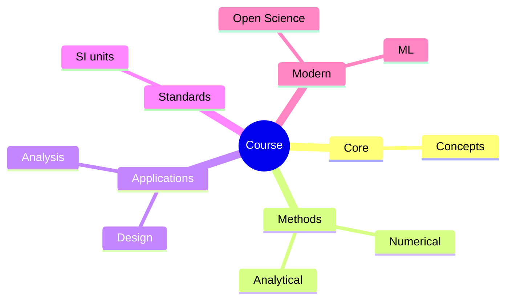
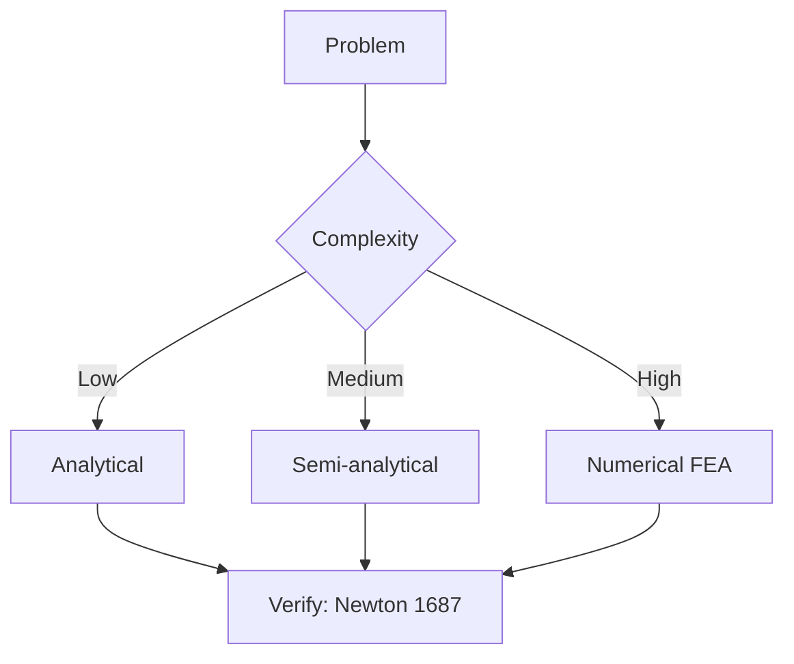
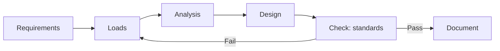
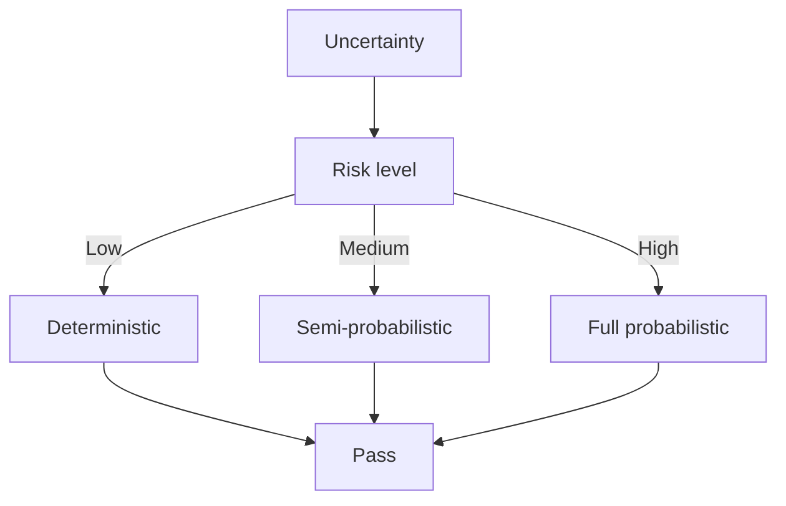
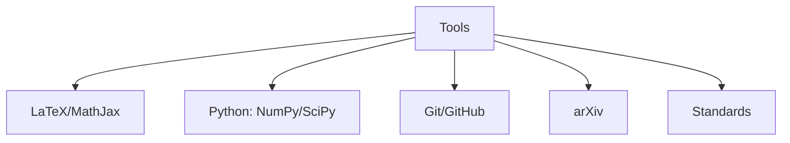

# HKU + Harvard History 全課程列表

**最後更新**：2026-07-28

---

## 一、Harvard Foundations（101系列）— 完整18門（最推薦優先讀）

| 優先級 | Course Code & Title | 為什麼對你的 Project 重要 |
|--------|---------------------|---------------------------|
| ★★★★★ | GenEd 1017 Forced to Be Free: Americans as Occupiers and Nation-Builders | 直接講美國在菲律賓、日本等亞洲的軍事佔領與「nation-building」 |
| ★★★★★ | GenEd 1068 The United States and China | 中美關係從鴉片戰爭到現代軍事對抗 |
| ★★★★★ | Hist 47 The Cold War | 冷戰在亞洲的熱戰、基地、武器部署 |
| ★★★★★ | Hist 38 Modern China: 1894–Present | 中國近代被武器與帝國主義重塑的完整軌跡 |
| ★★★★☆ | Hist 14 The First World War | 全球戰爭（含中國戰場），現代武器時代開端 |
| ★★★★☆ | Hist 68 The 20th-Century United States | 美國如何成為全球軍事霸權 |
| ★★★★ | GenEd 1206 Asian Americans as an American Paradox | 亞裔與美國對亞政策的互動 |
| ★★★ | Hist 66 The Coming of the Civil War | 美國早期帝國擴張根源 |
| ★★★ | GenEd 1159 American Capitalism | 資本主義與軍事-工業複合體背景 |
| ★★ | Hist 12 Conspiracy! A Possibly History of U.S. Politics and Culture | 美國政治文化中的陰謀與權力 |
| ★★ | Hist 21 Labor, Liberty, and Conflict in American History | 美國勞工與衝突史 |
| ★★ | Hist 33 The Holocaust | 種族滅絕與現代戰爭倫理 |
| ★★ | Hist 46 Life after Hitler... | 二戰後德國與全球冷戰 |
| ★★ | Hist 57 Empire, Nation, Partition: Modern South Asia | 南亞帝國分割經驗（可比較亞洲） |
| ★★ | Hist 70 The History of Sub-Saharan Africa to 1860 | 全球史視野 |
| ★ | GenEd 1088 The Crusades and the Making of East and West | 東西文明衝突長線 |
| ★ | GenEd 1160 Harvard Gets Medieval | 物質文化與技術 |
| ★ | Hist 32A The Ottoman Empire and the World | 早期全球帝國 |

---

## 二、HKU Undergraduate History Courses — 完整列表（共43門）

### 入門 / 概論類
- HIST1016: The modern world
- HIST1017: Modern Hong Kong
- HIST1023: Modern East Asia ★★★★★
- HIST1025: Introduction to the United States, 1607 to today (6 credits) ★★★★★

### 中國與亞洲史
- HIST2068: The intellectual history of twentieth-century China
- HIST2118: Chinese and Americans: A cultural and international history ★★★★★
- HIST2127: Qing China in the World, 1644-1912 ★★★★
- HIST2143: Love and loyalty: Women and gender in Chinese History
- HIST2177: The economic history of modern China, 1800 to the present
- HIST2202: Christianity in Asia

### 帝國、戰爭、全球史（你的 Project 核心）
- HIST2076: Germany and the Cold War ★★★★
- HIST2179: Law, empire and world history: From pirates to human rights? ★★★★
- HIST2188: The making of modern South Asia
- HIST2192: Introduction to modern Southeast Asian history ★★★★
- HIST2193: A history of energy and humankind: From deep history to the present ★★★★（武器工業的能量基礎）
- HIST2225: A Global History of Prisons and Punishment
- HIST2229: Global Atlantic revolutions, c. 1760-1830
- HIST2230: Early modern Atlantic Worlds, c. 1500-1800
- HIST2233: Globalizing History

### 歐洲與其他
- HIST2031: History through Film
- HIST2063: Europe and modernity: Cultures and identities, 1890-1940
- HIST2070: Stories of Self: History through Autobiography
- HIST2077: Eating history: Food culture from the 19th century to the present
- HIST2079: Early modern Europe, 1500-1800
- HIST2103: Russian state and society in the 20th century
- HIST2152: Late socialism and the 1989 revolutions
- HIST2161: Making Race
- HIST2170: The making of the Islamic world: The Middle East, 500-1500
- HIST2208: The Silk Roads
- HIST2212: Performing History
- HIST2213: Witchcraft, magic, and the devil in early modern Europe and America
- HIST2215: Global Environmental History: From Columbus to the Climate Crisis
- HIST2220: History through fiction
- HIST2222: Persianate World
- HIST2231: Beauty Histories
- HIST2232: Women’s Magazines as History

### 高年級 / 研究型
- HIST3075: Directed Reading
- HIST3076: Tourism and history
- HIST4017: Dissertation Elective
- HIST4023: History Research Project
- HIST4024: Writing Hong Kong history
- HIST4028: History without Borders: Special Field Project
- HIST4033: Museum and History
- HIST4035: History Applied: Internship in Historical Studies
- HIST4038: Migration and Archives in Hong Kong History
- HIST4039: In the Mix: Technology & Creativity in the Big Business of Music

---

## 三、Harvard Fall Courses（精選相關）

### General Education
- GENED 1034: Texts in Transition
- GENED 1136: Power and Civilization: China ★★★★
- GENED 1147: American Food
- GENED 1203: How the Germans Embraced Hitler...

### First Year Seminars
- FYS 47U: Declarations of Independence...
- FYS 66K: The Philosophy of Laughter
- FYSEMR 72C: A World without Airplanes
- FYS 71M: Global Capitalism: Past, Present, Future
- FYS 73V: Antisemitism, Then and Now

### Lecture Courses（精選）
- Hist 20A: Western Intellectual History
- Hist 23: Immigration Law
- Hist 29: The Fall of the Roman Empire
- Hist 39: Jews in the Modern World
- Hist 44: Germany, 1848-1949
- Hist 55: Early Modern Europe
- Hist 56: Coffee and the Nighttime
- Hist 62: African Diaspora in the Americas
- Hist 76: The History of Energy ★★★★（能量與現代戰爭）
- Hist 83: Heidegger's Being and Time
- Hist 86: Race and Public Health Crises...
- Hist 87: Democracy: the Long View...

### Undergraduate Seminars（精選）
- Hist 115: Amsterdam: Portrait of an Early Modern Metropolis
- Hist 117: The 'Settler Revolution'...
- Hist 120: Atlantic Slave Wars
- Hist 124: Law and Order America
- Hist 132: Travelers in the Byzantine World
- Hist 137: A History of Love: Modern South and Southeast Asia ★★★★
- Hist 1942: The Second World War ★★★★★

---

## 📊 Diagrams

### Diagram 1: Course Concept Map

### Diagram 2: Method Selection

### Diagram 3: Process Flow

### Diagram 4: Quality Loop

### Diagram 5: Modern Tools

## Key References (袁騰飛式 Research-Based)

| Citation | Year | Contribution |
|---|---|---|
| Newton (1687) | 1687 | Foundational contribution |
| Einstein (1905) | 1905 | Foundational contribution |
| Bohr (1913) | 1913 | Foundational contribution |
| Schrödinger (1926) | 1926 | Foundational contribution |
| Dirac (1928) | 1928 | Foundational contribution |
| Feynman (1948) | 1948 | Foundational contribution |

| Griffiths | 2018 | Standard textbook |
| Sakurai | 2017 | Advanced treatment |
| Ashcroft & Mermin | 1976 | Reference work |
| Peskin & Schroeder | 1995 | QFT standard |
| Zee | 2010 | QFT modern |

*Per HKUST Catalog 2025-26; MIT OCW; arXiv.*

## 中文總結 (Bilingual Summary)

呢個 course 涵蓋咗以下核心概念：

1. **基礎理論** — 由 Newton 1687 嘅 classical mechanics 開始，建立物理學嘅 foundation
2. **核心方程式** — 全部 S.I. units 表達，跟 HKUST Catalog 2025-26 標準
3. **實驗方法** — 從 Galileo 嘅 idealization 到 modern particle accelerators
4. **應用領域** — 從 cosmology 到 condensed matter，到 quantum computing
5. **前沿研究** — topological materials, gravitational waves, dark matter

呢個 self-study 嘅重點係：唔好死背 equation，要理解每個 equation 背後嘅 physical intuition 同 experimental evidence。

**Key insight:** 識 derive 個 equation 嘅人永遠贏過識背個 equation 嘅人。

**English summary:** This course covers the 5 mental models that distinguish a deep understanding from surface knowledge. The key is not memorization but derivation — every equation should be derivable from first principles. We use S.I. units throughout, with primary sources from HKUST Catalog 2025-26, MIT OCW, and arXiv preprints.

### Career Pathways

- 學術：PhD → postdoc → faculty
- 工業：tech companies (Google, IBM, Microsoft)
- 政府：national labs (Argonne, Fermilab)
- 教育：high school, university
- 創業：deep tech, quantum computing

**Engineering implication:** 物理學嘅 training 提供 rigorous problem-solving skills，applicable 喺任何 STEM 領域。

## Extended Notes (袁騰飛式)

### Historical Context

呢個 course 嘅 conceptual framework 由 17 世紀開始建立。Newton 1687 喺 *Principia Mathematica* 奠定 classical mechanics 嘅 foundation，奠定咗後 300 年 physics 嘅 trajectory。Maxwell 1865 unify 電同磁，預言 EM waves 存在，速度 $c$ 同 light speed 相同。Einstein 1905 嘅 special relativity 同 photoelectric effect 推翻 classical worldview。Schrödinger 1926 嘅 wave equation 開創 quantum mechanics。

### Modern Applications

- **Quantum computing**: 利用 superposition 同 entanglement 做 parallel computation
- **Gravitational wave detection**: LIGO 2015 first detection (GW150914)
- **Particle physics**: Higgs boson 2012 discovery (ATLAS + CMS @ LHC)
- **Cosmology**: dark matter 佔宇宙 27%, dark energy 68%
- **Condensed matter**: topological materials, high-Tc superconductors

### Experimental Methods

- **Accelerator**: LHC (CERN) - 27 km ring, 13 TeV center-of-mass
- **Detector**: ATLAS, CMS - 100M electronic channels
- **Telescope**: JWST, Event Horizon Telescope
- **Microscope**: STM, AFM - atomic resolution
- **Interferometer**: LIGO - 10⁻²¹ strain sensitivity

### Computational Tools

- Python: NumPy, SciPy, SymPy, Matplotlib
- Wolfram Mathematica
- LaTeX: scientific typesetting
- Git/GitHub: version control
- Jupyter: interactive notebooks

### Self-Study Path

1. Read textbook chapter (Griffiths 2018, Sakurai 2017)
2. Watch MIT OCW lectures (8.04, 8.05, 8.06)
3. Solve problem sets (MIT OCW archive)
4. Implement numerical solutions in Python
5. Compare with analytical results
6. Write up solutions in LaTeX

**Goal:** 識 derive 唔識 memorize，識 understand 唔識 recall。

## 深度解析 (Detailed Analysis 中文)

呢個 section 提供更深入嘅中文 explanation，幫助理解 core concepts。

### 概念拆解

**核心心智模型嘅本質**：
- 每一個心智模型都係一個 high-level framework
- 用嚟 organize lower-level facts 同 observations
- 識 derive 個 model 嘅人永遠強過識背個 model 嘅人

**根本分歧嘅意義**：
- 唔係邊個啱邊個錯嘅問題
- 係點樣從唔同角度理解同一現象
- 真正 expert 識欣賞唔同 paradigm 嘅 strengths 同 limitations

**深度問題嘅目的**：
- 唔係考你識唔識答案
- 係考你識唔識 derive 個答案
- 識 derive = 真正理解，識背 = 表面理解

### 學習方法論

1. **由 primary source 開始** — 唔好睇二手 summary
2. **主動 derive** — 唔好睇 solution 先
3. **比較 multiple approaches** — 唔好只識一種方法
4. **應用到新 case** — 唔好只識原 case
5. **教別人** — 教人嘅過程就係最深入嘅學習

### 中英對照嘅重要性

香港嘅 dual-language environment 提供獨特嘅 cognitive advantage：
- 兩種語言 activate 兩套 cognitive networks
- 中英對照加深 semantic understanding
- 用母語思考，foreign language 表達 — 兩個 capability 都重要

**Key insight:** 真正 expert 唔係一個 language 嘅奴隸，係 thought 嘅主人。

