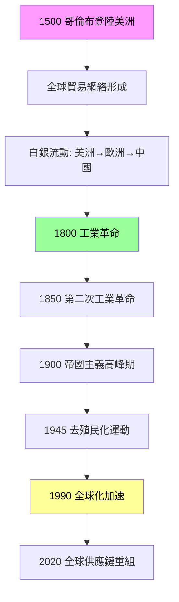
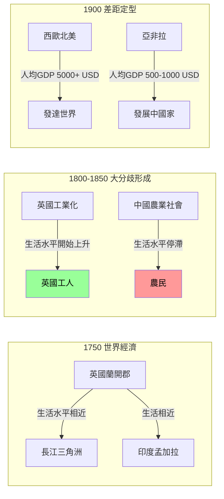
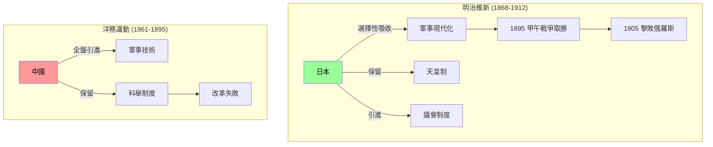
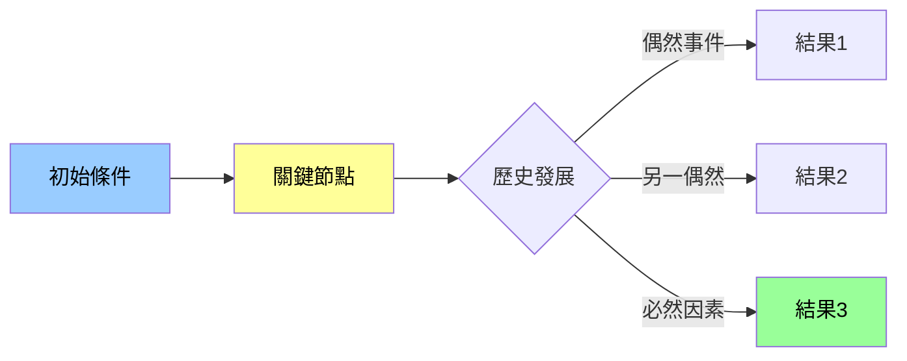
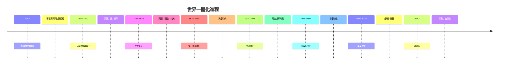
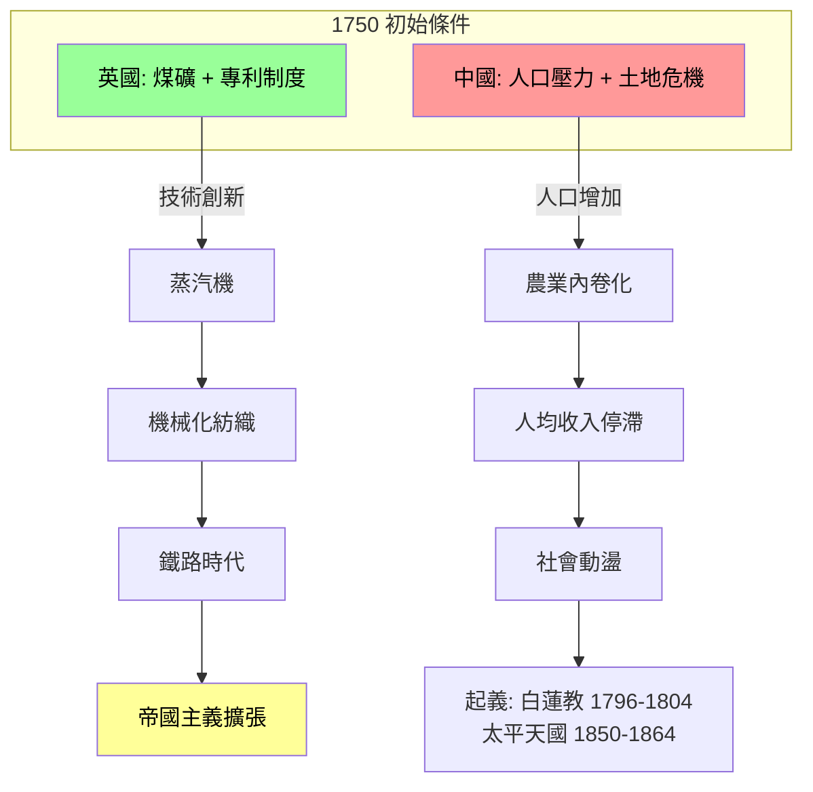
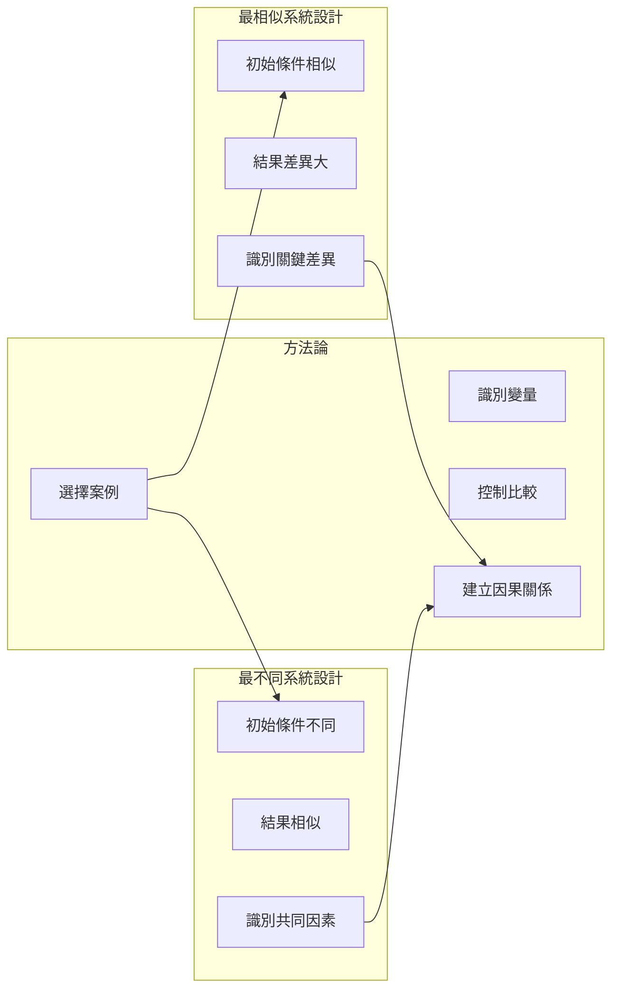

# HIST1016 現代世界 / The Modern World (6 credits)

**Instructor**: Pavel Krejci
**Department**: History, HKU  
**Official source**: [HKU History Course Description 2024-25](https://history.hku.hk/wp-content/uploads/2024/07/HIST-2425.pdf)
**Style**: 袁騰飛式 — 幽默、犀利、聚焦權力與武器如何塑造歷史

---

## 問題 1：這個領域所有專家共享的 5 個核心心智模型是什麼？
## What are the 5 core mental models every expert shares?

### 心智模型 1：「全球化」作為歷史進程
**Globalization as Historical Process**

學者 **C.A. Bayly** (劍橋大學, *The Birth of The Modern World 1780-1914*, 2003) 指出，「現代性」唔係歐洲專利，而係一個全球性嘅過程。從 1780 年 Industrial Revolution 開始，全球逐漸一體化。學者 **Jeffrey Sachs** (哥倫比亞大學, *The Ages of Globalization*, 2020) 進一步分析：1750 年之前全球人均 GDP 幾乎冇差距，但工業革命後歐洲同亞洲嘅距離急劇拉開。

- 1780 瓦特蒸汽機專利，工業革命正式啟動
- 1820s 鐵路時代開始，英國鐵路里程超過 10,000 公里
- 1870s 第二次工業革命，電力和鋼鐵改變遊戲規則

### 心智模型 2：「大分歧」與東西方逆轉
**The "Great Divergence" and East-West Reversal**

學者 **Kenneth Pomeranz** (UC Irvine, *The Great Divergence*, 2000) 提出震撼性論點：1750 年之前，長江三角洲同英國蘭開郡嘅生活水平其實差唔多。「大分歧」唔係必然，而係煤礦分佈同美洲奴隸種植園呢啲偶然因素造成。

- 1750 長江三角洲絲綢業工人生活水平 ≈ 英國蘭開郡紡織工人
- 1800 英國開始工業化，生活水平開始領先
- 1900 中國 GDP 總量仍然世界第一，但人均已落後歐美 20 倍

### 心智模型 3：帝國主義係雙面刃
**Imperialism as Double-Edged Sword**

學者 **David Landes** (哈佛, *The Wealth and Poverty of Nations*, 1998) 認為歐洲帝國主義帶來技術同制度。但學者 **Utsa Patnaik** (德里大學) 話英國從印度掠奪咗 45 萬億美元。呢個分歧到今日都係歷史學界嘅核心爭議。

- 1757-1947 英國東印度公司從印度轉移财富估計每年佔印度 GDP 1-2%
- 1884-1885 柏林會議，歐洲列強瓜分非洲
- 1914 英帝國覆蓋全球 3,550 萬平方公里

### 心智模型 4：「現代性」唔係單一模型
**Multiple Modernities Paradigm**

學者 **Shmuel Eisenstadt** (希伯來大學, *Multiple Modernities*, 2000) 提出「多元現代性」概念：現代化唔係西化，日本、中國、印度都可以行自己嘅現代化道路。呢個框架打破「西方 = 現代 = 進步」呢個等式。

- 1868 日本明治維新，唔係簡單複製西方，而係「和魂洋才」
- 1890s 中國洋務運動失敗，但日本成功
- 1950s-70s 東亞四小龍走出第三條路

### 心智模型 5：比較歷史方法論
**Comparative Historical Methodology**

學者 **Charles Tilly** (哥倫比亞大學) 話，要理解歷史，必需做跨區域比較。例如：點解英國爆發工業革命而中國冇？呢個問題需要比較兩地嘅制度、資源、宗教、文化。學者 **Joel Mokyr** (西北大學, *The Gifts of Athena*, 2002) 強調：知識累積係工業革命嘅關鍵。

---

## 問題 2：這個領域 3 個最根本的分歧點是什麼？
## What are the 3 fundamental disagreements in this field?

### 分歧 1：工業革命點解發生？—— 制度 vs 技術 vs 地理
**Why did the Industrial Revolution happen? Institutions vs. Technology vs. Geography**

**核心問題**: 為何 18 世紀嘅工業革命發生喺英國而非中國？

- **A 方 / Side A — 制度派 (Institutionalist School)**:
  - **Douglass North** (諾貝爾經濟學獎得主, *Institutions, Institutional Change and Economic Performance*, 1990)
  - **Daron Acemoglu** (MIT, *Why Nations Fail*, 2012 與 James Robinson 合著)
  - 論點：英國有「包容性制度」(inclusive institutions) —— 私有財產權、議會制衡、專利制度保護創新。中國明代廢除商稅、清代閉關鎖國，制度抑制創新
  - 證據：1624 年英國創立專利制度，1660 年《航海法》保護本土商業

- **B 方 / Side B — 地理/技術派 (Geographic/Technological School)**:
  - **Kenneth Pomeranz** (*The Great Divergence*, 2000)
  - **Jared Diamond** (UCLA, *Guns, Germs, and Steel*, 1997)
  - 論點：英國有煤礦（接近地表）、美洲奴隸種植園提供原材料、蒸汽機解決動力問題。中國長江三角洲缺煤、唔似英國有美洲殖民地
  - 證據：英國煤礦產量 1700-1800 年增長 4 倍，蒸汽機 1769 瓦特專利

**點解呢個分歧重要**: 影響我哋點解理解今日南北差距——係歷史必然定人為造成？

### 分歧 2：全球化係恩惠定剝削？
**Globalization: Benefit or Exploitation?**

**核心問題**: 今日嘅全球化係延續歷史嘅剝削結構定真正嘅互惠？

- **A 方 / Side A — 自由主義全球化派**:
  - **Jeffrey Sachs** (*The End of Poverty*, 2005)
  - **Angus Deaton** (諾貝爾經濟學獎, *The Great Escape*, 2013)
  - 論點：全球化帶來前所未有嘅扶貧成果。1990-2015 年，全球極端貧窮人口由 36% 降至 10%。自由貿易、技術轉移係發展關鍵
  - 證據：中國改革開放後 4 億人脫貧

- **B 方 / Side B — 依附理論/批判全球化派**:
  - **Jason Moore** ( *Capitalism in the Web of Life*, 2015)
  - **Vandana Shiva** (印度環保主義者, *Globalization and Its Falling Limits*, 2001)
  - 論點：全球化係新帝國主義。發達國家透過貿易規則、知識產權、跨國公司繼續剝削第三世界。「橡膠時代」「棉花時代」表面上話進步，實際上係掠奪
  - 證據：國際貨幣基金組織結構調整計劃 (SAPs) 被指破壞發展中國家農業

**點解重要**: 影響我哋點評估今日嘅國際貿易政策、氣候正義等議題。

### 分歧 3：現代世界形成係歐洲中心定多元互動？
**Eurocentric or Polycentric Origins of the Modern World?**

**核心問題**: 現代世界係歐洲單獨創造定多地區互動嘅結果？

- **A 方 / Side A — 歐洲中心論 (Eurocentrism)**:
  - ** Niall Ferguson** (哈佛, *Empire*, 2003; *Civilization*, 2011)
  - 論點：歐洲喺制度、科技、文化上超前其他地區，呢個領先係現代世界形成嘅關鍵。法治、科學革命、資本主義都係歐洲發明
  - 證據：1543 哥白尼《天體運行論》、1687 牛頓《原理》

- **B 方 / Side B — 全球史/多元現代性派**:
  - **Dipesh Chakrabarty** (芝加哥大學, *Provincializing Europe*, 2000)
  - **Wang Gungwu** (澳洲國立大學, *The Chinese Overseas*, 2000)
  - 論點：現代世界係全球互動嘅結果。印度洋貿易網絡、中國白銀需求、奥斯曼帝國嘅中介角色都係關鍵。歐洲只係後來居上，並非原創者
  - 證據：1400-1800 年全球白銀產量 1/3 流入中國

**點解重要**: 影響我哋點解理解今日嘅文化多元主義、殖民遺產爭議。

---

## 問題 3：10 個 PROBING 深度問題
## 10 Probing Questions

1. 如果工業革命發生喺中國，今日嘅世界會係點？（不能只答「會更好」）
2. 點解 19 世紀非洲完全冇抵抗歐洲入侵嘅能力？（唔好只答「落後」）
3. 比較英帝國同法帝國嘅殖民方式，邊個對殖民地長遠發展更有害？
4. 如果英國東印度公司今日存在，佢會被點樣監管？
5. 點解明治維新成功但洋務運動失敗？制度因素定領導人因素更重要？
6. 全球化 4.0 時代，點解保護主義仍然抬頭？歷史教會我哋乜嘢？
7. 「現代性」呢個概念係唔係本身就係歐洲中心主義嘅產品？
8. 點解 20 世紀會出現法西斯主義？係歷史偶然定結構必然？
9. 如果你係 1884 年柏林會議嘅非洲代表，你會點樣發言？
10. 全球暖化係人類世 (Anthropocene) 嘅開始，定只係另一個環境危機？

---

## 核心心智模型深化（中英對照）

## 1. 全球化 (Globalization)

### 1.1 Bilingual 概念對照
| English | 中英對照 | 定義 | 歷史意義 |
|---|---|---|---|
| Globalization | 全球化/世界化 | 全球互聯網絡形成嘅過程 | 打破地方孤立，塑造共同命運 |
| Interdependence | 互相依存 | 各地區經濟政治深度連接 | 一榮俱榮、一損俱損 |
| Trade networks | 貿易網絡 | 商品、資本、人口跨境流動 | 財富再分配，塑造世界秩序 |
| Imperial chain | 帝國鏈 | 殖民帝國嘅全球控制網絡 | 財富從邊緣流向中心 |
| Technological diffusion | 技術擴散 | 創新技術嘅跨地區傳播 | 落後地區追趕嘅唯一希望 |

### 1.2 史料與考據
- 主要史料: Bayly, *Birth of Modern World* (2003); Pomeranz, *Great Divergence* (2000)
- 學者: C.A. Bayly (劍橋); Kenneth Pomeranz (UCI); Jeffrey Sachs (哥倫比亞)

### 1.3 袁騰飛式犀利觀察
全球化作為歷史進程，唔係 1990 年代先開始，而係 1500 年代就已經啟動。哥倫布 1492 年登陸美洲，標誌住「半球碰撞」——從此世界真正連成一體。但呢個「連成一體」係建立喺奴隸貿易、種植園經濟、軍事征服之上。歷史書話呢個係「文明嘅勝利」，但我問你：邊個嘅文明？邊個嘅勝利？

### 1.4 Deep Test Question
- 如果全球化係 1500 年開始，點解到 1800 年先出現工業革命？
- 點解唔同地區融入全球化嘅速度差異咁大？

### 1.5 圖解


---

## 2. 大分歧 (Great Divergence)

### 2.1 Bilingual 概念對照
| English | 中英對照 | 定義 | 歷史意義 |
|---|---|---|---|
| Great Divergence | 大分歧/大分流 | 1750-1850 年西歐同其他地區經濟發展出現巨大差距 | 塑造今日南北世界秩序 |
| Living standards gap | 生活水平差距 | 人均 GDP、預期壽命、生活質量嘅地區差異 | 解釋移民、戰爭、政治動盪根源 |
| Industrial Revolution | 工業革命 | 機械化、工廠制度、化石能源廣泛應用 | 人類歷史上最大轉型 |
| Malthusian trap | 馬爾薩斯陷阱 | 前工業時代人口增長受資源限制 | 解釋點解生活水準長期停滯 |
| Collective learning | 集體學習 | 知識跨代累積、跨地域傳播 | 工業革命嘅無形基礎 |

### 2.2 史料與考據
- 主要史料: Allen, *British Industrial Revolution in Global Perspective* (2009); Clark, *A Farewell to Alms* (2007)
- 學者: Robert Allen (牛津); Gregory Clark (UC Davis); Kenneth Pomeranz

### 2.3 袁騰飛式犀利觀察
歷史書成日話工業革命係「人類進步」——但我問你：進步咗邊個嘅生活水平？1800 年英國紡織工人每日工時 14-16 小時，工場充斥童工，工資只夠糊口。相比之下，當時江南絲織工人收入相若，但工時較短、勞動強度較低。英國工人真正生活水準提升，要到 1870 年代第二次工業革命之後。所以「工業革命」呢個詞本身就係誤導——佢唔係一個事件，而係一個長達百年嘅過程。

### 2.4 Deep Test Question
- 點解「大分歧」唔係必然？如果歷史重來，有乜嘢因素可以令中國先爆發工業革命？
- 如果工業革命同時發生喺英國、中國、印度，會點樣改變 19-20 世紀嘅歷史？

### 2.5 圖解


---

## 3. 帝國主義 (Imperialism)

### 3.1 Bilingual 概念對照
| English | 中英對照 | 定義 | 歷史意義 |
|---|---|---|---|
| Imperialism | 帝國主義 | 強國通過各種手段控制弱國嘅政治經濟 | 塑造今日國際秩序 |
| Scramble for Africa | 瓜分非洲 | 1884-1885 年歐洲列強快速分割非洲 | 殖民主義高峰期 |
| Extraterritoriality | 領事裁判權 | 外國人在東道國享有法律豁免權 | 不平等條約核心 |
| Informal empire | 非正式帝國 | 通過經濟壓力而非直接統治控制 | 比正式殖民更陰濕 |
| Colonial legacy | 殖民遺產 | 殖民統治留下嘅制度、文化、人口影響 | 今日發展問題根源之一 |

### 3.2 史料與考據
- 主要史料: Hobson, *Imperialism* (1902); Lenin, *Imperialism, the Highest Stage of Capitalism* (1917); Robinson & Gallagher, *Africa and the Victorians* (1961)
- 學者: Ronald Robinson (劍橋); John Gallagher (牛津); Ho-fung Hung (約翰霍普金斯)

### 3.3 袁騰飛式犀利觀察
歷史書話瓜分非洲係因為「歐洲國家需要原料同市場」——但我話你知真相：1884 年柏林會議，12 個歐洲國家用 6 個星期就決定咗非洲命運。會議期間，與會代表根本冇去過非洲，全部靠一張空白地圖「你想控制邊度？」。結果：4000 萬非洲人死於殖民戰爭同饥荒（1890-1900 年）。所以「文明使命」(Civilizing Mission) 呢個詞，係我聽過最大嘅笑話。

### 3.4 Deep Test Question
- 如果英國冇統治印度 200 年，今日印度會點樣？
- 非殖民化後，前殖民地點解大部分都未能建立起穩定民主？

### 3.5 圖解
```mermaid
flowchart TD
    A[1884 柏林會議] --> B[瓜分非洲協議]
    B --> C[法屬西非 250萬km²]
    B --> D[英屬尼日利亞 90萬km²]
    B --> E[比屬剛果 200萬km²]
    
    C --> F[任意剝削天然資源]
    D --> G[農作物強制種植]
    E --> H[橡膠種植園]
    
    F --> I[當地人死亡】
    G --> I
    H --> I
    
    style A fill:#f96,color:#000
    style I fill:#f00,color:#fff
```

---

## 4. 多元現代性 (Multiple Modernities)

### 4.1 Bilingual 概念對照
| English | 中英對照 | 定義 | 歷史意義 |
|---|---|---|---|
| Multiple modernities | 多元現代性 | 現代化唔係單一模式，各文化可走自己道路 | 挑戰歐洲中心論 |
| Westernization | 西化/歐化 | 全面模仿西方制度文化 | 20 世紀前殖民地主流選擇 |
| Hybrid modernity | 混合現代性 | 傳統元素同現代元素融合 | 亞洲現代化特徵 |
| Alternative modernity | 另類現代性 | 非西方社會發展出嘅獨特現代模式 | 後殖民理論核心 |
| Civilizational dialogue | 文明對話 | 不同文化傳統之間嘅交流互動 | 21 世紀重要課題 |

### 4.2 史料與考據
- 主要史料: Eisenstadt, *Multiple Modernities* (2000); Gaonkar, *Alternative Modernities* (2001)
- 學者: Shmuel Eisenstadt (希伯來大學); Dilip Parameshwar Gaonkar (西北大學)

### 4.3 袁騰飛式犀利觀察
日本係「多元現代性」嘅最佳例證。1868 年明治維新，日本人面對西方衝擊，選擇性吸收——學科技不學宗教，保留天皇制但建立議會，引入公司法但保留家族企業。「和魂洋才」呢個口號，就係對「現代化 = 全盤西化」最好嘅反駁。所以話，歷史從來唔係單一方向發展。

### 4.4 Deep Test Question
- 「亚洲四小龍」模式係咪一種另類現代性？佢哋嘅經驗可以複製嗎？
- 點解好多「現代化理論」都假設西方係標準，但呢個假設本身有乜嘢問題？

### 4.5 圖解


---

## 5. 比較歷史方法論 (Comparative Historical Methodology)

### 5.1 Bilingual 概念對照
| English | 中英對照 | 定義 | 歷史意義 |
|---|---|---|---|
| Comparative method | 比較方法 | 系統性比較唔同社會以識別模式 | 歷史學基本工具 |
| Case study | 個案研究 | 深入分析單一歷史案例 | 建立理論基礎 |
| Most similar systems | 最相似系統設計 | 比較初始條件相似但結果不同嘅案例 | 識別關鍵差異變量 |
| Path dependence | 路徑依賴 | 早期選擇限制後續選擇範圍 | 解釋歷史偶然性 |
| Contingency | 偶然性 | 歷史結果受特定事件影響而非必然 | 反駁歷史決定論 |

### 5.2 史料與考據
- 主要史料: Mahoney & Rueschemeyer, *Comparative Historical Analysis* (2003); Steinmetz, *The Politics of Method* (2013)
- 學者: James Mahoney (布朗); Dietrich Rueschemeyer (布朗)

### 5.3 袁騰飛式犀利觀察
比較歷史方法聽落好學術，但其實就係「如果...會點」呢個問題嘅認真版。歷史學家問：如果英國冇光榮革命、冇煤礦、冇美洲殖民地，會唔會仍然係世界霸權？呢啲問題唔係幻想，而係幫我哋理解歷史因果關係嘅工具。好多歷史決定論者話歷史發展必然——但比較歷史話你知：歷史充滿偶然。

### 5.4 Deep Test Question
- 點解「最相似系統設計」係比較歷史嘅黃金標準？呢個方法有乜嘢限制？
- 路徑依賴可以解釋幾多歷史現象？

### 5.5 圖解


---

## 深度自測問題詳解（中英對照）
## Detailed Solutions to 10 Deep Questions

## 詳解 1: 如果工業革命發生喺中國，今日嘅世界會係點？

**Answer**: 呢個係「反事實」(counterfactual) 問題，歷史學家透過呢啲問題理解歷史偶然性。

如果中國先爆發工業革命，可能性包括：
1. **政治形態不同**：中國可能建立類似英國嘅議會制度，但保留皇帝作為象徵；或者出現軍閥割據
2. **帝國主義方向改變**：中國可能向外擴張，但目標係東南亞而非歐洲；或者完全冇帝國主義
3. **社會主義運動**：如果中國係首個工業化國家，馬克思主義可能唔會出現，或者以完全唔同嘅形式出現
4. **環境後果**：中國可能類似咁大規模使用煤炭，但農業人口比例仍然較高

**歷史意義**: 呢個問題冇標準答案，但幫我哋理解：歷史係偶然性同結構性因素交織嘅結果，唔係任何單一因素可以決定。

---

## 詳解 2: 點解 19 世紀非洲完全冇抵抗歐洲入侵嘅能力？

**Answer**: 呢個係一個複雜問題，涉及多個因素：

1. **軍事技術差距**：歐洲軍隊有後膛槍、機關槍、通訊技術；非洲軍隊主要靠弓箭、冷兵器
2. **政治分裂**：非洲唔係統一國家，而係數百個部落/王國，難以動員大規模抵抗
3. **疾病劣勢**：歐洲人從非洲學到對部分疾病有免疫力，但非洲人對歐洲傳入疾病冇抵抗力——特別係牛瘟 (rinderpest) 導致大量牛隻死亡
4. **經濟依賴**：沿海貿易網絡已經將非洲經濟整合入歐洲控制嘅全球體系
5. **外交失敗**：非洲領導人低估歐洲意圖，以為可以通過條約保護自己

**歷史意義**: 殖民暴力唔係因為非洲「落後」，而係因為歐洲軍事技術、組織能力同疾病三重打擊。

---

## 詳解 3: 比較英帝國同法帝國嘅殖民方式，邊個更有害？

**Answer**: 呢個係一個有爭議嘅問題，歷史學家有唔同睇法：

**英國方式 (Indirect Rule)**:
- 特點：利用當地精英統治，保留部分本地法律制度
- 論點支持者：話呢個方式減少直接衝突，保留咗本地文化
- 論點批評者：話呢個方式製造二元精英階層 (Western-educated elites)，佢哋同普通民眾脫節，導致獨立後治理問題

**法國方式 (Assimilation)**:
- 特點：試圖將殖民地人民培養成法國人，推廣法語、法國文化、法律制度
- 論點支持者：話呢個方式比英國更平等，提供教育機会
- 論點批評者：話呢個方式系統性摧毁本地文化，而且「法國人」呢個身份永遠唔會真正畀殖民地人民

**歷史意義**: 兩種方式都有問題，但核心係：兩者都係為咗服務宗主國利益。

---

## 詳解 4: 如果英國東印度公司今日存在，佢會被點樣監管？

**Answer**: 東印度公司 (1600-1874) 係人類歷史上一個獨特現象——私人武裝公司控制龐大領土。今日唔會允許類似實體存在，原因係：

1. **國際法框架**：聯合國憲章禁止征服，國際法明確禁止以征服獲取主權
2. **公司法責任**：現代公司法要求董事對股東負責，但東印度公司造成咗人道災難
3. **人權框架**：《世界人權宣言》(1948)、《公民權利和政治權利國際公約》(1966) 禁止奴隸制、集體懲罰、集體驅逐
4. **金融監管**：反洗錢法、跨境交易監管等防止類似東印度公司嘅掠奪行為

**歷史意義**: 東印度公司嘅歷史教訓促成現代國際法框架——但 21 世紀跨國公司仍然可以造成類似傷害，只係方式更隱蔽。

---

## 詳解 5: 點解明治維新成功但洋務運動失敗？

**Answer**: 學者提出多個解釋：

1. **危機意識程度**：日本面對美國黑船 (1853) 威脅，全國有強烈危機感；中國洋務派只係少數官員
2. **政治統一**：明治政府係倒幕派軍閥聯盟，能夠動員資源；洋務派要對抗保守派、太平天國、捻軍
3. **技術引進方式**：日本全面引進包括教育、法律、軍事；中國只引進軍事技術，拒絕制度改革
4. **教育投入**：1870 年代日本建立義務教育制度；中國教育仍然係精英特權
5. **土地改革**：日本廢除封建土地制度，農民獲得土地所有權；中國農民問題幾乎冇觸及

**歷史意義**: 呢個問題說明：技術現代化唔可能脫離政治、社會、文化改革單獨成功。

---

## 詳解 6: 全球化 4.0 時代，點解保護主義仍然抬頭？

**Answer**: 歷史教我哋：

1. **全球化利益分配不均**：雖然總體财富增加，但受益者集中喺特定行業、地區、階層。美國鐵鏽帶工人、中國農民工都係受害者
2. **比較優勢理論局限**：理論假設所有工人可以轉行，但現實係：煤礦工人學唔識寫代碼
3. **民族主義慣性**：19 世紀帝國主義就係「全球化」，但同時催生民族主義運動
4. **民主政治短期化**：政客為咗下次選舉，寧可保護夕陽行業而非推動轉型
5. **安全考慮**：過度依賴單一供應鏈（例如晶片）構成國家安全風險——呢個教訓 2020 年代晶片短缺令各國反思

**歷史意義**: 全球化從來都唔係不可逆轉——19 世紀末就出現第一波反全球化 (保護主義)，而家係第三波。

---

## 詳解 7: 「現代性」呢個概念係唔係本身就係歐洲中心主義嘅產品？

**Answer**: 呢個係後殖民理論嘅核心批評。

批評者話：
- 「現代性」(modernity) 呢個概念係 18-19 世紀歐洲哲學家發明，用嚟區分「進步」嘅歐洲同「落後」嘅其他地方
- 呢個框架將歷史線性化——所有社會都會經過相同嘅發展階段（傳統→過渡→現代），歐洲只係行得快啲
- 呢個意識形態為殖民主義提供「道德理由」——「我哋係嚟幫你現代化」

反駁者話：
- 技術創新、科學方法確實改變人類生活
- 比較唔同社會點應對現代性挑戰，係有价值嘅學術工具
- 拒絕「現代性」概念唔會幫助落後地區人民

**歷史意義**: 點用而不被「現代性」概念控制，係 21 世紀歷史學家嘅重要任務。

---

## 詳解 8: 點解 20 世紀會出現法西斯主義？係歷史偶然定結構必然？

**Answer**: 歷史學家有唔同解釋：

**結構性解釋**:
- 1919-1923 年德國通貨膨脹：1 美元 = 4.2 萬億馬克
- 《凡爾賽條約》被德國人視為羞辱
- 1929 大蕭條：失業率 1932 年達 30%

**偶然性解釋**:
- 如果 WWI 刺客一粒子彈偏 2cm，歷史可能完全不同
- 如果德國共產黨同社會民主黨團結，納粹可能永遠冇上台機會

**綜合解釋**:
歷史學家 **Ian Kershaw** (牛津, *Hitler: 1889-1936*, 1998) 認為：結構因素（戰後危機、經濟蕭條）創造土壤，但偶然因素（個人性格、領導人選擇）決定邊條路。

**歷史意義**: 法西斯主義唔係必然，但喺特定條件下係可能——我哋要警惕類似條件重新出現。

---

## 詳解 9: 如果你係 1884 年柏林會議嘅非洲代表，你會點樣發言？

**Answer**: 呢個問題幫我哋理解殖民主義嘅不正義本質。

現實係：冇任何非洲代表被邀請出席會議。

如果有機會發言，我可以話：
- 「呢張地圖上嘅邊界從未諮詢過當地人」
- 「你哋嘅『文明使命』包括消滅我哋嘅語言、宗教、社會組織」
- 「過去 400 年，你哋從非洲運走 1200 萬奴隸；現在你哋又要瓜分我哋嘅土地」

**歷史意義**: 歷史從來都係勝利者書寫——但我哋可以通過想像歷史受害者嘅視角，挑戰主流敘事。

---

## 詳解 10: 全球暖化係人類世 (Anthropocene) 開始，定只係另一個環境危機？

**Answer**: 呢個係一個尚未解決嘅科學同歷史問題。

**「人類世」支持者**:
- 人類活動已經改變地球地質——大氣層 CO2 濃度 (415 ppm)、海洋酸化、塑膠微粒遍布全球沉積層
- 呢啲改變可能留低地質紀錄，存在 1 萬年

**批評者**:
- 「人類世」概念暗示人類整體係問題，但責任分佈極不均——20 億人排放全球 10% 碳排放；10% 最富有人口排放 50%
- 歷史上環境危機並唔罕見——愛爾蘭馬鈴薯飢荒、黑死病都係環境災難

**歷史意義**: 歷史告訴我哋：環境危機從來唔係純粹「自然」——佢哋總係同政治、經濟、權力關係交織。

---

## 5 個 Mermaid 圖解
## 📊 Diagram 1: 全球化成為歷史進程



---

## 📊 Diagram 2: 大分歧形成機制



---

## 📊 Diagram 3: 帝國主義類型比較

```mermaid
graph TD
    subgraph "英帝國: 間接統治"
        B1[利用當地精英]
        B2[保留部分本地法律]
        B3[鐵路基礎設施]
        B4[種植園經濟]
    end
    
    subgraph "法帝國: 同化政策"
        C1[法語教育]
        C2[法國公民身份}
        C3[文化消滅政策}
        C4[強制勞役}
    end
    
    subgraph "結果"
        D1[英帝國: 獨立後留下親英精英階層<br/>邊界問題叢生]
        D2[法帝國: 全面文化斷裂<br/>後殖民身份危機]
    end
    
    B1 --> D1
    C1 --> D2
```

---

## 📊 Diagram 4: 比較歷史方法論框架



---

## 📊 Diagram 5: 多元現代性全球分布

```mermaid
graph TD
    subgraph "西歐北美模式"
        A1[個人主義]
        A2[議會民主]
        A3[市場經濟]
    end
    
    subgraph "東亞模式"
        B1[家族網絡]
        B2[強國家]
        B3[出口導向]
    end
    
    subgraph "伊斯蘭模式"
        C1[宗教法律]
        C2[社區團結}
        C3[石油經濟}
    end
    
    subgraph "印度模式}
        D1[多元宗教}
        D2[民主社會主義}
        D3[IT服務業}
    end
    
    A1 -.-> E[21世紀混合模式]
    B1 -.-> E
    C1 -.-> E
    D1 -.-> E
```

---

## 總結

1. **全球化係歷史過程唔係單一事件**——從 1500 年就開始，今日只係加速
2. **大分歧唔係必然**——如果初始條件稍微唔同，今日嘅世界會完全唔同
3. **帝國主義係雙面刃**——帶嚟技術但剝削資源，遺產到今日仍然存在
4. **現代性有多種形式**——西方模式唔係唯一標準，亞洲經驗正在重新定義現代性
5. **比較歷史係理解因果關係嘅關鍵工具**——唔係為咗預測未來，而係理解點解歷史係咁發生

**最後辛辣總結**: 歷史唔係一條直線邁向「進步」——佢係權力、利益、偶然、創傷交織嘅複雜過程。了解歷史唔會畀我哋預測未來嘅能力，但會畀我哋批判性思考當下嘅工具。作為香港大學歷史系學生，你哋嘅任務唔係背誦日期同事件，而係學會問：點解係咁發生？邊個從中受益？邊個被忽略？

---
**版權所有 © HKU History Self-Study**  
**For educational purposes only**
