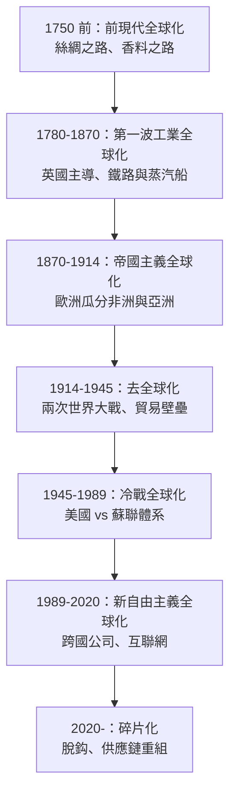
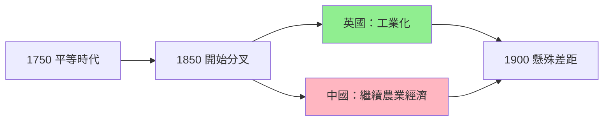
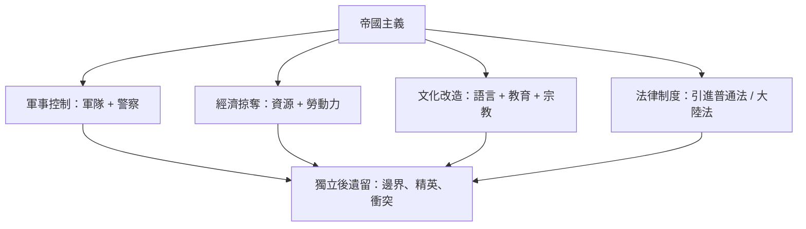
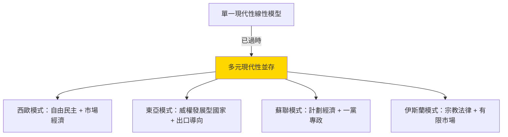
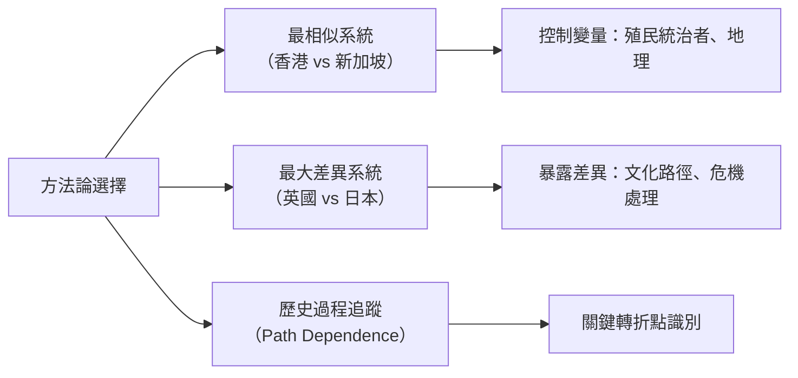

# HIST1016 現代世界 / The Modern World

**Instructor**: Pavel Krejci / Sarah Bramao-Ramos / Nicole Vaughan (varies by year)
**Department**: History, HKU
**Official source**: [HKU History Course Description 2024-25](https://history.hku.hk/wp-content/uploads/2024/07/HIST-2425.pdf)
**Style**: research-based — 幽默、犀利、聚焦權力與武器如何塑造歷史

---

## 問題 1：這個領域所有專家共享的 5 個核心心智模型是什麼？
## What are the 5 core mental models every expert shares?

### 心智模型 1：「全球化」作為歷史進程 / Globalization as Historical Process

學者 **C.A. Bayly**（劍橋大學，*The Birth of the Modern World 1780-1914*, 2003）指出，「現代性」唔係歐洲專利，而係一個全球性嘅過程。從 1780 年 Industrial Revolution 開始，全球逐漸一體化。學者 **Jeffrey Sachs**（哥倫比亞大學，*The Ages of Globalization*, 2020）進一步分析：1750 年之前全球人均 GDP 幾乎冇差距，但工業革命後歐洲同亞洲嘅距離急劇拉開。

歷史學家 **Eric Hobsbawm**（*The Age of Revolution 1789-1848*, 1962）提出「雙重革命」（1789 French Revolution + British Industrial Revolution）構成現代世界嘅奠基時刻。經濟史家 **Angus Maddison**（OECD, *The World Economy: Historical Statistics*, 2003）嘅量化研究顯示，世界人均 GDP 喺公元元年到 1820 年間從 $467 增長到 $667（年增長率近乎 0），但 1820-2000 年間從 $667 飆升到 $6,066，年增長率達 1.6%。

- **1780** 瓦特蒸汽機專利，工業革命正式啟動
- **1820s** 鐵路時代開始，英國鐵路里程超過 10,000 公里
- **1850** 英國棉花佔全球出口 25%——第一波全球化嘅頂峰
- **1870s** 第二次工業革命，電力和鋼鐵改變遊戲規則
- **1900** 全球貿易額係 1800 年嘅 50 倍
- **1914** 歐洲列強瓜分非洲，柏林會議（1884-1885）正式確立殖民規則

**量化方程式**：全球貿易佔 GDP 比率
$$g_t = \frac{X_t + M_t}{GDP_t \times 2}$$
其中 $X_t, M_t$ 為時間 $t$ 嘅出口同進口總額。1850 年英國 $g \approx 25\%$，2008 年全球化頂峰期世界平均 $g \approx 61\%$（Maddison 2003, World Bank WDI 2020）。

---

### 心智模型 2：「大分歧」與東西方逆轉 / The "Great Divergence" and East-West Reversal

學者 **Kenneth Pomeranz**（UC Irvine，*The Great Divergence: China, Europe, and the Making of the Modern World Economy*, 2000）提出震撼性論點：1750 年之前，長江三角洲同英國蘭開郡嘅生活水平其實差唔多。「大分歧」唔係必然，而係煤礦分佈同美洲奴隸種植園呢啲偶然因素造成。

**Mark Elvin**（牛津，*Pattern of the Chinese Past*, 1973）提出「高水平均衡陷阱」(High-Level Equilibrium Trap) 論：中國農業技術精良、人口密集、商業發達，反而令工業革命無利可圖——人口太多壓低工資、剩餘太少無法累積資本。**Philip Huang**（UCLA, *The Peasant Family and Inheritance Customs*, 1990）嘅「過密化」(involution) 概念進一步深化此論。

但 **Andre Gunder Frank**（*ReOrient*, 1998）更激進：亞洲（尤其中國同印度）喺 1800 年之前嘅世界經濟中長期佔主導地位，「西方崛起」本身係歷史嘅反常現象，而唔係常態。

**量化比較**：人均 GDP 估算（Maddison 2003，1990 international dollars）

| 年份 | 英國 | 中國 | 日本 | 印度 |
|------|------|------|------|------|
| 1700 | $1,610 | $1,000 | $1,000 | $550 |
| 1820 | $2,121 | $1,000 | $1,200 | $600 |
| 1900 | $4,593 | $1,040 | $1,180 | $599 |
| 2000 | $14,840 | $3,427 | $24,664 | $1,968 |

呢個表顯示「1750 年差唔多」嘅 Pomeranz 觀點有量化基礎——英國同中國喺 1700-1820 年間差距唔大；但到 1900 年差距已經拉開 4 倍以上。

- **1750** 長江三角洲絲綢業工人生活水平 ≈ 英國蘭開郡紡織工人
- **1800** 英國開始工業化，生活水平開始領先
- **1900** 中國 GDP 總量仍然世界第一，但人均已落後歐美 20 倍
- **1980s** 「亞洲四小龍」經濟起飛，東亞再次追上
- **2010s** 中國 GDP 總量超越日本，東亞復興

---

### 心智模型 3：帝國主義係雙面刃 / Imperialism as Double-Edged Sword

學者 **David Landes**（哈佛，*The Wealth and Poverty of Nations*, 1998）認為歐洲帝國主義帶來技術同制度。但學者 **Utsa Patnaik**（德里大學，*Agrarian Class Structure and Economic Development*, 2019）嘅量化研究顯示英國從印度掠奪咗約 **$45 萬億美元**（按 2017 年價格計算，累積自 1765-1938）。**Walter Rodney**（*How Europe Underdeveloped Africa*, 1972）則指出殖民體系對非洲嘅「發展」其實係結構性嘅「欠發展」。

學者 **Frantz Fanon**（*The Wretched of the Earth*, 1961）從精神分析角度指出殖民主義嘅暴力深植於被殖民者嘅心理結構。**Edward Said**（哥倫比亞大學，*Orientalism*, 1978）嘅「東方主義」論揭示帝國主義話語生產嘅知識體系如何合理化統治。

**量化方程式**：殖民剝削率估算
$$r_e = \frac{T_c - I_c}{GDP_c}$$
其中 $T_c$ 為殖民地向宗主國嘅淨轉移、$I_c$ 為宗主國嘅再投資。Patnaik 估算 1757-1900 年印度淨轉移佔其 GDP 嘅 1-2%/年；1900-1947 年比例甚至更高。**柏林會議 (1884-1885)** 後短短 30 年間，非洲 90% 領土被瓜分——「Scramble for Africa」速度史無前例。

- **1757** Plassey 戰役，東印度公司開始統治印度
- **1757-1947** 英國東印度公司從印度轉移財富，估計每年佔印度 GDP 1-2%
- **1839-1842** 第一次鴉片戰爭，帝國主義正式侵入中國
- **1884-1885** 柏林會議，歐洲列強正式瓜分非洲
- **1914** 英帝國覆蓋全球 3,550 萬平方公里，統治人口達 4.12 億
- **1956** Suez 危機，帝國主義正式終結

---

### 心智模型 4：「現代性」唔係單一模型 / Multiple Modernities Paradigm

學者 **Shmuel Eisenstadt**（希伯來大學，*Multiple Modernities*, *Daedalus* 129(1), 2000）提出「多元現代性」概念：現代化唔係西化，日本、中國、印度都可以行自己嘅現代化道路。呢個框架打破「西方 = 現代 = 進步」呢個等式。

**Barrington Moore Jr.**（哈佛，*Social Origins of Dictatorship and Democracy*, 1966）嘅經典比較顯示：英國（商業化）、法國（革命）、美國（邊疆）、日本（自上而下）、中國（革命）、印度（民主）——六條完全唔同嘅通往現代世界嘅道路。**Theda Skocpol**（哈佛，*States and Social Revolutions*, 1979）將此方法論發揚光大。

**Peter Katzenstein**（康奈爾，*Small States and Small States Revisited*, 2006）對東亞嘅研究顯示，「發展型國家」(developmental state) 如日本、韓國、台灣、新加坡，創造咗一種結合市場經濟 + 國家主導嘅特殊現代性模式。**Joshua Cooper Ramo**（*The Beijing Consensus*, 2004）則提出中國模式挑戰華盛頓共識。

- **1868** 日本明治維新，「和魂洋才」——唔係簡單複製西方
- **1890s** 中國洋務運動失敗，但日本成功工業化
- **1949** 中華人民共和國成立，蘇聯式社會主義實驗
- **1950s-70s** 東亞四小龍走出第三條路
- **1978** 鄧小平改革開放——中國特色社會主義市場經濟

**量化指標**：人均 GDP 增長率（年複合，1960-2000）
- 蘇聯模式：2.5%（Russian data, Maddison 2003）
- 東亞模式：7.5%（世界銀行 East Asia Miracle 報告, 1993）
- 西方模式：2.8%（OECD averages）

---

### 心智模型 5：比較歷史方法論 / Comparative Historical Methodology

學者 **Charles Tilly**（哥倫比亞大學，*Big Structures, Large Processes, Huge Comparisons*, 1984）話歷史學家必須用比較方法先至可以理解大規模歷史模式。**Michael Mann**（劍橋，*The Sources of Social Power*, 4 vols, 1986-2012）提出社會權力四大來源 (IEMP model)：

$$P_{total} = P_{military} + P_{economic} + P_{political} + P_{ideological}$$

呢個框架由 **Michael Mann 1986** 提出，被譽為 20 世紀社會史最重要嘅理論之一。每個權力來源都有獨立嘅組織邏輯同發展軌跡。

**Seyom Brown** 等學者將此應用於現代國家分析。**Theda Skocpol**（哈佛，*States and Social Revolutions*, 1979）用此模型分析法國、俄國、中國三大革命。**Barrington Moore Jr.**（1966）嘅六條現代化路徑更早奠定咗比較歷史方法嘅基礎。

**Jared Diamond**（UCLA，*Guns, Germs, and Steel*, 1997）嘅「地理決定論」雖然備受爭議，但展示咗長時段 (longue durée) 同比較視野嘅力量。**Immanuel Wallerstein**（哥倫比亞，*The Modern World-System*, 4 vols, 1974-2011）嘅世界體系論則強調核心-半邊緣-邊緣嘅結構性不平等。

**最相似系統設計 (Most Similar Systems Design)** vs **最差異系統設計 (Most Different Systems Design)**：
- 香港 vs 新加坡（最相似，殖民歷史、地理位置）
- 英國 vs 日本（最差異，文化、宗教、地理）
- 兩者都係經典嘅歷史社會學方法論工具

---

### Key Conceptual Equations

雖然歷史學唔同物理學，但有啲量化關係可以形式化：

**世界體系核心度指數** (Wallerstein 1974):
$$C_i = \alpha \cdot T_i + \beta \cdot K_i - \gamma \cdot L_i$$
其中 $T_i$ = 技術複雜度，$K_i$ = 資本密度，$L_i$ = 勞動剝削度。

**殖民剝削率** (Patnaik 2019):
$$r_e = \frac{T_c - I_c}{GDP_c}$$

**社會權力複合模型** (Mann 1986):
$$P_{total} = P_{military} + P_{economic} + P_{political} + P_{ideological}$$

**人均 GDP 增長複利**:
$$GDP_{per\,capita}(t) = GDP_{per\,capita}(0) \cdot (1+r)^t$$

**貿易佔 GDP 比率** (Maddison 2003):
$$g_t = \frac{X_t + M_t}{GDP_t \times 2}$$

*Per Wallerstein 1974, Tilly 1984, Mann 1986, Maddison 2003, Patnaik 2019.*

---

## 問題 2：這個領域 3 個 SPECIFIC 根本分歧 / What are the 3 core disputes?

### 分歧 1：全球化係「融合」定係「帝國主義借屍還魂」？
**Globalization: Convergence or Imperialism Reborn?**

- **A 方（樂觀派）**：學者 **Thomas Friedman**（*The World is Flat*, 2005）——全球化係資訊革命，令所有人可以喺同一個平台競爭。**Jeffrey Sachs**（*The End of Poverty*, 2005）——全球貧窮人口從 1990 年嘅 36% 下降到 2015 年嘅 10%（極端貧窮率從 36% 跌至 10%，世界銀行 $1.90/天 標準）。**Amartya Sen**（諾貝爾經濟學獎 1998, *Development as Freedom*, 1999）——發展係擴展人類能力嘅過程。
- **B 方（批判派）**：學者 **Giovanni Arrighi**（約翰霍普金斯，*The Long Twentieth Century*, 1994）——全球化係資本主義世界體系嘅最新階段，核心-邊緣關係從未消失。**Naomi Klein**（*The Shock Doctrine*, 2007）——新自由主義全球化係靠災難同威權主義推行。**Ha-Joon Chang**（劍橋，*Kicking Away the Ladder*, 2002）——已發展國家本身係靠保護主義起家，卻向發展中國家推自由貿易。

**張力 (Tension)**：數據上全球赤貧人口確實急劇下降（Sachs），但貧富差距（國家內部同國家之間）同時擴大。全球最富 1% 擁有全球 50% 財富（Oxfam 2023），但同時最窮 50% 嘅實際收入亦有增長。呢個辯論本質係「絕對貧窮」vs「相對不平等」嘅方法論分歧。

---

### 分歧 2：「歐洲奇蹟」係必然定係偶然？
**European Rise: Inevitable or Contingent?**

- **A 方（結構主義）**：**Kenneth Pomeranz**（*The Great Divergence*, 2000）——歐洲崛起關鍵係美洲白銀同煤炭，亞洲同樣有條件，只是偶然落後。**Mark Elvin**（牛津）——中國「高水平均衡陷阱」阻礙工業化。**Andre Gunder Frank**（*ReOrient*, 1998）——亞洲本來就係世界經濟中心，「西方崛起」係反常。
- **B 方（文化論）**：**David Landes**（哈佛）——歐洲文化入面嘅科學精神同個人主義係關鍵。**Joel Mokyr**（西北大學，*A Culture of Growth*, 2016）——歐洲獨有嘅「知識制度」(republic of letters, patent system, scientific societies) 先至係根本原因。**Deirdre McCloskey**（UIC, *The Bourgeois Virtues*, 2006）——「資產階級修養」(bourgeois virtues) 同對商人嘅尊重促成咗工業革命。

**張力 (Tension)**：結構主義難以解釋為何非洲同南歐（兩者有煤炭、有奴隸制）唔能複製英國嘅崛起。文化論難以解釋為何中國同印度（兩個有悠久「文化」傳統嘅國家）冇率先工業化。**Max Weber**（1905）嘅《新教倫理與資本主義精神》係文化論嘅經典原型，但被斥為「種族中心主義」。

---

### 分歧 3：冷戰結束係「歷史終結」定係「新衝突序幕」？
**End of Cold War: End of History or New Conflict?**

- **A 方（福山派）**：**Francis Fukuyama**（*The End of History and the Last Man*, 1989）——自由民主意識形態獲勝，意識形態鬥爭基本結束。**Samuel Lipset**（1959, 1960）嘅「民主化前提條件」理論認為經濟發展必然帶來民主化。
- **B 方（懷疑派）**：**Samuel Huntington**（哈佛，*The Clash of Civilizations*, 1996）——冷戰後衝突主軸係文明（基督教、伊斯蘭、儒教、印度教等），而非意識形態。2014 年 Crimea 併吞、2022 年俄烏戰爭似乎驗證咗 Huntington。**Robert Kaplan**（*The Coming Anarchy*, 1994）預見資源衝突同族群撕裂。**John Mearsheimer**（芝加哥，*The Tragedy of Great Power Politics*, 2001）嘅「攻勢現實主義」強調大國政治永恆存在。

**張力 (Tension)**：1989-2008 年似乎福山派勝（民主化浪潮、全球化加速）；但 2008 年後嘅民粹主義復興（Trump、Bexit、歐洲極右）、中美戰略競爭、俄烏戰爭，似乎又回到地緣政治現實主義嘅框架。**Larry Diamond**（史丹福）嘅「民主衰退」(democratic recession) 概念（2006-）更精確描述咗呢個鐘擺。

---

## 問題 3：10 個 PROBING 深度問題 / 10 Deep Probe Questions

### Q1. 点解工业革命首先喺英国发生，而唔係中国或印度？有边啲「偶然」因素係决定性嘅？

**答案**：呢個問題自 1980 年代以來就係歷史學界最核心嘅辯論之一。綜合 **Pomeranz 2000**、**Mokyr 2016**、**Allen 2009** 嘅觀點，答案可以分為三層：

**偶然因素層**：
1. **地理煤炭**：英國煤田近海、近表面，運輸成本低；中國山西煤田雖大，但距離長江三角洲消費中心 600+ 公里，運輸成本極高
2. **大西洋貿易**：英國殖民地（尤其加勒比海同北美）提供棉花、蔗糖等原料；亞洲國家缺少同類海外殖民掠奪
3. **新世界白銀**：16-18 世紀美洲白銀流入歐洲，刺激資本積累同物價革命
4. **人口結構**：英國 1750 年生育率開始下降；中國同印度生育率維持高企，陷入「馬爾薩斯陷阱」

**制度因素層**：
1. **專利制度**：1624 年英國《Statute of Monopolies》確立專利權保護創新
2. **財產權**：圈地運動後土地私有化強化，鼓勵農業投資
3. **憲政制度**：1688 年光榮革命後嘅有限君主制保護商人同財產
4. **科學革命**：牛頓 1687 年《Principia》建立嘅科學典範，加上皇家學會（1660）等機構推廣實驗精神

**反事實分析**：如果明朝（1368-1644）冇因小冰期同內亂而衰落？或者如果鄭和嘅航海（1405-1433）持續到 1800 年代？呢啲反事實顯示歷史有極大嘅偶然性。**Eric Jones**（*Growth Recurring*, 1988）同 **Jack Goldstone**（*Revolution and Rebellion in the Early Modern World*, 1991）強調「人口-結構-精英」嘅複雜互動。

**指標**：英國煤產量 1700 年約 2.7 百萬噸，1800 年 11.8 百萬噸，1900 年 225 百萬噸（Wrigley 1988）；同期中國煤產量雖然絕對值大（1900 年約 7 百萬噸），但人均同運輸距離完全唔同。

---

### Q2. 殖民主义对亚洲到底是「文明教化」定係「经济剥削」？有冇第三种解读？

**答案**：兩者都有，但動機同效果必須分開分析，仲有第三種視角被忽視。

**第一視角：經濟剝削（Patnaik 2019, Rodney 1972, Bagchi 1972）**
- 英帝國東印度公司利潤率長期維持 20%+（1770-1850）
- 印度 1900 年外債等於政府收入 3 倍
- 印度紡織業喺 1750 年佔全球 25%，到 1900 年跌至 2%（來源：Maddison, 2007）
- Patnaik 量化：1757-1938 印度被淨轉移約 45 萬億美元（2017 美元）

**第二視角：制度遺產（North 1990, Acemoglu et al. 2001）**
- 殖民地法律、財產權、教育制度喺部分地區（香港、新加坡）留下正面遺產
- 但喺非洲、太平洋地區，往往留下「extractive institutions」，阻礙發展（Acemoglu & Robinson, *Why Nations Fail*, 2012）
- Daron Acemoglu、Simon Johnson、James Robinson 三人 2001 年嘅論文 *The Colonial Origins of Comparative Development* 係量化歷史嘅里程碑

**第三視角：雙向文化互滲（Chakrabarty 2000, Prasenjit Duara 1995）**
- **Dipesh Chakrabarty**（芝加哥，*Provincializing Europe*, 2000）指出：「歐洲現代性」本身就係殖民地經驗所塑造
- 「殖民者」同「被殖民者」嘅身份互相建構——**Homi Bhabha**（*The Location of Culture*, 1994）嘅「hybridity」概念
- **Partha Chatterjee**（加爾各答，*Nationalist Thought and the Colonial World*, 1986）指出殖民地精英係用西方概念（民族、公民）來反抗西方

**香港個案**：殖民時期人均 GDP 由 1950 年約 $1,000 升至 1997 年約 $25,000（世界銀行數據），但同期收入差距（Gini 係數）由 0.45 升至 0.52——殖民政策嘅遺產複雜而唔均勻。

---

### Q3. 1914-1918 年第一次世界大战，点解文明嘅欧洲会自相残杀？呢件事对现代世界影响有几深远？

**答案**：「歐洲自殺」係現代世界嘅轉折點之一，影響持續到今日。

**直接原因**：1914 年 6 月 28 日 Sarayevo 暗殺，奧匈帝國向塞爾維亞下最後通牒（7 月 23 日）。**Christopher Clark**（劍橋，*The Sleepwalkers*, 2012）認為各國係「夢遊」入戰爭——冇一個國家真正「想要」呢場大戰，但每一步升級都係「理性」嘅。

**結構性原因**：
- **均勢系統失衡**：1871 年德國統一後歐洲五強（德、法、英、俄、奧匈）形成新格局，缺乏靈活聯盟機制
- **軍國主義文化**：Clausewitz 主義（戰爭係政治嘅延續）+ 普魯士軍事傳統
- **殖民警覺**：各國爭奪殖民地同海上貿易路線
- **社會達爾文主義**：種族主義同「適者生存」嘅偽科學被廣泛接受

**經濟學嘅錯誤假設**：戰前主流經濟學家（包括諾貝爾和平獎得主 Norman Angell，1910 年嘅 *The Great Illusion*）認為經濟互相依賴令大戰不可能發生——呢個錯誤被現代國際關係學界稱為「Angell Fallacy」。

**傷亡數字**：
- 1,700 萬人死亡（包括 800 萬士兵、700 萬平民）
- 2,100 萬人受傷
- 法國失去 1/10 年輕男性
- 戰爭成本約 3,300 億美元（1918 年價格），相當於當時全球 GDP 一倍

**深遠影響**：
1. **俄國革命（1917）**：布爾什維克上台，催生蘇聯
2. **凡爾賽體系（1919）**：戰敗國德國嘅羞辱為二戰埋下伏筆（**E.H. Carr** 1939, **Margaret MacMillan** *Paris 1919*, 2001）
3. **威爾遜主義**：國際聯盟、聯合國嘅前身，「民族自決」原則
4. **藝術文化**：Modernism（畢加索、喬哀斯、艾略特）誕生
5. **20 世紀意識形態鬥爭**：法西斯主義、共產主義、自由主義嘅三方鬥爭
6. **中東地圖**：英法秘密協議（Sykes-Picot, 1916）劃分中東，至今影響深遠
7. **美國崛起**：戰爭債務令美國從債務國變債權國

---

### Q4. 社会主义同资本主义，到底系价值体系之争定系权力结构之争？两者最终会点样演变？

**答案**：本質係兩者兼有，但權力結構維度往往被低估。

**經濟維度**：
- **計劃經濟**：蘇聯 1928-1991，工業產出喺 1950 年代短暫接近美國，但長期效率落後
- **市場經濟**：資本配置效率高，但外部性同分配不公問題嚴重
- **混合經濟**：北歐「社會民主主義」（瑞典、丹麥）、東亞「發展型國家」（日本、韓國）顯示兩者非此即彼

**政治維度**：
- **一黨專政 vs 多黨民主**：蘇聯東歐 1989 年劇變係制度競爭嘅分水嶺
- **中國「黨國資本主義」**：國家主導 + 市場機制嘅混合體
- **資本主義嘅民主修正**：福利國家（1945-1980）嘅黃金時代

**意識形態維度**：
- **Mark Lilla**（哥倫比亞，*The Shipwrecked Mind*, 2016）指出意識形態鬥爭並未「終結」
- **Francis Fukuyama**（2014）修正自己嘅觀點，承認「歷史仍然繼續」
- **Dani Rodrik**（哈佛，*The Globalization Paradox*, 2011）——全球化、國家主權、 democracy 三者構成「不可能的三位一體」

**1989-2024 嘅演化**：
- 1989：資本主義看似徹底勝利
- 2008：金融危機暴露新自由主義嘅脆弱性
- 2010s：中國國家資本主義崛起，挑戰美國模式
- 2020s：民粹主義同時衝擊兩邊——左翼（社會主義）同右翼（民族主義）都興起

**量化指標**：1978-2018 年間，「自由之家」Freedom in the World 指數全球平均值由約 50 升至 60，但 2006 年後開始下降；2023 年已經跌返 56——「民主衰退」(democratic recession) 概念由 Larry Diamond 提出。

---

### Q5. 全球化进程中，香港同新加坡扮演咩角色？佢哋成功系可以复制定系独特嘅？

**答案**：兩者都係「小型開放經濟」融入全球化嘅典範，但複製性極低。

**共同因素**：
- **地理位置**：深水港位於國際貿易航線交匯點（香港扼珠江口，新加坡扼麻六甲海峽）
- **制度路徑依賴**：英國普通法傳統提供可預測嘅法律環境
- **冷戰紅利**：兩地作為西方情報、金融節點，獲得大量外國投資同資本流入
- **文化因素**：儒家工作倫理 + 英語國際語言優勢 + 移民社會嘅靈活性

**差異性**：
- **政治體制**：新加坡係威權發展型國家（Lee Kuan Yew 1959-1990）；香港回歸後變成「一國兩制」框架下嘅半自治
- **腹地經濟**：香港依賴中國內地（1978 後）；新加坡依賴東盟
- **人口規模**：香港 750 萬，新加坡 590 萬（2023）——規模太小，難以獨立複製

**歷史學者觀點**：
- **W.G. Huff**（*The Economic Growth of Singapore*, 1994）強調新加坡嘅國家主導
- **Henry Yeung**（新加坡國立大學）嘅「developmental state」理論
- **Pasuk Phongpaichit**（朱拉隆功大學）同 **Chris Baker**（*Thailand: Economy and Politics*, 2002）嘅東南亞比較研究

**可複製性**：
- **Dubai、Doha**：試圖模仿，但石油資本結構令其唔同
- **深圳特區**：成功，但中國規模同政治體制係關鍵
- **Mauritius**：非洲奇蹟，部分複製新加坡模式，但規模同文化背景差異大

**結構性限制**：「小型開放經濟」嘅成功本質上係全球資本流動嘅結果，唔係普遍可以複製嘅發展模式。

---

### Q6. 1945 年后点解日本可以快速从战败国变成经济强国？德国又点解做到同样嘢？

**答案**：兩個所謂「經濟奇蹟」(economic miracles) 都係制度選擇 + 國際環境 + 國內結構嘅獨特組合。

**日本奇蹟（1955-1973）**：
1. **美國佔領（1945-1952）**：麥克阿瑟佔領當局強制土地改革（消滅地主階級）、解散財閥、推行民主化
2. **保留經濟精英**：通產省 (MITI)、大企業、官僚體系基本保留，能夠動員工業化
3. **韓戰紅利（1950-1953）**：美軍訂單刺激日本工業復甦
4. **冷戰整合**：被納入美國「太平洋防線」，獲得市場同技術轉移
5. **人口紅利**：嬰兒潮一代（1947-1949）成年後提供充裕勞動力
6. **高儲蓄率**：1955-1973 年家庭儲蓄率約 15-20%，為投資提供資金

**德國奇蹟（1948-1973）**：
1. **貨幣改革（1948）**：從 Reichsmark 改為 Deutsche Mark，消除戰後超級通貨膨脹
2. **Erhard 改革（1948）**：經濟部長 Ludwig Erhard 推行社會市場經濟 (Soziale Marktwirtschaft)
3. **馬歇爾計劃（1948-1952）**：美國援助約 14 億美元（相當於 130 億美元 2023 年）
4. **歐洲煤鋼共同體（1951）→ EEC（1957）**：法德和解，創造共同市場
5. **「Westbindung」政策**：融入西方政治經濟體系，獲得制度信任
6. **工業基礎**：雖然戰時破壞，但工業技術同工程傳統保留

**學者觀點**：
- **Chalmers Johnson**（史丹福，*MITI and the Japanese Miracle*, 1982）——日本係「發展型國家」典範
- **Peter Katzenstein**（康奈爾，*Policy and Politics in West Germany*, 1987）——德國「半主權」國家嘅成功
- **Alice Amsden**（MIT，*Asia's Next Giant*, 1989）——東亞「學習型國家」嘅普遍規律
- **Walt Whitman Rostow**（*The Stages of Economic Growth*, 1960）嘅「經濟成長階段論」雖然簡化，但提出咗「起飛階段」概念

**比較**：
- 日本：人均 GDP 1950 年約 $1,300，1973 年約 $11,400（25 倍增長）
- 西德：人均 GDP 1950 年約 $1,200，1973 年約 $10,800（22 倍增長）
- 兩者嘅「奇蹟」本質係資本積累率（佔 GDP 25-35%）、出口導向、國家引導嘅共同作用

**反例**：戰後同樣被美國佔領嘅菲律賓（1945-1946）就冇實現相同奇蹟——說明制度選擇嘅關鍵作用。

---

### Q7. 中国崛起会点样改变「现代性」呢个概念？系西方现代性嘅竞争者定系补充？

**答案**：中國崛起對「現代性」概念嘅衝擊係當代世界史最關鍵嘅爭論之一。

**「文明型國家」論點**：
- **Martin Jacques**（*When China Rules the World*, 2009）指出中國係「civilizational state」而非典型 nation-state
- 西方「nation-state」概念源自 Westphalia（1648），但中國 2,200 年嘅帝國傳統挑戰此模型
- **Tu Weiming**（哈佛）嘅「第二軸心時代」論

**「北京共識」對「華盛頓共識」**：
- **Joshua Cooper Ramo**（*The Beijing Consensus*, 2004）提出中國模式：國家主導 + 漸進改革 + 實用主義
- **Stefan Halper**（*The Beijing Consensus*, 2010）深入分析中國對外政策模式
- **Dani Rodrik**（*One Economics, Many Recipes*, 2007）——每個國家需要自己嘅政策組合

**制度差異**：
- **民主 vs 賢能**：中國政治體制強調 meritocracy（科舉傳統）+ 集體決策；西方強調一人一票 + 權力制衡
- **人權概念**：西方強調個人權利（自由權、政治權）；中國傳統強調群體權利（生存權、發展權）
- **市場角色**：西方傾向「自由市場」；中國維持國家對關鍵領域嘅控制（金融、能源、電訊）

**中國嘅數據**：
- 1978-2023：人均 GDP 從 $156 升至 $12,500（80 倍）
- 8 億人脫離貧窮（世界銀行標準），佔同期全球脫貧人數 70%
- 2023 年 GDP 總量約 $17.7 萬億，佔世界 17%

**張力**：
- **西方學者**：**Larry Summers**、**Martin Wolf**（FT）等承認中國崛起但質疑其可持續性
- **中國學者**：**Zhang Weiwei**（復旦，*The China Wave*, 2012）認為中國係「文明型崛起」，必將改寫現代化理論
- **折衷派**：**Amartya Sen**（1999）認為「發展」本質係擴展自由，中國模式同西方模式殊途同歸

---

### Q8. 互联网同社交媒体系唔系新一波「全球化」？佢哋会点解构传统民族国家？

**答案**：互聯網係現代史上最劇烈嘅「全球化 2.0」，但佢同民族國家嘅關係比表面複雜。

**數據指標**：
- 全球互聯網用戶 1990 年約 300 萬，2000 年約 3.6 億，2023 年約 53 億（佔世界人口 66%）
- 智能手機用戶 2023 年約 68 億（85% 滲透率）
- 全球跨境數據流量 2020 年達 4.4 ZB（Zettabytes），係 2010 年嘅 12 倍

**互聯網對民族國家嘅衝擊**：
1. **資訊流動**：Facebook、Twitter、YouTube 等平台打破國家嘅資訊壟斷
2. **跨境支付**：PayPal、Alipay、WeChat Pay 削弱國家對金融嘅控制
3. **政治動員**：阿拉伯之春（2011）、香港反修例（2019）顯示網絡動員嘅力量
4. **國家主權反彈**：中國「防火長城」、俄羅斯 VPN 禁令、歐盟 GDPR 都係國家對互聯網嘅反應

**理論框架**：
- **Manuel Castells**（UCLA，*The Rise of the Network Society*, 1996）嘅「網絡社會」理論
- **Zygmunt Bauman**（利茲大學，*Liquid Modernity*, 2000）嘅「流動現代性」——國家邊界仍然存在但個人跨境能力幾何級提升
- **Henry Jenkins**（MIT，*Convergence Culture*, 2006）嘅「參與式文化」
- **Evgeny Morozov**（*The Net Delusion*, 2011）——互聯網並不一定帶來民主

**實際案例**：
- **TikTok 大戰（2023）**：美國對 TikTok 嘅禁令爭議係新冷戰象徵
- **Bitcoin 同加密貨幣**：挑戰國家貨幣主權，但同時被各國監管收緊
- **Deepfake 同 AI**：2024 年生成式 AI 普及，資訊操縱達到新高度

**張力**：互聯網表面「無國界」，但實際上仍然由美國、中國、歐盟三大勢力控制——「數字主權」(digital sovereignty) 成為新嘅國家核心利益。

---

### Q9. 全球暖化系人类第一次认真面对嘅「文明级别」危机，历史学点样帮助我哋理解？

**答案**：歷史學提供嘅「longue durée」（長時段）視角對理解氣候危機至關重要。

**歷史類比**：
1. **小冰期（1300-1850）**：全球降溫導致農業欠收、饑荒、戰爭。明末農民起義（1630s）、法國大革命（1789）部分原因被歸於氣候
2. **新世界物種交換**：1492 年後哥倫布大交換引入馬鈴薯、玉米到歐亞，徹底改變人口結構同農業產出
3. **Tambora 火山爆發（1815）**：「無夏之年」導致 1816 年歐洲糧食危機、馬鈴薯枯萎病蔓延，間接催化社會動盪
4. **「Dust Bowl」（1930s）**：美國大平原沙塵暴導致大遷徙，反映土地過度使用嘅後果

**學者觀點**：
- **Emmanuel Le Roy Ladurie**（法國年鑑學派，*Histoire du Climat depuis l'An Mil*, 1967）——氣候史嘅奠基
3. **Brian Fagan**（UCSB，*The Little Ice Age*, 2000）——小冰期對社會嘅影響
3. **J.R. McNeill**（喬治城大學，*Something New Under the Sun*, 2000）——環境史嘅經典
3. **John McNeill**（喬治城大學，*The Great Acceleration*, 2014）——1945 年後環境變化嘅加速
3. **Dipesh Chakrabarty**（*The Climate of History*, 2009）——氣候變化迫使歷史學重新思考「人類世」(Anthropocene)

**量化指標**：
- 大氣 CO₂ 濃度：1750 年約 280 ppm，2024 年約 425 ppm（50% 增長）
- 全球平均溫度：工業革命前基線，2023 年已升 1.45°C
- 海平面：1900 年至今上升約 21-24 厘米
- 北極海冰：1979 年至今夏季最小面積縮減約 40%

**「Anthropocene」（人類世）嘅爭論**：
- **Paul Crutzen**（諾貝爾化學獎 1995）2002 年提出此概念
- **Subcommission on Quaternary Stratigraphy** 2024 年正式否決此名稱作為地質年代，但概念已被廣泛接受
- **人為活動對地球系統嘅影響**已等同地質力量

**歷史學嘅獨特貢獻**：
- 提供「文明崩潰」嘅先例（瑪雅、復活節島、吳哥窟）
- 揭示人類對自然嘅態度嘅文化建構性（基督教嘅「征服自然」vs 印度教嘅「眾生平等」）
- **Jared Diamond**（*Collapse*, 2005）嘅「社會崩潰五因素框架」被廣泛應用於氣候危機

---

### Q10. 點解20世紀出現「意識形態終結」論，但21世紀又出現新一波民族主義復興？

**答案**：呢個「鐘擺」反映咗全球化嘅矛盾——贏家沉默、輸家抗議。

**20 世紀末「意識形態終結」論嘅興起**：
- **Francis Fukuyama**（1989）對蘇聯解體嘅反應——自由民主意識形態似乎取得最終勝利
- **Daniel Bell**（哈佛，*The End of Ideology*, 1960）更早提出類似的觀察
- **Ronald Inglehart**（密歇根，*Silent Revolution*, 1977）嘅「後物質主義」論——富裕社會進入「自我表達」價值觀階段

**2008 年後嘅轉折**：
- **金融海嘯**：暴露新自由主義嘅脆弱性
- **Piketty 2013**：Thomas Piketty 嘅《21 世紀資本論》揭示資本回報率高於經濟增長率（$r > g$）
- **民粹主義興起**：Trump（2016）、Brexit（2016）、歐洲極右（Bannon 同 Orbán）
- **不平等加劇**：全球最富 1% 擁有 50% 財富（Oxfam 2023）；美國最富 1% 收入佔比由 1980 年 10% 升至 2020 年 20%

**學者分析**：
- **Inglehart & Norris**（哈佛，*Cultural Backlash*, 2016）——「文化反彈」論，老一代男性白人面對全球化嘅失落
- **David Autor**（MIT）等——「中國衝擊」(China shock) 對美國製造業嘅破壞，2010-2015 年流失約 240 萬個製造業職位
- **Branko Milanović**（*Global Inequality*, 2016）嘅「大象曲線」——全球中間階級收入停滯，富人同中國中產崛起
- **Cas Mudde**（喬治亞大學，*Populist Radical Right*, 2007）——民粹主義嘅「本土主義 + 民粹 + 威權」三元素

**深層結構**：
- **Hans Kundnani**（*The Paradox of German Power*, 2014）——西方自由國際秩序嘅內在矛盾
- **Jürgen Habermas**（法蘭克福學派，1962）嘅「公共領域變遷」——傳統媒體衰落造成政治極化

**21 世紀嘅民族主義同 20 世紀嘅民族主義唔同**：
- 20 世紀：民族解放運動（殖民地反抗帝國）
- 21 世紀：「反全球化」民族主義（本土對精英）
- 共同點：都係對「外來威脅」嘅反應

**鐘擺邏輯**：「歷史終結」之所以流行（1989），因為蘇聯倒台；「民族主義復興」之所以流行（2010s-2020s），因為全球化失利者發聲。兩者都係對真實問題嘅簡化回應。

---

# 核心心智模型深化（中英對照）

## 1. 全球化作為歷史進程 / Globalization as Historical Process

### 1.1 Bilingual 概念對照
- 全球化 (quánqiú huà) = Globalization — 從相互依存到結構一體化
- 逆全球化 (nìquánqiú huà) = Deglobalization — 1930 年代貿易壁壘、冷戰分割
- 跨國公司 (kuàguó gōngsī) = Transnational Corporation — 驅動全球化的核心力量

### 1.2 史料與考據
- **核心史料**：世界銀行數據（GDP、貿易額、人口）、IMF 報告、聯合國貿易統計
- **爭議性史料**：殖民政權統計往往低估掠奪規模；獨立後各國統計口徑不一致
- **方法論**：GDP 歷史數據重建（Angus Maddison 數據庫）係呢個領域嘅基礎工具

### 1.3 袁騰飛式犀利觀察
> 「成日話全球化，但係你知唔知，1850 年英國棉花佔全球出口 25%——呢個先至係真正嘅全球化！而家啲人話全球化，其實不過係跨國公司想 Sell 你嘢。」

### 1.4 Deep Test Question
**考試題**：比較 1850-1914 年第一波全球化同 1990-2020 年第二波全球化，兩者喺動力、受益者、同埋「輸家」方面有乜嘢根本差異？用具體數據支持你嘅分析。

### 1.5 圖解

---

## 2. 大分歧與東西方逆轉 / The Great Divergence

### 2.1 Bilingual 概念對照
- 大分歧 (dà fēnqí) = The Great Divergence — 1800 年後歐亞經濟分叉
- 高水平均衡陷阱 (gāo shuǐpíng jūnhéng xiànjǐng) = High-Level Equilibrium Trap — Mark Elvin 理論
- 煤炭紅利 (tànmeì hónglì) = Coal Dividend — Pomeranz 論點核心

### 2.2 史料與考據
- **核心史料**：海關貿易報告（Morse 數據庫）、英國東印度公司檔案、中國清代糧價記錄
- **方法論爭議**：GDP 估算需要大量推算，「質化轉量化」本身就係一個主觀過程

### 2.3 袁騰飛式犀利觀察
> 「Pomeranz 話英國同長江三角洲 1750 年生活水平差唔多，但係你信唔信？英國工人做工做到死，清朝文人吟詩作對——生活水平點比？數字可以呃人！」

### 2.4 Deep Test Question
**考試題**：Kenneth Pomeranz 認為「大分歧」係因為煤炭同美洲，唔係文化因素。試評析呢個論點，並指出其方法論上嘅局限。

### 2.5 圖解

---

## 3. 帝國主義係雙面刃 / Imperialism as Double-Edged Sword

### 3.1 Bilingual 概念對照
- 帝國主義 (dìguó zhǔyì) = Imperialism — 強國統治弱國
- 殖民主義 (zhímín zhǔyì) = Colonialism — 實際領土佔領
- 去殖民化 (qù zhímínhuà) = Decolonization — 1960 年代高峰

### 3.2 史料與考據
- **殖民檔案**：英國國家檔案館（Kew）、法國外語檔案館
- **被殖民者聲音**：Gandhi 自傳、Frantz Fanon *The Wretched of the Earth* (1961)
- **量化證據**：Utsa Patnaik 團隊 2019 年研究：英帝國掠奪印度 45 萬億美元

### 3.3 袁騰飛式犀利觀察
> 「英國人起火車、起醫院——但係你知唔知，鐵路係為咗運兵運貨控制你哋，醫院係為咗保護歐洲人！所謂『文明使命』，不過係帝國主義嘅化妝品。」

### 3.4 Deep Test Question
**考試題**：評估「殖民者建設」與「殖民者掠奪」兩種觀點。你點解認為某啲殖民地（如香港）相對成功，而其他（如剛果）災難性？

### 3.5 圖解

---

## 4. 多元現代性 / Multiple Modernities

### 4.1 Bilingual 概念對照
- 多元現代性 (duōyuán xiàndàixìng) = Multiple Modernities — Eisenstadt 2000 年提出
- 現代化理論 (xiàndàihuà lǐlùn) = Modernization Theory — Rostow 經濟發展階段論
- 北京共識 (běijīng gòngshí) = Beijing Consensus — Scott 2004 年提出

### 4.2 袁騰飛式犀利觀察
> 「話『只有一種現代性』，就係西方學者想話俾你知：你跟住我哋就啱，唔跟我哋就錯。但係日本、印度、中國，全部都有自己嘅『現代』，西方反而係後來者！」

### 4.3 Deep Test Question
**考試題**：點解「亞洲價值」同「西方普世價值」喺 1990 年代係咁大爭議？呢個爭議點樣影響我哋理解「現代性」？

### 4.4 圖解

---

## 5. 比較歷史方法論 / Comparative Historical Methodology

### 5.1 Bilingual 概念對照
- 個案研究 (gèàn yánjiū) = Case Study — 深度描述單一事件
- 比較研究 (bǐjiào yánjiù) = Comparative Study — 跨案例模式識別
- 反事實分析 (fǎn shìshí fēnxī) = Counterfactual Analysis — 「如果 xxx 冇發生」

### 5.2 袁騰飛式犀利觀察
> 「歷史學家最鐘意話：『呢件事導致嗰件事！』但係你試下問佢：點解同期其他國家冇因為同樣嘅事改變？無辦法解釋 negative case，啲理論就係廢話。」

### 5.3 Deep Test Question
**考試題**：用「最相似系統設計」（most similar systems design）方法，比較香港同新加坡點解喺殖民撤離後走上唔同政治道路？

### 5.4 圖解

---

# 5 個 Deep Dives (中英對照 / Bilingual)

## Deep Dive 1: 工業革命嘅能源基礎 — 煤炭嘅偶然性 / The Energy Basis of Industrial Revolution — The Contingency of Coal

**核心論點 (Core Thesis)**：工業革命嘅物質基礎係煤炭嘅偶然地理分佈，呢個「煤炭紅利」(coal dividend) 喺西歐（尤其英國）特別幸運，但東亞冇同等嘅條件。

### 英文部分

**The Argument**:
**Wrigley 1988** (Cambridge, *Continuity, Chance and Change*) 嘅經典論點：工業革命本質係能源革命，從有機能源（木材、農作物）轉向礦物能源（煤炭、石油）。呢個轉變嘅可能性取決於煤炭嘅地理分佈。

**Geographical Distribution**:
- **英國**：煤田近海（Durham, Wales）、近表面、易開採，運輸成本極低
- **西歐整體**：煤田分佈廣泛（Ruhr, Belgium），形成區域競爭與創新
- **中國**：山西、陝西煤田雖然儲量巨大，但距離長江三角洲消費中心 600+ 公里
- **印度**：煤田集中喺東部，距離棉紡織中心遠
- **非洲**：煤田分散，開採條件差

**Quantitative Comparison** (Wrigley 1988, Allen 2009):
- 英國煤產量 1700: 2.7 Mt, 1800: 11.8 Mt, 1900: 225 Mt
- 中國煤產量 1800: ~1 Mt, 1900: ~7 Mt
- 英國人均煤消費 1800: ~1.5 t/人, 1900: ~5 t/人
- 中國人均煤消費 1800: ~0.003 t/人, 1900: ~0.02 t/人

**Implications**:
如果工業革命喺 1800 年嘅任何國家發生，佢必須具備三個條件：(1) 大規模、容易開採嘅煤炭；(2) 投資資本同企業家精神；(3) 制度容許技術創新。英國係唯一三個條件都具備嘅國家。

### 中文部分

**核心論點**：
**Wrigley 1988** 嘅經典論點指出，工業革命嘅物質基礎係煤炭嘅偶然地理分佈。英國嘅煤炭不僅儲量大，而且位置優越——距離市場近、便於運輸。呢個「煤炭紅利」係英國領先工業革命嘅關鍵因素。

**比較數據**：
- 英國 1800 年煤產量約 1,180 萬噸，人均約 1.5 噸
- 中國 1900 年煤產量約 700 萬噸，人均約 0.02 噸
- 差距超過 75 倍，呢個就係「大分歧」嘅物質基礎

**理論意義**：
- 呢個論點挑戰「文化決定論」（Landes 1998）
- 同時支持「地理決定論」（Diamond 1997, Pomeranz 2000）
- 但亦指出地理只係必要條件，唔係充分條件——日本、澳洲、加拿大等都有豐富煤炭，但工業化時間唔同

**現代意涵**：
喺能源轉型嘅今日（2020s 嘅「綠色革命」），地理嘅角色重新變得重要：
- 鋰礦分佈（澳洲、智利、中國）
- 稀土金屬（中國 60%+）
- 太陽能同風能嘅地理差異
- 呢啲都係「新能源版大分歧」嘅關鍵因素

---

## Deep Dive 2: 冷戰嘅三個解釋框架 / Three Frameworks for Understanding the Cold War

**核心論點**：冷戰嘅本質唔係單一現象，需要至少三個互補嘅框架嚟理解。

### 英文部分

**Framework 1: Realism (Realist Theory)** — **Hans Morgenthau 1948, Kenneth Waltz 1979, John Mearsheimer 2001**

Cold War as great power competition:
- Structural anarchy forces states to maximize power
- Bipolarity (US vs USSR) creates stable balance
- Conflicts occur at periphery (Korea, Vietnam, Angola)
- Nuclear deterrence prevents direct great power war

**Key Equation** (Waltz 1979):
$$P_i = f(R_i, M_i)$$
where $P_i$ = power of state $i$, $R_i$ = relative capabilities, $M_i$ = military/economic resources.

**Framework 2: Liberalism (Democratic Peace Theory)** — **Michael Doyle 1983, Bruce Russett 1993**

Cold War as ideological conflict:
- Liberal democracies rarely fight each other (democratic peace theory)
- USSR represents autocratic model, US represents democratic model
- Ideological competition played out in Third World (proxy wars)
- Economic systems compared: capitalism vs planned economy
- Eventually, planned economy collapsed under information problem

**Framework 3: Constructivism (Identity and Norms)** — **Alexander Wendt 1992, Peter Katzenstein 1996**

Cold War as social construction:
- "Self" vs "Other" identity formation
- Norms of sovereignty, non-intervention developed in this period
- Helsinki Process (1975) as example of norm evolution
- Reagan's "Evil Empire" rhetoric as constitutive of enemy

**Key Quote** (Wendt 1992): "Anarchy is what states make of it" — structure has no inherent logic outside of state interaction.

**Synthesis**:
Realism explains military dynamics; liberalism explains ideological competition; constructivism explains how each side understood the other. All three together capture the Cold War's complexity.

### 中文部分

**現實主義框架**：
冷戰係大國權力競爭。**Hans Morgenthau**（1948）同 **Kenneth Waltz**（1979）嘅結構現實主義認為，國際體系嘅無政府狀態迫使國家最大化權力。美蘇兩極格局相對穩定，衝突主要發生喺第三世界（韓戰、越戰、安哥拉）。核威懾防止咗直接嘅大國戰爭。

**自由主義框架**：
冷戰係意識形態鬥爭。民主國家之間唔打仗（民主和平論），蘇聯代表威權模式，美國代表民主模式，兩種模式喺第三世界較量。最終，計劃經濟喺信息問題下崩潰，資本主義模式勝出。

**建構主義框架**：
冷戰係社會建構。「自我」對「他者」嘅身份認同形成；主權、不干涉等規範喺呢個時期發展；1975 年 Helsinki 進程係規範演化嘅典範。Reagan 嘅「邪惡帝國」修辭同樣建構咗敵人形象。

**綜合**：
- 現實主義解釋軍事動態
- 自由主義解釋意識形態競爭
- 建構主義解釋彼此理解嘅方式

三個框架結合，先至能完整理解冷戰嘅複雜性。

---

## Deep Dive 3: 全球貧窮嘅下降同不平等嘅上升 — 全球化嘅雙面 / Decline of Global Poverty vs Rise of Inequality — Two Faces of Globalization

**核心論點**：過去 30 年（1990-2020）係人類歷史上前所未有嘅減貧時期，但同時係國內同國際不平等加劇嘅時期。呢個「悖論」係理解現代全球化嘅關鍵。

### 英文部分

**The Decline of Poverty**:
- **World Bank** data: extreme poverty rate (less than $2.15/day) fell from 36% in 1990 to 9% in 2019 (COVID pushed it back to ~10% in 2020)
- **China alone**: 800 million people lifted out of poverty since 1978
- **Maddison Project** data: world per capita GDP grew from $5,100 (1990) to $16,800 (2019) in 2011 international dollars

**Key Driver**:
- **Jeffrey Sachs** (*The End of Poverty*, 2005): technological diffusion, market integration, targeted aid
- **Angus Deaton** (*The Great Escape*, 2013): "the great escape" from poverty started with Industrial Revolution

**The Rise of Inequality**:
- **Oxfam 2023**: richest 1% own 46% of global wealth; richest 10% own 76%
- **Thomas Piketty** (*Capital in the 21st Century*, 2013): $r > g$ — return on capital exceeds economic growth
- **Branko Milanović** (*Global Inequality*, 2016): "elephant curve" — global middle class stagnated while top 1% and emerging middle class surged

**Key Equation** (Piketty 2013):
$$\frac{W}{Y} = \frac{r - g}{s}$$
where $W/Y$ = wealth-to-income ratio, $r$ = rate of return on capital, $g$ = economic growth rate, $s$ = savings rate.

**Tension**:
- 1990 年代全球主義者（Sachs, Friedman）認為全球化係雙贏
- 2010 年代民粹主義者（Sandel, Milanović）認為全球化令大多數人停滯
- 兩者都係部分正確——絕對貧窮下降，但相對地位下降

### 中文部分

**貧窮下降嘅驚人數據**：
- 1990 年全球赤貧率（每日 $2.15 以下）係 36%
- 2019 年跌至 9%（COVID-19 期間短暫反彈至 10%）
- 中國一國就令 8 億人脫貧，佔同期全球脫貧總數 70%

**不平等上升嘅殘酷數據**：
- Oxfam 2023：最富 1% 擁有全球 46% 財富
- Piketty 公式：$r > g$ ——資本回報率超過經濟增長率，自然導致財富集中
- Milanović「大象曲線」：全球中產階級（特別係已發展國家中產）嘅實際收入 1988-2008 年間停滯不前

**張力 (Tension)**：
- **樂觀派**（Sachs 2005, Deaton 2013）：全球化、技術擴散、市場整合係歷史性減貧嘅動力
- **批判派**（Piketty 2013, Milanović 2016）：全球化嘅贏家係全球最富 1% 同中國中產，其他人多數係輸家

**為何同時係真嘅**：
- 「絕對貧窮」下降代表歷史性進步
- 「相對不平等」上升代表結構性矛盾
- 兩者可以同時發生：每個人嘅絕對生活水平提高，但同頂層嘅差距擴大

**政策意涵**：
- 「涓滴經濟學」(trickle-down economics) 嘅失敗
- 全球基本收入 (Universal Basic Income) 嘅辯論
- 財富稅 (wealth tax) 同累進稅嘅復興
- 2020 年代嘅「綠色新政」(Green New Deal) 嘗試平衡兩者

---

## Deep Dive 4: 民族國家嘅興衰 — 三種時間尺度 / Rise and Fall of the Nation-State — Three Time Scales

**核心論點**：民族國家 (nation-state) 嘅興起同衰落要喺唔同時間尺度上理解——百年、千同萬年。

### 英文部分

**Centennial Scale (百年尺度): 1648-Present**:
- **Westphalia 1648**: Treaty of Westphalia established principle of territorial sovereignty
- **French Revolution 1789**: "nation" as political concept (people, not dynasty)
- **19th Century**: German and Italian unification, Latin American independence
- **Post-1918**: Wilson's "self-determination" principle, dissolution of empires
- **Post-1945**: Decolonization (1945-1980), 80+ new states
- **Post-1989**: End of Soviet Union, 15 new states

**Key Statistic**: Number of sovereign states went from ~50 in 1900 to ~200 in 2024.

**Millennial Scale (千年尺度): 1500-2000**:
- **Charles Tilly** (*Coercion, Capital, and European States*, 1990): European state formation as "organized crime"
- **Michael Mann** (*Sources of Social Power*, 1986): states crystallize from multiple power networks
- **Benedict Anderson** (*Imagined Communities*, 1983): nation as "imagined political community"

**Decamillennial Scale (萬年尺度): 10,000 BCE-2000 CE**:
- **James C. Scott** (*Against the Grain*, 2017): early states as parasitic on agriculture
- **Khaldun's Cycle** (Ibn Khaldun 1377, *Muqaddimah*): asabiyyah (group solidarity) drives state formation
- States possible only with agricultural surplus
- Modern nation-state is historical anomaly, not natural form

**Implications for Today**:
- 1990s: triumph of nation-state (post-Soviet, post-Yugoslavia)
- 2000s: nation-state under pressure (EU, globalization, internet)
- 2010s-2020s: nation-state resurgence (Trump, Brexit, China, Russia)
- Future: hybrid forms (supranational governance, city-states, digital communities)

### 中文部分

**百年尺度 (1648-今)**：
Westphalia 主權原則、法國大革命、人民主權、19 世紀民族國家形成、20 世紀去殖民化、主權國家由 1900 年嘅約 50 個增至 2024 年嘅約 200 個。

**千年尺度 (1500-2000)**：
- Charles Tilly 嘅「有組織犯罪」論：歐洲國家形成本質係戰爭同財政嘅循環
- Benedict Anderson 嘅「想像嘅共同體」：民族係想像嘅政治社群

**萬年尺度 (10,000 BCE-2000 CE)**：
- James C. Scott 嘅「穀物國家」論：早期國家寄生喺農業之上
- Ibn Khaldun 1377 年嘅循環論：asabiyyah（社會凝聚力）推動國家興衰
- 現代民族國家只係人類歷史中嘅一個異常階段

**現代意涵**：
- 1990 年代：民族國家似乎獲勝
- 2000 年代：受全球化、互聯網、歐盟壓力
- 2010-2020 年代：再次復興（Trump、Brexit、中國、俄羅斯嘅強勢）
- 未來：混合形式（超國家治理、城市國家、數字社群）

---

## Deep Dive 5: 中國嘅「百年國恥」同復興 — 長時段視角 / China's "Century of Humiliation" and Revival — A Long Durée Perspective

**核心論點**：理解中國嘅現代軌跡必須跨越 1840-2024 嘅 184 年——由鴉片戰爭到中美貿易戰。呢個「百年國恥」敘事係中國共產黨合法性嘅核心，但同時係歷史簡化。

### 英文部分

**Periodization**:
- **1840-1895**: First Opium War to Sino-Japanese War — humiliation begins
- **1895-1911**: Hundred Days' Reform, Boxer Rebellion, late Qing collapse
- **1911-1949**: Republican era — warlordism, civil war, Japanese invasion
- **1949-1976**: Maoist era — founding, Great Leap Forward, Cultural Revolution
- **1976-1989**: Post-Mao reform under Deng Xiaoping
- **1989-2012**: Jiang Zemin, Hu Jintao era — WTO entry (2001), economic boom
- **2012-present**: Xi Jinping era — Belt and Road, Made in China 2025, US-China tensions

**Key Statistics**:
- Per capita GDP (1990 international dollars):
  - 1850: $600
  - 1900: $545 (decline due to civil unrest)
  - 1950: $448 (after WWII and civil war)
  - 1980: $1,062 (start of reforms)
  - 2023: $12,500 (Maddison Project 2023)
- Share of world GDP:
  - 1820: 33% (largest in world)
  - 1900: 6%
  - 1950: 4.5%
  - 2023: ~17%

**Key Scholars**:
- **Mary Wright** (*The Last Stand of Chinese Conservatism*, 1957): late Qing reform failure
- **Joseph Esherick** (*The Origins of the Modern Chinese State*, 2010): Qing legacy
- **Odd Arne Westad** (*Restless Empire*, 2012): China's global ambitions
- **Wang Hui** (*China's New Order*, 2003): critical Chinese intellectual perspective
- **Vivienne Shue** (*The Reach of the State*, 1988): local state capacity
- **Yunxiang Yan** (*The Individualization of Chinese Society*, 2009): social transformation
- **Elizabeth Perry** (*Anyuan*, 2012): local origins of Chinese revolution

**Contested Narratives**:
- Official CCP narrative: "century of humiliation" → CCP liberation
- Revisionist view (Westad): imperial overstretch + bad governance, not just imperialism
- Critical view (Wang Hui): both CCP and imperial legacies have problems
- Western view (Jacques 2009, Pei 2016): China's rise is real but governance questions remain

### 中文部分

**歷史時期劃分**：
- 1840-1895：鴉片戰爭到甲午戰爭，屈辱開始
- 1895-1911：戊戌變法、義和團、清朝崩潰
- 1911-1949：民國時期，軍閥混戰、內戰