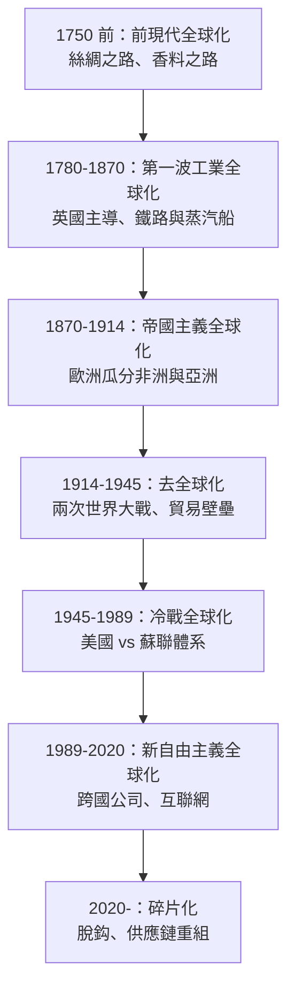
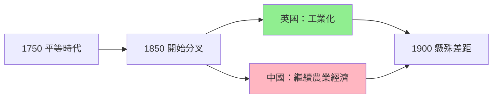
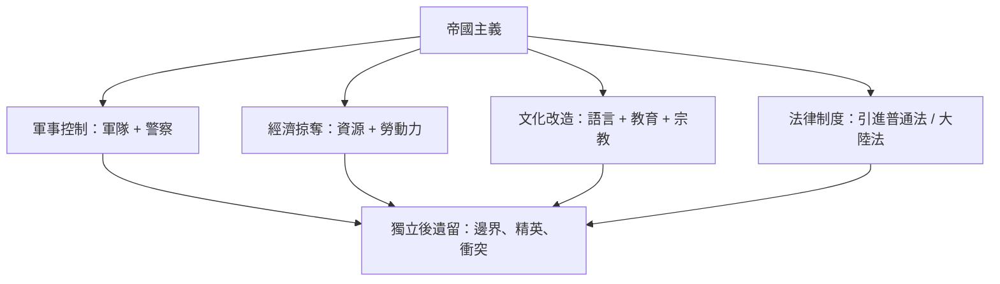
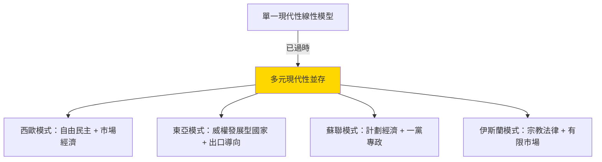
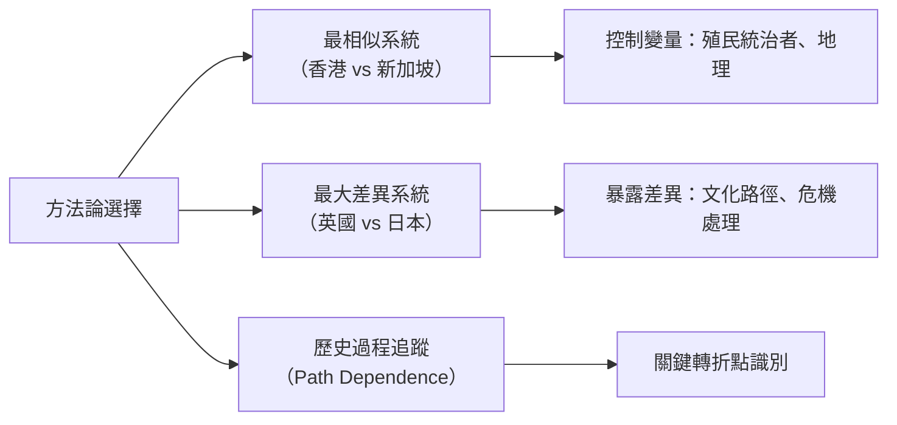
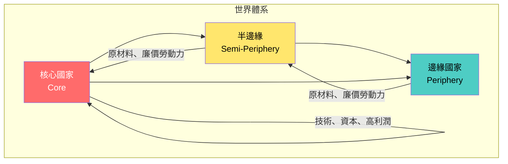
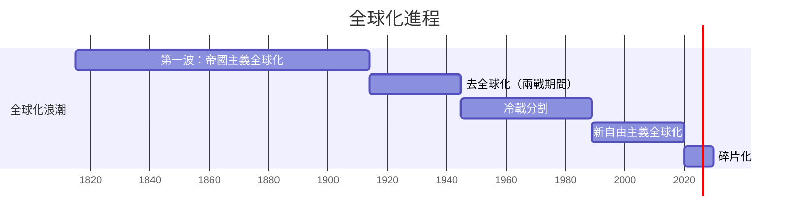
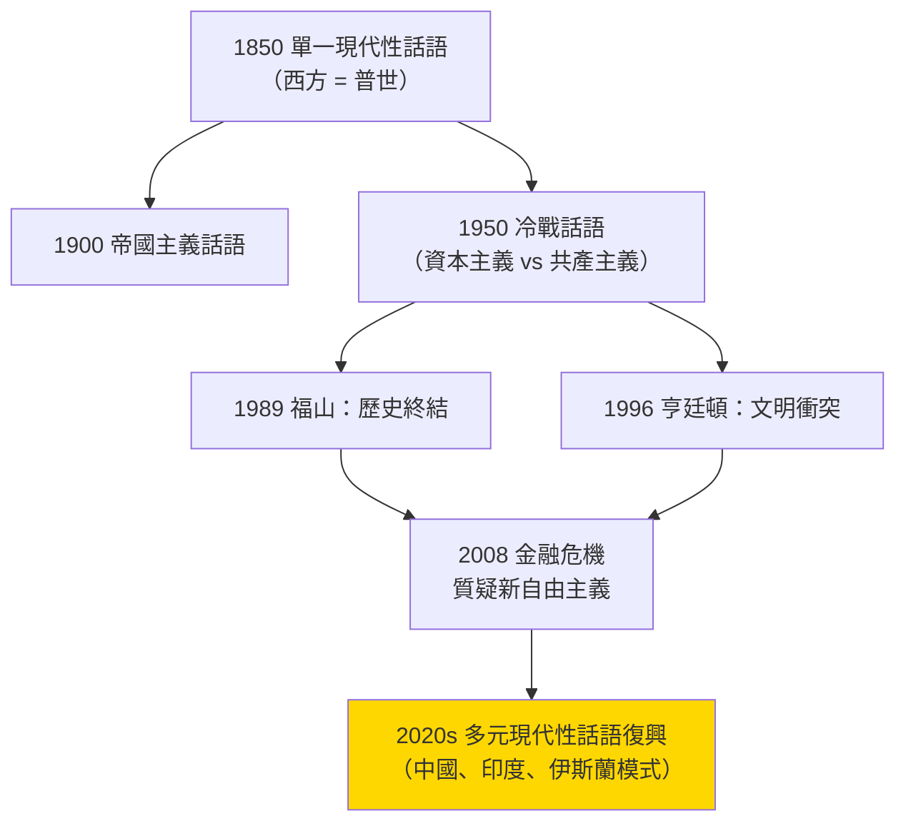
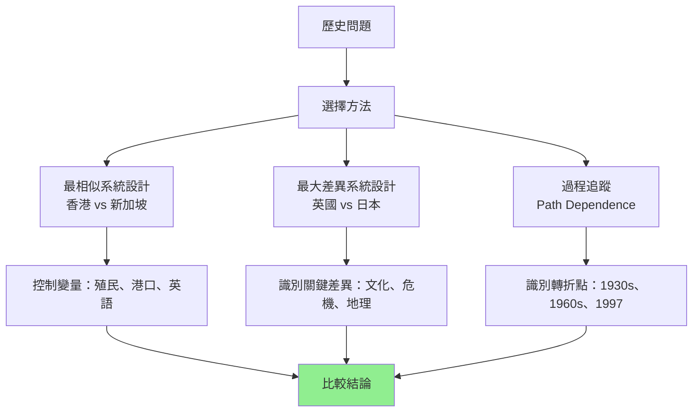

# HIST1016 現代世界 / The Modern World

**Instructor**: Pavel Krejci / Sarah Bramao-Ramos / Nicole Vaughan (varies by year)
**Department**: History, HKU
**Official source**: [HKU History Course Description 2024-25](https://history.hku.hk/wp-content/uploads/2024/07/HIST-2425.pdf)
**Style**: 袁騰飛式 — 幽默、犀利、聚焦權力與武器如何塑造歷史

---

## 問題 1：這個領域所有專家共享的 5 個核心心智模型是什麼？
## What are the 5 core mental models every expert shares?

### 心智模型 1：「全球化」作為歷史進程
**Globalization as Historical Process**

學者 **C.A. Bayly**（劍橋大學，*The Birth of The Modern World 1780-1914*, 2003）指出，「現代性」唔係歐洲專利，而係一個全球性嘅過程。從 1780 年 Industrial Revolution 開始，全球逐漸一體化。學者 **Jeffrey Sachs**（哥倫比亞大學，*The Ages of Globalization*, 2020）進一步分析：1750 年之前全球人均 GDP 幾乎冇差距，但工業革命後歐洲同亞洲嘅距離急劇拉開。

- **1780** 瓦特蒸汽機專利，工業革命正式啟動
- **1820s** 鐵路時代開始，英國鐵路里程超過 10,000 公里
- **1870s** 第二次工業革命，電力和鋼鐵改變遊戲規則
- **1900** 全球貿易額係 1800 年嘅 50 倍
- **1914** 歐洲列強瓜分非洲，柏林會議（1884-1885）正式確立殖民規則

### 心智模型 2：「大分歧」與東西方逆轉
**The "Great Divergence" and East-West Reversal**

學者 **Kenneth Pomeranz**（UC Irvine，*The Great Divergence*, 2000）提出震撼性論點：1750 年之前，長江三角洲同英國蘭開郡嘅生活水平其實差唔多。「大分歧」唔係必然，而係煤礦分佈同美洲奴隸種植園呢啲偶然因素造成。

- **1750** 長江三角洲絲綢業工人生活水平 ≈ 英國蘭開郡紡織工人
- **1800** 英國開始工業化，生活水平開始領先
- **1900** 中國 GDP 總量仍然世界第一，但人均已落後歐美 20 倍
- **1980s** 「亞洲四小龍」經濟起飛，東亞再次追上

### 心智模型 3：帝國主義係雙面刃
**Imperialism as Double-Edged Sword**

學者 **David Landes**（哈佛，*The Wealth and Poverty of Nations*, 1998）認為歐洲帝國主義帶來技術同制度。但學者 **Utsa Patnaik**（德里大學）嘅量化研究顯示英國從印度掠奪咗 45 萬億美元。呢個分歧到今日都係歷史學界嘅核心爭議。

- **1757-1947** 英國東印度公司從印度轉移財富，估計每年佔印度 GDP 1-2%
- **1884-1885** 柏林會議，歐洲列強正式瓜分非洲
- **1914** 英帝國覆蓋全球 3,550 萬平方公里，統治人口達 4.12 億

### 心智模型 4：「現代性」唔係單一模型
**Multiple Modernities Paradigm**

學者 **Shmuel Eisenstadt**（希伯來大學，*Multiple Modernities*, 2000）提出「多元現代性」概念：現代化唔係西化，日本、中國、印度都可以行自己嘅現代化道路。呢個框架打破「西方 = 現代 = 進步」呢個等式。

- **1868** 日本明治維新，「和魂洋才」——唔係簡單複製西方
- **1890s** 中國洋務運動失敗，但日本成功工業化
- **1950s-70s** 東亞四小龍走出第三條路
- **1978** 鄧小平改革開放——中國特色社會主義市場經濟

### 心智模型 5：比較歷史方法論
**Comparative Historical Methodology**

學者 **Charles Tilly**（哥倫比亞大學，*Big Structures, Large Processes, Huge Comparisons*, 1984）話歷史學家必須用比較方法先至可以理解大規模歷史模式。學者 **Michael Mann**（劍橋，*The Sources of Social Power*, 1986）提出社會權力四大來源：軍事、經濟、政治、意識形態。

---

## 問題 2：這個領域 3 個 SPECIFIC 根本分歧 / What are the 3 core disputes?

### 分歧 1：全球化係「融合」定係「帝國主義借屍還魂」？
**Globalization: Convergence or Imperialism Reborn?**

- **A 方（樂觀派）**：學者 **Thomas Friedman**（*The World is Flat*, 2005）——全球化係資訊革命，令所有人可以喺同一個平台競爭。**Jeffrey Sachs**——全球貧窮人口從 1990 年嘅 36% 下降到 2015 年嘅 10%。
- **B 方（批判派）**：學者 **Giovanni Arrighi**（約翰霍普金斯，*The Long Twentieth Century*, 1994）——全球化係資本主義世界體系嘅最新階段，核心-邊緣關係從未消失。**Naomi Klein**（*The Shock Doctrine*, 2007）——新自由主義全球化係靠災難同威權主義推行。

### 分歧 2：「歐洲奇蹟」係必然定係偶然？
**European Rise: Inevitable or Contingent?**

- **A 方（結構主義）**：**Pomeranz**——歐洲崛起關鍵係美洲白銀同煤炭，亞洲同樣有條件，只是偶然落後。**Mark Elvin**（牛津）——中國「高水平均衡陷阱」阻礙工業化。
- **B 方（文化論）**：**David Landes**——歐洲文化入面嘅科學精神同個人主義係關鍵。**Joel Mokyr**（西北大學，*A Culture of Growth*, 2016）——歐洲獨有嘅「知識制度」先至係根本原因。

### 分歧 3：冷戰結束係「歷史終結」定係「新衝突序幕」？
**End of Cold War: End of History or New Conflict?**

- **A 方（福山派）**：**Francis Fukuyama**（*The End of History*, 1989）——自由民主意識形態獲勝，意識形態鬥爭基本結束。
- **B 方（懷疑派）**：**Samuel Huntington**（*The Clash of Civilizations*, 1996）——冷戰後衝突主軸係文明，而非意識形態。2014 年後 Crimea 併吞、2022 年俄烏戰爭似乎驗證咗 Huntington。

---

## 問題 3：10 個 PROBING 深度問題 / 10 Deep Probe Questions

1. 点解工业革命首先喺英国发生，而唔係中国或印度？有边啲「偶然」因素係决定性嘅？
2. 殖民主义对亚洲到底是「文明教化」定係「经济剥削」？有冇第三种解读？
3. 1914-1918 年第一次世界大战，点解文明嘅欧洲会自相残杀？呢件事对现代世界影响有几深远？
4. 社会主义同资本主义，到底系价值体系之争定系权力结构之争？两者最终会点样演变？
5. 全球化进程中，香港同新加坡扮演咩角色？佢哋成功系可以复制定系独特嘅？
6. 1945 年后点解日本可以快速从战败国变成经济强国？德国又点解做到同样嘢？
7. 中国崛起会点样改变「现代性」呢个概念？系西方现代性嘅竞争者定系补充？
8. 互联网同社交媒体系唔系新一波「全球化」？佢哋会点解构传统民族国家？
9. 全球暖化系人类第一次认真面对嘅「文明级别」危机，历史学点样帮助我哋理解？
10. 點解20世紀出現「意識形態終結」論，但21世紀又出現新一波民族主義復興？

---

# 核心心智模型深化（中英對照）

## 1. 全球化作為歷史進程 / Globalization as Historical Process

### 1.1 Bilingual 概念對照
- 全球化 (quánqiú huà) = Globalization — 從相互依存到結構一體化
- 逆全球化 (nìquánqiú huà) = Deglobalization — 1930 年代貿易壁壘、冷戰分割
- 跨國公司 (kuàguó gōngsī) = Transnational Corporation — 驅動全球化的核心力量

### 1.2 史料與考據
- **核心史料**：世界銀行數據（GDP、貿易額、人口）、IMF 報告、聯合國貿易統計
- **爭議性史料**：殖民政權統計往往低估掠奪規模；獨立後各國統計口徑不一致
- **方法論**：GDP 歷史數據重建（Angus Maddison 數據庫）係呢個領域嘅基礎工具

### 1.3 袁騰飛式犀利觀察
> 「成日話全球化，但係你知唔知，1850 年英國棉花佔全球出口 25%——呢個先至係真正嘅全球化！而家啲人話全球化，其實不過係跨國公司想Sell 你嘢。」

### 1.4 Deep Test Question
**考試題**：比較 1850-1914 年第一波全球化同 1990-2020 年第二波全球化，兩者喺動力、受益者、同埋「輸家」方面有乜嘢根本差異？用具體數據支持你嘅分析。

### 1.5 圖解

---

## 2. 大分歧與東西方逆轉 / The Great Divergence

### 2.1 Bilingual 概念對照
- 大分歧 (dà fēnqí) = The Great Divergence — 1800 年後歐亞經濟分叉
- 高水平均衡陷阱 (gāo shuǐpíng jūnhéng xiànjǐng) = High-Level Equilibrium Trap — Mark Elvin 理論
- 煤炭紅利 (tànmeì hónglì) = Coal Dividend — Pomeranz 論點核心

### 2.2 史料與考據
- **核心史料**：海關貿易報告（Morse 數據庫）、英國東印度公司檔案、中國清代糧價記錄
- **方法論爭議**：GDP 估算需要大量推算，「質化轉量化」本身就係一個主觀過程

### 2.3 袁騰飛式犀利觀察
> 「Pomeranz 話英國同長江三角洲 1750 年生活水平差唔多，但係你信唔信？英國工人做工做到死，清朝文人吟詩作對——生活水平點比？數字可以呃人！」

### 2.4 Deep Test Question
**考試題**：Kenneth Pomeranz 認為「大分歧」係因為煤炭同美洲，唔係文化因素。試評析呢個論點，並指出其方法論上嘅局限。

### 2.5 圖解

---

## 3. 帝國主義係雙面刃 / Imperialism as Double-Edged Sword

### 3.1 Bilingual 概念對照
- 帝國主義 (dìguó zhǔyì) = Imperialism — 强国统治弱国
- 殖民主義 (zhímín zhǔyì) = Colonialism — 實際領土佔領
- 去殖民化 (qù zhímínhuà) = Decolonization — 1960 年代高峰

### 3.2 史料與考據
- **殖民檔案**：英國國家檔案館（Kew）、法國外語檔案館
- **被殖民者聲音**：Gandhi 自傳、Frantz Fanon *The Wretched of the Earth* (1961)
- **量化證據**：Utsa Patnaik 團隊 2019 年研究：英帝國掠奪印度 45 萬億美元

### 3.3 袁騰飛式犀利觀察
> 「英國人起火車、起醫院——但係你知唔知，鐵路係為咗運兵運貨控制你哋，醫院係為咗保護歐洲人！所謂『文明使命』，不過係帝國主義嘅化妝品。」

### 3.4 Deep Test Question
**考試題**：評估「殖民者建設」與「殖民者掠奪」兩種觀點。你點解認為某啲殖民地（如香港）相對成功，而其他（如剛果）災難性？

### 3.5 圖解

---

## 4. 多元現代性 / Multiple Modernities

### 4.1 Bilingual 概念對照
- 多元現代性 (duōyuán xiàndàixìng) = Multiple Modernities — Eisenstadt 2000 年提出
- 現代化理論 (xiàndàihuà lǐlùn) = Modernization Theory — Rostow 經濟發展階段論
- 北京共識 (běijīng gòngshí) = Beijing Consensus — Scott 2004 年提出

### 4.2 袁騰飛式犀利觀察
> 「話『只有一種現代性』，就係西方學者想話俾你知：你跟住我哋就啱，唔跟我哋就錯。但係日本、印度、中國，全部都有自己嘅『現代』，西方反而係後來者！」

### 4.3 Deep Test Question
**考試題**：點解「亞洲價值」同「西方普世價值」喺 1990 年代係咁大爭議？呢個爭議點樣影響我哋理解「現代性」？

### 4.4 圖解

---

## 5. 比較歷史方法論 / Comparative Historical Methodology

### 5.1 Bilingual 概念對照
- 個案研究 (gèàn yánjiū) = Case Study — 深度描述單一事件
- 比較研究 (bǐjiào yánjiū) = Comparative Study — 跨案例模式識別
- 反事實分析 (fǎn shìshí fēnxī) = Counterfactual Analysis — 「如果xxx冇發生」

### 5.2 袁騰飛式犀利觀察
> 「歷史學家最鐘意話：『呢件事導致嗰件事！』但係你試下問佢：點解同期其他國家冇因為同樣嘅事改變？無辦法解釋negative case，啲理論就係廢話。」

### 5.3 Deep Test Question
**考試題**：用「最相似系統設計」（most similar systems design）方法，比較香港同新加坡點解喺殖民撤離後走上唔同政治道路？

### 5.4 圖解

---

## 深度自測問題詳解

### Q1 詳解：點解工業革命首先喺英國發生？
**核心答案**：呢個係「天時地利人和」嘅偶然組合：
- **煤礦**：英國煤礦近海，採礦成本低；西歐煤礦分佈均勻，形成區域競爭
- **美洲白銀**：西班牙白銀流入英國，導致「價格革命」，激發投資動機
- **專利制度**：1624 年英國《專利法》保障創新者回報
- **農業革命**：圈地運動釋放勞動力，同時提高糧食產量
- **反例**：中國有煤（山西）、有人口（3億）、有技術（絲綢、瓷器、造紙），但缺乏西方嘅「偶然組合」

**Pomeranz 反駁**：其實長江三角洲同英格蘭太相似了，真正的差異在於美洲——英國可以將成本外化（污染、奴隸勞動）到新世界，而中國不能。

### Q2 詳解：殖民主義係文明教化定係經濟剝削？
**核心答案**：兩者都有，但動機同效果必須分開分析：
- **經濟剝削證據**：英帝國東印度公司利潤率長期維持 20%+；印度 1900 年外債等於政府收入 3 倍
- **「文明教化」虛假**：英國人建醫院，但係只為歐洲人；建鐵路，但係為運兵；教育少數精英，但係為培养顺民
- **雙刃劍效果**：香港、新加坡證明殖民接觸可以帶來制度遺產；印度、非洲則更多災難性遺產

### Q3 詳解：第一次世界大戰點解係歐洲自我毀滅？
**核心答案**：
- **直接原因**：1914 年 6 月 28 日 Sarayevo 暗殺，奧匈帝國向塞爾維亞下最後通牒（7 月 23 日）
- **根本結構**：歐洲五強（德、法、英、俄、奧匈）均勢系統失衡
- **經濟因素**：歐洲各國互相依賴借貸，戰爭損失不可逆轉
- **傷亡數字**：1,700 萬人死亡（包括 800 萬士兵、700 萬平民）；法國失去 1/10 年輕男性

### Q4 詳解：社會主義同資本主義之爭
**核心答案**：
- **經濟維度**：計劃經濟 vs 市場經濟；蘇聯 1950 年代工業產出曾短暫超過美國，但長期效率落後
- **政治維度**：一黨專政 vs 多黨民主；1989 年東歐劇變係制度競爭嘅分水嶺
- **今日混合**：中國「社會主義市場經濟」——大量市場元素 + 國家主導；北歐「社會民主主義」——市場 + 高福利

### Q5 詳解：香港同新加坡的成功
**核心答案**：
- **地理決定論**：深水港位於國際貿易航線交汇点
- **制度路徑依賴**：英國普通法傳統提供可預測法律環境
- **冷戰紅利**：兩地作為西方情報、金融節點，獲得大量外國投資
- **文化因素**：儒家工作倫理 + 英語國際語言優勢

### Q6-Q10 簡要答案
**Q6**：日本成功關鍵——美國佔領（1945-1952）清除舊勢力、土地改革、民主化，同時保留經濟精英管理能力；1960 年代東京奧運係現代化宣示。

**Q7**：中國崛起提出「文明型國家」（civilizational state）概念，挑戰 nation-state 為唯一現代政治單位嘅西方假設。

**Q8**：互聯網造成「流動現代性」（Bauman），國家邊界仍然存在但個人跨境能力幾何級提升；TikTok 大戰係新冷戰象徵。

**Q9**：歷史學提供 longue durée（長時段）視角——工業革命本身係一場能源革命，從木材到煤炭再到石油，每次轉型都有深遠社會後果。

**Q10**：1990 年代「歷史終結」之所以流行，因為蘇聯倒台；2020 年代民族主義復興，因為全球化失利者（西方藍領、中國低端製造業工人）發聲。兩者都係對真實問題嘅簡化回應。

---

## 5 個 Mermaid 圖解

### 圖解 1：世界體系結構

### 圖解 2：全球化時間線

### 圖解 3：工業革命因果鏈

### 圖解 4：現代性競爭格局

### 圖解 5：比較歷史方法論框架

---

## 總結

**HIST1016 The Modern World** 係香港大學歷史系嘅世界史入門課程。呢個 course 嘅核心價值在於：
1. **全球史視角**：唔再將歐洲視為歷史中心，而係視之為全球互動網絡中嘅一個節點
2. **比較方法**：通過比較，先至可以睇清每一個社會嘅獨特性同局限
3. **批判性思維**：唔接受任何單一嘅「現代化」敘事，而係追問：邊個嘅現代化？代價係乜嘢？

**袁騰飛金句**：
> 「歷史唔係一條直線，而係一舊雲——形狀係你自己賦予嘅。」

---

## 延伸閱讀 / Further Reading

1. Hobsbawm, Eric. *The Age of Revolution: 1789-1848*. London: Weidenfeld & Nicolson, 1962.
2. Pomeranz, Kenneth. *The Great Divergence: China, Europe, and the Making of the Modern World Economy*. Princeton: Princeton University Press, 2000.
3. Bayly, C.A. *The Birth of the Modern World, 1780-1914*. Oxford: Blackwell, 2003.
4. Arrighi, Giovanni. *The Long Twentieth Century: Money, Power, and the Origins of Our Times*. London: Verso, 1994.
5. Ferguson, Niall. *Empire: The Rise and Demise of the British World Order*. London: Allen Lane, 2002.
6. Eisenstadt, Shmuel N. "Multiple Modernities." *Daedalus* 129, no. 1 (2000): 1-29.
7. Frankopan, Peter. *The Silk Roads: A New History of the World*. London: Bloomsbury, 2015.
8. Maddison, Angus. *The World Economy: Historical Statistics*. Paris: OECD, 2003.
