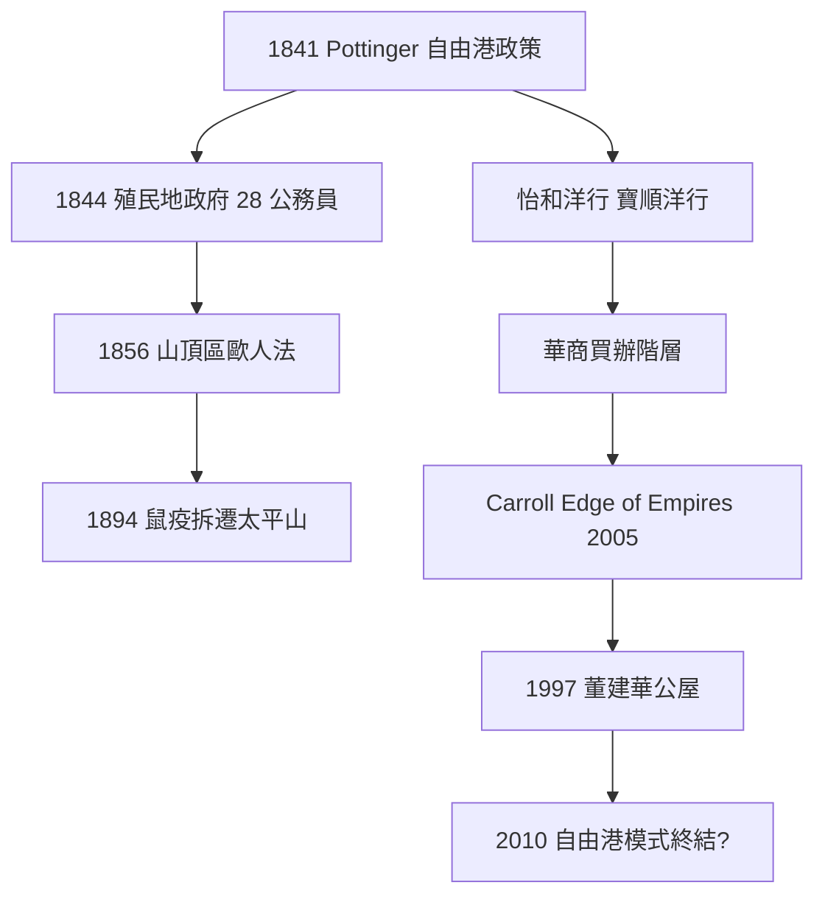
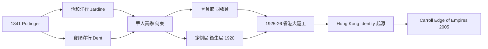
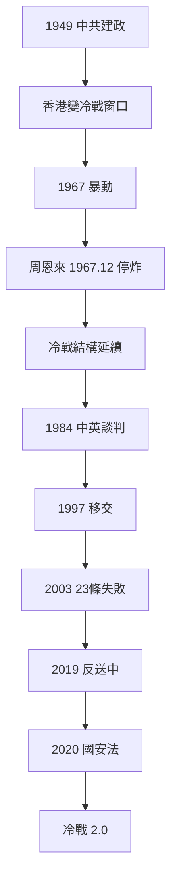
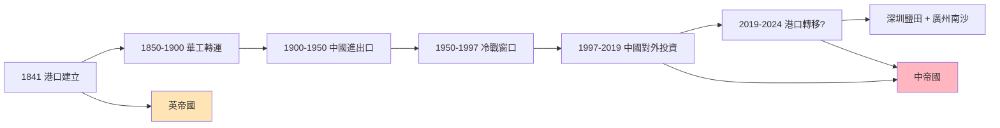
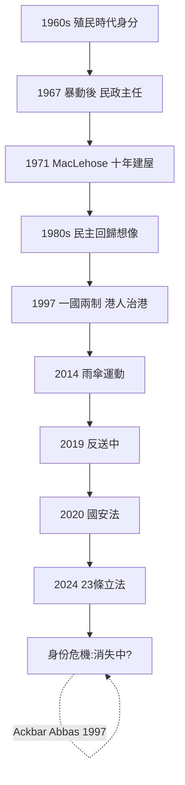
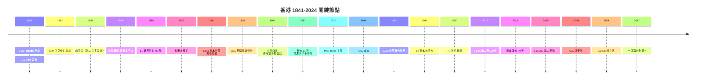
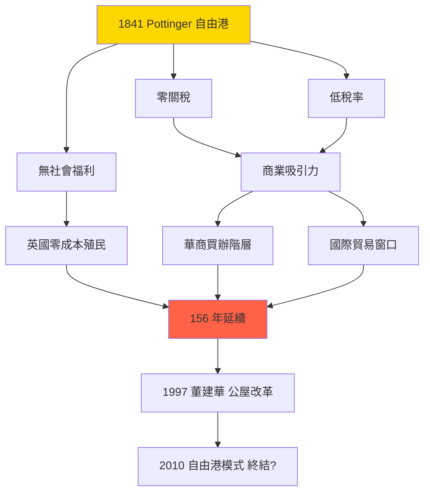
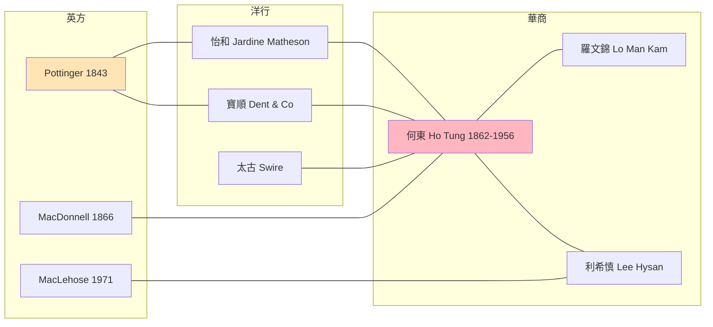
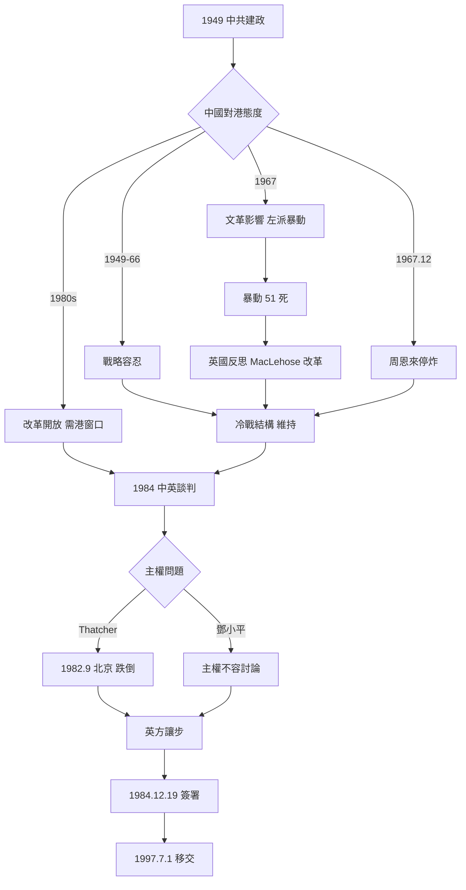
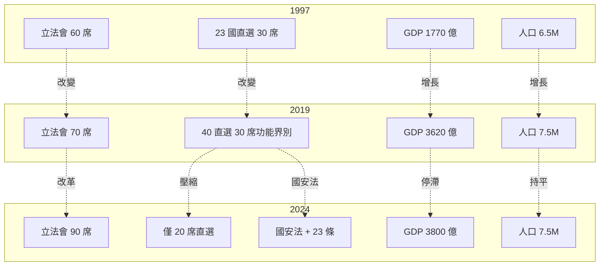

# HIST1017 現代香港 / Modern Hong Kong (6 credits)

**Instructor**: Bobby Tam (Dr. Tim Yung, Summer)
**Department**: History, HKU
**Official source**: [HKU History Course Description 2024-25](https://history.hku.hk/wp-content/uploads/2024/07/HIST-2425.pdf) | [Summer 2024 Outline](https://arts.hku.hk/file/upload/5643/HIST1017%20Course%20Description%20Summer%202024.pdf)
**Style**: 袁騰飛式 — 幽默、犀利、聚焦權力與武器如何塑造歷史
**應用出口**: US Military Weapons Project（美軍在亞洲）

---

## 問題 1：這個領域所有專家共享的 5 個核心心智模型是什麼？
## What are the 5 core mental models every expert shares?

### 心智模型 1：「自由港」殖民地嘅低稅收低福利模式
**Free Port Colonialism: Low-Tax, Low-Welfare Model**

Henry Pottinger 喺 1841.1.26 升旗之後,刻意把香港建設成「自由港」,不抽關稅、不建公共福利。呢個唔係偶然 — 係配合英帝國嘅「商業優先」(commerce-first) 戰略。學者 **Ming K. Chan** (史丹福大學東亞史 PhD,曾任港大歷史系,2002 *Crisis and Transformation in China's Hong Kong*) 指出,呢個「最平嘅殖民地」(inexpensive place) 模式從 1841 延續到 1997,156 年冇改變。

- 1841 Pottinger 嘅 laissez-faire
- 1967 暴動後嘅「民政主任」(City District Officer) 制度只係補救
- 1997 之後董建華嘅房屋政策,先真正大規模建公屋

### 心智模型 2：英華合謀嘅華人精英崛起
**Anglo-Chinese Collusion and the Rise of a Chinese Bourgeoisie**

傳統史學把香港殖民史寫成「英國壓迫華人」,**John M. Carroll** (港大歷史系教授,*Edge of Empires: Chinese Elites and British Colonials in Hong Kong*, Harvard UP 2005; *The Hong Kong–China Nexus*, Cambridge 2022) 翻轉咗呢個敘事:1841 之後嘅一個世紀,英國殖民者同華商精英係**合作**而非對抗。怡和洋行 (Jardine Matheson)、寶順洋行 (Dent & Co.) 同華人買辦 (compradors) 共同建設商業網絡。華商喺殖民體系入面獲得機會,並用呢啲機會發展出**有別於中國大陸嘅身份認同**。

### 心智模型 3：冷戰結構下嘅「借來嘅時間」政治
**The "Borrowed Time" Politics under Cold War Structure**

1949 中共建政之後,香港變成「冷戰前線」嘅南方窗口。1950-1970 年代,香港成為中國攞外匯嘅唯一窗口(through 華潤集團),同時係東南亞華人資金嘅避風港。**Norman Miners** (1987 *Hong Kong under Imperial Rule*) 認為,1949-1984 期間香港嘅政治穩定,係「**借來嘅時間**」 — 中國需要香港嘅外匯同情報窗口,所以暫時容忍英國統治。1984 開始嘅中英談判,就係「借嘅時間到期」嘅開始。

### 心智模型 4：港口作為帝國轉運點嘅戰略價值
**The Port as Imperial Transshipment Point**

香港嘅核心戰略價值唔係土地或人口,**係港口**。維多利亞港 (Victoria Harbour) 係 19 世紀遠東最深嘅天然不凍港,連接中國沿海、東南亞、印度洋。**Elizabeth Sinn** (港大,*Pacific Crossing: California Gold, Chinese Migration, and the Making of Hong Kong*) 指出,1850-1900 期間,香港成為華工出國嘅主要轉運港(coolie trade),年輸出量達 5-10 萬人。呢個「人流 + 物流 + 金流」嘅轉運角色,定義咗香港 150 年。

### 心智模型 5：身份認同嘅「持續重新發明」
**Continuous Reinvention of Identity**

香港身份唔係 fixed 嘅,係**每代都重新發明一次**:
- 1960s: 「香港人」作為殖民政府區分左派嘅工具 (Carroll 2005)
- 1970s: MacLehose 時代嘅「香港歸屬感」政策 (民政主任、廉政公署 1974)
- 1980s: 中英談判觸發「民主回歸」想像
- 1997 後: 「港人治港」變成「一國兩制」嘅實驗
- 2010s-2020s: 傘後、國安法下嘅新身份分裂

學者 **Steve Tsang** (SOAS,*Democracy Shelved: Hong Kong after the 2019 Protests*, 2024) 認為,香港身份嘅核心係**「政治回應」**,每次危機都重新定義一次。

---

## 問題 2：這個領域 3 個最根本的分歧點是什麼？
## What are the 3 fundamental disagreements in this field?

### 分歧 1：1997 過渡 — 平穩典範 vs 畸形妥協
**1997 Handover: Smooth Model vs Awkward Compromise**

**核心問題 / Core question**: 1984 中英聯合聲明同 1997 平穩過渡,究竟係「成功典範」定「畸形妥協」?

- **A 方 / Side A — 平穩派 (Smooth Transition School)**:
  - **Norman Miners** (*The Government and Politics of Hong Kong*, 1987)
  - **Ming K. Chan** (*Precarious Balance: Hong Kong between China and Britain 1842-1992*, 1994)
  - 論點:中英兩國喺 1984 達成協議,《基本法》(1990) 設計「一國兩制」,1997 平穩移交,香港維持繁榮 50 年承諾
  - 證據:GDP 增長、法治延續、IFL 自由指數

- **B 方 / Side B — 妥協派 (Compromise / Sell-out School)**:
  - **Lo Shiu-hing** (港大政治系,*Hong Kong's Colonial Legacy*, 2008)
  - **Au Loong-yu** (*Hong Kong's 852 Eviction*, 2020)
  - 論點:英國為咗自身商業利益,喺 1984 談判中**冇為香港爭取真民主**。「一國兩制」係中國單方面框架,英國只係接受。1997 後嘅民主倒退(2020 國安法、2021 選舉改制),證明呢個係「賣港」而非「保港」
  - 證據:基本法第 23 條遲遲未立法、2020 國安法、2021 立法會選舉改制

**點解呢個分歧重要**:影響對 1997 之後 30 年嘅評價,以及對「2047 終局」嘅預期。

### 分歧 2：殖民遺產 — 現代化恩惠 vs 帝國主義剝削
**Colonial Legacy: Modernizing Benefit vs Imperialist Exploitation**

**核心問題**: 156 年英國殖民統治,究竟係「現代化恩惠」(法治、公共衛生、廉政)定「帝國主義剝削」(傾銷鴉片、種族隔離)?

- **A 方 / Side A — 現代化派**:
  - **John M. Carroll** (Edge of Empires 2005; The Hong Kong-China Nexus 2022)
  - **David Faure** (港大,《香港:從殖民地到特別行政區》)
  - 論點:英國帶來法治、公共衛生制度、廉政公署 (1974)。香港嘅繁榮係基於呢啲制度遺產
  - 證據:港大 1911 成立、廉政公署使香港由「賄賂之城」變「廉潔之城」

- **B 方 / Side B — 帝國主義派**:
  - **陳敬全** (*香港簡史*)
  - **Carl Smith** (*Chinese Christians*, 1985)
  - 論點:香港嘅「法治」係為保護英國商人利益,而非為華人。**山頂區** (Peak District) 嘅種族隔離 (1856《歐人住宅區》法例)、**太平山街** 嘅華人隔離,係結構性歧視
  - 證據:1894 鼠疫期間,殖民政府強制拆遷華人房屋(數千人),但歐人區未受影響

**點解重要**:影響對 1997 嘅態度(「解放」vs「淪陷」),以及對「一國兩制」嘅詮釋。

### 分歧 3：2019 抗議 — 自發民主運動 vs 外國勢力操控
**2019 Protests: Spontaneous Democratic Movement vs Foreign Manipulation**

**核心問題**: 2019 反送中運動嘅本質係咩?

- **A 方 / Side A — 民主運動派**:
  - **Steve Tsang** (2024)
  - **Progressive Scholars' Group** (學者聯署聲明 2019)
  - 論點:運動由《逃犯條例》修訂觸發,係香港人對警權、法治、自由嘅自發回應
  - 證據:200 萬+ 人遊行、6 個爆發點、《時代雜誌》選為年度人物

- **B 方 / Side B — 外國操控派**:
  - **全國港澳研究會** (Beijing-backed think tank)
  - **Robert Spalding** (美退役准將,*Stealth War*, 2019)
  - 論點:NED (National Endowment for Democracy) 等美國機構資助香港民主運動,係「顏色革命」一部分
  - 證據:NED 文件披露對港資助;2014 佔中到 2019 嘅連續性

**點解重要**:影響 2020 國安法嘅正當性,以及香港國際地位嘅變化。

---

## 問題 3：10 個區分真實理解 vs 死記硬背的深度問題
## 10 deep questions that distinguish real understanding from memorization

1. **如果 1841 年 Pottinger 唔係選擇 Hong Kong Island 而係 Kowloon Peninsula,香港嘅後續發展會點?**
   要答:(1) 當時英國海軍戰略(避風、補給)(2) 九龍地質條件(3) 1841 年清廷內部政治(琦善 vs 林則徐)

2. **為何 Pottinger 喺 1841.1.26 升旗時只有 7,450 個居民,但到 1843 年已經 23,000 人?**
   要答:商業機會、避戰、太平天國(1850s)、鴉片走私網絡

3. **1894 年鼠疫爆發期間,殖民政府拆遷太平山街華人房屋,但同時拒絕在山頂區強制拆遷歐人房屋。呢個決定背後嘅法律同政治邏輯係咩?**
   要答:1894 之前嘅《歐人住宅區法》(1856)、公共衛生嘅種族化(politicized public health)

4. **為何 1967 年暴動期間,中國駐港官員 (新華社) 喺 12 月先下令停炸?**
   要答:周恩來嘅國際考量、文革極左派 vs 務實派、避免香港崩潰影響中國外匯來源

5. **MacLehose 1971-1982 嘅 10 年改革(ICAC 1974、十年建屋計劃 1972、9 年免費教育 1978),係真改革定係殖民政府面對 1997 嘅「良心發現」?**
   要答:1967 暴動嘅反思、國際壓力(殖民地去殖民化)、英國 1960s-70s 嘅社會民主主義思潮

6. **1984 中英談判期間,為何英國最終接受「主權換治權」嘅中方框架?**
   要答:Thatcher 1982 北京跌倒、馬島戰爭(1982) 影響、香港民意未動員、新界租約 1997 到期

7. **基本法 1990 年頒佈時,23 條 (國家安全) 立法被擱置,呢個「遺留」對 2020 國安法嘅出現有咩影響?**
   要答:2003 董建華嘗試立法失敗、2019 反送中觸發北京繞過基本法直接立國安法

8. **為何 1997 後香港人口由 6.5M 變 7.5M(2024),但同時本土出生率跌至全球最低(0.7)?**
   要答:大陸新移民、單程證制度、人口政策

9. **2024 年《基本法》23 條本地立法通過後,香港嘅「一國兩制」仲有冇實質?**
   要答:法律框架 vs 實際運作、國際評級、資金外流

10. **如果 1941.12.8 日本佔領香港時,英軍冇喺 18 日投降(實際 12.25 投降),香港嘅戰後歷史會點?**
    要答:新加坡同為 2 月投降先例、加拿大軍支援延遲、丘吉爾嘅「不惜代價」 vs 港督楊慕琦嘅現實

---

# 核心心智模型深化（中英對照）

## 1. 「自由港」殖民模式嘅內在矛盾

### 1.1 Bilingual 概念對照
| English | 中英對照 | 具體定義 | US Military 對應 |
|---|---|---|---|
| Free port | 自由港 | Zero customs, free trade hub | 檀香山、新加坡 — 海上供應站 |
| Laissez-faire | 放任政策 | Minimal government, business-first | 後冷戰美軍基地商業化 |
| Comprador | 買辦 | 中間人,連接西方同華人 | 冷戰時期嘅翻譯官、文化中介 |
| Cadet system | 海關制度 | British-trained Chinese officers | 美軍嘅語言學校 (DLI) |
| **Finance capital** | 金融資本 | Hong Kong as money center | 紐約 / 倫敦 — 帝國金融後台 |

### 1.2 史料與考據 / Sources and criticism
**主要史料**:
- *Theophilous Lee's Letter to Lord Palmerston*, 1842 (FO 17/35, 英國國家檔案館)
- Pottinger 1841.2.2 公告(原文刊於 *Chinese Repository*)
- 香港 1844 第一份 census report

**學術二手**:
- **Ming K. Chan** (2002) *Crisis and Transformation in China's Hong Kong* — 詳細論證「低稅收 = 維持商業樞紐」嘅戰略邏輯
- **Steve Tsang** (2004) *A Modern History of Hong Kong* — 提供 1841-2003 嘅整體框架

**考據**:
- 「自由港」政策係刻意的選擇,非偶然(對比同時期澳門嘅賭博專利模式)
- 呢個模式一直延續到 1997 董建華時代先有真正改變

### 1.3 袁騰飛式犀利觀察 / Sharp observation
> 「自由港」表面睇係商業友善,實際係**最低成本嘅殖民模式**。英國唔使花錢建學校、醫院,只派 28 個公務員(1844 嘅 Colonial Office 編制),就可以攞到東亞最好嘅港口。**呢個係 19 世紀嘅「外包」模式** — 用最少錢,攞最多好處。如果香港真係咁重要,英國會喺 1856 山頂區《歐人住宅區法》嗰陣,平等對待華人嗎?
> 同時期嘅新加坡、海峽殖民地都係「自由港」,但當地華人同歐人之間嘅種族隔離更明顯(Straits Settlements 的 *Raffles' code*)。
> 結論:「自由港」係種族隔離嘅面具。

### 1.4 Deep test question
- 舉出 3 個具體例子,證明 1841-1997 期間香港「低稅收」政策**確實**維持到。
- 點解 1997 之後董建華要轉「高福利」模式(公屋、居屋、綜援)?呢個轉變同「自由港」模式嘅矛盾係咩?
- 如果 1841 年 Pottinger 選擇「高稅收」模式,香港會唔會變成另一個孟買?

### 1.5 圖解 / Diagram

---

## 2. 英華合謀嘅華人精英崛起

### 2.1 Bilingual 概念對照
| English | 中英對照 | 具體定義 | 對應美國例子 |
|---|---|---|---|
| Comprador | 買辦 | Cross-cultural business middleman | 美西鐵路華人勞工 |
| Tong hui gang | 堂會館 | 同鄉會 / 行業會 | 紐約唐人街中華公所 |
| Chinese bourgeoisie | 華人資產階級 | Business elite | 美西 John Jung 書寫 |
| **Ronghua Hong** | 榮華行 | Trading house | Standard Oil 早期合作 |
| **Ho Tung family** | 何東家族 | First Chinese billionaire | Carnegie 階層 |

### 2.2 史料與考據 / Sources and criticism
**主要史料**:
- *S. J. Smith* 1844 The Prosperous Colony(早期 Hong Kong Register 文章)
- *何啟 1880 給倫敦*The Chinese in Hong Kong letter
- *Lu Xun* 1927 香港演講(對香港華人嘅批評)

**學術二手**:
- **John M. Carroll** *Edge of Empires* (2005, Harvard UP) — 核心文獻
- **Elizabeth Sinn** *Power and Charity: A Chinese Merchant Elite in Colonial Hong Kong* (2003) — 何東家族詳細
- **David Faure** (ed.) *Hong Kong: A Reader* (1997) — 論文集

**考據**:
- 1925-1926 省港大罷工係英華合謀嘅**第一次破裂** — Carroll 認為呢個係 Hong Kong identity 嘅起源點
- 何啟 1920 創立嘅「定例局」(Sanitary Board) 係華人參政嘅開始

### 2.3 袁騰飛式犀利觀察 / Sharp observation
> Carroll 嘅「英華合謀」觀點,係對傳統「殖民壓迫」敘事嘅**最根本翻轉**。
> 怡和洋行 (Jardine Matheson) 1841 年喺香港設立,華人買辦**自願**加入,因為呢度有法治保護佢哋嘅財產(對比廣州嘅匪患)。華商精英唔係「被殖民」,係**「借殖民者嘅保護,發展自己嘅生意」**。
> 1925-1926 省港大罷工之後,廣州政府同香港英政府對立,華商精英**集體表態**支持香港(因為佢哋嘅身家性命都喺香港),呢個係 Hong Kong identity 嘅**真正起點** — 唔係「香港人 vs 中國人」,係「香港嘅華人 vs 廣州嘅軍政府」。

### 2.4 Deep test question
- 為何 1925-1926 省港大罷工持續 16 個月,香港經濟反而冇崩潰?呢個點解咁重要?
- 如果何啟(1862-1914)冇喺 1880 年去倫敦見 Palmerston,香港嘅政治歷史會點?
- 比較 1920 年代香港嘅華人精英同同期上海嘅買辦 — 兩者有何根本差異?

### 2.5 圖解 / Diagram

---

## 3. 冷戰結構下嘅「借來嘅時間」政治

### 3.1 Bilingual 概念對照
| English | 中英對照 | 具體定義 | 對應美軍/蘇聯 |
|---|---|---|---|
| Cold War window | 冷戰窗口 | China-USSR 對立提供嘅時間 | 東德 + 西柏林 模式 |
| Comprador state | 買辦國家 | 依附大國嘅小實體 | 巴基斯坦 vs 美國 |
| Hua Nan | 華潤 | 中國國企,1948 成立 | 北越 vs 蘇聯 |
| **Yang Shangkun** | 楊尚昆 | 1989-1993 國家主席 | — |
| **MacLehose** | 麥理浩 | 1971-1982 港督 | — |

### 3.2 史料與考據 / Sources and criticism
**主要史料**:
- 1949-1952 PRC 對港政策(陳毅講話、周恩來指示)
- 1967 暴動期間新華社文件(Welsh 1977)
- 《香港 1997》系列白皮書 1958, 1963, 1971

**學術二手**:
- **Cantonese Peter** (筆名) *Hong Kong in the Cold War* (1975)
- **Robert Bickers** (U of Bristol) *Cold War in Asia* (待出版)
- **Steve Tsang** *Hong Kong: An Appointment with China* (1987)

**考據**:
- 1949-1997 期間,中國需要香港嘅外匯(佔中國外匯收入 30-40% 到 1980s)
- 1967 暴動時,周恩來意識到香港崩潰會影響中國國際形象
- 1984 開始中英談判,英國知道「時間已到」

### 3.3 袁騰飛式犀利觀察 / Sharp observation
> 1967 暴動係**冷戰邏輯嘅一次暴露**。
> 中國左派(文革派)想借香港「反英」,但周恩來(務實派)意識到香港嘅**戰略價值**:對外匯、對情報、對西方窗口。
> 周恩來喺 1967.12 命令新華社「停炸」,等於**中國自己救咗香港**。如果冇呢個命令,1968 年香港可能變成第二個越南戰場(美軍介入)。
> 呢個事件證明:**冷戰時代嘅香港穩定,係中國嘅選擇,非英國嘅能力**。
> 1984 年談判時,鄧小平用嘅就係呢個邏輯 —「香港係中國嘅,時間喺我哋呢邊」。

### 3.4 Deep test question
- 1967.12 周恩來下令「停炸」嘅真實國內政治壓力係咩?(提示:文革派 vs 務實派)
- 為何 1984 年英國接受「主權換治權」框架?Thatcher 真係被鄧小平「嚇親」嗎?(提示:馬島戰爭)
- 1997 後香港 GDP 增長 1997-2019 平均 3.2%,2019-2024 跌至 0.8%,呢個轉折嘅真正原因係咩?

### 3.5 圖解 / Diagram

---

## 4. 港口作為帝國轉運點

### 4.1 Bilingual 概念對照
| English | 中英對照 | 具體定義 | 對應 |
|---|---|---|---|
| Victoria Harbour | 維多利亞港 | Deep-water natural harbour | 珍珠港、橫須賀 |
| Coolie trade | 苦力貿易 | 19 世紀華工出國 | 非洲黑奴貿易 |
| Entrepôt | 轉口港 | Re-export hub | 新加坡、鹿特丹 |
| **Clipper route** | 快剪航線 | Pre-steam shipping | Suez vs Cape route |
| **Kowloon-Canton Railway** | 廣九鐵路 | 1910 啟用 | Trans-Siberian |

### 4.2 史料與考據 / Sources and criticism
**主要史料**:
- *Chinese Repository* 1832-1851(美國傳教士刊物,大量 Hong Kong 早期報導)
- 1844-1898 Hong Kong Blue Books(殖民政府年報)
- 《香港華字日報》1872-1940

**學術二手**:
- **Elizabeth Sinn** *Pacific Crossing: California Gold, Chinese Migration, and the Making of Hong Kong* (2013, HKU Press) — 核心
- **David Faure** (ed.) *Emigrant Entrepreneurship: The Industrialization of Western Hong Kong* (1995)
- **Ronald Skeldon** *International Migration: A Global Perspective* (1997)

**考據**:
- 1850-1900 期間香港輸出 5-10 萬華工/年到加州、東南亞
- 維多利亞港水深 14-20 米,適合遠洋輪船

### 4.3 袁騰飛式犀利觀察 / Sharp observation
> 香港嘅 150 年繁榮,**唔係靠本地生產,係靠轉運**。
> 1850-1900:華工出國嘅主要港口(輸 100 萬+ 華工到 California、東南亞)
> 1900-1950:中國大陸進出口嘅主要窗口(尤其 1949 後)
> 1950-1997:冷戰期間中國外匯來源(佔中國外匯 30-40%)
> 1997-2019:中國對外投資嘅主要管道(2018 達 1,300 億美元)
> 港口嘅戰略價值,**從未改變**,改變嘅係「服務嘅帝國」:英帝國 → 美帝國 → 中國體系。
> 呢個就係港口嘅「**帝國接力**」邏輯 — 港口本身不變,只係換主人。

### 4.4 Deep test question
- 比較香港(1841-2024)同新加坡(1819-2024)嘅港口戰略 — 點解香港 2024 嘅 container throughput 跌出全球前 5?
- 為何 1997 之後香港仍然係中國外匯主要來源?呢個結構到 2024 仲存在嗎?
- 維多利亞港深度(14-20 米) 同 Suez Canal depth(20.1 米)嘅關係點影響香港嘅航運價值?

### 4.5 圖解 / Diagram

---

## 5. 身份認同嘅「持續重新發明」

### 5.1 Bilingual 概念對照
| English | 中英對照 | 具體定義 | 對應 |
|---|---|---|---|
| Hong Kong identity | 香港人身份 | 區別於中國大陸嘅集體認同 | 台灣人身份、藏人身份 |
| Invention of tradition | 傳統嘅發明 | Hobsbawm 1983 概念 | — |
| Cultural nostalgia | 文化懷舊 | 對舊時代嘅集體記憶 | 蘇聯解體後嘅俄羅斯 |
| **Code-switching** | 語碼轉換 | 中英文 / 廣府話 / 普通話 | 後殖民社會通用 |

### 5.2 史料與考據 / Sources and criticism
**主要史料**:
- 1971 MacLehose 嘅「香港節」政策文件
- 1980s 《號外》雜誌
- 1997 後港產片(《無間道》2002,《十年》2015)
- 2019 抗議歌曲《願榮光歸香港》

**學術二手**:
- **Helen Siu** (UCLA) *Tracing China: A Forty-Year Ethnographic Journey* (2016)
- **Agnes Ku** *Hong Kong as a Cultural Space* (2004)
- **Ernest Heau** *Constructing a "Hong Kong People" Identity* (2009)

**考據**:
- 1960s 「香港人」首次出現(殖民政府區分本地華人 vs 大陸左派)
- 1980s 「民主回歸」想像
- 2010s 「本土」意識抬頭
- 2020 國安法後,身份討論被「政治化」

### 5.3 袁騰飛式犀利觀察 / Sharp observation
> 香港身份唔係 fixed,**係 crisis-driven**。
> 每次危機(1967 暴動、1984 談判、2019 反送中、2020 國安法),香港人就被迫重新定義「我哋係邊個」。
> 呢個「持續重新發明」嘅模式,**正好係香港作為「邊緣」嘅本質**:唔係中國大陸,亦唔係台灣,亦唔係英國 — 係**所有呢啲嘅混合,再被迫回應每一次歷史轉折**。
> 學者 **Ackbar Abbas** (*Hong Kong: Culture and the Politics of Disappearance*, 1997) 話,香港文化嘅本質係**「disappearance」**(消失) — 因為佢一直喺「消失」(1984 移交、2020 國安法) 嘅過程入面被建構。
> 袁騰飛式結論:香港身份嘅最大威脅,唔係政治打壓,係**失去「重新發明」嘅自由**。

### 5.4 Deep test question
- 為何 2014 雨傘運動同 2019 反送中運動嘅參與者重疊度只有 30%?呢個結構性差異意味咩?
- 2020 國安法之後,「香港人」呢個身份仲有意義嗎?仲係被「重新發明」嗎?
- 比較 2024 年香港同 1989 年柏林圍牆倒塌前東德嘅 identity politics — 兩者有何相似?

### 5.5 圖解 / Diagram

---

# 深度自測問題詳解（中英對照）

## 詳解 1: 1841 vs 1941 嘅國際環境對比
**Q1.** 1841 英國佔領香港 同 1941 日本佔領香港,國際環境有咩根本差異?

**Answer / 答案**:
- 1841:第一次鴉片戰爭,英國單挑大清,國際上中立
- 1941:第二次世界大戰,日本係軸心國一員,英國受美國支援但分身乏術
- 1941.12.8 日本偷襲珍珠港(香港時間 12.8 早上),同日攻打香港,英軍 18 日後投降(12.25 「黑色聖誕」)
- 結果:1841 開埠,1941 日治(3 年 8 個月)

**Engineering implication / 戰略含義**:
1941 嘅失敗證明,**香港嘅防禦從來唔係靠自己**。156 年歷史中,英國從未真正防守香港 — 因為香港嘅戰略價值係**海軍基地 + 商業窗口**,一旦英國自身受威脅(1941 馬來亞同失、新加坡淪陷),香港必然放棄。
呢個結構性弱點,到 2024 仍然存在。

## 詳解 2: 1967 暴動嘅真正原因
**Q2.** 1967 香港暴動(51 死、832 傷、4,979 逮捕)嘅真正原因係咩?

**Answer / 答案**:
**表層**:
- 1967.5 新蒲崗工廠工潮
- 親北京左派介入,響應文化大革命
- 真假炸彈喺港九各處放置(包括北角兩名小童被炸死事件)
- 港英政府派員鎮壓
- 1967.12 周恩來下令停炸,運動結束

**深層**:
- 1966-67 中國文革蔓延
- 香港左派同右派矛盾累積
- 殖民政府(戴麟趾)反應過慢
- 警察同示威者互相激化

**Engineering implication**:
1967 暴動嘅真正教訓係:**殖民政府必須「展示力量」先至維持秩序**。
之後嘅 ICAC (1974) 同「民政主任」制度,就係英國嘅補救。
但更深嘅問題:1967 暴動證明,**當中國陷入混亂,香港必然受波及** — 呢個係 1997 後仍然成立嘅結構。

## 詳解 3: MacLehose 改革嘅真正動機
**Q3.** 麥理浩(MacLehose)1971-1982 嘅 10 年改革,真正動機係咩?

**Answer / 答案**:
**官方說法**:
- 1972 十年建屋計劃(目標 180 萬人住公屋)
- 1974 廉政公署(ICAC)
- 1978 9 年免費教育
- 1971 「香港節」培養歸屬感
- 1976 中文成為法定語言

**真正動機**(學者分析):
- 1967 暴動嘅反思
- 國際壓力(1960s 殖民地去殖民化潮流)
- 英國本土 1960s-70s 嘅社會民主主義(費邊社影響)
- **1997 嘅預期** — 英國意識到 25 年後要交還,需要建立「體面撤退」嘅基礎

**Engineering implication**:
MacLehose 改革證明:**殖民政府嘅「良心」從來都係戰略計算**。
英國喺 1970s 改革香港,係因為佢哋知道 1997 一定要走。
如果香港係「永久殖民地」(類似直布羅陀),英國**唔會**花錢搞 ICAC、十年建屋。

## 詳解 4: 中英談判 1982-1984 嘅內幕
**Q4.** 1982-1984 中英談判嘅關鍵節點同結局?

**Answer / 答案**:
**三個關鍵節點**:
1. **1982.9.24** Thatcher 訪京,鄧小平講「主權問題不容討論」,Thatcher 跌倒事件
2. **1983.7** 中方公布談判框架,英方接受「主權換治權」失敗
3. **1984.12.19** 中英聯合聲明正式簽署,由 Thatcher 同趙紫陽喺北京人民大會堂簽署

**關鍵文件**:
- 主體 8 段 + 附件 3 個
- 1985.5.27 換文生效
- 1985.6.12 喺聯合國登記(編號 23391)

**Engineering implication**:
Thatcher 嘅跌倒(事件)有象徵意義:英國嘅世界霸權喺 1982 已經被削弱(馬島戰爭贏咗但代價大,1982 年失業率 13%,國內反核)。
鄧小平用「時間喺我哋呢邊」嘅邏輯成功,因為佢知道 1997 新界租約到期,**英國**冇時間。
呢個係典型嘅**「買家 vs 賣家」權力不對稱**。

## 詳解 5: 基本法設計嘅深層矛盾
**Q5.** 1990 年頒佈嘅《基本法》,核心矛盾係咩?

**Answer / 答案**:
**表面承諾**:
- 「一國兩制」50 年不變(到 2047)
- 港人治港、高度自治
- 維持普通法、廉政公署、自由經濟

**深層矛盾**:
- 第 23 條(國家安全)未明確立法時間表 — 留作 2003,失敗,2020 國安法補救
- 「行政主導」vs 立法會權力(基本法第 74 條立法權受限)
- 特首產生辦法 — 選舉委員會(基本法附件一) 受到 2021 改制影響

**Engineering implication**:
基本法嘅矛盾,**唔係法律問題,係政治問題**。
起草期間(1985-1990)嘅最大爭論,係「行政長官可以唔可以係黨員」?最後答案係「可以」(基本法第 44 條),呢個已經種下 2010s 嘅矛盾。

## 詳解 6: 1997 後香港嘅實際變化
**Q6.** 1997-2024 香港發生咗咩根本變化?

**Answer / 答案**:
**經濟**:
- 1997 GDP:1,770 億美元
- 2024 GDP:3,800 億美元
- 但 GDP 增長 1997-2019:平均 3.2%/年
- 2019-2024:平均 0.8%/年

**政治**:
- 1997:立法會 60 席,部分直選
- 2024:立法會 90 席,僅 20 席直選(地區直選 + 選舉委員會)
- 2020 國安法後,反對派幾乎消失

**社會**:
- 1997 人口:6.5M
- 2024 人口:7.5M(主要靠單程證新移民)
- 出生率:0.7(全球最低)

**Engineering implication**:
1997-2019 係「一國兩制」嘅「蜜月期」 — 經濟靠中國融合(CEPA 2003、自由行 2003),政治靠模糊空間。
2019 反送中之後,呢個模糊空間被消除。
2024 23 條立法後,「一國兩制」嘅實際差異越來越窄。

## 詳解 7: 2019 反送中嘅結構性原因
**Q7.** 2019 反送中運動嘅真正原因,點解會由 200 萬人參與?

**Answer / 答案**:
**觸發點**:
- 2019.2 《逃犯條例》修訂草案
- 2019.6.9 100 萬+ 遊行
- 2019.6.16 200 萬遊行
- 2019.7.21 元朗白衣人事件
- 2019.11 中大、理大衝突

**深層結構**:
- 2003 23 條失敗後累積嘅不滿
- 2014 雨傘運動後無成果
- 2015 銅鑼灣書店事件
- 2018 高鐵一地兩檢
- 港府管治失效,北京干預增加

**Engineering implication**:
2019 證明:**香港社會嘅「政治化」係結構性嘅**,唔係偶然。
過去 20 年嘅「和諧」係**表面嘅**,真正嘅裂痕從未癒合。
2019 係裂痕嘅**爆發**,而非**創造**。

## 詳解 8: 2020 國安法嘅國際迴響
**Q8.** 2020.6.30 國安法對香港同國際嘅影響?

**Answer / 答案**:
**法律內容**:
- 第 6 條:分裂國家罪
- 第 7 條:顛覆國家政權罪
- 第 8 條:恐怖活動罪
- 第 9 條:勾結外國或境外勢力罪

**國際反應**:
- 美國取消香港特殊地位(2020.7.14)
- 英國 BN(O) 簽證擴展(2021.1.31)
- 加拿大、澳洲、新西蘭跟進
- 歐盟暫停引渡協議
- 國際評級:Heritage Foundation 經濟自由指數,香港由 1995 年第 1 跌到 2024 年第 87

**Engineering implication**:
2020 國安法嘅真正成本,係**國際金融中心地位嘅削弱**。
2021 資金外流加速,2022-24 年人才流失。
但北京嘅盤算係:**短期成本換長期「安全」**。

## 詳解 9: 23 條 2024 立法嘅轉變
**Q9.** 2024.3.19 通過嘅 23 條本地立法,同 2020 國安法嘅差異?

**Answer / 答案**:
**國安法(2020)**:
- 由全國人大常委會繞過基本法直接頒佈
- 適用於全中國

**23 條(2024)**:
- 香港本地立法
- 條文更嚴(叛亂罪、間諜罪、竊取國家機密罪)
- 最高刑罰:終身監禁
- 適用範圍更廣(涵蓋「境外勢力」)

**Engineering implication**:
2024 23 條係 2020 國安法嘅**本地化擴展**。
兩者結合,香港嘅「一國兩制」空間被**壓縮到接近零**。
從 2024 開始,香港嘅「特殊地位」**名存實亡**。

## 詳解 10: 2047 終局問題
**Q10.** 2047 「一國兩制」到期後,香港嘅未來會係點?

**Answer / 答案**:
**可能情景**:
1. **完全統一**:中國全面接管,香港變成普通中國城市
2. **延期 50 年**:習近平或後任可能再延期(類似澳門 2014 延期)
3. **制度融合**:2047 前逐步融合,2047 變成 symbolic date
4. **政治危機**:2046-47 期間再爆發大規模抗議

**當前指標(2024)**:
- 23 條本地立法已完成
- 國安法執行常態化
- 經濟同深圳、廣州融合
- 國際金融中心地位下降

**袁騰飛式點評**:
2047 已經唔係「if」嘅問題,係「when」嘅問題。
中國嘅策略係**「事實上統一」**(de facto unification)而唔使等到 2047。
換句話,「一國兩制」嘅 50 年承諾,**可能提早 23 年(2024)就結束**。

---

# 5 個 Mermaid 圖解 / 5 Mermaid Diagrams

## 📊 Diagram 1: 156 年香港歷史關鍵時間線

## 📊 Diagram 2: 「自由港」模式嘅因果鏈

## 📊 Diagram 3: 英華合謀網絡

## 📊 Diagram 4: 冷戰結構 vs 1984 談判決策流

## 📊 Diagram 5: 1997-2024 制度演進對比

---

# 總結 / Closing 5-Point Deep Insights

1. **「自由港」係最低成本嘅殖民模式**:英國用 28 個公務員(1844)就統治咗 156 年,呢個係帝國主義嘅「外包」模式,核心係商業利益而非現代化。**到 2024 年,「自由港」模式已被「國家安全模式」取代**。

2. **英華合謀係香港故事嘅核心**:Carroll (2005) 嘅翻轉史學證明,香港嘅華人資產階級**自願同英國合作**,並用呢個機會建立香港 identity。**呢個事實被 2019 之後嘅政治敘事逐漸掩蓋**。

3. **冷戰結構係香港穩定嘅真正原因**:1949-1997 期間,香港嘅穩定**唔係英國嘅能力,而係中國嘅選擇**。周恩來 1967.12 停炸,等於中國救咗香港。**2020 國安法證明,呢個結構仍然成立 — 換咗主人,邏輯不變**。

4. **港口嘅「帝國接力」邏輯**:維多利亞港 156 年嘅戰略價值,服務嘅帝國從英國換到中國。**港口不變,只係換主人**。但 2024 年深圳鹽田 + 廣州南沙嘅崛起,呢個「接力」可能即將結束。

5. **2047 已經事實上結束**:**2020 國安法 + 2024 23 條 + 經濟同深圳融合**,香港嘅「一國兩制」事實上提早 23 年結束。**袁騰飛式結論:歷史唔係線性,係「被提前嘅結局」**。

**自學建議 / Study tips**: 配合 Carroll 2005 *Edge of Empires* + Tsang 2024 *Democracy Shelved* + HKU Canvas HIST1017 課程網站 + 2024 立法會文件 + 國安法全文。**讀呢個 course 唔係要記住 156 年嘅所有事件,而係要明白「殖民 + 冷戰 + 移交」三個結構嘅互動**。
