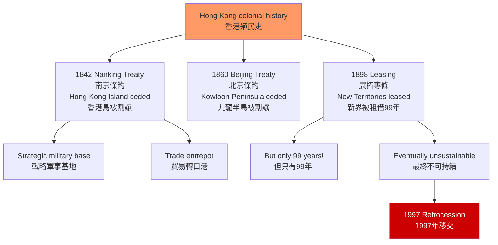
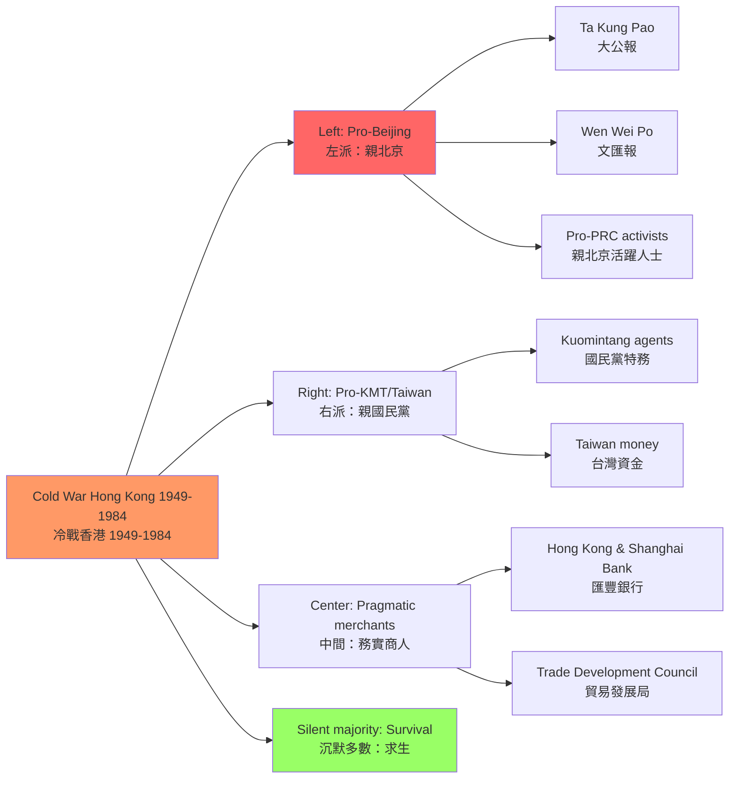
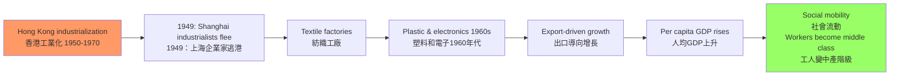
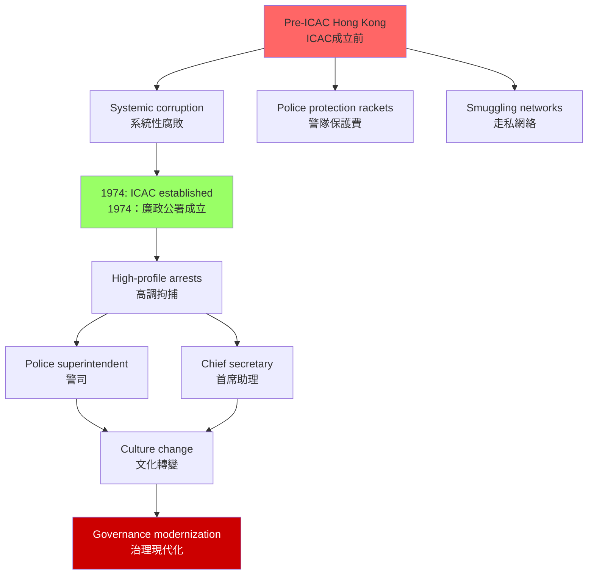
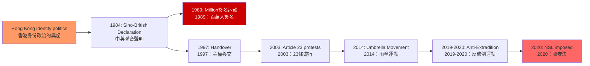

# HIST1017 現代香港 / Modern Hong Kong

**Instructor**: John Carroll
**Department**: History, HKU
**Official source**: [HKU History Course Description](https://history.hku.hk/ug_cd/)
**Style**: 袁騰飛式 — 犀利、聚焦殖民、現代化與身份政治的交織

---

## 問題 1：5 個核心心智模型

### 1. 條約港的殖民邏輯（Treaty Port Colonialism）
**專家如何思考**: 香港是「不平等條約」的歷史產物。1842 年《南京條約》割讓香港島、1860 年《北京條約》割讓九龍半島南部、1898 年《展拓香港界址專條》租借新界 99 年——這三個條約塑造了香港 150 年的政治命運。學者 **John Carroll** 在 *A Concise History of Hong Kong* (2020) 中強調：條約港（treaty port）是西方帝國主義在東亞的核心機制，不僅是軍事佔領，更是經濟和文化滲透的基地。

- **典型學者**: **John Carroll** — *Edge of Empires* (2007); *A Concise History of Hong Kong* (2020); **Steve Tsang** — *A Modern History of Hong Kong* (2004)
- **驗證案例**: 1842 年《南京條約》第五條：「大清大皇帝、大英大君主永恆和好...准將香港一島給予大英君主治理」——這句話的含糊性（香港島是「給予」不是「割讓」）在後來引發了主權爭議

### 2. 冷戰前線（Cold War Frontline）
**專家如何思考**: 1949 年中共建政後，香港成為冷戰時期意識形態鬥爭的前線——兩岸三地的情報戰、媒體戰、金融戰都在香港進行。學者 **Philip Bowring** 和 **John Carroll** 研究：香港的「半冷戰」狀態（而非全面的冷戰對抗）塑造了香港特殊的政治文化。

- **典型學者**: **Philip Bowring** — *True to Both Selves* (1980s journalism); **John Carroll** — research on Cold War Hong Kong
- **驗證案例**: 1949-1950 年：大批上海企業家（如 榮毅仁家族）逃離中共建政，攜帶資金和技術南下香港，奠定了香港紡織業和輕工業的基礎

### 3. 工業化與社會流動（Industrialization and Social Mobility）
**專家如何思考**: 1950-1970 年代香港經歷了快速工業化——塑料、紡織、電子、假髮製造業起飛。學者 **Jon Rigby** 研究：這種工業化為香港的工人階級和中小商人創造了前所未有的社會流動機會。

- **驗證案例**: 1960 年代香港製造業工人平均工資每年增長約 8-10%；1960-1970 年代，香港從一個轉口港變成亞洲最重要的輕工業製造中心之一

### 4. 廉政運動與治理變革（ICAC and Governance Transformation）
**專家如何思考**: 1974 年香港廉政公署（ICAC）的成立，是香港治理史上最重要的事件之一。學者 **Martin Lasater** 和 **Lucy Vigne** 研究：ICAC 不僅打擊了警隊和政府的腐敗，更重塑了香港的治理文化。

- **驗證案例**: 1973-1974 年：總督麥理浩（Crawford Murray MacLehose）推動成立 ICAC，直接調查警隊的集體腐敗——包括「海上走私」和「賭博保護費」等系統性腐敗行為

### 5. 身份政治的興起（Rise of Hong Kong Identity）
**專家如何思考**: 1980 年代《中英聯合聲明》談判期間，香港人開始形成獨特的「香港身份」——介於「中國人」和「英國人」之間的政治主體意識。學者 **Edward Gueman** 和 **Francis Lee** 研究這種「第三種身份」的誕生。

- **驗證案例**: 1989 年 5-6 月：香港舉行了聲援天安門的大規模遊行，估計有 100 萬人參與——這是香港歷史上最大規模的政治遊行，標誌著香港政治主體性的覺醒

---

## 問題 2：3 個根本分歧

### 分歧 1：殖民遺產——現代化推手 vs 種族剝削？
### 分歧 2：六四——不能迴避 vs 不應摻雜？
### 分歧 3：回歸——解放 vs 延續？

---

## 問題 3：10 個深度問題

1. 1842 年《南京條約》與 1898 年《展拓香港界址專條》的性質根本不同——前者是「戰敗割讓」，後者是「和平租借」99 年。這種法律性質差異如何影響了 1997 年後香港主權移交的法律基礎？
2. **六七暴動（1967年）**：香港左派暴動與內地文化大革命的關係是什麼？暴動期間港英政府實施的「緊急條例」（Emergency Regulations）如何改變了香港的法治傳統？
3. **麥理浩年代（1971-1982）**：總督麥理浩推動的公共房屋（公屋）、九年免費教育、廉政公署等政策，如何重塑了香港的社會契約（social contract）？
4. **1984 年《中英聯合聲明》**：這份聲明的「歷史承諾」和「法律約束力」問題——中方認為這是「歷史文件」，英方認為這是國際條約，雙方的分歧如何影響了 1997 年後香港的政治發展？
5. **六七暴動的普通香港華人視角**：普通香港家庭如何在左派暴動的暴力氛圍中求生？他們對「愛國」和「保皇」的取態是什麼？這種普通人的經歷與官方歷史敘事之間的鴻溝有多大？
6. **香港製造業的起飛（1950-1970）**：為什麼香港的製造業能在 1950 年代初迅速起飛？來自上海的企業家、便宜的勞動力、靈活的中小型企業（SMEs）三者各扮演了什麼角色？
7. **1997 年亞洲金融危機對香港的影響**：金融危機後香港樓市崩盤（1997-2003 年樓價下跌約 70%）和失業率上升，如何影響了香港人對經濟前景的信心？這種經濟焦慮與 2019 年運動有什麼聯繫？
8. **香港的司法獨立危機**：終審法院外籍法官制度（1997 年後保留）和 2020 年《國安法》對司法獨立的影響——如何在制度上評估香港普通法的未來？
9. **香港人口結構的歷史變遷**：從 1941 年日佔前約 160 萬人口，到 1945 年約 60 萬（死亡+逃離），到 1950 年代初約 200 萬，到 2023 年約 750 萬——這些人口波動背後的歷史驅動力是什麼？
10. **香港本土意識的歷史根源**：從 1970 年代《70年代》雙週刊和《老百姓》月刊，到 1990 年代《九十年代》月刊，再到 2000 年代《主場新聞》——這些媒體如何塑造了香港的政治想像？

---

# 核心心智模型深化（中英對照）

## 1. 條約港的殖民邏輯

### 1.1 Bilingual 概念對照
| 英文 | 中文 | 歷史含義 | 關鍵年份 |
|---|---|---|---|
| Treaty port | 條約港 | 不平等條約下的對外開放 | 1842 |
| Unequal treaties | 不平等條約 | 武力脅迫的強加條款 | 1842-1943 |
| Colonial occupation | 殖民佔領 | 帝國主義的軍事佔領 | 1841-1997 |
| Retrocession | 主權移交 | 殖民地的回歸 | 1997 |

### 1.3 袁騰飛式犀利觀察
1842 年的《南京條約》最諷刺的地方：**中國在鴉片戰爭中戰敗，賠償的不是金錢，是土地**。

英國人要的不是戰爭賠償，是一個可以控制中國海岸線的基地——香港島。當時英國人自己也不知道這個小島有什麼價值，他們只是要一個軍事和貿易基地。

後來的事實證明：英國人要對了。香港成為了英帝國在東亞最重要的情報、貿易和金融基地——比英國人在印度以外的任何一個亞洲據點都更有價值。

所以你看，帝國主義的「成功」不是靠武力，是靠**對未來的精準計算**。

### 1.5 圖解

---

## 2. 冷戰前線

### 2.1 圖解：冷戰時期香港的政治光譜

---

## 3. 工業化與社會流動

### 3.1 圖解：香港製造業起飛

---

## 4. 廉政運動

### 4.1 圖解：ICAC 成立前後的腐敗生態

---

## 5. 身份政治的興起

### 5.1 圖解：香港身份政治的時間線

---

# 總結

1. **香港的殖民歷史不是單純的「被殖民」**：香港華人在殖民體系中發展出了獨特的「生存智慧」——既服從又不服從，既利用殖民制度又保持文化認同。

2. **冷戰時期的香港是全球意識形態鬥爭的微觀實驗室**：左右兩派在這片土地上激烈較量，普通香港人夾在中間，学会了「政治沉默」的生存策略。

3. **廉政公署是香港治理史上的最重要轉折點**：它不僅打擊了腐敗，更重塑了香港的治理文化，為香港的法治傳統奠定了基礎。

4. **香港本土意識的興起是冷戰結束和回歸談判的共同產物**：1980 年代的身份危機，預示了 2019 年運動的深層根源。

5. **香港的普通法制度是回歸後最脆弱也最珍貴的遺產**：在「一國兩制」框架下，香港的普通法傳統既是與內地的差異象徵，也是香港國際金融中心地位的制度基礎。

**自學建議**: 配合 John Carroll 的 *A Concise History of Hong Kong* + Steve Tsang 的 *A Modern History of Hong Kong*，輸出讀書筆記到 `06_Reading_Notes/`。
