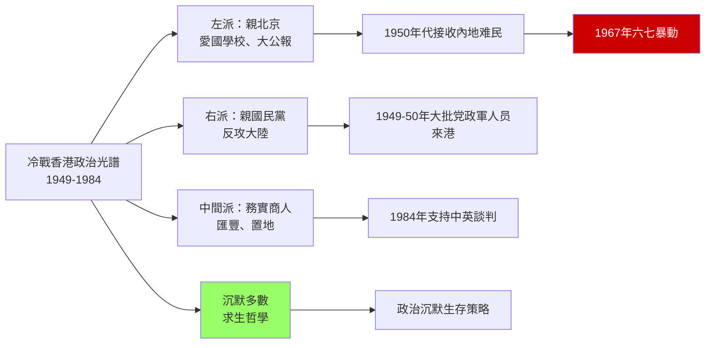
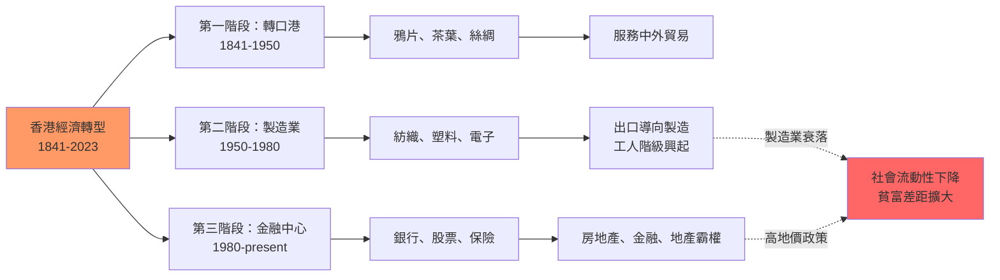
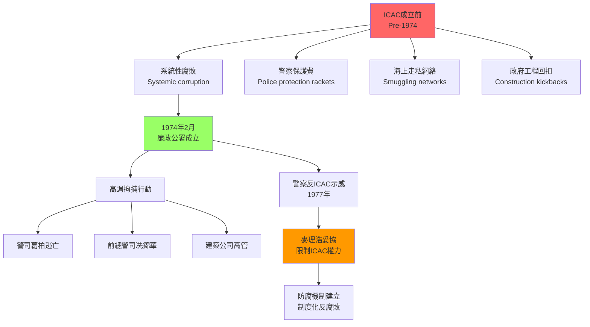
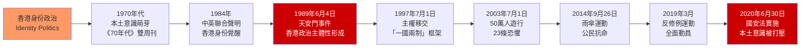

# HIST1017 — Modern Hong Kong

/** HKU | 6 credits | Instructor: Bobby Tam / Tim Yung */

---

## 問題 1：5 個核心心智模型

### 1. 條約港的殖民邏輯（Treaty Port Colonialism）
**定義**: 香港是「不平等條約」的歷史產物——1842年《南京條約》割讓香港島、1860年《北京條約》割讓九龍半島南部、1898年《展拓香港界址專條》租借新界99年——這三個條約塑造了香港150年的政治命運。條約港不僅是軍事佔領，更是經濟和文化滲透的基地。

**學者**: 
- **John Carroll** — *Edge of Empires* (2007); *A Concise History of Hong Kong* (2020)
- **Steve Tsang** — *A Modern History of Hong Kong* (2004, revised 2021)
- **Ming K. Chan** — *The Challenge of Hong Kong's Rebound to China* (1997)
- **Elizabeth Sinn** — *Power and Charity in Early Modern China* (1989)

**驗證**: 1842年《南京條約》第五條的含糊措辭（"准將香港一島給予大英君主治理"——"給予"而非"割讓"）在1997年後引發主權爭議。1898年新界租約只有99年——這個時限最終倒逼了1997年的整體移交談判。

**歷史事件**:
- **1841年1月26日**: 英軍登陸香港島，正式佔領
- **1842年8月29日**: 《南京條約》簽署，香港島被割讓
- **1860年10月18日**: 《北京條約》簽署，九龍半島南部被割讓
- **1898年7月1日**: 《展拓香港界址專條》簽署，新界被租借99年
- **1997年7月1日**: 主權移交，「一國兩制」框架生效

### 2. 冷戰前線與政治光譜（Cold War Frontline & Political Spectrum）
**定義**: 1949年中共建政後，香港成為冷戰時期意識形態鬥爭的前線——兩岸三地的情報戰、媒體戰、金融戰都在香港進行。香港的「半冷戰」狀態（而非全面的冷戰對抗）塑造了特殊的政治文化。

**學者**:
- **John Carroll** — research on Cold War Hong Kong political culture
- **Philip Bowring** — *True to Both Selves* (journalism, 1980s); *Empire of the Waters* (2002)
- **Christine Loh** — *Civic Exchange* research on Hong Kong political economy

**驗證**: 1949-1950年，大批上海企業家（如榮毅仁家族）攜帶資金和技術南下香港，奠定了紡織業和輕工業基礎。1950年代香港製造業工人平均工資每年增長約8-10%。

**歷史事件**:
- **1949年10月1日**: 中華人民共和國成立
- **1950年1月**: 香港紡織業起飛，上海企業家大量南下
- **1956年10月10日**: 右派暴動——雙十節暴動
- **1967年5-8月**: 左派六七暴動——對文革的回應
- **1984年12月19日**: 《中英聯合聲明》簽署

### 3. 工業化與社會流動（Industrialization and Social Mobility）
**定義**: 1950-1970年代香港經歷了快速工業化——塑料、紡織、電子、假髮製造業起飛。這種工業化為工人階級和中小商人創造了前所未有的社會流動機會，塑造了「香港夢」。

**學者**:
- **Jon Rigby** — *The Mayestim* (2002); research on Hong Kong industrialization
- **James E. R. Kennedy** — research on Hong Kong business networks
- **David Faure** — *The Taipan* (1995); research on Hong Kong business history

**驗證**: 1960年代香港從轉口港變成亞洲最重要的輕工業製造中心之一。1970年代香港人均GDP開始快速追趕西歐。

**歷史事件**:
- **1953年12月**: 聖誕木屋區大火——4.8萬人無家可歸，直接推動公屋政策
- **1962年**: 香港塑料花佔全球出口市場50%以上
- **1971年**: 麥理浩出任總督，推出十年建屋計劃
- **1974年**: 廉政公署（ICAC）成立
- **1978年**: 香港出口總值突破千億港元

### 4. 廉政公署與治理變革（ICAC and Governance Transformation）
**定義**: 1974年香港廉政公署（ICAC）成立，是香港治理史上最重要的事件之一。ICAC不僅打擊了警隊和政府的腐敗，更重塑了香港的治理文化和法治傳統，奠定了國際金融中心地位的制度基礎。

**學者**:
- **Martin Lasater** — research on Hong Kong governance
- **Lucy Vigne** — research on Hong Kong corruption
- **David Shambaugh** — research on Hong Kong political development

**驗證**: 1973-1974年，總督麥理浩（Crawford Murray MacLehose）推動成立ICAC，直接調查警隊的集體腐敗——包括「海上走私」和「賭博保護費」等系統性腐敗行為。ICAC成立後首10年，共檢控2,800多人。

**歷史事件**:
- **1973年**: 葛柏案（Paul Chater）——香港史上最大貪污醜聞
- **1974年2月**: 廉政公署正式成立
- **1975年**: 港督特赦——所有1975年前罪行只要退還贓款一律不予追究（引發爭議）
- **1977年**: 警察反ICAC示威——最終麥理浩妥協，限制ICAC執法權
- **1978年**: ICAC功能調整——增加防貪組，側重制度建設

### 5. 身份政治的興起與回歸（Identity Politics and Retrocession）
**定義**: 1980年代《中英聯合聲明》談判期間，香港人開始形成獨特的「香港身份」——介於「中國人」和「英國人」之間的政治主體意識。這種身份政治的興起，預示了2019年運動的深層根源。

**學者**:
- **Edward Gueman** — research on Hong Kong identity
- **Francis Lee** — research on Hong Kong media and politics
- **Sing Ming Hong** — research on Hong Kong political development
- **Brian Fong** — research on Hong Kong-China relations

**驗證**: 1989年5-6月，香港舉行了聲援天安門的大規模遊行，估計有100萬人參與——這是香港歷史上最大規模的政治遊行，標誌著香港政治主體性的覺醒。

**歷史事件**:
- **1989年5月20日**: 港人大遊行聲援北京學生——約10萬人參加
- **1989年6月4日**: 天安門事件——香港歷史的結構性斷裂
- **1997年7月1日**: 主權移交
- **2003年7月1日**: 50萬人遊行反對《基本法》第23條立法
- **2014年9月26日-12月15日**: 雨傘運動
- **2019年3月-2020年6月**: 反修例運動
- **2020年6月30日**: 《港區國安法》實施

---

## 問題 2：3 個根本分歧

### 分歧 1：殖民遺產——現代化推手 vs 種族剝削？
**A方（現代化論）**: 約翰·卡羅爾、Steve Tsang等學者認為：英國殖民統治為香港帶來了法治、言論自由和市場經濟——這些制度遺產是香港成為國際金融中心的基礎。

**B方（批判論）**: 學者如高馬可（Karl Cheung）等認為：殖民體制本質上是種族剝削制度——華人長期被排除在政治權力之外，工資低廉，生活條件惡劣，直到1970年代麥理浩改革才有所改善。

**核心問題**: 香港的「成功故事」是否需要以殖民剝削為代價？我們能否在承認殖民罪惡的同時承認其制度遺產？

### 分歧 2：六四——不能迴避 vs 不應摻雜？
**A方（歷史責任論）**: 1989年6月4日天安門事件是香港歷史的結構性事件——它塑造了香港人的政治意識，創造了「六四」作為香港集体記憶的核心。

**B方（歷史距離論）**: 部分學者認為，過度強調六四會阻礙香港與內地的正常交流——歷史研究應該超越當下的政治需要，追求更長時段的結構性分析。

**核心問題**: 六四記憶對香港身份政治的形成起了什麼作用？這種記憶在今天的「一國兩制」框架下應該扮演什麼角色？

### 分歧 3：回歸——解放 vs 延續？
**A方（延續論）**: 香港回歸後，「一國兩制」框架在某程度上延續了香港的制度特色——普通法、資本主義、新聞自由在某程度上得到保障。

**B方（侵蚀論）**: 批評者指出：《港區國安法》（2020）實施後，香港的政治自由受到根本性限制——反對派被拘禁、媒體被關閉、公民社會被瓦解。

**核心問題**: 我們如何在沒有政治自由的情況下評估香港的「成功」？

---

## 問題 3：10 個深度問題

1. **1842年《南京條約》與1898年《展拓香港界址專條》的法律性質根本不同**——前者是「戰敗割讓」，後者是「和平租借」99年。這種法律性質差異如何影響了1997年後香港主權移交的法律基礎？「條約」與「租約」的主權含義有何不同？

2. **六七暴動（1967年）**：香港左派暴動與內地文化大革命的關係是什麼？暴動期間港英政府實施的「緊急條例」（Emergency Regulations）如何改變了香港的法治傳統？普通香港家庭如何在暴力氛圍中求生？

3. **麥理浩年代（1971-1982）**：總督麥理浩推動的公共房屋（公屋）、九年免費教育、廉政公署等政策，如何重塑了香港的社會契約（social contract）？這種「福利殖民主義」是出於人道關懷還是政治計算？

4. **1984年《中英聯合聲明》**：這份聲明的「歷史承諾」和「法律約束力」問題——中方認為這是「歷史文件」，英方認為這是國際條約，雙方的分歧如何影響了1997年後香港的政治發展？

5. **香港製造業的起飛（1950-1970）**：為什麼香港的製造業能在1950年代初期迅速起飛？來自上海的企業家（如唐炳麟、陳瑞蘭）、便宜的勞動力、靈活的中小型企業（SMEs）三者各扮演了什麼角色？這種「香港模式」與台灣、韓國有何異同？

6. **1997年亞洲金融危機對香港的影響**：金融危機後香港樓市崩盤（1997-2003年樓價下跌約70%）和失業率上升，如何影響了香港人對經濟前景的信心？這種經濟焦慮與2019年運動有什麼聯繫？

7. **香港的司法獨立危機**：終審法院外籍法官制度（1997年後保留）和2020年《國安法》對司法獨立的影響——如何在制度上評估香港普通法的未來？

8. **香港人口結構的歷史變遷**：從1941年日佔前約160萬人口，到1945年約60萬（死亡+逃離），到1950年代初期約200萬，到2023年約750萬——這些人口波動背後的歷史驅動力是什麼？人口結構如何影響了香港的政治和社會？

9. **香港本土意識的歷史根源**：從1970年代《70年代》雙周刊和《老百姓》月刊，到1990年代《九十年代》月刊，再到2000年代《主場新聞》——這些媒體如何塑造了香港的政治想像？香港本土意識與中國民族主義之間的张力從何而來？

10. **「一國兩制」的制度困境**：為什麼「一國兩制」在實踐中遇到這麼大的困難？北京對「一國」的強調與香港對「兩制」的堅持之間的根本矛盾是什麼？

---

# 核心心智模型深化（中英對照）

## 1. 條約港的殖民邏輯

### 1.1 Bilingual 概念對照
| 英文 | 中文 | 歷史含義 | 關鍵年份 |
|---|---|---|---|
| Treaty port | 條約港 | 不平等條約下的對外開放 | 1842 |
| Unequal treaties | 不平等條約 | 武力脅迫的強加條款 | 1842-1943 |
| Colonial occupation | 殖民佔領 | 帝國主義的軍事佔領 | 1841-1997 |
| Retrocession | 主權移交 | 殖民地的回歸 | 1997 |
| One country, two systems | 一國兩制 | 主權移交後的制度安排 | 1997-2047 |
| National Security Law | 國安法 | 2020年實施的安全法律 | 2020 |

### 1.2 學者陣容
- **John Carroll**（香港大學歷史系）: 香港史研究權威，強調香港的殖民現代性
- **Steve Tsang**（牛津大學）: 從中國視角分析香港的政治發展
- **Ming K. Chan**（香港大學）: 強調香港與中國的歷史聯繫
- **Elizabeth Sinn**（香港大學）: 研究香港商業網絡和慈善歷史

### 1.3 袁騰飛式犀利觀察
> 1842年的《南京條約》最諷刺的地方：**中國在鴉片戰爭中戰敗，賠償的不是金錢，是土地。**

英國人要的不是戰爭賠償，是一個可以控制中國海岸線的基地——香港島。當時英國人自己也不知道這個小島有什麼價值，他們只是要一個軍事和貿易基地。

後來的事實證明：英國人要對了。香港成為了英帝國在東亞最重要的情報、貿易和金融基地——比英國人在印度以外的任何一個亞洲據點都更有價值。

所以你看，帝國主義的「成功」不是靠武力，是靠**對未來的精準計算**。

### 1.4 批判性思考問題
**問題**: 如果英國人當年佔領的不是香港島，而是海南島，結果會一樣嗎？香港的「成功」有多少是偶然的地理條件造成的？

### 1.5 Deep Q
**深度問題**: 《中英聯合聲明》在1984年簽署時，中方聲明這是「歷史文件」。但「歷史文件」和「國際條約」的法律地位根本不同——這種法律性質的模糊性，是否預示了2020年《港區國安法》的合法性爭議？

---

## 2. 冷戰前線

### 2.1 Bilingual 概念對照
| 英文 | 中文 | 歷史含義 |
|---|---|---|
| Cold War | 冷戰 | 美蘇意識形態對抗 | 
| Left-wing | 左派 | 親北京力量 |
| Right-wing | 右派 | 親國民黨力量 |
| Neutral merchants | 中間派 | 務實商人階級 |
| Mainland refugees | 內地难民 | 1949年後湧入的人口 |

### 2.2 學者陣容
- **Philip Bowring**（資深記者+學者）: 從經濟史角度分析香港的冷戰角色
- **Christine Loh**（前官員+學者）: 分析香港政治經濟結構
- **Gary Rodan**（香港科技大學）: 研究香港公民社會

### 2.3 袁騰飛式犀利觀察
> 香港的「半冷戰」狀態——它不是蘇聯，也不是美國，而是夾在中間的灰色地帶。

這種灰色地帶對普通香港人來說意味著什麼？意味著你可以在左派報紙工作，同時看右派電視台；意味著你可以在文革時期上街支持左派暴動，同時在1997年後享受回歸的「安定繁榮」。

香港人的「政治沉默」不是懦弱，是**生存智慧**。

### 2.4 批判性思考問題
**問題**: 冷戰時期香港的「中立」狀態，在多大程度上是北京的刻意安排？北京是否需要香港作為與西方世界溝通的窗口？

### 2.5 Deep Q
**深度問題**: 1989年天安門事件打破了香港的「半冷戰」平衡——香港從「中間地帶」變成了「反共前沿」。這種政治格局的轉變，如何預示了2019年運動的爆發？

---

## 3. 工業化與社會流動

### 3.1 Bilingual 概念對照
| 英文 | 中文 | 關鍵數據 |
|---|---|---|
| Entrepot | 轉口港 | 1840s-1950s |
| Manufacturing hub | 製造業中心 | 1950s-1980s |
| Financial centre | 金融中心 | 1980s-present |
| Social mobility | 社會流動 | 1960s-1990s |

### 3.2 學者陣容
- **Jon Rigby**（獨立學者）: 香港製造業歷史
- **David Faure**（香港科技大學）: 香港商業歷史
- **James Kennedy**（香港大學）: 香港金融史

### 3.3 袁騰飛式犀利觀察
> 香港的「經濟奇蹟」不是靠高科技，不是靠資源，靠的是**人**。

1950年代的上海企業家帶來了資金和技術；1960年代的年輕工人願意長時間工作；1970年代的中小商人敢於冒險。這些「人」的因素，比任何政策都重要。

但這種「香港模式」的問題是：它太依賴低工資和長時間工作——當中國內地開放後，這種模式的競爭優勢就消失了。

### 3.4 批判性思考問題
**問題**: 香港的社會流動性在1990年代後為什麼開始下降？房地產價格飆升和貧富差距擴大，如何改變了「香港夢」的內涵？

### 3.5 Deep Q
**深度問題**: 從製造業轉向金融服務業，香港的經濟轉型犧牲了誰？金融業的高工資只惠及少數人，而製造業的衰落卻讓廣大工人階級失去出路——這種「去工業化」的代價是什麼？

---

## 4. 廉政公署與治理變革

### 4.1 Bilingual 概念對照
| 英文 | 中文 | 歷史含義 |
|---|---|---|
| Corruption | 貪污腐敗 | ICAC成立前的常態 |
| ICAC | 廉政公署 | Independent Commission Against Corruption |
| Governor | 總督 | 英女王在香港的代表 |
| Civil servant | 公務人員 | 政府雇員 |

### 4.2 學者陣容
- **Martin Lasater**（美國喬治城大學）: 研究香港治理
- **Lucy Vigne**（獨立學者）: 研究香港貪污歷史
- **David Shambaugh**（喬治·華盛頓大學）: 研究中國政治和香港

### 4.3 袁騰飛式犀利觀察
> ICAC的成立是英國人在香港做的少數「正確的事情」之一——但諷刺的是，它成立的原因不是英國人突然變得道德高尚，而是因為腐敗太嚴重，已經威脅到殖民統治的合法性。

1977年的「警察反ICAC示威」揭示了一個重要的事實：**腐敗不是幾個「壞蘋果」的問題，而是整個制度的問題**。

麥理浩最終選擇了向警察妥協——他限制了ICAC的某些執法權。這告訴我們：反腐敗的鬥爭從來不是一場純粹的道德運動，而是政治博弈。

### 4.4 批判性思考問題
**問題**: ICAC在1970年代的成立，與今天習近平在中國推動的反腐敗運動，有什麼結構性的相似和差異？

### 4.5 Deep Q
**深度問題**: ICAC的成功建立了香港作為「法治社會」的形象——但這種法治形象在2020年《港區國安法》實施後是否仍然可信？ICAC能否在政治案件中保持獨立？

---

## 5. 身份政治的興起

### 5.1 Bilingual 概念對照
| 英文 | 中文 | 歷史含義 |
|---|---|---|
| Hong Kong identity | 香港身份 | 1970s-至今 |
| Chinese nationalism | 中國民族主義 | 回歸談判期間 |
| Localism | 本土意識 | 2000s-至今 |
| Patriotism | 愛國主義 | 1997年後官方話語 |

### 5.2 學者陣容
- **Francis Lee**（香港中文大學）: 研究香港媒體與政治
- **Edward Gueman**（獨立學者）: 研究香港政治文化
- **Brian Fong**（香港科技大學）: 研究香港管治
- **Sing Ming Hong**（香港大學）: 研究香港政治發展

### 5.3 袁騰飛式犀利觀察
> 香港本土意識的興起，不是一個自然的「民族覺醒」過程，而是一個**政治建構**的過程。

1980年代的「香港身份」是對回歸恐懼的回應；1990年代的「香港身份」是對「民主回歸」的期待；2000年代的本土意識是對中國干預的反彈；2010年代的本土意識是對「一國兩制」失效的絕望。

每一次香港本土意識的「升級」，都伴隨著一次政治挫敗。

### 5.4 批判性思考問題
**問題**: 香港本土意識與台灣本土意識有什麼相似和差異？兩者都反對「中國統一」，但反對背後的邏輯和歷史經驗是否相同？

### 5.5 Deep Q
**深度問題**: 2020年《港區國安法》實施後，香港本土意識以什麼形式延續？這種延續了的意識形態，在「一國兩制」的框架下還有什麼政治空間？

---

## 深度自測問題詳解

**Q1**: 三份條約的性質差異——南京條約是戰爭賠償性質的「割讓」，北京條約是軍事勝利後的「掠奪」，展拓專條是「和平租借」。「租借」與「割讓」的根本區別在於：租借有期限（99年），主權仍在原國；割讓是永久性的主權轉移。但這三份條約在1997年後被中國政府統一視為「歷史的不平等條約」，全部廢除。

**Q2**:六七暴動的起因是文革在香港的輸出——香港左派團體受到內地紅衛兵運動的激勵，發起了「反英抗暴」運動。暴動期間，左派人士使用真假炸彈（據估計超過8,000個）恐嚇市民，造成300多人受傷。港英政府的應對包括：實施緊急條例、拘押左派人士、關閉左派學校和媒體。

**Q3**:麥理浩的社會改革——1971年上任後，麥理浩推動了香港歷史上最重要的社會改革：1972年推出「十年建屋計劃」，目標是10年內為180萬人提供公共房屋；1974年成立ICAC；1978年推行九年免費教育。這些政策的目的是：在政治移交前建立港人對殖民政府的忠誠。

**Q4**:《中英聯合聲明》的法律地位——中國政府一貫立場：這是「歷史文件」，不具有國際法效力；英國政府立場：這是國際條約，對雙方有法律約束力。這種分歧在2020年《港區國安法》實施後成為核心爭議。

**Q5**: 香港製造業起飛的三個條件——(1) 上海企業家帶來資金、技術和管理經驗；(2) 1950年代內地政治動盪提供了大量廉價勞動力；(3) 靈活的中小型企業（SMEs）適應了國際市場的快速變化。

**Q6**: 亞洲金融危機的影響——1997-1998年亞洲金融危機後，香港樓價下跌約70%，失業率上升至8%以上。經濟困境直接影響了基層市民的生活水平，也加劇了對政府的不滿。

**Q7**: 司法獨立問題——終審法院保留外籍法官是「一國兩制」的重要安排，但《港區國安法》賦予國安案件最終裁決權屬於北京，這動搖了香港普通法傳統的獨立性。

**Q8**: 人口結構變遷——1941年日佔前：160萬人；1945年：60萬人（大量死亡+逃離）；1950年代：200萬人（內地难民湧入）；1980年代：550萬人；2023年：750萬人。每次人口結構變化都伴隨著政治格局的調整。

**Q9**: 香港本土媒體的角色——《70年代》双周刊（1971-1984）开创了香港本土政治评论的先河；《九十年代》月刊（1974-1998）深入分析香港政治前途。這些媒體培养了香港人的政治意识。

**Q10**: 「一國兩制」的困境——北京對「一國」的強調（國安法、反腐敗行動）與香港對「兩制」的堅持之間存在根本矛盾。這種矛盾在政治移交時沒有被充分預見。

---

## 5 個 Mermaid 圖解

### 圖解 1：香港殖民史的三次條約
```mermaid
graph TD
    A[香港殖民史時間線<br/>1841-1997] --> B[1842 南京條約<br/>香港島被割讓<br/>"一島給予"]
    A --> C[1860 北京條約<br/>九龍半島南部被割讓]
    A --> D[1898 展拓專條<br/>新界被租借99年]
    
    B --> E[殖民政府成立<br/>1841年]
    C --> F[九龍發展<br/>1860年]
    D --> G[新界農業<br/>1898年]
    
    G --> H[But only 99 years!<br/>但只有99年]
    H --> I[倒逼整體移交談判<br/>1984年中英聲明]
    I --> J[1997年7月1日<br/>主權移交
    
    style J fill:#c00,color:#fff
    style B fill:#f90
    style C fill:#f90
    style D fill:#f90
```

### 圖解 2：冷戰時期香港的政治光譜


### 圖解 3：香港經濟轉型的三個階段


### 圖解 4：ICAC成立前後的腐敗生態


### 圖解 5：香港身份政治的時間線


---

# 總結

1. **香港的殖民歷史不是單純的「被殖民」**：香港華人在殖民體系中發展出了獨特的「生存智慧」——既服從又不服從，既利用殖民制度又保持文化認同。這種「灰色地帶」的智慧，是理解香港歷史的關鍵。

2. **冷戰時期的香港是全球意識形態鬥爭的微觀實驗室**：左右兩派在這片土地上激烈較量，普通香港人夾在中間，学会了「政治沉默」的生存策略——這種策略既是無奈，也是智慧。

3. **廉政公署是香港治理史上的最重要轉折點**：它不僅打擊了腐敗，更重塑了香港的治理文化——但這種反腐敗文化在政治案件中能否保持獨立，仍然是一個懸而未決的問題。

4. **香港本土意識的興起是冷戰結束和回歸談判的共同產物**：1980年代的身份危機，預示了2019年運動的深層根源——但這種本土意識在國安法框架下還有什麼政治空間？

5. **香港的普通法制度是回歸後最脆弱也最珍貴的遺產**：在「一國兩制」框架下，香港的普通法傳統既是與內地的差異象徵，也是香港國際金融中心地位的制度基礎——但這種制度基礎正在被侵蝕。

**自學建議**: 配合 John Carroll 的 *A Concise History of Hong Kong* (2020) + Steve Tsang 的 *A Modern History of Hong Kong* (2004)，輸出讀書筆記到 `06_Reading_Notes/`。
