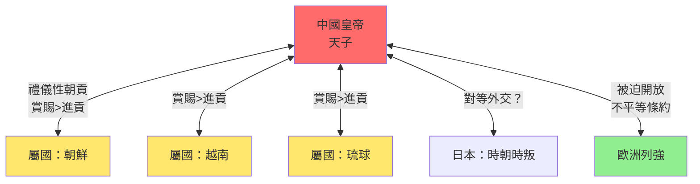
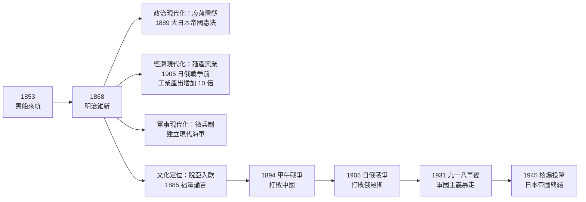
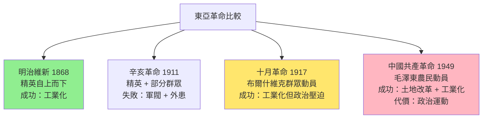
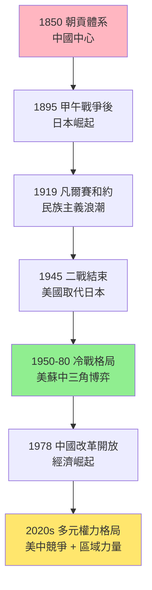
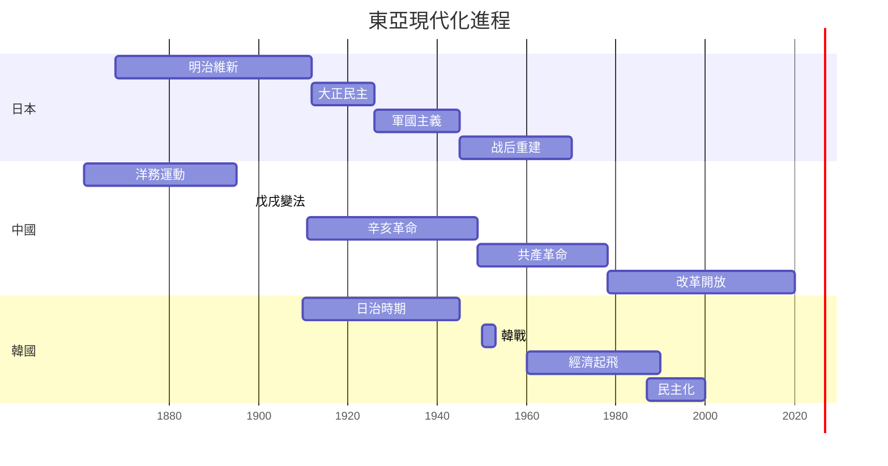
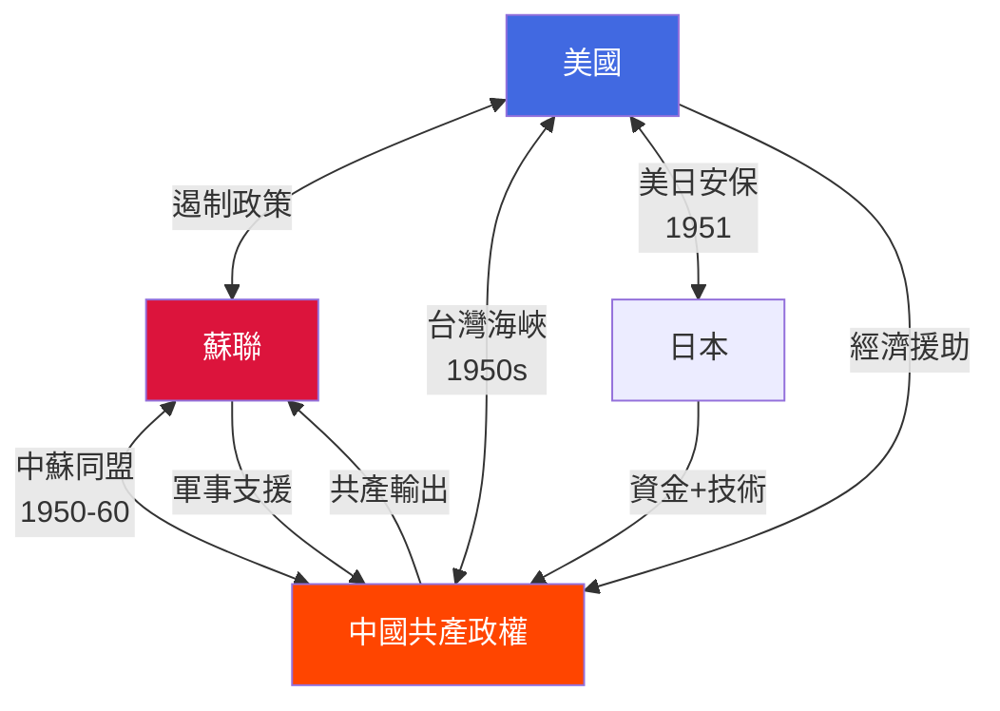
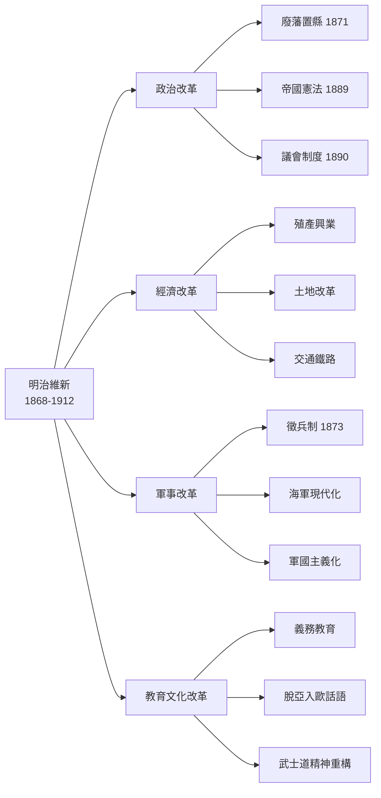
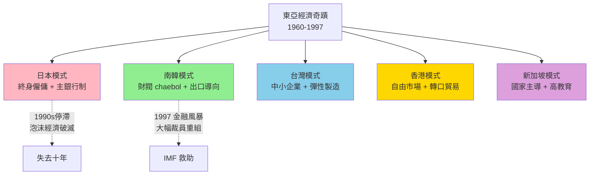

# HIST1023 現代東亞 / Modern East Asia

**Instructor**: Ghassan Moazzin
**Department**: History, HKU
**Official source**: [HKU History Course Description 2024-25](https://history.hku.hk/wp-content/uploads/2024/07/HIST-2425.pdf)
**Style**: 袁騰飛式 — 幽默、犀利，聚焦東亞三國互動與權力博弈

---

## 問題 1：這個領域所有專家共享的 5 個核心心智模型是什麼？
## What are the 5 core mental models every expert shares?

### 心智模型 1：「朝貢體系」作為東亞秩序
**The Tributary System as East Asian Order**

學者 **John K. Fairbank**（哈佛，*The United States and China*, 1948）同 **Teng Ssu-yu**（鄧嗣禹）首先系統化描述朝貢體系。呢個體系以中國為中心，但唔係單向服從，而係一種「禮儀性相互承認」嘅外交遊戲。

- **1392-1910** 朝鮮李朝為例：每次新王登基都要向北京遣使報告
- **1407-1433** 鄭和七次下西洋，展示朝貢網絡嘅規模
- **1870s** 明治日本拒絕朝貢，改用「萬國公法」，東亞舊秩序崩潰

### 心智模型 2：「脫亞入歐」與日本現代性悖論
**"Datsu-A" and Japan's Modernity Paradox**

學者 **Marius B. Jansen**（普林斯頓，*The Japanese and Chinese Revolutions*, 1992）指出：日本嘅成功恰恰係因為佢願意「脫亞入歐」，但呢個選擇令日本成為亞洲第一個帝國主義者。學者 **Eiko Ikegami**（哈佛，*The Taming of the Samurai*, 1995）分析日本點解可以同時保留封建忠誠結構同現代軍國主義。

- **1868** 明治維新，天皇《五条禪文》确立「殖產興業、文明開化」
- **1894-95** 甲午戰爭，日本首次打敗中國，震驚整個東亞
- **1905** 日俄戰爭，日本打敗歐洲強國，正式躋身列強
- **1931-45** 軍國主義暴走，最終導致全面戰爭同核爆

### 心智模型 3：「革命」作為東亞現代化引擎
**"Revolution" as Modernization Engine in East Asia**

學者 **Rebecca Karl**（紐約大學，*Staging the World*, 2002）指出：東亞嘅「革命」唔係簡單搬抄歐洲，而係東亞知識分子根據自己文化語境重新發明嘅概念。學者 **Arif Dirlik**（杜克）分析點解馬克思主義喺東亞可以落地生根。

- **1911** 辛亥革命，結束兩千年帝制，但建立嘅係軍閥北洋政府
- **1919** 五四運動，「德先生」（民主）同「賽先生」（科學）成為新口號
- **1949** 中華人民共和國成立，毛澤東宣布「中國人民站起來了」
- **1987** 台灣解除戒嚴，東亞最後一個威權政權開始民主化

### 心智模型 4：東亞冷戰——三個政權四種命運
**East Asian Cold War: Three States, Four Fates**

學者 **Odd Arne Westad**（倫敦政治經濟學院，*Decisive Encounters*, 2003）分析東亞冷戰比歐洲冷戰更複雜：唔係兩極對立，而係四角博弈（美、蘇、中、日）。

- **1950-53** 韓戰爆發，美國介入，台灣海峽兩岸永久分隔
- **1950-78** 中蘇決裂意識形態掩蓋現實利益衝突
- **1972** 尼克遜訪華，冷戰格局重組——「中國牌」出現
- **1980s** 亞洲四小龍（台灣、南韓、香港、新加坡）經濟起飛

### 心智模型 5：東亞經濟奇蹟——發展型國家的勝利？
**East Asian Economic Miracles — Triumph of Developmental States?**

學者 **Chalmers Johnson**（MIT，*MITI and the Japanese Miracle*, 1982）首先提出「發展型國家」（developmental state）概念，解釋點解日本、南韓、台灣可以快速工業化。學者 **Robert Wade**（倫敦政治經濟學院，*Governing the Market*, 1990）則認為國家干預先係關鍵，挑战新自由主義共識。

- **1960s** 日本 Sony 彩色電視機打敗美國品牌
- **1970s** 南韓浦項鋼鐵崛起，1980 年代 IT 產業爆發
- **1980s** 台灣半導體產業（台積電 1987 年成立）
- **1997** 亞洲金融風暴揭示「發展型國家」模式嘅脆弱性

---

## 問題 2：這個領域 3 個 SPECIFIC 根本分歧

### 分歧 1：明治維新係「革命」定係「改良」？
**Meiji Restoration: Revolution or Reform?**

- **A 方（革命派）**：學者 **Marius B. Jansen**——明治維新廢藩置縣、廢除階級特權，呢啲結構性變革等於一場社會革命。**Gerald L. Curtis**（哥倫比亞）——日本建立了亞洲第一個運作良好嘅議會制度。
- **B 方（改良派）**：學者 **Albert M. Craig**——明治維新保留天皇制、武士精神核心，唔係真正嘅西化。**Eiko Ikegami**——精英主導嘅自上而下改革，底層農民幾乎冇參與。

### 分歧 2：毛澤東 vs 蔣介石——邊個係「真正」中國現代化者？
**Mao Zedong vs Chiang Kai-shek: Who Modernized "Real" China?**

- **A 方（毛派）**：學者 **Stuart R. Schram**（倫敦政治經濟學院）——毛澤東動員咗幾億農民，係歷史上最大規模嘅社會動員實驗。土地改革消滅地主階級，呢個係資產階級民主革命未完成嘅任務。
- **B 方（蔣派）**：學者 **Jonathan Spence**（哈佛，*The Search for Modern China*, 1990）——蔣介石喺 1928 年北伐後統一中國，建立現代銀行、教育、軍事體系。台灣嘅經濟奇蹟係蔣氏路線嘅延續。

### 分歧 3：東亞現代化——「儒家資本主義」係真正因素定係事後孔明？
**Confucian Capitalism: Real Factor or Post-Hoc Rationalization?**

- **A 方（文化論）**：學者 **Tu Wei-ming**（杜維明，哈佛，*Confucianism in East Asia*, 1996）——儒家重視教育、勤勞、集体精神，係東亞經濟成功嘅文化基礎。
- **B 方（結構論）**：學者 **Robert Boyer**（法國經濟人類學研究中心）——「儒家資本主義」係 1990 年代亞洲價值觀熱潮時發明嘅神話；真正原因係冷戰紅利、美國市場開放、獨裁政治稳定低工資。

---

## 問題 3：10 個 PROBING 深度問題

1. 點解中國喺 1750-1850 年間从世界最大經濟體變成被侵略對象？係內因定係外因為主？
2. 日本明治維新成功，關鍵係「脫亞入歐」定係「和魂洋才」？有冇第三條路？
3. 甲午戰爭（1894-95）對東亞格局嘅影響有几深遠？呢場仗點解咁重要？
4. 五四運動（1919）同新文化運動點樣改變中國知識分子對「傳統 vs 現代」嘅理解？
5. 冷戰時期台灣同南韓點解可以發展出強大經濟體，同時保持獨裁政治？呢個矛盾點解最終可以化解？
6. 中蘇決裂（1960-78）真正原因係意識形態分歧定係國家利益衝突？點解蘇聯係「老大哥」而中國堅持自主？
7. 1978 年改革開放同明治維新——兩者有何相似之處同根本差異？
8. 香港同新加坡點解唔能夠發展出全機能民主？係華人文化問題定係歷史路徑依賴？
9. 亞洲金融風暴（1997）點解泰國、印尼重創，但香港、新加坡同南韓康復速度差咁遠？
10. 中國崛起會唔會重建東亞朝貢體系？歷史上有冇類似先例？

---

# 核心心智模型深化（中英對照）

## 1. 朝貢體系 / The Tributary System

### 1.1 Bilingual 概念對照
- 朝貢體系 (cháogòng tǐxì) = Tributary System — 以中國為中心嘅東亞國際秩序
- 萬邦來朝 (wànbāng láicháo) = All Nations Pay Tribute — 儒家天下觀嘅政治表達
- 漢字文化圈 (hànzì wénhuàquān) = Sinospheric Cultural Sphere — 共同使用漢字嘅東亞文明圈

### 1.2 史料與考據
- **核心史料**：《大明會典》、《清實錄》詳細記載各國貢使記錄；朝鮮《李朝實錄》
- **批評性史料**：朝貢使節個人日記——見證禮儀運作背後嘅實際計算
- **比較視角**：James L. Watson（*Deadly Offenders*, 1984）指出朝貢唔係單向服從，而係多方演戲

### 1.3 袁騰飛式犀利觀察
> 「成日話朝貢體系係中國霸道——其實呢個體系入面，每個小弟都收到禮物多過佢進貢！朝鮮、越南、日本，個個都想來朝——因為北京接待規格太高級！」

### 1.4 Deep Test Question
**考試題**：比較朝貢體系同歐洲威斯特伐利亞體系（1648 年《西發里亞和約》）。兩種國際秩序喺主權概念、戰爭合法性、文化等級方面有乜嘢根本差異？

### 1.5 圖解

---

## 2. 明治維新與日本現代性悖論 / Meiji Restoration Paradox

### 2.1 Bilingual 概念對照
- 脫亞入歐 (tuō yà rù ōu) = Datsu-A — 福澤諭吉 1885 年提出嘅日本定位
- 和魂洋才 (wà hún yáng cái) = Japanese Spirit + Western Skills — 保守派版本
- 明治維新 (míngzhì wéixīn) = Meiji Restoration — 1868 年開始嘅現代化運動

### 2.3 袁騰飛式犀利觀察
> 「日本人話佢係『脫亞入歐』，但係佢哋踢亞洲球隊、亞洲身高、亞洲皮膚——歐洲人眼入面，你永遠係『黃種人』！結果係：亞洲唔要佢，西方唔收佢，自己迫自己走軍國主義！」

### 2.4 Deep Test Question
**考試題**：分析日本點解喺 1894-95 年甲午戰爭中可以打敗中國。呢個結果揭示咗乜嘢結構性變化？對東亞國際秩序有乜嘢長遠影響？

### 2.5 圖解

---

## 3. 革命作為東亞現代化引擎 / Revolution as Modernization Engine

### 3.3 袁騰飛式犀利觀察
> 「成日話辛亥革命幾重要——但係1912年中華民國成立，1916年就陷入軍閥割據；1928年蔣介石勉強統一，1937年日本又殺埋嚟！革命口號好响亮，現實係：民國頭 30 年中國人生活仲慘過清朝！」

### 3.4 Deep Test Question
**考試題**：比較中國辛亥革命（1911）、俄國十月革命（1917）、日本明治維新（1868）——三者作為「現代化引擎」各有乜嘢優劣？邊個最終實現咗「富國強兵」目標？

### 3.5 圖解

---

## 4. 東亞冷戰格局 / East Asian Cold War Architecture

### 4.3 袁騰飛式犀利觀察
> 「冷戰時大家話共產主義好犀利——結果係：1953 年斯大林死、1961 年毛澤東餓死 1500 萬人、1970 年代蘇聯入侵阿富汗——呢啲共產國家有邊個真係人民當家作主？」

### 4.4 Deep Test Question
**考試題**：分析點解東亞冷戰最終以共產主義失敗結束（蘇聯 1991、中國 1978 年改革開放）——係意識形態破產定係經濟模式不可持續？

---

## 5. 發展型國家 / Developmental State

### 5.3 袁騰飛式犀利觀察
> 「Chalmers Johnson 話日本係『發展型國家』，政府帶頭搞經濟——但係佢唔話你知：日本政府最犀利嘅政策係點解？係間諜！偷英國、美國、德國技術，然後話係自己發明！」

### 5.4 Deep Test Question
**考試題**：比較台灣、南韓、香港、新加坡四個經濟體。你點解認為台灣同南韓最終走向民主化，而新加坡同香港維持威權管治？

---

## 深度自測問題詳解

**Q1**：1750-1850 年中國衰落——內因（人口過剩、土地承載力達到天花板、科舉制度扼殺技術創新）加上外因（鴉片貿易逆轉白銀流、向英國輸出茶葉換入白銀嘅貿易結構崩潰）共同造成。

**Q2**：明治維新成功關鍵——①精英共識：各藩武士一致同意改革；②地理：島國容易防守，唔似中國咁被瓜分；③外部環境：英國需要日本作為遠東盟友，唔似對中國咁掠奪；④技術盜竊：大量派遣留學生赴歐美。

**Q3**：甲午戰爭揭示——①中國軍事裝備落後，唔係制度問題；②日本動員能力超班；③西方列強默許日本擴張；④中國失敗導致戊戌維新（1898），開啟中國改革派和革命派嘅正式對立。

**Q4**：五四運動——「文言文 vs 白話文」呢個語言革命其實係一場認知革命：知識分子發現傳統文化唔係不可質疑，而係可以按理性標準重新檢驗。

**Q5**：台韓威權 + 經濟發展——呢個模式叫「壓迫性發展」（repressive development）；最終民主化條件：①中產階級崛起要求政治權利；②美國壓力；③經濟安全問題消除後，群眾要求政治自由。

**Q6-Q10**（精簡版）：
- Q6：中蘇決裂核心係意識形態鬥爭掩蓋國家利益——蘇聯要控制中國，毛澤東唔願意做「老二哥」。
- Q7：兩者相似——都由國家主導現代化、都係精英推動自上而下改革、都經歷外來壓力；根本差異——改革開放係共產主義政權內部改革，明治維新係封建制度向資本主義轉型。
- Q8：香港新加坡未民主化——精英階層受益於現有政治秩序、普通市民專注經濟成功、民主運動被政治現實限制（97 回歸恐懼 / 新加坡國小人少易控制）。
- Q9：金融風暴康復差異——香港有中國撐腰、新加坡外匯儲備充足、台灣出口結構靈活；泰國、印尼依賴短期國際資本、腐敗導致資源分配低效。
- Q10：中國重建朝貢體系可能性——「一帶一路」有啲似，但現代主權國家體系令正式朝貢不可能；更可能係「區域霸權」（regional hegemon）而非帝國朝貢。

---

## 5 個 Mermaid 圖解

### 圖解 1：東亞國際秩序演變

### 圖解 2：東亞現代化時間線

### 圖解 3：東亞冷戰四角博弈

### 圖解 4：明治維新改革範疇

### 圖解 5：東亞經濟奇蹟比較

---

## 總結

**HIST1023 Modern East Asia** 嘅核心價值：
1. **比較視角**：東亞三國（中日韓）唔係孤立發展，而係相互影響、競爭、學習
2. **結構分析**：從朝貢體系到威斯特伐利亞體系，東亞經歷根本性國際秩序轉型
3. **批判性思維**：挑戰「西方現代化 = 唯一道路」呢個 assumption

**袁騰飛金句**：
> 「歷史唔係一堆事實，而係一場解釋權之爭——邊個解釋東亞史，邊個就控制東亞未來。」

---

## 延伸閱讀

1. Fairbank, John K., ed. *The Cambridge History of China*. Vol. 10-15. Cambridge: Cambridge University Press, 1978-1991.
2. Jansen, Marius B. *The Japanese and Chinese Revolutions*. Princeton: Princeton University Press, 1992.
3. Spence, Jonathan. *The Search for Modern China*. New York: Norton, 1990.
4. Duara, Prasenjit. *Culture, Power, and the State: Rural North China, 1900-1942*. Stanford: Stanford University Press, 1988.
5. Cumings, Bruce. *Korea's Place in the Sun: A Modern History*. New York: Norton, 1997.
6. Johnson, Chalmers. *MITI and the Japanese Miracle: The Growth of Industrial Policy, 1925-1975*. Stanford: Stanford University Press, 1982.
7. Westad, Odd Arne. *Decisive Encounters: The Chinese Civil War, 1946-1950*. Stanford: Stanford University Press, 2003.
8. Arrighi, Giovanni, Takeshi Hamashita, and Mark Selden, eds. *The Resurgence of East Asia: 500, 150 and 50 Year Perspectives*. London: Routledge, 2003.
