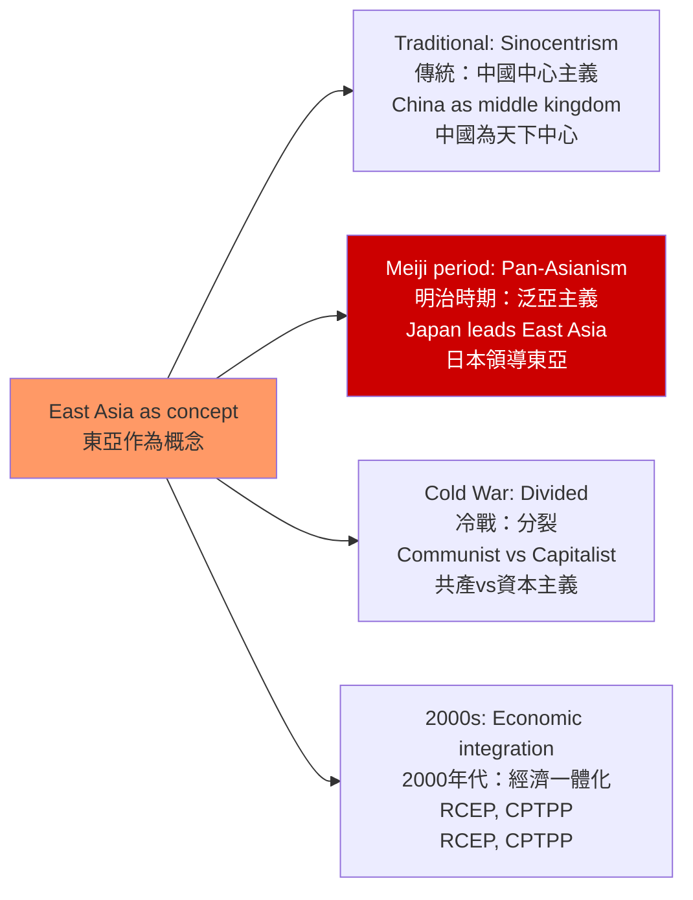
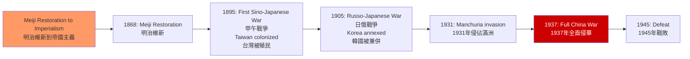
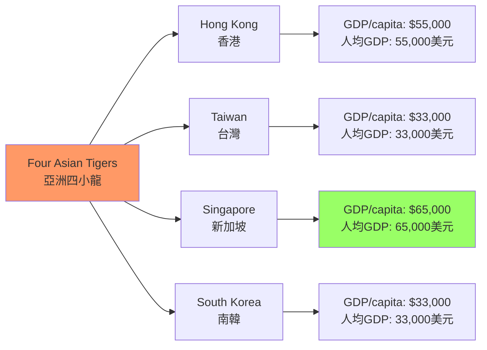

# HIST1023 現代東亞 / Modern East Asia

**Instructor**: HKU History Staff
**Department**: History, HKU
**Official source**: [HKU History Course Description](https://history.hku.hk/ug_cd/)
**Style**: 袁騰飛式 — 犀利、聚焦現代東亞的形成——從中國到日本到韓國，東亞如何成為「東亞」

---

## 問題 1：5 個核心心智模型

### 1. 東亞作為地緣政治建構
「東亞」是一個地理概念還是意識形態建構？學者 **Stefan Tanaka** 在 *Japan's Orient* (1993) 中揭示：「東亞」作為一個思想共同體的概念，是 19-20 世紀日本帝國主義學者和政治家發明的話語工具，用以將中國、韓國和日本整合為一個受日本領導的文明區域。

### 2. 明治維新與日本帝國主義
1868 年的明治維新是日本從封建社會轉變為現代工業國家的關鍵時刻。學者 **Marius Jensen** 在 *Japan: The Prehistory of Its Time* (1979) 中分析了日本如何在短短半個世紀内，從西方殖民主義的受害者變成了亞洲帝國主義的主要國家。

### 3. 冷戰與東亞的分裂
冷戰將東亞分裂為共產主義（中國、朝鮮、越南）和資本主義（日本、韓國、台灣）兩大陣營。學者 **John K. Fairbank** 研究：這種分裂的遺產在今天仍然深刻影響著東亞的政治格局。

### 4. 亞洲四小龍的經濟奇蹟
1960-1990 年間，香港、台灣、新加坡和韓國實現了人類歷史上最快的經濟增長。學者 **Alice Hsu** 和 **Robert Wade** 研究：這種「發展型國家」（developmental state）模式與當代中國經濟崛起的歷史聯繫。

### 5. 當代東亞的歷史爭議
慰安婦、靖國神社、領土爭端——當代東亞國家之間的歷史爭議，揭示了歷史記憶在國際關係中的持續影響。學者 **John Breen** 研究：為什麼道歉不能解决歷史爭議？

---

## 問題 2：3 個根本分歧

### 分歧 1：東亞現代性——日本模式 vs 中國模式？
### 分歧 2：戰爭責任——道歉 vs 忘卻？
### 分歧 3：經濟發展——自由市場 vs 國家主導？

---

## 問題 3：10 個深度問題

1. **明治維新的階級基礎**：為什麼明治維新是由下級武士（s samurai）發動的？這種「精英革命」的歷史局限性是什麼？
2. **日本帝國主義與西方帝國主義的比較**：日本在中國和東南亞的殖民擴張與西方帝國主義有什麼本質差異？日本的「大東亞共榮圈」話語與西方帝國主義話語有什麼相似和差異？
3. **冷戰在東亞**：為什麼冷戰在東亞比在西歐持續更久？1950-1975 年間的中國介入韓戰、越戰和台灣海峽危機，如何塑造了當代東亞格局？
4. **亞洲四小龍的獨特性**：香港、台灣、新加坡和韓國四個經濟體的共同點（出口導向、政府干預、儒教文化）和差異（政治體制、人口規模、自然稟賦）如何解釋了它們共同的經濟成功？
5. **中國的崛起對東亞格局的影響**：2001 年加入世貿組織以來中國 GDP 的增長（從 1.3 萬億美元到 2023 年 17.7 萬億美元）如何重塑了東亞的經濟和政治格局？
6. **當代東亞的歷史記憶政治**：為什麼日本對慰安婦和南京大屠殺的道歉不能解決與中韓兩國的歷史爭議？道歉與國內政治的複雜關係是什麼？
7. **日本在當代半導體產業的領導地位**（從 1980 年 DRAM 市場的 80% 份額到 2020 年代在半導體材料和設備的關鍵地位）如何影響了中美科技戰中日本的立場？
8. **台灣在半導體產業的全球領導地位**：台積電（TSMC）佔全球先進芯片製造的約 90%——這種「硅盾」如何影響了美國對台政策的制定？
9. **東亞的民族主義比較**：中國（共產黨動員的民族主義）、日本（保守派民族主義）、韓國（建國於抗日歷史的民族主義）三種民族主義模式的比較——它們各自在國際關係中扮演什麼角色？
10. **東亞區域整合的可能性**：RCEP（區域全面經濟夥伴關係，2022 年生效）能否克服東亞國家之間的歷史恩怨，建立真正的區域一體化？這種一體化與 EU 的深度整合相比有什麼根本障礙？

---

# 核心心智模型深化（中英對照）

## 1. 東亞作為地緣政治建構

### 1.1 圖解：東亞的歷史建構

---

## 2. 明治維新與日本帝國主義

### 2.1 圖解：日本帝國主義的擴張

---

## 3. 亞洲四小龍

### 3.1 圖解：四小龍經濟數據

---

# 總結

1. **「東亞」是一個歷史建構**：從中國中心的朝貢體系，到日本領導的泛亞主義話語，到冷戰時期的意識形態分裂，「東亞」的含義在每個歷史時期都在變化。

2. **日本帝國主義的歷史是東亞最痛苦的共同記憶**：日本的殖民擴張和戰爭罪行，至今仍然是日本與中韓兩國關係的最大障礙。

3. **亞洲四小龍的經濟奇蹟是東亞現代化經驗的最重要案例**：這種「政府引導的出口導向工業化」模式，是理解當代中國經濟崛起的歷史背景。

4. **半導體將繼續塑造東亞的地緣政治**：台積電和日本的半導體材料設備，在中美科技戰中具有決定性的戰略價值。

5. **東亞的歷史記憶政治不會消失**：只要當代東亞國家之間存在領土爭端和民族主義競爭，歷史爭議就會繼續影響區域關係。

**自學建議**: 配合 Marius Jensen 的 *Japan: The Prehistory of Its Time* + Alice Hsu 的亞洲四小龍研究，輸出讀書筆記到 `06_Reading_Notes/`。
