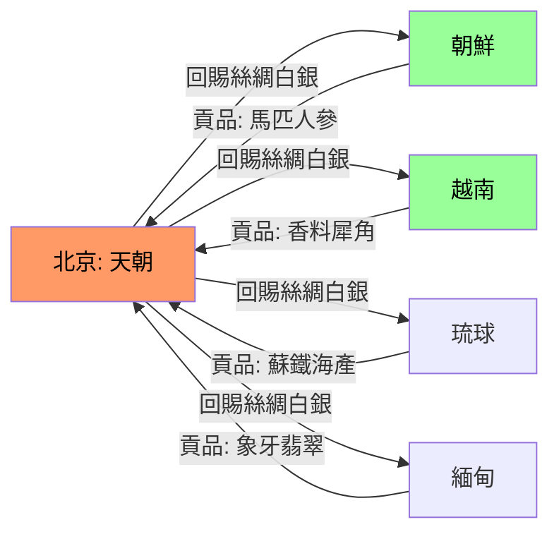
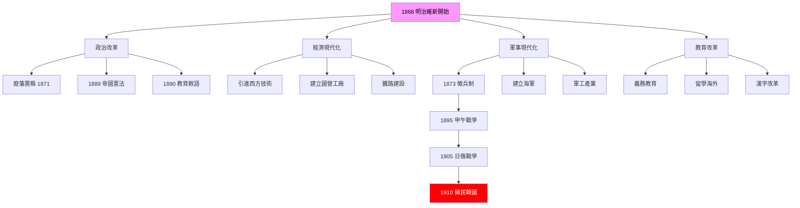
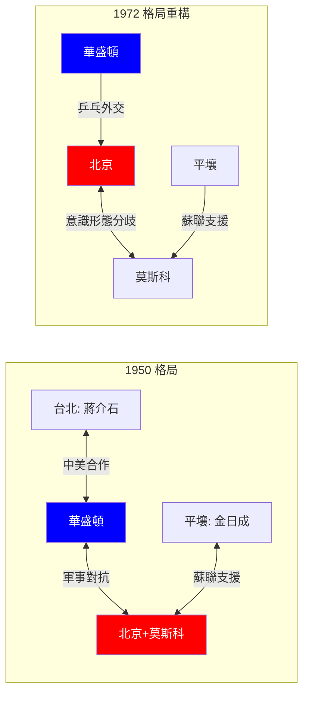
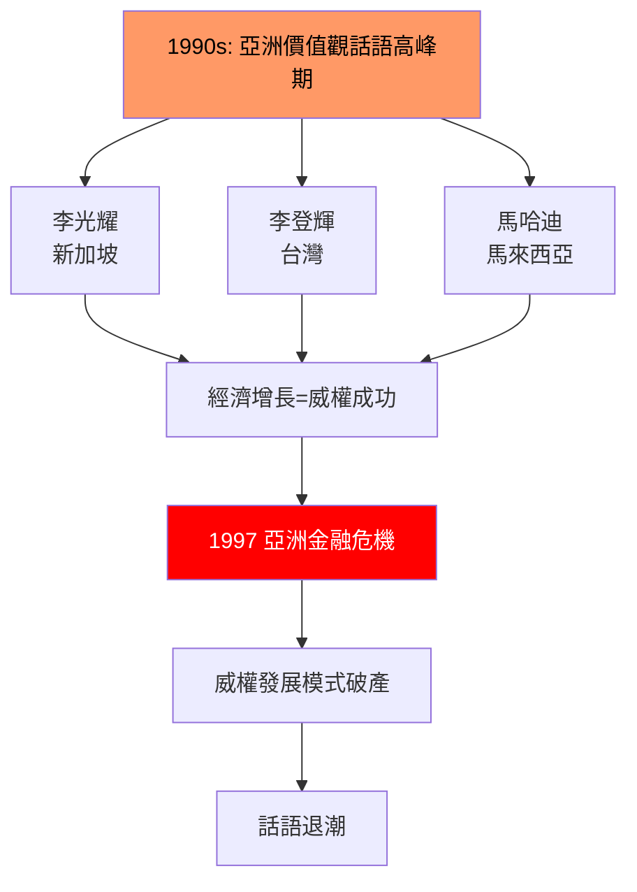
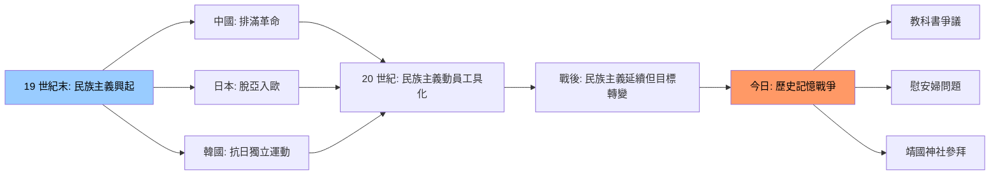
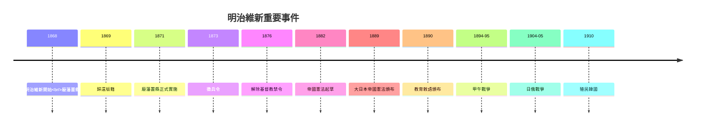
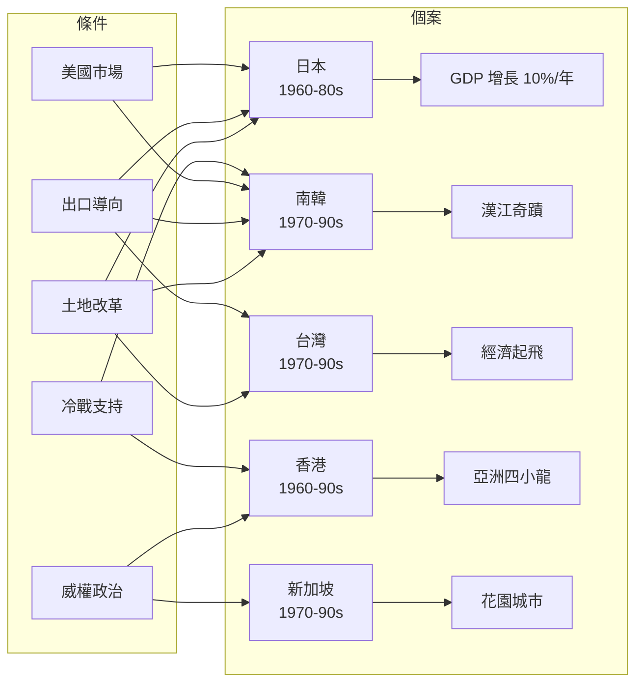
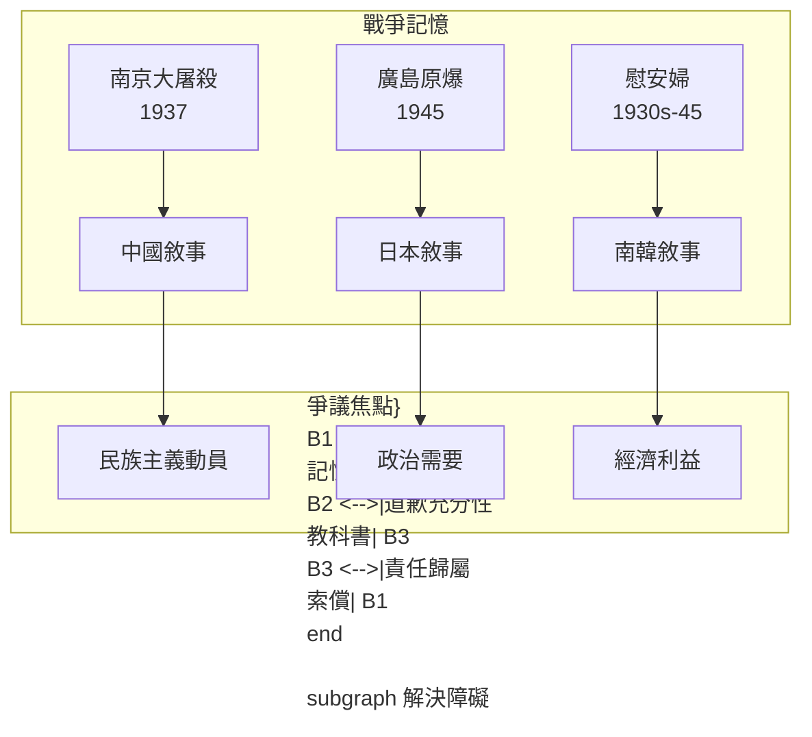

# HIST1023 現代東亞 / Modern East Asia (6 credits)

**Instructor**: Ghassan Moazzin
**Department**: History, HKU  
**Official source**: [HKU History Course Description 2024-25](https://history.hku.hk/wp-content/uploads/2024/07/HIST-2425.pdf)
**Style**: 袁騰飛式 — 幽默、犀利、聚焦東亞權力鬥爭

---

## 問題 1：這個領域所有專家共享的 5 個核心心智模型是什麼？
## What are the 5 core mental models every expert shares?

### 心智模型 1：「朝貢體系」作為東亞秩序
**The Tributary System as East Asian Order**

學者 **John King Fairbank** (哈佛, *East Asian Tradition*, 1968) 同 **Teng Ssu-yu** 共同建立「朝貢體系」概念： 以中國為中心，周邊國家定期向北京進貢，換取貿易特權同合法性承認。呢個體系維持超過 500 年，直至 19 世紀西方衝擊先至瓦解。

學者 **David Shambaugh** (喬治華盛頓大學) 指出：朝貢體系唔係單純「中國霸權」，而係一個雙向合法性交換——藩屬國得到承認同保護，中國得到象徵性服從。

- 1392 李成桂建立朝鮮王朝，正式納入朝貢體系
- 1600 德川幕府承認朝貢但實際上阻斷中日直接貿易
- 1830s 朝貢國家陸續簽署不平等條約，體系崩解

### 心智模型 2：明治維新作為「防衛性現代化」
**Meiji Restoration as Defensive Modernization**

學者 **Marius Jansen** (普林斯頓, *The Japanese and the Chinese*, 1986) 指出：明治維新唔係單純「學習西方」，而係「點樣喺西方威脅下生存」嘅策略。1868 年明治維新口號「富國強兵」就已經揭示目標係建立足以抵抗西方嘅國家能力。

學者 **Andrew Gordon** (UC Berkeley, *A Modern History of Japan*, 3rd ed. 2014) 強調：維新唔係和平改革，而係靠軍事政變、血腥內戰 (戊辰戰爭 1868-1869)。

- 1868 黑船事件後 15 年，日本完成明治維新
- 1895 甲午戰爭，日本擊敗清朝——維新成功嘅最終證明
- 1905 日俄戰爭，日本成為第一個擊敗歐洲列強嘅亞洲國家

### 心智模型 3：東亞冷戰係「代理人戰爭」
**The East Asian Cold War as Proxy Warfare**

學者 **John Lewis Gaddis** (牛津, *The Cold War*, 2005) 指出：東亞冷戰唔係歐美蘇聯冷戰嘅延伸，而係一個獨立又關聯嘅戰場。韓戰 (1950-1953)、國共內戰 (1945-1949)、越南戰爭 (1955-1975) 都係冷戰嘅東亞版本。

學者 **Chen Jian** (康奈爾大學, *Mao's China and the Cold War*, 2001) 話：中國唔係被動參與冷戰，而係主動塑造——毛澤東想利用冷戰形勢推進革命。

- 1950 中國出兵韓戰，直接同美軍對抗
- 1960s 中蘇分裂，東亞出現第二條冷戰線
- 1972 尼克遜訪華，東亞冷戰格局重新配置

### 心智模型 4：「亞洲價值觀」話語嘅政治功能
**The Political Function of "Asian Values" Discourse**

學者 **Arrighi** (約翰霍普金斯, *The Long Twentieth Century*, 1994) 同 **Silver** 研究東亞發展模式，指出：「亞洲價值觀」呢個話語係東亞各國政府用嚟合理化威權統治、拒絕西方民主壓力嘅工具。

學者 **Tu Weiming** (杜維明, 北京大學) 等新儒家學者則認為「亞洲價值觀」係真正嘅文化傳統，而非政治工具。呢個分歧到今日仍然激烈。

- 1993 新加坡李光耀：民主適合西方，亞洲需要「亞洲式民主」
- 1997 亞洲金融危機後，「亞洲價值觀」話語退潮
- 2010s-2020s 中美競爭重燃「價值觀之爭」

### 心智模型 5：東亞民族主義係「發明嘅傳統」
**East Asian Nationalism as Invented Tradition**

學者 **Benedict Anderson** (康奈爾, *Imagined Communities*, 1983) 提出「發明嘅傳統」概念：民族唔係自然形成，而係通過教育、媒體、國族象徵「想像」出嚟。東亞各國民族主義都係 19-20 世紀「發明」嘅產品。

學者 **Norman H. Farley** 研究韓國民族主義，發現「朝鮮民族」呢個概念係 19 世紀末先至出現，之前只有「兩班」「賤民」等階級身份。

---

## 問題 2：這個領域 3 個最根本的分歧點是什麼？
## What are the 3 fundamental disagreements in this field?

### 分歧 1：東亞現代化——「衝擊-回應」定「自身演變」？
**East Asian Modernization: "Impact-Response" vs "Internal Evolution"?**

**核心問題**: 東亞點解要現代化？係西方衝擊被動回應，定自身發展邏輯？

- **A 方 / Side A — 衝擊回應派 (Impact-Response School)**:
  - **John King Fairbank** (哈佛, *China and America*, 1978)
  - **Mark Elvin** (ANU, *The Pattern of the Chinese Past*, 1973)
  - 論點：西方帝國主義係東亞現代化嘅主要推動力。沒有鴉片戰爭、中國唔會被迫開放；冇黑船事件、日本唔會維新。現代化係對西方挑戰嘅回應
  - 證據：1853 黑船事件，1868 明治維新；1842 南京條約，1860s 洋務運動

- **B 方 / Side B — 自身演變派 (Internal Evolution School)**:
  - **Pomeranz** (*Great Divergence*, 2000)
  - **Kenneth Scott Latourette** (耶魯)
  - 論點：東亞社會內部已經有演變動力。16-18 世紀商業化、城市化、知識分子活躍——呢啲因素先係現代化嘅基礎。西方衝擊只係加速器
  - 證據：1750 長江三角洲生活水平同英國差唔多；江戶日本已經係世界上最大城市文明之一

**點解呢個分歧重要**: 影響我哋點解理解東亞各國今日喺全球化中嘅定位。

### 分歧 2：南京大屠殺——30 萬定 20 萬？
**Nanking Massacre: 300,000 or 200,000?**

**核心問題**: 1937-1938 南京大屠殺死亡人數，歷史學界爭議背後嘅政治動機。

- **A 方 / Side A — 30 萬數字派**:
  - **John Rabe** (德國外交官) 日記記載
  - **Zhang Xianliang** (南京大屠殺紀念館)
  - 論點：東京審判、南京軍事法庭、中國學者一致確認 30 萬。呢個數字係國際共識
  - 證據：紅卍字會 (International Committee for the Red Cross) 記錄、西方傳教士信件

- **B 方 / Side B — 質疑數字派**:
  - **Ian Fukuda** (日本學者)
  - **Japanese Revisionist historians**
  - 論點：中國方面文件唔可靠，「30 萬」數字係政治宣傳。實際數字可能係 2-20 萬
  - 證據：東京審判記錄顯示起訴書列舉 20 萬；1938 年中國媒體曾報 5-6 萬

**點解重要**: 數字爭議反映中日兩國對戰爭責任、歷史教育嘅根本分歧，影響兩國外交關係。

### 分歧 3：韓戰——中國被迫出兵定主動參與？
**Korean War: Forced or Willing Participation?**

**核心問題**: 1950 年中國決定出兵韓戰，係被蘇聯迫定自己選擇？

- **A 方 / Side A — 被迫出兵派**:
  - **Thomas Christensen** (普林斯頓, *Useful Adversaries*, 1996)
  - 論點：毛澤東本來唔想打，但斯大林施壓——如果中國唔出兵，蘇聯就會放棄中國。中國係被逼到牆角
  - 證據：1949-1950 毛澤東多次表示希望和平建設；蘇聯空軍支援遲遲未到

- **B 方 / Side B — 主動參與派**:
  - **Chen Jian** (*Mao's China and the Cold War*, 2001)
  - **Shen Zhihua** (沈志華, 中國學者, *Korea War and Cold War*, 2003)
  - 論點：中國有自己嘅戰略計算——利用韓戰加速統一、清除蔣介石殘餘勢力、獲得蘇聯工業援助。出兵係主動選擇
  - 證據：毛澤東 1950 年 10 月已經組建志願軍；中國軍隊 10 月 19 日跨過鴨綠江

**點解重要**: 影響我哋點解理解中國外交政策嘅連續性同意識形態角色。

---

## 問題 3：10 個 PROBING 深度問題
## 10 Probing Questions

1. 如果明治維新失敗，日本會唔會變成另一個殖民地？
2. 點解甲午戰爭係東亞近代史嘅轉折點？（唔好只答「中國失敗」）
3. 朝貢體系崩解之後，東亞有冇建立過新嘅區域秩序？
4. 點解韓戰爆發喺北緯 38 度線？（唔好只答「美蘇對抗」）
5. 如果毛澤東冇出兵韓戰，今日嘅台灣問題會點樣？
6. 點解東亞威權政權可以維持經濟發展但西方自由主義預言會失敗？
7. 「亞洲價值觀」呢個概念係唔係本身就係冷戰產物？
8. 比較中國、日本、韓國嘅戰爭記憶工廠——邊個最成功？邊個最扭曲？
9. 點解今日嘅中日關係比 1970 年代差？
10. 如果東亞各國真係有共同歷史，係乜嘢？係朝貢體系定抗日戰爭？

---

## 核心心智模型深化（中英對照）

## 1. 朝貢體系 (Tributary System)

### 1.1 Bilingual 概念對照
| English | 中英對照 | 定義 | 歷史意義 |
|---|---|---|---|
| Tributary system | 朝貢體系 | 以中國為中心嘅東亞國際秩序 | 維持 500 年相對穩定 |
| Tribute | 貢品 | 藩屬國向宗主國進獻嘅物品 | 象徵服從，非實質負擔 |
| Sinitic world | 漢字文化圈 | 共享漢字、儒學嘅東亞區域 | 超越政治邊界嘅文化聯結 |
| Barbarian | 蠻夷 | 中國對外族嘅蔑稱 | 反映文化優越感 |
| Sinocentrism | 中國中心主義 | 以中國為世界中心嘅世界觀 | 阻礙對外學習 |

### 1.2 史料與考據
- 主要史料: Fairbank & Teng, *East Asian Tradition* (1968); Wills, *Pepper, Guns, and Parleys* (1974)
- 學者: John Fairbank (哈佛); Mark Mancall (史丹福); Pierre-Henri Durand (法國學者)

### 1.3 袁騰飛式犀利觀察
朝貢體系表面上係「中國霸權」，但實際上係一個「象徵政治」大於實質控制嘅系統。藩屬國送嚟嘅貢品——馬匹、香料、人參——嘅市場價值，遠遠低於中國回賜嘅絲綢、白銀。歷史學家話：「中國用面子換實際利益。」呢個系統維持 500 年，關鍵就係佢提供嘅唔係剝削，而係合法性——邊個得到北京承認，邊個就係「正統」。呢個遊戲到今日仍然適用，只係庄家換咗。

### 1.4 Deep Test Question
- 如果朝貢體系繼續運作，東亞會唔會出現類似歐洲威斯特伐利亞式嘅主權國家體系？
- 朝貢體系殘餘影響喺邊度仲睇得到？

### 1.5 圖解


---

## 2. 明治維新 (Meiji Restoration)

### 2.1 Bilingual 概念對照
| English | 中英對照 | 定義 | 歷史意義 |
|---|---|---|---|
| Meiji Restoration | 明治維新 | 1868-1912 年日本政治社會改革 | 亞洲第一個現代化成功案例 |
| Sonnō jōbu | 尊皇攘夷 | 天皇之上、驅逐外夷 | 維新口號 |
| Fukoku kyōhei | 富國強兵 | 富裕國家、強大軍隊 | 維新目標 |
| Buraku kaieki | 殖產興業 | 發展產業、獎勵工商 | 經濟政策 |
| Bunmei kaika | 文明開化 | 文明化、歐化 | 文化政策 |

### 2.2 史料與考據
- 主要史料: Jansen, *The Japanese in the Modern World* (1986); Gordon, *Modern History of Japan* (2014)
- 學者: Marius Jansen (普林斯頓); Andrew Gordon (UC Berkeley); Carol Gluck (哥倫比亞)

### 2.3 袁騰飛式犀利觀察
歷史書成日話明治維新係「成功改革」——但我問你：邊個嘅成功？維新三大政策——廢藩置縣 (廢除封建藩國)、廢除階級歧視 (提升武士地位但繼續壓迫農民)、徵兵制——就係建立一個以天皇為名、軍閥為實嘅戰爭機器。1910 年日本正式殖民韓國，就係維新「富國強兵」政策嘅終極證明。所以明治維新唔係「現代化成功」，而係「軍國主義成功」。

### 2.4 Deep Test Question
- 明治維新係「和魂洋才」定「去日本化」？
- 如果維新派冇打贏戊辰戰爭，日本會點樣？

### 2.5 圖解


---

## 3. 東亞冷戰 (East Asian Cold War)

### 3.1 Bilingual 概念對照
| English | 中英對照 | 定義 | 歷史意義 |
|---|---|---|---|
| Korean War | 韓戰/朝戰 | 1950-1953 年朝鲜半岛战争 | 冷戰第一場「熱戰」 |
| Chinese intervention | 中國出兵 | 1950 年志願軍入朝 | 中國全面參與冷戰 |
| Vietnam War | 越南戰爭 | 1955-1975 年美越戰争 | 東亞冷戰延長線 |
| Taiwan Strait crises | 台海危機 | 1954-55, 1958 台灣海峽武裝衝突 | 中美直接對抗 |
| Nixon shock | 尼克遜震盪 | 1972 尼克遜訪華 | 東亞冷戰格局重構 |

### 3.2 史料與考據
- 主要史料: Chen Jian, *Mao's China and the Cold War* (2001); Westad, *Decisive Encounters* (2003)
- 學者: Chen Jian (康奈爾); Odd Arne Westad (倫敦政經學院); James Sherman (哥倫比亞)

### 3.3 袁騰飛式犀利觀察
東亞冷戰唔係歐美蘇聯冷戰嘅「附屬品」——佢係一個有自己邏輯嘅戰場。1950 年中國出兵韓戰，原因唔係「共產主義擴張」咁簡單：毛澤東需要一個戰爭嚟統一、清除異見、建立合法性。史太林催中國出兵，係因為蘇聯唔想自己流血。呢個「三方博弈」——華盛頓、莫斯科、北京——就係東亞冷戰嘅核心。歷史書成日話「冷戰係意識形態戰爭」，但現實就係：所有人都喺度計算自己嘅利益。

### 3.4 Deep Test Question
- 如果史太林冇迫毛澤東出兵，今日嘅東亞會點樣？
- 台海危機點解冇變成全面戰爭？

### 3.5 圖解


---

## 4. 亞洲價值觀 (Asian Values)

### 4.1 Bilingual 概念對照
| English | 中英對照 | 定義 | 歷史意義 |
|---|---|---|---|
| Asian values | 亞洲價值觀 | 東亞特有嘅儒學傳統、社會優先 | 批評西方個人主義 |
| Confucianism | 儒學/儒教 | 孔子思想、東亞主流意識形態 | 現代化過程再包裝 |
| Authoritarianism | 威權主義 | 強政府、限制政治權利 | 1970-80s 東亞經濟奇蹟正當化 |
| Developmental state | 發展型國家 | 政府積極干預經濟發展 | 東亞模式核心 |
| Soft authoritarianism | 軟威權主義 | 經濟自由+政治控制 | 新加坡模式 |

### 4.2 史料與考據
- 主要史料: Bello & Rosenfeld, *Dragons in Distress* (1990); Rodan, *The Political Economy of Singapore's Industrialization* (1989)
- 學者: Garry Rodan (西澳大學); Walden Bello (曼谷南方大學)

### 4.3 袁騰飛式犀利觀察
「亞洲價值觀」呢個概念就係 1990 年代亞洲威權政府嘅政治工具。李光耀話「民主會令亞洲陷入混亂」，就係為咗合理化自己嘅獨裁統治。但 1997 年亞洲金融危機就證明：威權唔等於發展。時至今日，中美競爭重新包裝「價值觀之爭」——中國話自己模式先至啱，美國話民主自由先至啱。歷史話我知：所有意識形態話語，都係為政治服務。

### 4.4 Deep Test Question
- 「亞洲價值觀」同「儒家資本主義」係唔係同一樣嘢？
- 點解 1997 年金融危機之後「亞洲價值觀」話語退潮？

### 4.5 圖解


---

## 5. 東亞民族主義 (East Asian Nationalism)

### 5.1 Bilingual 概念對照
| English | 中英對照 | 定義 | 歷史意義 |
|---|---|---|---|
| Imagined community | 想像共同體 | 民族係透過媒體教育「想像」出嚟 | 民族唔係自然存在 |
| Invented tradition | 發明嘅傳統 | 為民族服務而被發明嘅「古老傳統」 | 民族主義係近代產品 |
| National humiliation | 百年國恥 | 中國對 19-20 世紀屈辱嘅記憶 | 中國民族主義核心敘事 |
| Comfort women | 慰安婦 | 日軍二戰性奴隸制度受害者 | 戰爭記憶爭議核心 |
| Textbook controversy | 教科書爭議 | 各國對歷史書寫嘅政治操作 | 戰爭責任未解決 |

### 5.2 史料與考據
- 主要史料: Anderson, *Imagined Communities* (1983); Duara, *Rescuing History from the Nation* (1995)
- 學者: Benedict Anderson (康奈爾); Prasenjit Duara (杜克)

### 5.3 袁騰飛式犀利觀察
歷史書成日話「中國民族主義係抵禦外侮嘅正當情感」——呢個係受害者視角。但歷史學家 Prasenjit Duara 話我知：民族主義係一把雙刃劍——佢可以團結抵抗外敵，但亦可以用嚟鎮壓內部異見、文化同化少數民族。「百年國恥」呢個敘事就係最好嘅例子：佢團結咗中國人，但亦為民族主義情緒提供燃料，令中國外交政策容易被歷史問題綁架。

### 5.4 Deep Test Question
- 「慰安婦」問題點解到今日仍然係中韓日外交嘅痛點？
- 東亞各國點樣「發明」自己嘅民族歷史？

### 5.5 圖解


---

## 深度自測問題詳解（中英對照）
## Detailed Solutions to 10 Deep Questions

## 詳解 1: 如果明治維新失敗，日本會唔會變成另一個殖民地？

**Answer**: 呢個係一個合理嘅反事實問題。學者有以下分析：

如果維新失敗，日本可能出現以下情況：
1. **可能出現多個獨立政權**：倒幕各藩可能建立自己嘅政權，形成類似戰國時代嘅割據局面
2. **外國干預加劇**：英法等國可能利用內亂擴大喺日本嘅利益，如同對中國咁樣
3. **可能出現「半殖民地」狀態**：如同埃及、土耳其，日本可能被迫簽署不平等條約、開放口岸

但另一個可能性：
- 德川幕府可能最終都會被迫現代化——因為國際壓力太大
- 倒幕同維新力量唔會完全消失，只係時間延遲

**歷史意義**: 明治維新成功唔係歷史必然，但日本面臨嘅生存危機係真實——呢個逼住佢哋必須現代化。

---

## 詳解 2: 點解甲午戰爭係東亞近代史嘅轉折點？

**Answer**: 甲午戰爭 (1894-1895) 嘅轉折意義遠超軍事失敗：

1. **心理轉折**：亞洲第一個「西方」現代化成功——日本擊敗咗「老大哥」中國
2. **地緣政治重構**：
   - 1895《馬關條約》：台灣、澎湖、遼東半島（後被三國干涉還返）割讓日本
   - 朝鮮由中國藩屬國變成日本勢力範圍
3. **列強東亞政策改變**：
   - 德國、俄國開始重新評估東亞政策
   - 1897 德國佔據膠州灣、俄國佔據旅順——瓜分中國加速
4. **中國改革派失敗**：
   - 洋務運動破產——「中學為體、西學為用」被證明唔夠
   - 戊戌變法 (1898) 失敗嘅伏筆

**歷史意義**: 甲午戰爭唔係一場普通戰爭，而係東亞國際秩序重新洗牌嘅信號。

---

## 詳解 3: 朝貢體系崩解之後，東亞有冇建立過新嘅區域秩序？

**Answer**: 朝貢體系 19 世紀崩解後，東亞經歷多個階段：

1. **帝國主義時期 (1895-1945)**：冇穩定秩序，只有列強競爭——日本試圖建立「大東亞共榮圈」但失敗
2. **冷戰時期 (1945-1991)**：東亞被冷戰分割——西太平洋第一島鏈、兩岸分裂
3. **經濟一體化時期 (1980s-2020s)**：
   - APEC (1989)、ASEAN+3 (1997)
   - 但政治安全問題未解決——台灣問題、靖國神社、歷史問題
4. **現狀**：冇穩定秩序——中美競爭重新撕裂東亞

**歷史意義**: 過去 130 年，東亞從未恢復到朝貢體系嗰種相對穩定嘅秩序。

---

## 詳解 4: 點解韓戰爆發喺北緯 38 度線？

**Answer**: 38 度線係冷戰隨意劃分嘅產物，唔係歷史、地理或族群邊界：

1. **1945 年美蘇分佔**：美軍佔據南緯 38 度以南，蘇軍佔據以北
2. **軍事接管線**：本來係臨時安排，但因冷戰固化為政治邊界
3. **朝韓都認為自己係唯一合法政府**：呢個係衝突嘅根本原因
4. **史太林、金日成策劃**：1950 年初，蘇聯默許、朝鮮策劃越過 38 度線統一

**歷史意義**: 38 度線就係冷戰點解係「戰」唔係「冷」嘅證明——政治邊界被當作軍事底線。

---

## 詳解 5: 如果毛澤東冇出兵韓戰，今日嘅台灣問題會點樣？

**Answer**: 呢個係一個複雜嘅反事實問題：

如果中國唔出兵：
1. **美軍可能北上鴨綠江**：美軍已經逼近中國邊境
2. **蘇聯可能被迫直接參戰**：蘇聯空軍已經秘密參戰，否則美軍轟炸會威脅蘇聯邊境
3. **蔣介石可能反攻大陸**：1950 年 6 月杜魯門已經宣佈「台灣地位未定」

但現實係：
- 毛澤東有自己嘅計算——需要戰爭嚟統一、清除異見、獲得蘇聯援助
- 出兵令台灣問題長期化——因為美國第七艦隊介入台海

**歷史意義**: 歷史冇如果，但台灣問題複雜化同韓戰直接相關——呢個係歷史嘅諷刺。

---

## 詳解 6: 點解東亞威權政權可以維持經濟發展但西方自由主義預言會失敗？

**Answer**: 呢個係東亞政治經濟學嘅核心問題，有以下解釋：

**發展型國家 (Developmental State) 理論**:
- 學者 **Chalmers Johnson** (MIT, *MITI and the Japanese Miracle*, 1982) 首先提出
- 核心：政府主動規劃經濟發展、保護戰略產業、提供補貼
- 典型：日本、韓國、台灣

**比較優勢**:
- 東亞威權政權可以：
  - 強行壓低工資 (防止通脹)
  - 徵收農業剩餘 (為工業提供資金)
  - 鎮壓工會 (維持投資者信心)
  - 土地改革 (減少農民反抗)

**歷史條件**:
- 1960s-80s 全球經濟擴張——出口導向策略有市場
- 冷戰背景下美國接受東亞威權政權

**歷史意義**: 東亞經濟奇蹟唔係「威權=發展」公式，而係特定歷史條件下嘅例外。

---

## 詳解 7: 「亞洲價值觀」呢個概念係唔係本身就係冷戰產物？

**Answer**: 呢個概念確實係冷戰時期出現，但歷史更複雜：

**冷戰根源**:
- 1970s-80s：亞洲威權政權（新加坡、韓國威權時期、台灣）用「亞洲價值觀」抵禦西方民主壓力
- 美國因為冷戰需要盟友，暫時接受呢個論述

**歷史根源**:
- 「儒家資本主義」呢個概念可以追溯到 Max Weber (1910s)——佢問：點解中國冇發展出資本主義？
- 1980s-90s：學者（如 Tu Weiming）重新發現儒學，用作文化抵抗西方

**今日演變**:
- 中國共產黨用「中國特色社會主義」代替「亞洲價值觀」
- 但骨子裡仍然係「非西方模式」話語

**歷史意義**: 「亞洲價值觀」係一個被不斷重新包裝嘅政治話語，唔係固定不變嘅文化本質。

---

## 詳解 8: 比較中國、日本、韓國嘅戰爭記憶工廠——邊個最成功？

**Answer**: 呢個係一個有爭議嘅問題，但歷史事實係：

**中國模式**:
- 「南京大屠殺」、「731 部隊」、「慰安婦」——呢啲記憶被國家機器高度動員
- 每年 12 月 13 日南京大屠殺死難者國家公祭日
- 批評：過度政治化，忽略中國其他戰爭暴行

**日本模式**:
- 「廣島、長崎原爆」記憶被塑造為「受害者」敘事
- 對亞洲各國造成嘅苦難記憶被壓抑或淡化
- 批評：選擇性記憶

**韓國模式**:
- 1919 三一運動被塑造為民族獨立起點
- 慰安婦問題持續喺國際舞台上被提起
- 批評：過度依賴受害者敘事

**歷史意義**: 所有國家都喺度選擇性記憶——問題唔係記憶，而係歷史教育同公共論述能否允許批判性思考。

---

## 詳解 9: 點解今日嘅中日關係比 1970 年代差？

**Answer**: 1970s 中日關係正常化時，兩國有共同敵人——蘇聯威脅。但蘇聯消失後，中日關係失去戰略基礎：

1. **歷史問題未解決**：
   - 教科書爭議 (1982, 2001, 2005)
   - 靖國神社參拜 (小泉純一郎 2001-2006)
   - 慰安婦問題
2. **領土爭議**：
   - 釣魚台/尖閣諸島衝突升級 (2010s)
   - 东海防空識別區重疊
3. **經濟競爭**：
   - 中國 GDP 2010 年超越日本
   - 地區領導權之爭
4. **美國因素**：
   - 美日同盟喺中美競爭中重新激活

**歷史意義**: 中日關係從來都唔係單純兩國關係——東亞國際關係係三方（中美日）或四方（加台灣）博弈。

---

## 詳解 10: 如果東亞各國真係有共同歷史，係乜嘢？

**Answer**: 東亞共同歷史確實存在，但從未被正式承認：

1. **朝貢體系時代**：共同嘅漢字文化、儒學價值觀、貿易網絡
2. **西方衝擊時代**：共同抵禦西方帝國主義嘅經歷——包括不平等條約、領事裁判權
3. **殖民時代**：日本係唯一未被殖民嘅東亞大國，但佢自己變成殖民者
4. **冷戰時代**：共同被冷戰分割、代理人戰爭
5. **經濟一體化時代**：供應鏈高度整合

**歷史意義**: 東亞共同歷史被歷史恩怨、領土爭議、價值觀分歧阻礙——呢個係東亞一體化最大障礙。

---

## 5 個 Mermaid 圖解
## 📊 Diagram 1: 朝貢體系運作機制

```mermaid
flowchart TD
    A[北京: 天子] -->|1. 冊封承認| B[藩屬國國王]
    A -->|2. 回賜白銀絲綢| C[藩屬國]
    B -->|3. 定期朝貢| A
    C -->|4. 貢品: 馬匹香料| A
    
    B -->|合法性輸出| D[維持統治正當性]
    C -->|經濟交流| E[定期貿易】
    
    subgraph "崩解過程"
        F[19 世紀西方衝擊] --> G[不平等條約]
        G --> H[朝貢關係被取代]
    end
    
    style A fill:#f96,color:#000
    style F fill:#f00,color:#fff
```

---

## 📊 Diagram 2: 明治維新改革時間線



---

## 📊 Diagram 3: 東亞冷戰格局演變

```mermaid
flowchart LR
    subgraph "1950-1971: 冷戰對抗"
        A[美國] <-->|台灣海峽| B[中國]
        A -->|軍事援助| C[台灣]
        B -->|蘇聯支援| D[北韓]
        A -->|軍事援助| E[南越]
    end
    
    subgraph "1972-1991: 格局重構"
        A1[美國] -->|乒乓外交<br/>尼克遜訪華| B1[中國]
        B1 -->|分裂| C1[蘇聯]
        C1 -->|對抗| A1
    end
    
    subgraph "1991- : 後冷戰格局}
        A2[美國] <-->|經濟合作| B2[中國]
        A2 -->|同盟| C2[日本<br/>南韓]
        B2 -->|競爭| A2
    end
```

---

## 📊 Diagram 4: 東亞經濟奇蹟比較



---

## 📊 Diagram 5: 東亞歷史記憶之戰



---

## 總結

1. **朝貢體系唔係單純霸權**：佢係一個雙向合法性交換——呢個框架幫我哋理解東亞傳統國際關係
2. **明治維新係「防衛性現代化」**：目標唔係「文明化」，而係避免成為殖民地——呢個係理解東亞現代化嘅關鍵
3. **東亞冷戰有自己邏輯**：唔係歐美冷戰嘅附屬，而係北京、莫斯科、華盛頓三方博弈
4. **「亞洲價值觀」係政治工具**：東亞發展模式有獨特性，但唔係「文化本質」——歷史條件先係關鍵
5. **東亞民族主義係「發明嘅傳統」**：呢個概念幫我哋批判性思考今日嘅歷史教育同記憶政治

**最後辛辣總結**: 東亞歷史複雜過任何單一理論可以解釋。朝貢體系、西方衝擊、冷戰分割——呢啲都係塑造東亞今日格局嘅力量。作為香港大學歷史系學生，你哋嘅任務就係喺呢個複雜性中保持批判性思考——唔好被任何單一敘事壟斷。

---
**版權所有 © HKU History Self-Study**  
**For educational purposes only**
