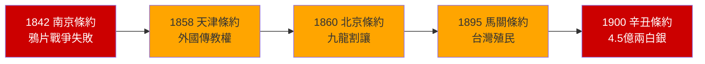
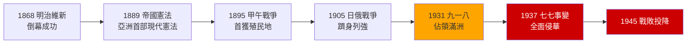
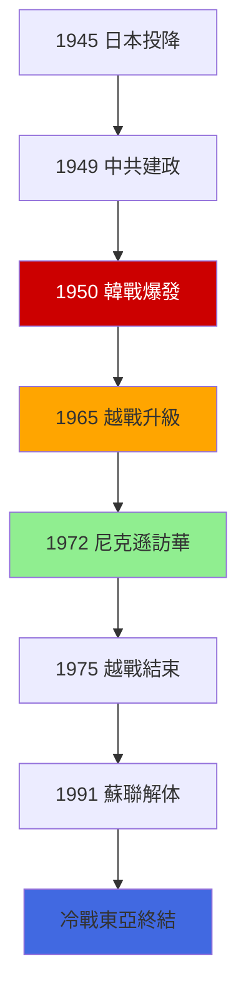
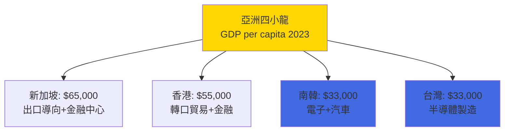
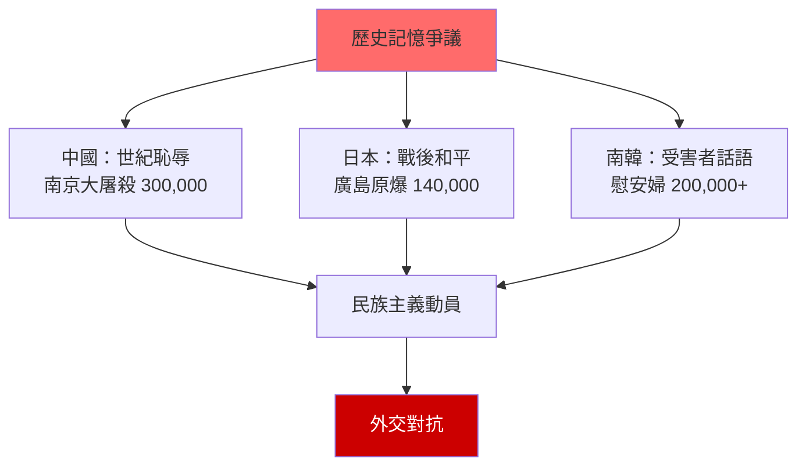

# HIST1023 現代東亞 / Modern East Asia

/** HKU | 6 credits | Instructor: Ghassan Moazzin */

---

## 問題 1：5 個核心心智模型

### 1. 條約體系與中國的「世紀恥辱」
**定義**: 1842-1943 年間，西方列強和日本通過一系列不平等條約，在中國建立了片面的治外法權、關稅控制、租界和勢力範圍——這段歷史被中國民族主義話語稱為「世紀恥辱」（Century of Humiliation）。

**學者**: **John K. Fairbank** — *Trade and Diplomacy on the China Coast, 1842-1854* (1953); **Prasenjit Duara** — *Rescuing History from the Nation* (1995); **James L. Watson** — 研究晚清帝國主義與中國社會關係

**驗證**: 1842 年《南京條約》——中國被迫開放五口通商，割讓香港島（75 平方公里），賠償 2,100 萬銀元；1900 年義和團事件後《辛丑條約》——中國賠償 4.5 億兩白銀（本息合計約 10 億兩），相當於當時清廷12年的財政收入。

**歷史事件**:
- **1842年**: 《南京條約》——鴉片戰爭失敗後第一個不平等條約
- **1858年**: 《天津條約》——外國傳教士有權在中國內地傳教
- **1895年**: 《馬關條約》——中國承認朝鮮「完全獨立」，割讓台灣及澎湖
- **1900年**: 義和團事件——八國聯軍入侵北京，北京淪陷
- **1937年**: 南京大屠殺——日軍攻陷南京，30萬人死亡

### 2. 明治維新——從受害者到帝國主義者
**定義**: 1868 年日本天皇發動明治維新，在 30 年內從封建農業國轉變為現代工業國，並在 1895 年後轉變為帝國主義國家——從西方殖民主義的受害者變成了亞洲殖民主義的主要國家。

**學者**: **Marius B. Jansen** — *The Japanese and Their Enemies* (1999); **Ian Neary** — 研究明治國家形成; **John K. Fairbank** — *East Asia: The Modern Transformation* (1965)

**驗證**: 1868 年明治維新啟動時，日本 GDP 約 400 美元/人（1980 年美元）；至 1905 年日俄戰爭勝利時，日本已擁有全球第 6 大海軍；1937 年全面侵華戰爭爆發時，日本控制著台灣、朝鮮、滿洲。

**歷史事件**:
- **1868年1月3日**: 明治維新——倒幕派武士成功推翻幕府
- **1889年**:《大日本帝國憲法》——亞洲第一部現代憲法
- **1895年4月17日**: 《馬關條約》——日本首獲外國殖民地
- **1905年5月**: 日俄戰爭——日本擊敗俄羅斯，震驚西方
- **1931年9月18日**: 九一八事變——日軍佔領中國東北

### 3. 冷戰東亞——意識形態分裂的地緣政治遺產
**定義**: 冷戰期間（1947-1991），東亞被意識形態分裂為共產主義陣營（中國、朝鮮、越南北方）和資本主義陣營（日本、韓國、台灣、香港）——這種分裂的遺產在 21 世紀仍深刻影響區域政治。

**學者**: **Odd Arne Westad** — *Decisive Encounters: The Chinese Strategic Surprise* (2003); **John K. Fairbank** — 研究美國對華政策; **Chen Jian** — 研究冷戰與中國革命

**驗證**: 1950-1953 年韓戰——美軍傷亡 36,000 人；1950 年 6 月 25 日北韓南侵——冷戰首場「熱戰」；1965-1975 年越戰——美軍傷亡 58,000 人；冷戰在東亞正式結束時間（1991年後）比西歐晚。

**歷史事件**:
- **1950年6月25日**: 韓戰爆發——冷戰在東亞軍事化
- **1950年10月19日**: 中國人民志願軍渡過鴨綠江抗美援朝
- **1953年7月27日**: 板門店停戰協定——韓戰結束
- **1965年3月8日**: 美軍在峴港登陸——越戰全面升級
- **1972年2月21日**: 尼克遜訪華——冷戰東亞格局結構性轉變

### 4. 亞洲四小龍——出口導向工業化的東亞模式
**定義**: 1960-1990 年代，香港、台灣、新加坡、南韓實現了人類歷史上最快的經濟增長——這種「發展型國家」（developmental state）模式以國家干預出口導向工業化為特徵，被視為東亞現代化的最重要案例。

**學者**: **Alice H. Amsden** — *Asia's Next Giant: South Korea and Late Industrialization* (1989); **Robert Wade** — *Governing the Market* (1990); **Cheng Tun-jen** 研究台灣經濟奇蹟

**驗證**: 南韓 1960 年 GDP 僅 82 美元/人，1990 年升至 6,500 美元——30 年增長 79 倍；新加坡 1960 年 GDP 400 美元，1990 年升至 12,000 美元；台灣從農業經濟轉型為全球半導體製造中心（台積電 1987 年成立）。

**歷史事件**:
- **1960年代初期**: 四小龍開始出口導向工業化
- **1987年**: 台積電成立——台灣半導體產業起點
- **1997年**: 亞洲金融危機——泰銖貶值，引發區域經濟動盪
- **2001年**: 中國加入世貿組織——東亞經濟格局重塑
- **2022年**: RCEP（區域全面經濟夥伴關係）生效

### 5. 歷史記憶政治——道歉為何不能解決歷史爭議
**定義**: 慰安婦、南京大屠殺、靖國神社——當代東亞國家之間的歷史爭議揭示了歷史記憶如何被政治動員，以及道歉與國內政治的複雜關係。道歉不僅是道德行為，更是政治話語的交鋒。

**學者**: **John Breen** (ed.) — *Nation and History: Historians' Perspectives* (2011); **Wang Zhen** — 研究中國歷史教育; **Sebastian Conrad** — *The Quest for the Lost Nation* (2010)

**驗證**: 2015 年朴槿惠參加北京抗戰勝利閱兵——中韓歷史合作；但同月日本安保法案通過；日本歷屆首相參拜靖國神社累計超過 20 次（1978-2013 年）；中國統計南京大屠殺死亡 300,000 人，日本官方從未正式承認此數字。

**歷史事件**:
- **1992年1月**: 河野洋平就慰安婦問題表示「反省和歉意」
- **1995年8月15日**: 村山富市發表「村山談話」——首次正式道歉
- **2005年4月**: 胡錦濤警告小泉純一郎停止參拜靖國神社
- **2015年12月28日**: 朴槿惠-安倍晉三慰安婦協議——10億日圓賠償
- **2023年3月**: 尹錫悅政府宣佈由韓國政府籌措資金賠償慰安婦

---

## 問題 2：3 個根本分歧

### 分歧 1：東亞現代性——「脫亞入歐」vs「亞洲價值」？
- **A 方（西化派）**: 日本明治維新是「脫亞入歐」的典範——東亞現代化等於採用西方制度、技術和文化
- **B 方（多元現代性派）**: 學者 **Prasenjit Duara** — 東亞現代性有自己獨特路徑，儒教文化和國家主導發展模式是東亞特色的現代化要素

### 分歧 2：戰爭責任——道歉 vs 歴史修正主義？
- **A 方（道歉派）**: 日本正式道歉是修復中日、韓日關係的前提；學者 **Yoshikuni Igarashi** 研究戰爭記憶與東亞和解
- **B 方（修正派）**: 部分日本民族主義者認為東京審判是正義的勝利還是報復？戰爭責任已經通過和平條約解決

### 分歧 3：半導體競爭——經濟互依 vs 國家安全？
- **A 方（經濟互依派）**: 台積電供應全球 90% 先進芯片——中美經濟脫鉤不可能，代價太大
- **B 方（安全派）**: 半導體供應鏈是戰略脆弱點——2022 年《晶片法案》後，美國開始重建本土半導體製造能力

---

## 問題 3：10 個深度問題

1. **明治維新的階級動力學**：為什麼明治維新是由下級武士（sámurái）發動的？這種「精英革命」的歷史局限性是什麼？農民和工人從這場維新中獲得了什麼？

2. **甲午戰爭的帝國主義邏輯**：為什麼一場原本是中朝日三國之間的戰爭，最終塑造了整個東亞的殖民格局？李鴻章的失敗揭示了什麼體制性問題？

3. **南京大屠殺的歷史記憶政治**：為什麼中日兩國對南京大屠殺死亡人數（中國：300,000 vs 日本：「大量」且有爭議）有如此大的分歧？數字背後揭示什麼歷史詮釋權之爭？

4. **冷戰東亞的持續性**：為什麼冷戰在東亞比在西歐持續更久？1950-1975 年間的中國介入韓戰、越戰和台灣海峽危機，如何塑造了當代東亞格局？

5. **亞洲四小龍的共同密碼**：香港、台灣、新加坡和南韓四個經濟體的共同點（出口導向、政府干預、儒教文化）和差異（政治體制、人口規模、自然稟賦）如何解釋了它們共同的經濟成功？

6. **中國崛起與東亞秩序重塑**：2001 年加入世貿組織以來中國 GDP 的增長（從 1.3 萬億美元到 2023 年 17.7 萬億美元，22 年增長 13.6 倍）如何重塑了東亞的經濟和政治格局？

7. **日本的半導體產業與中美科技戰**：日本在半導體材料和設備的關鍵地位（全球市佔率 30%+）如何影響了中美科技戰中日本的立場？1980 年代日本半導體巔峰時期（全球 DRAM 市場 80% 份額）到今日的衰落说明了什麼？

8. **台積電的「硅盾」**：台積電（TSMC）佔全球先進芯片製造約 90%——這種戰略重要性如何影響了美國對台政策的制定？2022 年佩洛西訪台期間台海軍事緊張局勢說明了什麼？

9. **東亞三種民族主義模式比較**：中國（共產黨動員的民族主義）、日本（保守派民族主義）、南韓（建國於抗日歷史的民族主義）三種民族主義模式——它們各自在國際關係中扮演什麼角色？

10. **RCEP 能否克服東亞歷史恩怨**：區域全面經濟夥伴關係（2022 年生效，覆蓋 15 個國家、23 億人口）能否建立真正的區域一體化？這種一體化與 EU 的深度整合相比有什麼根本障礙？

---

# 核心心智模型深化（中英對照）

## 1. 條約體系 / Treaty System

### 1.1 定義與背景 / Definition and Context
條約體系（Treaty System）指 1842-1943 年間，西方列強通過一系列不平等條約在中國確立的半殖民秩序。「不平等條約」的核心特徵是：單方面治外法權（外國人在中國犯罪由本國領事審判）、關稅控制（中國海關由外國人管理至 1943 年）、租界（外國在中國城市設立自治領地）。

### 1.2 關鍵方程式或史料 / Key Evidence
- **1842年《南京條約》** = 鴉片戰爭失敗 + 2,100 萬銀元賠償 + 香港島割讓
- **1858年《天津條約》** = 內河航行權 + 外國傳教士入內地傳教權
- **1860年《北京條約》** = 九龍半島南部割讓 + 華工出洋合法化
- **1901年《辛丑條約》** = 4.5 億兩白銀賠償 + 外國軍隊在北京「保護」僑民

### 1.3 應用場景 / Applications
條約體系的遺產至今仍在：香港普通法制度的形成（1842-1997）、上海外灘建築群（帝國主義時期留下的物質遺產）、外國人在華「領事裁判權」制度——這是中國民族主義歷史記憶的核心組成部分。

### 1.4 犀利觀察 / Critical Observation
> 「條約體系最諷刺之處——外國人告訴中國人：『我哋係嚟傳播法治嘅！』然後建立一套只有外國人享有法治、中國人被排除在外的制度。這種雙重標準到今天仍然在全球權力關係中以不同形式存在。」

### 1.5 深度思考題 / Deep Question
**考試題**：選擇一個具體條約，分析其具體條款如何影響了中國的主權和經濟發展。為什麼中國領導人至今仍用「世紀恥辱」來描述這段歷史？

---

## 2. 明治維新 / Meiji Restoration

### 2.1 定義與背景 / Definition and Context
明治維新（Meiji Restoration, 1868-1912）是日本從封建幕府體制向中央集權現代國家轉型的政治運動。下級武士階層作為改革的發動者，最終建立了以天皇為中心的立憲君主制國家——但這種「精英革命」並未帶來民主，而是建立了另一種中央集權。

### 2.2 關鍵方程式或史料 / Key Evidence
- **1868年1月3日**：王政復古——幕府體制正式終結
- **1871年**：廢藩置縣——建立現代中央行政體系
- **1872年**：義務教育令——建立現代教育制度
- **1889年**：《大日本帝國憲法》——亞洲第一部現代憲法（天皇擁有最高軍政權力）
- **1894-1895年**：甲午戰爭——日本首個帝國主義戰爭

### 2.3 應用場景 / Applications
明治維新是理解東亞現代化模式的核心：國家主導工業化（指導性銀行體系）、教育普及、技術引進（遣唐使變遣歐使）。這種模式影響了後來的中國洋務運動、韓國開港派、甚至台灣日治時期的現代化政策。

### 2.4 犀利觀察 / Critical Observation
> 「明治維新最諷刺之處——佢嘅口號係『富國強兵』『文明開化』。但係『富國強兵』最後變成咗帝國主義侵略——同一套邏輯用喺自己身上係改革，用喺鄰居身上就係殖民。」

### 2.5 深度思考題 / Deep Question
**考試題**：比較日本明治維新與中國戊戌變法（1898）的成敗。為什麼一場由下級武士發動的維新可以成功，而一場由知識分子發動的變法卻在103天內失敗？

---

## 3. 冷戰東亞 / Cold War East Asia

### 3.1 定義與背景 / Definition and Context
冷戰東亞（Cold War East Asia）指 1947-1991 年間，東亞被意識形態分裂為共產主義與資本主義兩大陣營的特殊歷史時期。與西歐不同的是，東亞冷戰充滿了「熱戰」（韓戰、越戰）和意識形態鬥爭。

### 3.2 關鍵方程式或史料 / Key Evidence
- **1950年6月25日-1953年7月27日**：韓戰——300 萬人死亡（其中約 100 萬平民）
- **1950年10月19日**：中國人民志願軍入朝——抗美援朝
- **1965年3月8日-1975年4月30日**：越戰美軍全面介入——580 萬噸炸彈投放在越南（比二戰總量多3倍）

### 3.3 應用場景 / Applications
冷戰東亞的遺產：朝韓非軍事區（DMZ，全長 248 公里，世界上最軍事化的邊界）、台灣問題（中美關係的核心摩擦點）、中美建交時美國對台的「與台灣關係法」（1979 年）。

### 3.4 犀利觀察 / Critical Observation
> 「冷戰東亞最荒謬嘅地方——美國喺南越扶植的政權，比北越的共產政權更腐敗、更鎮壓人民。但係因為意識形態，美國選擇支持腐敗的盟友，反對相對清廉的對手。這種選擇的代價係 300 萬越南人死亡。」

### 3.5 深度思考題 / Deep Question
**考試題**：分析 1972 年尼克遜訪華的戰略邏輯。為什麼美國要主動接觸曾經被定義為「頭號敵人」的中國？這個決定如何改變了東亞冷戰格局？

---

## 4. 亞洲四小龍 / Four Asian Tigers

### 4.1 定義與背景 / Definition and Context
亞洲四小龍（Four Asian Tigers / NICs）指南韓、香港、新加坡、台灣四個經濟體在 1960-1990 年間的高速經濟增長。其核心特徵是：出口導向工業化、國家干預經濟發展、高儲蓄率、教育投資。

### 4.2 關鍵方程式或史料 / Key Evidence
- **1960年代**：四小龍從農業經濟向出口製造業轉型
- **1980年代**：電子產業升級——南韓三星（1969 年成立）、台灣半導體
- **1997年**：亞洲金融危機暴露了出口導向模式的脆弱性
- **2020年代**：人均 GDP——新加坡 65,000 美元、香港 55,000 美元、南韓 33,000 美元、台灣 33,000 美元

### 4.3 應用場景 / Applications
四小龍模式成為「北京共識」的重要參照——習近平的「中國夢」和「一帶一路」倡議在某些方面借鑒了這種國家主導發展模式。但這種模式的政治代價（四小龍均為非民主或半民主政權）仍是爭議焦點。

### 4.4 犀利觀察 / Critical Observation
> 「四小龍最犀利嘅秘密——唔係自由市場，而係『被指導的市場』。政府決定邊個產業值得扶持，銀行體系服從政治指令，外匯管制保護本地企業。但係華盛頓共識話呢個係『自由市場奇蹟』——呢個係歷史最大嘅marketing。」

### 4.5 深度思考題 / Deep Question
**考試題**：為什麼台積電（TSMC）代表了台灣經濟模式的最高成就？這種專注於半導體製造的策略如何塑造了台灣在全球供應鏈中的不可替代性？

---

## 5. 歷史記憶政治 / Politics of Historical Memory

### 5.1 定義與背景 / Definition and Context
歷史記憶政治（Politics of Historical Memory）指國家和社會如何選擇性地記憶和遺忘歷史，以服務當下的政治需要。在東亞，這種政治尤其尖銳——因為慰安婦、南京大屠殺、靖國神社等問題直接關係到國家尊嚴和外交關係。

### 5.2 關鍵方程式或史料 / Key Evidence
- **2015年慰安婦協議**：日本提供 10 億日圓（約 830 萬美元）——但韓國受害者稱此為「屈辱」
- **南京大屠殺數字之爭**：中國 300,000 人 vs 日本「大量」——數字背後是戰爭責任的定義權
- **靖國神社參拜**：1985 年中曾根康弘首次以首相身份參拜——中國強烈抗議

### 5.3 應用場景 / Applications
歷史記憶政治的當代應用：中國的「抗戰勝利閱兵」（2015 年 9 月 3 日）、日本的「和平紀念館」（廣島原爆紀念館）、南韓的「慰安婦少女像」——這些紀念設施既是歷史教育，也是外交政治工具。

### 5.4 犀利觀察 / Critical Observation
> 「歷史記憶最殘酷之處——受害者嘅痛苦變成咗政治工具。中國用南京大屠殺動員民族主義；日本用廣島原爆争取道義高地；南韓用慰安婦問題對抗日本——三個受害者群體，都被自己的政府動員嚟服務當下政治。」

### 5.5 深度思考題 / Deep Question
**考試題**：分析為什麼道歉不能解决東亞歷史爭議。用具體案例說明——道歉在國內政治和國際外交中的不同功能，以及這種「道歉疲勞」背後的結構性原因。

---

## 深度自測問題詳解

**Q1**：明治維新的階級動力學——下級武士之所以能發動維新，因為他們擁有軍事訓練和組織能力，而農民和商人則缺乏這種條件。維新後農民負擔未減輕——1873 年地稅法規定土地税為產值的 3%，由政府決定而非市場決定，實際税負高於封建時期。

**Q2**：甲午戰爭——這場戰爭揭示了清廷的體制性腐敗：北洋艦隊在黃海海戰中（1894 年 9 月）損失 5 艘戰艦中的 4 艘，部分原因是炮彈供應不足（有的炮彈裝的是沙而不是火藥）。

**Q3**：南京大屠殺數字之爭——中國政府採用 300,000 數字（1947 年遠東國際軍事法庭估計），而日本保守派歷史學家堅持「不確定」或更低數字。這不是單純的歷史爭議，而是戰爭責任定義權之爭。

**Q4**：冷戰東亞持續更久——因為中國革命（1949）和韓戰（1950）將意識形態鬥爭帶到了東亞核心地帶，而不像西歐有北大西洋公約組織提供穩定的軍事遏制。

**Q5**：四小龍共同成功密碼——出口導向令這些小型經濟體可以專注比較優勢；高儲蓄率（25%+) 提供了投資資金；義務教育普及提供了人力資本；政治威權確保了政策執行力。

**Q6**：中國崛起——中國 GDP 從 2001 年 1.3 萬億美元增至 2023 年 17.7 萬億美元（世界銀行數據），使中國成為全球第二大經濟體，超越了德國（4.4 萬億）、日本（4.2 萬億）。

**Q7**：日本半導體衰落——1980 年代日本控制全球 DRAM 市場 80% 份額；1990 年代後因韓國（三星）和台灣（台積電）的競争，以及日圓升值和美國壓力，日本在半導體設計和製造方面失去領先地位。

**Q8**：台積電硅盾——台積電為蘋果、英偉達、高通等公司製造芯片；2022 年美國《晶片與科學法案》提供 520 億美元補貼吸引台積電赴美建廠，反映了美國對台灣半導體供應鏈的戰略焦慮。

**Q9**：三種民族主義比較——中國民族主義以「百年恥辱-民族復興」敘事為核心；日本保守派民族主義以「明治維新-戰後和平」敘事為基礎；南韓民族主義以抗日獨立運動和民主化運動為核心。

**Q10**：RCEP 的根本障礙——RCEP 沒有歐盟的超國家機構、成員間經濟發展水平差異巨大（緬甸 vs 日本）、歷史爭議（中日、韓日）令政治整合困難。

---

## 5 個 Mermaid 圖解

### 圖解 1：東亞條約體系的形成（1842-1901）

### 圖解 2：明治維新到帝國主義（1868-1945）

### 圖解 3：冷戰東亞關鍵事件

### 圖解 4：四小龍經濟指標

### 圖解 5：歷史記憶爭議的三角結構

---

## 總結

1. **「東亞」是一個歷史建構**——從中國中心的朝貢體系，到日本領導的泛亞主義話語，到冷戰時期的意識形態分裂，「東亞」的含義在每個歷史時期都在變化。

2. **條約體系是理解東亞現代性的起點**——1842-1943 年的不平等條約體系，既是中國民族主義形成的催化劑，也是東亞殖民/半殖民關係的制度基礎。

3. **明治維新揭示了東亞現代化的兩面性**——同一套「富國強兵」邏輯，用在自己身上是改革，用在鄰居身上是帝國主義侵略。

4. **冷戰東亞的遺產仍在**——朝韓非軍事區、台灣問題、中美戰略競爭——這些都是冷戰時期形成的結構性問題。

5. **歷史記憶政治不會消失**——只要當代東亞國家之間存在領土爭端和民族主義競爭，歷史爭議就會繼續影響區域關係。

6. **半導體將繼續塑造東亞的地緣政治**——台積電和日本的半導體材料設備，在中美科技戰中具有決定性的戰略價值。

**自學建議**: 配合 Jonathan Spence 的 *The Search for Modern China* (1990) + Prasenjit Duara 的 *Rescuing History from the Nation* (1995)，輸出讀書筆記到 `06_Reading_Notes/`。
