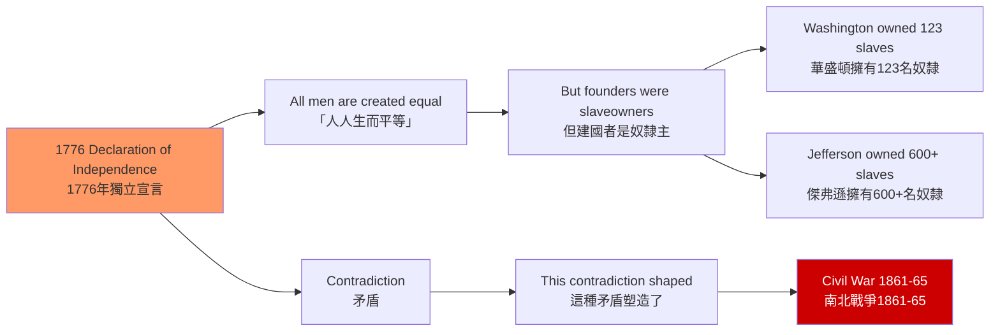
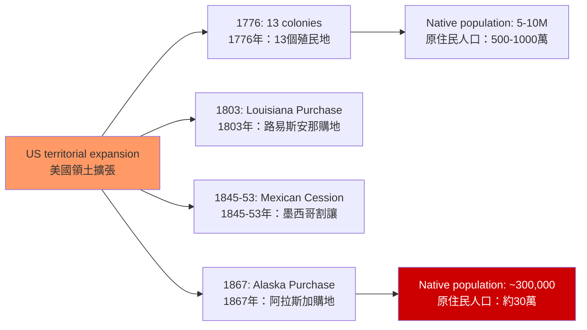
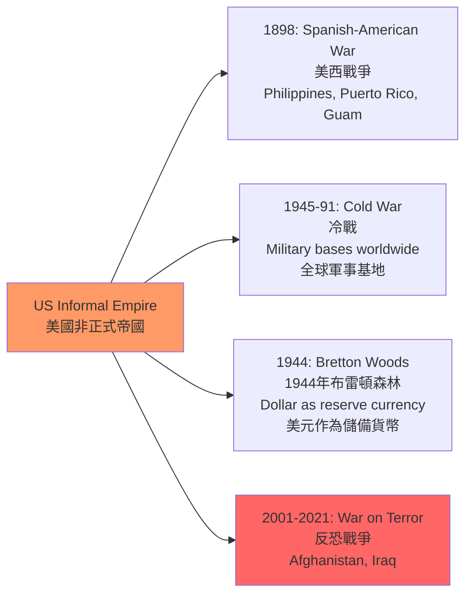
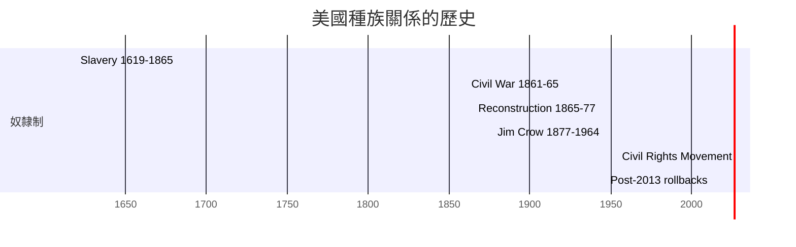
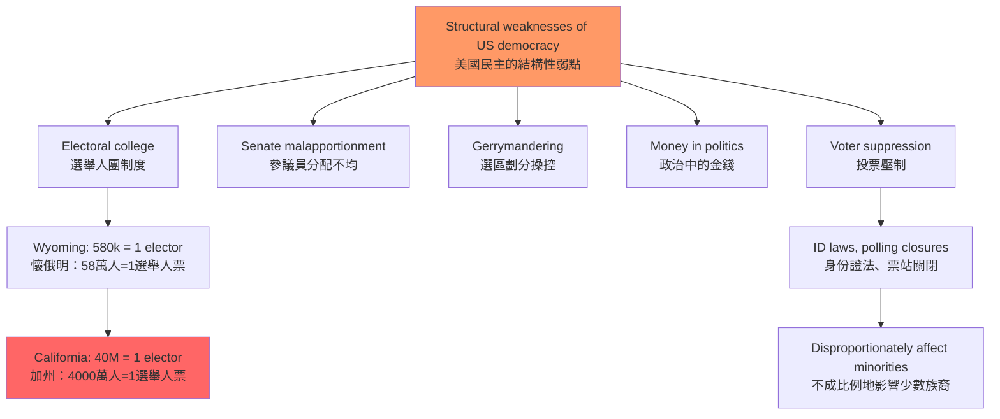

# HIST1025 美國史導論 / Introduction to the United States

**Instructor**: HKU History Staff
**Department**: History, HKU
**Official source**: [HKU History Course Description](https://history.hku.hk/ug_cd/)
**Style**: 袁騰飛式 — 犀利、聚焦美國作為一個持續建構的帝國——美國例外論的神話與現實

---

## 問題 1：5 個核心心智模型

### 1. 美國例外論（American Exceptionalism）
「美國例外論」主張美國在歷史、政治和文化上與歐洲不同——美國是自由的堡壘，是歷史的例外。學者 **Seymour Martin Lipset** 和 **Eric Foner** 對這種觀點進行了深入分析和批判。學者 **Sven Beckert** 在 *Empire of Cotton* (2014) 中揭示：美國的建國本身就與奴隸制和帝國主義密不可分。

### 2. 奴隸制與美國建國的矛盾
1776 年《獨立宣言》宣稱「人人生而自由」，但華盛頓、傑弗遜等開國元勳幾乎全是奴隸主。學者 **Edmund Morgan** 在 *American Slavery, American Freedom* (1975) 中揭示：這種矛盾是美國建國的核心張力。

### 3. 西進運動與美洲原住民
1803 年路易斯安那購地（15 萬美元買下整個中西部的法國領地）開啟了美國的大規模領土擴張。學者 **Patricia Limerick** 在 *The Legacy of Conquest* (1987) 中揭示：這種「昭昭天命」（Manifest Destiny）的擴張運動，是對美洲原住民的系統性種族滅絕。

### 4. 民權運動與美國民主的持續危機
1954-1968 年的民權運動是美國民主的最重要檢驗。學者 **Heather Cox Richardson** 和 **Carol Anderson** 研究：這種民主危機從未真正結束——2013 年最高法院廢除《投票權法案》關鍵條款後，黑人投票率差距重新擴大。

### 5. 美帝國主義與當代世界秩序
1898 年美西戰爭（美國戰勝西班牙，佔領菲律宾和波多黎各）標誌著美國成為帝國主義國家。學者 **Emily Rosenberg** 研究：美國在 20 世紀構建了一個以美元、美軍和美國文化為核心的「非正式帝國」。

---

## 問題 2：3 個根本分歧

### 分歧 1：美國例外論——事實 vs 意識形態話語？
### 分歧 2：奴隸制——建國的原罪 vs 歷史的偶然？
### 分歧 3：美帝國主義——自由的堡壘 vs 帝國的延續？

---

## 問題 3：10 個深度問題

1. **美國建國與奴隸制的矛盾**：1776 年的奴隸主革命者如何能夠宣稱「人人生而自由」？這種矛盾是美國建國話語的致命弱點嗎？
2. **南北戰爭（1861-1865）的真正原因**：這場戰爭是「關於奴隸制」還是「關於州權利」？林肯的《解放奴隸宣言》（1863）是在軍事上必要的措施，還是道德上的根本轉向？
3. **重建時期（1865-1877）的失敗**：為什麼重建時期的南方黑人權利保護最終失敗了？這種失敗如何為 1890-1960 年間的吉姆·克羅（Jim Crow）種族隔離制度掃清了道路？
4. **美國帝國主義的起源**：1898 年美西戰爭中，美國擊敗西班牙後佔領菲律宾——這場戰爭中，美國士兵屠杀了約 20 萬菲律宾平民（估計）。這種暴力如何與美國的「自由」話語相矛盾？
5. **1929 年大蕭條**：胡佛總統的蕭條應對失敗（自由放任主義）與羅斯福新政（政府干預）——這兩種應對模式的經濟學和意識形態差異是什麼？
6. **麥卡錫主義（1950-1954）**：冷戰初期的政治迫害如何暴露了美國民主制度的脆弱性？這種「紅色恐慌」與當代中美關係中的「中國威脅論」有什麼結構性相似？
7. **民權運動的成就與局限**：1964 年《民權法案》和 1965 年《投票權法案》如何在法律上廢除了種族隔離和投票歧視？但為什麼 2013 年最高法院仍然能够廢除《投票權法案》的關鍵條款？
8. **越南戰爭（1964-1975）的歷史教訓**：美國在越南的失敗如何暴露了超級大國軍事干預的局限性？這次失敗對美國軍事干預主義的未來有什麼長期影響？
9. **2008 年金融危機**：為什麼華爾街的貪婪和金融監管的缺失最終導致了全球金融危機？這次危機如何暴露了新自由主義意識形態（deregulation）的系統性風險？
10. **當代美國民主的危機**：2021 年 1 月 6 日國會山叛亂如何暴露了美國民主制度的脆弱性？這種脆弱性與美國建國時的奴隸制矛盾有什麼歷史聯繫？

---

# 核心心智模型深化（中英對照）

## 1. 美國建國的矛盾

### 1.1 圖解：奴隸制與自由的矛盾

---

## 2. 西進運動與原住民種族滅絕

### 2.1 圖解：領土擴張與原住民

---

## 3. 美帝國主義

### 3.1 圖解：美國非正式帝國

---

## 4. 民權運動

### 4.1 圖解：重建到民權運動的時間線

---

## 5. 美國民主的危機

### 5.1 圖解：美國民主的結構性弱點

---

# 總結

1. **美國例外論是神話**：美國的建國從一開始就與奴隸制和帝國主義緊密交織——1776年的「自由」只適用於有產白人男性。

2. **奴隸制是美國建國的原罪**：這種矛盾不是歷史的偶然，而是美國建國話語的核心張力——它解釋了為什麼美國的「自由」敘事總是充滿了制度性的虚伪。

3. **西進運動是原住民的種族滅絕**：這種滅絕不是歷史的偶然，而是「昭昭天命」意識形態和聯邦政府政策的系統性結果。

4. **美國民主的危機是結構性的**：選舉人團、參議員分配不均、金錢政治和投票壓制——這些制度性弱點不是外生的「干擾」，而是美國建國時奴隸制與民主矛盾的根本延續。

5. **美國帝國主義與美國例外論是同一硬幣的兩面**：當美國宣稱自己是「自由的堡壘」時，它同時在海外維持著一個全球軍事帝國——這種雙重標準，是理解美國歷史的關鍵。

**自學建議**: 配合 Eric Foner 的 *The Story of American Freedom* + Sven Beckert 的 *Empire of Cotton* + Carol Anderson 的 *The Second*, 輸出讀書筆記到 `06_Reading_Notes/`。
