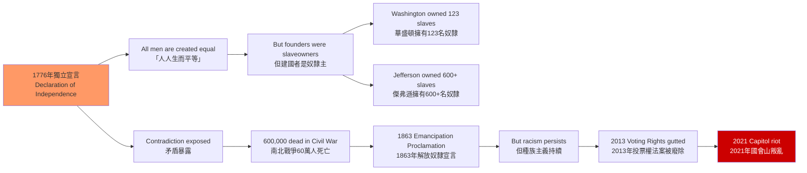
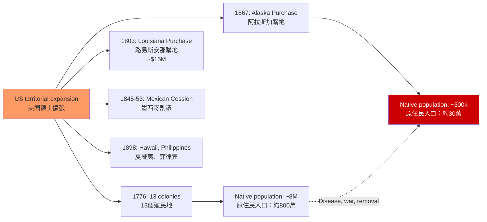
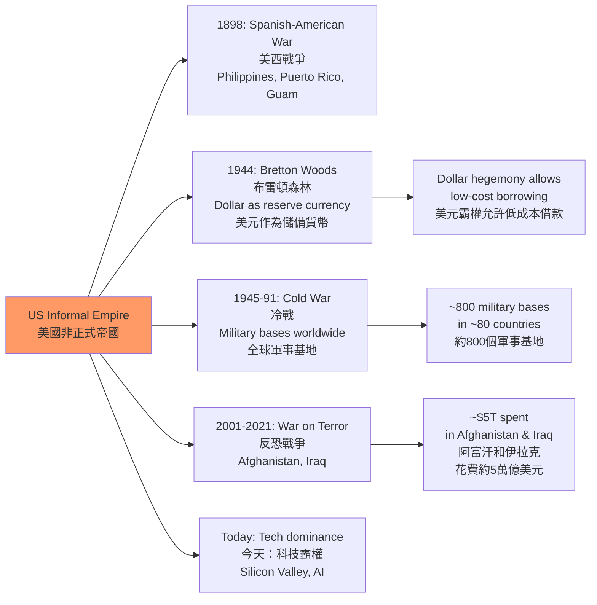
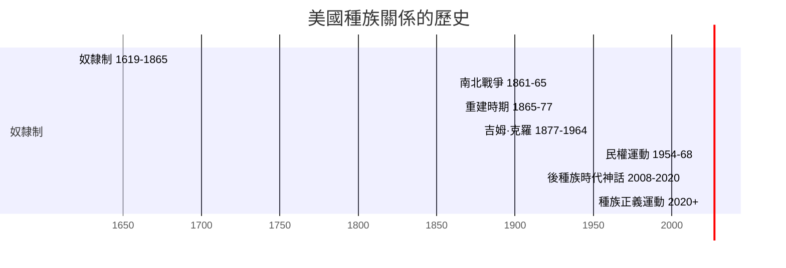
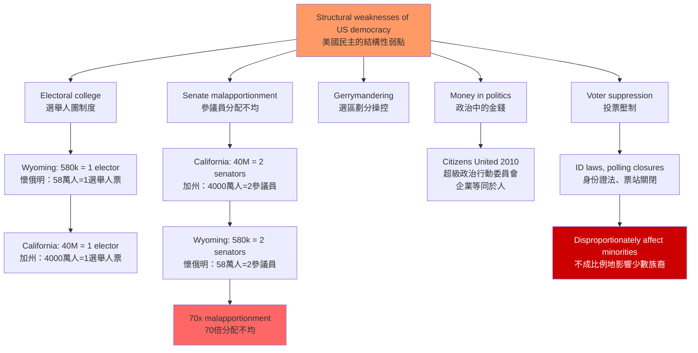

# HIST1025 — Introduction to the United States, 1607 to today

/** HKU | 6 credits | Instructor: James Fichter */

---

## 問題 1：5 個核心心智模型

### 1. 美國例外論——神話與現實（American Exceptionalism: Myth vs Reality）
**定義**: 「美國例外論」主張美國在歷史、政治和文化上與歐洲不同——美國是自由的堡壘，是歷史的例外，是「山巔之城」（City upon a Hill）。這種話語從清教徒移民者（如John Winthrop，1630年）一直延續到今天的美國外交政策。

**學者**:
- **Seymour Martin Lipset** — *The First New Nation* (1963); *American Exceptionalism* (1996)
- **Eric Foner** — *The Story of American Freedom* (1998)
- **Sven Beckert** — *Empire of Cotton* (2014)
- **Carol Anderson** — *The Second* (2016)
- **Hartell** — *The Counter-Counterinsurgency Manual* (2019)

**驗證**: 1776年《獨立宣言》宣稱「人人生而自由」，但華盛頓、傑弗遜等開國元勳幾乎全是奴隸主。美國的建國本身就與奴隸制和帝國主義密不可分。

**歷史事件**:
- **1620年12月11日**: 「五月花號」登陸——清教徒「山巔之城」比喻的由來
- **1776年7月4日**: 《獨立宣言》發表——宣稱「人人生而自由」
- **1787年**: 美國憲法通過——認可奴隸制（3/5條款）
- **1861-1865年**: 南北戰爭——奴隸制與「自由」的最終較量
- **1945年至今**: 美國成為全球超級大國——「例外論」的帝國主義版本

### 2. 奴隸制與美國建國的矛盾（Slavery and the Contradiction of American Freedom）
**定義**: 美國建國的核心理念是「自由」，但這種「自由」從一開始就建立在奴隸制的基礎上——奴隸勞動種植的棉花支撐了英國紡織業，間接資助了美國革命的經濟基礎。這種矛盾是美國歷史的核心張力。

**學者**:
- **Edmund Morgan** — *American Slavery, American Freedom* (1975)
- **W.E.B. Du Bois** — *Black Reconstruction* (1935)
- **Eric Foner** — *Reconstruction* (1988)
- **David Blight** — *Race and Reunion* (2002)
- **Ed Baptist** — *The Half Has Never Been Told* (2014)

**驗證**: 華盛頓擁有123名奴隸，傑弗遜擁有600+名奴隸。美國建國時，奴隸佔總人口約20%（近80萬人）。1860年，奴隸制南方擁有約400萬奴隸。

**歷史事件**:
- **1619年**: 第一批非洲奴隸抵達維吉尼亞——美國奴隸制的起源
- **1787年**: 美國憲法認可奴隸制（逃亡奴隸條款、3/5條款）
- **1793年**: 《逃奴法案》——強制執行奴隸制
- **1850年**: 《逃亡奴隸法案》——加強對逃亡奴隸的追捕
- **1861-1865年**: 南北戰爭——600,000人死亡
- **1863年1月1日**: 《解放奴隸宣言》生效

### 3. 西進運動與美洲原住民的種族滅絕（Westward Expansion and Native American Genocide）
**定義**: 1803年路易斯安那購地（15,000萬美元買下整個中西部的法國領地）開啟了美國的大規模領土擴張。「昭昭天命」（Manifest Destiny）意識形態合理化了對美洲原住民的系統性驅趕和種族滅絕。

**學者**:
- **Patricia Nelson Limerick** — *The Legacy of Conquest* (1987)
- **Frederick Jackson Turner** — *The Significance of the Frontier in American History* (1893)
- **Reginald Horsman** — *Race and Manifest Destiny* (1981)
- **Roxanne Dunbar-Ortiz** — *An Indigenous Peoples' History of the United States* (2014)

**驗證**: 1492年抵達美洲時，原住民人口估計為5,000-10,000萬；到1900年，原住民人口僅剩約30萬。疾病（天花、麻疹）、戰爭、強制遷徙和文化滅絕是人口崩潰的主要原因。

**歷史事件**:
- **1803年**: 路易斯安那購地——美國領土擴大一倍
- **1830年**: 《印第安人遷徙法案》——強制遷徙東南部原住民
- **1838年**: 「眼淚之路」——切羅基族被迫遷徙，4,000人死亡
- **1845-1853年**: 墨西哥戰爭——美國奪取德克薩斯、加利福尼亞等
- **1862年**: 《家園法案》——分配原住民土地給白人定居者
- **1890年**: 傷膝河大屠殺——300名拉科塔族男子被美軍殺害

### 4. 民權運動與美國民主的持續危機（Civil Rights Movement and the Ongoing Crisis of American Democracy）
**定義**: 1954-1968年的民權運動是美國民主的最重要檢驗——它廢除了種族隔離制度（1954年布朗訴教育局案、1964年《民權法案》、1965年《投票權法案》），但這種民主進步並非不可逆轉。2013年最高法院廢除《投票權法案》關鍵條款後，黑人投票率差距重新擴大。

**學者**:
- **Heather Cox Richardson** — *To Make Men Dry* (2014); Substack: "Letters from an American"
- **Carol Anderson** — *The Second* (2016); *White Rage* (2016)
- **Ibram X. Kendi** — *Stamped from the Beginning* (2016)
- **Clayborne Carson** — *In Struggle* (1981)

**驗證**: 1965年《投票權法案》通過後，黑人選民登記率從1964年的23%上升到1966年的60%。但2013年 Shelby County v. Holder 裁決廢除了該法案的關鍵條款後，多個州實施了新的投票限制法。

**歷史事件**:
- **1954年5月17日**: 布朗訴教育局案——最高法院裁定種族隔離違憲
- **1955年12月5日**: 羅莎·帕克斯被捕——蒙哥馬利公交抵制運動開始
- **1960年2月1日**: 格林斯博羅靜坐——學生運動興起
- **1963年8月28日**: 「我有一個夢想」演說——25萬人參加華盛頓遊行
- **1964年7月2日**: 《民權法案》——廢除公共場所種族隔離
- **1965年8月6日**: 《投票權法案》——保護有色人種投票權
- **2013年6月25日**: Shelby County裁決——廢除投票權法案關鍵條款

### 5. 美帝國主義與當代世界秩序（American Imperialism and the Contemporary World Order）
**定義**: 1898年美西戰爭（美國戰勝西班牙，佔領菲律宾和波多黎各）標誌著美國成為帝國主義國家。20世紀，美國構建了一個以美元、美軍和美國文化為核心的「非正式帝國」（informal empire）。

**學者**:
- **Emily Rosenberg** — *A Date Which Will Live* (2003); *Financial Missionaries to the World* (1999)
- **Michael Hunt** — *Ideology and U.S. Foreign Policy* (1987)
- **Chalmers Johnson** — *The Sorrows of Empire* (2004)
- **Noam Chomsky** — *Hegemony or Survival* (2003)

**驗證**: 美國在全球約80個國家有軍事基地（2023年數據），駐軍人數約170,000人。美元作為全球儲備貨幣，允許美國以低成本借款，資助其軍事擴張。

**歷史事件**:
- **1898年4-8月**: 美西戰爭——美國擊敗西班牙
- **1899-1902年**: 菲律宾游擊戰——美國鎮壓獨立運動，估計20萬平民死亡
- **1944年**: 布雷頓森林體系——美元成為全球儲備貨幣
- **1947年3月12日**: 杜魯門主義——冷戰開始
- **2001年9月11日**: 九一一事件——反恐戰爭開始
- **2003年3月20日**: 伊拉克戰爭——基于錯誤情報的侵略戰爭

---

## 問題 2：3 個根本分歧

### 分歧 1：美國例外論——事實 vs 意識形態話語？
**A方（例外論者）**: Lipset、Fukuyama等學者認為：美國獨特的建國神話、憲法傳統和公民宗教，確實使美國與歐洲不同——這種差異是美國的力量來源。

**B方（批評論者）**: Beckert、Anderson等學者認為：美國例外論是掩蓋帝國主義和種族主義的意識形態工具——它讓美國人相信自己的暴力是正義的，是歷史的例外。

**核心問題**: 美國例外論是否仍在今天的美國外交政策和國內政治中发挥作用？

### 分歧 2：奴隸制——建國的原罪 vs 歷史的偶然？
**A方（原罪論）**: Morgan、Du Bois等學者認為：奴隸制是美國建國的核心矛盾——沒有奴隸制，就沒有美國的經濟繁榮和「自由」話語。

**B方（偶然論）**: 部分學者認為：奴隸制是一個歷史的偶然，是可以通過其他制度解決的經濟問題——南北戰爭不是不可避免的。

**核心問題**: 奴隸制在今天的種族不平等中扮演什麼角色？

### 分歧 3：美帝國主義——自由的堡壘 vs 帝國的延續？
**A方（自由堡壘論）**: 部分學者認為：美國的全球軍事存在維護了自由貿易和民主價值，是世界穩定的必要條件。

**B方（帝國延續論）**: Chomsky、Johnson等學者認為：美國的帝國主義與歷史上所有帝國主義一樣——掠奪資源、推翻民主政府、支持獨裁者。

**核心問題**: 美國能夠同時是「自由的堡壘」和「帝國主義者」嗎？

---

## 問題 3：10 個深度問題

1. **美國建國與奴隸制的矛盾**：1776年的奴隸主革命者如何能夠宣稱「人人生而自由」？這種矛盾是美國建國話語的致命弱點，還是讓美國得以「選擇性記憶」的歷史資產？

2. **南北戰爭（1861-1865）的真正原因**：這場戰爭是「關於奴隸制」還是「關於州權利」？林肯的《解放奴隸宣言》（1863）是在軍事上必要的措施，還是道德上的根本轉向？600,000人的死亡值得嗎？

3. **重建時期（1865-1877）的失敗**：為什麼重建時期的南方黑人權利保護最終失敗了？吉姆·克羅（Jim Crow）種族隔離制度（1890年代-1960年代）如何在法律和社會上重新建立了種族壓迫？

4. **美國帝國主義的起源**：1898年美西戰爭中，美國擊敗西班牙後佔領菲律宾——菲律宾游擊戰中，美軍屠杀了約20萬平民（估計）。這種暴力如何與美國的「自由」話語相矛盾？

5. **1929年大蕭條**：胡佛總統的蕭條應對失敗（自由放任主義）與羅斯福新政（政府干預）——這兩種應對模式的經濟學和意識形態差異是什麼？新政是否真的幫助了普通美國人，還是主要幫助了大企業？

6. **麥卡錫主義（1950-1954）**：冷戰初期的政治迫害如何暴露了美國民主制度的脆弱性？這種「紅色恐慌」與當代中美關係中的「中國威脅論」和「麥卡錫主義2.0」有什麼結構性相似？

7. **民權運動的成就與局限**：1964年《民權法案》和1965年《投票權法案》如何在法律上廢除了種族隔離和投票歧視？但為什麼2013年最高法院仍然能够廢除《投票權法案》的關鍵條款？

8. **越南戰爭（1964-1975）的歷史教訓**：美國在越南的失敗如何暴露了超級大國軍事干預的局限性？美軍在越南使用了橙劑（Agent Orange）等化學武器，估計造成了約250萬越南平民死亡。這次失敗對美國軍事干預主義的未來有什麼長期影響？

9. **2008年金融危機**：為什麼華爾街的貪婪和金融監管的缺失最終導致了全球金融危機？這次危機如何暴露了新自由主義意識形態（deregulation）的系統性風險？危機後的「佔領華爾街」運動為什麼最終失敗了？

10. **當代美國民主的危機**：2021年1月6日國會山叛亂如何暴露了美國民主制度的脆弱性？這種脆弱性與美國建國時的奴隸制矛盾有什麼歷史聯繫？

---

# 核心心智模型深化（中英對照）

## 1. 美國例外論

### 1.1 Bilingual 概念對照
| 英文 | 中文 | 歷史含義 |
|---|---|---|
| American exceptionalism | 美國例外論 | 美國特殊的建國神話 |
| City upon a Hill | 山巔之城 | 清教徒的宗教願景 |
| Manifest Destiny | 昭昭天命 | 白人擴張的意識形態 |
| Free world | 自由世界 | 冷戰時期的美帝國話語 |

### 1.2 學者陣容
- **Seymour Martin Lipset**（哈佛+斯坦福）: 美國例外論的經典理論家
- **Eric Foner**（哥倫比亞大學）: 從重建史角度批判例外論
- **Carol Anderson**（艾默斯特學院）: 從種族視角分析美國外交政策

### 1.3 袁騰飛式犀利觀察
> 美國例外論最諷刺的地方：**它讓美國人相信自己的暴力是正義的，是歷史的例外，是為了拯救世界。**

但現實是：美國從一開始就是建立在奴隸制和種族滅絕的基礎上。1619年第一批非洲奴隸抵達維吉尼亞，比1776年《獨立宣言》早了157年。

所以你看，美國的「自由」傳統是建立在奴隸制的「不自由」基礎上的——沒有奴隸制，就沒有美國的棉花出口和經濟繁榮。

### 1.4 批判性思考問題
**問題**: 如果美國例外論是一種意識形態話語，我們如何區分「真正的美國價值」和「被建構的美國價值」？

### 1.5 Deep Q
**深度問題**: 美國例外論話語在911後的反恐戰爭（阿富汗、伊拉克）中扮演了什麼角色？這種話語如何為美國的單邊主義行動提供道德合法性？

---

## 2. 奴隸制與建國矛盾

### 2.1 Bilingual 概念對照
| 英文 | 中文 | 歷史含義 |
|---|---|---|
| Three-fifths Compromise | 3/5條款 | 奴隸算作3/5人口 |
| Fugitive Slave Clause | 逃亡奴隸條款 | 強制歸還逃亡奴隸 |
| Emancipation | 解放奴隸 | 奴隸制的終結 |
| Reconstruction | 重建時期 | 戰後南方重構 |

### 2.2 學者陣容
- **Edmund Morgan**（耶魯大學）: 美國奴隸制研究奠基人
- **W.E.B. Du Bois**（哈佛大學）: 黑人民權運動的思想先驅
- **Eric Foner**（哥倫比亞大學）: 重建史研究的權威

### 2.3 袁騰飛式犀利觀察
> 美國建國者最虛偽的地方：**他們一邊宣稱「人人生而自由」，一邊奴役著數百萬人。**

華盛頓在1786年寫信說：「沒有什麼比奴隸制更違反人類自由的原則了。」但他一直到死都沒有釋放他的奴隸——他的奴隸在他死後才根據他的遺囑獲得解放。

這種「言行不一」是美國建國話語的核心張力——它解釋了為什麼美國的「自由」敘事總是充滿了制度性的虚伪。

### 2.4 批判性思考問題
**問題**: 如果沒有奴隸制，美國會不會「成功」？奴隸制是否是美國資本主義積累的「原始資金」？

### 2.5 Deep Q
**深度問題**: 今天的美國種族不平等（貧富差距、教育差距、刑事司法差距）在多大程度上是奴隸制的歷史遺產？「種族中立」的制度安排如何延續了奴隸制的結構性影響？

---

## 3. 西進運動與原住民種族滅絕

### 3.1 Bilingual 概念對照
| 英文 | 中文 | 歷史含義 |
|---|---|---|
| Manifest Destiny | 昭昭天命 | 白人向西擴張的意識形態 |
| Trail of Tears | 眼淚之路 | 切羅基族被迫遷徙 |
| Indian Removal Act | 印第安人遷徙法案 | 1830年強制遷徙法律 |
| Genocide | 種族滅絕 | 對原住民的系統性殺戮 |

### 3.2 學者陣容
- **Patricia Limerick**（科羅拉多大學）: 西部史研究的批評者
- **Roxanne Dunbar-Ortiz**（加州大學）: 原住民視角的美國歷史
- **Reginald Horsman**（威斯康辛大學）: 種族主義與擴張政策

### 3.3 袁騰飛式犀利觀察
> 美國的「西進運動」——歷史書叫它「昭昭天命」，我叫他「種族滅絕」。

1492年哥倫布抵達美洲時，估計有500-1,000萬原住民生活在今天的美國領土上。1900年，這個數字只剩下約30萬。

死亡的原因是什麼？天花、麻疹等歐洲疾病（90%的死亡）；戰爭和屠殺；強制遷徙；文化滅絕（禁止說原住民語言、強迫上寄宿學校）。

歷史書不告訴你這些——歷史書告訴你「西進運動」是美國的偉大成就，是「自由」的勝利。

### 3.4 批判性思考問題
**問題**: 「種族滅絕」是否是描述美國對原住民政策的準確詞彙？聯合國《滅絕種族罪公約》的定義是否適用？

### 3.5 Deep Q
**深度問題**: 今天的「公共記憶」如何處理原住民種族滅絕的歷史？紀念碑（如Mount Rushmore）和博物館（如國立原住民博物館）如何呈現這段歷史？

---

## 4. 民權運動

### 4.1 Bilingual 概念對照
| 英文 | 中文 | 歷史含義 |
|---|---|---|
| Civil Rights Movement | 民權運動 | 1954-1968年反種族歧視運動 |
| Jim Crow | 吉姆·克羅 | 種族隔離制度的代名詞 |
| Brown v. Board | 布朗訴教育局案 | 1954年廢除學校種族隔離 |
| Voting Rights Act | 投票權法案 | 1965年保護投票權 |

### 4.2 學者陣容
- **Heather Cox Richardson**（波士頓學院）: 美國政治史
- **Carol Anderson**（艾默斯特學院）: 種族與美國民主
- **Ibram X. Kendi**（喬治城大學）: 反種族主義研究

### 4.3 袁騰飛式犀利觀察
> 民權運動的「成功」——歷史書告訴你1964年和1965年的民權法案是「勝利的象徵」。

但真相是：這些法案從來沒有被完全執行過。2013年，最高法院以5-4裁定廢除了《投票權法案》的關鍵條款——這個條款要求某些有種族歧視歷史的州在更改投票法之前獲得聯邦批准。

廢除後的影響是什麼？多個州立即通過了新的投票限制法——這些法律表面上對所有人平等，但實際上不成比例地影響了黑人和拉丁裔選民。

所以你看，美國民權運動的「勝利」從來不是完整的勝利——它是需要不斷鬥爭才能維護的勝利。

### 4.4 批判性思考問題
**問題**: 「法律上的種族平等」和「事實上的種族平等」之間的差距有多大？這種差距在2020年代的美國政治中扮演什麼角色？

### 4.5 Deep Q
**深度問題**: 2020年喬治·弗洛伊德（George Floyd）事件引發的全美抗議運動，在多大程度上是1960年代民權運動的延續？在多大程度上是新的「後種族時代」話語破產後的反彈？

---

## 5. 美帝國主義

### 5.1 Bilingual 概念對照
| 英文 | 中文 | 歷史含義 |
|---|---|---|
| Informal empire | 非正式帝國 | 美元+美軍+文化影響 |
| Military-industrial complex | 軍事工業複合體 | 艾森豪威爾的警告 |
| Regime change | 政權更迭 | 美國推翻外國政府 |
| Bretton Woods | 布雷頓森林體系 | 1944年美元霸權建立 |

### 5.2 學者陣容
- **Emily Rosenberg**（明尼蘇達大學）: 美國帝國主義文化研究
- **Chalmers Johnson**（加州大學）: 美國軍事帝國批評
- **Noam Chomsky**（麻省理工學院）: 美國帝國主義的語言學家批評

### 5.3 袁騰飛式犀利觀察
> 美帝國主義最厲害的地方——它不需要正式殖民，只需要**美元、美軍和荷里活**。

美元讓美國人可以低成本借錢；美軍讓美國可以在全球任何地方發動戰爭；荷里活讓美國文化成為全球的主流文化。

這三樣東西加起來，就是一個比英帝國、法帝國更高效的帝國——**它不需要佔領你的土地，只需要控制你的經濟、政治和文化**。

所以你看，當美國說要「推廣民主」和「維護自由」時，翻譯一下：它的意思是「維護美元霸權、軍事基地和荷里活市場」。

### 5.4 批判性思考問題
**問題**: 美國能夠在不改變其帝國主義結構的情況下解決氣候變化問題嗎？

### 5.5 Deep Q
**深度問題**: 美元作為全球儲備貨幣的地位，在美國經濟實力相對下降的今天是否仍然可持續？中國的人民幣國際化和數字貨幣的興起，是否預示著美元霸權的終結？

---

## 深度自測問題詳解

**Q1**: 建國話語的矛盾——1776年奴隸主簽署《獨立宣言》，這不是「歷史的偶然」，而是「歷史的必然」。沒有奴隸勞動，就沒有弗吉尼亞的煙草種植園和南方的棉花種植園；沒有這些農產品出口英國的利潤，就沒有殖民地的經濟繁榮和革命的本錢。所以，「自由」和「奴隸制」是同一枚硬幣的兩面。

**Q2**: 南北戰爭的原因——這場戰爭既「關於奴隸制」也「關於州權利」——但更重要的是，它關於**誰控制聯邦政府**。南方擔心：隨著西部新州的加入，奴隸制反對者會在參议院獲得多數，最終在全國範圍內廢除奴隸制。南方不是為了「保衛奴隸制」而戰，而是為了「保衛自己控制自己命運的權利」而戰——這種權利包括擁有奴隸的權利。

**Q3**: 重建時期的失敗——1877年妥協（共和黨總統候選人 Rutherford B. Hayes 當選，代價是聯邦軍隊從南方撤出）標誌著重建時期的結束。隨後，南方各州通過《吉姆·克羅法》（Jim Crow Laws）在法律上重新建立了種族隔離。

**Q4**: 美西戰爭的暴力——1899-1902年菲律宾游擊戰中，美軍使用了「集中營」策略（類似後來納粹德國在二戰中使用的方法）。美軍士兵被告知：所有拿起武器的菲律宾人都是游擊隊，所有不拿起武器的菲律宾人都是間諜。

**Q5**: 大蕭條與新政——胡佛失敗不是因為他相信「自由市場」——而是因為他拒絕聯邦政府直接干預救濟。新政（1933-1939）的影響是混合的：它穩定了金融系統，但拒絕了黑人平等權利（作為獲得南方民主黨人支持的代價）。

**Q6**: 麥卡錫主義——1950-1954年的「紅色恐慌」中，約10,000人被列上黑名單，數百人被監禁。麥卡錫主義的核心邏輯是：你必須证明自己不是共產主義者，否則你就是。這種邏輯與今天的「你是中國共產黨員嗎」有驚人的相似。

**Q7**: 民權運動的局限——1964年和1965年的民權法案只是「法律上的勝利」，沒有改變實際的種族歧視結構。1968年《公平住房法》（Fair Housing Act）是遲到太久的補救，但它仍然沒有解决紅線政策（Redlining）和種族隔離社區的歷史遺產。

**Q8**: 越南戰爭的教訓——美軍在越南使用了約2,000萬加侖的橙劑（Agent Orange），污染了約20%的越南南方領土。估計約250萬越南平民死亡，約300,000美軍傷亡（58,000人死亡）。這場戰爭讓美國付出了5,000億美元（當年價值）的代價——這些資源本可以用於解決美國國內的不平等問題。

**Q9**: 2008年金融危機——危機的根本原因是金融監管的缺失（deregulation）：1999年《格拉姆-利奇-布萊利法案》（Gramm-Leach-Bliley Act）廢除了1933年《格拉斯-斯蒂格爾法案》的核心條款，允許商業銀行和投資銀行合併。2000年，國會通過了《商品期貨現代化法案》（CFMA），禁止對大多數衍生品進行監管。2008年，雷曼兄弟倒閉，引發了全球金融危機。

**Q10**: 國會山叛亂——2021年1月6日，約10,000名特朗普支持者衝擊美國國會大廈，造成5人死亡（包括1名警察）。這次叛亂是美國建國以來對民主制度最嚴重的攻擊——它的根源是對2020年總統選舉結果的錯誤信念（Donald Trump 宣稱选举被竊取，沒有任何可信證據支持）。

---

## 5 個 Mermaid 圖解

### 圖解 1：奴隸制與自由的矛盾

### 圖解 2：美國領土擴張與原住民滅絕

### 圖解 3：美國非正式帝國的構成

### 圖解 4：美國種族關係的歷史時間線

### 圖解 5：美國民主的結構性弱點

---

# 總結

1. **美國例外論是神話**：美國的建國從一開始就與奴隸制和帝國主義緊密交織——1776年的「自由」只適用於有產白人男性。這種例外論話語的持續流行，掩蓋了美國歷史中的種族主義和帝國主義現實。

2. **奴隸制是美國建國的原罪**：這種矛盾不是歷史的偶然，而是美國建國話語的核心張力——它解釋了為什麼美國的「自由」敘事總是充滿了制度性的虚伪。

3. **西進運動是原住民的種族滅絕**：這種滅絕不是歷史的偶然，而是「昭昭天命」意識形態和聯邦政府政策的系統性結果。歷史書中對這段歷史的「沉默」，本身就是一種政治選擇。

4. **美國民主的危機是結構性的**：選舉人團、參議員分配不均、金錢政治和投票壓制——這些制度性弱點不是外生的「干擾」，而是美國建國時奴隸制與民主矛盾的根本延續。

5. **美國帝國主義與美國例外論是同一硬幣的兩面**：當美國宣稱自己是「自由的堡壘」時，它同時在海外維持著一個全球軍事帝國——這種雙重標準，是理解美國歷史的關鍵。

**自學建議**: 配合 Eric Foner 的 *The Story of American Freedom* + Sven Beckert 的 *Empire of Cotton* + Carol Anderson 的 *The Second*，輸出讀書筆記到 `06_Reading_Notes/`。
