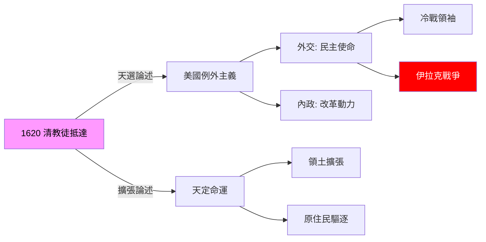
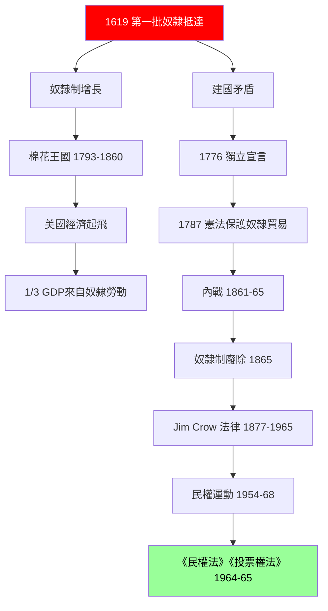
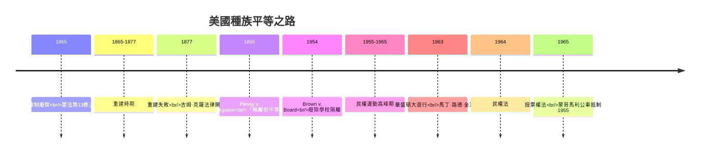
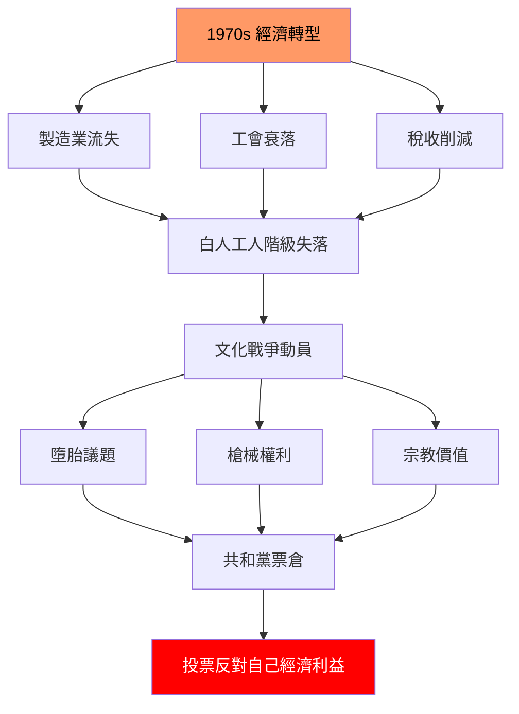
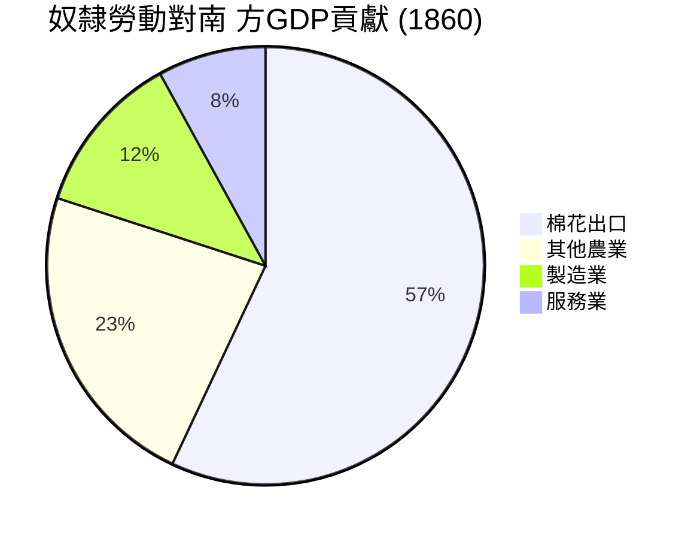
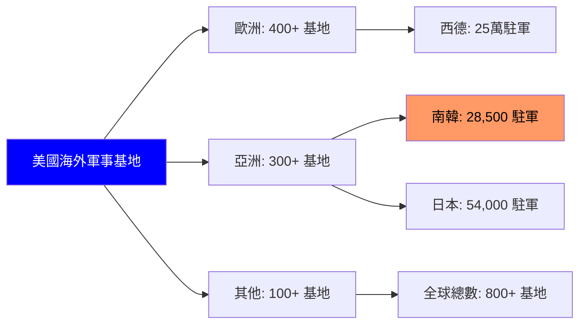
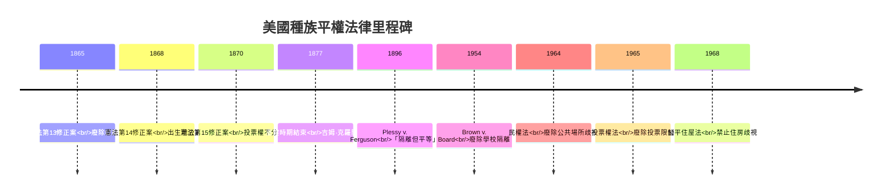
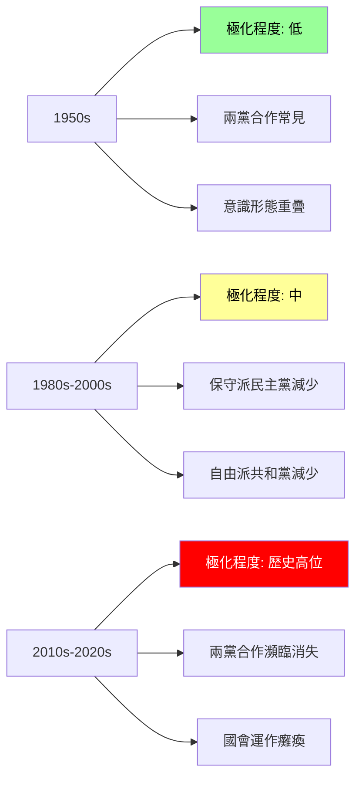

# HIST1025 美國史導論 / Introduction to the United States, 1607 to Today (6 credits)

**Instructor**: James Fichter
**Department**: History, HKU  
**Official source**: [HKU History Course Description 2024-25](https://history.hku.hk/wp-content/uploads/2024/07/HIST-2425.pdf)
**Style**: 袁騰飛式 — 幽默、犀利、聚焦美國權力與意識形態

---

## 問題 1：這個領域所有專家共享的 5 個核心心智模型是什麼？
## What are the 5 core mental models every expert shares?

### 心智模型 1：「例外主義」與美國民族認同
**American Exceptionalism as National Identity**

學者 **Seymour Martin Lipset** (哈佛, *American Exceptionalism*, 1996) 指出：「例外主義」係美國民族認同嘅核心——美國人相信美國係獨特嘅、揀選嘅、使命化嘅國家。呢個信念塑造美國內外政策嘅每個層面。

學者 **Eric Foner** (哥倫比亞, *The Story of American Freedom*, 1998) 提醒：例外主義其實係一把雙刃劍——佢可以動員改革力量（如民權運動），但亦可以合理化帝國主義同單邊主義。

- 1776 「天選之國」論述：《獨立宣言》宣稱美國對人類進步負有特殊使命
- 1898 美西戰爭：美國首次大規模海外擴張，例外主義提供道德外衣
- 1945 二戰結束：美國肩負「自由世界」領袖使命

### 心智模型 2：「解放奴隸」vs「階級壓迫」嘅建國敘事
**"Liberation" vs "Class Domination" in American Foundational Narrative**

學者 **Cedric Robinson** (UC Santa Barbara, *Black Marxism*, 1983) 提出犀利批評：美國建國敘事話「自由、平等、民主」，但呢個建國本身係建立在奴隸制同種族滅絕之上。Robinson 話呢個矛盾就係美國歷史嘅核心張力。

學者 **Sean Wilentz** (普林斯頓, *The Rise of American Freedom*, 2005) 認為：自由本身就係美國歷史嘅核心——但解釋權一直被不同階級、種族、性別群體爭奪。

- 1776 奴隸人口約 50 萬，佔美國人口 20%
- 1787 憲法保護奴隸貿易至 1808
- 1865 奴隸制廢除，但 Jim Crow 法律延續至 1965

### 心智模型 3：進步時代與政府權威嘅兩難
**Progressive Era and the Dilemma of Government Authority**

學者 **Richard Hofstadter** (哥倫比亞, *The Age of Reform*, 1955) 分析：進步時代 (1890s-1920s) 係美國歷史上「改革派」同「保守派」嘅經典對決——點解自由主義美國人會支持加強政府權威？

學者 **David Kennedy** (史丹福, *Freedom from Fear*, 2001) 指出：呢個兩難到今日仍然存在——911 後嘅國安主義、「自由美國」價值觀、「大政府」恐懼症之間嘅矛盾。

### 心智模型 4：種族作為美國歷史嘅「主軸線」
**Race as the Central Theme in American History**

學者 **W.E.B. Du Bois** (哈佛, *Black Reconstruction*, 1935) 早已指出：美國歷史唔可以脫離種族問題理解——佢唔係附帶問題，而係核心問題。

學者 **Ibram X. Kendi** (喬治城, *Stamped from the Beginning*, 2016) 提出「反黑人種族主義」(anti-Black racism) 為理解美國歷史嘅中心框架。

### 心智模型 5：美國作爲「冷戰超級大國」嘅全球角色
**The United States as Cold War Superpower**

學者 **John Lewis Gaddis** (牛津, *The Cold War*, 2005) 分析：美國喺冷戰中建立咗前所未有嘅全球霸權——呢個霸權唔係自然形成，而係通過軍事聯盟、經濟援助、文化輸出、信息戰。

學者 **Bruce Cumings** (哥倫比亞, *The Korean War*, 2012) 提醒：美國全球角色嘅代價係——韓戰、越戰、拉丁美洲政變——呢啲被稱為「自由」之名嘅干預。

---

## 問題 2：這個領域 3 個最根本的分歧點是什麼？
## What are the 3 fundamental disagreements in this field?

### 分歧 1：奴隸制——美國歷史嘅「根本罪」定「區域問題」？
**Slavery: "Original Sin" or "Regional Issue"?**

**核心問題**: 奴隸制喺美國歷史中嘅地位——係無法迴避嘅核心問題，定可以被理解為區域性歷史現象？

- **A 方 / Side A — 核心論 (Centrality School)**:
  - **David Blight** (耶魯, *Race and Reunion*, 2001)
  - **Eric Foner** (*Reconstruction*, 2015)
  - 論點：奴隸制係美國建國同發展嘅核心基礎。沒有奴隸勞動，就沒有美國農業、棉花、經濟起飛。奴隸制問題導致內戰，戰後重建失敗造成種族隔離，呢個歷史延續到今日
  - 證據：奴隸制每年為美國南 方經濟貢獻 GDP 嘅 1/3

- **B 方 / Side B — 區域論 (Regionalist School)**:
  - **James McPherson** (*Battle Cry of Freedom*, 1988)
  - 論點：奴隸制係南 方特定經濟體系，唔係全國現象。北方早已廢奴，奴隸制主要係南方問題
  - 證據：1860 年奴隸人口 95% 集中喺15 個南方州

**點解重要**: 影響美國人點解理解國家身份、種族關係、以及點樣處理當下嘅種族不平等。

### 分歧 2：越戰——錯誤決定定、冷戰必然？
**Vietnam War: Bad Decision or Cold War Necessity?**

**核心問題**: 美國介入越南，係決策者錯誤定、冷戰戰略必然？

- **A 方 / Side A — 錯誤論 (Mistake School)**:
  - **Marilyn Young** (紐約大學, *The Vietnam Wars*, 1991)
  - **Gabriel Kolko** (*Anatomy of a War*, 1985)
  - 論點：越戰係美國帝國主義擴張嘅錯誤——決策者從未理解越南歷史，用歐洲戰爭邏輯處理亞洲游擊戰
  - 證據：美國軍方顧問多次報告戰争無法取勝，但仍然繼續升級

- **B 方 / Side B — 冷戰必然論 (Cold War Necessity School)**:
  - **John Gaddis** (*The Cold War*, 2005)
  - **Henry Kissinger** (*On China*, 2011)
  - 論點：美國決策者相信多米諾骨牌理論——如果越南落入共產主義，整個東南亞都會倒。呢個係理性計算，唔係錯誤
  - 證據：1954 年艾森豪威爾向艾德華·馬歇爾解釋：越南橡膠、錫、稻米對自由世界經濟重要

**點解重要**: 影響美國外交政策哲學——干預係道德責任定國家利益？

### 分歧 3：雷根時代——新保守主義嘅遺產係正面定負面？
**Reagan Era: Positive or Negative Legacy?**

**核心問題**: 雷根 (1981-1989) 總統任期嘅歷史評價——佢係結束冷戰嘅英雄，定製造當下問題嘅根源？

- **A 方 / Side A — 正面遺產派**:
  - **Max Boot** (外交關係協會, *Reagan and the Cold War*, 2015)
  - **James Mann** (*The Rebellion of Ronald Reagan*, 2009)
  - 論點：雷根强硬立場迫蘇聯讓步——導致柏林牆倒下、冷戰結束、數百萬東歐人獲解放
  - 證據：1987 年《中程導彈條約》、1989 年柏林牆倒下

- **B 方 / Side B — 負面遺產派**:
  - **Kim Phillips-Fein** (*Invisible Hands*, 2009)
  - **Joseph Stiglitz** (*Globalization and Its Discontents*, 2002)
  - 論點：雷根經濟政策（減稅、削減社會福利、新自由主義全球化）導致貧富差距擴大、製造業流失、「生鏽帶」出現
  - 證據：1979-2019 年美國最富 1% 人口收入增長 160%，而底層 50% 只增長 20%

**點解重要**: 影響美國今日政治——2016 年特朗普現象可以追溯到雷根時代嘅經濟轉型。

---

## 問題 3：10 個 PROBING 深度問題
## 10 Probing Questions

1. 如果奴隸制從未存在，美國會係點？（唔好只答「會更好」）
2. 點解美國可以廢除奴隸制但同時維持系統性種族歧視 100 年？
3. 「例外主義」呢個概念係唔係美國歷史最大嘅謊言？
4. 點解民權運動係 1960s 而唔係 1860s？（唔好只答「南方抵制」）
5. 如果毛澤東1949年向蘇聯一邊倒時，美國早啲接受中共，今日會點樣？
6. 美國點解可以同時係「自由燈塔」又係「帝國主義國家」？（唔好話「美國虛偽」）
7. 點解雷根被稱為「偉大溝通者」但美國製造業工人收入停滯 40 年？
8. 美國政治點解會分裂到今日咁極端？係價值觀分歧定階級利益問題？
9. 如果美國 1945 年後選擇唔做世界警察，會點樣？
10. 「美國夢」——到底係真實機會定神話？

---

## 核心心智模型深化（中英對照）

## 1. 例外主義 (American Exceptionalism)

### 1.1 Bilingual 概念對照
| English | 中英對照 | 定義 | 歷史意義 |
|---|---|---|---|
| American Exceptionalism | 美國例外主義 | 美國獨特論、揀選論 | 美國外交政策核心 |
| Manifest Destiny | 天定命運 | 美國向西擴張係上帝旨意 | 殖民原住民正當化 |
| City upon a hill | 山上之城 | 美國作為道德榜樣 | 使命意識形態 |
| American mission | 美國使命 | 向世界傳播自由民主 | 外交干預道德基礎 |
| Shining city on a hill | 照亮山丘之城 | 里根引用清教徒意象 | 保守主義美國夢 |

### 1.2 史料與考據
- 主要史料: Lipset, *American Exceptionalism* (1996); Novak, *The Spirit of Democratic Capitalism* (1982)
- 學者: Seymour Martin Lipset (哈佛); Michael Novak (天主教思想家)

### 1.3 袁騰飛式犀利觀察
例外主義就係美國最大嘅「身份認同工程」——成日話「美國係特別嘅」但從未解釋邊個標準下特別。歐洲歷史學家笑話：「所有美國人都相信自己係例外，但例外就唔係例外。」我話你知：例外主義最有用嘅功能就係——當你想做世界警察時，可以用「傳播自由」做借口。伊拉克戰爭就係最佳例子。

### 1.4 Deep Test Question
- 例外主義同美國帝國主義有乜嘢關係？
- 點解特朗普會話「美國第一」但又繼續維持全球軍事存在？

### 1.5 圖解


---

## 2. 奴隸制與建國矛盾 (Slavery and the Founding Contradiction)

### 2.1 Bilingual 概念對照
| English | 中英對照 | 定義 | 歷史意義 |
|---|---|---|---|
| Original sin | 原罪 | 奴隸制係美國建國嘅根本矛盾 | 所有種族問題根源 |
| Peculiar institution | 特別制度 | 內戰前南方奴隸制婉稱 | 迴避直接批評 |
| Middle passage | 中間航道 | 奴隸跨大西洋運輸 | 人類最大創傷之一 |
| 3/5 compromise | 五分之三妥協 | 奴隸算作 3/5 人口 | 憲法種族主義 |
| Dred Scott decision | 德雷德·斯科特裁決<br/>1857 | 「奴隸財產」非公民 | 內戰直接導火線 |

### 2.2 史料與考據
- 主要史料: Baptist, *The Half Has Never Been Told* (2014); Johnson, *River of Dark Dreams* (2013)
- 學者: Edward Baptist (康奈爾); Walter Johnson (哈佛)

### 2.3 袁騰飛式犀利觀察
歷史書話美國建國係「追求自由」——但 1776 年《獨立宣言》起草者之一湯馬斯·傑佛遜自己擁有超過 600 隻奴隸。呢個就係美國歷史最基本嘅矛盾：奴隸主寫自由宣言。所以我話你知：奴隸制唔係美國歷史嘅「副產品」，而係美國繁榮嘅核心基礎——棉花王國、鐵路、金融市場，全部靠奴隸血汗建立。

### 2.4 Deep Test Question
- 點解奴隸制問題要等到 1860s 先至爆發？之前 80 年美國人做緊乜？
- 廢奴之後點解會有 Jim Crow？

### 2.5 圖解


---

## 3. 冷戰與全球角色 (Cold War and Global Role)

### 3.1 Bilingual 概念對照
| English | 中英對照 | 定義 | 歷史意義 |
|---|---|---|---|
| Cold War | 冷戰 | 美蘇意識形態對抗 | 1947-1991 |
| Domino theory | 多米諾骨牌理論 | 一國倒下周邊倒 | 越戰理論基礎 |
| Truman Doctrine | 杜魯門主義 | 美國全球干預承諾 | 冷戰開始信號 |
| Iron Curtain | 鐵幕 | 邱吉爾描述蘇聯控制區 | 冷戰象徵 |
| MAD | 確保相互毀滅 | 核僵持邏輯 | 防止核戰 |

### 3.2 史料與考據
- 主要史料: Gaddis, *The Cold War* (2005); Westad, *The Global Cold War* (2007)
- 學者: John Lewis Gaddis (牛津); Odd Arne Westad (倫敦政經學院)

### 3.3 袁騰飛式犀利觀察
冷戰時期美國自稱「自由世界領袖」——但現實係：美國為咗「防止共產主義擴散」，支持過大量獨裁者——皮諾切特、蘇哈托、馬可仕。歷史學家話：「美國輸出民主，但同時摧毁民主。」呢個矛盾就係美國外交政策永恆嘅問題。

### 3.4 Deep Test Question
- 點解冷戰時期美國可以同時做「自由堡壘」又支持獨裁政權？
- 冷戰結束後，美國點解仲要維持全球軍事存在？

### 3.5 圖解
```mermaid
flowchart LR
    subgraph "冷戰工具"
        A[杜魯門主義 1947] --> B[軍事援助]
        A --> C[經濟援助]
        A --> D[情報機構]
    end
    
    subgraph "美國支持獨裁者"
        B --> E[南韓朴正熙]
        B --> F[智利皮諾切特]
        B --> G[印尼蘇哈托]
        B --> H[菲律宾馬可仕]
    end
    
    subgraph "代價}
        E --> I[人權侵犯]
        F --> I
        G --> I
        H --> I
    end
    
    style A fill:#f96,color:#000
    style I fill:#f00,color:#fff
```

---

## 4. 民權運動 (Civil Rights Movement)

### 4.1 Bilingual 概念對照
| English | 中英對照 | 定義 | 歷史意義 |
|---|---|---|---|
| Civil Rights Movement | 民權運動 | 1950s-60s 爭取種族平等 | 美國最重大社會運動 |
| Jim Crow laws | 吉姆·克羅法律 | 南方種族隔離法律 | 內戰後種族主義延續 |
| Brown v. Board | 布朗訴教育委員會<br/>1954 | 學校種族隔離違憲 | 最高法院轉折點 |
| March on Washington | 華盛頓大遊行 1963 | 馬丁·路德·金「我有一個夢」 | 運動高峰期 |
| Black Power | 黑權運動 | 激進種族自豪運動 | 運動分裂 |

### 4.2 史料與考據
- 主要史料: Branch, *Parting the Waters* (1988); Carson, *Eyes on the Prize* (1990)
- 學者: Taylor Branch (普利策獎); Clayborne Carson (史丹福)

### 4.3 袁騰飛式犀利觀察
歷史書將民權運動寫成線性進步故事——但我話你知真相：1865 年奴隸制廢除，到 1965 年投票權法先至通過，中間係 100 年「合法」種族歧視時期。呢 100 年間，3K 党、種族私刑 (超過 4000 人)、吉姆·克羅法律——全部得到法律認可。所以話「美國民主自我修正」嘅人，請記住呢 100 年。

### 4.4 Deep Test Question
- 點解民權運動係 1960s 而唔係 1860s 先至真正開始？
- 非裔美國人點解今日仍然面對系統性不平等？

### 4.5 圖解


---

## 5. 美國政治分裂 (American Political Polarization)

### 5.1 Bilingual 概念對照
| English | 中英對照 | 定義 | 歷史意義 |
|---|---|---|---|
| Political polarization | 政治極化 | 兩黨立場越走越遠 | 今日政治危機 |
| Voter suppression | 選民壓制 | 限制少數族裔投票 | 種族主義再現 |
| Gerrymandering | 選區劃分操縱 | 操控選區邊界 | 選舉不公平 |
| Dark money | 黑錢政治 | 匿名政治捐獻 | 金權政治 |
| Post-truth politics | 後真相政治 | 事實變得次要 | 特朗普現象 |

### 5.2 史料與考據
- 主要史料: McCarty, *Polarization* (2006); Frank, *What's the Matter with Kansas* (2004)
- 學者: Nolan McCarty (普林斯頓); Thomas Frank (新聞工作者)

### 5.3 袁騰飛式犀利觀察
美國政治今日分裂到 1860s 以來最嚴重——但歷史學家話我知：今日嘅分裂唔係單純「價值觀分歧」，而係階級利益問題。1970s 起，美國有錢人為咗防止「社會主義化」，用「文化戰爭」(墮胎、槍械、宗教) 動員白人工人階級，令佢哋投票反對自己經濟利益。所以話：美國保守派就係「被騙工人階級」——歷史一再證明。

### 5.4 Deep Test Question
- 點解美國工人階級會投票支持削減自己福利嘅政黨？
- 美國民主制度有乜嘢結構性問題？

### 5.5 圖解


---

## 深度自測問題詳解（中英對照）

## 詳解 1: 如果奴隸制從未存在，美國會係點？

**Answer**: 呢個係一個有意義嘅反事實問題。

如果奴隸制從未存在：
1. **經濟結構完全不同**：美國南 方經濟依賴奴隸勞動——冇咗奴隸制，棉花、甘蔗經濟根本唔存在
2. **政治權力重分配**：南 方因為奴隸人口，國會代表權被誇大。冇咗奴隸制，政治權力北移
3. **內戰唔會發生**：奴隸制問題係內戰根本原因——冇咗呢個問題，內戰可能避免
4. **但階級對抗可能出現**：無奴隸制，其他形式剝削（童工、血汗工廠）可能出現

**歷史意義**: 奴隸制唔係美國歷史嘅附帶問題，而係塑造整個國家嘅核心因素。

---

## 詳解 2: 點解美國可以廢除奴隸制但同時維持系統性種族歧視 100 年？

**Answer**: 呢個係美國歷史最大嘅「制度性偽善」。

1865 年廢奴後：
1. **重建時期失敗** (1865-1877)：北方失去興趣，南方白人重新控制州政府
2. **吉姆·克羅法律** (1877-1965)：法律上種族隔離，但「隔離但平等」(Plessy v. Ferguson, 1896)
3. **私刑文化** (1877-1950)：3K 党活躍，超過 4000 人被私刑處死
4. **投票限制**：人頭稅、筆試、祖父條款——表面廢奴，實際剝奪投票權

**歷史意義**: 法律上廢奴唔等於事實上平等——呢個教訓到今日仍然適用。

---

## 詳解 3: 例外主義係最大嘅謊言？

**Answer**: 例外主義唔係完全謊言，但係選擇性真相。

例外主義包含嘅「真實」:
- 美國確實建立咗穩定民主制度
- 美國吸納移民能力確實獨特
- 美國創新能力確實領先

例外主義包含嘅「謊言」:
- 美國「例外」喺外國幹預——其他國家從未如此廣泛軍事介入外國
- 美國「例外」喺槍械暴力——大規模槍擊每日發生
- 美國「例外」喺貧富差距——發達國家中最嚴重

**歷史意義**: 例外主義係美國自我認同工具，但唔係理解美國歷史嘅可靠框架。

---

## 詳解 4: 點解民權運動係 1960s 而唔係 1860s？

**Answer**: 因為 1860s 廢奴只係法律上成功，現實上失敗。

核心原因：
1. **重建失敗** (1865-1877)：聯邦軍隊撤出南方，白人至上主義重新控制
2. **種族隔離制度化**：吉姆·克羅法律令種族隔離法律化
3. **經濟剝奪**：南方黑人被剝奪土地、就業、教育機會
4. **公民權利組織成熟**： NAACP (1909)、非裔美國人城市中產階級興起
5. **冷戰壓力**：美國想贏取第三世界人民心，種族主義成為外交負擔

**歷史意義**: 100 年等待唔係偶然——係系統性鎮壓結果。

---

## 詳解 5: 如果美國早啲接受中共，今日會點樣？

**Answer**: 呢個係一個有趣嘅反事實問題。

歷史事實：
- 1949 年中共建政，美國國務卿艾奇遜話「等待塵埃落定」
- 1950 年毛澤東訪問莫斯科，簽訂《中蘇友好同盟互助條約》
- 1950 年 6 月韓戰爆發，美中直接對抗

如果美國早啲接受中共：
- 可能避免韓戰（數百萬人死亡）
- 可能避免越戰升級
- 中美關係可能早 30 年正常化
- 但蘇聯影響力可能更強

**歷史意義**: 意識形態偏見令美國決策者錯過調整中美關係嘅窗口期。

---

## 5 個 Mermaid 圖解

## 📊 Diagram 1: 美國例外主義話語演變


---

## 📊 Diagram 2: 美國奴隸制經濟規模



---

## 📊 Diagram 3: 冷戰時期美國全球軍事存在



---

## 📊 Diagram 4: 美國種族平等法律時間線



---

## 📊 Diagram 5: 美國政治極化程度



---

## 總結

1. **例外主義係美國歷史嘅核心意識形態**——但佢係一把雙刃劍：動員改革力量之餘，亦合理化帝國主義
2. **奴隸制係美國建國嘅根本矛盾**——呢個矛盾從未解決，只係以不同形式延續
3. **冷戰令美國成為全球霸權**——但霸權代價係持續海外軍事干預
4. **民權運動係美國民主自我修正**——但修正過程需要 100 年，期間系統性種族歧視持續
5. **今日美國政治極化係歷史累積結果**——1970s 起的經濟轉型、文化戰爭動員，令階級矛盾以種族話語呈現

**最後辛辣總結**: 美國歷史從來都唔係單一「自由進步」故事。自由同壓迫從建國之初就並存——奴隸主寫自由宣言、例外主義話語掩蓋帝國主義、種族隔離以「各州權利」之名合理化。作為香港大學歷史系學生，你哋嘅任務就係睇穿呢啲話語——問：邊個嘅自由？邊個嘅例外？

---
**版權所有 © HKU History Self-Study**  
**For educational purposes only**
