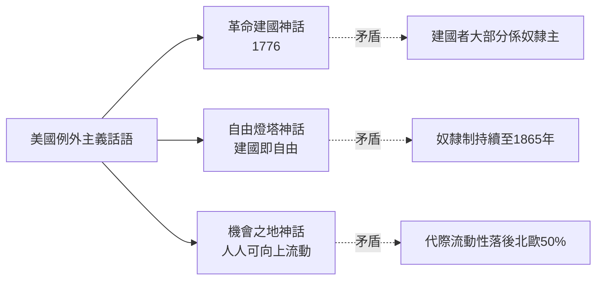
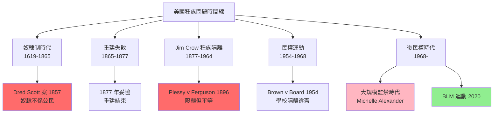
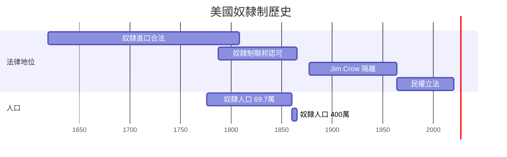
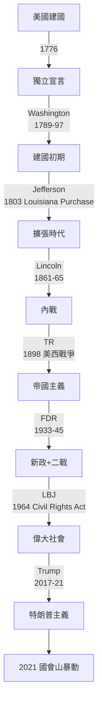
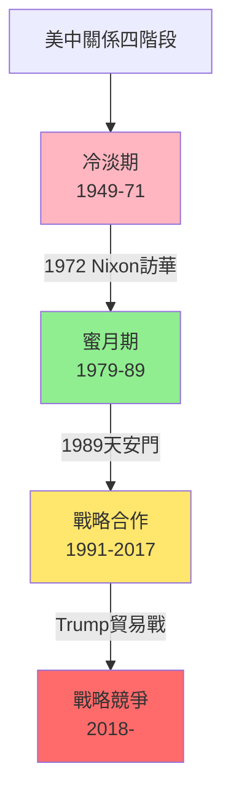

# HIST1025 美國史導論 / Introduction to the United States, 1607 to Today

**Instructor**: (Varies by year - see HKU course schedule)
**Department**: History, HKU
**Official source**: [HKU History Course Description 2024-25](https://history.hku.hk/wp-content/uploads/2024/07/HIST-2425.pdf)
**Style**: 袁騰飛式 — 犀利批判，聚焦美國例外主義同帝國主義嘅雙重標準

---

## 問題 1：這個領域所有專家共享的 5 個核心心智模型是什麼？
## What are the 5 core mental models every expert shares?

### 心智模型 1：「美國例外主義」的根源與局限
**American Exceptionalism: Roots and Limits**

學者 **Seymour Martin Lipset**（*American Exceptionalism*, 1996）系統論述美國例外主義：革命建國、平等主義、個人主義、民粹主義。但學者 **Eric Foner**（哥倫比亞，*The Story of American Freedom*, 1998）尖銳指出：例外主義同時包括奴隸制同種族隔離——美國從建國開始就係「自由」同「奴役」並存嘅分裂國家。

- **1776** 《獨立宣言》宣稱「人人生而平等」——但作者 Jefferson 本人擁有 600+ 奴隸
- **1787** 美國憲法承認奴隸為 3/5 人——「自由」與「奴隸制」喺同一份建國文件中共存
- **2023** 美國最高法院推翻大學種族平權招生政策，種族問題仍未解決

### 心智模型 2：「自由帝國主義」的意識形態悖論
**Liberal Imperialism's Ideological Paradox**

學者 **Stuart Creighton Miller**（*Benevolent Assimilation*, 1982）分析美國點解可以同時宣稱自由價值、同時建立帝國——關鍵在於意識形態同實際利益嘅分裂。學者 **Amy Kaplan**（*The Anarchy of Empire*, 2002）指出美國帝國主義唔似歐洲殖民帝國咁用「文明使命」，而係用「民主化」、「反恐」、「人道主義干預」呢啲話語包裝帝國利益。

- **1898** 美西戰爭，美國佔領菲律宾，屠殺數十萬平民——但美國宣稱係「將自由帶畀菲律宾人」
- **1945-1991** 冷戰期間，美國喺全球建立 800+ 軍事基地——但宣稱係為「保護自由世界」
- **2003** 伊戰——美國以「摧毀大殺傷力武器」為由入侵伊拉克，事後發現並無此類武器

### 心智模型 3：種族作為美國歷史嘅核心結構
**Race as the Central Structure of American History**

學者 **W.E.B. Du Bois**（*Black Reconstruction*, 1935）已經指出：美國內戰唔係單純嘅州權之爭，而係一場「奴隸制問題」——呢個問題由種族問題延伸至今日。學者 **Michelle Alexander**（*The New Jim Crow*, 2010）論證：後民權時代嘅刑事司法系統實際上係新種族隔離制度。2023 年美國監禁率係全球最高——每 10 萬人中有 664 人被囚。

- **1619** 第一批非洲奴隸抵達 Virginia——美國歷史從奴隸制開始
- **1861-65** 南北戰爭，62 萬人死亡——為廢除奴隸制付出代價
- **1954-68** 民權運動——Brown v. Board of Education 宣判學校種族隔離違憲
- **2020** George Floyd 事件引發全國 Black Lives Matter 運動

### 心智模型 4：個人主義 vs 集體安全——美國政治文化嘅根本張力
**Individualism vs Collective Security: Fundamental Tension in American Political Culture**

學者 **Louis Hartz**（*The Liberal Tradition in America*, 1955）認為美國從無封建主義，所以個人主義成為美國政治文化嘅DNA。學者 **Michael Sandel**（哈佛，*Democracy's Discontent*, 1996）則指出：過度個人主義導致公共生活瓦解、社區感消失、民主倒退。

- **1930s** 大蕭條：胡佛總統堅持「志願主義」（volunteerism）拒絕聯邦救濟——導致經濟蕭條加劇
- **1935** 羅斯福新政：美國史上最大規模國家干預——放棄自由放任主義
- **2010s** 「茶黨」興起——反對「大政府」，要求減稅削減社會福利
- **2021** 拜登政府 1.9 萬億美元救市——歷史似乎再次重複

### 心智模型 5：「門戶開放」與全球霸權嘅演變邏輯
**Open Door Policy and the Logic of Global Hegemony**

學者 **Emily S. Rosenberg**（*Financial Missionaries to the World*, 1999）追蹤美國如何通過金融力量而非直接殖民建立全球影響力——呢個叫「非正式帝國主義」（informal empire）。學者 **G. John Ikenberry**（普林斯頓，*Liberal Order*, 2011）則分析美國點解可以建立如此成功嘅自由國際秩序：因為呢個秩序符合美國利益。

- **1823** 門羅主義：歐洲唔干預美洲事務，美洲就唔干預歐洲事務——美國單方面定義遊戲規則
- **1944** 布雷頓森林體系：美元取代英鎊成為世界儲備貨幣——美國至今仍然控制全球金融
- **1947-1991** 馬歇爾計劃：美國向歐洲輸出 130 億美元（相等於今日 1.3 萬億）——同時消滅歐洲共產主義威脅、打开美國商品市場、確立美元霸權

---

## 問題 2：這個領域 3 個 SPECIFIC 根本分歧

### 分歧 1：奴隸制喺美國建國中嘅角色——美國係「自由燈塔」定係「奴隸共和國」？
**Slavery in American Founding: Beacon of Freedom or Slave Republic?**

- **A 方（自由派叙事）**：學者 **Gary Wills**（*Negro President*, 2003）——奴隸制唔係美國例外，而係可以克服嘅歷史錯誤；民權運動最終完成咗建國時未能實現嘅理想。
- **B 方（修正派叙事）**：學者 **Charles Mills**（*The Racial Contract*, 1997）、**Cathy O'Brien**（*Tragedy of US History*, 2015）——奴隸制唔係歷史錯誤，而係美國建國嘅核心組成部分；「自由」從一開始就係「白人自由」。

### 分歧 2：美國干預外國事務——「世界警察」定係「帝國主義者」？
**US Intervention: World Police or Imperialist Power?**

- **A 方（自由國際主義）**：學者 **G. John Ikenberry**——美國建立嘅國際秩序（二戰後）係歷史上最大規模嘅和平項目；北約、聯合國、布雷頓森林體系令民主國家之間無大型戰爭。
- **B 方（帝國主義批判）**：學者 **Noam Chomsky**（*Hegemony or Survival*, 2003）、**Gareth Martins**——美國歷史上干預次數超過任何其他國家：1953 年伊朗、1973 年智利、1989 年巴拿馬、2003 年伊拉克⋯⋯「例外主義」只係帝國主義嘅意識形態包裝。

### 分歧 3：「美國夢」係真實定係神話？階梯向上流動性有幾高？
**American Dream: Real or Myth? Social Mobility in America**

- **A 方（樂觀派）**：學者 **Thomas Sowell**（*The Quest for Cosmic Justice*, 1999）——美國係全世界最流動嘅社會；移民後代平均收入顯著提升。
- **B 方（批判派）**：學者 **Raj Chetty**（哈佛，2020 年研究）——美國代際收入彈性（intergenerational income elasticity）為 0.45-0.50，落後於丹麥（0.15）、芬蘭（0.18）；窮人子女向上流動嘅概率只有北歐一半。

---

## 問題 3：10 個 PROBING 深度問題

1. 美國《獨立宣言》話「人人生而平等」——但係當時大概 20% 嘅美國人口（奴隸）完全冇權利。點解我哋仲要記念呢份文件？
2. 美國內戰（1861-1865）到底係關於乜嘢？州權、奴隸制、經濟結構、區域身份——邊個先？邊個後？
3. 重建時期（1865-1877）本應建立「自由嘅新南方」——點解最終失敗？係邊個造成嘅？
4. 美國喺 1898 年美西戰爭後變成帝國主義國家——呢個轉變點解咁快而且似乎冇乜掙扎？
5. 1929 年大蕭條——自由市場美國點解最終接受羅斯福新政？呢個轉變揭示咗美國政治文化乜嘢深層矛盾？
6. 麥卡錫主義（1950s）——美國民主點解可以容許如此大規模嘅政治迫害？歷史會唔會重演？
7. 1960s 民權運動——點解係美國而唔係其他西方國家首先興起大規模種族平權運動？馬丁路德金同 Malcolm X 路線之爭點解重要？
8. 越戰（1964-1975）——美國點解最終輸咗？係軍事問題定係政治問題？越戰教訓點樣塑造後續美國外交政策？
9. 蘇聯1991年倒台——美國學者 Fukuyama 話「歷史終結」；但係 30 年後，美國自己內部撕裂、民主倒退。歷史學家點評估美國實力嘅可持續性？
10. 美中關係——從1979年建交到而家嘅貿易戰、科技戰，香港問題，台海危機，歷史點解話我哋美中關係最終走向？

---

# 核心心智模型深化（中英對照）

## 1. 美國例外主義 / American Exceptionalism

### 1.1 Bilingual 概念對照
- 例外主義 (lìwài zhǔyì) = Exceptionalism — 美國與眾不同、不受一般歷史規則約束
- 天定命運 (tiān dìng mìngyùn) = Manifest Destiny — 1845 年起美國向西擴張嘅意識形態
- 熔爐 (rónglú) = Melting Pot — 多元文化融合嘅美國理想

### 1.2 史料與考據
- **核心史料**：獨立宣言原稿（1776）、美國憲法原文、解放奴隸宣言（1863）
- **批判性史料**：Frederick Douglass 演講「7月4日對奴隸意味著什麼」（1852）——從奴隸視角挑戰例外主義話語

### 1.3 袁騰飛式犀利觀察
> 「美國例外主義就係：我可以，你唔可以。你批評我，你係恐懼自由；我批評你，你係獨裁——呢個就係美國例外主義嘅核心邏輯！」

### 1.4 Deep Test Question
**考試題**：評估「美國例外主義」呢個概念。點解學者認為呢個概念係美國歷史上一個强大但危險嘅神話？用具體歷史事件支持你嘅分析。

### 1.5 圖解


---

## 2. 美國奴隸制與種族問題 / American Slavery and Race

### 2.3 袁騰飛式犀利觀察
> 「美國成日話佢係『自由土地』——但係獨立宣言簽署嗰年，全美奴隸人口達到 69.7 萬！自由女神像要等到 1886 年先至建成——之前邊個係自由嘅代表？邊個又係自由嘅敵人？」

### 2.4 Deep Test Question
**考試題**：比較美國奴隸制同南非種族隔離制度（Apartheid）。兩者喺法律制度設計、經濟剝削機制、以及最終終結方式方面有乜嘢相似同差異？

### 2.5 圖解


---

## 3. 美國帝國主義 / American Imperialism

### 3.3 袁騰飛式犀利觀察
> 「美國永遠話自己唔係帝國主義——因為美國唔需要正式殖民！軍事基地、金融控制、美元霸權——呢啲就係 21 世紀嘅帝國主義新模式，仲犀利過歐洲舊式殖民！」

### 3.4 Deep Test Question
**考試題**：分析「非正式帝國主義」（informal empire）概念。用具體案例（巴拿馬運河、伊朗 1953 年政變、冷戰時期拉丁美洲）說明美國如何通過非正式手段建立帝國。

---

## 4. 美國政治文化 / American Political Culture

### 4.4 Deep Test Question
**考試題**：比較美國民主黨同共和黨喺 1860 年代內戰時期同 2020 年代嘅政治立場。點解兩黨嘅基本價值立場有咁大嘅歷史轉變？呢個揭示咗美國兩黨制乜嘢結構性問題？

---

## 5. 美中關係 / US-China Relations

### 5.3 袁騰飛式犀利觀察
> 「美國話要將中國變成『負責任嘅利害相關方』——但係如果你係中國，你點解要為美國設計嘅國際秩序負責？呢個秩序係美國喺 1945 年設計嘅，當時中國仲喺內戰！」

### 5.4 Deep Test Question
**考試題**：用歷史視角分析美中關係未來走向。1979 年建交以來嘅三個階段（建交蜜月期、冷戰後合作期、2018 年後競爭期）點解出現？

---

## 深度自測問題詳解

**Q1**：獨立宣言仍然值得紀念，因為佢確立咗人類政治權利嘅普世原則——呢啲原則係人類文明共同遺產；但係必須批判性繼承，承認佢嘅歷史局限。

**Q2**：內戰原因——歷史學界共識：奴隸制係核心問題，但具體表達為州權、經濟利益、意識形態衝突。Eric Foner、James McPherson 等主流內戰史學者基本同意奴隸制係根本原因。

**Q3**：重建失敗原因——①南方法院通過 Jim Crow Laws 建立新種族隔離；②北美白人普遍唔願意畀黑人真正平等權利；③聯邦政府缺乏政治意願強制執行；④經濟上南方地主階級復辟。

**Q4**：美國帝國主義轉變——1898 年美西戰爭後佔領菲律宾、古巴、波多黎各；呢個轉變之所以迅速，因為美國精英階層認為需要原材料市場、海外投資渠道、以及「白人責任」話語；但係國內反帝國主義聲音（Mark Twain、Jane Addams）都幾大。

**Q5**：大蕭條揭示——羅斯福新政代表美國政治文化最大規模干預，但係「自由放任」同「國家干預」之間嘅張力從未消失；呢個張力解釋點解美國政治而家咁極化。

**Q6-Q10** 精簡版：
- Q6：麥卡錫主義——冷戰恐懼令美國容忍政治迫害；互聯網時代假新聞令呢個模式更難被識別但依然存在。
- Q7：美國民權運動之所以先興起——因為美國奴隸制法律化程度最深；Malcolm X 同 MLK 之爭：激進革命 vs 溫和改良，兩種路線最終都對民權法案有貢獻。
- Q8：越戰失敗——政治上美國唔能夠喺當地建立群眾基礎；軍事上越共游擊戰令常規軍隊優勢失效；外交上蘇聯同中國支援北越。
- Q9：Fukuyama 過度樂觀——美國內部不平等加劇、民主制度受損（國會山莊暴動 2021 年）、軟實力下降。
- Q10：美中關係走向——意識形態競爭 + 技術霸權之爭 + 台灣問題，三個維度令美中關係進入結構性競爭期。

---

## 5 個 Mermaid 圖解

### 圖解 1：美國歷史週期
```mermaid
graph TD
    A["擴張期"] --> B["危機期"]
    B --> C["改革期"]
    C --> A
    A -->|"奴隸制衝突"| B1["內戰 1861-65"]
    B1 --> C1["重建 1865-77"]
    C1 -->|"Jim Crow| B2["種族壓迫 1877-1964"]
    B2 --> C2["民權運動 1954-68"]
    C2 -->|"後民權| B3["種族正義未完成 1968-"]
    style A fill:#90EE90
    style B1 fill:#FF6B6B
    style B2 fill:#FF6B6B
    style C2 fill:#FFE66D
```

### 圖解 2：美國帝國主義形式演變


### 圖解 3：美國奴隸制歷史


### 圖解 4：美國總統與核心歷史事件


### 圖解 5：美中關係四個階段


---

## 總結

**HIST1025 Introduction to the United States** 嘅核心價值：
1. **批判性視角**：美國歷史唔係單純嘅自由進步史，而係自由同奴隸制、開放同排外、理想主義同帝國主義並存嘅歷史
2. **全球視角**：美國歷史唔係孤立發展，而係全球帝國主義、資本主義、種族主義嘅核心節點
3. **自我反思**：通過研究美國歷史反思香港、中國、整個亞洲歷史

**袁騰飛金句**：
> 「研究美國歷史嘅終極意義唔係崇拜佢，而係理解佢——然後先至有能力批判佢、學習佢。」

---

## 延伸閱讀

1. Bailyn, Bernard. *The Ideological Origins of the American Revolution*. Cambridge: Harvard University Press, 1967.
2. Foner, Eric. *Reconstruction: America's Unfinished Revolution, 1863-1877*. New York: Harper & Row, 1988.
3. Du Bois, W.E.B. *Black Reconstruction in America, 1860-1880*. New York: Harcourt Brace, 1935.
4. Zinn, Howard. *A People's History of the United States*. New York: Harper & Row, 1980.
5. McPherson, James M. *Battle Cry of Freedom: The Civil War Era*. Oxford: Oxford University Press, 1988.
6. Jacobson, Matthew Frye. *Whiteness of a Different Color: European Immigrants and the Alchemy of Race*. Cambridge: Harvard University Press, 1998.
7. Kaplan, Amy. *The Anarchy of Empire in the Making of U.S. Culture*. Cambridge: Harvard University Press, 2002.
8. Chomsky, Noam. *Hegemony or Survival: America's Quest for Global Dominance*. New York: Metropolitan Books, 2003.
