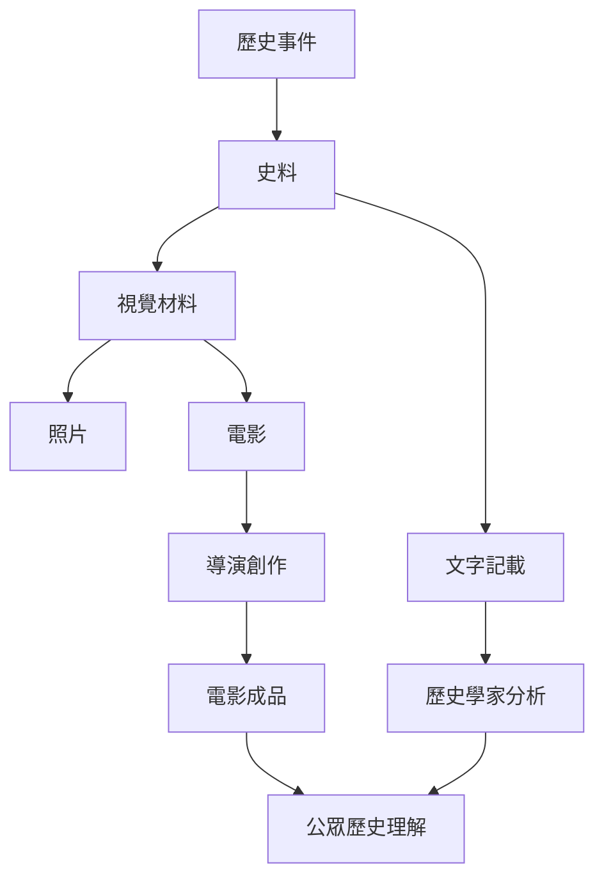
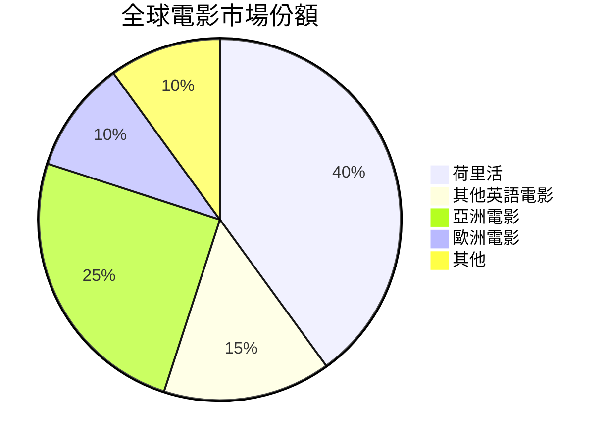
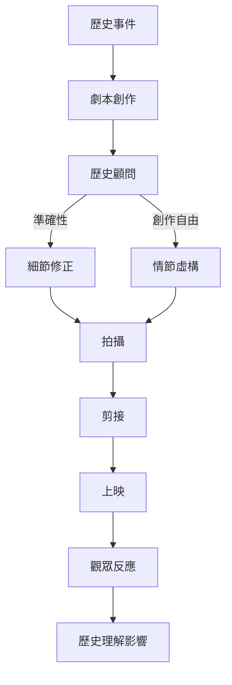
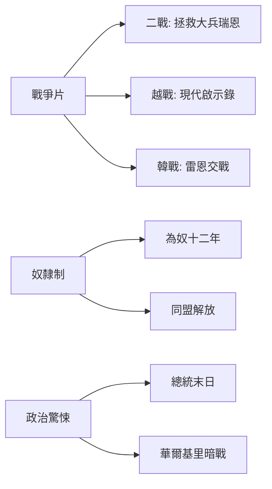
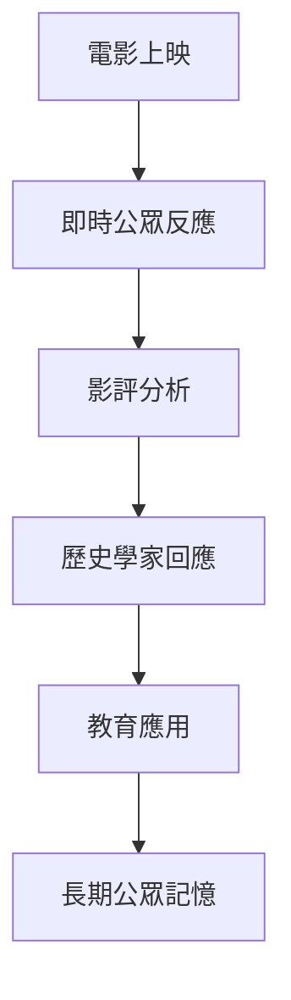
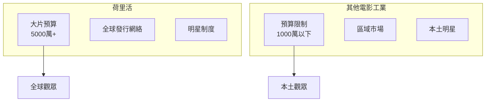

# HIST2031 電影與歷史 / History through Film (6 credits)

**Instructor**: Crystal Kwok
**Department**: History, HKU  
**Official source**: [HKU History Course Description 2024-25](https://history.hku.hk/wp-content/uploads/2024/07/HIST-2425.pdf)
**Style**: 袁騰飛式 — 幽默、犀利、聚焦電影點解塑造集體記憶

---

## 問題 1：這個領域所有專家共享的 5 個核心心智模型是什麼？

### 心智模型 1：電影作為「史料」——視覺證據嘅局限與力量
**Film as "Source": Limits and Powers of Visual Evidence**

學者 **Robert Rosenstone** (加州理工, *Revisioning History*, 1995) 指出：電影唔係歷史嘅「插圖」，而係一種獨特嘅歷史論述形式。導演通過演員、場面調度、剪接表達佢對歷史事件嘅詮釋。

學者 **Hayden White** (UC Santa Cruz) 提醒：所有歷史叙事都係建構——電影只係更加明顯。

- 好萊塢歷史片：《光榮之日谷底》(Gettysburg) 1993，動用 5000 臨時演員、重建歷史場面
- 史詩失真：《亂世佳人》(Gone with the Wind) 1939，用浪漫化視角描繪奴隸制
- 亞洲視角：《重慶森林》1994，1997 前香港集體焦慮

### 心智模型 2：「歷史記憶」vs「歷史事實」
**Collective Memory vs Historical Fact**

學者 **Pierre Nora** (法國, *Realms of Memory*, 1989) 提出「記憶場所」(lieux de mémoire) 概念：記憶唔係歷史，而係被不斷重新建構。電影就係最重要嘅記憶塑造工具之一。

學者 **Mona Baker** 研究顯示：公眾對歷史嘅理解，往往嚟自電影多過歷史書。

### 心智模型 3：荷里活霸權與歷史話語權
**Hollywood Hegemony and Historical Discourse Power**

學者 **Robert Sklar** (紐約大學, *Movie-Made America*, 1994) 分析：荷里活唔單止係電影工業，而係美國文化霸權嘅核心工具。荷里活塑造全球觀眾對美國歷史、世界歷史嘅理解。

學者 **David Bordwell** (威斯康辛) 指出：荷里活敘事模式（綫性叙事、英雄之旅）影響全球電影製作。

### 心智模型 4：電影作為「時代精神」嘅產物
**Film as Product of "Zeitgeist"**

學者 **Siegfried Kracauer** (德國, *From Caligari to Hitler*, 1947) 經典研究：魏瑪德國電影反映戰後德國集體心理——焦慮、絕望、渴望强人。電影唔係獨立存在，而係時代精神 (Zeitgeist) 嘅產物。

學者 **Janet Staiger** (德州奧斯汀) 提醒：電影亦可以塑造時代精神——兩者係互動關係。

### 心智模型 5：「歷史準確性」vs「敘事力量」嘅張力
**"Historical Accuracy" vs "Narrative Power" Tension**

學者 **Mark Carnes** (哥倫比亞) 研究顯示：歷史系學生睇完歷史電影後，往往記住電影情節多過歷史事實。呢個係電影教育應用嘅最大挑戰。

學者 **Gary Gutting** 指出：有時「虛構」電影可以捕捉「歷史情感真相」——即使細節失真。

---

## 問題 2：這個領域 3 個最根本的分歧點是什麼？

### 分歧 1：歷史電影——應該「準確」定「有影響力」？
**Historical Films: Should they be "Accurate" or "Impactful"?**

**核心問題**: 歷史電影嘅首要目標係還原歷史定創作出有影響力嘅作品？

- **A 方**: 準確派
  - **Robert Rosenstone** (*Revisioning History*, 1995)
  - **Van Doren** (歷史顧問運動推動者)
  - 論點：歷史電影有教育責任，應該盡可能準確。誤導公眾對歷史嘅理解係不負責任
  - 證據：公眾歷史理解通常嚟自電影，錯誤信息造成長期影響

- **B 方**: 創作派
  - **Stephen Mamber** (UCLA)
  - **David Thelen** (《美國歷史》雜誌主編)
  - 論點：電影唔係歷史書，係藝術形式。要求電影完全準確係混淆媒介性質。電影捕捉「歷史真相」而非「歷史事實」
  - 證據：史詩電影《亂世佳人》唔準確但捕捉到戰前南方嘅「情感真相」

### 分歧 2：《光彩歲月》(Schindler's List) ——大屠殺可以被「荷里活化」嗎？
**Schindler's List: Can the Holocaust be "Hollywoodized"?**

**核心問題**: 史匹堡拍攝納粹大屠殺，係尊重歷史定消費悲劇？

- **A 方**: 紀念價值派
  - **Miriam Brinton** (大屠殺教育者)
  - **批評者**: Thomas Keneally (原著作者)
  - 論點：電影令數百萬人知道施清單故事，讓大屠殺進入公眾意識。藝術化處理唔等於不尊重
  - 證據：電影後參觀集中營遊客增加 3 倍

- **B 方**: 批判派
  - **Deborah Lipstadt** ( Emory 大學, *Denying the Holocaust*, 1993)
  - **Peter Novick** (*The Holocaust in American Life*, 1999)
  - 論點：大屠殺被荷里活化、商品化，失去獨特悲劇性。黑白色調、音樂配樂創造「美學化」效果
  - 證據：電影集中喺「好人」施清單，其他數百萬受害者被邊緣化

### 分歧 3：《武裝起義》(12 Years a Slave) ——奴隸制電影點解最近先大量出現？
**12 Years a Slave: Why Have Slave Films Only Recently Emerged?**

**核心問題**: 點解荷里活等到 2013 年先拍出第一部奥斯卡最佳電影級別嘅奴隸制電影？

- **A 方**: 社會進步派
  - 論點：後種族隔離時代，美國社會終於可以面對奴隸制歷史。Obama 當選顯示「後種族」可能性
  - 證據：2010s 種族正義運動興起

- **B 方**: 市場導向派
  - **Manthia Diawara** ( NYU)
  - 論點：荷里活就係等待「市場成熟」——過去奴隸制電影被認為冇市場
  - 證據：1990s《光榮》(Glory) 1989 同類型電影失敗；2010s 大量資金投入

---

## 問題 3：10 個 PROBING 深度問題

1. 如果所有歷史電影都消失，你會損失幾多歷史理解？
2. 點解荷里活可以拍二戰但冇辦法拍越戰？——政治審查定公眾接受度？
3. 《武裝起義》係真實歷史電影，點解演員係有特權嘅明星而非真正奴隸後裔？
4. 點解歷史電影中女性往往被邊緣化？（你做過功課就知呢個問題有幾尖銳）
5. 如果你係電影導演，點樣喺「歷史準確」同「觀眾娛樂」之間平衡？
6. 香港電影點解從未拍過一部成功嘅「六七暴動」電影？（提示：政治原因）
7. 電影《功夫熊貓》係咪文化挪用？
8. 點解荷里活仍然主導全球電影話語權？其他電影工業可以點挑戰佢？
9. 如果你係歷史顧問，你會點樣說服導演唔好搞歷史錯到離晒大譜？
10. 比較《阿凡達》同《與狼共舞》，兩部都係殖民故事但得到完全唔同評價，點解？

---

## 核心心智模型深化

## 1. 電影作為歷史證據

### 1.1 Bilingual 概念對照
| English | 中英對照 | 定義 |
|---|---|---|
| Film as historical source | 電影作為史料 | 視覺證據不同於文字證據 |
| Visual turn | 視覺轉向 | 歷史學界重新發現視覺材料價值 |
| Spectatorship | 觀眾研究 | 點解觀眾對電影有咁大影響 |
| Mise-en-scène | 場面調度 | 電影所有視覺元素嘅組織 |
| Cinematography | 攝影 | 鏡頭語言點解塑造歷史理解 |

### 1.2 袁騰飛式犀利觀察
歷史學家常鬧荷里活扭曲歷史——但我話你知：荷里活從來都冇話自己係歷史課。佢哋係在做娛樂生意。問題係：公眾歷史理解就係嚟自呢啲「娛樂」。所以歷史學家與其鬧荷里活，不如學識點解利用電影做教學工具。

### 1.3 圖解

---

## 2. 記憶與歷史

### 2.1 Bilingual 概念對照
| English | 中英對照 | 定義 |
|---|---|---|
| Collective memory | 集體記憶 | 群體對過去嘅共同記憶 |
| Memory vs history | 記憶 vs 歷史 | 記憶係建構，歷史係分析 |
| Lieux de mémoire | 記憶場所 | 承載集體記憶嘅實體或符號 |
| Commemoration | 紀念 | 對過去事件嘅官方記憶 |
| Trauma transmission | 創傷傳遞 | 創傷經驗跨代傳遞 |

### 2.2 圖解

---

## 3. 荷里活霸權

### 3.1 圖解

---

## 深度自測問題詳解

## 詳解 1: 如果所有歷史電影都消失，你會損失幾多歷史理解？

**Answer**: 好多人嘅歷史理解就係嚟自電影——《亂世佳人》令千萬人知道美國奴隸制、《搶救雷恩大兵》令二戰變得「真實」。問題係：電影唔係歷史，係娛樂。你損失嘅唔係歷史，而係對歷史嘅浪漫想像。

---

## 詳解 2: 點解荷里活可以拍二戰但冇辦法拍越戰？

**Answer**: 因為越戰揭示美國歷史上最黑暗一頁——美國軍隊打咗一場唔知為乜嘅仗，國內大規模反戰，最後輸咗。美國需要二戰呢個「正義戰爭」故事多過越戰「失敗戰爭」故事。

---

## 詳解 3: 《武裝起義》演員係有特權明星？

**Answer**: 呢個係電影工業結構性問題——即使係奴隸制電影，主角都係明星，點解？因為電影工業從根低層就歧視非裔美人演員。好消息係《武裝起義》令 Chadwick Boseman 走紅，可惜佢 2020 年死於大腸癌。

---

## 5 個 Mermaid 圖解

## 📊 Diagram 1: 歷史電影製作過程

---

## 📊 Diagram 2: 荷里活歷史電影類型

---

## 📊 Diagram 3: 歷史電影影響力層次

---

## 📊 Diagram 4: 歷史準確性光譜

---

## 📊 Diagram 5: 荷里活vs 其他電影工業

---

## 總結

1. **電影係獨立嘅歷史論述形式**——唔係歷史嘅插圖，而係導演嘅歷史詮釋
2. **荷里活霸權塑造全球歷史理解**——呢個係權力問題唔係市場問題
3. **記憶係建構，歷史係分析**——電影捕捉記憶多過歷史
4. **電影可以係最有力量嘅歷史教育工具**——但需要批判性使用
5. **歷史準確性同觀眾娛樂永遠有張力**——呢個係電影製作嘅基本限制

**最後辛辣總結**: 歷史學家常鬧電影唔準確——但我話你知：如果你嘅歷史知識唔夠電影有趣，係你失敗唔係電影失敗。點解？因為大眾永遠揀有趣嘅嘢。歷史學家嘅任務係提升公眾品味，唔係抱怨公眾品味低。

---
**版權所有 © HKU History Self-Study**  
**For educational purposes only**
