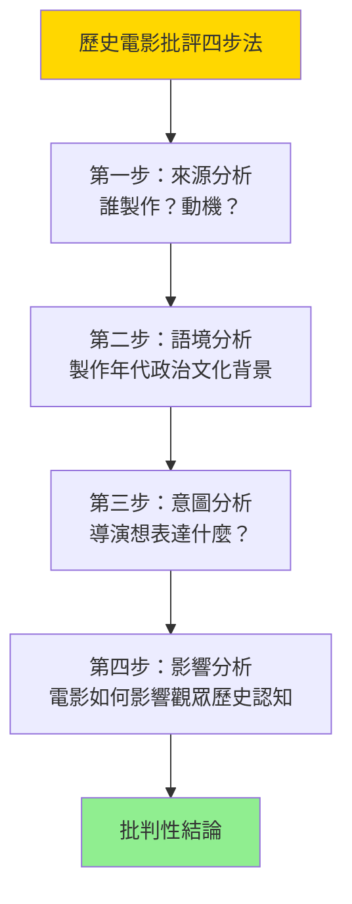
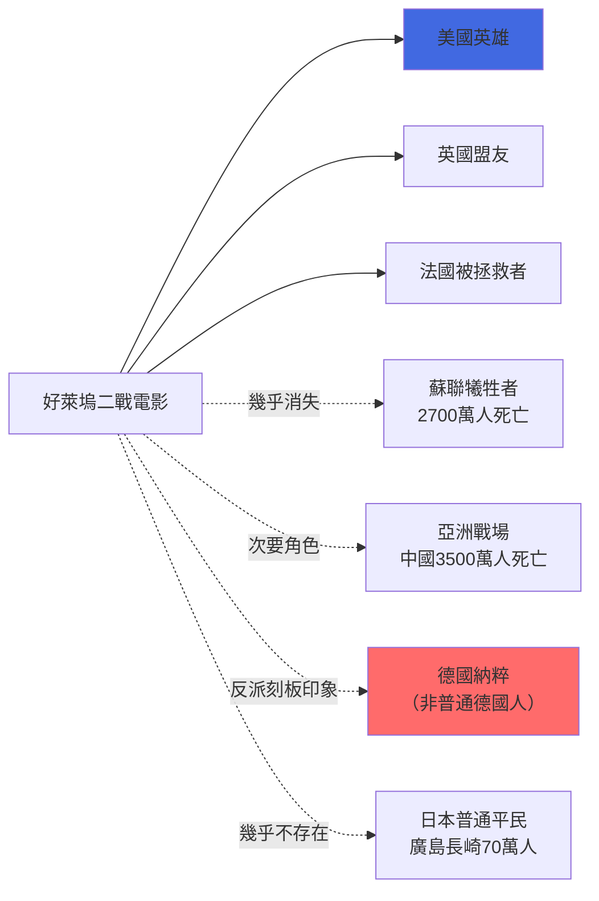
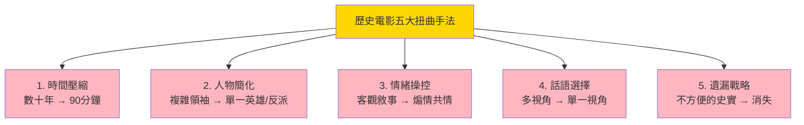
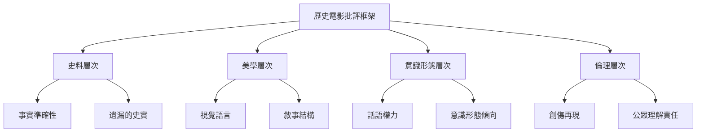
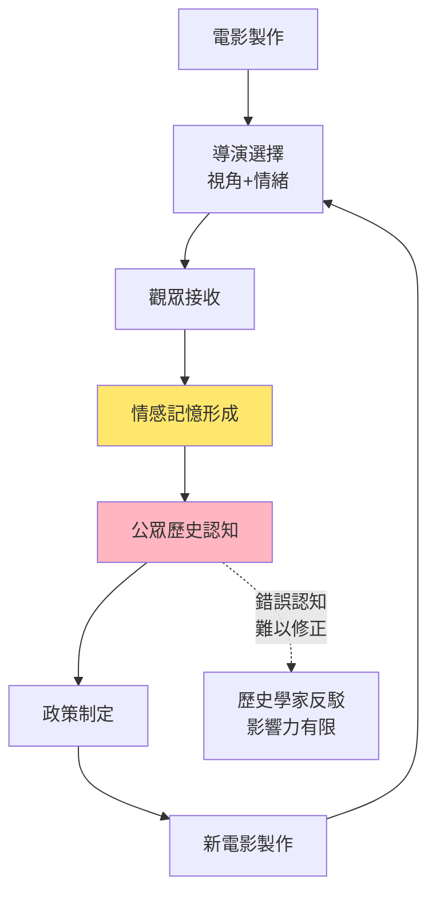

# HIST2031 電影中的歷史 / History through Film

**Instructor**: Crystal Kwok / Staci Ford
**Department**: History, HKU
**Official source**: [HKU History Course Description 2024-25](https://history.hku.hk/wp-content/uploads/2024/07/HIST-2425.pdf)
**Style**: 袁騰飛式 — 犀利分析電影點樣「夾私貨」、扭曲歷史、然後塑造集體記憶

---

## 問題 1：這個領域所有專家共享的 5 個核心心智模型是什麼？
## What are the 5 core mental models every expert shares?

### 心智模型 1：「歷史電影」係「歷史再現」而非「歷史本身」
**Historical Film as "Historical Representation" not "History Itself"**

學者 **Robert Rosenstone**（加州理工，*Revisioning History*, 1995）指出：電影唔係歷史書嘅視覺版本，而係一種全新嘅歷史論述形式——電影有自己嘅敘事邏輯（視覺壓縮時間、音樂操縱情緒、演員表演帶入當代價值觀）。

- **好萊塢電影時長**：通常 90-120 分鐘——但係歷史事件通常跨越數十年；呢個時間限制點解造成歷史扭曲？
- **視覺歷史學**（visual history）：電影用畫面說服觀眾相信自己見到嘅係「真相」——但係電影畫面係導演選擇嘅結果

### 心智模型 2：「荷里活史觀」——點解霸權敘事從未中立
**The "Hollywood View of History" — Hegemonic Narrative Always Loaded**

學者 **John M. MacKenzie**（*Imperialism and the Cinema*, 1997）分析：英國殖民電影塑造咗一套「帝國光榮」嘅集體記憶——而呢套記憶直到今日仍然影響公眾對殖民歷史嘅理解。學者 **Stephen Toby**（*Bad Seed*, 2011）分析日本電影點樣處理戰爭責任問題。

- **好萊塢二戰電影**：從 *Saving Private Ryan*（1998）到 *Dunkirk*（2017）——全部以英美視角為主，蘇聯、亞洲戰場被忽略
- **亞洲電影**：*南京！南京！*（2009）、*二十二*（2017）——中國導演用電影填補官方歷史話語嘅空白

### 心智模型 3：「記憶宮殿」——電影點樣塑造集體記憶
**"Memory Palace" — How Film Shapes Collective Memory**

學者 **Pierre Nora**（法國，*Realms of Memory*, 1989-92）提出「記憶場所」（lieux de mémoire）概念——電影係現代社會最重要嘅集體記憶塑造工具之一。學者 **Maurice Halbwachs**（法國社會學家）早就指出：集體記憶唔係被動储存，而係主動建構。

- **《辛德勒的名單》**（1993）：全球公眾對大屠殺嘅情緒性理解，幾乎完全來自呢部電影而非歷史書
- **《阿凡達》**（2009）：以美洲原住民抗爭為原型——但全球觀眾當佢係原創奇幻作品

### 心智模型 4：史料批判方法應用於電影分析
**Applying Historical Source Criticism to Film Analysis**

學者 **Marc Ferro**（法國史學家）首創「電影與歷史」（Cinema and History）學科，指出電影可以作為「非意向性史料」（unintentional source）——即使電影扭曲事實，佢仍然揭示咗製作時代嘅意識形態。

- **冷戰時期的美國電影**：1950 年代大量「共產主義威脅」電影——唔反映歷史事實，但精確反映美國麥卡錫時代嘅集體恐慌
- **後冷戰時期俄羅斯電影**：*史太林格勒*（2013）——用愛國主義話語重新包裝二戰記憶

### 心智模型 5：「歴史影像化」嘅倫理困境
**The Ethical Dilemma of "Historicizing through Images"**

學者 **Saul Friedlander**（ UCLA，大屠殺史學家）提出：當創傷歷史被影像化，觀眾可能因為視覺震撼而對歷史真相產生錯誤嘅「理解感」——呢個叫「旁觀者效應」（bystander effect）。

- **大屠殺電影問題**：*Schindler's List* 令人覺得自己「已了解」大屠殺，但事實上電影只係一個好老闆救咗 1,200 人嘅故事，而納粹屠殺咗 600 萬人
- **奴隸制電影問題**：*Gone with the Wind*（1939）塑造咗一代美國人對奴隸制嘅浪漫化理解

---

## 問題 2：這個領域 3 個 SPECIFIC 根本分歧

### 分歧 1：歷史電影係歷史教育工具定係歷史誤解工廠？
**Historical Film: Educational Tool or Misinformation Factory?**

- **A 方（教育論）**：學者 **Robert Rosenstone**、**Paul Cartledge**（劍橋）——歷史電影動員千百萬觀眾接觸歷史，其教育價值唔可以因為「歷史不準確」而全盤否定；而且電影可以引發觀眾去閱讀更多歷史。
- **B 方（批判論）**：學者 **David Trend**（*The Lore of the Elves*, 1996）、學者 **Zoe Dunseith**——電影錯誤嘅歷史形象往往比歷史書更深刻地留在公眾記憶入面；研究顯示睇完電影後，觀眾更難以接受與電影不符的歷史真相。

### 分歧 2：點解「亞洲電影」喺全球歷史敘事中長期被忽略？
**Why Has Asian Cinema Been Ignored in Global Historical Narratives?**

- **A 方（文化帝國主義批判）**：學者 **Micheal Curtin**（*Playing to the World's Audiences*, 2007）——好萊塢同英語電影工業垄断全球發行渠道，令非英語電影邊緣化；呢個係文化帝國主義。
- **B 方（電影美學論）**：學者 **David Bordwell**（威斯康辛）——非好萊塢電影之所以國際影響力低，係因為其敘事美學同全球觀眾期望不符；日本新浪潮（1960s）、香港武俠片（1970-90s）、台灣新電影（1980s）都有極高藝術價值但商業票房唔對等。

### 分歧 3：歷史人物被「洗白」或「抹黑」——歷史學家有冇責任干預？
**Should Historians Intervene in "Whitewashing" or "Demonizing" of Historical Figures in Films?**

- **A 方（干預論）**：學者 **E.H. Carr**（*What is History?*, 1961）——歷史學家有社會責任確保公眾歷史認知唔被扭曲；電影作為最大眾化嘅歷史載體，其歷史錯誤唔可以被忽視。
- **B 方（藝術自主論）**：導演 Steven Spielberg 本人回應：電影唔係歷史課本，我哋係用視覺語言創作藝術作品；歷史準確性唔應該係評價電影藝術價值嘅主要標準。

---

## 問題 3：10 個 PROBING 深度問題

1. *Gone with the Wind*（1939）塑造咗「快樂奴隸」形象——點解呢個形象到今日仍然流行？呢個揭示咗美國種族問題乜嘢深層次問題？
2. 點解好萊塢二戰電影從來唔拍蘇聯紅軍喺柏林戰役中犧牲最大嘅歷史？呢個係政治問題定係市場問題？
3. 從 *Schindler's List* 到 *Jojo Rabbit*，大屠殺電影美學化趨勢——係對歷史嘅尊重定係消費？
4. 《霸王別姬》（1993）點樣用京劇演員命運呈現中國20世紀歷史？呢套電影點解喺國際广受讚譽但喺中國被禁？
5. 點解香港電影（80-90年代）喺東亞歷史再現方面有咁重要嘅地位？港片處理咗乜嘢官方歷史話語唔方便處理嘅問題？
6. 歷史電影中女性點解往往被呈現為被動受害者或輔助角色？呢個係歷史事實定係當代性別偏見嘅投射？
7. *Braveheart*（1995）被歷史學家批評為「歷史笑話」——但係仍然贏得奧斯卡最佳電影。點解公眾品味同學術標準差咁遠？
8. 「抗日神劇」——中國近年大量抗日電視劇被批評為「褻瀆歷史」；呢個現象揭示咗中國歷史教育同歷史記憶塑造乜嘢問題？
9. 點解非洲裔美國人導演近年堅持自己拍自己嘅歷史電影（如 *12 Years a Slave*, *Selma*, *One Piece at a Time*）？呢個係電影美學革命定係政治權力鬥爭？
10. 如果你是歷史學家，而家有一部大預算歷史電影想拍攝香港 1967 年暴動——你會建議導演點樣平衡歷史準確性同戲劇效果？

---

# 核心心智模型深化（中英對照）

## 1. 歷史電影批評方法 / Methods of Historical Film Criticism

### 1.1 Bilingual 概念對照
- 歷史再現 (lìshǐ zàixiàn) = Historical Representation — 電影對歷史事件嘅視覺重構
- 史料批判 (shǐliào pīpàn) = Source Criticism — 評估史料可靠性嘅史學方法
- 集體記憶 (jítǐ jìyì) = Collective Memory — 群體共享嘅歷史認知
- 話語權力 (huàyǔ quánlì) = Discourse Power — 邊個有權定義歷史真相

### 1.2 史料與考據
- **電影史料價值**：電影作為時代精神（Zeitgeist）嘅非意向性反映——即使扭曲事實，仍反映製作年代嘅價值觀
- **批判性閱讀工具**：Source-Context-Intent-Impact 四步分析法

### 1.3 袁騰飛式犀利觀察
> 「Schindler's List 話你知：一個好老闆救咗 1,200 人——呢個係歴史！但係納粹屠殺咗 600 萬人——呢個唔係歴史，呢個係背景音樂！好萊塢最叻就係將600萬人變成背景，1200人變成主角。」

### 1.4 Deep Test Question
**考試題**：選擇一部具體嘅歷史電影，分析佢喺以下四個層面點樣處理歷史：
(a) 時間壓縮（chronological compression）
(b) 人物簡化（character simplification）
(c) 情緒操控（emotional manipulation）
(d) 話語意識形態（ideological discourse）

### 1.5 圖解

---

## 2. 好萊塢史觀批判 / Critique of Hollywood's View of History

### 2.3 袁騰飛式犀利觀察
> 「好萊塢告訴你：二戰係美國人打贏嘅！——蘇聯紅軍傷亡 2,700 萬人，占二戰總傷亡 35%——但係喺好萊塢電影入面，蘇聯人幾乎不存在！」

### 2.4 Deep Test Question
**考試題**：選擇三部好萊塢歷史電影，分析佢哋如何處理「敵人」形象。呢啲形象塑造揭示咗乜嘢當代美國外交政策同意識形態？

### 2.5 圖解

---

## 3. 集體記憶與電影 / Collective Memory and Film

### 3.3 袁騰飛式犀利觀察
> 「有一個笑話：歷史係勝利者寫嘅。但係喺影像時代，歷史係有錢拍電影嘅人話嘅——所以如果你想知邊個打勝仗，你最好留意邊個有錢拍片！」

### 3.4 Deep Test Question
**考試題**：分析 *Schindler's List*（1993）如何塑造全球公眾對大屠殺嘅理解。呢部電影嘅優點同局限分別係乜嘢？電影之外，仲有邊啲歷史再現方式可以補充電影嘅不足？

---

## 4. 亞洲電影與歷史話語 / Asian Cinema and Historical Discourse

### 4.4 Deep Test Question
**考試題**：比較香港電影同中國大陸電影處理歷史事件嘅方式。用具體電影案例說明：點解同一段歷史可以喺兩個地方有咁不同嘅呈現？

---

## 5. 歷史影像化倫理 / Ethics of Historicizing through Images

### 5.4 Deep Test Question
**考試題**：如果你是歷史學家，Netflix 請你做顧問，準備拍一部關於香港六七暴動嘅歷史劇——你會提出乜嘢條件？點樣平衡歷史準確性同電視劇嘅收視需求？

---

## 深度自測問題詳解

**Q1**：*Gone with the Wind* 嘅「快樂奴隸」形象之所以持久，因為呢套電影創造咗一個令人舒適嘅種族敘事——奴隸主係恩人、奴隸係快樂嘅僕人；呢個敘事為白人種族主義提供情感基礎，令種族問題情感上被「解決」而非真正被面對。

**Q2**：蘇聯戰場被忽略——因為冷戰時期美國唔願意承認共產主義國家有咁大嘅軍事貢獻；而且蘇聯傷亡數字太過巨大，令美國相對貢獻顯得渺小——政治唔正確。

**Q3**：大屠殺電影美學化問題——呢個係創傷歷史再現嘅根本倫理困境：視覺化必然簡化創傷複雜性；電影觀眾嘅「旁觀者效應」——因為隔住銀幕睇嘅關係，情感投入唔足以轉化為行動。

**Q4-Q10** 精簡版：
- Q4：《霸王別姬》用京劇藝術承載中國20世紀創傷；因為電影涉及文革被禁，但係喺國際广受讚譽——呢個矛盾本身就揭示咗歷史話語權力問題。
- Q5：香港電影（80-90年代）之所以重要——因為佢哋處理咗大量「官方歷史話語」不方便處理嘅問題，例如貪污、黑社會、九七焦慮；代表作品包括《跛豪》（1991）等。
- Q6：歷史電影中女性被動問題——呢個係當代性別偏見投射，唔完全係歷史事實；但係女性歷史學家已開始修正呢個問題（例如 *Hidden Figures*, 2016）。
- Q7：*Braveheart* 受歡迎原因——史詩戰爭場面、愛情故事、民族主義情緒——呢啲都係普世情感元素，歷史準確性只係「bonus」而非必要條件。
- Q8：抗日神劇問題——呢個係中國歷史教育商品化、民族主義情緒動員、以及歷史事實被意識形態化三者交織嘅結果。
- Q9：非裔美國導演自己拍歷史——呢個係1960s民權運動以來「叙事自主」（narrative sovereignty）運動嘅延續：歷史點解從來都以白人視角為主？
- Q10（顧問方案）：①成立歷史顧問委員會、②提供多視角呈現（官方、受害者、旁觀者、英國人）、③保留戲劇張力但唔改動核心事實、④預留 budget 拍紀錄片版本補充。

---

## 5 個 Mermaid 圖解

### 圖解 1：歷史電影嘅五種常見扭曲手法

### 圖解 2：歷史電影批評框架

### 圖解 3：全球歷史電影話語權力地圖

### 圖解 4：歷史電影分類光譜

### 圖解 5：電影塑造歷史認知流程

---

## 總結

**HIST2031 History through Film** 嘅核心價值：
1. **批判性視覺素養**：喺影像時代，歷史認知主要來自電視劇同電影；歷史學家必須有能力批判呢啲視覺史料
2. **跨學科方法**：電影研究 + 歷史學 + 記憶研究 = 影像史學（visual history）
3. **倫理意識**：歷史再現唔係中性嘅——每一個選擇都携帶權力同責任

**袁騰飛金句**：
> 「電影就係一場視覺魔術——導演話你知邊個係英雄、邊個係衰人；歷史學家話你知：英雄有時係衰人，衰人有時係英雄。」

---

## 延伸閱讀

1. Rosenstone, Robert A. *Revisioning History: Film and the Construction of a New Past*. Princeton: Princeton University Press, 1995.
2. Rosenstone, Robert A. *History on Film / Film on History*. Harlow: Pearson, 2006.
3. Ferro, Marc. *Cinema and History*. Detroit: Wayne State University Press, 1988.
4. MacKenzie, John M., ed. *Imperialism and the Cinema*. Manchester: Manchester University Press, 1997.
5. Halbwachs, Maurice. *On Collective Memory*. Chicago: University of Chicago Press, 1992 [1950].
6. Nora, Pierre. *Realms of Memory: The Construction of the French Past*. New York: Columbia University Press, 1989-1992.
7. Toplin, Robert Brent. *Reel History: In Defense of Hollywood*. Lawrence: University Press of Kansas, 2002.
8. Burgoyne, Robert. *Film Nation: Hollywood Looks at U.S. History*. Minneapolis: University of Minnesota Press, 1997.
