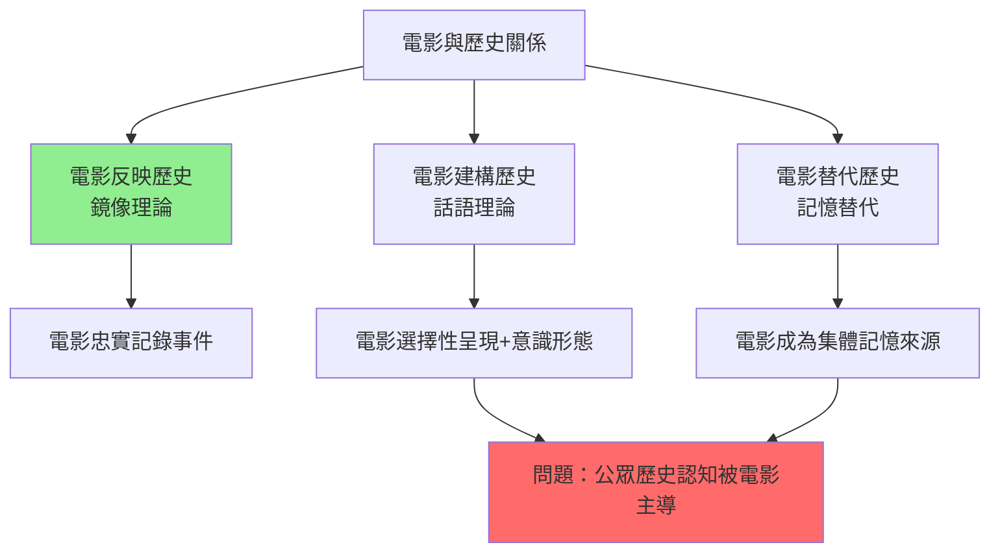
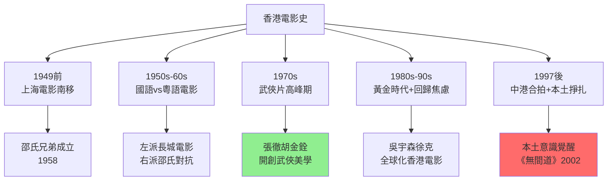
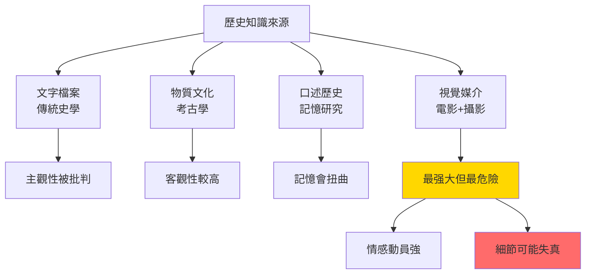
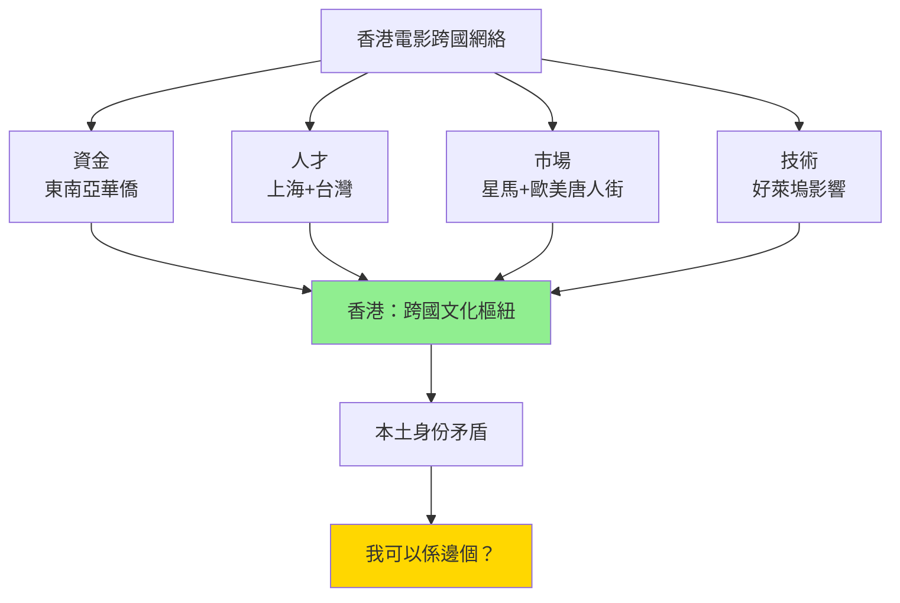
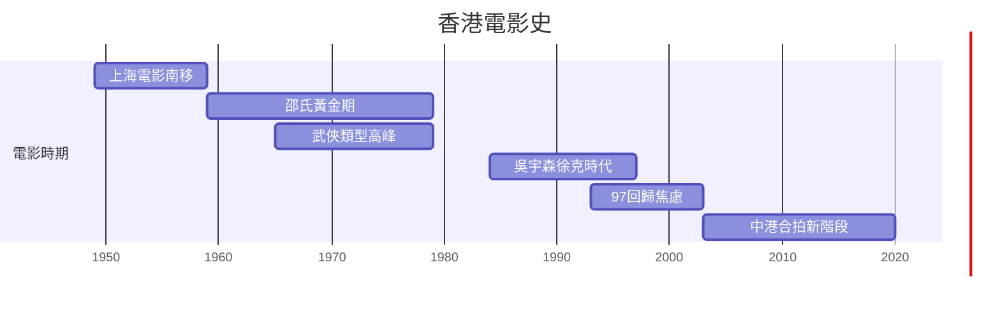
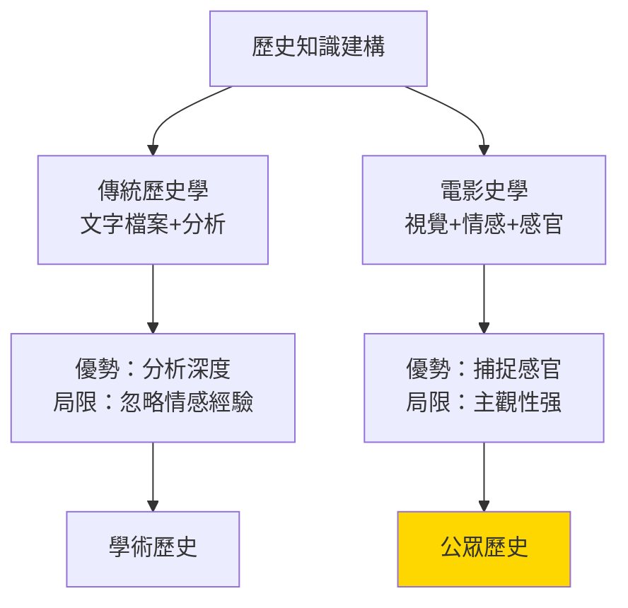
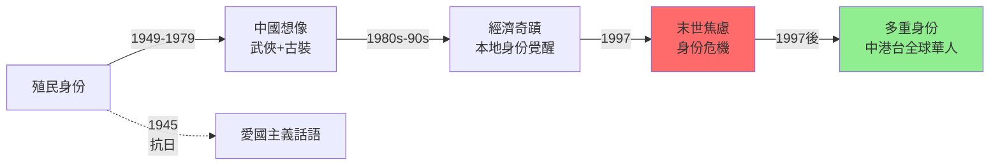
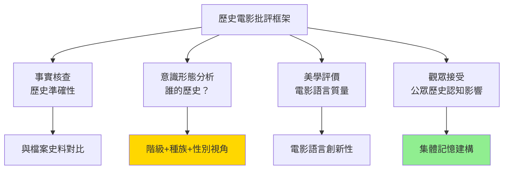

# HIST2031 電影中的歷史 / History through Film

**Instructor**: Crystal Kwok (2024-25); previously Staci Ford
**Department**: History, HKU
**Official source**: [HKU History Course Description 2024-25](https://history.hku.hk/wp-content/uploads/2024/07/HIST-2425.pdf)
**Style**: 袁騰飛式 — 犀利批判，聚焦電影點解成為歷史上最強力但最危險嘅歷史證據

---

## 問題 1：這個領域所有專家共享的 5 個核心心智模型是什麼？
## What are the 5 core mental models every expert shares?

### 心智模型 1：電影係歷史嘅「鏡」定係「窗」？
**Film as Mirror vs. Window of History**

學者 **Vivian Sobchack**（UCLA，*Carnal Thoughts: Embodiment and Moving Image Culture*, 2004）提出：電影唔單單反映歷史，而係以「具身」（embodied）方式體驗歷史——觀眾通過視覺、聽覺、情感進入歷史。學者 **Stuart Hall**（倫敦大學，*Cultural Identity and Diaspora*, 1990）則指出：電影係特定歷史主體嘅話語實踐，電影入面嘅「歷史」係被建構嘅。

- **1895** 盧米埃爾兄弟第一部商業電影，歷史從口述走向視覺記錄
- **1915** 《一個國家的誕生》——好萊塢歷史上最具種族爭議嘅電影，用電影重構美國內戰歷史
- **1960s-70s** 香港邵氏電影用武俠類型重構中國歷史想象，補償政治現實嘅失落
- **1997** 臨近回歸，香港電影湧現大量以回歸為背景嘅電影——《甜蜜蜜》（1996）、《半生緣》（1997）
- **2019** 《返校》——台灣白色恐怖時期嘅電影重構，用恐怖類型呈現戒嚴歷史

### 心智模型 2：「歷史電影」係「歷史」定係「電影」先行？
**Film's Historical Priority: History or Film?**

學者 **Hayden White**（UC Santa Cruz，*Tropics of Discourse*, 1978）嘅後現代理論指出：所有歷史敘事，包括電影，都係用「情節化」（emplotment）方式重構過去。學者 **Robert Rosenstone**（MIT，*Revisioning History*, 1995）更激進——佢認為電影可以做到傳統歷史寫作做不到嘅事：用視覺、聲音、情感重構歷史經驗。

- **1962** 《阿拉伯的勞倫斯》——呢部電影定義咗「史詩史詩」（epic history）呢個電影類型，但歷史學家指責佢嚴重扭曲阿拉伯起義
- **1972** 《教父》——用黑手黨歷史隱喻美國資本主義暴力，但唔被視為「歷史電影」
- **2002** 《希特勒的門徒》——納粹德國歷史嘅虛構化呈現，引發「歷史可以虛構到咁上下？」大討論
- **2019** 《美國工廠》——紀錄片如何用鏡頭選擇塑造觀眾對中美經濟關係嘅理解

### 心智模型 3：Hong Kong Cinema 係點解特殊嘅歷史證據？
**Hong Kong Cinema as Unique Historical Evidence**

學者 **David Bordwell**（威斯康辛，*Planet Hong Kong: Popular Cinema and the Art of Entertainment*, 2000）系統分析香港電影嘅類型美學。學者 **Gina Marchetti**（香港大學，*From Edison to the Multiplex*, 2006）指出：香港電影係全球電影入面，唯一同時受英國殖民、中國大陸、东南亚、美国影響嘅電影工業——係研究跨國主義（transnationalism）嘅完美個案。

- **1950s** 邵氏兄弟、左派長城電影公司——左右意識形態喺香港電影嘅最初對抗
- **1970s** 李小龍電影——香港電影塑造全球華人身份認同
- **1980s-90s** 吳宇森英雄片、徐克武俠——用動作類型重構香港對殖民歷史嘅想像
- **2003** 《無間道》——911後香港身份危機嘅電影投射
- **2019** 反修例運動期間，大量示威紀錄片同短片湧現——成為重要歷史檔案

### 心智模型 4：電影作為「歷史創傷」嘅治療工具
**Film as Therapeutic Medium for Historical Trauma**

學者 **Susannah Radstone**（*Screening the Gothic*, 2005）提出：電影可以係處理歷史創傷嘅「治療性」媒介。學者 **Miri Yoon**（香港大學）研究韓國電影如何處理日治時期創傷。呢個模型對於理解香港電影如何處理六七暴動、貪污問題、回歸焦慮特別重要。

- **1991** 《和平飯店》——周潤發最後一部香港電影，隱喻香港人對回歸嘅集體焦慮
- **2002** 《無間道》——佛學「無間地獄」概念處理香港人身份迷失
- **2013** 《一代宗師》——王家衛用武術電影類型搵尋香港嘅中國想像
- **2019** 《願者上鉤》——點解香港人可以接受命運？历史宿命论喺香港電影

### 心智模型 5：電影工廠化作為歷史工業
**Film as Cultural Industry in Historical Context**

學者 **Theodor Adorno** 同 **Max Horkheimer**（《啟蒙辯證法》, 1944）提出「文化工業」（culture industry）概念——電影係大規模生產歷史想像嘅機器。學者 **Pierre Bourdieu**（*Distinction*, 1979）分析點解唔同階級睇唔同嘅歷史電影。呢個模型解釋點解電影嘅歷史敘事往往係精英敘事。

---

## 問題 2：這個領域 3 個 SPECIFIC 根本分歧

### 分歧 1：電影係歷史嘅「偽造者」定係「補充者」？
**Film as Historical Forgery or Complement?**

- **A 方（保守派歷史學家）**：學者 **David Harlan**（*High Dissent*, 2010）——電影為咗娛樂犧牲歷史準確性；《拯救大兵雷恩》（1998）將二戰美軍英雄化，但唔提及萊特轟炸、Nagasaki——歷史被電影改寫成愛國神話。
- **B 方（電影史學家）**：學者 **Robert Rosenstone**——電影可以做到文字歷史做不到嘅事：用視覺呈現戰場氣味、城市聲音、普通人情感；文字歷史同樣有主觀性，唔應該歧視電影。

### 分歧 2：香港電影到底係「中國電影」定係「本地電影」？
**Hong Kong Cinema: Chinese Film or Local Cinema?**

- **A 方（中國電影論）**：學者 **Yingjin Zhang**（聖路易斯華盛頓大學）——香港電影係中國電影傳統嘅一部分，無論喺語言、文化符號、類型傳統上都有深刻嘅中國根
- **B 方（本土論）**：學者 **Stephen Teo**（*$Zone of Divergence*, 1997）——香港電影有獨特嘅本土身份，係英殖民城市經驗、中西混合文化、嶺南傳統嘅獨特產物，唔可以被簡化為「中國電影」

### 分歧 3：歴史電影到底應唔應該有「道德責任」呈現歷史真相？
**Ethical Responsibility of Historical Cinema**

- **A 方（道德論）**：學者 **Jane Caputo**——歷史電影有道德責任盡量準確呈現歷史；錯誤嘅歷史電影會固化公眾對歷史嘅錯誤理解（如《功夫熊貓》中國元素被批評為刻板印象）
- **B 方（美學論）**：學者 **Stephen Greenblatt**（哈佛，*Shakespearean Negotiations*, 1988）——電影唔係歷史教材，電影有其自身美學邏輯；强加道德責任會摧毁電影作為藝術嘅價值

---

## 問題 3：10 個 PROBING 深度問題

1. 點解電影可以如此强力地塑造公眾對歷史事件嘅理解——明明佢哋係虛構嘅？
2. 《一個國家的誕生》（1915）被批評為「史上最具種族主義嘅電影」，但佢同時係電影史上最重要嘅技術創新。點樣評價呢種「藝術道德分裂」？
3. 香港武俠電影——從《獨臂刀》（1967）到《一代宗師》（2013）——點解咁受香港同海外華人觀眾歡迎？呢種受歡迎程度揭示咗乜嘢歷史創傷？
4. 好萊塢二戰電影——《拯救大兵雷恩》、《父子英雄》——點解往往将美國士兵塑造為英雄，而納粹德國/日本軍人完全被非人化？呢個塑造方式揭示咗乜嘢歷史政治學？
5. 歷史紀錄片到底係「客觀呈現」定係「主觀建構」？BBC纪录片《中國的簡單歷史》點解引發争议？
6. 點解1997年前後嘅香港電影充滿咁多「末世情緒」同「失落的懷舊」？呢種情緒喺《花樣年華》（2000）同《2046》（2004）入面點解體現？
7. 台灣電影點解近年喺處理二二八事件、白色恐怖呢啲政治創傷方面有咁大突破？電影《返校》同《女朋友。男朋友》揭示咗乜嘢？
8. 電影史學（film historiography）同傳統歷史學（history）到底有乜嘢根本差異？邊個方法更能捕捉「歷史經驗」？
9. AI 時代，deepfake 技術可以完美伪造歷史影像——呢個對「歷史真相」呢個概念有乜嘢毀滅性影響？
10. 點解我哋需要擔心「歷史被電影取代」？Netflix 同串流平台點解可能改變公眾歷史認知？

---

# 核心心智模型深化（中英對照）

## 1. 電影作為歷史證據 / Film as Historical Evidence

### 1.1 Bilingual 概念對照
- 歷史再現 (lìshǐ zàixiàn) = Historical Representation — 用媒介重構過去
- 電影史學 (diànyǐng shǐxué) = Film Historiography — 電影作為歷史寫作方法
- 具身認知 (jùshēn rènzhī) = Embodied Cognition — 通過感官體驗歷史
- 後現實主義 (hòu xiànshí zhǔyì) = Postmodernism — 否定單一歷史真相

### 1.2 史料與考據
- **電影文本**：香港電影資料館（HKIFF）、英國電影學會（BFI）館藏
- **批評話語**：*Jump Cut* 期刊、*Screen* 期刊、香港電影評論學會
- **創作者訪談**：香港電影工作者訪談口述歷史項目

### 1.3 袁騰飛式犀利觀察
> 「《功夫熊貓》話你知：當西方人決定用你嘅文化符號去sell 你嘢嘅時候，你可以話：『幾好吓！』但係你唔可以話：『呢個係我哋嘅歷史！』——阿宝唔係熊貓，佢係荷里活工廠出產嘅商品。」

### 1.4 Deep Test Question
**考試題**：分析香港武俠電影（1960s-2000s）如何處理「中國vs香港」身份問題。用具體電影例子（《獨臂刀》、《少林三十六房》、《一代宗師》）支持你嘅分析。

### 1.5 圖解

---

## 2. 香港電影史 / History of Hong Kong Cinema

### 2.1 Bilingual 概念對照
- 邵氏兄弟 = Shaw Brothers — 香港電影工業黃金時代代表
- 武俠類型 = Wuxia Genre — 以武術同江湖世界為主題嘅電影類型
- 跨國電影 = Transnational Cinema — 跨越國界嘅電影製作同發行
- 殖民電影 = Colonial Cinema — 受殖民權力影響嘅電影文化

### 2.3 袁騰飛式犀利觀察
> 「香港電影黃金時代（1980s-1990s）——你知唔知，嗰陣每年香港生產 300+ 部电影，全球产量第一！但係香港人拍嘅唔係香港，而係關於中國嘅幻想、古裝嘅武俠——呢個就係殖民城市最典型嘅文化矛盾：我哋住喺香港，但我哋嘅電影入面香港從來未出現。」

### 2.4 Deep Test Question
**考試題**：比較香港武俠電影1970s-80s同台灣新電影運動（1980s-90s）處理歷史創傷嘅方式。兩者點解走上唔同嘅電影美學路？

### 2.5 圖解

---

## 3. 電影史學理論 / Film Historiography Theory

### 3.1 Bilingual 概念對照
- 情節化 (qíngjié huà) = Emplotment — 用故事情節組織歷史材料（Hayden White）
- 後現代主義歷史觀 = Postmodernist View of History — 否定單一歷史真相
- 視覺史學 = Visual Historiography — 用視覺媒介從事歷史寫作
- 創傷電影 = Trauma Cinema — 處理歷史創傷嘅電影

### 3.3 袁騰飛式犀利觀察
> 「Hayden White 話歷史敘事唔過係一種文學體裁——歷史學家瞬間覺得：我做嘅嘢原來係『小說』？但係如果你接受呢個觀點，咁《拯救大兵雷恩》同《史記》就變成一樣嘢——都係主觀建構。呢個就係電影史學最危險但最犀利嘅地方。」

### 3.4 Deep Test Question
**考試題**：Hayden White 話歷史敘事同電影一樣都係「情節化」（emplotment）嘅產品。呢個論點點解令傳統歷史學家不安？電影史學家點解支持呢個觀點？

### 3.5 圖解

---

## 4. Hong Kong Cinema 跨國主義 / Hong Kong Cinema Transnationalism

### 4.1 Bilingual 概念對照
- 跨國電影 = Transnational Cinema — 跨越國界嘅電影製作
- 離散電影 = Diaspora Cinema — 海外華人社區電影
- 港片北上 = Hong Kong Films Going North — 回歸後與中國大陸合拍
- 本土意識 = Local Consciousness — 香港人身份認同

### 4.3 袁騰飛式犀利觀察
> 「香港電影從來唔係純粹嘅『香港』——邵氏片場喺香港，但係演員來自上海、北京、台灣；資金來自東南亞華僑；觀眾喺唐人街喺星馬——呢個就係『跨國』嘅意思，而香港電影就係跨國主義嘅完美示範。」

### 4.4 Deep Test Question
**考試題**：點解香港電影喺1997年後經歷「北上」過程？呢個轉變點解影響香港電影嘅「本土性」？

### 4.5 圖解

---

## 5. 電影創傷敘事 / Cinematic Trauma Narrative

### 5.1 Bilingual 概念對照
- 創傷敘事 = Trauma Narrative — 用故事處理歷史創傷
- 集體記憶 = Collective Memory — 社群共同分享嘅歷史記憶
- 歷史焦慮 = Historical Anxiety — 對歷史不确定性嘅恐懼
- 電影治療 = Cinematic Therapy — 用電影處理歷史創傷

### 5.3 袁騰飛式犀利觀察
> 「《無間道》用佛學嘅『無間地獄』——永恆嘅痛苦循環——解釋香港人身份困境，呢個真係幾犀利。但係問題在於：電影幫我哋處理咗創傷，仲係令我哋沉醉喺創傷入面？治療同上癮，有時真係分唔清。」

### 5.4 Deep Test Question
**考試題**：比較《花樣年華》（2000）同《女朋友。男朋友》（2012）處理歷史創傷嘅方式。兩部電影點解用咁唔同嘅電影語言？

### 5.5 圖解

---

## 深度自測問題詳解

**Q1**：電影之所以强力塑造歷史認知——因為視覺敘事激活情感記憶，唔係理性分析。呢個係人類認知偏見，但係歴史學家必須理解呢個偏見先至可以批判電影嘅歷史呈現。

**Q2**：《一個國家的誕生》——呢部電影用當時最先進嘅電影語言（cross-cutting、特寫、Lillian Gish 白皙形象）傳播最惡劣嘅種族主義。呢個係「藝術同道德」可以完全分離嘅證明——技術創新唔代表道德進步。

**Q3**：武俠電影受欢迎——因為佢提供咗一個「想像的中國」，補償咗香港人喺政治現實中無法獲得嘅中國身份认同。從《少林三十六房》（1978）到《一代宗師》（2013），武俠類型經歷從「國族武俠」到「武術美學」嘅轉變。

**Q4-Q10** 精簡版：
- Q4：好萊塢二戰電影——用二元對立（英雄vs納粹）簡化歷史複雜性，令公眾相信正義係單向嘅。呢個塑造喺歐洲同樣流行，但係忽略咗欧洲人对納粹德國複雜歷史。

- Q5：歷史紀錄片——從《新聞鏡頭》到 Netflix，紀錄片從「客觀呈現」變成「選擇性呈現」，鏡頭選擇同剪接順序直接影響歷史詮釋。

- Q6：1997前香港電影——《甜蜜蜜》用愛情故事包裝香港人对内地移民嘅複雜情感；《古惑仔》用幫派類型呈現無根城市嘅江湖義氣。

- Q7：台灣電影——《男朋友。女朋友》（2012）處理台灣解嚴前後嘅政治運動，用個人成長故事呈現集體歷史創傷。

- Q8：電影史學——比傳統歷史更能捕捉感官經驗（戰場聲音、城市氣味），但犧牲咗分析複雜性。

- Q9：Deepfake——可以將任何人放喺任何場景，令「視覺證據」呢個歷史概念受到根本挑戰。

- Q10：Netflix——《王的迷思》（The Crown）令英國王室歷史在全球流傳，但係呢種流傳係由英國文化霸權主導。

---

## 5 個 Mermaid 圖解

### 圖解 1：電影與歷史關係模型

### 圖解 2：香港電影歷史時期

### 圖解 3：電影史學 vs 傳統歷史學

### 圖解 4：Hong Kong Cinema 身份建構

### 圖解 5：歷史電影批評框架

---

## 總結

**HIST2031 History through Film** 係香港大學歷史系最具創新性嘅課程之一——因為佢逼你正視一個痛苦嘅問題：歷史到底係客觀事實定係主觀建構？

呢個 course 嘅核心價值：
1. **批判性視覺素養**：唔再被電影嘅視覺力量冲昏頭腦，而係學會拆解電影嘅歷史敘事
2. **跨學科方法**：結合電影理論、歷史學、文化研究，呢個係21世紀歷史學嘅大方向
3. **Hong Kong 作為個案**：香港電影係全球最獨特嘅電影文化之一，係研究殖民、跨國、本土身份嘅完美材料

**袁騰飛金句**：
> 「電影告訴你歷史係點樣——但係電影從來唔告訴你，導演點解要咁樣告訴你。」

---

## 延伸閱讀 / Further Reading

1. Sobchack, Vivian. *Carnal Thoughts: Embodiment and Moving Image Culture*. Berkeley: University of California Press, 2004.
2. Rosenstone, Robert A. *Revisioning History: Film and the Construction of a New Past*. Princeton: Princeton University Press, 1995.
3. Marchetti, Gina. *From Edison to the Multiplex: Cinema and the Modern World*. Hong Kong: Hong Kong University Press, 2006.
4. Bordwell, David. *Planet Hong Kong: Popular Cinema and the Art of Entertainment*. Cambridge: Harvard University Press, 2000.
5. White, Hayden. *Tropics of Discourse: Essays in Cultural Criticism*. Baltimore: Johns Hopkins University Press, 1978.
6. Teo, Stephen. *Hong Kong Cinema: The Extra Dimension*. London: BFI, 1997.
7. Berry, Chris. *Postcolonial Hong Kong Cinema*. Hong Kong: Hong Kong University Press, 2009.
8. Hall, Stuart. "Cultural Identity and Diaspora." In *Identity: Community, Culture, Difference*, ed. Jonathan Rutherford. London: Lawrence & Wishart, 1990.
