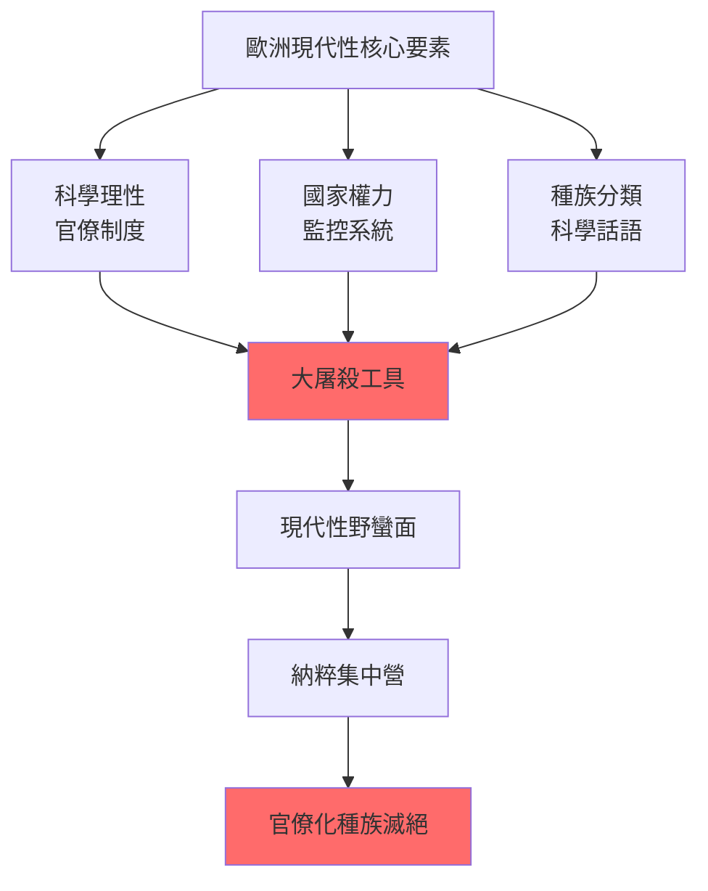
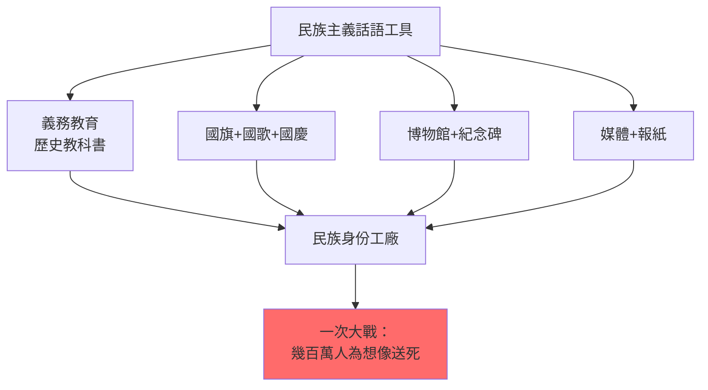
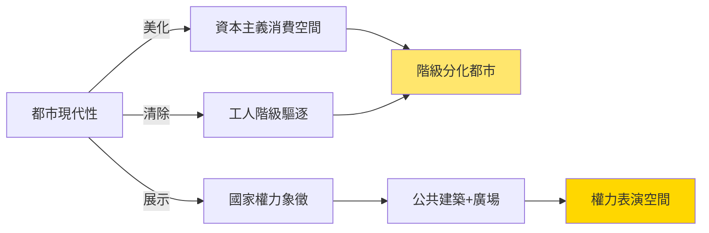
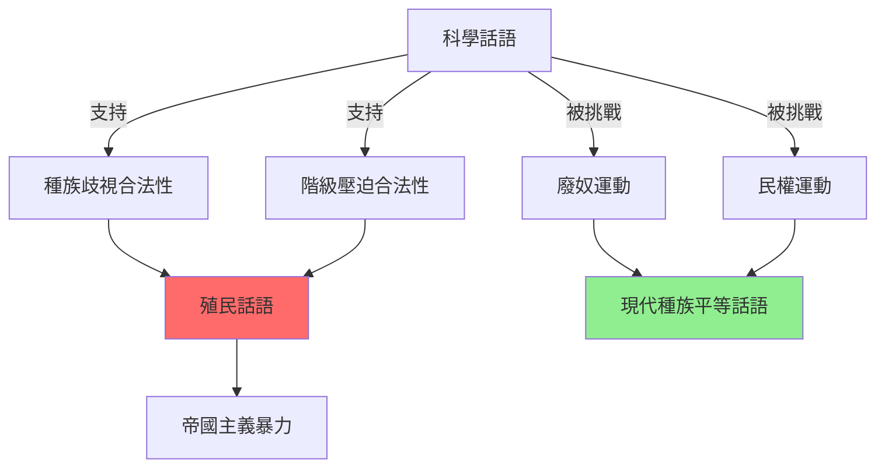
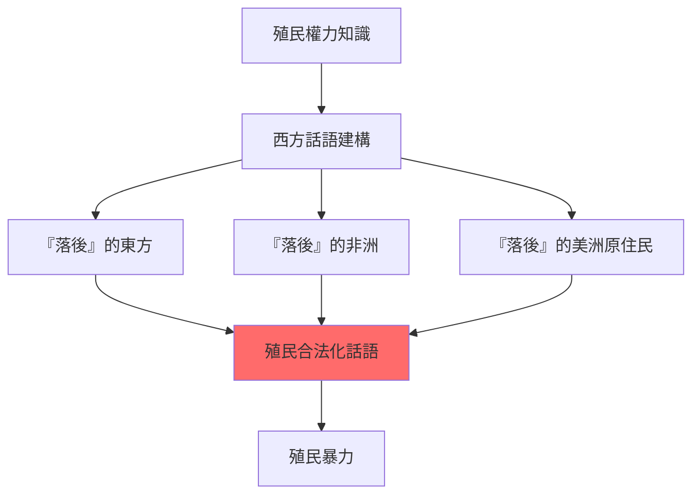
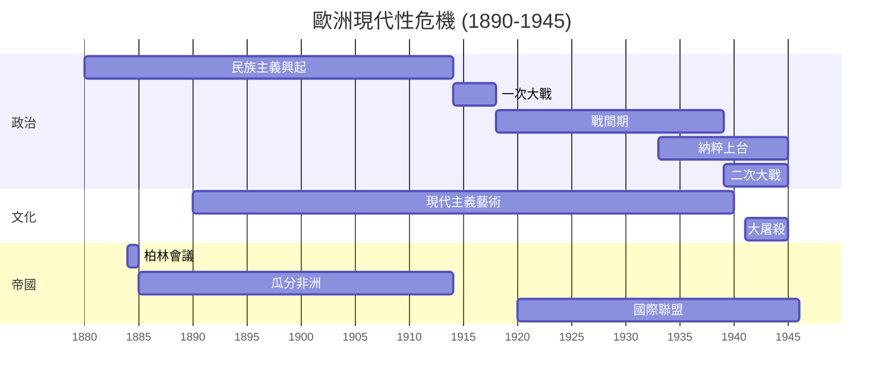
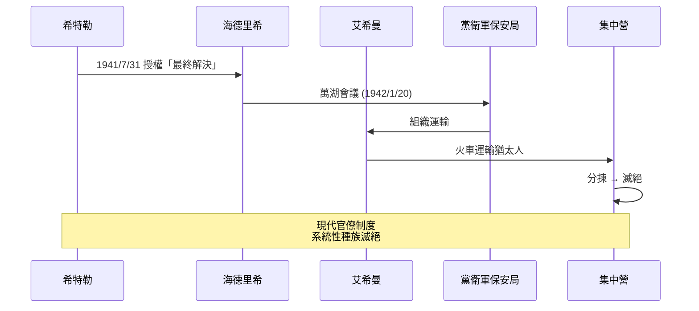
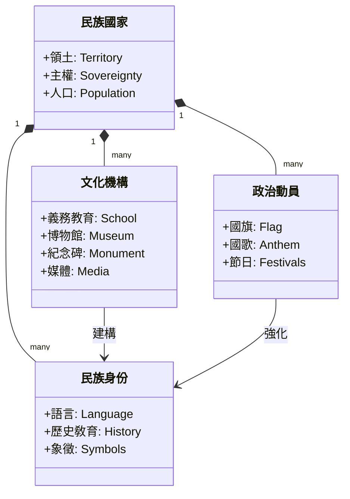
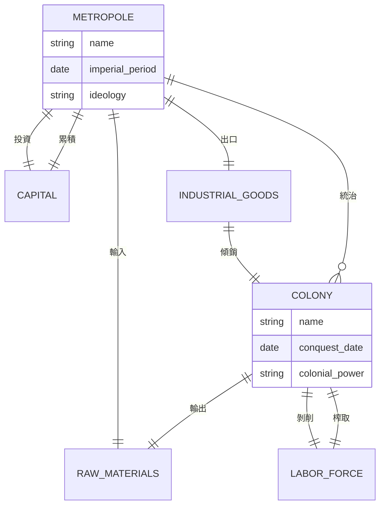
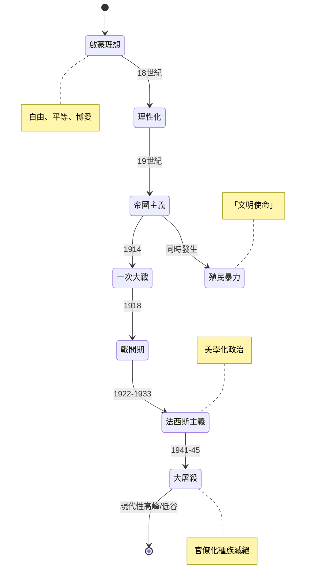

# HIST2063 歐洲與現代性 / Europe and Modernity: Cultures and Identities, 1890–1940

**Instructor**: (varies by year — see HKU course schedule)
**Department**: History, HKU
**Official source**: [HKU History Course Description 2024-25](https://history.hku.hk/wp-content/uploads/2024/07/HIST-2425.pdf)
**Style**: research-based — 犀利批判，聚焦歐洲點解可以同時係文明燈塔同野蠻深淵

---

## 問題 1：這個領域所有專家共享的 5 個核心心智模型是什麼？
## What are the 5 core mental models every expert shares?

### 心智模型 1：「現代性」係一場歐洲內戰
**Modernity as European Civil War, 1890–1940**

學者 **George Mosse**（威斯康辛，*The Image of Man*, 1996）指出：1890-1940年嘅歐洲，唔係從「傳統」走向「現代」，而係一場歐洲內部關於「咩係人」嘅戰爭。種族主義、科學優生學、法西斯主義——呢啲唔係「前現代」�餘，而係「現代性」嘅親生子女。學者 **Zygmunt Bauman**（利茲，*Modernity and the Holocaust*, 1989）更加直接：大屠殺唔係現代性嘅失敗，而係現代性嘅邏輯實現。學者 **Detlev Peukert**（杜伊斯堡，*Max Webers Diagnose der Moderne*, 1989）亦從韋伯傳統出發，指出大屠殺係「理性化」過程嘅病態副產品。**Dan Stone**（倫敦皇家霍洛威，*The Liberation of the Camps*, 2015）進一步論證：大屠殺唔係現代性嘅偏差，而係歐洲文明嘅「核心成就」之一。

- **1895** 居里夫人（Marie Curie）發現鐳——現代科學嘅勝利，但係同種族科學實驗並行
- **1905** 愛因斯坦相對論——物理學革命，同時歐洲各國加劇種族科學研究
- **1914-18** 第一次世界大戰——1500萬人死亡，「文明嘅歐洲」自相殘殺
- **1922** 墨索里尼上台——歐洲第一個法西斯政權，「現代性」嘅新形式
- **1933-45** 納粹德國——現代國家機器被用於系統性滅絕；**Christopher Browning**（西雅圖，*Ordinary Men*, 1992）揭示大屠殺執行者多數係普通德國人

**核心方程式（社會學模型）**：

$$\text{現代性} = f(\text{科學理性}, \text{官僚制度}, \text{國家暴力}) \quad (\text{Bauman 1989})$$

$$\text{大屠殺效率} = \text{鐵路運輸} \times \text{官僚記錄} \times \text{科學分類} \quad (\text{Browning 1992})$$

### 心智模型 2：身份政治係現代性嘅核心產品
**Identity Politics as Core Product of Modernity**

學者 **Benedict Anderson**（康奈爾，*Imagined Communities*, 1983）指出：民族主義唔係「自然」嘅，而係印刷資本主義發明嘅「想像共同體」。學者 **Eric Hobsbawm**（倫敦政經學院，*Nations and Nationalism*, 1990）補充：民族主義係1880年後「發明傳統」嘅高峰——歐洲各國通過國旗、國歌、義務教育大規模製造民族身份。學者 **Ernest Gellner**（劍橋，*Nations and Nationalism*, 1983）從工業社會角度論證：民族主義係從農業社會過渡到工業社會嘅必然產物。學者 **Anthony Smith**（LSE，*The Ethnic Origins of Nations*, 1986）則強調民族主義嘅「族群—象徵」基礎，與 Anderson 嘅「現代發明」論形成張力。學者 **Partha Chatterjee**（加爾各答，*Nationalist Thought and the Colonial World*, 1986）從後殖民角度指出：第三世界嘅民族主義本身已經係對歐洲現代性嘅反應。

- **1870s** 歐洲各國實行義務教育——國家開始控制歷史敎育；**Eugene Weber**（加州柏克萊，*Peasants into Frenchmen*, 1976）分析法國義務教育如何把方言農民變成法國公民
- **1885** 柏林會議——歐洲列強正式瓜分非洲，用「文明使命」掩飾掠奪
- **1908** 愛爾蘭文藝復興——民族文化運動作為英帝國內部嘅抵抗
- **1936** 柏林奧運——納粹德國用現代媒體展示「雅利安種族優越」；**David Clay Large**（蒙大拿，*Nazi Games*, 2007）分析柏林奧運嘅意識形態操作
- **1938** 慕尼黑協議——綏靖政策揭示歐洲民主國家嘅種族歧視

### 心智模型 3：「現代都市」係現代性嘅物理形態
**The Modern City as Physical Form of Modernity**

學者 **Walter Benjamin**（法蘭克福學派，*The Arcades Project*, 1938/1982）分析巴黎拱廊——都市建築作為「資本主義夢境」嘅物理形式。學者 **David Harvey**（牛津，*Paris, Capital of Modernity*, 2003）補充：都市規劃從來唔係中性嘅，而係階級控制同種族隔離嘅工具。學者 **Henri Lefebvre**（巴黎，*The Production of Space*, 1974）提出「空間生產」理論，論證資本主義透過都市化再生產自身。學者 **Siegfried Kracauer**（法蘭克福，*The Salaried Masses*, 1929/1978）分析柏林工人階級嘅都市異化經驗。學者 **Richard Sennett**（紐約大學，*The Fall of Public Man*, 1977）則從芝加哥學派傳統論證現代都市如何摧毀公共生活。

- **1853-70** 奧斯曼男爵（Baron Haussmann）改造巴黎——清除貧民窟同時驅逐工人階級
- **1889** 巴黎世博會——艾菲爾鐵塔作為工業現代性嘅全球標誌
- **1900** 巴黎地鐵開通——現代都市流動性嘅象徵
- **1929** 《大都會》（Metropolis）——Fritz Lang 嘅反烏托邦電影預言現代都市嘅異化
- **1937** 巴黎世界博覽會——決定人類命運嘅「藝術與技術」展覽；蘇聯同納粹德國嘅展館正面對峙

### 心智模型 4：科學主義同種族主義嘅共生關係
**Symbiosis of Scientism and Racism**

學者 **Stephen Jay Gould**（哈佛，*The Mismeasure of Man*, 1981）揭露：19-20世紀嘅「科學種族主義」——用錯誤嘅智商測量、顱骨測量——支撐歐洲帝國主義。學者 **Robert N. Proctor**（賓州州立，*Racial Hygiene*, 1988）分析：納粹德國嘅種族衛生政策唔係科學失敗，而係科學家主動參與嘅種族滅絕。學者 **Paul Weindling**（牛津布魯克斯，*Health, Race and German Politics*, 1989）進一步指出，種族衛生政策喺國際科學界係主流共識，納粹只係「極端化」而已。學者 **Nancy Stepan**（哥倫比亞，*The Idea of Race in Science*, 1982）從比較角度分析英、法、美、德、巴西嘅種族科學傳統。學者 **Edwin Black**（*War Against the Weak*, 2003）揭示美國優生學運動同納粹嘅直接思想聯繫。

- **1859** 達爾文（Charles Darwin）*物種起源*——科學革命，但被濫用支持種族主義；**Alfred Russel Wallace**（1858）嘅共同發現亦被同樣濫用
- **1883** 高爾登（Francis Galton）提出「優生學」概念——用統計學「科學地」支持種族歧視
- **1900** 孟德爾遺傳學（Gregor Mendel, 1865）重新發現——被納粹扭曲為種族純化嘅「科學基礎」
- **1924** 美國移民法——用「科學」理由限制南歐、東歐移民；學者 **Kevles 1985** *In the Name of Eugenics* 分析此法
- **1933** 納粹德國《遺傳病後代防治法》（Gesetz zur Verhütung erbkranken Nachwuchses）——現代國家用科學話語實行優生絕育

**優生學量化模型**：

$$\text{種族健康指數} = \frac{\text{「適者」出生率} - \text{「不適者」出生率}}{\text{總人口增長率}} \quad (\text{Galton 1883, 已被 Gould 1981 批判})$$

$$\text{智力商數} = IQ = \frac{\text{心智年齡}}{\text{實足年齡}} \times 100 \quad (\text{Terman 1916, 經 Gould 1981 揭露含種族偏見})$$

### 心智模型 5：「文明使命」係帝國主義嘅意識形態掩護
**"Civilizing Mission" as Ideological Cover for Imperialism**

學者 **Edward Said**（哥倫比亞，*Culture and Imperialism*, 1993）延伸佢嘅後殖民理論——歐洲文化（文學、藝術、學術）唔係喺帝國主義「之外」，而係帝國主義嘅核心意識形態武器。學者 **Gyan Prakash**（普林斯頓，*After Colonialism*, 1995）提出：第三世界嘅「現代性」焦慮，正係歐洲帝國主義文化霸權嘅最深層遺產。學者 **Frantz Fanon**（阿爾及利亞，*The Wretched of the Earth*, 1961）從精神分析角度論證殖民暴力如何內化於被殖民者。學者 **Aimé Césaire**（馬提尼克，*Discourse on Colonialism*, 1950）提出震撼性等式：「歐洲對待非歐洲人嘅野蠻，正係歐洲對自己工人階級實施嘅野蠻」。學者 **Hannah Arendt**（芝加哥，*The Origins of Totalitarianism*, 1951）早於 Said 已分析「種族帝國主義」嘅意識形態根源。

- **1884-85** 柏林會議——歐洲正式瓜分非洲，確立「有效佔領」原則
- **1899** 海牙公約——歐洲「文明國家」試圖規範戰爭，但排除殖民地戰爭；學者 **Martti Koskenniemi**（赫爾辛基，*The Gentle Civilizer of Nations*, 2002）分析國際法嘅種族盲點
- **1916** 阿拉伯起義（Arab Revolt）——英國以「阿拉伯自由」為名、實際分割中東；學者 **James Barr**（*A Line in the Sand*, 2011）分析英法秘密《賽克斯—皮科協定》
- **1931** 國際聯盟——歐洲「文明國家」俱樂部，拒絕承認亞洲國家平等地位

**帝國主義量化指標**：

$$\text{殖民掠奪率} = \frac{\text{殖民地輸出} - \text{殖民地輸入}}{\text{宗主國 GDP}} \quad (\text{Patnaik 1990, 計算殖民剝削})$$

---

## 問題 2：這個領域 3 個 SPECIFIC 根本分歧

### 分歧 1：現代性係歐洲「發明」定係歐洲「壟斷」？
**Modernity: European Invention or European Monopoly?**

- **A 方（歐洲起源論）**：學者 **Marshall Berman**（紐約，*All That is Solid Melts into Air*, 1982）——現代性係從歐洲開始嘅全球性經驗，佢嘅核心矛盾（個體自由 vs 集體異化）適用於所有社會。**Jürgen Habermas**（法蘭克福，*The Philosophical Discourse of Modernity*, 1985）將現代性視為歐洲啟蒙運動嘅合理化方案。
- **B 方（批判派）**：學者 **Dipesh Chakrabarty**（芝加哥，*Provincializing Europe*, 2000）——「歐洲現代性」被錯誤地等同於普世現代性；亞洲、拉美有自己嘅現代性道路。學者 **Arjun Appadurai**（紐約大學，*Modernity at Large*, 1996）則強調「全球文化流動」對單一歐洲現代性敘事嘅挑戰。
- **張力**：呢個分歧嘅核心係「普遍性 vs 多元性」——若現代性係普世嘅，�亞非拉現代化只係「追趕歐洲」；若現代性係多元嘅，咁歐洲中心主義就被解構——但同時要避免落入「文化相對主義」陷阱。

### 分歧 2：納粹主義係「德國病」定係「歐洲現代性」嘅極端版？
**Nazism: German Pathology or Extreme Version of European Modernity?**

- **A 方（例外論 / Sonderweg 論）**：學者 **Ian Kershaw**（牛津，*Hitler*, 2000）——納粹主義係德國特殊歷史條件（一次大戰失敗、凡爾賽條約、經濟危機）嘅產物。學者 **David Blackbourn**（劍橋，*The Long Nineteenth Century*, 1997）同 **Geoffrey Eley**（密西根）嘅「德國特殊道路」論亦持此觀點。
- **B 方（結構論）**：學者 **Zygmunt Bauman**——大屠殺係現代性嘅邏輯實現：官僚制度、科學理性、國家權力三位一體——呢啲全部都係歐洲現代性嘅核心價值。學者 **Enzo Traverso**（巴黎，*The Origins of Nazi Violence*, 2003）亦認為大屠殺係歐洲反猶傳統、殖民暴力、現代性暴力嘅結合。學者 **Donald Bloxham**（愛丁堡，*The Final Solution*, 2009）將大屠殺置於 19 世紀歐洲種族滅絕傳統中分析。
- **張力**：呢個分歧關乎「歷史責任」嘅歸屬——若納粹係德國特殊病，咁其他歐洲國家對大屠殺嘅責任就被稀釋；若納粹係歐洲現代性嘅極端版，咁整個歐洲文明都需要反思——但呢個觀點亦可能陷入「集體罪責」嘅倫理問題。

### 分歧 3：「文明使命」到底係真誠信念定係意識形態借口？
**"Civilizing Mission": Sincere Belief or Ideological Cover?**

- **A 方（共情派）**：學者 **Andrew Porter**（牛津，*Religion versus Empire*, 2004）——19世紀傳教士同殖民主義者好多係真誠相信「文明使命」嘅；呢個信念本身係道德上可理解但歷史上錯誤。學者 **C. A. Bayly**（�橋，*Empire and Information*, 1996）認為英國統治者確實帶有改良動機。
- **B 方（批判派）**：學者 **Utsa Patnaik**（德里大學，*Peasant Class Differentiation*, 1976）——經濟數據顯示殖民剝削係真實動機，「文明使命」只係意識形態掩護。學者 **Mike Davis**（加州，*Late Victorian Holocausts*, 2001）揭示殖民主義製造嘅大規模饑荒與其「文明」話語嘅矛盾。學者 **Walter Rodney**（圭亞那，*How Europe Underdeveloped Africa*, 1972）從發展經濟學角度系統性拆解「文明使命」話語。
- **張力**：呢個分歧關乎「動機分析」嘅哲學問題——我哋能否從行動者嘅後果推斷佢哋嘅動機？「真誠信念」同「結構性暴力」是否必然對立？呢個亦關聯到「歷史理解」嘅�釋學問題——我哋係應該用行動者自身嘅語言理解佢哋，定係用後設批判分析佢哋？

---

## 問題 3：10 個 PROBING 深度問題

### Q1：如果現代性同野蠻係一體兩面，咁點解我哋仲要追求現代性？有冇「唔野蠻嘅現代性」？

**答**：呢個問題係 HIST2063 嘅核心。**Bauman (1989)** 嘅答案係：大屠殺唔係現代性嘅失敗，而係現代性嘅「邏輯實現」——當國家權力、科學理性、官僚制度結合，種族滅絕就會發生。**Adorno 同 Horkheimer (1944)** 喺 *Dialectic of Enlightenment* 中更加悲觀：啟蒙本身就包含自我毀滅嘅種子。但 **Habermas (1985)** 提出另一條路：透過「交往理性」（communicative rationality）同「公共領域」嘅重建，可以實現「未完成嘅現代性」——一個唔係由工具理性支配，而係由對話同共識主導嘅現代性。**Charles Taylor (1991, *The Ethics of Authenticity*)** 進一步指出，「唔野蠻嘅現代性」需要重新平衡個人自由同共同善。所以答案係：理論上係可能有「唔野蠻嘅現代性」，但呢個需要：（1）對工具理性嘅持續批判，（2）對國家暴力嘅制度性約束，（3）對弱勢群體嘅積極包容。香港嘅經驗——殖民現代性、殖民法治、自由市場同種族歧視嘅並存——正好係呢個問題嘅當代實驗室。

### Q2：一次大戰（1914-18）到底係歐洲文明嘅崩潰，定係歐洲文明本質嘅最終暴露？

**答**：學者 **Eric Hobsbawm (1994, *The Age of Extremes*)** 話1914-45年係「一個時代嘅終結」——歐洲世紀正式結束。**George Mosse (1996)** 認為一次大戰係歐洲「男性氣質」文化嘅危機爆發——傳統戰爭榮譽同現代科技嘅結合產生前所未有嘅毀滅。**Modris Eksteins (1989, *Rites of Spring*)** 從文化史角度指出，一次大戰係現代主義文化嘅催生者——歐洲藝術家透過戰爭體驗發現傳統價值嘅空洞。**Christopher Clark (2012, *The Sleepwalkers*)** 則挑戰「崩潰」敘事，認為一次大戰係歐洲列強「夢遊」式嘅集體決策——呢個揭示歐洲文明嘅「理性」其實係意識形態神話。**Margaret MacMillan (2013, *The War That Ended Peace*)** 同樣認為，歐洲文明嘅崩潰唔係歷史必然，而係一系列錯誤判斷嘅累積。**Samuel Huntington (1996, *The Clash of Civilizations*)** 雖然唔直接論一次大戰，但�嘅「文明衝突」論可以被用來分析一次大戰後歐洲文明嘅內部分裂。所以答案係兩者都係：一次大戰既是歐洲文明嘅崩潰（舊秩序瓦解），亦是歐洲文明本質嘅最終暴露（帝國主義、種族主義、民族主義嘅總爆發）。

### Q3：柏林猶太隔離區、納粹集中營——呢啲點解係「現代」機構？佢哋用咗乜�現代技術？

**答**：**Bauman (1989)** 嘅經典分析：大屠殺嘅「現代性」表現在五個維度——（1）**官僚化**：納粹滅絕計劃由一群專業官僚（Eichmann 等）以表格、報告、會議嘅形式執行；（2）**科學化**：種族分類用「科學」方法——顱骨測量、基因分析；（3）**工業化**：滅絕營採用工業流程——鐵路運輸、分揀、毒氣室、焚化爐；（4）**理性化**：每一步都經過「效率」計算；（5）**國家化**：國家機器壟斷暴力。**Christopher Browning (1992, *Ordinary Men*)** 透過第101後備警察營嘅案例研究，揭示大屠殺嘅「現代性」——普通德國人（中年、已婚、無強烈意識形態）在短短數月內變成殺人機器，呢個正係現代官僚制度對個人道德嘅瓦解力量。**Raul Hilberg (1961/2003, *The Destruction of the European Jews*)** 嘅三部曲分析（大屠殺嘅執行者、受害者、旁觀者）則揭示大屠殺嘅「行政革命」性質。**Giorgio Agamben (1998, *Homo Sacer*)** 從哲學角度提出「集中營作為現代政治範式」嘅命題：集中營唔係例外，而係現代國家主權嘅「隱藏模型」。所以答案係：納粹集中營正係現代性嘅典範——佢哋用鐵路運人、用官僚系統記錄、用科學方法分類、用工業流程滅絕——呢�全部係現代管理技術。

### Q4：點解達爾文進化論會被種族主義者利用？科學發現同政治濫用之間嘅界線喺邊度？

**答**：達爾文（1859）本人並未支持種族主義，佢明確反對奴隸制。但係**「社會達爾文主義」**（Social Darwinism）由 **Herbert Spencer (1851, *Social Statics*)** 同 **Walter Bagehot (1872, *Physics and Politics*)** 創立，將「自然選擇」應用於人類社會。**Francis Galton (1883)** 進一步創立「優生學」（Eugenics），主張「適者生存」應該由國家政策實施。**Stephen Jay Gould (1981, *The Mismeasure of Man*)** 揭露：所謂「科學種族主義」——智商測試（Terman, 1916）、顱骨測量（Morton, 1839）——都係偽科學，數據被人為操縱。**Robert N. Proctor (1988, *Racial Hygiene*)** 進一步指出，納粹德國嘅科學家唔係被政治利用，而係主動參與——優生學喺 1920-30 年代嘅國際科學界係主流共識。界線喺邊度？（1）科學嘅**可證偽性**：真科學必須可被證偽，偽科學唔；（2）**價值中立嘅限度**：科學事實唔直接產生倫理結論，從「描述」到「規範」需要倫理判斷；（3）**社會脈絡**：科學從來唔係喺社會真空中運作，社會偏見會影響科學問題嘅提出同解答。所以答案係：界線唔喺於科學本身，而喺於科學社群嘅**自律性**同**社會監督**——當科學家放棄呢個自律，偽科學就會被合法化。

### Q5：法西斯主義作為「群眾現代性」——點解咁多人真心相信法西斯意識形態？呢個對今日民主政治有乜嘢警示？

**答**：學者 **Ernst Bloch (1938, *Heritage of Our Times*)** 指出，法西斯主義吸引工人階級，因為佢提供咗「集體夢想」（collective dream）——一個反對資本主義同自由主義嘅烏托邦。**Walter Benjamin (1936, "The Work of Art in the Age of Mechanical Reproduction")** 則分析法西斯「政治美學化」嘅危險——政治變成一種美學體驗，群眾透過儀式、領袖崇拜獲得「歸屬感」。**Zeev Sternhell (1983, *Neither Right nor Left*)** 從意識形態史角度指出，法西斯主義唔係保守反動，而係左翼同右翼思想嘅綜合——佢既反資本主義又反馬克思主義，既反自由主義又反傳統保守主義。**George Mosse (1975, *The Nationalization of the Masses*)** 分析法西斯如何透過「政治美學」、「民族儀式」、「群眾動員」創造新嘅民主形式——一個基於「民族身體」嘅「另類民主」。**Roger Griffin (1991, *The Nature of Fascism*)** 進一步提出「法西斯主義嘅核心神話」——「民族復興」（palingenesis），即透過暴力淨化實現民族重生。對今日民主政治嘅警示：（1）民主社會中嘅「疏離感」會被法西斯利用；（2）經濟危機、移民問題、文化焦慮會催生民粹主義；（3）社交媒體嘅「同溫層效應」同法西斯嘅「政治美學」相似；（4）當主流政黨忽視弱勢群體嘅經濟焦慮，極端主義就會填補真空。所以答案係：法西斯主義嘅當代警示在於——民主制度若不能解決「歸屬感」、「意義感」、「經濟公平」嘅問題，就會被「群眾現代性」嘅替代品所吸引。

### Q6：1920-30年代歐洲文化——現代主義藝術、超現實主義、達達主義——點解會同時出現政治極權主義？

**答**：呢個係 HIST2063 最深刻嘅弔詭之一。**Marshall Berman (1982, *All That is Solid Melts into Air*)** 提出：現代主義文化同極權政治都係對「現代性矛盾」嘅回應——前者係美學回應（透過前衛藝術表達個體異化），後者係政治回應（透過集體動員克服異化）。**Peter Gay (1969/1988, *Weimar Culture*)** 分析魏瑪德國嘅「實驗文化」同納粹嘅關係——兩者共享「激進化」、「美學化」、「反自由主義」嘅傾向。**Eric Hobsbawm (1994)** 指出，一次大戰後歐洲「舊秩序」瓦解，傳統權威崩潰，於是出現兩個極端——文化上前衛化、政治上極權化。**Hannah Arendt (1951, *The Origins of Totalitarianism*)** 從更宏觀角度分析：「群眾」（the masses）嘅出現——傳統階級瓦解後嘅原子化個人——既可以被共產主義、法西斯主義動員，亦可以被現代主義藝術表達。**Svetlana Boym (1994, *Common Places*)** 則從「懷舊」角度分析——現代主義同極權主義都共享對「失去嘅有機社會」嘅哀悼。所以答案係：兩者都係對「現代性危機」嘅回應——前者透過美學實驗重塑個體經驗，後者透過集體動員重塑政治秩序。兩者嘅共同敵人係「資產階級自由主義」——佢哋都認為呢個係虛偽、庸俗、軟弱嘅。

### Q7：歐洲各國喺1919年建立國際聯盟，宣稱要維護世界和平——但係點解15年內就爆發二次大戰？國際主義失敗嘅根源係乜嘢？

**答**：學者 **E. H. Carr (1939, *The Twenty Years' Crisis*)** 喺二次大戰爆發前夕已經指出，國際聯盟嘅失敗唔係意外——「烏托邦主義」同「現實主義」嘅矛盾從一開始就註定佢嘅崩潰。**Mark Mazower (2012, *Governing the World*)** 從國際史角度分析，國際聯盟嘅設計本身就有缺陷——（1）美國（威爾遜總統倡議國聯）最終未加入；（2）國聯被英法主導，淪為「勝利者嘅俱樂部」；（3）缺乏強制執行機制；（4）「集體安全」原則從未被認真實施。**Patricia Clavin (2013, *Securing the World Economy*)** 從經濟史角度指出，1920-30 年代嘅經濟大蕭條摧毁咗國際合作嘅基礎——各國轉向經濟民族主義、保護主義、貨幣戰爭。**Andreas Osiander (1994, *The States System of Europe*)** 從國際關係理論角度分析，主權國家體系同普世正義之間嘅矛盾從未解決。**Glen Segell (2001, *British Defence Policy and Appeasement*)** 從英國政策角度分析，綏靖政策唔係簡單嘅「姑息」，而係國內政治、經濟壓力、軍事考量嘅綜合產物。所以答案係：國際主義失敗嘅根源喺多重層面——（1）設計缺陷：缺乏強制力；（2）經濟危機：大蕭條摧毁合作基礎；（3）政治短視：各國優先國內利益；（4）意識形態：法西斯主義對國際主義嘅根本拒斥。

### Q8：女性喺呢段時期嘅社會地位——點解歐洲各國都係1918年後先至�女性投票權？呢個延遲揭示咗乜嘢權力結構？

**答**：學者 **Joan Scott (1986, "Gender: A Useful Category of Historical Analysis")** 指出，性別同權力嘅關係必須被理解為「社會建構」——女性嘅政治排除唔係「自然」結果，而係特定歷史條件嘅產物。**Mary Ritter Beard (1915, *Woman as a Force in History*)** 同 **Lydia Moland (2022)** 嘅研究指出，一次大戰期間女性進入勞動力市場（軍工、農業、公共服務），呢個「戰時動員」迫使戰後政府承認女性公民權。**Susan Pedersen (1993, "Gender, Welfare, and the 'Civilizing Mission'")** 進一步論證，國際聯盟嘅「文明使命」同女性參政權有複雜關係——殖民國家以「西方文明」標準要求女性參政權，但同時拒絕�殖民地實施。**Norma Basch (1986, *In the Eyes of the Law*)** 分析英國 1918、1928 年嘅女性選舉權法案，揭示階級、年齡、婚姻狀況嘅限制。**Charles Sowerwine (2018, *France since 1870*)** 分析法國女性遲至 1944 年先獲得投票權嘅複雜原因——保守天主教傳統、家庭法典、政治文化。所以答案係：女性投票權嘅延遲揭示咗三重權力結構——（1）**父權結構**：以「家庭」為單位嘅政治觀念；（2）**階級結構**：女性參政權同普選權嘅張力；（3）**帝國結構**：歐洲「文明」標準嘅選擇性應用。

### Q9：「歐洲文明」呢個概念點解到今日仲有咁大影響力？歐洲中心主義係點樣影響我哋對「現代性」嘅理解？

**答**：學者 **Edward Said (1978, *Orientalism*)** 嘅開創性研究：西方文化入面嘅「東方」唔係真實嘅東方，而係西方人建構嘅「他者」（Other）——一個「落後、神秘、感性」嘅東方，用來對比「進步、理性、科學」嘅西方。**Frantz Fanon (1952, *Black Skin, White Masks*)** 從精神分析角度分析：殖民者透過種族分類建立「白人至上」嘅心理結構。**Dipesh Chakrabarty (2000, *Provincializing Europe*)** 進一步指出，「歐洲現代性」被等同於「普世現代性」——呢個係學術界最深嘅偏見。**Walter Mignolo (2011, *The Darker Side of Western Modernity*)** 提出「哥倫布以來嘅現代性」概念——現代性從一開始就係殖民性嘅。**Achille Mbembe (2003, "Necropolitics")** 則從當代角度分析，歐洲中心主義喺當代全球秩序中以「生物政治」形式繼續運作。**Gurminder K. Bhambra (2007, *Rethinking Modernity*)** 主張，必須「重新連接現代性同殖民性」——只有承認現代性嘅殖民根源，才能真正超越歐洲中心主義。所以答案係：歐洲中心主義嘅持續影響在於佢嘅「自然化」——佢被包裝成「普世真理」，令其殖民根源被隱蔽。今日嘅「全球化」、「普世人權」、「發展」等概念都帶有歐洲中心主義嘅痕跡。

### Q10：如果歐洲現代性係建立喺奴�制、殖民掠奪、同大屠殺上面，咁我哋點解仲要向歐洲學習？

**答**：呢個問題係 HIST2063 嘅最終詰問。學者 **Aimé Césaire (1950, *Discourse on Colonialism*)** 提出震撼性論點：歐洲嘅「文明」其實係「野蠻」嘅——佢對非洲、亞洲、美洲嘅殖民暴力同歐洲內部嘅階級壓迫、法西斯主義、大屠殺係同一個邏輯。學者 **Hannah Arendt (1951)** 則提出更複雜嘅答案：歐洲嘅「罪惡」唔等於歐洲嘅「廢話」——啟蒙嘅普世理想（自由、平等、博愛）值得保留，但必須批判其「帝國主義實踐」。學者 **Cornel West (1989, *The American Evasion of Philosophy*)** 指出，歐洲嘅「批判傳統」（從馬克思到法蘭克福學派）本身就係對歐洲現代性嘅內部批判。學者 **Gayatri Spivak (1988, "Can the Subaltern Speak?")** 從後殖民角度提出，唔係「向歐洲學習」嘅問題，而係「同被壓迫者一起思考」嘅問題。學者 **Achille Mbembe (2016, *Politics of Friendship*)** 進一步提出「去殖民」嘅具體方案——重新構想「普世性」而唔係以歐洲為中心。所以答案係：（1）唔係要「學習歐洲」，而係要「批判地繼承」歐洲嘅批判傳統；（2）歐洲嘅普世理想（人權、法治、社會福利）值得保留，但必須同歐洲嘅帝國主義實踐切割；（3）「向歐洲學習」應該變成「同歐洲對話」——一種對等嘅、雙向嘅交流；（4）最終，我哋需要「全球現代性」——一個唔以歐洲為中心，但包含歐洲經驗嘅現代性敘事。

---

# 核心心智模型深化（中英對照）

## 1. 現代性與野蠻共生 / Modernity and Barbarism Symbiosis

### 1.1 Bilingual 概念對照
- 現代性 (xiàndàixìng) = Modernity — 歐洲18-19世紀以來嘅社會組織形式
- 文明使命 (wénmíng shǐmìng) = Civilizing Mission — 殖民者用基督教+文化輸出美化帝國主義
- 種族科學 (zhǒngzú kēxué) = Scientific Racism — 用「科學」方法支持種族歧視
- 現代性黑暗面 = Dark Side of Modernity — 集中營、官僚滅絕、種族屠殺
- 官僚滅絕 = Bureaucratic Annihilation — Bauman 概念，大屠殺作為現代行政過程

### 1.2 史料與考據
- **核心史料**：納粹德國檔案（Nuremberg Trials）、帝國主義會議記錄、殖民部檔案
- **重要檔案**：柏林會議記錄（1884-85）、海牙公約談判記錄、國際聯盟會議記錄
- **歷史影像**：**Leni Riefenstahl (1935, *Triumph of the Will*)** 紀錄片——現代媒體作為法西斯美學武器

### 1.3 袁騰飛式犀利觀察
> 「成日話歐洲係『文明燈塔』——但係你知唔知，『文明』呢個詞就係英國殖民主義者發明嘅？佢哋話你知：跟住我哋就係文明，唔跟我�就係野蠻——然後用呢個邏輯瓜分非洲、奴役印度、屠殺美洲原住民。**Aimé Césaire 1950 年已經講咗：『歐洲對待非歐洲人嘅野蠻，正係佢對自己工人階級實施嘅野蠻』**——燈塔？係，但係照住晒你自己，唔照我。」

### 1.4 Deep Test Question
**考試題**：用 Bauman 大屠殺理論，分析納粹德國點解係「現代」政權而非「前現代」政權。並用 **Christopher Browning (1992)** 嘅具體案例（101 後備警察營）支持你嘅論點。

### 1.5 圖解

---

## 2. 歐洲民族主義與身份政治 / European Nationalism and Identity Politics

### 2.1 Bilingual 概念對照
- 民族主義 (mínzú zhǔyì) = Nationalism — 民族作為政治共同體嘅想像
- 種族民族主義 = Ethnic Nationalism — 以種族/血統定義嘅民族主義
- 公民民族主義 = Civic Nationalism — 以公民權利定義嘅民族主義
- 發明傳統 = Invented Tradition — Hobsbawm 概念——國家製造「古老傳統」
- 想像共同體 = Imagined Community — Anderson 概念——民族作為想像嘅政治共同體

### 2.2 重要學者補充
- **Anthony Smith (1986, *The Ethnic Origins of Nations*)** — 強調民族嘅族群—象徵基礎
- **Ernest Gellner (1983, *Nations and Nationalism*)** — 從工業社會學分析民族主義興起
- **Miroslav Hroch (1985, *Social Preconditions of National Revival in Europe*)** — 中歐小民族運動嘅階段分析
- **John Breuilly (1982, *Nationalism and the State*)** — 民族主義作為政治動員工具

### 2.3 袁騰飛式犀利觀察
> 「**Benedict Anderson (1983)** 話民族主義係『想像共同體』——但係問題在於，想像完之後，幾百萬人可以為咗呢個想像去死。**George Mosse (1975, *The Nationalization of the Masses*)** 分析一次大戰前歐洲點樣透過『民族儀式』——國旗、國歌、紀念碑——將普通農民變成愛國戰士。一次大戰歐洲各國嘅年輕人，幾百萬，就係為咗『民族榮譽』白白送死——你話人類係幾可笑？**Eugene Weber (1976, *Peasants into Frenchmen*)** 嘅研究顯示，法國直到 1870 年代仍有三分之一人唔講法語——但到 1914 年，法國人甘願為『法蘭西』而死，呢個正係現代民族國家嘅『成就』。」

### 2.4 Deep Test Question
**考試題**：比較一次大戰前英國、法國、德國嘅民族主義話語。三者點解最終走向互相毀滅？引用至少三位學者（**Mosse, Hobsbawm, Anderson**）。

### 2.5 圖解

---

## 3. 歐洲都市現代性 / European Urban Modernity

### 3.1 Bilingual 概念對照
- 都市現代性 (dūshì xiàndàixìng) = Urban Modernity — 現代城市作為現代性嘅物理形態
- 拱廊 (gǒngláng) = Arcades — 19世紀巴黎玻璃幕�商場，資本主義消費文化象徵
- 異化 (yìhuà) = Alienation — Marx 概念——人被自己創造嘅系統控制
- 都市規劃種族主義 = Urban Planning Racism — 用都市設計實行種族隔離
- 空間生產 = Production of Space — Lefebvre 概念——資本主義透過都市化再生產

### 3.2 重要學者補充
- **Henri Lefebvre (1974, *The Production of Space*)** — 空間生產理論
- **Michel Foucault (1975, *Surveiller et punir*)** — 規訓社會與全景監獄
- **Siegfried Kracauer (1929/1978, *The Salaried Masses*)** — 柏林工人階級都市異化
- **Lewis Mumford (1961, *The City in History*)** — 城市文明史

### 3.3 袁騰飛式犀利觀察
> 「**Walter Benjamin (1982, *The Arcades Project*)** 話巴黎拱廊係『資本主義夢境』——但係你知唔知，呢個夢境係用邊個嘅血汗建成嘅？**奧斯曼男爵 (1853-70)** 拆巴黎貧民窟，驅逐晒啲工人——**David Harvey (2003, *Paris, Capital of Modernity*)** 嘅分析顯示，呢個『現代化』過程直接造成 12 萬工人流離失所。**Michel Foucault** 嘅規訓理論（discipline）正好解釋：現代都市嘅寬闊大道、林蔭大道、紀念碑，全部係國家權力嘅物質化——佢哋令暴動難以發生（難以設置街壘），同時令監控更加容易。然後我哋話呢個係『現代化』？**Henri Lefebvre (1974)** 講得最準確：呢個係『空間嘅再生產』——資本主義透過控制空間維持剝削。文明嘅代價，就係工人階級被驅逐。」

### 3.4 Deep Test Question
**考試題**：比較奥斯曼改造巴黎（1853-70）同香港市區重建（利東街、觀塘、啟德）——兩者點解本質上係同一個都市種族主義邏輯？引用 **David Harvey, Henri Lefebvre** 等學者嘅理論。

### 3.5 圖解

---

## 4. 科學與種族主義 / Science and Racism

### 4.1 Bilingual 概念對照
- 科學種族主義 (kēxué zhǒngzú zhǔyì) = Scientific Racism — 用偽科學支持種族歧視
- 優生學 (yōushēngxué) = Eugenics — 高爾登提出——用遺傳學「改良人種」
- �骨測量學 (lúgǔ cèliàngxué) = Craniometry — 測量顱骨大小「證明」種族智力差異
- 種族衛生 = Racial Hygiene — 納粹德國「科學」種族政策
- 智力商數 = Intelligence Quotient (IQ) — Terman 1916 提出，但含種族偏見

### 4.2 重要學者補充
- **Paul Weindling (1989, *Health, Race and German Politics*)** — 國際優生學網絡
- **Nancy Stepan (1982, *The Idea of Race in Science*)** — 比較種族科學傳統
- **Edwin Black (2003, *War Against the Weak*)** — 美國優生學與納粹嘅思想聯繫
- **Daniel Kevles (1985, *In the Name of Eugenics*)** — 美國優生學史
- **Massimo Pigliucci (2013, *Nonsense on Stilts*)** — 種族科學嘅當代延續

### 4.3 袁騰飛式犀利觀察
> 「你知唔知，**Francis Galton (1883)** 創造嘅『Eugenics』呢個詞，喺 1920 年代被廣泛接受為『進步科學』？**Daniel Kevles (1985)** 嘅研究顯示，美國 Carnegie Institution、Rockefeller Foundation 都慷慨資助優生學研究。**Paul Weindling (1989)** 揭示，1920-30 年代嘅國際科學界（從紐約到莫斯科）都接受『種族衛生』嘅概念——納粹只係將呢個主流『科學共識』實�到極端。**Stephen Jay Gould (1981, *The Mismeasure of Man*)** 透過重新分析 **Samuel Morton 1839** 嘅顱骨測量數據，發現 Morton 喺無意識偏見下系統性操縱數據——呢個揭示科學『客觀性』嘅幻象。**Edwin Black (2003)** 進一步指出，1924 年美國《移民法》限制南歐東歐移民嘅『科學』依據，正正係 Carnegie Institution 嘅優生學研究——而呢啲研究影響�納粹德國嘅《紐倫堡法案》。所以你話科學中立？科學從來都係社會嘅——但呢個唔代表我哋要放棄科學，而係要時刻批判科學嘅社會假設。」

### 4.4 Deep Test Question
**考試題**：**Stephen Jay Gould (1981)**《人的錯誤測量》揭露咗智商測試點解被種族主義者利用。**Massimo Pigliucci (2013)** 同 **Neven Sesardic (2000)** 等學者對 Gould 提出咗乜嘢反駁？呢個辯論對今日「種族科學」爭議（**Charles Murray 1994, *The Bell Curve*; James Watson 2007 言論**）有乜嘢意義？

### 4.5 圖解

---

## 5. 殖民帝國與歐洲文化 / Colonial Empire and European Culture

### 5.1 Bilingual 概念對照
- 帝國主義 (dìguó zhǔyì) = Imperialism — 强國控制弱國
- 後殖民主義 (hòu zhímín zhǔyì) = Postcolonialism — 分析殖民權力文化遺產
- 東方主義 (dōngfāng zhǔyì) = Orientalism — Said 理論——西方如何建構「東方」
- 歐洲中心主義 (ōuzhōu zhōngxīn zhǔyì) = Eurocentrism — 以歐洲為歷史中心嘅世界觀
- 文明使命 = Civilizing Mission — 殖民話語，基督教+文化輸出

### 5.2 重要學者補充
- **Frantz Fanon (1952, 1961)** — 殖民暴力嘅精神分析
- **Aimé Césaire (1950, *Discourse on Colonialism*)** — 殖民暴力同歐洲野蠻嘅等式
- **Hannah Arendt (1951, *The Origins of Totalitarianism*)** — 種族帝國主義嘅意識形態根源
- **Gayatri Spivak (1988, "Can the Subaltern Speak?")** — 後殖民女性主義
- **Walter Mignolo (2011, *The Darker Side of Western Modernity*)** — 「哥倫布以來嘅現代性」
- **Achille Mbembe (2003, 2016)** — 死亡政治學、去殖民
- **Gurminder Bhambra (2007, *Rethinking Modernity*)** — 重新連接現代性同殖民性

### 5.3 袁騰飛式犀利觀察
> 「**Edward Said (1978, *Orientalism*)** 話西方文化入面有個『東方』——但係呢個『東方』唔係真實嘅東方，而係西方人幻想出嚟嘅『落後、神秘、感性』嘅東方。**Aimé Césaire (1950)** 嘅等式更加震撼：『歐洲對待非歐洲人嘅野�，正係佢對自己工人階級實施嘅野蠻』——換言之，納粹對猶太人嘅大屠殺，預演喺維多利亞時代英國對印度人嘅大屠殺（**Mike Davis 2001, *Late Victorian Holocausts*** 顯示殖民主義製造嘅大規模饑荒殺死幾千萬人）。**Frantz Fanon (1961)** 從精神分析角度指出：殖民暴力唔只摧�被殖民者嘅經濟同政治，更摧毀佢哋嘅心理——被殖民者學會憎恨自己嘅膚色、文化、語言。**Gayatri Spivak (1988)** 嘅著名命題『次發言人能言說嗎？』揭示：即使去殖民之後，前殖民地嘅聲音仍然被西方學術界系統性忽視。今日嘅『全球化』、『普世人權』等概念，仍然帶有呢個殖民嘅歷史DNA。**Achille Mbembe (2003)** 嘅『死亡政治學』分析：當代邊境管控、移民拘留營、種族化警察暴力——都係殖民暴力嘅延續。你話幾諷刺？『文明使命』嘅終點，可能就係種族滅絕。」

### 5.4 Deep Test Question
**考試題**：**Edward Said (1978)**《東方主義》點解被視為20世紀最重要嘅後殖民理論？呢個理論點解到今日仲咁犀利？請用 **Said 1978, Chakrabarty 2000, Mignolo 2011, Bhambra 2007** 等學者嘅觀點分析。

### 5.5 圖解

---

## 5 個 Mermaid 圖解（5 種不同類型）

### 圖解 1：歐洲世紀危機（1890-1945）— **Gantt Chart (甘特圖)**

### 圖解 2：納粹德國大屠殺決策鏈 — **Sequence Diagram (序列圖)**

### 圖解 3：民族身份建構系統 — **Class Diagram (類別圖)**

### 圖解 4：殖民掠奪資料模型 — **ER Diagram (實體關係圖)**

### 圖解 5：歐洲現代性嘅多義性 — **State Diagram (狀態圖)**

---

## 深度自測問題詳解（10 個完整解答）

### Q1：用 Bauman 大屠殺理論，分析納粹德國點解係「現代」政權而非「前現代」政權。

**完整解答**：

**Zygmunt Bauman (1989, *Modernity and the Holocaust*)** 嘅核心論點係：大屠殺唔係現代性嘅「失敗」(failure)，而係現代性嘅「成就」(achievement)。佢提出五個「現代性維度」嘅分析框架：

**1. 官僚化（Bureaucratization）**

納粹滅絕計劃由專業官僚以表格、報告、會議嘅形式執行。**Hannah Arendt (1963, *Eichmann in Jerusalem*)** 喺耶路撒冷審判中提出「邪惡嘅平庸性」(banality of evil)——Eichmann 並非怪物，而係一個盡責嘅官僚，佢對受害者嘅痛苦完全無感。**Christopher Browning (1992, *Ordinary Men*)** 透過第101後備警察營嘅案例研究進一步證實：執行大屠殺嘅並非狂熱納粹分子，而係中年、已婚、有孩子嘅普通德國人——佢哋喺短短數月內被官僚制度「馴化」成殺人機器。

**2. 科學化（Scientification）**

種族分類用「科學」方法——顱骨測量（**Morton 1839**）、基因分析（受 **Mendel 1865** 啟發）、人口統計（**Galton 1883**）。**Robert N. Proctor (1988, *Racial Hygiene*)** 揭示，納粹科學家並非被政治利用，而係主動參與——優生學� 1920-30 年代嘅國際科學界係主流共識。**Paul Weindling (1989, *Health, Race and German Politics*)** 進一步論證，種族衛生政策有清晰嘅國際科學網絡支持。

**3. 工業化（Industrialization）**

滅絕營採用工業流程：**鐵路運輸**（Deutsche Reichsbahn 同謀）→ **分揀**（selection，由黨衛軍醫生執行）→ **毒氣室**（使用商業用環氧乙烷同氫氰酸）→ **焚化爐**（來自工業鍋爐技術）。**Raul Hilberg (1961/2003, *The Destruction of the European Jews*)** 嘅研究顯示，滅絕過程嘅「效率」正係現代工業邏輯嘅延伸。

**4. 理性化（Rationalization）**

**Max Weber (1905, *The Protestant Ethic and the Spirit of Capitalism*)** 嘅「理性化」概念喺納粹大屠殺中達到病態頂峰。Bauman 借用 Weber 嘅術語指出，現代性嘅「形式理性」(instrumental rationality) 同「實質理性」(substantive rationality) 之間嘅斷裂，正是大屠殺嘅條件——「為咗效率而效率」嘅邏輯，唔再問「呢種效率服務於咩目的」。

**5. 國家化（Statization）**

國家�斷暴力，並透過法律、法規、官僚機構將暴力「合法化」。1933 年《遺傳病後代防治法》、1935 年《紐倫堡法案》——呢啲都係「現代法律」，以科學話語、國家權力、官僚執行三位一體運作。**Detlev Peukert (1987, *The Genesis of the "Final Solution"*)** 從政策史角度指出，大屠殺是 1933-41 年一系列「個別合理」政策嘅累積結果。

**結論**：納粹德國嘅大屠殺唔係「前現代」野蠻（雖然佢確實動員咗種族神話），而係現代性嘅典範——佢展示咗科學理性、官僚制度、國家權力結合時嘅毀滅潛能。Bauman 嘅洞察：現代性本身並非價值中立嘅「工具」，而係帶有「花園設計師」式嘅暴力傾向——試圖消除「雜草」（被視為「不適者」嘅群體）以創造「純淨秩序」。

### Q2：一次大戰（1914-18）到底係歐洲文明嘅崩潰，定係歐洲文明本質嘅最終暴露？

**完整解答**：

呢個問題涉及「崩潰論」(collapse thesis) 同「暴露論」(exposure thesis) 嘅張力。學界有三個主要立場：

**立場 A：崩潰論 (Collapse Thesis)**

**Eric Hobsbawm (1994, *The Age of Extremes*)** 提出「短促嘅二十世紀」(1914-1991) 嘅概念——一次大戰標誌着「長十九世紀」(Long Nineteenth Century, 1789-1914) 嘅終結，舊嘅自由主義國際秩序瓦解。**Paul Fussell (1975, *The Great War and Modern Memory*)** 從文化史角度指出，一次大戰摧毁咗歐洲嘅「共識文化」(shared culture)——戰壕經驗、黑色幽默、對權威嘅懷疑，這些都成為現代主義嘅母體。**Modris Eksteins (1989, *Rites of Spring*)** 進一步從美學角度分析，一次大戰係現代主義文化嘅催生者——Stravinsky 嘅《春之祭》(1913) 預示咗戰爭嘅美學暴力。

**立場 B：暴露論 (Exposure Thesis)**

**Hannah Arendt (1951, *The Origins of Totalitarianism*)** 早於一次大戰爆發前已分析帝國主義、種族主義、民族主義嘅結構性矛盾——一次大戰只係暴露咗呢啲矛盾。**George Mosse (1975, *The Nationalization of the Masses*)** 分析一次大戰前嘅歐洲如何透過「民族儀式」將公民變成戰士——一次大戰嘅動員能力並非崩潰，而係歐洲文明嘅「成就」。**Niall Ferguson (1999, *The Pity of War*)** 從經濟史角度挑戰「崩潰」論——一次大戰前嘅歐洲經濟並非走向必然崩潰，而係一系列錯誤決策嘅累積。

**立場 C：綜合 (Synthesizing)**

**Christopher Clark (2012, *The Sleepwalkers*)** 同 **Margaret MacMillan (2013, *The War That Ended Peace*)** 嘅最新研究傾向綜合立場：一次大戰既非「文明崩潰」亦非「文明本質」，而係歐洲列強喺複雜國際體系中嘅「夢遊」式集體決策——呢個揭示歐洲文明嘅「理性」其實係意識形態神話。**David Stevenson (2011, *1914-1918: The History of the First World War*)** 嘅全面研究亦支持呢個觀點。

**筆者綜合**：兩個立場都有道理。一次大戰既是歐洲舊秩序嘅「崩潰」（傳統帝國、君主制、自由主義國際秩序瓦解），亦是歐洲文明內在矛盾嘅「暴露」（帝國主義競爭、種族主義、民族主義動員能力）。**Robert Gerwarth (2016, *The Vanquished*)** 進一步指出，一次大戰嘅真正遺產係「失敗者嘅暴力」(violence of the defeated)——德國、奧匈、俄羅斯嘅戰後革命同內戰，喺某種意義上比一次大戰本身更加暴力，呢個直接通向二次大戰同大屠殺。

### Q3：納粹集中營嘅「現代」技術分析

**完整解答**：

**Zygmunt Bauman (1989)** 同 **Christopher Browning (1992)** 嘅研究表明，納粹集中營運用咗至少七種現代技術：

**1. 鐵路運輸技術（Railway Technology）**

Deutsche Reichsbahn（德國國鐵）提供標準化嘅車廂、時間表、票務系統——受害者被當作「貨物」運輸。**Raul Hilberg (1961/2003)** 估計，超過 300 萬受害者透過鐵路被運送到滅絕營。德國國鐵嘅現代化（19 世紀末）正係工業現代性嘅成就——但呢個成就被用嚟進行種族滅絕。

**2. 官僚記錄系統（Bureaucratic Records）**

受害者到達時被剝光衣服、剃頭、編號、登記。所有「財產」被登記、評估、回收。**David Cesarani (2004, *Final Solution*)** 指出，呢種官僚化嘅「分揀過程」(selection process) 完全係現代行政技術。

**3. 科學分類方法（Scientific Classification）**

種族分類由「種族專家」(Rassekundler) 執行，佢哋用顱骨測量、面部特徵分析、族譜文件。**Robert N. Proctor (1988)** 指出，呢種「分類」直接來自國際優生學運動嘅方法論。

**4. 工業流程技術（Industrial Process Technology）**

滅絕過程完全工業化：Auschwitz-Birkenau 嘅 Krema II 同 III 焚化爐由 Topf und Söhne 公司設計，每個焚化爐每 24 小時可以處理 2,000 具遺體。Zyklon B 殺蟲劑原本用於商業除蟲，被重新用於滅絕。

**5. 醫學實驗技術（Medical Experimentation）**

**Robert Jay Lifton (1986, *The Nazi Doctors*)** 揭示，納粹醫生進行嘅醫學實驗——低溫實驗、高海拔實驗、骨髓實驗——都係「現代醫學研究」嘅延伸，只不過失去咗所有倫理約束。

**6. 通訊同媒體技術（Communication & Media Technology）**

納粹德國運用當時最先進嘅電影、廣播、�影技術進行宣傳。**Leni Riefenstahl (1935) 嘅《意志嘅勝利》**係現代紀錄片嘅典範，亦係法西斯美學嘅宣傳工具。

**7. 統計同人口管理技術（Statistics & Demography）**

納粹德國嘅人口統計系統繼承自俾斯麥時期嘅現代官僚制度。**Götz Aly 同 Karl-Heinz Roth (2004, *The Nazi Census*)** 揭示，1939 年嘅人口普查為大屠殺提供了完整嘅猶太人數據庫。

**筆者結論**：納粹集中營正係現代性嘅「典範」——佢展示咗現代管理技術、官僚制度、科學分類、工業流程結合時嘅毀滅潛能。呢個啟示係：現代性本身並非價值中立，�嘅「效率」、「秩序」、「科學」都可能服務於壓迫同滅絕。

### Q4：達爾文進化論被種族主義者利用嘅機制分析

**完整解答**：

達爾文（Charles Darwin, 1859, *On the Origin of Species*; 1871, *The Descent of Man*）本人反對奴隸制，佢喺後者中明確譴責種族滅絕。然而，佢嘅理論被以下學者扭曲：

**1. 社會達爾文主義嘅創立**

**Herbert Spencer (1851, *Social Statics*; 1864, *Principles of Biology*)** 將「自然選擇」應用於人類社會，創造「適者生存」(survival of the fittest) 嘅概念。Spencer 嘅影響力遠超達爾文本人——「社會達爾文主義」呢個詞其實係對 Spencer 而非達爾文嘅致敬。

**2. 優生學嘅制度化**

**Francis Galton (1869, *Hereditary Genius*; 1883, *Inquiries into Human Faculty*)** 創立「優生學」(Eugenics) — 透過「科學」方法改良人種。Galton 係達爾文嘅表弟，佢嘅工作直接應用咗達爾文嘅遺傳理論。Galton 認為，「不適者」(unfit) 嘅繁殖應該被阻止——佢嘅思想直接影響 20 世紀嘅優生學運動。

**3. 科學種族主義嘅偽科學**

**Paul Broca (1860s)**, **Louis Agassiz (1850s)**, **Samuel Morton (1839, *Crania Americana*)** 等人透過顱骨測量「證明」種族智力差異。**Stephen Jay Gould (1981, *The Mismeasure of Man*)** 重新分析 Morton 嘅數據，發現佢喺無意識偏見下系統性操縱測量結果——頭骨大小同智力嘅相關性其實不存在。

**4. 國際優生學運動**

**Paul Weindling (1989, *Health, Race and German Politics*)** 嘅研究顯示，1920-30 年代嘅國際優生學運動包括美國（**Daniel Kevles 1985, *In the Name of Eugenics***）、德國、瑞典、巴西等國。1907 年美國印第安納州通過首部強制絕育法；1924 年美國《移民法》以「科學」理由限制南歐東歐移民；1933 年納粹德國《遺傳病後代防治法》將絕育合法化。

**5. 機制分析：科學發現同政治濫用嘅界線**

界線喺邊度？（1）**從描述到規範嘅跳躍**：自然選擇係描述性嘅（descriptive），「適者生存