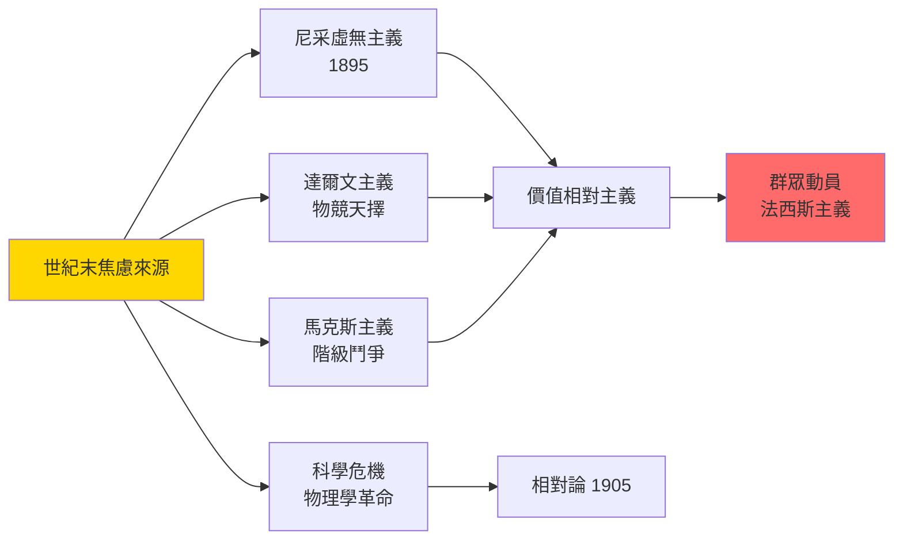
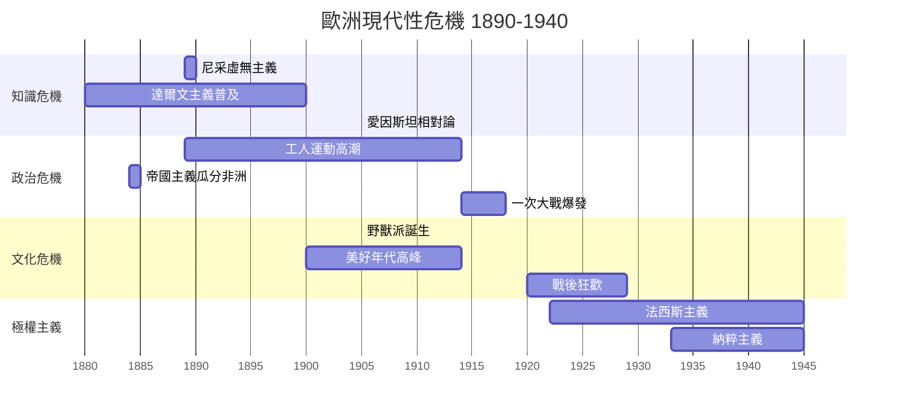
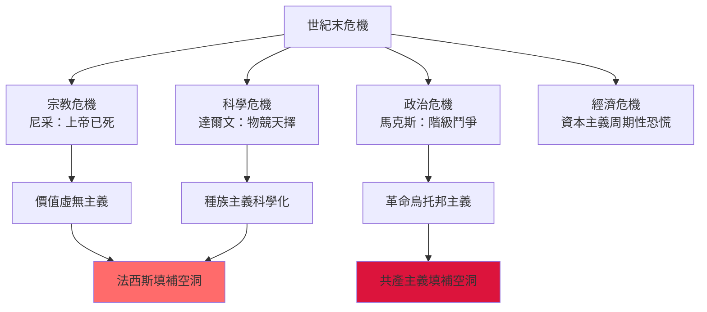

# HIST2063 歐洲與現代性 / Europe and Modernity: Cultures and Identities, 1890-1940

**Instructor**: Nicole Vaughan
**Department**: History, HKU
**Official source**: [HKU History Course Description 2024-25](https://history.hku.hk/wp-content/uploads/2024/07/HIST-2425.pdf)
**Style**: 袁騰飛式 — 犀利分析歐洲文明點解可以創造最輝煌文化、然後發動最野蠻戰爭

---

## 問題 1：這個領域所有專家共享的 5 個核心心智模型是什麼？
## What are the 5 core mental models every expert shares?

### 心智模型 1：「世紀末」情緒——現代性焦慮嘅文化根源
**Fin-de-Siècle Anxiety: Cultural Roots of Modernity Crisis**

學者 **Leonard Woolf**（*Imagining the Twentieth Century*, 2013）指出：1890-1914 年歐洲文化界籠罩住一種深刻危機感——達爾文主義、尼采虛無主義、馬克斯主義，三種思潮合流，令歐洲知識分子質疑一切傳統價值。學者 **Carl Schorske**（哥倫比亞，*Fin-de-Siècle Vienna*, 1980）追踪呢種焦慮點解轉化為政治行動。

- **1889** 尼采《反基督》出版，宣布「上帝已死」——歐洲精神危機象徵
- **1895** 弗洛伊德《歇斯底里研究》——理性主義時代終結，心理學時代開始
- **1900** 巴黎世博會同 World Fair——「美好年代」（Belle Époque）高潮，繁榮背後隱藏階級衝突
- **1905** 愛因斯坦相對論——牛頓機械宇宙觀崩塌，時間同空間變得相對

### 心智模型 2：「群眾」嘅出現——大眾政治同法西斯主義
**The Rise of "The Masses" — Mass Politics and Fascism**

學者 **Hannah Arendt**（*The Origins of Totalitarianism*, 1951）分析群眾政治如何區別於傳統階級政治——群眾唔係有組織嘅階級，而係原子化個體，容易被魅力型領袖動員。學者 **Mark Mazower**（哥倫比亞，*Dark Continent*, 1998）指出：民主喺歐洲從來都唔係牢固，而係一場實驗。

- **1917** 俄國革命，布爾什維克動員工人、農民、士兵——群眾動員嘅第一次大規模實驗
- **1922** 墨索里尼「向羅馬進軍」——歐洲第一個法西斯政權
- **1933** 希特勒當選總理——民主投票選出反民主嘅領袖
- **1936-39** 西班牙內戰——歐洲民主、法西斯、共產主義三方力量嘅最終預演

### 心智模型 3：帝國主義與種族主義嘅制度化
**Imperialism and Racialism as Institutional Practice**

學者 **Hannah Arendt** 指出：種族主義唔係歐洲文明嘅副產品，而係核心組成部分——帝國主義喺歐洲內部催生咗種族主義意識形態。學者 **Robert W. Connell**（*Southern Theory*, 2006）揭示：現代歐洲社科思想本身就係帝國主義嘅一部分。

- **1884-85** 柏林會議——歐洲列強正式瓜分非洲
- **1899-1902** 布爾戰爭——英國集中營制度，死亡 28,000 南非平民（大部分係兒童）
- **1905** 愛因斯坦提出相對論——科學理性最高峰；但同年英國通過《異族通婚法》限制殖民地臣民權利

### 心智模型 4：「美好年代」嘅雙面性——繁榮背後嘅階級衝突
**The Double Face of Belle Époque — Class Conflict behind Prosperity**

學者 **Eric Hobsbawm**（*The Age of Empire*, 1987）指出：1880-1914 年係「武裝起來嘅天使資本主義」——工業化高速增長，但工人階級待遇極差。學者 **Alfred D. Chandler**（哈佛，*The Visible Hand*, 1977）分析大企業點樣取代市場成為資源分配核心。

- **1886** 芝加哥乾草市場屠殺——美國工人運動，但反映全球工業化嘅階級矛盾
- **1889** 巴黎博覽會——凱旋門、艾菲爾鐵塔建成，法國文化頂峰象徵
- **1910** 女性選舉權運動高潮——婦女參政運動最終喺一次大戰後成功
- **1913** 史詩工廠時代——Ford T 型車生產線革命，生產效率提升但工人係機械一部分

### 心智模型 5：「認同政治」嘅興起——身份認同點解可以如此致命
**Rise of "Identity Politics" — Why Identity Can Be So Deadly**

學者 **Eric Hobsbawm**（*Age of Extremes*, 1994）指出：20 世紀係歷史上群眾動員最成功、但破壞力最大嘅世紀——群眾動員可以係民主基礎，亦可以係法西斯主義溫床。學者 **Liah Greenfeld**（哈佛，*Nationalism: Five Roads to Modernity*, 1992）分析民族主義點樣成為世紀最强大嘅政治認同力量。

- **1908** 「青年土耳其黨」運動——民族主義點燃中東現代化運動
- **1914** 塞拉耶佛暗殺——一個塞爾維亞民族主義者殺死奧匈帝國王儲，觸發第一次世界大戰
- **1938** 慕尼黑協定——綏靖政策背後係歐洲各國民族利益計算

---

## 問題 2：這個領域 3 個 SPECIFIC 根本分歧

### 分歧 1：一次大戰爆發——歐洲列強邊個責任最大？
**WWI Outbreak: Whose Fault Was the Greatest?**

- **A 方（德國責任派）**：學者 **Fritz Fischer**（*Griff nach der Weltmacht*, 1961）——德國要為一戰負責，佢哋有預謀擴張意圖；呢個論點在德國引發巨大爭議。
- **B 方（多方責任派）**：學者 **James Joll**（*The Origins of the First World War*, 1955）——沒有單一國家負責，歐洲整個安全體系失靈；各國領袖都被恐懼、被軍事動員邏輯推着走。

### 分歧 2：納粹主義——係德國例外定係歐洲普遍現象？
**Nazism — German Exception or European Universal?**

- **A 方（德國例外論）**：學者 **Ian Kershaw**（*Hitler*, 2000-08）——納粹主義係德國獨有嘅政治文化傳統同一次大戰創傷嘅結合產物。
- **B 方（普遍現象論）**：學者 **Zeev Sternhell**（*Neither Left nor Right*, 1986）——法西斯意識形態係整個歐洲文化危機嘅產物，法國、意大利、羅馬尼亞都有類似運動。

### 分歧 3：「美好年代」——係文明高峰定係虚假繁榮？
**Belle Époque — Civilizational Peak or False Prosperity?**

- **A 方（高峰論）**：學者 **Robert Darnton**（哈佛）——19世紀末歐洲文化創造力達到歷史頂峰：塞尚、梵高、德布西、普魯斯特定義咗現代文化。
- **B 方（虚假繁榮論）**：學者 **E.P. Thompson**（*The Making of the English Working Class*, 1963）——繁榮只惠及中上階級；工人階級、殖民地人民完全被排斥喺「美好年代」之外。

---

## 問題 3：10 個 PROBING 深度問題

1. 1890 年代歐洲知識分子集體陷入價值危機——尼采、達爾文、馬克斯三種思潮點解可以同時存在、互相矛盾但都影響巨大？
2. 一次大戰爆發之前，歐洲各國領袖明知戰爭代價極高，點解仍然走咗入去？係恐懼、榮譽、誤解、定係戰爭邏輯本身？
3. 布爾戰爭（1899-1902）英國集中營——呢個係大英帝國良心一刻，但點解今日英國人普遍唔知道？帝國記憶點解選擇性消失？
4. 1905 年愛因斯坦提出相對論同年，英國、愛爾蘭出現大規模土豆失收——科學萬能但民眾仍然餓死，呢個矛盾揭示咗乜嘢？
5. 德國點解可以喺一次大戰後快速恢復軍備、又在 1933 年投票選出納粹？威瑪共和國失敗嘅真正原因係乜嘢？
6. 歐洲工人運動——從馬克斯主義到社會民主主義，歐洲左翼點解最終選擇議會民主而非革命？呢個選擇點解影響咗整個20世紀？
7. 「美好年代」嘅藝術——從印象派到野獸派、抽象派，點解藝術潮流變革咁快速？係藝術家引導時代定係時代推動藝術家？
8. 歐洲女性參政權——點解西歐女性比男性遲 30-50 年先至有投票權？女性主義運動點解最終可以成功？
9. 一次大戰時嘅宣傳機器——英法德各國點解可以成功話服幾百萬人民支持一場屠殺戰爭？宣傳機器嘅運作邏輯係乜嘢？
10. 1920 年代「瘋狂年代」（Roaring Twenties）——歐洲戰後狂歡文化，呢個係對創傷嘅逃避定係人類韌性嘅表現？戰後文化同戰前文化點解可以差咁遠？

---

# 核心心智模型深化（中英對照）

## 1. 世紀末焦慮 / Fin-de-Siècle Anxiety

### 1.1 Bilingual 概念對照
- 世紀末 (shìjì mò) = Fin-de-Siècle — 19 世紀末文化危機感
- 現代性危機 (xiàndàixìng wēijī) = Crisis of Modernity — 理性主義崩潰
- 上帝已死 (shàngdì yǐ sǐ) = God is Dead — 尼采虛無主義核心

### 1.3 袁騰飛式犀利觀察
> 「尼采話『上帝已死』，但係佢忘記話你知：上帝死咗之後，邊個填補個空洞？答案係：群眾運動、極權主義、民族主義——呢啲都係新嘅上帝，而且係更危險嗰隻！」

### 1.4 Deep Test Question
**考試題**：分析「世紀末焦慮」點解喺 1890 年代歐洲特別强烈。呢種焦慮同 1914 年一次大戰爆發有乜嘢關聯？

### 1.5 圖解


---

## 2. 大眾政治 / Mass Politics

### 2.3 袁騰飛式犀利觀察
> 「群眾就係咁：原子化、恐慌、容易被感動。希特勒就係最犀利嘅群眾心理學家——佢知道群眾要乜嘢：恐懼一個敵人、承諾一個未來、然後消滅所有中間人！」

### 2.4 Deep Test Question
**考試題**：比較列寧同希特勒兩種群眾動員模式。兩者有何根本差異？點解蘇聯模式最終失敗而納粹模式短暫成功？

---

## 3. 帝國主義與種族主義 / Imperialism and Racialism

### 3.3 袁騰飛式犀利觀察
> 「歐洲人話佢哋係去『文明』落後地區——但係你知唔知，布爾戰爭嗰時，英國人喺南非建集中營，死了 28,000 個細路——呢啲細路唔係戰士，係平民！」

### 3.4 Deep Test Question
**考試題**：分析歐洲種族主義意識形態點解喺 19 世紀末達到高峰。呢個同帝國主義擴張有乜嘢邏輯關聯？

---

## 深度自測問題詳解（精簡版）

**Q1**：尼采、達爾文、馬克斯三者之所以可以共存——因為佢哋都指向同一個結論：舊秩序（宗教、傳統、貴族）正在崩潰。但係佢哋提出嘅替代方案互相衝突。

**Q2**：一次大戰爆發原因——各國領袖被「動員邏輯」（mobilization logic）困住：一旦動員軍隊，就唔可以無限期等待，否則經濟崩潰。所以即使外交仲有空間，各國仍然被迫開戰。

**Q3-Q10**：
- Q3：英國集中營被遺忘——因為大英帝國記憶工程選擇性保留光榮、忘記罪行。
- Q4：土豆失收——1905 年愛因斯坦同土豆失收同年發生，揭示科學可以解釋宇宙但仍然無法解決階級剝削。
- Q5：威瑪失敗——①德國精英從未真心接受民主；②經濟危機削弱民主合法性；③納粹善用民主程序摧毁民主。
- Q6：歐洲左翼選擇社會民主而非革命——因為1917年俄國革命示範咗暴力革命代價太大，議會道路慢慢被認為係更現實嘅選擇。
- Q7：藝術變革——因為藝術家群體本身係知識分子，先驅感受到時代焦慮並用作品表達。
- Q8：女性參政權延遲——因為男性精英恐懼女性投票會打破階級/政黨平衡；女性主義成功因為佢哋成功動員中產階級女性、並證明女性同樣愛國。
- Q9：一次大戰宣傳——各國都成功動員愛國主義、民族恐懼、「文明使命」話語； propaganda 研究今日仍然應用。
- Q10：戰後狂歡文化——係人類創傷心理嘅正常防禦機制（denial + pleasure seeking），但亦揭示創傷未真正被 processing。

---

## 5 個 Mermaid 圖解

### 圖解 1：歐洲現代性危機時間線


### 圖解 2：世紀末焦慮嘅知識來源


### 圖解 3：一次大戰爆發因果鏈


### 圖解 4：歐洲意識形態光譜 1890-1940
```mermaid
graph LR
    A["共產主義"] <-->|"歐洲政治光譜"| B["社會民主"]
    B <-->|""| C["自由民主"]
    C <-->|""| D["保守主義"]
    D <-->|""| E["法西斯主義"]
    A -->|"1917| F["俄國革命"]
    E -->|"1922| G["墨索里尼"]
    E -->|"1933| H["希特勒"]
    style A fill:#DC143C
    style E fill:#8B0000
    style F fill:#FF6B6B
    style G fill:#8B0000
    style H fill:#8B0000
```

### 圖解 5：歐洲文化藝術流派演變
```mermaid
graph TD
    A["寫實主義"] -->|"1880s"| B["印象派"]
    B -->|"1886| C["後印象派"]
    C -->|"1905| D["野獸派"]
    C -->|"1907| E["立體派"]
    D -->|"1910| F["表現主義"]
    E -->|"1913| G["未來主義"]
    G -->|"1914-18| H["戰爭藝術<br/>反美學"]
    style B fill:#90EE90
    style H fill:#FF6B6B
```

---

## 總結

**HIST2063 Europe and Modernity** 嘅核心價值：
1. **理解歐洲現代性嘅雙重性格**：創造文明高峰 + 發動文明毁滅——兩者共享同一套思想基因
2. **批判性思考**：從文化危機到政治災難，呢個邏輯链条提醒我哋：知識分子嘅虛無主義可以成為群眾動員嘅意識形態燃料
3. **跨學科整合**：哲學、科學、藝術、政治、經濟——呢五個維度共同構成現代性危機

**袁騰飛金句**：
> 「歐洲文明最犀利嘅成就——自由、科學、民主——同最黑暗嘅罪惡——種族滅絕、帝國掠奪、意識形態清洗——從來都唔係分開，而係一孖兄弟。」

---

## 延伸閱讀

1. Hobsbawm, Eric. *The Age of Empire, 1875-1914*. London: Weidenfeld & Nicolson, 1987.
2. Schorske, Carl E. *Fin-de-Siècle Vienna: Politics and Culture*. Cambridge: Cambridge University Press, 1980.
3. Arendt, Hannah. *The Origins of Totalitarianism*. New York: Schocken Books, 1951.
4. Mazower, Mark. *Dark Continent: Europe's Twentieth Century*. London: Allen Lane, 1998.
5. Mosse, George L. *The Crisis of German Ideology: Intellectual Origins of the Third Reich*. New York: Fertig, 1964.
6. Sternhell, Zeev. *Neither Left nor Right: Fascist Ideologies in France*. Princeton: Princeton University Press, 1986.
7. Joll, James. *The Origins of the First World War*. London: Longman, 1955.
8. Ferguson, Niall. *The Pity of War*. London: Allen Lane, 1998.
