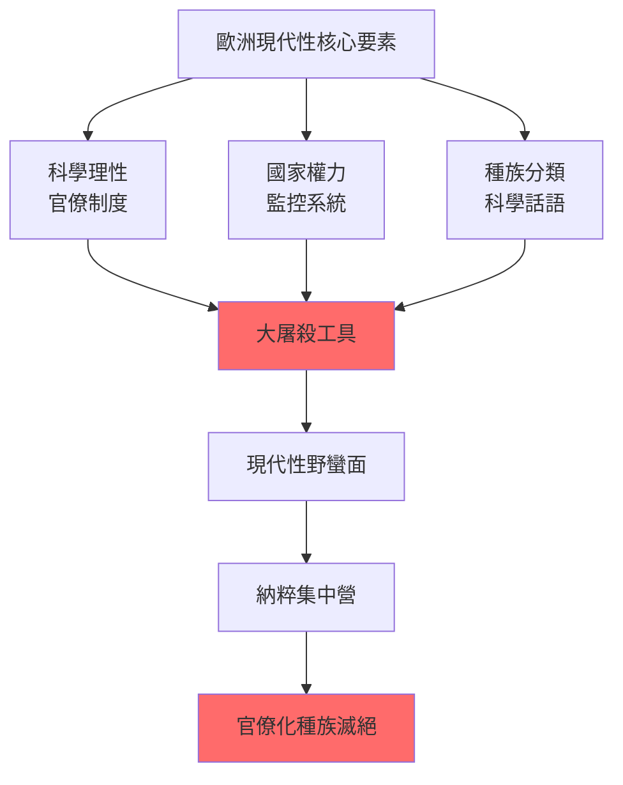
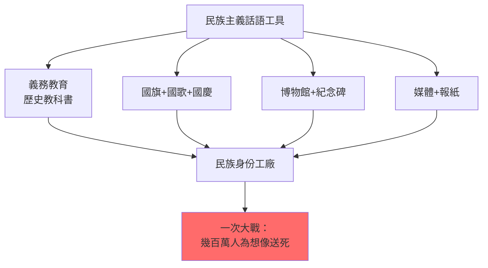
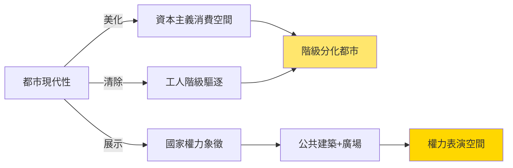
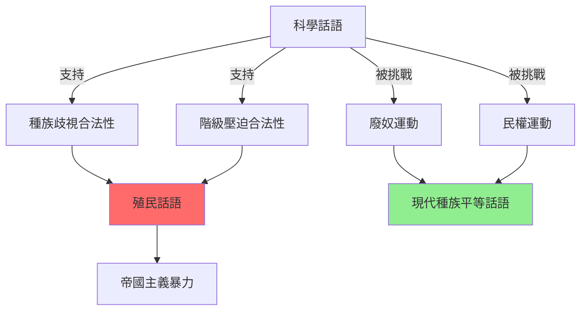
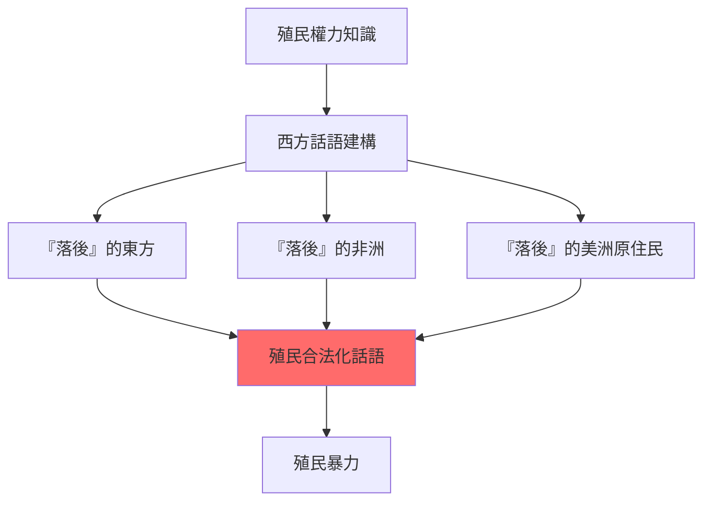
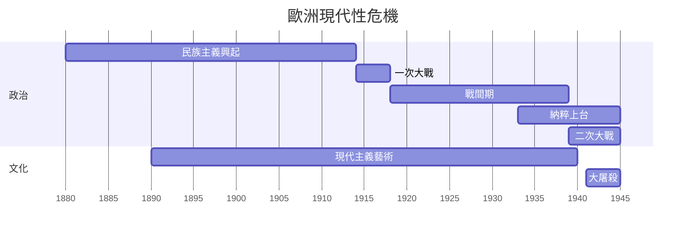
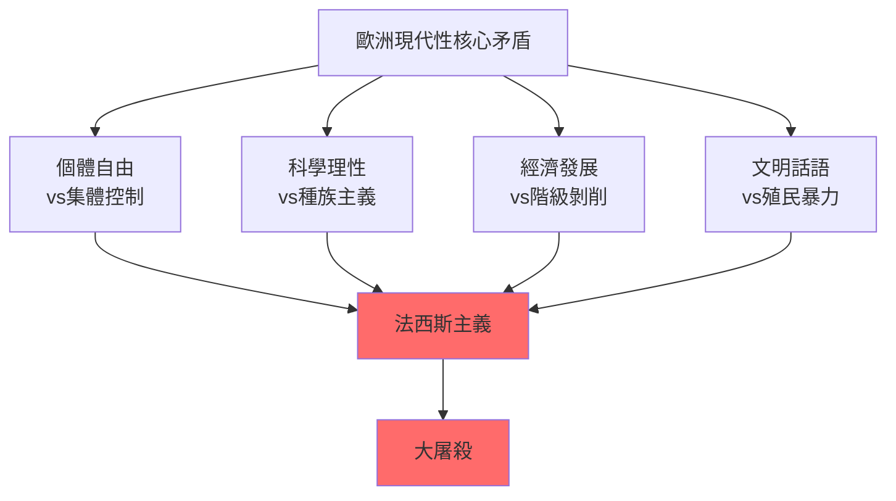
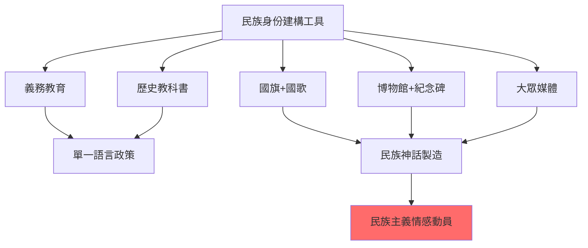
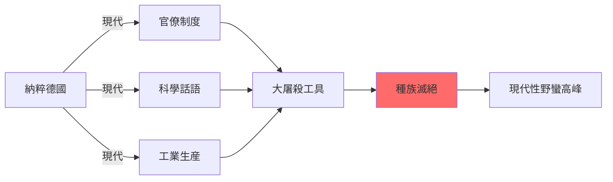
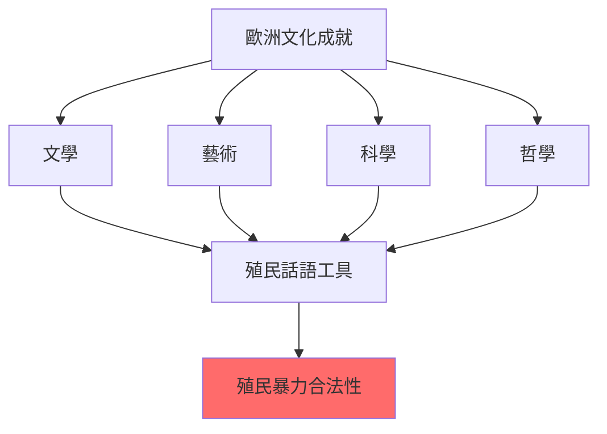

# HIST2063 歐洲與現代性 / Europe and Modernity: Cultures and Identities, 1890–1940

**Instructor**: (varies by year — see HKU course schedule)
**Department**: History, HKU
**Official source**: [HKU History Course Description 2024-25](https://history.hku.hk/wp-content/uploads/2024/07/HIST-2425.pdf)
**Style**: 袁騰飛式 — 犀利批判，聚焦歐洲點解可以同時係文明燈塔同野蠻深淵

---

## 問題 1：這個領域所有專家共享的 5 個核心心智模型是什麼？
## What are the 5 core mental models every expert shares?

### 心智模型 1：「現代性」係一場歐洲內戰
**Modernity as European Civil War, 1890–1940**

學者 **George Mosse**（威斯康辛，*The Image of Man*, 1996）指出：1890-1940年嘅歐洲，唔係從「傳統」走向「現代」，而係一場歐洲內部關於「咩係人」嘅戰爭。種族主義、科學優生學、法西斯主義——呢啲唔係「前現代」殘餘，而係「現代性」嘅親生子女。學者 **Zygmunt Bauman**（利茲，*Modernity and the Holocaust*, 1989）更加直接：大屠殺唔係現代性嘅失敗，而係現代性嘅邏輯實現。

- **1895** 居里夫人發現鐳——現代科學嘅勝利，但係同種族科學實驗並行
- **1905** 愛因斯坦相對論——物理學革命，同時歐洲各國加劇種族科學研究
- **1914-18** 第一次世界大戰——1500萬人死亡，「文明嘅歐洲」自相殘殺
- **1922** 墨索里尼上台——歐洲第一個法西斯政權，「現代性」嘅新形式
- **1933-45** 納粹德國——現代國家機器被用於系統性滅絕

### 心智模型 2：身份政治係現代性嘅核心產品
**Identity Politics as Core Product of Modernity**

學者 **Benedict Anderson**（康奈爾，*Imagined Communities*, 1983）指出：民族主義唔係「自然」嘅，而係印刷資本主義發明嘅「想像共同體」。學者 **Eric Hobsbawm**（倫敦政經學院，*Nations and Nationalism*, 1990）補充：民族主義係1880年後「發明傳統」嘅高峰——歐洲各國通過國旗、國歌、義務教育大規模製造民族身份。

- **1870s** 歐洲各國實行義務教育——國家開始控制歷史敎育
- **1885** 柏林會議——歐洲列強正式瓜分非洲，用「文明使命」掩飾掠奪
- **1908** 愛爾蘭文藝復興——民族文化運動作為英帝國內部嘅抵抗
- **1936** 柏林奧運——納粹德國用現代媒體展示「雅利安種族優越」
- **1938** 慕尼黑協議——綏靖政策揭示歐洲民主國家嘅種族歧視

### 心智模型 3：「現代都市」係現代性嘅物理形態
**The Modern City as Physical Form of Modernity**

學者 **Walter Benjamin**（法蘭克福學派，*The Arcades Project*, 1938/1982）分析巴黎拱廊——都市建築作為「資本主義夢境」嘅物理形式。學者 **David Harvey**（牛津，*Paris, Capital of Modernity*, 2003）補充：都市規劃從來唔係中性嘅，而係階級控制同種族隔離嘅工具。

- **1853-70** 奧斯曼男爵改造巴黎——清除貧民窟同時驅逐工人階級
- **1889** 巴黎世博會——艾菲爾鐵塔作為工業現代性嘅全球標誌
- **1900** 巴黎地鐵開通——現代都市流動性嘅象徵
- **1929** 大都會——Fritz Lang 嘅反烏托邦電影預言現代都市嘅異化
- **1937** 巴黎世界博覽會——決定人類命運嘅「藝術與技術」展覽

### 心智模型 4：科學主義同種族主義嘅共生關係
**Symbiosis of Scientism and Racism**

學者 **Stephen Jay Gould**（哈佛，*The Mismeasure of Man*, 1981）揭露：19-20世紀嘅「科學種族主義」——用錯誤嘅智商測量、顱骨測量——支撐歐洲帝國主義。學者 **Robert N. Proctor**（賓州州立，*Racial Hygiene*, 1988）分析：納粹德國嘅種族衛生政策唔係科學失敗，而係科學家主動參與嘅種族滅絕。

- **1859** 達爾文《物種起源》——科學革命，但被濫用支持種族主義
- **1883** 高爾登「優生學」概念——用統計學「科學地」支持種族歧視
- **1900** 孟德爾遺傳學重新發現——被納粹扭曲為種族純化嘅「科學基礎」
- **1924** 美國移民法——用「科學」理由限制南歐、東歐移民
- **1933** 納粹德國《遺傳病後代防治法》——現代國家用科學話語實行優生絕育

### 心智模型 5：「文明使命」係帝國主義嘅意識形態掩護
**"Civilizing Mission" as Ideological Cover for Imperialism**

學者 **Edward Said**（哥倫比亞，*Culture and Imperialism*, 1993）延伸佢嘅後殖民理論——歐洲文化（文學、藝術、學術）唔係喺帝國主義「之外」，而係帝國主義嘅核心意識形態武器。學者 **Gyan Prakash**（普林斯頓）提出：第三世界嘅「現代性」焦慮，正係歐洲帝國主義文化霸權嘅最深層遺產。

- **1884-85** 柏林會議——歐洲正式瓜分非洲，確立「有效佔領」原則
- **1899** 海牙公約——歐洲「文明國家」試圖規範戰爭，但排除殖民地戰爭
- **1916** 阿拉伯起義——英國以「阿拉伯自由」為名、實際分割中東
- **1931** 國際聯盟——歐洲「文明國家」俱樂部，拒絕承認亞洲國家平等地位

---

## 問題 2：這個領域 3 個 SPECIFIC 根本分歧

### 分歧 1：現代性係歐洲「發明」定係歐洲「壟斷」？
**Modernity: European Invention or European Monopoly?**

- **A 方（歐洲起源論）**：學者 **Marshall Berman**（*All That is Solid Melts into Air*, 1982）——現代性係從歐洲開始嘅全球性經驗，佢嘅核心矛盾（個體自由 vs 集體異化）適用於所有社會
- **B 方（批判派）**：學者 **Dipesh Chakrabarty**（芝加哥，*Provincializing Europe*, 2000）——「歐洲現代性」被錯誤地等同於普世現代性；亞洲、拉美有自己嘅現代性道路

### 分歧 2：納粹主義係「德國病」定係「歐洲現代性」嘅極端版？
**Nazism: German Pathology or Extreme Version of European Modernity?**

- **A 方（例外論）**：學者 **Ian Kershaw**（牛津，*Hitler*, 2000）——納粹主義係德國特殊歷史條件（一次大戰失敗、凡爾賽條約、經濟危機）嘅產物
- **B 方（結構論）**：學者 **Zygmunt Bauman**——大屠殺係現代性嘅邏輯實現：官僚制度、科學理性、國家權力三位一體——呢啲全部都係歐洲現代性嘅核心價值

### 分歧 3：「文明使命」到底係真誠信念定係意識形態借口？
**"Civilizing Mission": Sincere Belief or Ideological Cover?**

- **A 方（共情派）**：學者 **Andrew Porter**（牛津，*Religion versus Empire*, 2004）——19世紀傳教士同殖民主義者好多係真誠相信「文明使命」嘅；呢個信念本身係道德上可理解但歷史上錯誤
- **B 方（批判派）**：學者 **Utsa Patnaik**（德里大學）——經濟數據顯示殖民剝削係真實動機，「文明使命」只係意識形態掩護

---

## 問題 3：10 個 PROBING 深度問題

1. 如果現代性同野蠻係一體兩面，咁點解我哋仲要追求現代性？有冇「唔野蠻嘅現代性」？
2. 一次大戰（1914-18）到底係歐洲文明嘅崩潰，定係歐洲文明本質嘅最終暴露？
3. 柏林猶太隔離區、納粹集中營——呢啲點解係「現代」機構？佢哋用咗乜嘢現代技術？
4. 點解達爾文進化論會被種族主義者利用？科學發現同政治濫用之間嘅界線喺邊度？
5. 法西斯主義作為「群眾現代性」——點解咁多人真心相信法西斯意識形態？呢個對今日民主政治有乜嘢警示？
6. 1920-30年代歐洲文化——現代主義藝術、超現實主義、達達主義——點解會同時出現政治極權主義？
7. 歐洲各國喺1919年建立國際聯盟，宣稱要維護世界和平——但係點解15年內就爆發二次大戰？國際主義失敗嘅根源係乜嘢？
8. 女性喺呢段時期嘅社會地位——點解歐洲各國都係1918年後先至畀女性投票權？呢個延遲揭示咗乜嘢權力結構？
9. 「歐洲文明」呢個概念點解到今日仲有咁大影響力？歐洲中心主義係點樣影響我哋對「現代性」嘅理解？
10. 如果歐洲現代性係建立喺奴隸制、殖民掠奪、同大屠殺上面，咁我哋點解仲要向歐洲學習？

---

# 核心心智模型深化（中英對照）

## 1. 現代性與野蠻共生 / Modernity and Barbarism Symbiosis

### 1.1 Bilingual 概念對照
- 現代性 (xiàndàixìng) = Modernity — 歐洲18-19世紀以來嘅社會組織形式
- 文明使命 (wénmíng shǐmìng) = Civilizing Mission — 殖民者用基督教+文化輸出美化帝國主義
- 種族科學 (zhǒngzú kēxué) = Scientific Racism — 用「科學」方法支持種族歧視
- 現代性黑暗面 = Dark Side of Modernity — 集中營、官僚滅絕、種族屠殺

### 1.2 史料與考據
- **核心史料**：納粹德國檔案（Nuremberg Trials）、帝國主義會議記錄、殖民部檔案
- **重要檔案**：柏林會議記錄（1884-85）、海牙公約談判記錄、國際聯盟會議記錄

### 1.3 袁騰飛式犀利觀察
> 「成日話歐洲係『文明燈塔』——但係你知唔知，『文明』呢個詞就係英國殖民主義者發明嘅？佢哋話你知：跟住我哋就係文明，唔跟我哋就係野蠻——然後用呢個邏輯瓜分非洲、奴役印度、屠殺美洲原住民。燈塔？係，但係照住晒你自己，唔照我。」

### 1.4 Deep Test Question
**考試題**：用 Bauman 大屠殺理論，分析納粹德國點解係「現代」政權而非「前現代」政權。

### 1.5 圖解

---

## 2. 歐洲民族主義與身份政治 / European Nationalism and Identity Politics

### 2.1 Bilingual 概念對照
- 民族主義 (mínzú zhǔyì) = Nationalism — 民族作為政治共同體嘅想像
- 種族民族主義 = Ethnic Nationalism — 以種族/血統定義嘅民族主義
- 公民民族主義 = Civic Nationalism — 以公民權利定義嘅民族主義
- 發明傳統 = Invented Tradition — Hobsbawm 概念——國家製造「古老傳統」

### 2.3 袁騰飛式犀利觀察
> 「Benedict Anderson 話民族主義係『想像共同體』——但係問題在於，想像完之後，幾百萬人可以為咗呢個想像去死。一次大戰歐洲各國嘅年輕人，幾百萬，就係為咗『民族榮譽』白白送死——你話人類係幾可笑？」

### 2.4 Deep Test Question
**考試題**：比較一次大戰前英國、法國、德國嘅民族主義話語。三者點解最終走向互相毀滅？

### 2.5 圖解

---

## 3. 歐洲都市現代性 / European Urban Modernity

### 3.1 Bilingual 概念對照
- 都市現代性 (dūshì xiàndàixìng) = Urban Modernity — 現代城市作為現代性嘅物理形態
- 拱廊 (gǒngláng) = Arcades — 19世紀巴黎玻璃幕牆商場，資本主義消費文化象徵
- 異化 (yìhuà) = Alienation — Marx 概念——人被自己創造嘅系統控制
- 都市規劃種族主義 = Urban Planning Racism — 用都市設計實行種族隔離

### 3.3 袁騰飛式犀利觀察
> 「Walter Benjamin 話巴黎拱廊係『資本主義夢境』——但係你知唔知，呢個夢境係用邊個嘅血汗建成嘅？奥斯曼男爵拆巴黎貧民窟，驅逐晒啲工人——然後我哋話呢個係『現代化』？文明嘅代價，就係工人階級被驅逐。」

### 3.4 Deep Test Question
**考試題**：比較奥斯曼改造巴黎（1853-70）同香港市區重建——兩者點解本質上係同一個都市種族主義邏輯？

### 3.5 圖解

---

## 4. 科學與種族主義 / Science and Racism

### 4.1 Bilingual 概念對照
- 科學種族主義 (kēxué zhǒngzú zhǔyì) = Scientific Racism — 用偽科學支持種族歧視
- 優生學 (yōushēngxué) = Eugenics — 高爾登提出——用遺傳學「改良人種」
- 顱骨測量學 (lúgǔ cèliàngxué) = Craniometry — 測量顱骨大小「證明」種族智力差異
- 種族衛生 = Racial Hygiene — 納粹德國「科學」種族政策

### 4.3 袁騰飛式犀利觀察
> 「你知唔知，20世紀最暢銷嘅『科學』暢銷書，唔係愛因斯坦，而係《吾之政治》（Mein Kampf）？納粹德國唔係靠蠻力上台，而係靠科學話語——佢哋話自己係『科學種族主義者』，用統計數字話你知邊個種族『優秀』。你話幾恐怖？」

### 4.4 Deep Test Question
**考試題**：Stephen Jay Gould《人的錯誤測量》揭露咗智商測試點解被種族主義者利用。呢個揭示對今日「種族科學」爭議有乜嘢意義？

### 4.5 圖解

---

## 5. 殖民帝國與歐洲文化 / Colonial Empire and European Culture

### 5.1 Bilingual 概念對照
- 帝國主義 (dìguó zhǔyì) = Imperialism — 强國控制弱國
- 後殖民主義 (hòu zhímín zhǔyì) = Postcolonialism — 分析殖民權力文化遺產
- 東方主義 (dōngfāng zhǔyì) = Orientalism — Said 理論——西方如何建構「東方」
- 歐洲中心主義 (ōuzhōu zhōngxīn zhǔyì) = Eurocentrism — 以歐洲為歷史中心嘅世界觀

### 5.3 袁騰飛式犀利觀察
> 「Edward Said 話西方文化入面有個『東方』——但係呢個『東方』唔係真實嘅東方，而係西方人幻想出嚟嘅『落後、神秘、感性』嘅東方。然後西方就用呢個幻想出嚟嘅『東方』去證明自己嘅『進步、理性、科學』。你話幾諷刺？」

### 5.4 Deep Test Question
**考試題**：Edward Said《東方主義》點解被視為20世紀最重要嘅後殖民理論？呢個理論點解到今日仲咁犀利？

### 5.5 圖解

---

## 深度自測問題詳解

**Q1**：現代性同野蠻並唔係對立面，而係一枚硬幣嘅兩面。Bauman 話大屠殺係「液態現代性」嘅極端版本——當國家權力、科學理性、官僚制度結合，就會產生前所未有嘅系統性暴力。

**Q2**：一次大戰——呢個唔係歐洲文明嘅崩潰，而係歐洲文明內在矛盾嘅總爆發。Hobsbawm 話1914-45年係「一個時代嘅終結」——歐洲世紀正式結束。

**Q3**：納粹集中營——用鐵路運人、用官僚系統記錄、用科學方法分類——呢啲全部係現代管理技術。大屠殺嘅「效率」，正係現代性嘅「成就」。

**Q4**：達爾文進化論——達爾文從來未話邊個種族「更優秀」；但係佢嘅追随者（特別係高爾登）將自然選擇扭曲為社會選擇，呢個就係「科學話語」點解可以被政治濫用。

**Q5**：法西斯主義——佢之所以吸引群眾，因為佢提供咗「宏大意義」——個人可以犧牲自己去服務國家、民族、歷史。喺一個日益原子化嘅現代社會，法西斯提供咗「歸屬感」。

**Q6-Q10**：現代主義藝術——從立體主義到達達主義——呢啲藝術運動正係對一次大戰嘅文化回應。藝術家用前衛手法挑戰傳統價值，呢個挑戰同政治極權主義喺某啲方面係並行嘅：兩者都反對自由主義個人主義。

---

## 5 個 Mermaid 圖解

### 圖解 1：歐洲世紀危機（1890-1945）

### 圖解 2：歐洲現代性核心矛盾

### 圖解 3：歐洲身份政治建構工具

### 圖解 4：納粹德國現代性矛盾

### 圖解 5：歐洲文化與帝國主義共謀

---

## 總結

**HIST2063 Europe and Modernity** 係一堂逼你面對歐洲文明黑暗面嘅課程。呢個 course 嘅核心價值：

1. **去浪漫化**：唔再將歐洲視為單純嘅「文明燈塔」，而係理解歐洲現代性係建立喺殖民暴力、階級壓迫、種族滅絕上面
2. **批判性繼承**：學習歐洲文化成就，同時批判歐洲中心主義——呢個係21世紀歷史教育嘅核心任務
3. **當代相關性**：歐洲現代性嘅矛盾——科學與種族主義、自由與法西斯主義——到今日仍然存在

**袁騰飛金句**：
> 「歐洲教我哋點解要理性——但係歐洲同時教我哋，理性可以用嚟犯下最不理性嘅罪行。」

---

## 延伸閱讀 / Further Reading

1. Hobsbawm, Eric. *The Age of Extremes: The Short Twentieth Century, 1914-1991*. London: Michael Joseph, 1994.
2. Bauman, Zygmunt. *Modernity and the Holocaust*. Cambridge: Polity, 1989.
3. Anderson, Benedict. *Imagined Communities: Reflections on the Origin and Spread of Nationalism*. London: Verso, 1983.
4. Berman, Marshall. *All That Is Solid Melts into Air: The Experience of Modernity*. New York: Simon and Schuster, 1982.
5. Said, Edward. *Culture and Imperialism*. New York: Knopf, 1993.
6. Mosse, George L. *The Image of Man: The Creation of Modern Masculinity*. New York: Oxford University Press, 1996.
7. Gould, Stephen Jay. *The Mismeasure of Man*. New York: W.W. Norton, 1981.
8. Proctor, Robert N. *Racial Hygiene: Medicine under the Nazis*. Cambridge: Harvard University Press, 1988.
