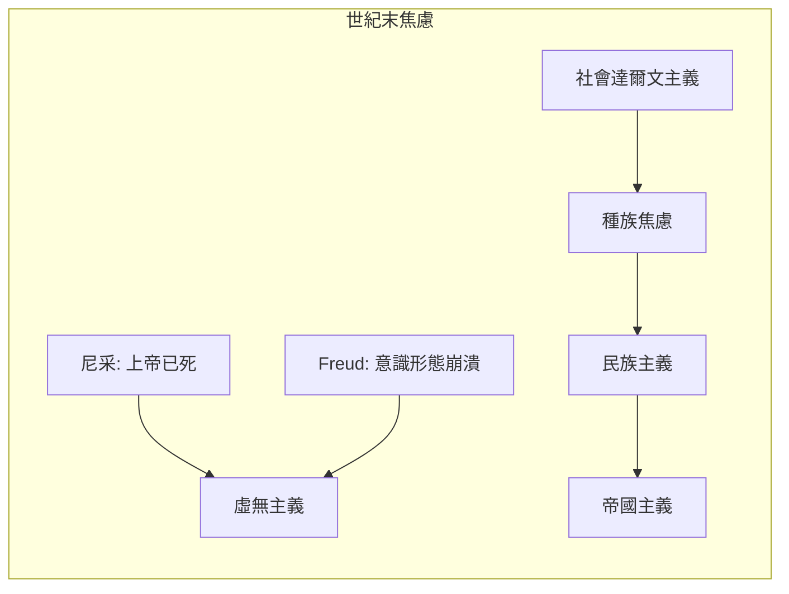
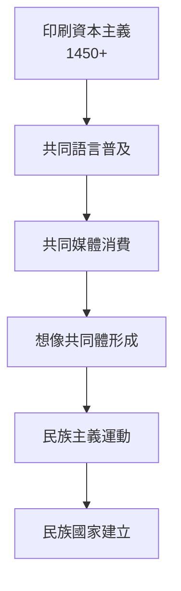
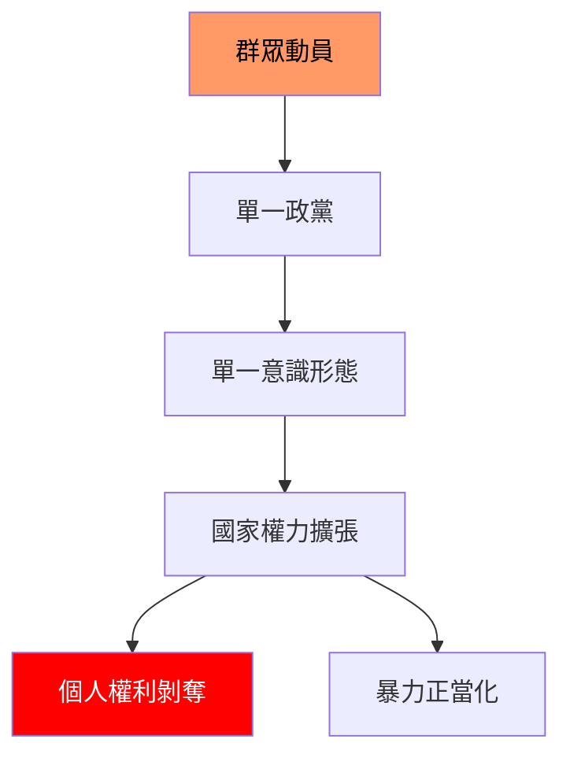
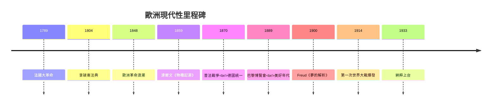
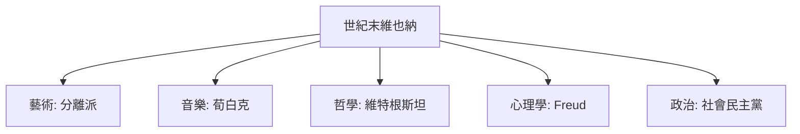
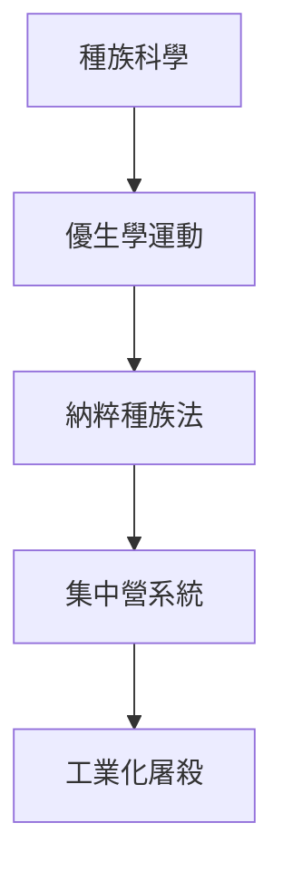
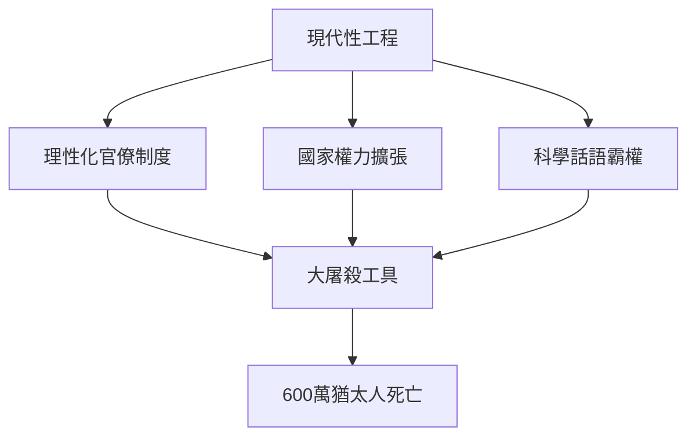
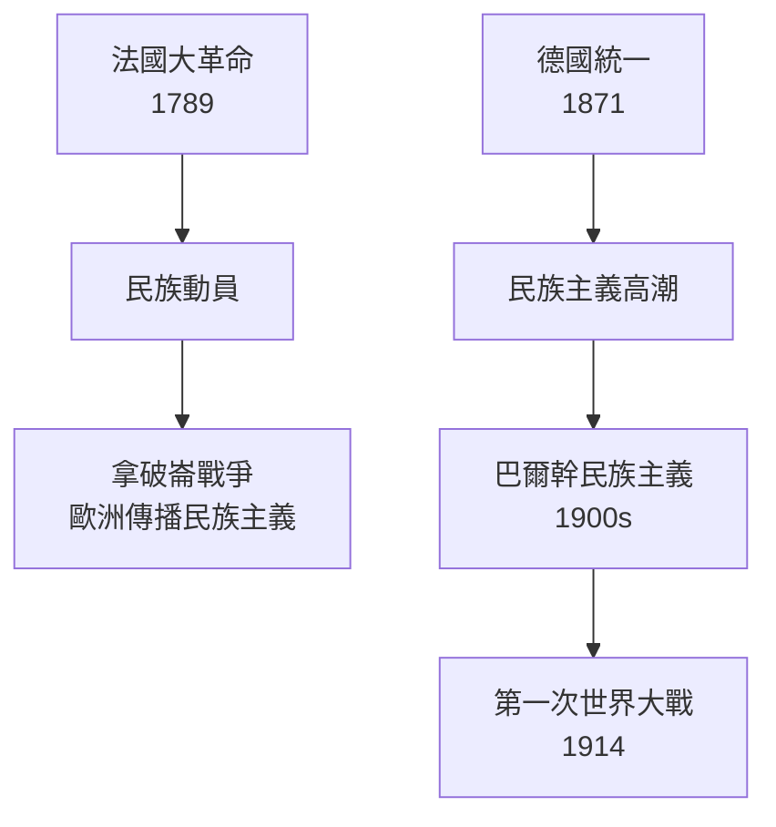

# HIST2063 歐洲與現代性 / Europe and Modernity: Cultures and Identities, 1890-1940 (6 credits)

**Instructor**: Thomas Soden
**Department**: History, HKU  
**Official source**: [HKU History Course Description 2024-25](https://history.hku.hk/wp-content/uploads/2024/07/HIST-2425.pdf)
**Style**: 袁騰飛式 — 幽默、犀利、聚焦歐洲點解塑造現代世界

---

## 問題 1：這個領域所有專家共享的 5 個核心心智模型是什麼？

### 心智模型 1：「現代性」作為文明工程
**Modernity as Civilizational Project**

學者 **Charles Taylor** (麥基爾, *Sources of the Self*, 1989) 指出：「現代性」唔係單一現象，而係一個多面向嘅文明工程——包括理性化、世俗化、個人主義、進步信念。呢個工程 19 世紀歐洲啟動，但到今日仍然未完成。

學者 **Jürgen Habermas** (法蘭克福學派) 強調：現代性係「未完成嘅工程」——理性解放承諾仍未完全兌現。

- 1889 巴黎博覽會——「美好年代」(Belle Époque) 象徵
- 1900  Freud 《夢的解析》——理性自我嘅解構
- 1914 歐洲大戰爆發——現代性嘅第一次大危機

### 心智模型 2：「世紀末」(Fin de Siècle) 文化焦慮
**Fin de Siècle Cultural Anxiety**

學者 **Carl Schorske** (哥倫比亞, *Fin-de-Siècle Vienna*, 1980) 經典研究：維也納 1890-1910 年係「世紀末」文化焦慮嘅最佳案例——藝術家、知識分子對現代性又愛又恨。

學者 ** Peter Gay** (耶魯, *Weimar Culture*, 1968) 指出：「世紀末」情緒唔只係歐洲特有，而係整個西方世界對現代性危機嘅回應。

- 1890s 尼采宣稱「上帝已死」——傳統價值觀崩潰
- 1895 王爾德因同性戀罪名被判監禁——維多利亞道德焦慮
- 1905 愛因斯坦相對論——牛頓機械宇宙觀崩塌

### 心智模型 3：民族主義作爲現代身份政治
**Nationalism as Modern Identity Politics**

學者 **Benedict Anderson** (康奈爾, *Imagined Communities*, 1983) 提出：民族唔係自然形成，而係 19 世紀印刷資本主義「想像」嘅產品。歐洲民族主義係現代性嘅核心現象。

學者 **Eric Hobsbawm** (倫敦政經學院, *Nations and Nationalism*, 1990) 指出：「發明嘅傳統」——民族習俗、國旗、國歌——都係 19 世紀末為民族國家服務而發明。

- 1882 法國確定 7 月 14 日巴士底日為國慶——歷史唔超過 100 年
- 1890s 德國「瓦格納節」(Bayreuth Festival) 建立日耳曼文化認同
- 1905 挪威從瑞典獨立——民族自決原則興起

### 心智模型 4：種族科學與帝國意識形態
**Scientific Racism and Imperial Ideology**

學者 **George Mosse** (威斯康辛, *Racism and the Origin of European Fascism*, 1978) 研究：19 世紀末種族主義唔係「迷信」，而係「科學」——當時最頂尖科學家、醫生、人類學家都支持種族等級論。

學者 **Robert Miles** (愛丁堡) 指出：「種族」呢個概念本身就係現代性產品——為帝國主義提供「科學」理據。

- 1883 Haeckel 發明「帝國主義」德語詞——自然法則應用於人類社會
- 1898 Duchenne de Boulogne 拍攝「表情」照片——建立「科學」面相學
- 1900 達爾文表弟 Francis Galton 發明「優生學」

### 心智模型 5：群眾政治與極權主義興起
**Mass Politics and the Rise of Totalitarianism**

學者 **Hannah Arendt** (普林斯頓, *The Origins of Totalitarianism*, 1951) 經典分析：20 世紀極權主義係現代性嘅黑暗面——群眾動員、國家權力擴張、意識形態政治。

學者 **Carl Schmitt** (德國法學家) 指出：現代政治核心係「敵我劃分」——呢個概念為極權主義提供理論基礎。

- 1917 俄國革命——布爾什維克群眾政黨
- 1922 意大利法西斯奪權——群眾動員政治
- 1933 希特勒上台——群眾選舉产生極權統治

---

## 問題 2：這個領域 3 個最根本的分歧點是什麼？

### 分歧 1：現代性——歐洲專利定全球現象？
**Modernity: European Invention or Global Phenomenon?**

**核心問題**: 歐洲係現代性嘅原創者定只係先行者？亞洲、拉美都有自己嘅現代性經驗嗎？

- **A 方 / Side A — 歐洲起源派**:
  - **Jürgen Habermas** (法蘭克福學派)
  - **Marshall Berman** (*All That is Solid Melts into Air*, 1982)
  - 論點：現代性項目係歐洲啟動——理性化、世俗化、個人主義——呢啲都係歐洲啟蒙運動產品
  - 證據：科學革命、工業革命、民主制度全部歐洲原創

- **B 方 / Side B — 多元現代性派**:
  - **Dipesh Chakrabarty** (*Provincializing Europe*, 2000)
  - **Shmuel Eisenstadt** (*Multiple Modernities*, 2000)
  - 論點：現代性唔係單一歐洲模式——日本、中國、印度都可以走自己嘅現代化道路
  - 證據：明治維新、土耳其凱末爾主義都係非歐洲現代性

### 分歧 2：大屠殺——歐洲文化特殊產品定普遍人性？
**The Holocaust: Unique to European Culture or Universal Human Nature?**

**核心問題**: 納粹大屠殺係歐洲文明崩潰例外事件，定人類普遍暴力傾向嘅極端表現？

- **A 方 / Side A — 歐洲特殊論**:
  - **Zygmunt Bauman** (*Modernity and the Holocaust*, 1989)
  - **Theodor Adorno** (法蘭克福學派)
  - 論點：大屠殺係現代性嘅黑暗面——理性化、官僚制度、現代國家權力——呢啲歐洲最自豪嘅嘢造成大屠殺
  - 證據：納粹屠殺係有系統、有效率嘅現代官僚制度運作

- **B 方 / Side B — 普遍人性論**:
  - **Daniel Goldhagen** (*Hitler's Willing Executioners*, 1996)
  - **Christopher Browning** (*Ordinary Men*, 1992)
  - 論點：大屠殺唔係歐洲獨有——任何群體喺特定條件下都可以犯下類似暴行
  - 證據：盧旺達種族滅絕、紅色高棉——都唔係歐洲文化

### 分歧 3：第一次世界大戰——歷史意外定結構必然？
**WWI: Historical Accident or Structural Necessity?**

**核心問題**: 1914 年大戰爆發係可以避免嘅歷史意外，定歐洲體系結構性危機嘅必然結果？

- **A 方 / Side A — 意外論**:
  - **A.J.P. Taylor** (*The Struggle for Mastery in Europe*, 1953)
  - 論點：大戰爆發係因為特定領導人嘅錯誤判斷——如果維也納冇向塞爾維亞最後通牒、如果德國冇向奧匈保證支持——大戰可以避免
  - 證據：1914 年 7 月危機 5 個禮拜內談判機會多次出現

- **B 方 / Side B — 結構必然論**:
  - **Leon Trotsky** (布爾什維克革命家)
  - **Immanuel Wallerstein** (*World-Systems Analysis*, 1974)
  - 論點：帝國主義競爭、民族主義壓力、階級衝突——歐洲體系結構性危機早就累積，大戰遲早爆發
  - 證據：1905 年摩洛哥危機、1912 年巴爾幹戰爭，已經顯示體系不穩定

---

## 問題 3：10 個 PROBING 深度問題

1. 如果維也納世紀末知識分子可以預見 1914 年大屠殺，佢哋會點樣？
2. 點解 19 世紀末歐洲人對「種族科學」咁著迷？（提示：帝國主義需要）
3. 「世紀末」焦慮同今日全球化焦慮有乜嘢相似？
4. 點解女性主義喺「美好年代」興起但同時時尚工業將女性身體商品化？
5. 如果納粹德國冇出現，歐洲會點樣走向現代性？
6. 「達爾文主義」點解可以同時支持社會主義同種族主義？
7. 比較英國、法國、德國嘅民族主義——邊個最「成功」？邊個最暴力？
8. 如果「現代性」係歐洲發明，點解歐洲自己內部對佢咁多批評？
9. 點解 1890s 欧洲 sexually obsessed 但同時超級道德主義？（提示： Victoria 時代矛盾）
10. 「現代性」作爲「未完成工程」——今日仍然未完成嗎？

---

## 核心心智模型深化（中英對照）

## 1. 現代性 (Modernity)

### 1.1 Bilingual 概念對照
| English | 中英對照 | 定義 |
|---|---|---|
| Modernity | 現代性 | 西方理性化、世俗化、個人主義 |
| Rationalization | 理性化 | 以效率、計算為基礎組織社會 |
| Secularization | 世俗化 | 宗教影響力下降 |
| Individualism | 個人主義 | 個人權利優先於集體 |
| Progress | 進步 | 歷史向更好方向發展信念 |

### 1.2 袁騰飛式犀利觀察
現代性最辛辣嘅諷刺就係：歐洲人發明「理性」然後用嚟屠殺——納粹大屠殺就係「理性」做到最有效率嘅種族滅絕。Bauman 話你知：現代性唔係大屠殺嘅對立面，而係大屠殺嘅工具。所以「現代化」唔係必然等於「文明化」。

### 1.3 圖解
```mermaid
flowchart TD
    A[啟蒙運動<br/>1750-1800] --> B[法國大革命<br/>1789]
    B --> C[浪漫主義<br/>反動]
    C --> D[工業革命<br/>理性化]
    D --> E[世紀末焦慮<br/>1890-1914]
    E --> F[第一次世界大戰<br/>1914-18]
    F --> G[極權主義<br/>20世紀
    
    style A fill:#9cf,color:#000
    style F fill:#f00,color:#fff
```

---

## 2. 世紀末文化 (Fin de Siècle)

### 2.1 圖解


---

## 3. 民族主義 (Nationalism)

### 3.1 圖解


---

## 4. 種族科學 (Scientific Racism)

### 4.1 圖解


---

## 5. 極權主義 (Totalitarianism)

### 5.1 圖解


---

## 深度自測問題詳解

## 詳解 1: 如果維也納世紀末知識分子可以預見 1914 年...

如果佢哋知道 1914 年大屠殺，佢哋會點樣？呢個問題揭示咗世紀末文化嘅矛盾：知識分子批判現代性但同時為佢服務。維也納世紀末就係最好嘅例子——Schopenhauer 話人生係苦，尼采話「重估一切價值」，Freud 話意識係幻覺——但佢哋全部都係現代學術建制一部分。

## 詳解 2: 點解「種族科學」咁流行？

因為帝國主義需要科學理據——點解我哋可以殖民其他人？因為佢哋係「低等種族」。呢個就係「知識即權力」最好嘅例子——殖民者發明種族科學，證明殖民正當。

---

## 5 個 Mermaid 圖解

## 📊 Diagram 1: 歐洲現代性時間線



## 📊 Diagram 2: 世紀末文化板塊



## 📊 Diagram 3: 大屠殺歷史背景



## 📊 Diagram 4: 現代性與大屠殺關係



## 📊 Diagram 5: 歐洲民族國家形成



---

## 總結

1. **現代性係多面向文明工程**——包括理性化、世俗化、個人主義、進步信念
2. **世紀末焦慮揭示現代性嘅黑暗面**——世紀末文化對現代性又愛又恨
3. **民族主義係現代性核心現象**——民族唔係自然，而係被「發明」嘅
4. **種族科學為帝國主義提供「科學」理據**——呢個教訓到今日仍然適用
5. **極權主義係現代性嘅黑暗面**——群眾動員+國家權力=人類最大災難

**最後辛辣總結**: 歐洲發明咗現代性，然後被自己嘅發明摧毁——兩次世界大戰、法西斯主義、大屠殺——呢個就係「文明」最諷刺嘅真相。

---
**版權所有 © HKU History Self-Study**  
**For educational purposes only**
