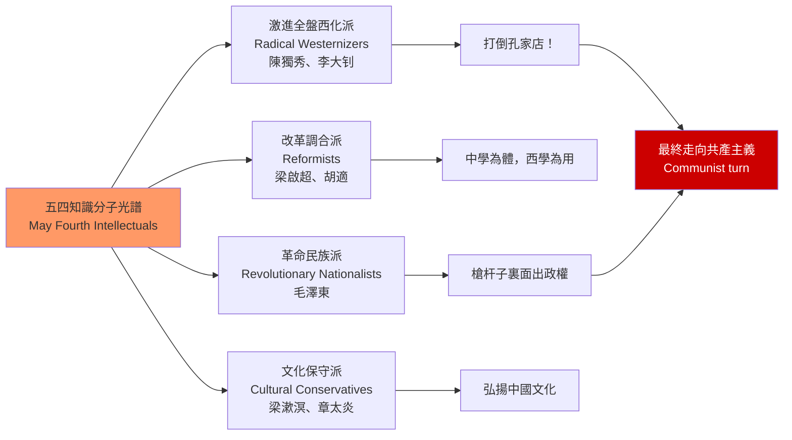
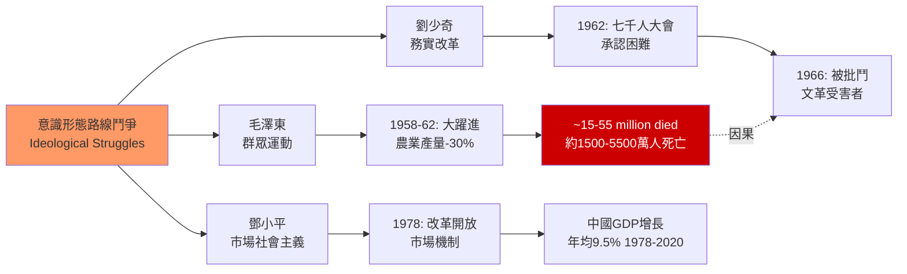
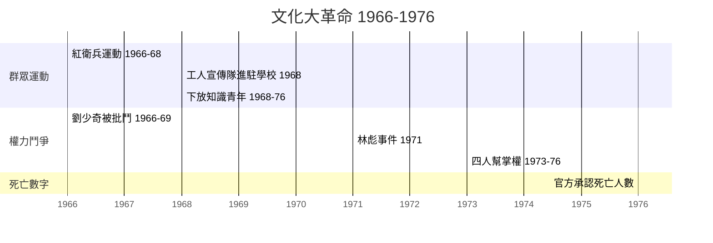
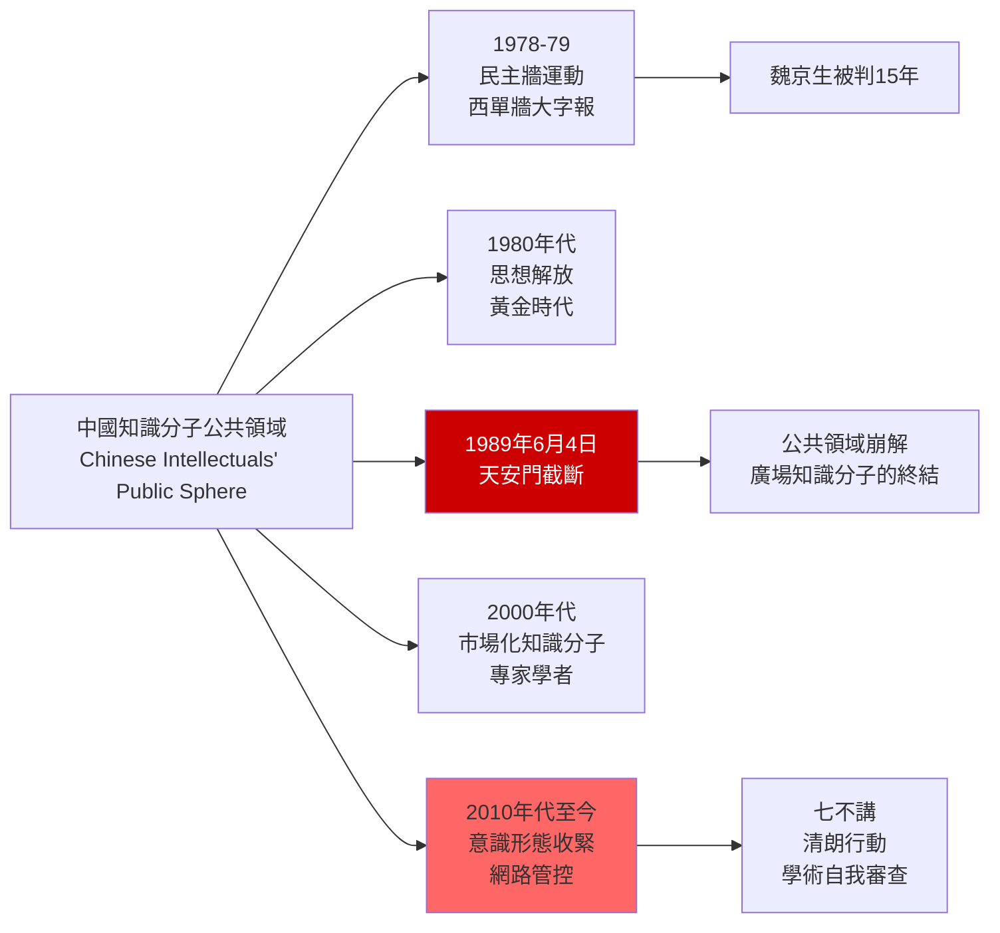

# HIST2068 — 二十世紀中國思想史 / The Intellectual History of Twentieth-Century China

/** HKU | 6 credits | Instructor: Matthew Wong Foreman */

---

## 問題 1：5 個核心心智模型

### 1. 新文化運動與「德先生」「賽先生」（May Fourth Movement: Democracy and Science）
**定義**: 1919年五四運動的核心口號是「民主」（德先生）和「科學」（賽先生）。這兩個口號在中國知識分子圈子中的定義從來沒有共識——每個人都說自己支持「民主」和「科學」，但每個人的定義都不同。這種定義的模糊性，是理解20世紀中國思想史的關鍵。

**學者**:
- **Vera Schwarcz** — *The Chinese Enlightenment: Intellectuals and the Legacy of the May Fourth Movement* (1986)
- **Chow Kai-wing — *The Rise and Fall of a Discourse* (2010)
- **Chen Duxiu** — 《新青年》(1915-1926)
- **Lu Xun** — 《狂人日記》(1918)
- **Benjamin Schwartz** — *In Search of Wealth and Power* (1964)

**驗證**: 1919年5月4日，北京3,000名學生遊行，抗議巴黎和會將德國在山東的權益轉讓給日本；這個原本是外交抗議的活動，最終成為了中國現代思想史的轉折點。

**歷史事件**:
- **1915年9月15日**: 《青年雜誌》創刊——新文化運動的起點
- **1917年1月**: 胡適在《新青年》發表《文學改良芻議》
- **1919年5月4日**: 五四運動——學生遊行，燒毀曹汝霖住宅
- **1919年6月28日**: 中國代表拒絕在《凡爾賽和約》上簽字
- **1921年7月**: 中國共產黨成立——知識分子與政治的結合

### 2. 毛澤東思想 vs 劉少奇路線——社會主義中國的意識形態鬥爭（Mao Zedong Thought vs Liu Shaoqi Line）
**定義**: 1950-1960年代，毛澤東和劉少奇對中國社會主義建設路線存在根本分歧：毛澤東主張「大躍進」（1958-1962），劉少奇主張「實事求是」的務實路線。這不是個人權力鬥爭，而是兩種不同的中國現代化想像的衝突。

**學者**:
- **Maurice Meisner** — *Mao's China and After: A History of the People's Republic* (1977, revised 1999)
- **Roderick MacFarquhar** — *The Origins of the Cultural Revolution* (1974-1997, 3 volumes)
- **Gao Gao** (與MacFarquhar合著) — *Mao's Last Revolution* (2006)
- **Stuart Schram** — *The Political Thought of Mao Tse-tung* (1969)

**驗證**: 1962年「七千人大會」——劉少奇公開承認大躍進導致了嚴重經濟困難（使用了「三分天災，七分人禍」的說法），與毛澤東的樂觀評估公開分歧。這個分歧是1966年文化大革命爆發的直接前奏。

**歷史事件**:
- **1949年10月1日**: 中華人民共和國成立
- **1958年8月**: 北戴河會議——大躍進正式啟動
- **1962年1月11日-2月7日**: 七千人大會——劉少奇與毛澤東的分歧公開化
- **1966年8月8日**: 《十六條》——文化大革命正式啟動
- **1976年9月9日**: 毛澤東去世

### 3. 文化大革命的思想起源——烏托邦主義與群眾動員（The Cultural Revolution: Utopia and Mass Mobilization）
**定義**: 1966-1976年的文化大革命是20世紀最大的群眾政治運動之一。文革不僅是政治權力鬥爭，更是中國共產黨內部對「如何繼續革命」的意識形態路線分歧。毛澤東相信：無產階級奪取政權後，仍需要不斷革命以防止「資產階級復辟」。

**學者**:
- **Roderick MacFarquhar** — *The Origins of the Cultural Revolution* (1974-1997)
- **Michael D. R. B. Fraser** — *Forked Tongue* (1970s research)
- **Wang Shaodong** — research on Maoist ideology
- **Frederick Teiwes** — research on Chinese Communist Party politics
- **Song Yongyi** — *The Cultural Revolution: A Very Short Introduction* (2017)

**驗證**: 1966年8月，毛澤東在天安門廣場8次接見紅衛兵，總人數估計超過1,200萬。紅衛兵運動席捲全國，工廠停工、學校停課、批鬥「走資派」。

**歷史事件**:
- **1966年5月16日**: 「五一六通知」——文革正式啟動
- **1966年8月**: 毛澤東在天安門廣場接見紅衛兵
- **1967年1月**: 上海「一月風暴」——造反派奪權
- **1968年7月**: 工人宣傳隊進駐學校——紅衛兵運動結束
- **1976年10月6日**: 四人幫被捕——文革結束

### 4. 改革開放與意識形態轉向——實用主義的勝利（Reform and Opening: The Triumph of Pragmatism）
**定義**: 1978年後的改革開放標誌著中國共產主義意識形態的根本轉向：從「階級鬥爭」轉向「經濟發展」。這種轉向在意識形態上的合法性基礎是「實事求是」——鄧小平以此為理論工具，繞過了意識形態障礙，推行市場改革。

**學者**:
- **Sebastian Heilmann** — *Economic Policy Experiments in China* (2019)
- **Peter Schram** — research on Deng Xiaoping
- **Sebastian Heilmann & Elizabeth Perry** — *Sinicization Under Pressure* (2021)
- **Yuen Yuen Ang** — *China's Gilded Age: The Paradox of Economic Prosperity under State Dominance* (2020)

**驗證**: 1978年12月十一屆三中全會，官方公報中首次用「實事求是」代替「階級鬥爭為綱」。這是中國共產黨意識形態史上的最重要轉向——從革命意識形態轉向發展意識形態。

**歷史事件**:
- **1978年12月18-22日**: 十一屆三中全會——改革開放路線確定
- **1979年**: 家庭聯產承包責任制開始試點
- **1980年9月**: 正式推廣家庭聯產承包責任制
- **1992年1-2月**: 鄧小平南巡——加速改革開放
- **2001年12月11日**: 中國加入世貿易組織（WTO）

### 5. 當代中國知識分子的困境——公共領域的压缩（The Predicament of Contemporary Chinese Intellectuals）
**定義**: 1980年代是中國知識分子的「黃金時代」：《人民文學》、《新華文摘》、北京「民主牆」運動，為公共討論創造了短暫的空間。1989年天安門事件後，這個公共領域迅速收縮。意識形態控制和市場化媒體的雙重壓力，改變了中國思想生產的整個生態。

**學者**:
- **Perry Link** — *An Anatomy of Chinese: Rhythm, Tone, and Language* (2013)
- **Geremie Barmé** — *China's Cultural Canon* (1993); research on Chinese intellectuals
- **Wang Hui** — *China's Indigenous Innovation* (2010s); China's Twentieth Century (2016)
- **Feng Chongyi** — research on Chinese civil society

**驗證**: 1978-1979年北京民主牆運動中，魏京生等人在西單牆上貼大字報，要求言論自由和釋放政治犯。1979年，魏京生被判處15年監獄。1989年後，民主牆運動成為歷史。

**歷史事件**:
- **1978年12月**: 北京民主牆運動——大字報在西單牆上湧現
- **1989年4月15日**: 胡耀邦去世——學生悼念活動開始
- **1989年4月15日-6月4日**: 天安門廣場抗議活動
- **1989年6月4日**: 天安門清場——知識分子公共領域的崩解
- **2000年代**: 網路公共領域的興起與收縮
- **2013年**: 「七不講」——對公共討論的新限制

---

## 問題 2：3 個根本分歧

### 分歧 1：五四——思想解放 vs 全盤西化？
**A方（解放論）**: Vera Schwarcz、Benjamin Schwartz等學者認為：五四運動是中國思想現代化的起點——它引入了民主、科學和個人主義等現代價值觀念，是中國與世界接軌的里程碑。

**B方（全盤西化批判）**: 甘陽、杜維明等學者認為：五四的「打倒傳統」傾向導致了中國文化的斷裂——這種文化虛無主義為20世紀的中國政治災難（文革）掃清了文化基礎。

**核心問題**: 五四傳統是中國走向現代的必由之路，還是導致文化斷裂的思想根源？

### 分歧 2：毛澤東——農民革命的領袖 vs 暴君？
**A方（革命領袖論）**: Stuart Schram等學者認為：毛澤東是中國農民革命的偉大領袖，他的錯誤是「好心辦壞事」——他想解放農民，但方法錯誤。

**B方（暴君論）**: 文革研究學者認為：毛澤東的錯誤不是方法問題，而是權力政治的問題——他為維護個人權力，不惜犧牲數百萬人的生命。

**核心問題**: 如何在評價歷史人物時，區分意識形態理想和權力政治的現實？

### 分歧 3：改革開放——中國特色社會主義 vs 變相資本主義？
**A方（中國特色論）**: 蕭功秦等學者認為：改革開放是中國共產黨根據中國國情的「理論創新」，是對馬克思主義的發展。

**B方（變相資本主義論）**: 吳敬璉等經濟學家認為：改革開放實際上是引進了資本主義市場機制，只是披上了「社會主義」的外衣。

**核心問題**: 「中國特色社會主義」的意識形態內核究竟是什麼？

---

## 問題 3：10 個深度問題

1. **陳獨秀 vs 梁啟超**：比較新文化運動時期陳獨秀的「全盤西化」立場和梁啟超的「中西調合」立場。這兩種知識分子路線在中國現代思想史上有什麼長期影響？誰的路線最終佔了上風？

2. **魯迅的思想轉變**：魯迅從早期的「改造國民性」（如《阿Q正傳》）到後期的「階級鬥爭文學」轉變——這種轉變在多大程度上是自願的，在多大程度上是政治壓力下的結果？

3. **大躍進的意識形態根源**：為什麼毛澤東相信「精神變物質」——群眾的主觀能動性可以超越客觀經濟規律？這種信念與中國共產革命的農民起義經驗有什麼關係？

4. **文化大革命的「繼續革命」理論**：毛澤東的文革理論——在無產階級奪取政權後，還需要繼續革命以防止「資產階級復辟」——這種理論在馬克思主義傳統中的思想根源是什麼？它與史太林主義有什麼本質差異？

5. **改革開放與毛澤東思想的矛盾**：鄧小平的「市場經濟等於資本主義」與「計劃經濟等於社會主義」的區分，如何在意識形態上為改革開放提供了合法性？這種合法性論述的脆弱性是什麼？

6. **當代中國知識分子的困境**：在意識形態控制和市場化媒體的雙重壓力下，當代中國知識分子如何保持「批判性」？他們的「批判」與1980年代知識分子的「批判」有什麼本質差異？

7. **毛澤東的農民平均主義與平等觀**：毛澤東對「平等」的理解，與西方自由主義的「機會平等」有什麼根本差異？這種「農民平均主義」如何解釋了大躍進和文革的暴力性？

8. **意識形態作為執政工具**：從毛澤東的「階級鬥爭」到習近平的「中華民族偉大復興」，中國共產黨在不同歷史時期如何調整意識形態話語以服務執政需要？

9. **思想史與政治史的關係**：中國共產黨的意識形態史，如何與中國共產黨的政治史、軍事史相互影響？思想路線的變化如何預示了政治路線的變化？

10. **「中國模式」的意識形態基礎**：中國官方宣傳的「中國特色社會主義」與「中國模式」——這種意識形態話語在全球意識形態光譜中的位置是什麼？它是對西方自由民主的替代方案，還是另一種形式的威權現代化？

---

# 核心心智模型深化（中英對照）

## 1. 新文化運動

### 1.1 Bilingual 概念對照
| 英文 | 中文 | 歷史含義 |
|---|---|---|
| May Fourth Movement | 五四運動 | 1919年學生遊行 |
| Democracy (Mr. De) | 德先生 | 民主 |
| Science (Mr. Sai) | 賽先生 | 科學 |
| New Culture Movement | 新文化運動 | 1915-1920年代 |
| Literary revolution | 文學革命 | 白話文運動 |

### 1.2 學者陣容
- **Vera Schwarcz**（韋斯理大學）: 五四研究奠基人
- **Benjamin Schwartz**（哈佛大學）: 早期中國共產主義研究
- **Chow Kai-wing**（伊利諾伊大學）: 中國思想史

### 1.3 袁騰飛式犀利觀察
> 五四運動最諷刺的地方：**它以「打倒孔家店」開始，最終卻建立了一個比孔家店更專制的思想控制體系。**

1919年的學生們高喊「民主」和「科學」，但他們從來沒有機會定義這兩個詞的真正含義。

陳獨秀說「民主」就是共產主義；胡適說「民主」是自由主義；梁啟超說「民主」是君主立憲。每一個派別都打著「民主」的旗號，但每一個派別都反對其他派別的「民主」定義。

這種「民主」的詞彙、「專制」的現實——這個矛盾，到今天也沒有解决。

### 1.4 Deep Q
**深度問題**: 五四運動對「傳統」的全盤否定，如何為20世紀的中國政治災難提供了思想土壤？這種文化虛無主義是否應該為文革負責？

---

## 2. 毛澤東思想 vs 劉少奇路線

### 2.1 Bilingual 概念對照
| 英文 | 中文 | 歷史含義 |
|---|---|---|
| Mao Zedong Thought | 毛澤東思想 | 革命意識形態 |
| Liu Shaoqi Line | 劉少奇路線 | 務實改革路線 |
| Great Leap Forward | 大躍進 | 1958-1962 |
| Seek truth from facts | 實事求是 | 鄧小平理論基礎 |

### 2.2 學者陣容
- **Maurice Meisner**（威斯康辛大學）: 中國共產主義歷史
- **Roderick MacFarquhar**（哈佛大學）: 文化大革命研究
- **Gao Gao**（倫敦大學）: 中國共產主義歷史

### 2.3 袁騰飛式犀利觀察
> 大躍進最可笑的地方：**毛澤東相信群眾的力量可以超越自然規律——他認為只要群眾足夠熱情，畝產就可以從500斤變成10000斤。**

結果是什麼？1958-1962年，農業產量下降了約30%，約1,500-5,500萬人死於飢荒（學者之間對數字有爭議）。

但毛澤東從來沒有公開承認錯誤。1962年的七千人大會上，劉少奇說了「三分天災，七分人禍」——這是對大躍進最直接的批判。毛澤東表面上接受批評，實際上懷恨在心——4年後，文革爆發，劉少奇被批鬥至死。

所以你看，大躍進的失敗不是「好心辦壞事」，而是**權力政治的代價由老百姓來承擔**。

### 2.4 Deep Q
**深度問題**: 如果沒有大躍進的失敗，毛澤東的個人權威會不會受到挑戰？劉少奇的務實路線最終會不會在中國推行市場改革（比1978年更早）？

---

## 3. 文化大革命

### 3.1 Bilingual 概念對照
| 英文 | 中文 | 歷史含義 |
|---|---|---|
| Cultural Revolution | 文化大革命 | 1966-1976 |
| Red Guards | 紅衛兵 | 青年群眾組織 |
| Struggle sessions | 批鬥會 | 公開羞辱和迫害 |
| Destroy the Four Olds | 破四舊 | 破舊思想、文化、風俗 |

### 3.2 學者陣容
- **Roderick MacFarquhar**（哈佛大學）: 文革歷史三部曲
- **Song Yongyi**（南伊利諾大學）: 文革數據庫建設
- **Frederick Teiwes**（衛斯理大學）: 中國共產黨政治

### 3.3 袁騰飛式犀利觀察
> 文化大革命最荒謬的地方：**它以「反修防修」開始，最終卻建立了一個比任何修正主義都更極端的極權制度。**

1966年，毛澤東號召紅衛兵「破四舊、立四新」——破舊思想、舊文化、舊風俗、舊習慣。結果是什麼？全國的古蹟被搗毀，書籍被焚燒，知識分子被批鬥。

北京師範大學的紅衛兵打死了校長；清華大學的紅衛兵批鬥了200多名教授和幹部。整個中國陷入了一場瘋狂的群眾運動——群眾鬥群眾，群眾鬥領導，群眾鬥群眾。

但毛澤東不讓群眾真正掌權。1968年，他派工人宣傳隊進駐學校，解散了紅衛兵——群眾運動就這樣被群眾運動的發動者親手終結了。

### 3.4 Deep Q
**深度問題**: 文化大革命對中國知識分子的迫害，如何影響了中國的科技創新能力和文化創造力？這種影響在改革開放後是否得到修復？

---

## 4. 改革開放

### 4.1 Bilingual 概念對照
| 英文 | 中文 | 歷史含義 |
|---|---|---|
| Reform and Opening | 改革開放 | 1978年後政策 |
| Socialist market economy | 社會主義市場經濟 | 江澤民1992年表述 |
| Seek truth from facts | 實事求是 | 意識形態轉向 |
| Chinese characteristics | 中國特色 | 官方意識形態話語 |

### 4.2 學者陣容
- **Sebastian Heilmann**（德國學術交流中心）: 中國政策實驗
- **Yuen Yuen Ang**（密歇根大學）: 中國官僚體制研究
- **Elizabeth Perry**（哈佛大學）: 中國政治研究

### 4.3 袁騰飛式犀利觀察
> 改革開放最諷刺的地方：**它標誌著中國共產主義意識形態的根本轉向，但這種轉向從來沒有被正式承認。**

鄧小平說「不管黑貓白貓，能捉老鼠的就是好貓」——這句話的政治智慧是什麼？它告訴你：**意識形態不重要，經濟發展才重要**。

但問題是：如果意識形態不重要，為什麼中國共產黨仍然需要馬克思主義列寧主義作為指導思想？為什麼習近平還要強調「不忘初心」？

答案很簡單：**意識形態是執政合法性的來源**。如果放棄了馬克思主義意識形態，共產黨的執政合法性就沒有了「理論基礎」。

所以你看，改革開放的意識形態邏輯是：**在行動上實行資本主義，在話語上堅持社會主義**。這種「言行不一」是理解中國政治的最佳切入點。

### 4.4 Deep Q
**深度問題**: 「中國特色社會主義」的意識形態內容在不斷變化（從鄧小平的「社會主義市場經濟」到習近平的「新時代中國特色社會主義」）——這種意識形態話語的變化如何服務執政需要？

---

## 5. 當代中國知識分子

### 5.1 Bilingual 概念對照
| 英文 | 中文 | 歷史含義 |
|---|---|---|
| Public sphere | 公共領域 | 知識分子討論空間 |
| Intellectuals | 知識分子 | 思想和文化的生产者 |
| Civic society | 公民社會 | 非政府組織和團體 |
| Social media | 社交媒體 | 新興公共領域 |

### 5.2 學者陣容
- **Perry Link**（普林斯頓大學）: 中國知識分子和語言
- **Geremie Barmé**（澳洲國立大學）: 中國文化研究
- **Wang Hui**（清華大學）: 中國思想史

### 5.3 袁騰飛式犀利觀察
> 當代中國知識分子最悲哀的地方：**他們在「有話不能說」的環境下，發明了一種新的說話方式——「高級黑」。**

「高級黑」是什麼意思？用看似正面、讚美的語言，傳達實際上是批評或諷刺的內容。例如，稱某位官員為「好領導」，實際上是暗示這位官員比其他官員更糟糕。

這種語言技巧的發明，本身就揭示了中國言論環境的悲哀：**當知識分子不能直接說話時，他們只能用隱喻和暗語。**

但這種「高級黑」的問題是：它可以被任意解讀。你說的「好」是真心讚美還是高級黑？只有你自己知道。

### 5.4 Deep Q
**深度問題**: 在意識形態控制日益加強的環境下（2013年「七不講」、2021年「清朗」行動等），中國知識分子還能扮演什麼公共角色？這種角色與毛澤東時代的知識分子角色有何本質差異？

---

## 深度自測問題詳解

**Q1**: 陳獨秀vs梁啟超——陳獨秀的「全盤西化」立場認為中國傳統文化是中國落後的根本原因，需要徹底否定；梁啟超的「中西調合」立場認為可以在吸收西方科技的同時保留中國文化傳統。兩種路線的長期影響：陳獨秀的路線最終與共產主義結合，導致了對傳統文化的系統性破壞；梁啟超的路線影響了東亞儒學圈（如杜維明、陳來等學者）的文化保守主義取向。

**Q2**: 魯迅的思想轉變——早期魯迅（如《狂人日記》、《阿Q正傳》）批判中國人的「國民性」；後期魯迅越來越多地使用階級分析的語言。轉變的原因包括：(1) 1920年代中國共產主義運動的興起提供了新的思想框架；(2) 魯迅與左翼知識分子的交往；(3) 對國民黨統治失望後對左翼政治的靠近。

**Q3**: 大躍進意識形態根源——毛澤東的「精神變物質」信念來自多個來源：(1) 中國農民起義的經驗（農民群眾的力量推翻了舊王朝）；(2) 史太林主義群眾動員模式；(3) 毛澤東個人對中國傳統「人定勝天」思想的吸收；(4) 對蘇聯專家的不信任（認為蘇聯專家過於保守）。

**Q4**: 繼續革命理論——毛澤東的「繼續革命」理論來源於：(1) 列寧的無產階級專政理論；(2) 史太林「社會主義在一國勝利」理論；(3) 毛澤東對中國歷史上的「農民起義循環」的理解。與史太林主義的差異：毛澤東強調群眾運動和高層政治鬥爭，史太林更強調官僚機構和計劃經濟。

**Q5**: 改革開放意識形態合法性——鄧小平的「社會主義市場經濟」區分了「計劃經濟」和「市場經濟」的政治性質：計劃經濟不等於社會主義（蘇聯失敗了），市場經濟不等於資本主義（新加坡、台灣成功了）。這種論述允許中國引入市場機制，同時保持共產黨的政治領導。

**Q6**: 當代知識分子困境——1980年代知識分子追求的是「思想解放」，要在意識形態上挑戰馬克思主義的正統解釋；2010年代知識分子更多轉向「專業化」，在經濟學、社會學等領域進行技術性研究，回避根本性的意識形態問題。

**Q7**: 農民平均主義——毛澤東對「平等」的理解是「結果平等」而非「機會平等」；他相信群眾的「主觀能動性」可以超越客觀條件的限制。這種信念與中國農民歷史上對「均貧富」的渴望相呼應，也解釋了為什麼大躍進和文革中會出現「強制平均」的現象。

**Q8**: 意識形態話語調整——從毛澤東的「階級鬥爭」（階級鬥爭為綱）到鄧小平的「經濟建設」（經濟建設為中心）到習近平的「中華民族偉大復興」（民族主義話語），中國共產黨的意識形態話語經歷了多次根本調整，每次調整都服務於執政需要。

**Q9**: 思想史與政治史關係——思想路線的變化往往預示政治路線的變化：1962年劉少奇提出「實事求是」，1966年文革爆發；1978年「實事求是」重新成為官方意識形態，隨後改革開放正式啟動；1989年意識形態多元化被鎮壓，1992年鄧小平南巡確定了市場改革方向。

**Q10**: 中國模式意識形態——中國特色社會主義在全球意識形態光譜中的位置：它既不是傳統的共產主義，也不是西方式的自由民主，而是一種「國家主導的市場經濟+一黨專政」的混合模式。

---

## 5 個 Mermaid 圖解

### 圖解 1：五四知識分子光譜


### 圖解 2：毛澤東時代意識形態路線鬥爭


### 圖解 3：文化大革命時間線


### 圖解 4：意識形態轉向的時間線
```mermaid
gantt
    title 中國共產黨意識形態轉向 1949-2023
    dateFormat YYYY
    axisFormat %Y
    
    section 毛澤東時代
    階級鬥爭為綱 :active1, 1949, 29年
    
    section 改革開放
    實事求是 :active2, 1978, 14年
    社會主義市場經濟 :active3, 1992, 15年
    
    section 新時代
    新時代中國特色社會主義 :active4, 2017, 2030年
    
    style active4 fill:#f90
```

### 圖解 5：中國知識分子公共領域的收縮


---

# 總結

1. **五四的真正遺產不是「民主與科學」這兩個口號，而是關於這兩個口號的無盡爭論**：每個時代的中國知識分子都在重新定義「民主」和「科學」的含義，以服務於自己的政治需要。這種定義的模糊性，是理解20世紀中國思想史的關鍵。

2. **毛澤東思想的「農民平均主義」與馬克思主義的歐洲淵源存在根本張力**：毛澤東對中國農民革命潛力的信任，與經典馬克思主義對工人的信任，存在著不可調和的理論矛盾——這種矛盾在大躍進的失敗中得到了最極端的驗證。

3. **改革開放的意識形態合法性來自於「實事求是」而非西方自由主義**：這使得中國可以在不引進西方政治制度的條件下，引入市場經濟——這種「意識形態工具箱」的靈活運用，是中國共產黨執政韌性的關鍵。

4. **天安門事件是中國思想史的結構性斷裂**：1989年之後，知識分子公共領域的崩解，改變了中國思想生產的整個生態——從「廣場上的知識分子」變成了「書房裏的專家學者」。

5. **中國特色社會主義的意識形態建構仍在進行中**：從毛澤東的「階級鬥爭」到習近平的「中華民族偉大復興」，中國共產黨的意識形態話語經歷了多次根本轉向——這種持續的意識形態建構，本身就是中國現代思想史的核心內容。

**自學建議**: 配合 Vera Schwarcz 的 *The Chinese Enlightenment* + Maurice Meisner 的 *Mao's China and After*，輸出讀書筆記到 `06_Reading_Notes/`。
