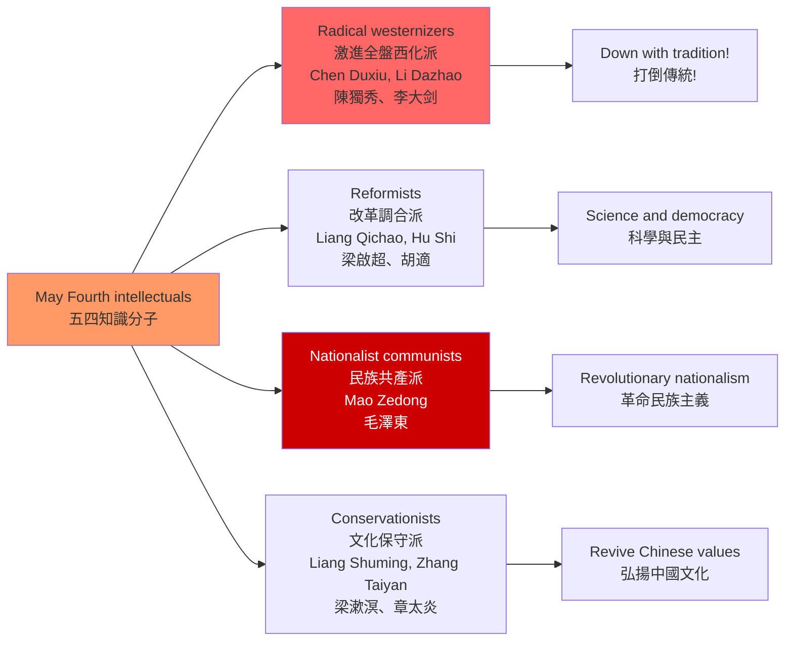
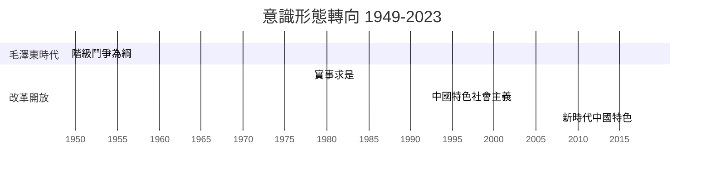
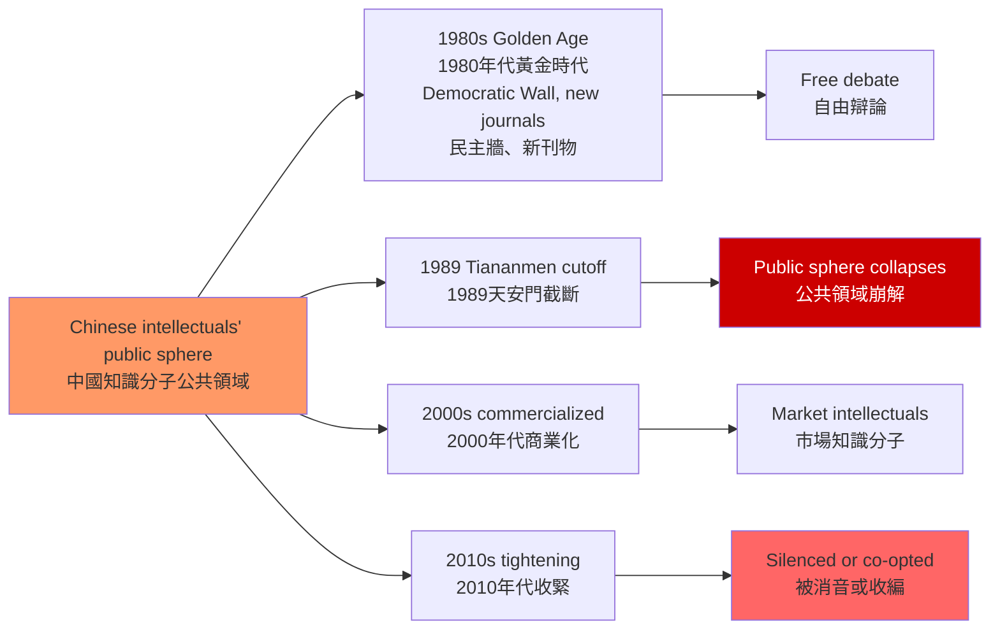

# HIST2068 二十世紀中國思想史 / Intellectual History of Twentieth Century China

**Instructor**: HKU History Staff
**Department**: History, HKU
**Official source**: [HKU History Course Description](https://history.hku.hk/ug_cd/)
**Style**: 袁騰飛式 — 犀利、聚焦中國知識分子的掙扎——從五四到文革，誰的思想改變了中國？

---

## 問題 1：5 個核心心智模型

### 1. 新文化運動與「德先生」「賽先生」（May Fourth and Mr. Democracy, Mr. Science）
1919 年五四運動的核心口號是「民主」（Democracy）和「科學」（Science）。學者 **Vera Schwarcz** 在 *The Chinese Enlightenment* (1986) 中揭示：這兩個口號在中國知識分子圈子中的定義，從來沒有共識——每個人都說自己支持「民主」和「科學」，但每個人的定義都不同。

- **典型學者**: **Vera Schwarcz** — *The Chinese Enlightenment* (1986); **Chen Duxiu** — 《新青年》; **Lu Xun** — 《狂人日記》(1918)
- **驗證案例**: 1919 年 5 月 4 日：北京 3,000 名學生遊行，抗議巴黎和會將德國在山東的權益轉讓給日本；這個原本是外交抗議的活動，最終成為了中國現代思想史的轉折點

### 2. 毛澤東思想 vs 劉少奇路線——社會主義中國的意識形態鬥爭
1950-1960 年代，毛澤東和劉少奇對中國社會主義建設路線存在根本分歧：毛澤東主張「大躍進」（1958-1962），劉少奇主張「實事求是」。學者 **Maurice Meisner** 和 **Gao Gao** 研究：這不是個人權力鬥爭，而是兩種不同的中國現代化想像的衝突。

- **典型學者**: **Maurice Meisner** — *Mao's China and After* (1977); **Gao Gao** — *Mao's Last Revolution* (2006)
- **驗證案例**: 1962 年「七千人大會」：劉少奇公開承認大躍進導致了嚴重經濟困難，與毛澤東的樂觀評估公開分歧——這是 1966 年文化大革命爆發的直接前奏

### 3. 文化大革命的思想起源——烏托邦主義與群眾動員
1966-1976 年的文化大革命是 20 世紀最大的群眾政治運動之一。學者 **Michael D. R. B. Fraser** 和 **Wang Shaodong** 研究：文革不僅是政治權力鬥爭，更是中國共產黨內部對「如何繼續革命」的意識形態路線分歧。

- **典型學者**: **Roderick MacFarquhar** — *The Origins of the Cultural Revolution* (1974-1997, 3 volumes); **Wang Shaodong** — research on Maoist ideology
- **驗證案例**: 1966 年 8 月 8 日：「炮打司令部——我的一張大字報」——毛澤東親自發動文革，直接點名劉少奇和鄧小平為「資產階級司令部」

### 4. 改革開放與意識形態轉向——實用主義的勝利
1978 年後的改革開放標誌著中國共產主義意識形態的根本轉向：從「階級鬥爭」轉向「經濟發展」。學者 **Peter Schram** 和 **Sebastian Heilmann** 研究：這種轉向在意識形態上的合法性基礎是「實事求是」——鄧小平以此為理論工具，繞過了意識形態障礙，推行市場改革。

- **典型學者**: **Sebastian Heilmann** — *Economic Policy Experiments in China* (2019); **Peter Schram** — research on Deng Xiaoping
- **驗證案例**: 1978 年 12 月十一屆三中全會：官方公報中首次用「實事求是」代替「階級鬥爭為綱」——這是中國共產黨意識形態史上的最重要轉向

### 5. 當代中國知識分子的困境——公共領域的压缩
1980 年代是中國知識分子的「黃金時代」：《人民文學》、《新華文摘》、北京「民主牆」運動，為公共討論創造了短暫的空間。1989 年天安門事件後，這個公共領域迅速收缩。學者 **Perry Link** 研究這種「壓縮」對當代中國知識分子的影響。

- **典型學者**: **Perry Link** — *An Anatomy of Chinese: Rhythm, Tone, and Language* (2013); **Geremie Barmé** — research on Chinese intellectuals

---

## 問題 2：3 個根本分歧

### 分歧 1：五四——思想解放 vs 全盤西化？
### 分歧 2：毛澤東——農民革命的領袖 vs 暴君？
### 分歧 3：改革開放——中國特色社會主義 vs 變相資本主義？

---

## 問題 3：10 個深度問題

1. **陳獨秀 vs 梁啟超**：比較新文化運動時期陳獨秀的「全盤西化」立場和梁啟超的「中西調合」立場。這兩種知識分子路線在中國現代思想史上有什麼長期影響？
2. **魯迅的思想轉變**：魯迅從早期的「改造國民性」（如《阿Q正傳》）到後期的「階級鬥爭文學」轉變——這種轉變在多大程度上是自願的，在多大程度上是政治壓力下的結果？
3. **大躍進的意識形態根源**：為什麼毛澤東相信「精神變物質」——群眾的主觀能動性可以超越客觀經濟規律？這種信念與中國共產革命的農民起義經驗有什麼關係？
4. **文化大革命的「繼續革命」理論**：毛澤東的文革理論——在無產階級奪取政權後，還需要繼續革命以防止「資產階級復辟」——這種理論在馬克思主義傳統中的思想根源是什麼？
5. **改革開放與毛澤東思想的矛盾**：鄧小平的「市場經濟等於資本主義」與「計劃經濟等於社會主義」的區分，如何在意識形態上為改革開放提供了合法性？這種合法性論述的脆弱性是什麼？
6. **余秋雨與當代中國知識分子**：在意識形態控制和市場化媒體的雙重壓力下，當代中國知識分子如何保持「批判性」？他們的「批判」與 1980 年代知識分子的「批判」有什麼本質差異？
7. **毛澤東的農民平均主義與平等觀**：毛澤東對「平等」的理解，與西方自由主義的「機會平等」有什麼根本差異？這種「農民平均主義」如何解釋了大躍進和文革的暴力性？
8. **意識形態作為執政工具**：從毛澤東的「階級鬥爭」到習近平的「中華民族偉大復興」，中國共產黨在不同歷史時期如何調整意識形態話語以服務執政需要？
9. **思想史與政治史的關係**：中國共產黨的意識形態史，如何與中國共產黨的政治史、軍事史相互影響？思想路線的變化如何預示了政治路線的變化？
10. **「中國模式」的意識形態基礎**：中國官方宣傳的「中國特色社會主義」與「中國模式」——這種意識形態話語在全球意識形態光譜中的位置是什麼？它是對西方自由民主的替代方案，還是另一種形式的威權現代化？

---

# 核心心智模型深化（中英對照）

## 1. 新文化運動

### 1.1 圖解：五四知識分子光譜


---

## 2. 毛澤東思想 vs 劉少奇路線

### 2.1 圖解：建國後意識形態路線鬥爭
```mermaid
graph LR
    A[Mao Zedong Thought vs Liu Shaoqi Line<br/>毛澤東思想 vs 劉少奇路線] --> B[Mao: People's Communes<br/>毛澤東：人民公社<br/>Mass mobilization<br/>群眾運動]
    A --> C[Liu: Family farming<br/>劉少奇：家庭農業<br/>Pragmatic reform<br/>務實改革]
    A --> D[Deng: Market socialism<br/>鄧小平：市場社會主義<br/>"Seek truth from facts"<br/>實事求是]
    
    B --> B1[Great Leap Forward 1958<br/>大躍進 1958]
    C --> C1["White cat, black cat"<br/>不管黑貓白貓<br/>1962 restoration]
    D --> D1[Reform and Opening 1978<br/>改革開放 1978]
    
    B1 -.->|Disaster| E[60 million deaths<br/>6000萬人死亡]
    
    style A fill:#f96
    style E fill:#c00,color:#fff
```

---

## 3. 文化大革命

### 3.1 圖解：文革的思想起源
```mermaid
graph TD
    A[Cultural Revolution 1966-1976<br/>文化大革命 1966-1976] --> B[Ideological roots<br/>思想根源<br/>"Continuing revolution"<br/>繼續革命理論]
    A --> C[Immediate trigger<br/>直接導火線<br/>1965-1966 film debate<br/>1965-66電影批判]
    
    B --> B1[Proletarian cultural revolution<br/>無產階級文化革命<br/>vs "bourgeois司令部"]
    C --> C2[Yu Hanwu play criticism<br/>評新編歷史劇<海瑞罷官>]
    
    B1 --> D[Red Guards movement<br/>紅衛兵運動<br/>Youth mobilization<br/>青年動員]
    C2 --> D
    
    D --> E[Mass persecution<br/>群眾迫害]
    D --> F[Power struggles<br/>權力鬥爭]
    
    style A fill:#f96
    style E fill:#c00,color:#fff
```

---

## 4. 改革開放

### 4.1 圖解：意識形態轉向的時間線


---

## 5. 當代中國知識分子

### 5.1 圖解：知識分子公共領域的收縮


---

# 總結

1. **五四的真正遺產不是「民主與科學」這兩個口號，而是關於這兩個口號的無盡爭論**：每個時代的中國知識分子都在重新定義「民主」和「科學」的含義，以服務於自己的政治需要。

2. **毛澤東思想的「農民平均主義」與馬克思主義的歐洲淵源存在根本張力**：毛澤東對中國農民革命潛力的信任，與經典馬克思主義對工人的信任，存在著不可調和的理論矛盾。

3. **改革開放的意識形態合法性來自於「實事求是」而非西方自由主義**：這使得中國可以在不引進西方政治制度的條件下，引入市場經濟——這種「意識形態工具箱」的靈活運用，是中國共產黨執政韌性的關鍵。

4. **天安門事件是中國思想史的結構性斷裂**：1989 年之後，知識分子公共領域的崩解，改變了中國思想生產的整個生態——從「廣場上的知識分子」變成了「書房裏的專家學者」。

5. **中國特色社會主義的意識形態建構仍在進行中**：從毛澤東的「階級鬥爭」到習近平的「中華民族偉大復興」，中國共產黨的意識形態話語經歷了多次根本轉向——這種持續的意識形態建構，本身就是中國現代思想史的核心內容。

**自學建議**: 配合 Vera Schwarcz 的 *The Chinese Enlightenment* + Maurice Meisner 的 *Mao's China and After*，輸出讀書筆記到 `06_Reading_Notes/`。
