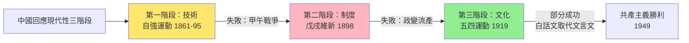
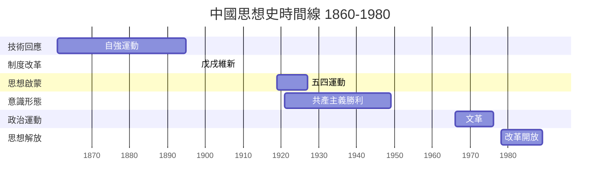
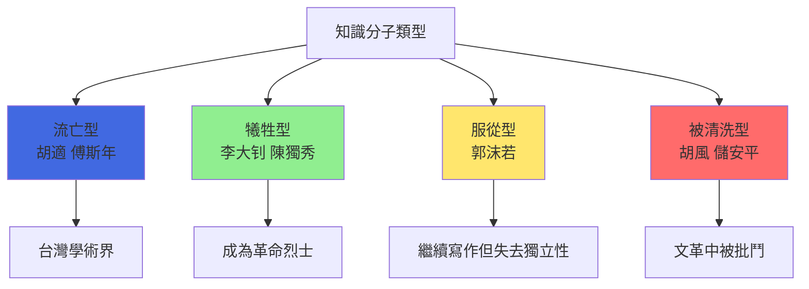

# HIST2068 二十世紀中國思想史 / The Intellectual History of Twentieth-Century China

**Instructor**: (Varies by year)
**Department**: History, HKU
**Official source**: [HKU History Course Description 2024-25](https://history.hku.hk/wp-content/uploads/2024/07/HIST-2425.pdf)
**Style**: research-based — 犀利分析中國知識分子點解咁鍾意爭論、然後幾乎每次都走上街頭

---

## 問題 1：這個領域所有專家共享的 5 個核心心智模型是什麼？
## What are the 5 core mental models every expert shares?

### 心智模型 1：「師夷長技以制夷」——中國回應現代性嘅三階段
**"Learn Foreign Techniques to Control Foreigners" — Three Stages of Chinese Response to Modernity**

學者 **Benjamin Schwartz**（哈佛，*In Search of Wealth and Power*, 1964）系統分析中國回應西方衝擊嘅思想演變：從自強運動（1860s）到維新運動（1898）到五四運動（1919），中國知識分子不斷重新定義「中學」同「西學」嘅關係。

- **1861-1895** 自強運動：洋務派「師夷長技以制夷」——學習西方技術，保留中國制度
- **1898** 戊戌維新：康有為、梁啟超主張全面制度改革——失敗後康有為流亡，梁啟超逃亡日本
- **1919** 五四運動：「德先生」（民主）+「賽先生」（科學）——陳獨秀、胡適成為領袖

### 心智模型 2：「漢字不死、中國必亡」——五四知識分子嘅文化革命
**"Without the Death of Chinese Characters, China Will Die" — May Fourth Intellectuals' Cultural Revolution**

學者 **Lin Yü-sheng**（林毓生，*The Crisis of Chinese Consciousness*, 1979）提出「整體性反傳統主義」（totalistic anti-traditionalism）——五四知識分子因為對傳統文化失望，傾向全盤否定中國傳統。學者 **Vera Schwarcz**（*The Chinese Enlightenment*, 1986）分析五四時期嘅「時間觀」——知識分子相信歷史直線進步。

- **1917** 胡適《文學改良芻議》：反對文言文，提倡白話文
- **1918** 魯迅《狂人日記》：中國歷史「滿本都寫着『吃人』二字」——文化批判嘅最高潮
- **1920** 白話文正式取代文言文成為教育語言

### 心智模型 3：自由主義 vs 馬克思主義——中國知識分子嘅意識形態選擇
**Liberalism vs Marxism — Chinese Intellectuals' Ideological Choice**

學者 **Gao Wen**（高華，*Red Dust*, 2005）同 **Arif Dirlik**（杜克，*The Origins of Chinese Communism*, 1989）分析：中國知識分子之所以最終選擇共產主義，唔係因為佢哋傻，而係因為自由主義喺中國歷史語境入面缺乏群眾基礎——知識分子想要嘅「民主」，農民想要嘅係「土地」。

- **1919** 五四時期：自由主義（胡適）、無政府主義（區聲白）、馬克思主義（李大钊）三派並存
- **1921** 中共成立：13 個代表，最後只有毛澤東、董必武兩個人見證1949年勝利
- **1949** 自由主義知識分子大逃亡：胡適、傅斯年走咗去台灣

### 心智模型 4：「救亡壓倒啟蒙」——愛國主義嘅優先性
**"Salvation Over Enlightenment" — Nationalism as Priority**

學者 **Lin Yü-sheng** 指出：中國知識分子之所以最終放棄自由主義、擁抱共產主義，因為佢哋認為「救亡」（抵抗外敵）先於「啟蒙」（思想解放）。學者 **Zhang Guoguang**（張博樹）進一步分析：呢個選擇令中國知識分子犠牲咗民主化嘅可能性。

- **1931** 九一八事變：日本佔領東北，民族危機令所有意識形態爭論讓位於抗日
- **1937-45** 抗戰時期：國共第二次合作，共產主義同民族主義完全結合
- **1949** 毛澤東宣布「中國人民站起來了」——民族尊嚴恢復比民主自由更重要

### 心智模型 5：「知行合一」——思想史研究的方法論
**"Unity of Knowledge and Action" — Methodology in Intellectual History**

學者 **Yu Ying-shih**（余英時，*The Liberal Tradition in China*, 1980）指出：中國思想史研究必須關注思想家嘅社會語境，而唔係只研究文本本身。學者 **Peter Zarrow**（*China's Late Confucian Crisis*, 2012）則分析：1919 年後嘅中國，「行動」逐漸取代「思想」成為判斷真理嘅標準。

---

## 問題 2：這個領域 3 個 SPECIFIC 根本分歧

### 分歧 1：「全盤西化」定係「中學為體、西學為用」？
**"Total Westernization" vs "Chinese Learning as Substance, Western Learning for Application"**

- **A 方（全盤西化派）**：學者 **胡適**（*主張今晚就實行全面西化*）——中國文化必須徹底改造；**陳獨秀**——封建文化係中國落後根源，必須鏟除
- **B 方（文化保守派）**：學者 **梁漱溟**（*中國哲學與世界未來*, 1921）——中國文化有自己嘅宇宙觀，唔需要照抄西方；**杜維明**（哈佛）——儒家傳統係東亞現代化嘅文化資源

### 分歧 2：毛澤東思想——中國共產主義成功關鍵定係最大悲劇？
**Mao Zedong Thought — Key to Communist Success or Greatest Tragedy?**

- **A 方（正面評價）**：學者 **Stuart R. Schram**（倫敦政治經濟學院）——毛澤東動員咗幾千年來被壓迫嘅農民；土地改革係中國現代化基礎
- **B 方（批判評價）**：學者 **Gao Wen**（高華）——毛澤東以意識形態之名屠殺大量無辜群眾；大躍進導致 1500-4500 萬人死亡（Penelope Peltenburg 估計）

### 分歧 3：五四運動——思想解放定係政治動員嘅起點？
**May Fourth Movement — Intellectual Liberation or Beginning of Political Mobilization?**

- **A 方（知識史觀）**：學者 **Vera Schwarcz**——五四係中國近代最重要嘅思想啟蒙運動，令中國知識分子第一次系統接觸西方現代思想
- **B 方（政治史觀）**：學者 **Chow Kai-wing**（周佳榮）——五四被政黨利用，成為共產主義動員群眾嘅意識形態工具；知識啟蒙從此讓位於政治動員

---

## 問題 3：10 個 PROBING 深度問題

1. 梁啟超喺 1902 年提出「新民說」——點解佢認為中國人嘅「國民性」係落後根源？呢個論點同魯迅嘅「國民性批判」有乜嘢關係？
2. 五四時期知識分子陳獨秀、胡適、李大钊——三個人最後點解走上完全唔同嘅道路？呢個揭示咗乜嘢關於意識形態同個人命運？
3. 「問題與主義」之爭（1919）：胡適主張多研究問題、少談主義——點解李大钊反對？呢個爭論點解影響咗中國共產主義運動方向？
4. 點解中國知識分子最終選擇共產主義而唔係自由主義？係歷史條件問題、文化因素問題、定係蘇聯成功示範問題？
5. 魯迅作品——《阿Q正傳》（1921）——點解呢個角色到今日仍然被認為係「中國國民性」嘅諷刺象徵？呢個角色係精確批評判斷定係西方偏见？
6. 1930 年代「新月派」同「左聯」之爭——自由主義知識分子同共產主義知識分子點解最終無法合作？邊個要為呢個分裂負責？
7. 中國共產主義知識分子——從李大钊到陳獨秀到毛澤東——點解愈嚟愈重視農民、愈嚟愈輕視工人？呢個轉變揭示咗乜嘢？
8. 「實踐是檢驗真理的唯一標準」——1978 年真理標準大討論——點解呢個討論發生喺 1978 年而唔係 1949 年？呢個揭示咗中國共產主義內部乜嘢矛盾？
9. 後毛澤東時代中國知識分子——從「河殤」（1988）到「新儒學」（1990s）——點解有人完全否定中國文化、有人重新弘揚儒學？呢個轉變点解重要？
10. 如果你係1919年五四時期嘅知識分子，你會選擇邊條路——胡適嘅自由主義、李大钊嘅共產主義、定係梁漱溟嘅文化保守主義？點解？

---

# 核心心智模型深化（中英對照）

## 1. 中國回應現代性三階段 / Three Stages of Chinese Response to Modernity

### 1.1 Bilingual 概念對照
- 自強運動 (zìqiáng yùndòng) = Self-Strengthening Movement — 1860s
- 戊戌維新 (wùxū wéixīn) = Hundred Days' Reform — 1898
- 五四運動 (wǔsì yùndòng) = May Fourth Movement — 1919
- 全盤西化 (quánpán xīhuà) = Total Westernization
- 中學為體、西學為用 (zhōngxué wéi tǐ, xīxué wéi yòng) = Chinese Learning as Substance, Western Learning for Application

### 1.3 犀利觀察
> 「自強運動話要師夷長技，結果係：學西方技術建立咗北洋艦隊，然後喺甲午戰爭（1894-95）全部被日本摧毀！所以話，技術可以學，但係制度唔改，學幾多都係嘥氣！」

### 1.4 Deep Test Question
**考試題**：比較自強運動（1861-1895）、戊戌維新（1898）、五四運動（1919）三個時期中國知識分子回應西方衝擊嘅策略。點解前兩者失敗，但五四嘅文化批判對後世影響咁深遠？

### 1.5 圖解


---

## 2. 漢字革命與文化批判 / Chinese Character Revolution

### 2.3 犀利觀察
> 「魯迅話中國歷史滿本都係『吃人』——但係你知唔知，魯迅自己都係被共產黨利用咗幾十年！佢死咗之後，毛澤東話魯迅係『文化革命的聖人』——但係如果魯迅知道共產黨後來點解知識分子，佢肯定會再寫一篇《吃人的政黨》！」

### 2.4 Deep Test Question
**考試題**：分析五四時期「白話文運動」嘅歷史意義。呢個運動成功廢除文言文，但係點解有人批評話呢個運動同時摧毁咗中國古典文化傳承？

---

## 3. 意識形態選擇 / Ideological Choice

### 3.3 犀利觀察
> 「歷史就係咁：你以為係你自己揀，但係其實係歷史幫你揀！1919 年知識分子個個以為自己選擇咗某種主義，但係 1949 年結局話你知——群眾揀咗有槍嗰個！」

### 3.4 Deep Test Question
**考試題**：比較五四時期三大意識形態（自由主義、無政府主義、共產主義）喺中國傳播嘅社會基礎。點解最終係共產主義動員咗最大群眾？

---

## 4. 救亡壓倒啟蒙 / Salvation over Enlightenment

### 4.4 Deep Test Question
**考試題**：引用具體歷史事件（1931年九一八、1937年抗戰爆發），說明「救亡」點解可以压倒「啟蒙」。呢個優先順序對中國現代化進程有乜嘢長遠影響？

---

## 深度自測問題詳解

**Q1**：梁啟超嘅「新民說」認為中國人缺乏公共精神、公民意識——呢個論點喺當時有幾革命性？魯迅延續呢個方向但更激進——兩者都認為「國民性」係中國落後根源。

**Q2**：三個人不同結局——胡適走咗去台灣成為學者領袖、李大钊1927年被張作霖絞死、毛澤東建立新中國並最終成為獨裁者。呢個揭示意識形態選擇最終由權力結構決定，而非知識論證。

**Q3**：胡適主張多研究問題——因為佢相信逐步改革；李大钊反對——因為佢認為唔先推翻舊制度，任何具體問題解決都係治標不治本。呢個分歧代表左/右翼知識分子永久分裂。

**Q4-Q10** 精簡版：
- Q4：共產主義之所以勝——因為佢提供農民最想要嘅嘢（土地改革），而自由主義只係知識分子嘅浪漫。
- Q5：阿Q——佢代表一種「精神勝利法」，呢個性格特徵被魯迅認為係中國落後文化嘅核心；但係亦有學者批評呢個係西方殖民者视角嘅內化。
- Q6：1930 年代新月派 vs 左聯——共產黨將文藝完全工具化為政治服務，令自由派知識分子最終被排擠。
- Q7：農民優先轉變——因為中共發現農民人口佔 80%+，工人階級太細；呢個係務實政治計算。
- Q8：1978 年真理標準討論——因為毛澤東死咗，「兩個凡是」唔再具有合法性；經濟改革需要意識形態上釋放空間。
- Q9：河殤 vs 新儒學——代表中國知識分子兩種截然不同嘅身份認同方向：否定傳統 vs 肯定傳統。
- Q10（開放題）：每條路都有代價——自由主義需要群眾基礎、共產主義需要群眾動員、文化保守主義需要制度創新；歷史冇如果。

---

## 5 個 Mermaid 圖解

### 圖解 1：中國知識分子思想流派光譜
```mermaid
graph LR
    A["共產主義"] <-->|"兩極光譜"| B["無政府主義"]
    B <-->|""| C["激進民主"]
    C <-->|""| D["自由主義"]
    D <-->|""| E["文化保守主義"]
    E <-->|""| F["傳統主義"]
    A -->|"李大钊"| G["中共1921"]
    D -->|"胡適"| H["台灣自由派"]
    E -->|"梁漱溟| I["新儒家1980s"]
    style A fill:#DC143C
    style G fill:#DC143C
    style D fill:#4169E1
    style E fill:#FFD700
```

### 圖解 2：五四時期意識形態競合
```mermaid
graph TD
    A["五四時期知識分子"] --> B["共產主義<br/>李大钊 + 陳獨秀"]
    A --> C["自由主義<br/>胡適 + 丁文江"]
    A --> D["無政府主義<br/>區聲白 + 蔡元培"]
    A --> E["文化保守主義<br/>梁漱溟 + 章士釗"]
    B -->|"1921"| F["中共成立"]
    C -->|"1949| G["流亡台灣"]
    D -->|"1927| H["被國共雙方排擠"]
    E -->|"1949| I["被中共批判"]
    style B fill:#DC143C
    style C fill:#4169E1
    style G fill:#4169E1
```

### 圖解 3：中國思想史時間線


### 圖解 4：中國回應西方思想流派
```mermaid
graph TD
    A["西方衝擊"] --> B["保守派：中學為體"]
    A --> C["改革派：西學為用"]
    A --> D["激進派：全盤西化"]
    B --> B1["梁漱溟<br/>文化保守主義"]
    C --> C1["胡適<br/>自由主義"]
    C1 -->|"失敗| C2["台灣民主化"]
    D --> D1["陳獨秀<br/>共產主義"]
    D1 -->|"勝利| D2["PRC成立"]
    style B fill:#FFD700
    style C fill:#4169E1
    style D fill:#DC143C
```

### 圖解 5：中國知識分子命運


---

## 總結

**HIST2068 The Intellectual History of Twentieth-Century China** 嘅核心價值：
1. **理解中國共產主義嘅思想根源**——共產主義唔係外來强加，而係中國知識分子根據自己歷史語境作出嘅選擇
2. **批判性思考**——意識形態選擇有代价，歷史研究嘅任務係揭露呢啲代价
3. **知識分子責任**——梁啟超、胡適、魯迅、陳獨秀——每一個選擇都改變咗中國歷史方向

**research-based金句**：
> 「中國知識分子最大嘅悲劇——就係佢哋太有理想，以為可以用思想改變世界；但係世界改變思想，而唔係思想改變世界。」

---

## 延伸閱讀

1. Lin Yü-sheng (林毓生). *The Crisis of Chinese Consciousness: Cultural Antiquarianism in the May Fourth Era*. Ithaca: Cornell University Press, 1979.
2. Schwartz, Benjamin I. *In Search of Wealth and Power: Yen Fu and the West*. Cambridge: Harvard University Press, 1964.
3. Chow, Kai-wing. *The Rise and Fall of a "Cylinder": The Chinese Encounter with Western Historiography*. Berkeley: University of California Press, 2007.
4. Dirlik, Arif. *The Origins of Chinese Communism*. New York: Oxford University Press, 1989.
5. Schwarcz, Vera. *The Chinese Enlightenment: Intellectuals and the Legacy of the May Fourth Movement of 1919*. Berkeley: University of California Press, 1986.
6. Lee, Leo Ou-fan (李歐梵). *Voicing the Modern Past: The Chinese Intellectuals*. New York: Routledge, 2003.
7. Goldblatt, Howard, ed. *Modern Chinese Literature and Social Movement*. Stanford: Stanford University Press, 1990.
8. Yu Ying-shih (余英時). *Chinese Intellectuals and the Republic*. Cambridge: Harvard University Press, 2010.
