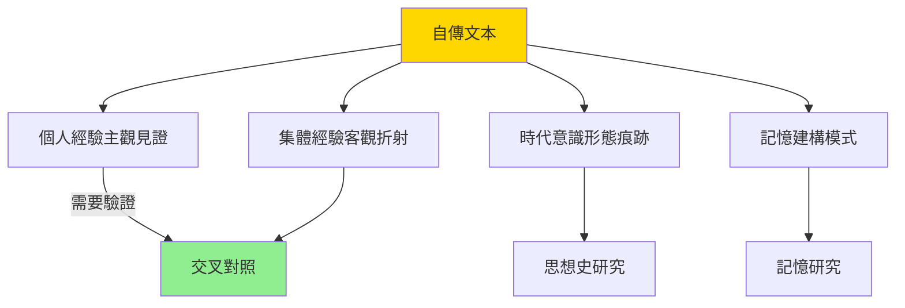
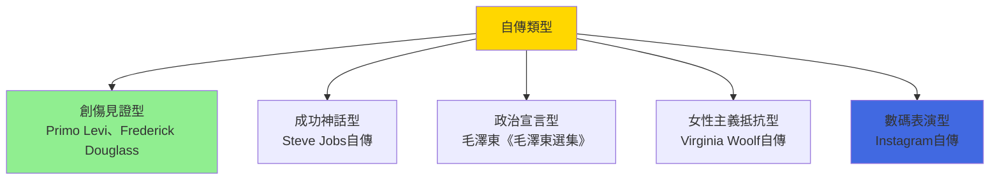

# HIST2070 自傳中的歷史 / Stories of Self: History through Autobiography

**Instructor**: Staci Ford
**Department**: History, HKU
**Official source**: [HKU History Course Description 2024-25](https://history.hku.hk/wp-content/uploads/2024/07/HIST-2425.pdf)
**Style**: 袁騰飛式 — 犀利揭穿：自傳係「真相」定係「自我神話」？歷史學家用乜方法拆穿？

---

## 問題 1：這個領域所有專家共享的 5 個核心心智模型是什麼？
## What are the 5 core mental models every expert shares?

### 心智模型 1：自傳係「記憶建構」而非「事實記錄」
**Autobiography as "Memory Construction" not "Fact Recording"**

學者 **Philippe Lejeune**（法國，*On Autobiography*, 1989）首創自傳理論——自傳係一種「契約」：作者承諾講自己嘅「真相」。但學者 **Sidonie Smith & Julia Watson**（*Reading Autobiography*, 2001）尖銳指出：呢個「真相」係經過記憶選擇性處理、意識形態框架塑造、個人品牌構建三層加工。

- 自傳敘事時間線永遠係倒序：由老年回望青年——呢個結構本身已經扭曲記憶
- 記憶唔係錄音機，而係「重寫」過程：每次回憶都改變記憶內容
- 自我形象永遠係「建構」而非「發現」

### 心智模型 2：「說故事的人」——主體性嘅表演性
**"The Storyteller" — The Performativity of Subjectivity**

學者 **Paul John Eakin**（*How Our Lives Become Stories*, 1999）提出：我哋用自傳形式理解自己人生——呢個過程本身就係「主體性表演」（performativity of selfhood）。學者 **Gayatri Chakravorty Spivak** 指出：自傳作者永遠係權力關係中嘅發言者——邊個可以自傳、誰的故事被聽見，本身就係政治問題。

- 自傳作者永遠處於特定社會位置：階級、性別、種族、國族——呢啲位置影響佢點解釋自己生命
- 自傳係「授權發言」（speaking from a position of authority）——有能力寫自傳本身就係一種特權
- 被殖民者、女性、少數族裔自傳之所以重要——因為佢哋衝破主流敘事霸權

### 心智模型 3：「傷痕敘事」——創傷如何被敘事化
**"Trauma Narrative" — How Trauma Becomes a Story**

學者 **Cathy Caruth**（*Unclaimed Experience*, 1996）分析創傷記憶嘅特殊性質——創傷記憶係「無法完全象徵化」（unassimilated）嘅經驗，所以自傳中對創傷嘅敘事本身就係一種治療同建構。學者 **Shoshana Felman** 指出：創傷敘事永遠處於「再現」（representation）同「不可再現」（unrepresentable）之間。

- 大屠殺見證者自傳：Primo Levi *If This Is a Man*（1947）
- 奴隸制見證自傳：Frederick Douglass *Narrative of the Life of Frederick Douglass*（1845）
- 文化大革命創傷：Yang Jiang *Six Chapters of a Cadre's Life*（1980）

### 心智模型 4：自傳作為「歷史文獻」——局限與價值
**Autobiography as Historical Source — Limits and Values**

學者 **Geoffrey Cubitt**（*History and Memory*, 2007）指出：自傳唔係歷史事實，但係歷史意識形態、記憶、情感嘅重要史料。學者 **Anna Bosch** 分析：即使自傳細節唔準確，佢仍然揭示咗作者所屬時代嘅「可說性框架」（sayability framework）。

- 自傳可以補充官方檔案唔會記載嘅「底層經驗」
- 但自傳嘅階級視角往往決定咗佢「記住」同「遺忘」乜嘢
- 自傳研究需要結合社會史、文化史、個人心理史

### 心智模型 5：數碼時代自傳——社交媒體嘅自我品牌
**Autobiography in Digital Age — Self-Branding on Social Media**

學者 **Jean Burgess**（*Selfie*, 2021）指出：數碼時代自傳形式根本改變——Instagram、TikTok、YouTube 將自傳表演推向極致。學者 **Alice Marwick** 分析：社交媒體自傳係一種「壓縮自我品牌」——用幾張圖片、幾句 caption 表達整個人生故事。

---

## 問題 2：這個領域 3 個 SPECIFIC 根本分歧

### 分歧 1：自傳記憶——係可靠歷史來源定係主觀幻覺？
**Autobiographical Memory — Reliable Source or Subjective Illusion?**

- **A 方（記憶可靠性派）**：認知心理學研究顯示長期記憶有一定準確性；而且自傳記憶往往被他人記錄、檔案材料交叉驗證，可以成為可靠歷史來源。
- **B 方（記憶建構派）**：學者 **Daniel Schacter**（哈佛，*Searching for Memory*, 1996）研究顯示人類記憶係「創造性重構」；而且自傳作者往往幾十年後寫回憶錄，記憶已經過大量重構。

### 分歧 2：自傳中創傷再現——係治療定係消費？
**Trauma Representation in Autobiography — Healing or Exploitation?**

- **A 方（治療論）**：學者 **Cathy Caruth**——創傷敘事係唯一讓創傷經驗「有意義」嘅方式；見證文學為歷史創傷提供聲音。
- **B 方（批判論）**：學者 **Ruth Warshaw**——創傷自傳往往變成一種「創傷工業」（trauma industry）——被出版商、電影公司消費，而創傷者本人往往唔再有任何控制權。

### 分歧 3：自傳研究——屬於文學批評定係歷史學？
**Autobiography Studies — Literary Criticism or History?**

- **A 方（文學派）**：學者 **Philippe Lejeune**——自傳首先係一種文學體裁，有自己嘅修辭、形式、敘事慣例；文學批評工具更適用。
- **B 方（歷史派）**：學者 **Roy Pascal**（*Design and Truth in Autobiography*, 1960）——自傳最重要嘅價值唔係美學，而係作為歷史經驗嘅見證；歷史學方法更適用。

---

## 問題 3：10 個 PROBING 深度問題

1. Frederick Douglass 1845 年自傳——一個奴隸如何學會閱讀？呢個「知識解放」過程點解塑造佢對奴隸制嘅理解？
2. 袁騰飛自己寫自傳——點解歷史老師嘅自傳最難寫？因為佢知道太多「歷史版本」，知道每個故事都有多個角度！
3. 自傳敘事永遠係倒序——由老年回望青年。呢個結構揭示咗乜嘢關於人類如何理解自己人生？
4. 文化大革命時期寫嘅「交代材料」——係自傳定係被迫自白？呢類文本點解成爲特殊歷史史料？
5. 「成功人士」自傳——Steve Jobs、Elon Musk、馬斯克——呢啲自傳點解永遠係同一個模式：天才 + 困難 + 勝利？呢個模式係真實定係神話？
6. 被殖民者自傳（Primo Levi、Frantz Fanon）——點解呢啲自傳咁重要，但又被主流自傳傳統邊緣化？
7. 自傳敘事中女性身體——女性自傳如何處理生育、創傷、身體政治？呢個係「女性主義史學」嘅核心問題。
8. 「集體自傳」概念——一個社區、階級、國族可以寫自傳嗎？「香港人」呢個身份可以有自己的自傳敘事嗎？
9. 自傳虛構邊界——點解好多「自傳」含有虛構成分，但仍然被稱為自傳？呢個揭示咗乜嘢關於「真相」概念？
10. 如果你要寫自己嘅自傳——你會點選擇？你會呈現邊啲事件、隱藏邊啲？呢個選擇本身揭示咗乜嘢關於你自己？

---

# 核心心智模型深化（中英對照）

## 1. 自傳記憶建構 / Autobiographical Memory Construction

### 1.1 Bilingual 概念對照
- 自傳 (zìzhuàn) = Autobiography — 自我敘事書寫
- 回憶錄 (huíyì lù) = Memoir — 通常指對特定時期的記憶書寫
- 口述歷史 (kǒushù lìshǐ) = Oral History — 口头傳述的集體記憶

### 1.3 袁騰飛式犀利觀察
> 「寫自傳最大嘅悲哀就係：你以為你記得，但其實你只係記得你上次記得嘅版本！記憶係一個不斷重寫嘅文件——你自己就係作者，但係你唔知自己改咗啲乜！」

### 1.4 Deep Test Question
**考試題**：選擇一本具體自傳，分析作者如何在敘事中處理「不愉快的記憶」。呢種處理方式揭示咗乜嘢關於自傳嘅「真相」建構性質？

### 1.5 圖解


---

## 2. 創傷敘事 / Trauma Narrative

### 2.3 袁騰飛式犀利觀察
> 「所有創傷自傳都有同一個問題：你用文字描述一件语言无法捕捉的經驗——你點知你描述嘅就係『真實』創傷，而唔係你事後為創傷建構嘅故事？」

### 2.4 Deep Test Question
**考試題**：比較 Primo Levi *If This Is a Man*（1947）同 1990s 以後嘅大屠殺見證文學。創傷敘事嘅形式變化揭示咗乜嘢關於創傷同記憶關係？

---

## 3. 主體性表演 / Performativity of Selfhood

### 3.4 Deep Test Question
**考試題**：應用表演性理論（performativity）分析社交媒體時代嘅「自傳」。點解 Instagram story 可以被視為一種新形式自傳？佢哋同傳統自傳有乜嘢根本差異？

---

## 深度自測問題詳解

**Q1**：Douglass 學習閱讀——呢個過程之所以關鍵，因為識字係奴隸制剝奪嘅核心：奴隸主知道教育係解放工具，所以立法禁止奴隸教育。Douglass 自傳記載呢個過程——佢係如何在被禁止條件下自學——本身就係一種反抗敘事。

**Q2-Q10** 精簡版：
- Q3：倒序結構——人類傾向用「意義建構」方式理解過去；老年回望係一種「事後諸葛亮」視角，往往赋予早期經歷並不存在嘅意義。
- Q4：文革「交代材料」——呢啲文本係被迫書寫，但即使被迫書寫仍然揭示大量歷史真相；需要批判性閱讀。
- Q5：成功人士自傳模式——呢個係「美國夢」話語嘅自傳版本；批評指出呢個模式忽略結構性障礙。
- Q6：被殖民者自傳之所以重要——因為主流自傳傳統從未記載被壓迫者視角；呢啲文本係去殖民化運動重要武器。
- Q7：女性身體敘事——呢個係女性主義史學核心；Bodies don't lie, but we make them lie through our narratives.
- Q8：集體自傳——呢個概念本身就係挑戰，因為自傳傳統係個人主義嘅；香港人自傳可能係一種「共同記憶敘事」。
- Q9：自傳虛構邊界——呢個係文學理論核心問題；虛構同非虛構之間唔係二元對立，而係一個光譜。
- Q10（反思題）：呢個問題要求學生應用課堂理論到自身——揭示自傳研究最大膽嘅一面：研究自己。

---

## 5 個 Mermaid 圖解

### 圖解 1：自傳記憶加工過程
```mermaid
graph TD
    A["原始經驗"] --> B["感知編碼"]
    B --> C["儲存"]
    C -->|"每次回憶| D["提取 + 重構"]
    D --> E["重新儲存"]
    E -->|"新回憶起點| D
    D --> F["自傳文本"]
    F --> G["讀者解讀"]
    G --> H["集體記憶形成"]
    style D fill:#FFE66D
    style F fill:#90EE90
```

### 圖解 2：自傳作為歷史來源


### 圖解 3：自傳敘事類型


### 圖解 4：自傳敘事時間結構
```mermaid
graph LR
    A["老年<br/>寫作位置"] -->|"回望| B["中年<br/>回顧起點"]
    B -->|"回望| C["青年<br/>記憶高峰"]
    C -->|"回望| D["童年<br/>記憶模糊"]
    D -->|"建構| E["自我神話"]
    style B fill:#FFE66D
    style E fill:#FFB6C1
```

### 圖解 5：自傳真實性光譜


---

## 總結

**HIST2070 Stories of Self: History through Autobiography** 嘅核心價值：
1. **記憶批判**：自傳唔係客觀事實，但係主觀建構——研究自傳需要同研究任何其他歷史來源一樣批判
2. **主體性探索**：自傳揭示人類點樣理解自己——呢個問題對任何想了解歷史嘅人都至關重要
3. **跨學科方法**：文學批評 + 心理學 + 歷史學 = 自傳研究

**袁騰飛金句**：
> 「寫自傳最大嘅悲哀——就係你知道真相，但係你要sell一個版本；讀者以為自己讀緊真相，但係佢只係讀緊你嘅品牌。」

---

## 延伸閱讀

1. Lejeune, Philippe. *On Autobiography*. Minneapolis: University of Minnesota Press, 1989.
2. Smith, Sidonie, and Julia Watson. *Reading Autobiography: A Guide for Interpreting Life Narratives*. Minneapolis: University of Minnesota Press, 2001.
3. Eakin, Paul John. *How Our Lives Become Stories: Making Selves*. Ithaca: Cornell University Press, 1999.
4. Caruth, Cathy. *Unclaimed Experience: Trauma, Narrative, and History*. Baltimore: Johns Hopkins University Press, 1996.
5. Cubitt, Geoffrey. *History and Memory*. Manchester: Manchester University Press, 2007.
6. Douglass, Frederick. *Narrative of the Life of Frederick Douglass, an American Slave*. Boston: Anti-Slavery Office, 1845.
7. Levi, Primo. *If This Is a Man / The Periodic Table*. London: Orion Press, 1959/1975.
8. Gusdorf, Georges. "Conditions and Limits of Autobiography." *MLN* 95, no. 4 (1980): 919-935.
