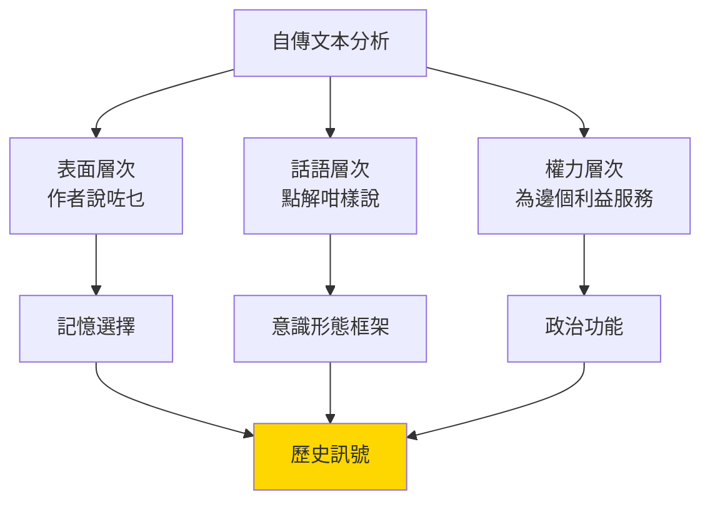
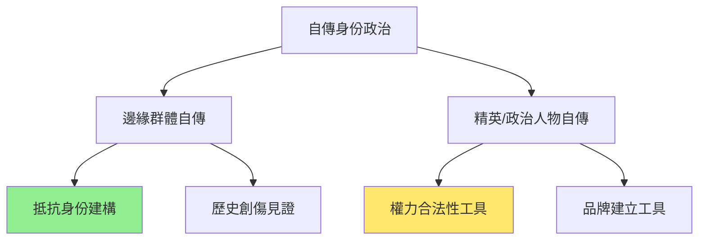
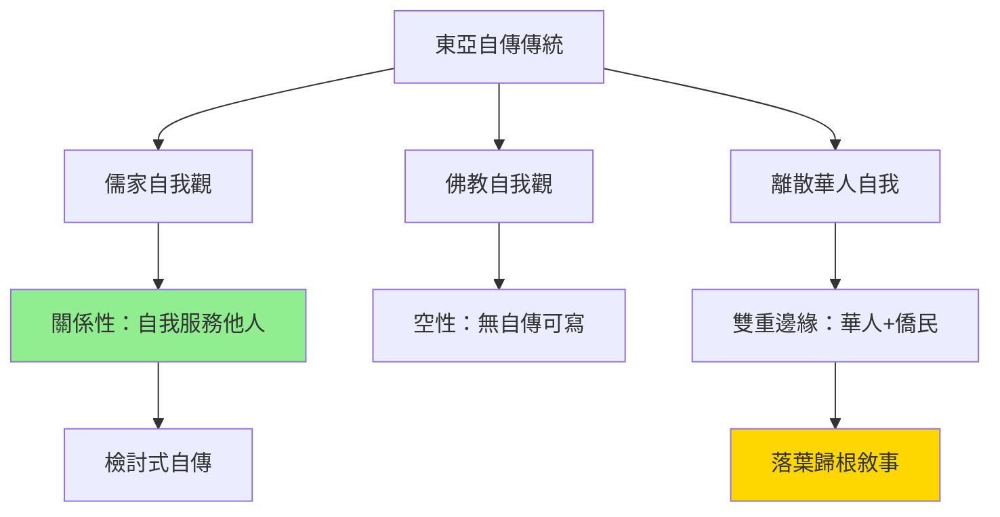
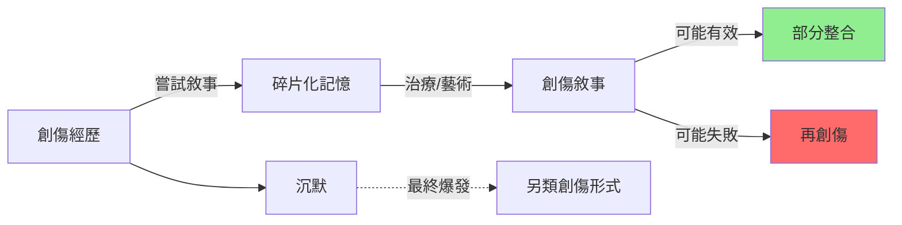
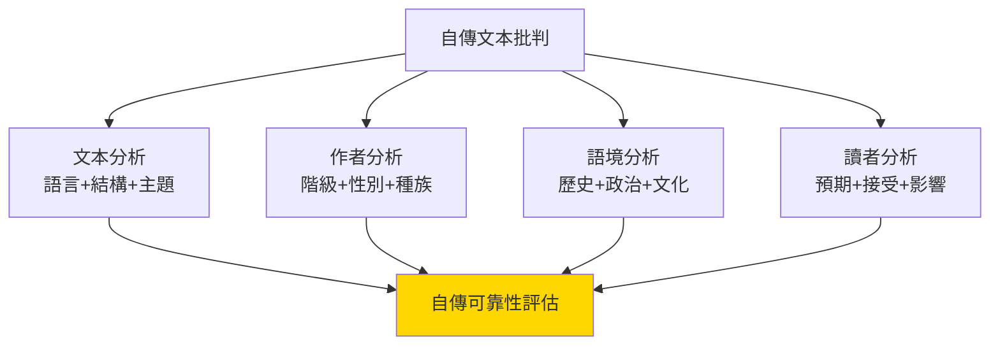
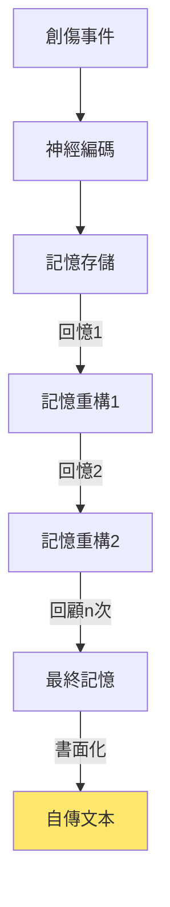
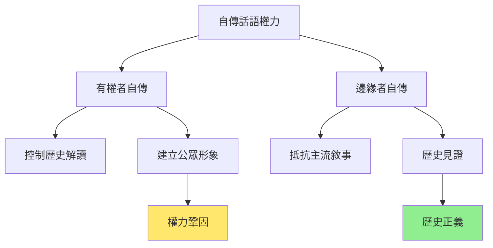
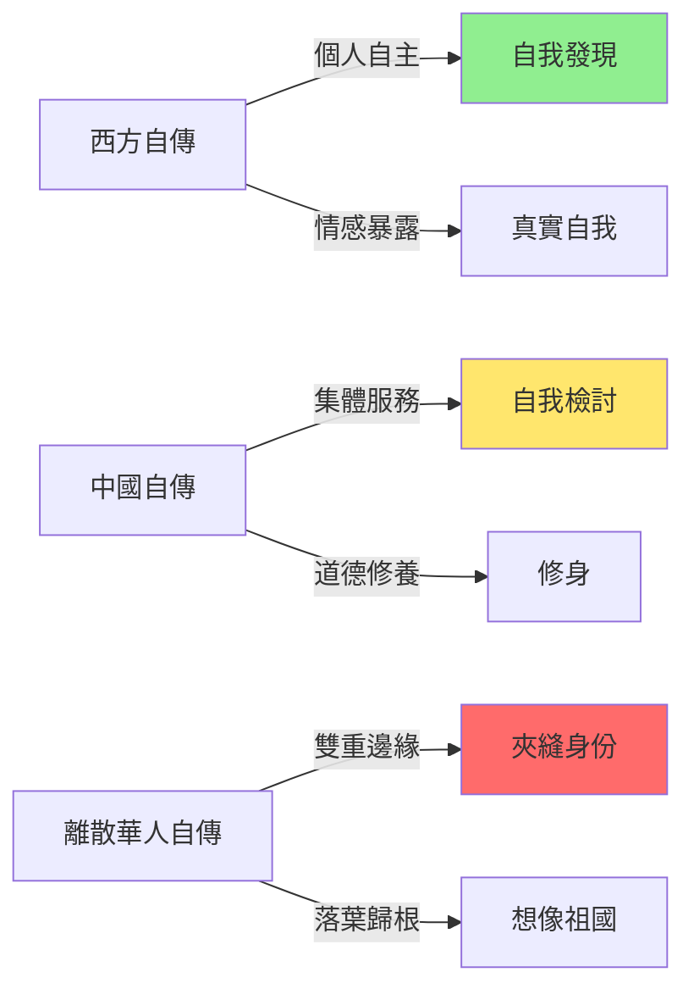
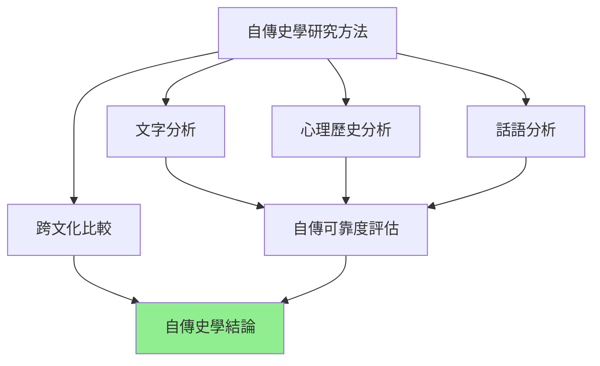

# HIST2070 自我的故事 / Stories of Self: History through Autobiography

**Instructor**: Staci Ford (2024-25)
**Department**: History, HKU
**Official source**: [HKU History Course Description 2024-25](https://history.hku.hk/wp-content/uploads/2024/07/HIST-2425.pdf)
**Style**: 袁騰飛式 — 犀利批判，聚焦「自我敘事」到底係真相定係意識形態

---

## 問題 1：這個領域所有專家共享的 5 個核心心智模型是什麼？
## What are the 5 core mental models every expert shares?

### 心智模型 1：自我係被敘事建構嘅
**The Self is Narratively Constructed**

學者 **Paul Ricoeur**（法國，*Time and Narrative*, 1984）提出「敘事身份」（narrative identity）概念——我哋嘅身份唔係固定嘅實體，而係通過敘事行動不斷被建構。學者 **Stuart Hall**（倫敦大學，*Who Needs Identity?*, 1996）更加尖銳：我哋嘅身份唔係「發現」嘅，而係被「建構」嘅——階級、性別、種族、帝國主義喺呢個建構過程入面扮演關鍵角色。

- **1749** Rousseau《懺悔錄》——西方第一部「真實」自我暴露嘅自傳，但係充滿策略性選擇
- **1791** Olaudah Equiano《生平趣事》——被奴役非洲人嘅自傳，點解成為廢奴運動嘅武器？
- **1963** Malcolm X 自傳——美國黑人穆斯林領袖敘事自己如何「發現」黑人身份
- **1991** 昂山素季「Freedom from Fear」演說——緬甸點解需要外國人承認？

### 心智模型 2：自傳係「歷史證據」定係「歷史幻覺」？
**Autobiography: Historical Evidence or Historical Illusion?**

學者 **Roy Pascal**（*Design and Truth in Autobiography*, 1960）建立自傳研究方法論。學者 **Sidonie Smith** 同 **Julia Watson**（*Reading Autobiography*, 2001）提出：自傳有三個層次——「生活」（life）、「文本」（text）、「批評」（critique）——三者從來唔完全匹配。學者 **Lejeune Philippe**（*On Autobiography*, 1989）提出「自傳契約」——作者聲稱自己寫嘅係「真實」生活，但呢個契約從來唔被保證。

- **記憶唔可靠**：神經科學顯示記憶係「重建」唔係「錄影」——每一次回憶都改變記憶
- **選擇性呈現**：自傳作者必然選擇性呈現——唔可能全部呈現
- **讀者預期**：自傳寫作受讀者預期影響——為咗說服讀者而調整敘事
- **自我形象管理**：自傳係公關工具——政治人物自傳尤其明顯

### 心智模型 3：亞洲自傳有自己嘅敘事邏輯
**Asian Autobiography Has Its Own Narrative Logic**

學者 **George Kuhn** 研究中國自傳傳統——傳統中國文人自傳唔係「自我暴露」，而係「自我檢討」。學者 **John K. Fairbank** 研究中美接觸——美國人寫中國、中國人寫自己，揭示兩種完全唔同嘅「自我」概念。學者 **Wang Gungwu**（澳洲國立大學）研究東南亞華人自傳——華人離散（Diaspora）身份點解咁難被「自傳」捕捉？

- **儒家自我觀**：傳統中國「自我」係關係入面定義，唔係西方「自主個體」
- **佛教自我觀**：自我係「空」——無自傳可寫
- **離散華人自傳**：東南亞華人點解成日寫「落葉歸根」？呢個係真實情感定係想像？

### 心智模型 4：集體創傷塑造「自我敘事」
**Collective Trauma Shapes Self-Narrative**

學者 **Cathy Caruth**（哥倫比亞，*Trauma: Explorations in Memory*, 1995）提出：創傷唔可以被完全敘事化——創傷嘅本質就係「不可敘事性」。學者 **Michael Rothberg**（UIUC，*Multidirectional Memory*, 2009）研究：大屠殺、奴隸制、殖民創傷點解互相「競爭」記憶資源。呢個模型對理解香港、中國嘅歷史創傷自傳特別重要。

- **六四創傷**：點解1989年創傷咁難被自傳捕捉？係創傷本身定係政治壓抑？
- **六七暴動**：香港殖民地歷史創傷點解遲遲未被自傳處理？
- **文革自傳**：從傷痕文學到個人回憶——創傷敘事點解被政治化？

### 心智模型 5：自傳係權力鬥爭場所
**Autobiography is a Site of Power Struggle**

學者 **John B. Thompson**（劍橋，*The Media and Modernity*, 1990）分析：自傳從來唔係單純嘅個人表達，而係「公共敘事」（public narratives）同「個人敘事」（private narratives）嘅權力場。學者 **Judith Butler**（哥倫比亞，*Gender Trouble*, 1990）提出：性別身份係表演性（performative）——自傳中被表演出嚟嘅性別身份，揭示性別權力嘅深層結構。

- **政治人物自傳**：從毛澤東《語錄》到林鄭月娥——點解政治人物自傳係「宣傳」唔係自傳？
- **名人自傳**：媒體文化入面，自傳成為品牌建立工具
- **邊緣群體自傳**：少數族裔、女性、工人階級——佢哋點解遲遲未有自傳？

---

## 問題 2：這個領域 3 個 SPECIFIC 根本分歧

### 分歧 1：「真實自我」到底存唔存在？
**Does the "Authentic Self" Actually Exist?**

- **A 方（本真論）**：學者 **Charles Taylor**（麥基爾，*Sources of the Self*, 1989）——確實存在一個「真實」自我，可以通過反思被發現；自傳就係發現呢個真實自我嘅過程
- **B 方（建構論）**：學者 **Stuart Hall**、**Judith Butler**——自我係被話語、權力、歷史建構；「真實自我」只係意識形態幻覺；自傳唔係發現自我，而係製造自我

### 分歧 2：自傳史學到底係幫歷史學定係破壞歷史學？
**Autobiographical History: Help or Hindrance to History?**

- **A 方（支持派）**：學者 **Ulinka Rublack**（劍橋）——自傳提供普通人的聲音，彌補精英歷史嘅缺失；女性、工人、少數族裔往往只有自傳呢種史料
- **B 方（懷疑派）**：學者 **David Hackett Fischer**（*Historians' Fallacies*, 1970）——自傳記憶唔可靠，自傳作者往往有强烈動機扭曲歷史真相

### 分歧 3：亞洲自傳到底有冇自己嘅「自我」概念？
**Does Asian Autobiography Have Its Own "Self" Concept?**

- **A 方（文化特殊論）**：學者 **William Theodore de Bary**（哥倫比亞）——儒學傳統影響下嘅中國「自我」係關係性嘅，唔可以西方自傳標準衡量
- **B 方（普世論）**：學者 **Wang Gungwu**——離散華人自傳證明「自我」係跨文化嘅——無論文化背景，所有人都可以寫自傳

---

## 問題 3：10 個 PROBING 深度問題

1. 如果自傳記憶係「重建」唔係「錄影」，咁自傳到底仲可唔可以信？歷史學家用乜嘢標準評估自傳？
2. 為乜嘢大部分歷史名人自傳都係退休之後或者死之前寫？呢個時機揭示咗乜嘢？
3. 香港歴史自傳——點解咁少？係香港人唔寫自傳，定係寫咗但冇人睇？
4. 中國共產黨員自傳——從入黨申請到自我檢討——呢種「自傳」同西方自傳有乜嘢根本差異？
5. 傷痕文學（中國1980年代）——呢種「集體自傳」到底係真實創傷敘事定係政治工具？
6. 如果所有身份都係被建構嘅——包括性別、階級、種族——咁我哋仲需不需要追求「真實自我」？
7. 自殺者遺書算唔算自傳？呢個邊界問題揭示咗乜嘢關於「自我敘事」嘅本質？
8. 點解咁多政治領袖喜歡寫自傳？自傳喺政治鬥爭入面扮演乜嘢角色？
9. AI 時代——如果可以生成「虛假自傳」，咁自傳作為歷史證據仲有乜嘢價值？
10. 香港人身份——點解香港人成日話自己係「我哋」但從來未清楚解釋過「我哋」係邊個？呢個自我模糊性揭示咗乜嘢歷史創傷？

---

# 核心心智模型深化（中英對照）

## 1. 自傳作歷史證據 / Autobiography as Historical Evidence

### 1.1 Bilingual 概念對照
- 自傳契約 (zìzhuàn qìyuē) = Autobiographical Pact — Lejeune 理論：作者聲稱寫真實生活
- 敘事身份 (xùshì shēnfèn) = Narrative Identity — Ricoeur：自我通過敘事被建構
- 記憶重建 (jìyì chóngjiàn) = Memory Reconstruction — 記憶每次被回顧都改變
- 批判自傳學 (pīpàn zìzhuàn xué) = Critical Autobiography Studies — 自傳文本批判分析

### 1.2 史料與考據
- **核心史料**：歷史人物自傳（必須 cross-reference 檔案）、日記、書信
- **批評方法**：文字語言學分析、心理分析方法、歷史語境分析
- **香港自傳資料**：香港文學館、香港記憶計劃口述歷史項目

### 1.3 袁騰飛式犀利觀察
> 「自傳最呃人嘅地方，就係你以為作者喺度話你知佢點解變成咁——但係作者往往係到解釋緊佢點解需要你咁睇佢。自我呈現從來唔等於自我真相。」

### 1.4 Deep Test Question
**考試題**：比較 Malcolm X 自傳（1965）同 Frederick Douglass 自傳（1845）。兩者點解用完全唔同嘅自傳策略？呢個差異揭示咗乜嘢？

### 1.5 圖解

---

## 2. 記憶與自我 / Memory and Self

### 2.1 Bilingual 概念對照
- 創傷記憶 (chuàngshāng jìyì) = Traumatic Memory — 創傷事件嘅特殊記憶形式
- 集體記憶 (jítǐ jìyì) = Collective Memory — 群體共同分享嘅記憶
- 官方記憶 (guānfāng jìyì) = Official Memory — 國家權力建構嘅記憶
- 抵抗記憶 (dǐkàng jìyì) = Resisting Memory — 反對官方記憶嘅另類記憶

### 2.3 袁騰飛式犀利觀察
> 「香港六七暴動——官方記憶話係『左派暴動』、『港英政府成功鎮壓』。但係參加者記憶話係『反殖民主義起義』。邊個記憶先至係真實？或者——真實從來唔係問題，權力先至係問題。」

### 2.4 Deep Test Question
**考試題**：點解記憶研究顯示「每次回憶都改變記憶」？呢個發現對自傳作為歷史證據有乜嘢毀滅性影響？

### 2.5 圖解

---

## 3. 自傳與身份政治 / Autobiography and Identity Politics

### 3.1 Bilingual 概念對照
- 身份政治 (shēnfèn zhèngzhì) = Identity Politics — 以身份認同為基礎嘅政治行動
- 表演性 (biǎoyǎn xìng) = Performativity — Butler 概念：身份係被表演出嚟嘅
- 邊緣自傳 (biānyuán zìzhuàn) = Subaltern Autobiography — 邊緣群體嘅自傳
- 公共自傳 (gōnggòng zìzhuàn) = Public Autobiography — 政治人物/名人自傳

### 3.3 袁騰飛式犀利觀察
> 「政治人物自傳從來唔係自傳——係宣傳。特朗普自傳？佢嘅公關團隊寫嘅。毛澤東自傳？宣傳部寫嘅。問題唔係『邊個寫』，而係『邊個有權利寫』。」

### 3.4 Deep Test Question
**考試題**：分析美國1960s Black Power Movement 時期 Malcolm X 自傳同 Martin Luther King Jr. 自傳嘅政治功能。兩者點解用咁唔同嘅自傳策略？

### 3.5 圖解

---

## 4. 亞洲自傳傳統 / Asian Autobiography Traditions

### 4.1 Bilingual 概念對照
- 自我修養 (zìwǒ xiūyǎng) = Self-Cultivation — 儒學傳統嘅「自我」概念
- 懺悔錄 (chànhuǐ lù) = Confession — 傳統中國文人一種自傳形式
- 反思 (fǎnsī) = Reflexivity — 自傳核心操作
- 關係性自我 = Relational Self — 儒家傳統：自我喺關係入面定義

### 4.3 袁騰飛式犀利觀察
> 「中國傳統自傳——你見唔見到——永遠都係『檢討』多過『暴露』？寫自己幾叻，冇人要睇；寫自己幾衰，顯示你幾有反省——呢個就係儒學傳統對『自我』嘅定義：自我係為咗服務他人而被呈現。」

### 4.4 Deep Test Question
**考試題**：比較中國傷痕文學（1980年代）同日本戰後自傳。兩者點解用咁唔同嘅方式處理戰爭創傷？

### 4.5 圖解

---

## 5. 自傳與創傷敘事 / Autobiography and Trauma Narrative

### 5.1 Bilingual 概念對照
- 創傷敘事 (chuàngshāng xùshì) = Trauma Narrative — 處理創傷嘅敘事形式
- 見證文學 (jiànzhèng wénxué) = Testimony Literature — 創傷經歷者嘅文字見證
- 不可敘事性 (bùkě xùshì xìng) = Unnarratability — Caruth：創傷本質上唔可以被完全敘事
- 治療性寫作 (zhìliáo xìng xiězuò) = Therapeutic Writing — 自傳寫作作為創傷治療

### 5.3 袁騰飛式犀利觀察
> 「Cathy Caruth 話創傷本質上係『不可敘事』——但係創傷者又忍唔住要敘事。你試下話俾人知你見過最恐怖嘅嘢，但係語言永遠唔夠——呢個就係創傷最殘酷嘅地方。」

### 5.4 Deep Test Question
**考試題**：比較六四天安門母親自傳敘事同納粹大屠殺倖存者自傳。兩者點解用咁唔同嘅創傷敘事策略？

### 5.5 圖解

---

## 深度自測問題詳解

**Q1**：記憶研究——神經科學顯示每次回憶都係「重建」過程，神經連接被重新激活並可能改變。呢個對自傳作為歷史證據有根本性影響——但唔代表自傳冇價值，而係需要cross-reference其他史料。

**Q2**：政治人物自傳時機——退休或死前寫，因為呢個時候權力最大程度被固化，可以控制歷史解讀。呢個揭示自傳從來唔係單純個人行為，而係政治工具。

**Q3-Q10**：香港歴史自傳少——因為殖民政府從來唔鼓勵本地人記錄自己；加上六七暴動嘅創傷，令香港人對「歷史」有特殊焦慮；回歸後身份問題更加複雜。

---

## 5 個 Mermaid 圖解

### 圖解 1：自傳文本批判框架

### 圖解 2：記憶重建過程

### 圖解 3：自傳與權力

### 圖解 4：自傳形式比較

### 圖解 5：自傳史學方法論

---

## 總結

**HIST2070 Stories of Self** 係一堂逼你質問「自我到底係乜嘢」嘅課程。呢個 course 嘅核心價值：

1. **批判性自我意識**：通過分析他人嘅自傳，反思自己嘅自我敘事到底有幾「真實」
2. **方法論創新**：自傳史學結合歷史學、文學理論、心理學——呢個係跨學科研究嘅典範
3. **香港/中國視角**：課程覆蓋香港、中國自傳傳統，呢個係西方自傳研究中心缺乏嘅維度

**袁騰飛金句**：
> 「自傳話你知邊個係你自己——但係你需要問：邊個想你知道呢個版本嘅你自己？」

---

## 延伸閱讀 / Further Reading

1. Smith, Sidonie and Julia Watson. *Reading Autobiography: A Guide for Interpreting Life Narratives*. Minneapolis: University of Minnesota Press, 2001.
2. Lejeune, Philippe. *On Autobiography*. Minneapolis: University of Minnesota Press, 1989.
3. Ricoeur, Paul. *Time and Narrative*. Chicago: University of Chicago Press, 1984.
4. Hall, Stuart. "Who Needs Identity?" In *Questions of Cultural Identity*, ed. Stuart Hall and Paul du Gay. London: Sage, 1996.
5. Caruth, Cathy. *Trauma: Explorations in Memory*. Baltimore: Johns Hopkins University Press, 1995.
6. Douglass, Frederick. *Narrative of the Life of Frederick Douglass*. 1845.
7. Malcolm X. *The Autobiography of Malcolm X*. 1965.
8. Wang Gungwu. *The Chinese Migrant: The Social History of a Migrant*. Singapore: NUS Press, 2015.
