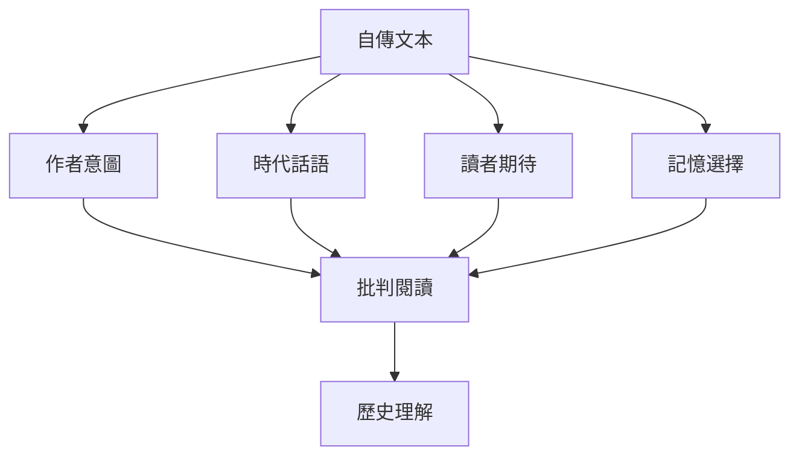
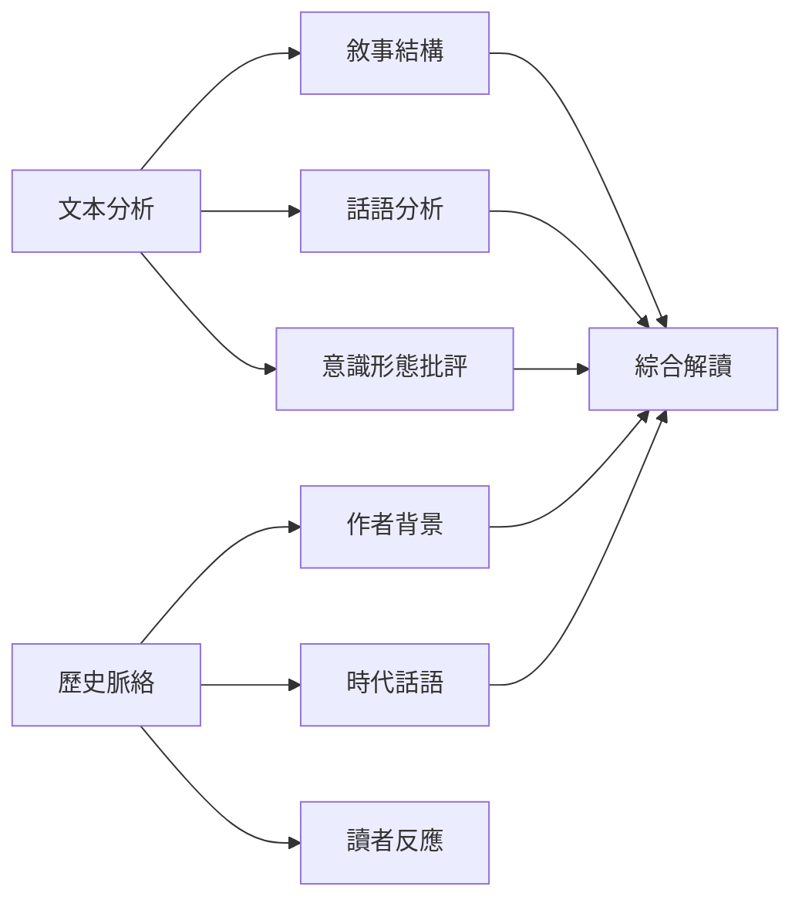
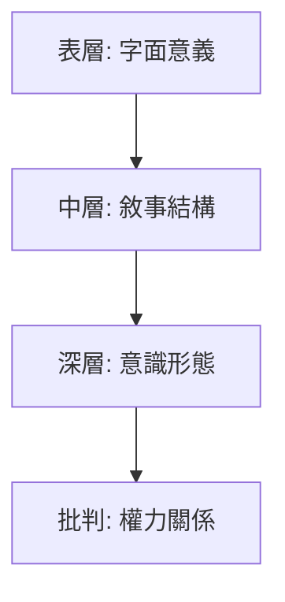
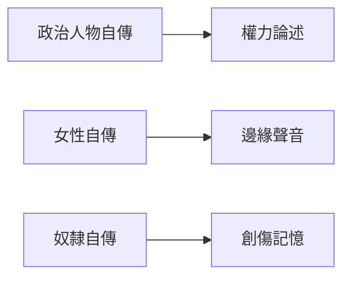
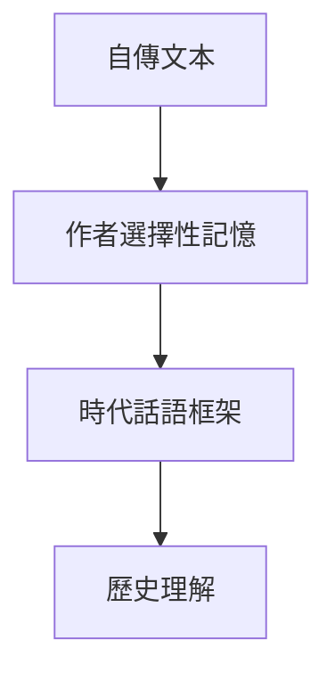

# HIST2070 自傳的故事 / Stories of Self: History through Autobiography (6 credits)

**Instructor**: Staci Ford
**Department**: History, HKU  
**Official source**: [HKU History Course Description 2024-25](https://history.hku.hk/wp-content/uploads/2024/07/HIST-2425.pdf)
**Style**: 袁騰飛式 — 犀利、聚焦自傳點解塑造身份認同

---

## 問題 1：這個領域所有專家共享的 5 個核心心智模型

### 心智模型 1：自傳作為「建構」而非「事實」
學者 **Paul John Eakin** (哈佛, *How Our Lives Become Stories*, 1999) 指出：自傳唔係「真實自我」嘅透明窗口，而係一種「自我建構」嘅文學形式。自傳作者選擇、遺漏、重組記憶，以配合佢想呈現嘅身份。

學者 **Sidonie Smith & Julia Watson** (*Reading Autobiography*, 2001) 提醒：所有自傳都係「事後建構」——作者用今日視角重新诠释過去。

### 心智模型 2：記憶係「選擇性」建構
學者 **Elizabeth Loftus** (UC Irvine) 實驗顯示：人類記憶係高度可塑——每次回憶都會改變記憶內容。呢個發現對自傳研究有重大影響。

學者 **Daniel Schacter** (*The Seven Sins of Memory*, 2001) 指出：記憶唔係檔案資料，而係持續重建過程。

### 心智模型 3：自傳作爲「公眾論述」而非私人文本
學者 **James Olney** (*Memory and Narrative*, 1998) 認為：自傳永遠唔係純粹私人——佢係為讀者而寫，為時代話語服務。

學者 **Gillian Whitlock** 研究殖民時期自傳——女性傳教士、奴隸、流放者自傳都係權力關係嘅文本。

### 心智模型 4：身份係「表演性」(Performative)
學者 **Stuart Hall** (倫敦大學) 指出：身份唔係固定本質，而係持續「表演」嘅過程。自傳就係呢種表演嘅文本記錄。

學者 **Judith Butler** (*Gender Trouble*, 1990) 補充：性別身份係「表演性」——自傳中性别書寫亦都係表演。

### 心智模型 5：自傳係「歷史證據」但需要批判閱讀
學者 **Regina September** 研究南非Truth and Reconciliation Commission 證詞——自傳式證詞係歴史創傷嘅重要證據，但需要批判分析。

---

## 問題 2：3 個根本分歧

### 分歧 1：自傳忠實度——自傳可信嗎？
- **A 方**：自傳係可靠史料
  - **Roy Pascal** (*Design and Truth in Autobiography*, 1960)
  - 論點：自傳作者有獨特途徑接觸自己內心世界
- **B 方**：自傳充满選擇性記憶
  - **Philippe Lejeune** (*On Autobiography*, 1989)
  - 論點：自傳作者有意識形態、聲譽考慮

### 分歧 2：集體自傳 vs 個人自傳
- **A 方**：自傳永遠係個人
- **B 方**：邊緣群體自傳代表集體經歷
  - **Mary Louise Pratt** 研究「接觸地帶」自傳

### 分歧 3：自傳作爲歷史 vs 文學
- **A 方**：歷史學科
- **B 方**：文學批評領域

---

## 問題 3：10 個深度問題

1. 如果自傳記憶可以伪造，自傳仲有乜嘢歷史價值？
2. 點解殖民時期女性自傳特別少？（提示：識字率、出版渠道、社會規範）
3. 如果你係研究奴隸自傳，點樣批判分析？
4. 自傳點解通常由成功人士寫？（提示：階級問題）
5. 比較毛澤東毛澤東自傳同普通紅衛兵自傳，邊個更有歷史價值？
6. 自傳中點解往往女性被描繪成受害者而非行動者？
7. 如果記憶係建構，自傳史學研究有乜嘢意義？
8. 點解 1989 年後中國出現大量「傷痕文學」自傳？
9. 自傳作爲「療癒工具」——治療效果定歷史功能？
10. 如果所有自傳都消失，歷史學會損失幾多？

---

## 核心心智模型深化

## 1. 自傳文本分析

| English | 中英對照 |
|---|---|
| Autobiography | 自傳 |
| Self-fashioning | 自我塑造 |
| Narrative identity | 敘事身份 |
| Performativity | 表演性 |
| Testimony | 證詞 |

## 2. 圖解：自傳閱讀框架

---

## 深度自測問題

### 詳解 1: 如果自傳記憶可以偽造，仲有乜嘢價值？
記憶係建構，但呢個唔係否定自傳價值嘅理由——反而提醒我哋要批判閱讀。自傳價值唔喺於「事實」而在於「話語」——自傳揭示作者點解選擇呈現自己，呢個本身就係歷史資料。

---

## 5 個 Mermaid 圖解

### 📊 Diagram 1: 自傳研究方法論

### 📊 Diagram 2: 自傳閱讀層次

### 📊 Diagram 3: 自傳類型

### 📊 Diagram 4: 自傳真實性問題

### 📊 Diagram 5: 自傳與歷史

---

## 總結

1. 自傳唔係透明窗口，而係建構文本
2. 記憶係選擇性——呢個提醒批判閱讀
3. 自傳揭示權力關係
4. 邊緣群體自傳有獨特價值
5. 自傳史學需要跨學科方法

**最後尖銳問題**: 如果自傳都係建構，歷史學家點樣研究「真實」過去？

---
**版權所有 © HKU History Self-Study**
