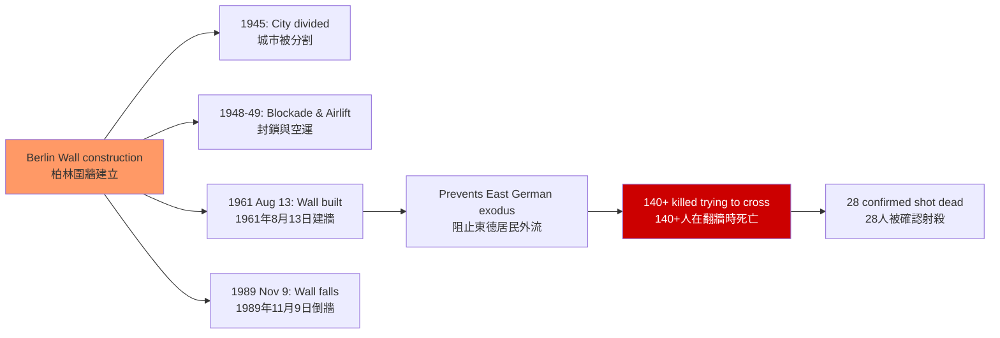
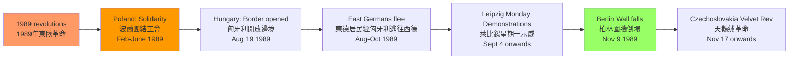
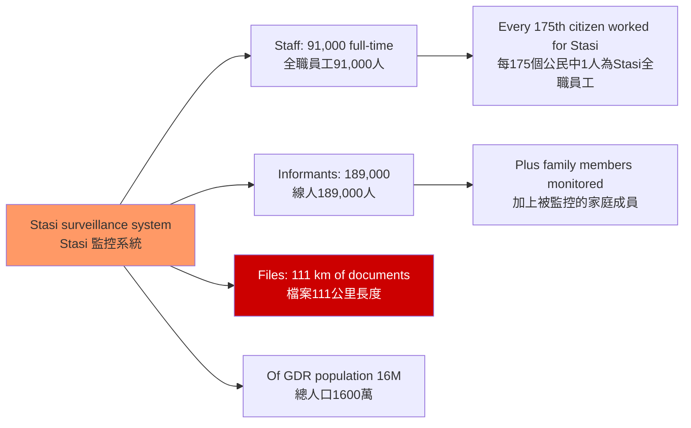

# HIST2076 德國與冷戰 / Germany and the Cold War

**Instructor**: HKU History Staff
**Department**: History, HKU
**Official source**: [HKU History Course Description](https://history.hku.hk/ug_cd/)
**Style**: 袁騰飛式 — 犀利、聚焦歐洲冷戰的核心——分裂的德國，冷戰的縮影

---

## 問題 1：5 個核心心智模型

### 1. 柏林圍牆——冷戰的物質化
1961 年 8 月 13 日，東德政府在東柏林建起了柏林圍牆——這不僅是物理隔離，更是意識形態的最尖銳表達。學者 **Hope Harrison** 研究：柏林圍牆的建立不是斯大林的決定，而是東德領導人烏布里希（Walter Ulbricht）為了阻止東德人口外流而推動的。

- **典型學者**: **Hope Harrison** — *Driving the Soviets Out of the Push* (2003); **Frederick Taylor** — *The Berlin Wall* (2006)
- **驗證案例**: 1961 年 8 月 12 日晚至 13 日凌晨：東德士兵開始建牆，到 8 月 15 日牆體基本完成；在建牆過程中，已有約 2,000 東德居民成功逃往西柏林

### 2. 東西德經濟奇蹟——兩種模式的對抗
1949-1989 年，東德（DDR）和西德（FRG）進行了一場長達 40 年的經濟競爭。學者 **Adam Seessel** 和 **Mark Landsman** 研究：儘管西德有馬歇爾計劃援助和市場經濟優勢，但東德在教育和科技領域曾達到相當高的水平。

### 3. 冷戰的身份政治——德國性（German-ness）
冷戰將「德國性」一分為二：西德成為「西方」的一部分，東德成為「東方」的一部分。學者 **Mary Fulbrook** 在 *A History of Germany* (2004) 中分析：這種分裂創造了兩種不同的德國身份——到 1990 年統一後，東西德居民之間的身份鴻溝仍然存在。

### 4. 核武與歐洲安全—— MAD 與外交博弈
1950-1980 年代，歐洲是美蘇核武博弈的最危險前沿。學者 **Lukas L. D. Heinz** 研究：西德成為北約「前線國家」，東德成為華約核武部署的據點。

### 5. 1989 年革命——群眾運動與帝國崩潰
1989 年 11 月 9 日柏林圍牆倒塌，是冷戰結束的象徵。學者 **Mona L. Crofts** 研究：這場革命不是單一事件，而是東歐各國群眾運動的共同結果——萊比錫每週一示威（星期一示威）是東德異見運動的核心。

---

## 問題 2：3 個根本分歧

### 分歧 1：柏林危機——誰是真正的危機製造者？
冷戰時期的四大柏林危機（1948-49, 1958, 1961, 1987）中，每個危機的成因和責任歸屬至今仍有爭議。

### 分歧 2：東德——極權 vs 實際存在的特殊性？
學者之間對東德的定性長期存在分歧：是「極權主義」（極端的權力集中）還是「特殊形式的國家社會主義」（有別於蘇聯的獨特模式）？

### 分歧 3：統一——真正的和解 vs 未完成的過去（Unfinished Past）？
1990 年統一後，東西德之間的身份鴻溝從未真正消失——這個問題在 2015 年歐洲移民危機和 2022 年俄烏戰爭後變得更加尖銳。

---

## 問題 3：10 個深度問題

1. **1948-49 年柏林封鎖**：蘇聯封鎖西柏林（1948年6月24日），美英空運（Berlin Airlift）持續了 11 個月，共飛行約 277,000 架次，輸送約 230 萬噸物資。這次危機如何奠定了東西方冷戰對抗的格局？
2. **1961 年柏林圍牆的建立**：東德為什麼要建牆？烏布里希和赫魯曉夫在這個決定上的博弈過程是什麼？
3. **東德的日常生活**：在國家社會主義體制下，普通東德人的日常生活如何？Stasi（國家安全部）的監控系統如何影響了普通人的私人生活？
4. **西德的「經濟奇蹟」**：1948 年貨幣改革和 1950 年代經濟起飛，如何奠定了西德在冷戰中作為「自由世界櫥窗」的地位？
5. **萊比錫星期一示威**：1989 年 9 月 4 日開始的每週一示威，最初只有約 1,000 人參加，到 11 月 9 日柏林圍牆倒塌時已達到約 30 萬人的規模。這種群眾動員的組織形式是什麼？
6. **1990 年 10 月 3 日兩德統一**：統一後，東德居民大規模失業（約 30% 的東德工作崗位在統一後數年內消失）——這種經濟失落感如何影響了東西德居民之間的身份鴻溝？
7. **德國記憶政治**：為什麼德國對納粹大屠殺的記憶處理成為全球「轉型正義」的典範？這種記憶政治與德國統一後的東歐政策有什麼聯繫？
8. **Stasi 檔案**：1990 年後開放的 Stasi 檔案（東德國家安全部）如何成為了研究極權主義監控體制的獨特史料？這些檔案揭示了什麼令公眾震驚的真相？
9. **當代德國的冷戰遺產**：2015 年歐洲移民危機期間，東德居民對「開放邊境」政策的反對（Pegida 運動）與西德居民的支持——這種東西分歧如何反映了冷戰時期身份政治的長期影響？
10. **德國統一後歐洲安全格局的變化**：1990 年統一後德國放棄了馬克（改用歐元），選擇了「歐洲化」而非「民族化」的道路——這種選擇在 2022 年俄烏戰爭後是否仍然有效？

---

# 核心心智模型深化

## 1. 柏林圍牆的建立——冷戰的物質化

### 1.1 圖解：柏林圍牆的建立過程


---

## 2. 東西德經濟比較

### 2.1 圖解：冷戰經濟模式的比較
```mermaid
graph LR
    A[West Germany (FRG) 1949-1989<br/>西德 1949-1989] --> B[Social market economy<br/>社會市場經濟]
    A --> C[Marshall Plan aid<br/>馬歇爾計劃援助]
    A --> D[Export-led growth<br/>出口導向增長]
    
    E[East Germany (DDR) 1949-1989<br/>東德 1949-1989] --> F[Planned economy<br/>計劃經濟]
    E --> G[COMECON trade bloc<br/>經互會貿易集團]
    E --> H[Full employment<br/>充分就業]
    E --> I[But lower productivity<br/>但生產率較低]
    
    C --> J[West German miracle<br/>西德經濟奇蹟]
    H --> K[But stagnant living standards<br/>但生活水平停滯]
    
    style A fill:#9f6
    style E fill:#f90
```

---

## 3. 1989 年革命的結構

### 3.1 圖解：1989 年東歐革命的連鎖反應


---

## 4. 冷戰身份政治

### 4.1 圖解：東西德身份政治的長期影響
```mermaid
graph LR
    A[Post-unification German identity<br/>統一後德國身份] --> B[East German "Ossi"<br/>東德人標籤<br/>被視為落後]
    A --> C[West German "Wessi"<br/>西德人標籤<br/>被視為傲慢]
    A --> D[Third way?<br/>第三種可能?<br/>新德國人身份?]
    
    B --> B1[1990s: Economic resentment<br/>1990年代經濟怨恨<br/>30% East unemployment]
    C --> C1[1990s: Wessi condescension<br/>1990年代西德人的優越感]
    D --> D2[2010s: Alternative für Deutschland<br/>2013年選擇黨興起<br/>East German strongholds]
    
    style A fill:#f96
    style D2 fill:#c00,color:#fff
```

---

## 5. Stasi 檔案——極權監控的史料

### 5.1 圖解：Stasi 監控系統的規模


---

# 總結

1. **柏林圍牆是冷戰意識形態的最尖銳表達**：它把「自由世界」和「專制世界」的邊界，在一個城市的心臟位置物質化了——28 年裏，它成為了全球冷戰的最強象徵。

2. **1989 年革命是群眾運動的奇蹟**：沒有任何一個外國政府的干預，東歐人民自己推翻了蘇聯帝國——這是冷戰史中最令人驚嘆的歷史事件之一。

3. **統一後的德國仍然是「兩個德國」**：東西德之間的身份鴻溝，在 1990 年統一 34 年後的今天，仍然深刻地影響著德國的政治走向。

4. **Stasi 檔案的開放是歷史學的獨特機遇**：111 公里的檔案記錄，讓歷史學家第一次能夠詳細研究一個極權主義監控體制的運作機制。

5. **冷戰的歐洲遺產在 2022 年俄烏戰爭後重新尖銳化**：德國對俄羅斯能源的依賴（2021 年，德國 55% 的天然氣來自俄羅斯）在俄烏戰爭後被迫緊急調整——冷戰時期的能源地緣政治邏輯，從未真正消失。

**自學建議**: 配合 Frederick Taylor 的 *The Berlin Wall* + Mary Fulbrook 的 *A History of Germany*，輸出讀書筆記到 `06_Reading_Notes/`。
