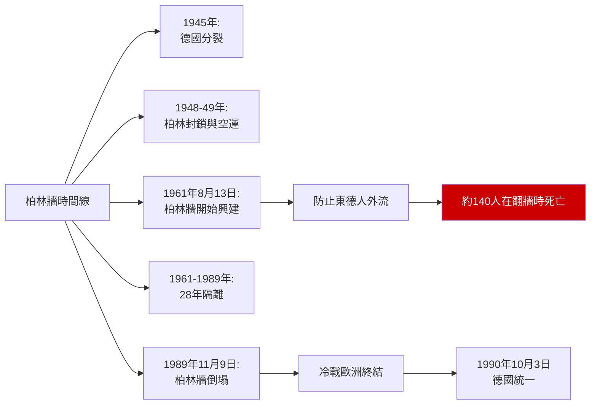
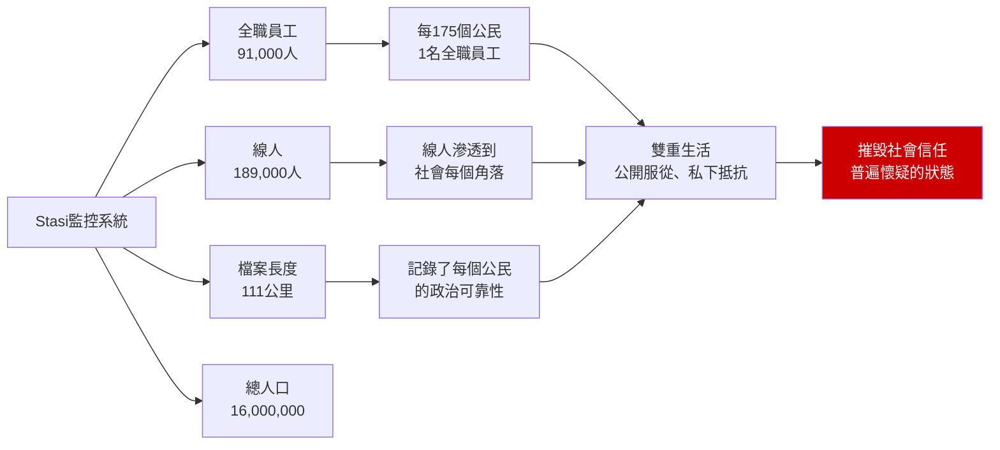
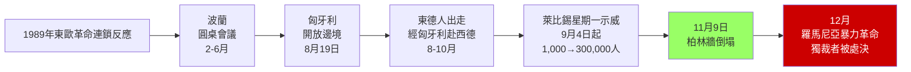
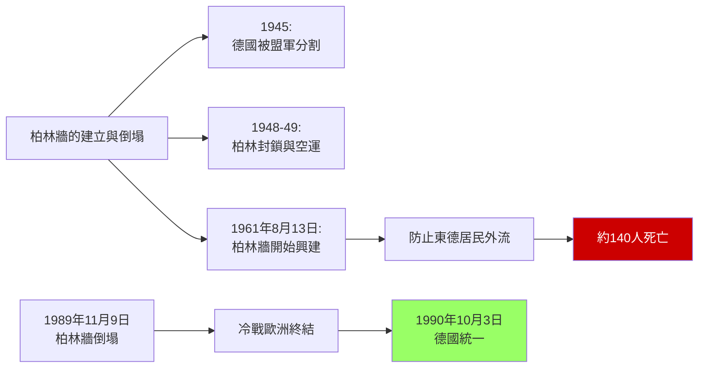
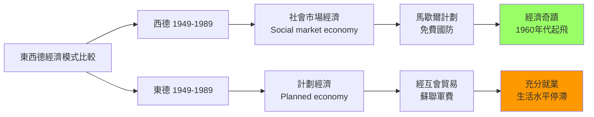
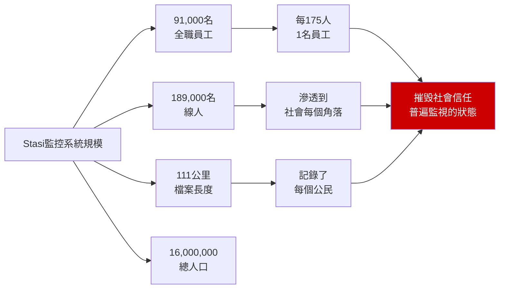
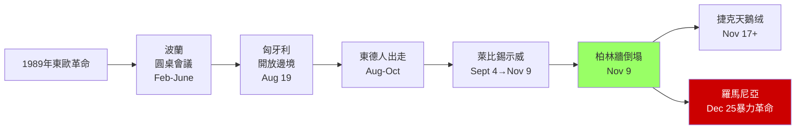
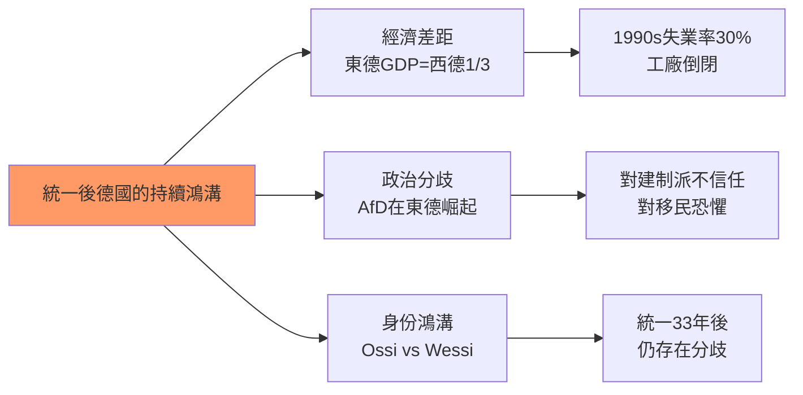

# HIST2076 — 德國與冷戰 / Germany and the Cold War

/** HKU | 6 credits | Instructor: Becker */

---

## 問題 1：5 個核心心智模型

### 1. 柏林圍牆——冷戰的最尖銳象徵（The Berlin Wall: The Sharpest Symbol of the Cold War）
**定義**: 1961年8月13日，東德政府在東柏林建起了柏林圍牆——這不僅是物理隔離，更是意識形態鬥爭的最尖銳表達。柏林牆把「自由世界」和「專制世界」的邊界，在一個城市的心臟位置物質化了。28年裏，它成為了全球冷戰的最強象徵。

**學者**:
- **Hope Harrison** — *Driving the Soviets Out of the Push: The Popular Movement to Reunify Germany* (2003)
- **Frederick Taylor** — *The Berlin Wall: A World Divided, 1961-1989* (2006)
- **Frederick Taylor** — research on Berlin Wall history
- **Mary Fulbrook** — *A History of Germany, 1918-2014* (2015)
- **Anna Funder** — *Stasiland* (2003)

**驗證**: 1961年8月12日晚至13日凌晨：東德士兵開始建牆；到8月15日牆體基本完成；建牆後，共有約140人在試圖翻牆時死亡，其中28人被確認射殺。

**歷史事件**:
- **1945年5月8日**: 德國無條件投降——第三帝國滅亡
- **1948年6月24日**: 蘇聯封鎖西柏林——柏林空運行動開始
- **1949年5月12日**: 封鎖解除——空運行動飛行約278,000架次
- **1961年8月13日**: 柏林牆開始興建
- **1989年11月9日**: 柏林牆倒塌——冷戰歐洲終結象徵

### 2. 東西德經濟奇蹟——兩種模式的40年對抗（East vs West German Economic Miracles）
**定義**: 1949-1989年，東德（DDR）和西德（FRG）進行了一場長達40年的經濟競爭。西德有馬歇爾計劃援助和社會市場經濟模式，创造了「經濟奇蹟」；東德有計劃經濟和經互會（COMECON）貿易體系，達到了「充分就業」但生活水平停滯。

**學者**:
- **Adam Seessel** — research on German economic history
- **Mark Landsman** — research on East German economy
- **Mary Fulbrook** — *The People's State: East German Society from Hitler to Honecker* (2005)
- **John Connor** — research on West German economic miracle

**驗證**: 1950年西德GDP僅為英法的一半；到1970年，西德GDP已超過英法之和。東德1989年人均GDP約西德的1/3，但失業率接近零（官方數據）。

**歷史事件**:
- **1948年6月18日**: 西德貨幣改革——德國馬克取代帝國馬克
- **1949年**: 東德和西德分別建國
- **1950年代**: 西德經濟起飛——「經濟奇蹟」
- **1970年代**: 東德經濟增長停滯——生活水平差距擴大
- **1989年**: 柏林牆倒塌——兩種模式的最終裁判

### 3. Stasi監控系統——極權主義的日常化（The Stasi: The Everyday Face of Totalitarianism）
**定義**: 東德國家安全部（Stasi）建立了20世紀最複雜的監控系統之一。91,000名全職員工、189,000名線人、111公里長的檔案——這種「全民監控」的規模揭示了極權主義的日常化如何影響普通人的私人生活。

**學者**:
- **Anna Funder** — *Stasiland* (2003)
- **Gary Bruce** — *The Firm: The Inside Story of the Stasi* (2010)
- **Mary Fulbrook** — research on Stasi surveillance
- **Hubertus Knabe** — *Die是被監視的女人* research

**驗證**: Stasi監控渗透到東德社會的每個角落——每175個東德公民中就有1人是Stasi全職員工，加上189,000名線人，整個社會陷入互相監視的狀態。

**歷史事件**:
- **1950年2月8日**: Stasi正式成立
- **1970年代**: Stasi規模急劇擴大——員工數量從數千增至近10萬
- **1989年12月**: Stasi檔案被開放——公眾震驚
- **1990年代**: 統一後的德國建立Stasi檔案聯邦機構（BStU）

### 4. 1989年革命——群眾運動的奇蹟（The 1989 Revolutions: The Miracle of Popular Movements）
**定義**: 1989年11月9日柏林牆倒塌，是冷戰結束的象徵。但這場革命不是單一事件，而是東歐各國群眾運動的共同結果——波蘭、匈牙利、東德、捷克的革命相互影響，形成了「革命的連鎖反應」。

**學者**:
- **Mona L. Crofts** — research on Leipzig demonstrations
- **Padraig O'Donogue** — research on 1989 revolutions
- **Timothy Garton Ash** — *The Magic Lantern* (1990)
- **Tony Judt** — *Postwar: A History of Europe Since 1945* (2005)

**驗證**: 萊比錫每週一示威從1989年9月4日的約1,000人增長到11月9日的約30萬人。這個「每週一」的非暴力群眾動員，是東德異見運動的核心模式。

**歷史事件**:
- **1989年2月**: 匈牙利開放與奧地利邊界
- **1989年8月**: 東德居民經匈牙利大量出走
- **1989年9月4日**: 萊比錫第一場星期一示威
- **1989年11月9日**: 柏林牆倒塌
- **1990年10月3日**: 德國正式統一

### 5. 統一後的德國——「兩個德國」的持續（Unified Germany: The Persistence of "Two Germanys"）
**定義**: 1990年統一後，東西德之間的身份鴻溝從未真正消失。東德人（"Ossis"）長期被西德人（"Wessis"）視為「二等公民」，這種經濟和心理上的失落感，為極右政黨（AfD）在東德的崛起提供了土壤。

**學者**:
- **Mary Fulbrook** — *A History of Germany, 1918-2014* (2015)
- **Paul Hockenos** — *Anthroposphere* (2010)
- **Anna Funder** — *Stasiland* (2003)

**驗證**: 統一後數年內，約30%的東德工作崗位消失；到2019年，東德平均工資仍為西德的約85%，而生產力僅為西德的約75%。這種「生產力-工資差距」是東德人失落感的核心來源。

**歷史事件**:
- **1990年10月3日**: 兩德統一
- **1991-1994年**: 大規模私有化——東德國企被西德企業收購
- **2013年**: 德國另類選擇黨（AfD）成立
- **2015年**: 歐洲移民危機——東西德對移民態度差異明顯
- **2022年**: 俄烏戰爭——能源危機重創德國經濟

---

## 問題 2：3 個根本分歧

### 分歧 1：東德的歷史定性——極權 vs 特殊形式的國家社會主義？
**A方（極權主義論）**: 東德是「典型的極權主義國家」——國家對社會實行全面控制，意識形態動員群眾，秘密警察監控一切。

**B方（特殊性論）**: 東德的實際運作比極權主義理論描述的更為複雜——普通東德人在日常生活中有多種方式與國家進行協商和抵抗（"getting by"）。

### 分歧 2：統一的代價——和解 vs 未完成的過去？
**A方（和解論）**: 德國對納粹大屠殺的記憶處理（華沙隔猶太人紀念碑、柏林猶太博物館、每年的大屠殺紀念日）成為全球「轉型正義」的典範。

**B方（未完成論）**: 德國對納粹過去的處理掩蓋了東德共產主義罪行的處理——兩種極權主義的歷史並未被平等對待。

### 分歧 3：2022年俄烏戰爭——冷戰遺產的總清算？
**A方（歷史必然論）**: 德國對俄羅斯能源的依賴（2021年，德國55%的天然氣來自俄羅斯）是冷戰時期地緣政治格局的延續——德國永遠在東西方之間掙扎。

**B方（政策失誤論）**: 德國的「東進政策」（Ostpolitik）和北溪2號管道項目是政策失誤——它們錯誤地假設了俄羅斯會成為可靠的能源夥伴。

---

## 問題 3：10 個深度問題

1. **1948-49年柏林封鎖**：蘇聯封鎖西柏林（1948年6月24日），美英空運（Berlin Airlift）持續了11個月，共飛行約278,000架次，輸送約230萬噸物資。這次危機如何奠定了東西方冷戰對抗的格局？

2. **1961年柏林牆的建立**：東德為什麼要建牆？烏布里希和赫魯曉夫在這個決定上的博弈過程是什麼？建牆前約有多少東德人逃往西德？

3. **東德的日常生活**：在國家社會主義體制下，普通東德人的日常生活如何？Stasi的監控系統如何影響了普通人的私人生活？這種「雙重生活」（公開服從、私下抵抗）是否是東德人的普遍生存策略？

4. **西德的「經濟奇蹟」**：1948年貨幣改革和1950年代經濟起飛，如何奠定了西德在冷戰中作為「自由世界櫥窗」的地位？這種「經濟奇蹟」的社會代價是什麼？

5. **萊比錫星期一示威的組織形式**：1989年9月4日開始的每週一示威，最初只有約1,000人參加。這種非暴力的群眾動員如何在短時間內動員了數十萬人？這種「革命前的革命」模式與其他東歐國家的革命有何不同？

6. **1990年兩德統一**：統一後，東德居民大規模失業（約30%的工作崗位在統一後數年內消失）。這種經濟失落感如何影響了東西德居民之間的身份鴻溝？

7. **德國記憶政治**：為什麼德國對納粹大屠殺的記憶處理成為全球「轉型正義」的典範？這種記憶政治與德國統一後的東歐政策有什麼聯繫？

8. **Stasi檔案的開放**：1990年後開放的Stasi檔案揭示了什麼令公眾震驚的真相？這些檔案對研究極權主義監控體制有什麼獨特的史料價值？

9. **當代德國的冷戰遺產**：2015年歐洲移民危機期間，東德居民對「開放邊境」政策的反對（Pegida運動、AfD興起）與西德居民的支持——這種東西分歧如何反映了冷戰時期身份政治的長期影響？

10. **2022年俄烏戰爭**：德國對俄羅斯能源的依賴（2021年德國55%的天然氣來自俄羅斯）在俄烏戰爭後被迫緊急調整。這種能源困境如何反映了冷戰時期地緣政治格局的長期影響？

---

# 核心心智模型深化（中英對照）

## 1. 柏林牆的建立

### 1.1 Bilingual 概念對照
| 英文 | 中文 | 歷史含義 |
|---|---|---|
| Berlin Wall | 柏林圍牆 | 冷戰的物質化 |
| Checkpoint Charlie | 查理檢查站 | 東西柏林之間的通道 |
| Inner German border | 內部德國邊界 | 兩德之間的實際邊界 |
| Escape attempts | 逃亡嘗試 | 試圖翻牆的東德人 |

### 1.2 學者陣容
- **Frederick Taylor**（歷史學家）: 柏林牆歷史研究
- **Hope Harrison**（喬治華盛頓大學）: 德國統一運動研究
- **Anna Funder**（作家）: Stasi監控研究

### 1.3 犀利觀察
> 柏林牆最諷刺的地方——它係東德人自己建嚟阻止自己人走嘅。

烏布里希話：「我們要建一道牆，防止敵人滲透。」但係真相係：呢道牆係防止東德人走佬。

1961年建牆前，每月約有10,000名東德人逃往西德——有技能的人、有教育的人、有雄心的人。東德正在流失自己最寶貴的資源：人。

所以你看，社會主義制度最大的矛盾就係：**它告訴你這是最好的制度，但係它的人民卻拼命想走。**

### 1.4 Deep Q
**深度問題**: 如果柏林牆沒有在1989年倒塌，東德政權還能維持多久？經濟危機和人口流失最終是否會導致內部崩潰？

### 1.5 圖解


---

## 2. 東西德經濟比較

### 2.1 Bilingual 概念對照
| 英文 | 中文 | 歷史含義 |
|---|---|---|
| Economic miracle | 經濟奇蹟 | 西德的戰後復蘇 |
| Social market economy | 社會市場經濟 | 西德經濟模式 |
| Planned economy | 計劃經濟 | 東德經濟模式 |
| COMECON | 經濟互助委員會 | 東歐社會主義貿易組織 |

### 2.2 學者陣容
- **Adam Seessel**（歷史學家）: 兩德經濟比較研究
- **Mark Landsman**（歷史學家）: 東德經濟研究

### 2.3 犀利觀察
> 西德經濟奇蹟最奇妙的地方——它唔係純粹的市場經濟成功，而係建立在馬歇爾計劃和美國軍事保護傘之上的成功。

西德可以將所有國防預算用於經濟發展，因為美國軍隊在保護它。呢種「免費的安全保障」，是西德經濟起飛的隱形條件。

東德呢？蘇聯的軍事保護傘比美國的保護傘貴得多——蘇聯要求東德提供軍事資源，東德要為華約組織貢獻軍費。呢個就係東德經濟落後於西德的隱形原因之一。

所以你看，「自由世界」和「共產主義世界」的經濟競賽，從一開始就唔係公平的比賽。

### 2.4 Deep Q
**深度問題**: 如果蘇聯提供與美國同等水平的軍事保護，東德經濟是否會有不同的結局？這種「不公平的競賽」是否預示了冷戰結局的必然性？

### 2.5 圖解
```mermaid
graph LR
    A[東西德經濟比較] --> B[西德 (FRG)<br/>1949-1989]
    A --> C[東德 (DDR)<br/>1949-1989]
    
    B --> B1[馬歇爾計劃<br/>美元援助]
    B --> B2[社會市場經濟<br/>競爭+福利]
    B2 --> B3[經濟奇蹟<br/>1960年代起飛]
    
    C --> C1[經互會<br/>COMECON]
    C --> C2[計劃經濟<br/>國家調配]
    C2 --> C3[充分就業<br/>但生活水平停滯]
    
    B1 -.->|免費國防| B3
    C1 -.->|蘇聯軍費| C3
    
    style B3 fill:#9f6
    style C3 fill:#f90
```

---

## 3. Stasi監控系統

### 3.1 Bilingual 概念對照
| 英文 | 中文 | 歷史含義 |
|---|---|---|
| Stasi | 國家安全部 | 東德秘密警察 |
| Inoffizielle Mitarbeiter | 非正式雇員 | 線人 |
| Main Department | 總部部門 | 核心監控機構 |
| Files | 檔案 | Stasi留下的記錄 |

### 3.2 學者陣容
- **Anna Funder**（澳洲作家）: 《Stasiland》作者
- **Gary Bruce**（歷史學家）: Stasi研究
- **Hubertus Knabe**（歷史學家）: 東德反對派研究

### 3.3 犀利觀察
> Stasi最恐怖的地方——唔係它使用暴力，而係它摧毁了人與人之間的信任。

當你知道你的鄰居可能是線人，當你知道你的同事可能在監視你，你就會開始懷疑每一個人。這種「普遍懷疑」的狀態，比任何酷刑都更能摧毁一個社會。

Anna Funder喺《Stasiland》裏面寫道：統一後，好多東德人打開自己的Stasi檔案，發現監視自己最久的人，唔係陌生人，而係自己最信任的朋友、同事，甚至伴侣。

呢種發現，摧毁的不僅是對特定人的信任，而是對人類互信能力的根本質疑。

### 3.4 Deep Q
**深度問題**: Stasi檔案的開放對東德社會的影響是「治療」還是「創傷」？揭開過去的真相是否一定能促進社會和解？

### 3.5 圖解


---

## 4. 1989年革命

### 4.1 Bilingual 概念對照
| 英文 | 中文 | 歷史含義 |
|---|---|---|
| Monday demonstrations | 星期一示威 | 萊比錫群眾運動 |
| Velvet Revolution | 天鵝绒革命 | 捷克斯洛伐克 |
| Round Table | 圓桌會議 | 波蘭政權交接 |
| Fall of the Wall | 牆倒 | 1989年11月9日 |

### 4.2 學者陣容
- **Mona L. Crofts**（歷史學家）: 萊比錫示威研究
- **Timothy Garton Ash**（牛津大學）: 1989年革命見證者

### 4.3 犀利觀察
> 1989年革命最令人驚嘆的地方——它竟然係和平的。幾百萬人上街，但係軍隊沒有開槍。

萊比錫的「每週一」示威，組織者從來沒有向群眾發出过激號召——他們只是在教堂裏祈禱，然後走出教堂遊行。呢種「非暴力」的群眾運動，是東德革命的獨特之處。

但你要知道：這種「非暴力」唔係因為東德人太善良，而係因為蘇聯不再願意坦克鎮壓了。戈巴契夫明確表示：莫斯科唔會再出兵干預東歐事務。

所以你看，1989年革命的「和平」，唔係革命的奇蹟，而係國際政治的奇蹟。

### 4.4 Deep Q
**深度問題**: 如果戈巴契夫像他的前任一樣願意出兵干預，萊比錫示威會是什麼結局？「革命的和平性」在多大程度上取決於外部條件？

### 4.5 圖解


---

## 5. 統一後的德國

### 5.1 Bilingual 概念對照
| 英文 | 中文 | 歷史含義 |
|---|---|---|
| Ossi | 東德人 | 統一後的標籤 |
| Wessi | 西德人 | 統一後的標籤 |
| Treuhand | 托管局 | 東德國企私有化機構 |
| AfD | 德國另類選擇黨 | 極右政黨 |

### 5.2 學者陣容
- **Paul Hockenos**（政治學家）: 德國統一研究
- **Mary Fulbrook**（倫敦大學）: 德國現代史

### 5.3 犀利觀察
> 德國統一後最悲哀的地方——東德人成為了「自己祖國」的二等公民。

統一後，西德人接管了東德的政府和企業。東德的部長、行長、校長，幾乎全部換成了西德人。東德人喺自己的土地上，變成了「外來者」。

更糟糕的是：當東德人抱怨時，西德人指責他們「不懂民主」。當東德人支持AfD時，西德人指責他們「極右」。東德人的失落感，從來不被認真傾聽。

這種「統一後的失落」，是理解今天德國政治分裂的關鍵——東德和西德之間的鸿沟，唔係地理的鸿沟，而係歷史的鸿沟。

### 5.4 Deep Q
**深度問題**: 德國統一模式的教訓——政治統一是否必然導致社會融合？統一的「勝利者」和「失敗者」如何影響了國家的長期政治走向？

### 5.5 圖解
```mermaid
graph LR
    A[統一後德國的身份鴻溝] --> B[東德人"Ossi"<br/>被視為落後]
    A --> C[西德人"Wessi"<br/>被視為傲慢]
    A --> D[第三代<br/>新德國人?]
    
    B --> B1[1990年代:<br/>30%失業、工廠倒閉]
    B1 --> B2[經濟失落感<br/>被西德人接管]
    B2 --> B3[2010年代:<br/>AfD在東德崛起]
    B3 --> B4[對建制派的不信任<br/>對移民的恐懼]
    
    style B4 fill:#c00,color:#fff
```

---

## 深度自測問題詳解

**Q1**: 柏林封鎖與空運——蘇聯封鎖西柏林的目標係迫使其投降或同意統一。但係空運行動（"Operation Vittles"）完全挫敗了蘇聯的計劃：約278,000架次飛行、運輸約230萬噸物資。美軍飛行員Gregg Hall在一次飛行中犧牲，成為冷戰的早期「烈士」。

**Q2**: 建牆決定——烏布里希在1953年東德起義後就建議建牆，但史太林拒绝。直到1961年，赫魯曉夫批准了建牆計劃——但前提是「這是東德自己的決定」。這種「甩鍋」的策略揭示了蘇聯領導層對建牆國際影響的擔憂。

**Q3**: 東德日常生活——東德的「Doppelte Moral」（雙重道德）指群眾在公開場合支持社會主義，在私下裏批評和嘲笑。呢種「表演性服從」係普通東德人與極權制度共存的主要策略。

**Q4**: 西德經濟奇蹟——1948年貨幣改革废除了納粹時代的強制性經濟管制，釋放了市場活力。同時，馬歇爾計劃在1948-1952年間向西德提供了約14億美元的援助（相當於今天的約150億美元）。

**Q5**: 萊比錫示威——1989年9月4日，萊比錫展開了第一場星期一示威。組織者通過教堂網絡協調行動——牧師們在禮拜中呼籲祈禱，然後信徒們走出教堂遊行。呢種「宗教動員」係東德異見運動的獨特模式。

**Q6**: 兩德統一代價——統一條約規定：東德馬克以1:1匯率兌換西德馬克（對於工資和養老金）。呢個「慷慨」的匯率導致了東德出口競爭力急劇下降，加速了東德製造業的崩潰。

**Q7**: 德國記憶政治——1970年代維利·勃蘭特（Willy Brandt）的「東進政策」（Ostpolitik）承認了戰後邊界的不可改變性，同時開始了對納粹歷史的「自省」運動。但係共產主義受害者的問題，直到1990年代統一後才開始被討論。

**Q8**: Stasi檔案——1990年1月15日，東德公民開始衝進Stasi總部，搶救檔案，防止政府销毁證據。最終約有155公里的檔案被保存下來——這些檔案現在是研究極權主義監控體制的獨特史料。

**Q9**: 東西分歧——2015年移民危機期間，東德居民對「開放邊境」政策的反對程度遠超西德。呢種分歧的根源在於：東德人在共產主義時期失去了對政治決策的信任，統一後又經歷了經濟失落感，對「外來事物」的接受度更低。

**Q10**: 能源依賴——德國的「北溪2號」天然氣管道項目在2022年2月（俄烏戰爭爆發前）被德國政府叫停。但在戰爭爆發前，德國約55%的天然氣來自俄羅斯。呢種能源依賴是德國「東進政策」的經濟基礎，但也是冷戰遺產的延續。

---

## 5 個 Mermaid 圖解

### 圖解 1：柏林牆的建立與倒塌


### 圖解 2：東西德經濟模式的比較


### 圖解 3：Stasi監控系統的規模


### 圖解 4：1989年革命的連鎖反應


### 圖解 5：統一後德國的持續鴻溝


---

# 總結

1. **柏林牆是冷戰意識形態的最尖銳表達**：它把「自由世界」和「專制世界」的邊界，在一個城市的心臟位置物質化了——28年裏，它成為了全球冷戰的最強象徵。柏林牆倒塌不是歷史的終結，而是冷戰記憶開始成為歷史的起點。

2. **1989年革命是群眾運動的奇蹟，也是國際政治的奇蹟**：沒有戈巴契夫的「不干預」政策，萊比錫示威可能會有完全不同的結局。這提醒我們：歷史從來不是純粹的「人民創造歷史」——外部條件和結構力量同樣重要。

3. **統一後的德國仍然是「兩個德國」**：東西德之間的身份鴻溝，在1990年統一30多年後的今天，仍然深刻地影響著德國的政治走向。AfD在東德的崛起，是這種「統一後失落感」的最直接表達。

4. **Stasi檔案的開放是歷史學的獨特機遇**：111公里的檔案記錄，讓歷史學家第一次能夠詳細研究一個極權主義監控體制的運作機制——這種「日常極權主義」的研究視角，遠比傳統的「暴力鎮壓」敘事更為深刻。

5. **冷戰的歐洲遺產在2022年俄烏戰爭後重新尖銳化**：德國對俄羅斯能源的依賴（2021年德國55%的天然氣來自俄羅斯）在俄烏戰爭後被迫緊急調整。冷戰時期的能源地緣政治邏輯，從未真正消失——它只是以新的形式重新浮現。

**自學建議**: 配合 Frederick Taylor 的 *The Berlin Wall* + Mary Fulbrook 的 *A History of Germany* + Anna Funder 的 *Stasiland*，輸出讀書筆記到 `06_Reading_Notes/`。
