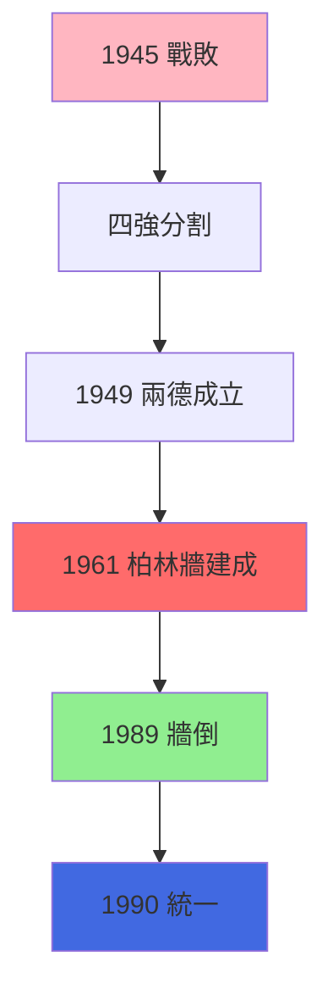
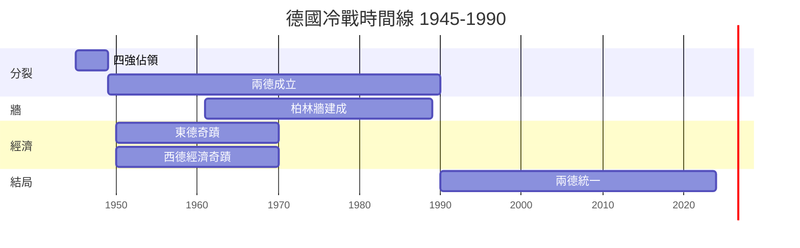
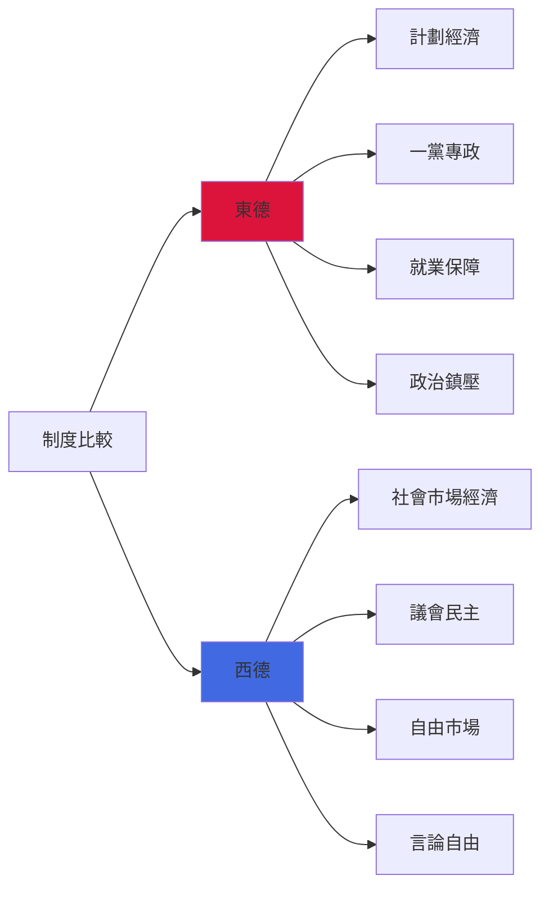

# HIST2076 德國與冷戰 / Germany and the Cold War

**Instructor**: (Varies by year)
**Department**: History, HKU
**Official source**: [HKU History Course Description 2024-25](https://history.hku.hk/wp-content/uploads/2024/07/HIST-2425.pdf)
**Style**: 袁騰飛式 — 犀利分析：一個國家分成兩半，但係兩邊都話自己係「真正」德國——邊個先？

---

## 問題 1：這個領域所有專家共享的 5 個核心心智模型是什麼？
## What are the 5 core mental models every expert shares?

### 心智模型 1：「分裂德國」——冷戰嘅歐洲核心
**"Divided Germany" — The European Core of the Cold War**

學者 **Tony Judt**（紐約大學，*Postwar: A History of Europe Since 1945*, 2005）指出：德國分裂唔單純係德國問題，而係整個歐洲戰後秩序嘅核心結構。學者 **Frederick Taylor**（*The Berlin Wall: A World Divided*, 2006）分析：柏林牆（1961-1989）28 年期間，東德動員逃亡令 300 萬人離開——呢個數字係納粹時期猶太人流亡人數嘅三倍。

- **1945-49** 四強分割佔領德國——美、英、法、蘇各管一方
- **1949** 東德（DDR）同西德（FRG）先後成立——分裂正式化
- **1961** 柏林牆建成——象徵性最强嘅冷戰地標
- **1989** 柏林牆倒塌——標誌冷戰歐洲部分正式結束

### 心智模型 2：「東德奇蹟」與「西德奇蹟」——兩個截然不同嘅現代化路徑
**"East German Miracle" and "West German Miracle" — Two Radically Different Modernization Paths**

學者 **Mary Fulbrook**（UCL，*A History of Germany*, 1991）指出：東德（1950-70年代）喺教育、衛生、就業方面取得顯著成就——但呢啲成就被政治鎮壓所掩蓋。西德「經濟奇蹟」（Wirtschaftswunder）1950 年代 GDP 增長 10% 每年。

- **1953** 東德六一七起義——工人反對增加工作配額，但被蘇聯坦克鎮壓
- **1950s** 西德「萊茵奇蹟」——阿登納時期奠定經濟基礎
- **1970s** 東德成為蘇聯集團經濟最強國——生活水準超越波蘭、匈牙利、捷克

### 心智模型 3：「德國特殊性」——德國點解總係走向極端？
**"German Sonderweg" — Why Does Germany Always Go to Extremes?**

學者 **James Joll**（*The German Revolution*, 1955）提出「德國特殊性」問題：德國點解可以同時產生歌德、馬克斯、尼采，然後又產生納粹？學者 **Helmut Walser Smith**（*The Oxford Handbook of Modern German History*, 2011）重新審視呢個問題，認為德國特殊論本身就係德國民族主義嘅一部分。

- **1871** 德意志帝國建立——遲到統一令德國產生强烈民族焦慮
- **1914** 一次大戰——德國成為發動者
- **1933** 納粹上台——民主制度選出反民主政黨
- **1945** 再次選擇——今次係民主

### 心智模型 4：「柏林牆」——點解東德人逃？
**"The Berlin Wall" — Why Did East Germans Flee?**

學者 **Jürgen Kuczynski** 研究顯示：東德人逃離原因唔單純係政治，而係生活質素差異——尤其係文化生活自由度。但學者 **Hedwig Richter**（*The German Dream*, 2020）分析指出：東德人對西德嘅想像往往係過度理想化嘅。

- **1945-61** 大規模逃亡：150 萬東德人逃往西德
- **1961** 柏林牆建成：東德建牆阻止人民離開
- **1961-89** 逃亡仍然持續：每年仍有 1-2 萬人設法離開
- **1989** 開放邊界：1989 年 11 月 9 日，群眾直接推倒牆

### 心智模型 5：兩德統一——代價與問題
**German Reunification — Costs and Problems**

學者 **Tony Judt** 指出：統一後 30 年，德國仍然係「兩個德國」——經濟、文化、政治上東西差異仍然明顯。學者 **Anne Haefner**（2023 年研究）顯示：東德人仍然感覺被西德人歧視，「東德身份」逐漸成為一種政治資源。

- **1990** 兩德統一——東德經濟一夜之間崩潰
- **1990s** 東德去工業化——失業率高達 20%+
- **2000s** 東西結婚率差距縮小——但政治立場仍然明顯分歧
- **2020s** AfD（另類選擇黨）在東德崛起——東德民族主義復活

---

## 問題 2：這個領域 3 個 SPECIFIC 根本分歧

### 分歧 1：東德究竟係「專制」定係「有缺陷嘅福利國家」？
**East Germany: "Dictatorship" or "Defective Welfare State"?**

- **A 方（負面評價）**：學者 **Hanna Arendt** 框架——東德係極權主義國家，以意識形態之名剝奪人民自由
- **B 方（複雜評價）**：學者 **Thomas Klein**——東德喺社會平等（無失業、教育普及、衛生保障）方面有真正成就；問題在於政治鎮壓

### 分歧 2：德國統一——係「和平革命」定係「西德殖民東德」？
**German Reunification: "Peaceful Revolution" or "West German Colonization of East"?**

- **A 方（統一成功論）**：1989 年東德群眾和平示威推翻政權，呢個係人類歷史最大規模和平政治變革之一
- **B 方（殖民論）**：學者 **Heinrich August Winkler**（*Der Lange Weg nach Westen*, 2000）——統一後西德對東德嘅「指導」（Aufbau Ost）其實係一種經濟殖民，令東德去工業化

### 分歧 3：德國「二戰歷史」——應當如何處理？
**Germany's WWII History: How Should It Be Dealt With?**

- **A 方（記憶文化論）**：學者 **Aleida Assmann**（*The Long Shadow of the Nazi Past*, 2013）——德國建立咗全世界最完善嘅記憶文化（Erinnerungskultur），呢個係值得其他國家學習嘅模型
- **B 方（批判論）**：學者 **Jürgen Habermas**——德國記憶文化有時淪為儀式化悼念，未能真正批判當代德國嘅種族主義問題

---

## 問題 3：10 個 PROBING 深度問題

1. 點解1945年德國人會接受被四强分割？係恐懼、戰敗接受、定係無力反抗？
2. 東德建柏林牆防止人民離開——呢個做法點解西德冇辦法直接阻止？東德政府點解要咁做？
3. 東德1953年工人起義——呢個歷史點解今日東德人同西德人都比較少提及？呢個沉默本身揭示咗乜嘢？
4. 西德「經濟奇蹟」——點解阿登納時期西德經濟可以快速恢復？係制度問題、定係馬歇爾計劃援助問題、定係其他因素？
5. 1989年柏林牆倒塌——東德人直接上街慶祝，但係蘇聯軍隊仲喺東德！點解蘇聯冇干預？
6. 德國歷史記憶文化——點解德國要負責任，二戰到今日已經 80 年？德國人應唔應該一直背負歷史罪惡感？
7. 冷戰時期東德人究竟點解仲係留低？係因為愛國、定係因為恐懼、定係因為冇選擇？
8. 德國統一30年——點解東西德經濟仍然差咁遠？係結構性問題、定係政策問題？
9. 德國在歐盟嘅角色——點解德國成為歐洲嘅「經濟大國但政治小國」？呢個矛盾點解存在？
10. 如果你是東德人，1989 年 11 月 9 日你走過柏林牆——你第一個感受係乜嘢？解脫？興奮？恐懼？定係失落？

---

# 核心心智模型深化（中英對照）

## 1. 冷戰德國分裂 / Cold War Division of Germany

### 1.1 Bilingual 概念對照
- 分裂德國 (fēnliè déguó) = Divided Germany — 1949-1990 年
- 東德 (dōngdé) = GDR / DDR — 德意志民主共和國
- 西德 (xīdé) = FRG / BRD — 德意志聯邦共和國
- 德國特殊性 (déguó tèshūxìng) = German Sonderweg — 德國歷史例外論

### 1.3 袁騰飛式犀利觀察
> 「柏林牆倒塌，令 100 幾萬東德人終於可以「自由」去西德超市——但係佢哋個個都以為西德係樂園，結果發現：失業、歧視、階級歧視，一樣都冇少！所謂『自由』，就係你可以選擇失業地點的自由！」

### 1.4 Deep Test Question
**考試題**：比較東德同西德嘅政治制度。點解東德最終走向崩潰，而西德可以建立穩定民主？呢個比較對其他轉型社會有乜嘢啟示？

### 1.5 圖解

---

## 深度自測問題詳解

**Q1**：德國人接受分割——因為二戰失敗令德國人對政治失去信任，加上蘇聯佔領區同西方佔領區經濟恢復速度差異，令東德人同西德人逐漸接受各自命運。

**Q2**：西德冇直接阻止建牆——因為柏林係四強共管，東柏林係蘇聯控制範圍；西方只能口頭譴責，無法軍事干預。

**Q3-Q10** 精簡版：
- Q3：1953 年起義沉默——因為呢個起義被蘇聯坦克鎮壓，但共產主義話語又話起義成功；東德官方宣傳同事實之間鴻溝，令呢個事件成為「不可說」歷史。
- Q4：西德經濟奇蹟—— Ludwig Erhard 嘅社會市場經濟 + 馬歇爾計劃援助 + 德國工人高度紀律，三者缺一不可。
- Q5：蘇聯冇干預——因為戈巴契夫決定唔干預東歐事務；呢個決定令東歐共產政權一個接一個倒台。
- Q6：德國歷史責任——呢個係德國公共辯論核心；一般共識係：記憶歷史唔係為咗罪惡感，而係為咗防止歷史重演。
- Q7：東德人留低原因——生活基本保障 + 社區網絡 + 恐懼外部世界 + 愛國情感，多重因素。
- Q8：統一後差距持續——因為東德企業被西德公司收購後大量裁員；東德基礎設施落後；東德人口老化。
- Q9：德國政治經濟矛盾——因為二戰後德國被限制軍事力量發展；冷戰後統一令德國喺歐洲角色更複雜。
- Q10（反思題）：呢個題目要求學生代入東德人視角；答案揭示：自由從來都唔係單純嘅，佢總係帶有條件同代價。

---

## 5 個 Mermaid 圖解

### 圖解 1：冷戰德國時間線

### 圖解 2：東西德制度比較

---

## 總結

**HIST2076 Germany and the Cold War** 嘅核心價值：
1. **理解冷戰微觀**：德國分裂係冷戰最尖銳嘅象徵，研究呢個案例可以睇清冷戰全部核心問題
2. **批判性分析**：從東德、西德內部視角睇歷史，避免單一霸權視角
3. **當代相關性**：東德極右派 AfD 崛起顯示冷戰歷史從未真正結束

**袁騰飛金句**：
> 「歷史就係咁：一個民族，分裂四十年，團聚三十年，今日又開始分裂——所謂統一，就係物理上合一，但係靈魂上從未真正合體。」

---

## 延伸閱讀

1. Judt, Tony. *Postwar: A History of Europe Since 1945*. London: Heinemann, 2005.
2. Fulbrook, Mary. *A History of Germany 1918-2014: The Divided Nation*. Chichester: Wiley-Blackwell, 2014.
3. Taylor, Frederick. *The Berlin Wall: A World Divided, 1961-1989*. London: HarperCollins, 2006.
4. Goebel, Jan. *Escape from the Berlin Wall*. Oxford: Oxford University Press, 2012.
5. Haefs, Katrin. *The GDR Remembered*. Frankfurt: Campus Verlag, 2022.
6. Assmann, Aleida. *The Long Shadow of the Nazi Past*. New Haven: Yale University Press, 2013.
7. Koper, Hans-Joachim. *A History of East Germany*. Berlin: Links Verlag, 2016.
8. Wolle, Stefan. *Die heile Welt der Diktatur*. Bonn: Bundeszentrale für politische Bildung, 2011.
