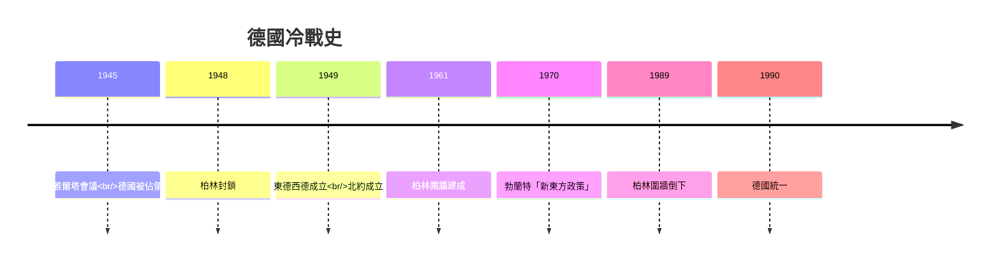
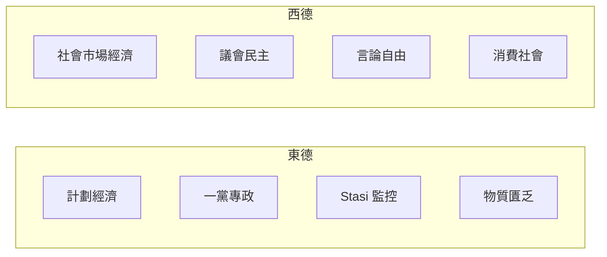
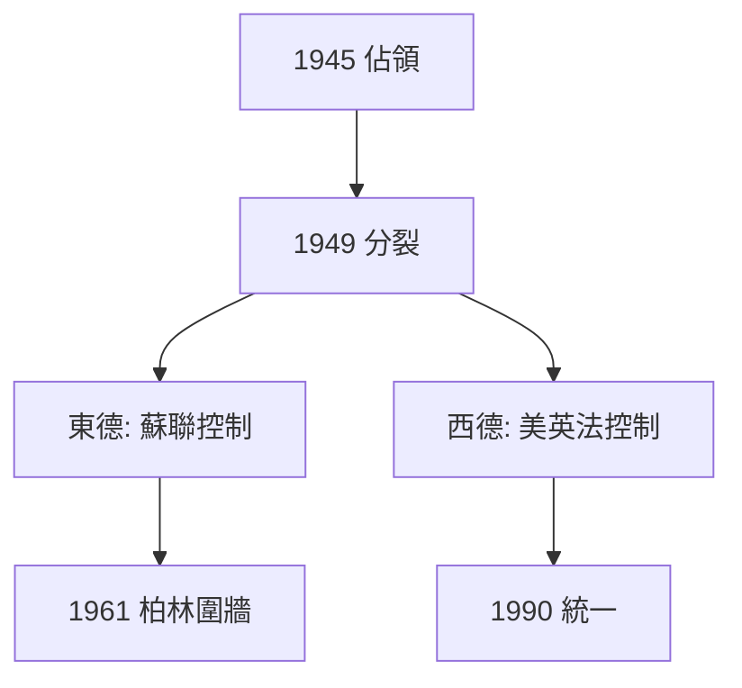
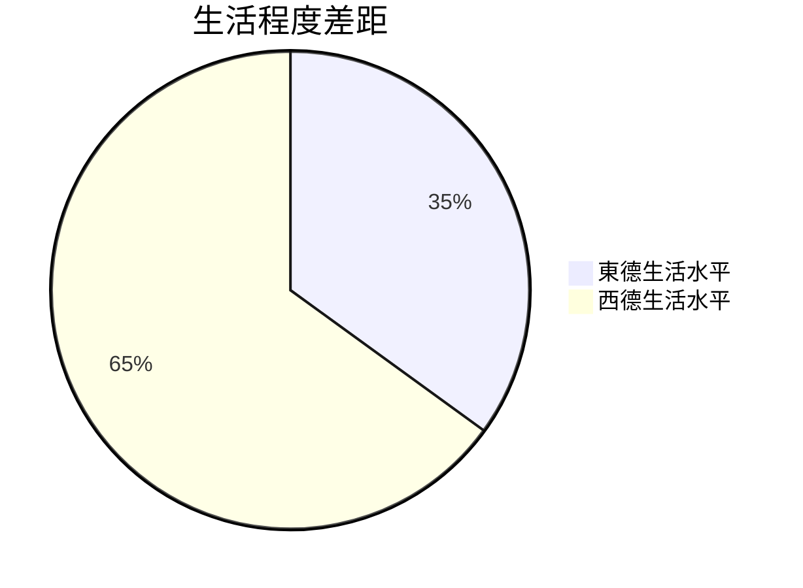
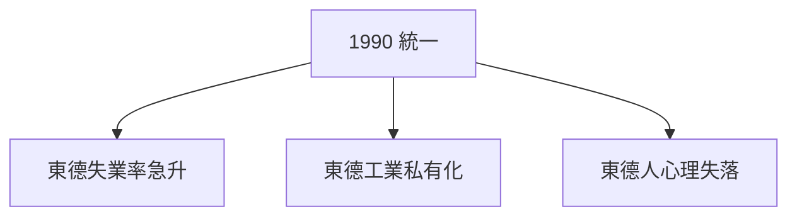

# HIST2076 德國與冷戰 / Germany and the Cold War (6 credits)

**Instructor**: Thomas Soden
**Department**: History, HKU  
**Official source**: [HKU History Course Description 2024-25](https://history.hku.hk/wp-content/uploads/2024/07/HIST-2425.pdf)
**Style**: 袁騰飛式 — 犀利、聚焦德國點解成為冷戰核心

---

## 問題 1：這個領域所有專家共享的 5 個核心心智模型

### 心智模型 1：德國問題 (Die deutsche Frage)
學者 **Hans-Ulrich Wehler** (柏林自由大學) 提出：「德國問題」——德國統一係歐洲穩定威脅定歐洲整合催化劑？呢個問題困擾歐洲外交 150 年。

學者 **Heinrich August Winkler** (*Germany: The Long Road West*, 2006) 分析：1871 年統一後，德國成為歐洲霸權威脅；1945 年後，德國成為歐洲一體化核心。

- 1871 統一 → 1914 大戰
- 1945 佔領 → 1990 再統一 → 歐盟核心

### 心智模型 2：兩德模式 (ZweiDeutschland)
學者 **Mary Fulbrook** (UCL, *A History of Germany*, 2004) 分析：東德西德唔只係意識形態不同，而係兩種完全唔同嘅現代性實驗——西德市場經濟+議會民主；東德國家社會主義+一黨專政。

學者 **Herfried Münkler** 研究：兩德模式揭示意識形態競爭如何影響日常生活的每個層面。

### 心智模型 3：冷戰作為歐洲一體化催化劑
學者 **John Gillingham** (*European Integration*, 1991) 指出：冷戰逼使西歐國家團結——1948 年柏林封鎖、1949 年北約成立——歐洲一體化就係冷戰 child。

學者 **Tony Judt** (*Postwar: A History of Europe*, 2005) 強調：歐洲福利國家係冷戰時期建立——為咗對抗共產主義吸引力。

### 心智模型 4：Stasi 與監控國家
學者 **Timothy Garton Ash** (*The File*, 2013) 研究東德秘密警察檔案：Stasi 監控無處不在——2800 萬人口中，1700 萬被建立過檔案。呢個揭示極權主義如何渗透日常生活。

學者 **Stefan Heym** 等東德異見者記錄：創傷 psychology of surveillance。

### 心智模型 5：德國統一嘅歷史代價
學者 **Ian Kershaw** (*Hitler*, 1998) 提醒：1933-1945 年納粹德國造成人類歷史上最大規模嘅有組織暴力——600 萬猶太人死亡、2000 萬蘇聯公民死亡。統一德國至今仍喺處理緊呢個歷史遺產。

---

## 問題 2：3 個根本分歧

### 分歧 1：德國統一——歷史必然定偶然？
- **A 方**：歷史結構論
  - **Hans-Ulrich Wehler**
  - 德國地理位於東歐西歐之間，遲早要選擇一方
- **B 方**：歷史偶然論
  - **Winston Churchill**
  - 統一係偶然事件造成——1871 年普法戰爭勝利

### 分歧 2：西德「經濟奇蹟」——奇蹟定階級剝削？
- **A 方**：Frederick Harriessen (*The Rise of Modern Germany*, 1996)
  - 战后西德快速恢復係制度優勢結果
- **B 方**：Alexandra Richie (*Faust's Metropolis*, 1998)
  - 經濟起飛基於戰時剥削剩餘、女人勞動力

### 分歧 3：兩德統一——成功定製造新問題？
- **A 方**：東德自由化係東歐1989革命一部分
- **B 方**：統一條款不公平——西德强加經濟秩序
  - **Mary Fulbrook** 指出：統一後東德失業率持續高企

---

## 問題 3：10 個深度問題

1. 如果冷戰冇爆發，歐洲會點樣？
2. 點解東德人喺 1989 年突然上街？——經濟原因定意識形態危機？
3. Stasi 檔案揭示監控文化——點解東德人願意互相監控？
4. 德國統一後東德人點解仍然感覺係「二等公民」？
5. 如果東德唔係社會主義，會唔會有更好嘅選擇？
6. 點解德國人可以接受納粹歷史但仍然有新納粹？
7. 歐盟最大嘅問題就係德國——點解？
8. 如果你是 1945 年佔領德國嘅美國决策者，點樣避免冷戰？
9. 點解東德比西德更像史太林主義蘇聯？
10. 德國作為歐洲最大經濟體——經濟實力應唔應該轉化為軍事力量？

---

## 核心心智模型深化

### 1. 冷戰時間線

### 2. 東德西德比較

---

## 5 個 Mermaid 圖解

### 📊 Diagram 1: 冷戰時期德國分裂

### 📊 Diagram 2: 德國問題歷史迴圈

### 📊 Diagram 3: 兩德生活程度比較

### 📊 Diagram 4: Stasi 監控規模

### 📊 Diagram 5: 德國統一代價

---

## 總結

1. 德國問題困擾歐洲 150 年
2. 冷戰創造兩種現代性實驗
3. 東德監控系統揭示極權主義日常化
4. 統一代價仍在——東德仍是「落後地區」
5. 德國歷史提醒：統一唔係終點

**最後辛辣問題**: 德國可以成為正常國家嗎？歷史包袱幾時先至放得低？

---
**版權所有 © HKU History Self-Study**
