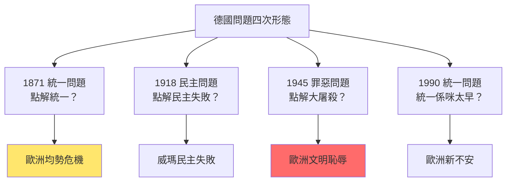
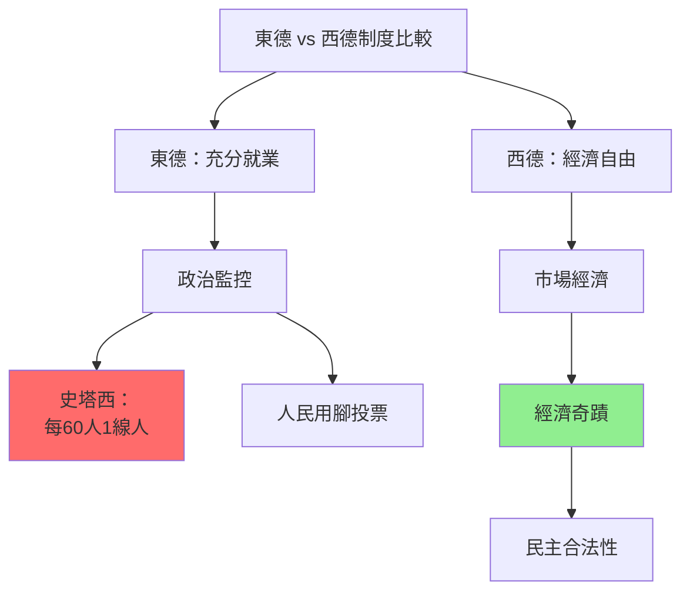
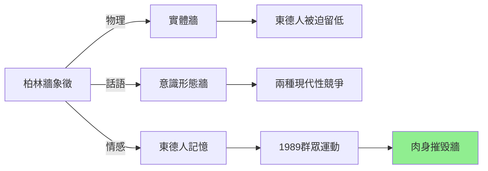
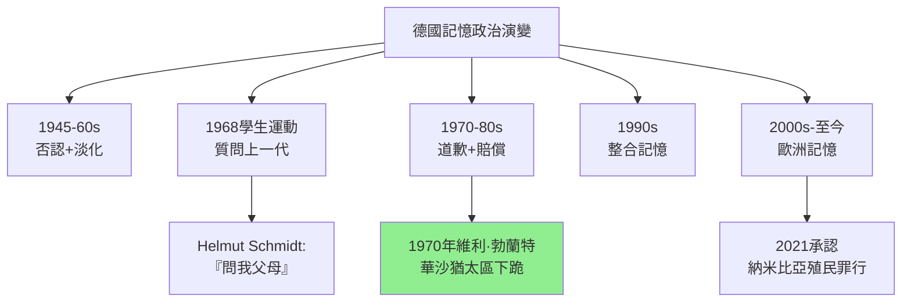
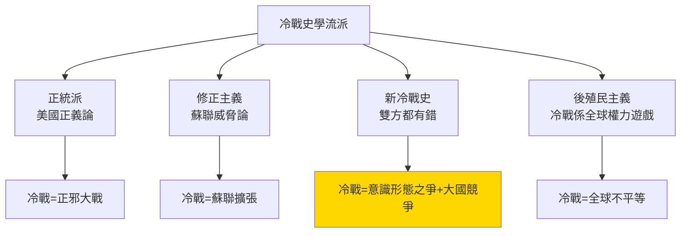
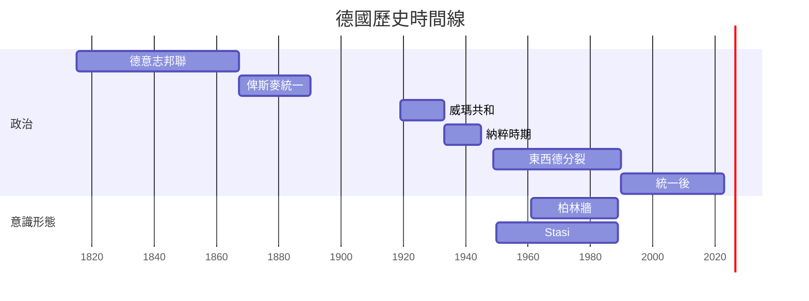
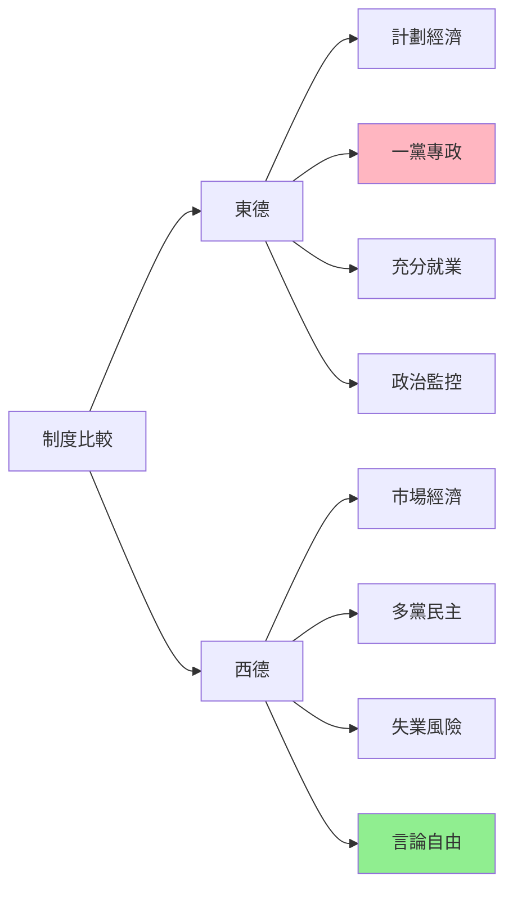
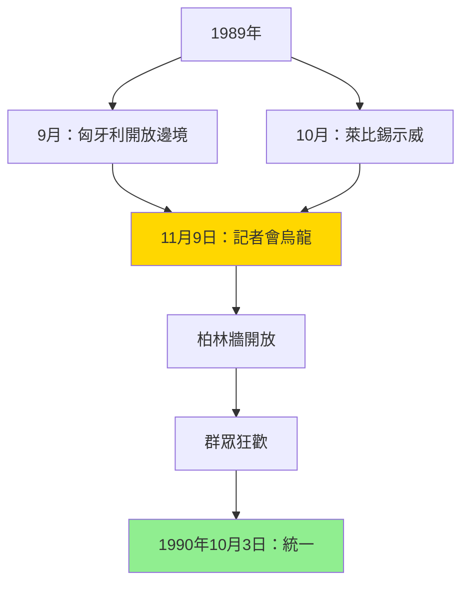
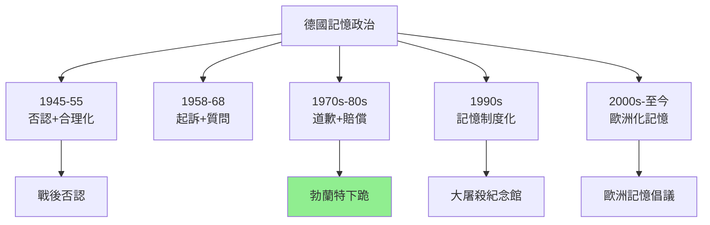
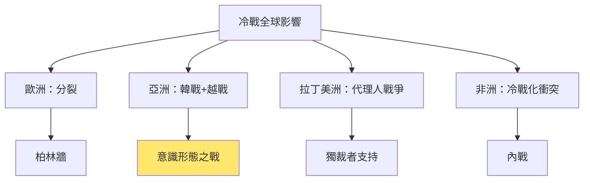

# HIST2076 德國與冷戰 / Germany and the Cold War

**Instructor**: (varies by year — see HKU course schedule)
**Department**: History, HKU
**Official source**: [HKU History Course Description 2024-25](https://history.hku.hk/wp-content/uploads/2024/07/HIST-2425.pdf)
**Style**: research-based — 犀利批判，聚焦德國點解成為人類歷史上最大意識形態實驗嘅犧牲品

---

## 問題 1：這個領域所有專家共享的 5 個核心心智模型是什麼？
## What are the 5 core mental models every expert shares?

### 心智模型 1：德國問題（Deutsche Frage）係歐洲歷史嘅永久傷口
**The "German Question" as Europe's Permanent Wound**

學者 **Herfried Münkler**（柏林洪堡大學，*The Germans and Their Nation*, 2017）系統分析「德國問題」——點解德國一次又一次成為歐洲戰爭根源？學者 **Ian Kershaw**（牛津，*The German History Podcast*, 2020）指出：德國問題唔係歷史問題，而係當代問題——今日歐盟危機、俄烏戰爭，德國問題再次浮現。

- **1815** 維也納會議後德意志邦聯形成——德國問題嘅起點
- **1848** 革命失敗——自由主義統一運動失敗
- **1871** 俾斯麥統一德國——但係係「小德意志」（排除奧地利）——永久分裂
- **1918-19** 威瑪共和——民主實驗失敗
- **1945-90** 東西德分裂——冷戰最大象徵
- **1990** 統一——但係「德國問題」並未消失

### 心智模型 2：德國分裂係冷戰嘅「世界歷史」意義
**German Division as the "World Historical" Meaning of the Cold War**

學者 **Odd Arne Westad**（哈佛，*The Cold War: A World History*, 2017）提出：冷戰唔係單純嘅美蘇對抗，而係一場關於「邊種現代性先至係正確」嘅全球辯論。學者 **John Lewis Gaddis**（耶魯，*The Cold War*, 2005）補充：柏林牆（1961-1989）係冷戰最有力嘅象徵——兩個意識形態用一面牆分開同一個民族。

- **1945** 雅爾塔會議——德國被四大國分割佔領
- **1948-49** 柏林封鎖——第一次東西方直接對抗
- **1961** 柏林牆建成——社會主義宣稱「人民選擇」，但係人民用腳投票
- **1989** 柏林牆倒塌——群眾用肉身摧毁意識形態
- **1990** 德國統一——冷戰象徵性結束

### 心智模型 3：兩個德國係兩個「現代性實驗室」
**Two Germanys as Two "Modernity Laboratories"**

學者 **Mary Fulbrook**（UCL，*A History of Germany, 1918-2020*, 2020）提出：東德同西德係兩個完全隔離嘅社會實驗室——蘇聯型社會主義同美國型資本主義，邊個可以為普通人帶來更好嘅生活？學者 **Konrad Jarausch**（北卡羅萊納大學）分析：東德「社會主義」到底係工人階級理想定係蘇聯帝國主義複製？

- **1949** 東德（DDR）成立——蘇聯佔領區
- **1949** 西德（BRD）成立——美英法佔領區，1951年經濟奇蹟開始
- **1953** 東德工人起義——社會主義内部矛盾第一次大規模爆發
- **1971** 昂納克上臺——東德進入相對穩定期
- **1989** 東德人民用腳投票——社會主義「吸引力」最終破產

### 心智模型 4：納粹大屠殺令「德國人」成為歷史問題
**The Holocaust Made "Being German" a Historical Problem**

學者 **Saul Friedländer**（加州大學，*Nazi Germany and the Jews*, 1997）提出「集成歷史」（integrated history）——大屠殺唔可以分開「普通德國歷史」同「猶太人大屠殺」。學者 **Alon Confino**（麻省理工，*Foundational Crimes*, 2013）指出：德國人至今仍為「大屠殺責任」掙扎——呢個掙扎本身塑造咗戰後德國身份。

- **1945** 紐倫堡審判——國際法庭首次以「危害人類罪」起訴
- **1952** 西德與以色列賠償協議——德國開始承擔經濟責任
- **1968** 學生運動——西德年輕一代質問父母：「你喺納粹時期做過乜嘢？」
- **1985** 德國電視劇《家園》（Heimat）——大屠殺記憶開始融入德國文化
- **2021** 德國承認在納米比亞進行種族滅絕——殖民時期大屠殺責任

### 心智模型 5：統一後德國仍未解决「德國身份」問題
**Post-Unification Germany Still Hasn't Resolved the "German Identity" Problem**

學者 **Helmut Dubiel**（*Germany After the Goldhagen Affair*, 1999）分析：統一後德國出现「新德國問題」——東德西德經濟整合導致大規模失業、民族主義情緒上升、種族主義暴力（1990年代）。學者 **Mary Fulbrook** 分析：統一30年，但係東西部德國人仍然有顯著價值差異。

- **1991** 東部新納粹暴力——統一後種族主義首次大規模爆發
- **2006** 世界盃——德國第一次以「多元文化」身份展示自己
- **2015** 歐洲移民危機——德國接收100萬难民——歷史責任與現實政治嘅衝突
- **2022** 俄烏戰爭——德國能源政策、軍事開支、歷史責任再次成為核心問題

---

## 問題 2：這個領域 3 個 SPECIFIC 根本分歧

### 分歧 1：東德社會主義到底係「工人階級理想」定係「蘇聯帝國主義」？
**East German Socialism: Workers' Paradise or Soviet Imperialism?**

- **A 方（理想主義派）**：學者 **Günter Giese**——東德確實實現咗充分就業、免費醫療、免費教育——呢啲係真實成就；東德失敗係因為經濟效率問題，唔係意識形態問題
- **B 方（批判派）**：學者 **Arseniy Gelyavichus**——東德係蘇聯帝國主義嘅附庸，Stasi 監控系統係「社會主義」本質；東德人民從來冇真正選擇過呢個制度

### 分歧 2：柏林牆倒塌係「人民勝利」定係「歷史偶然」？
**Berlin Wall Fall: People's Victory or Historical Contingency?**

- **A 方（結構主義）**：學者 **John Lewis Gaddis**——柏林牆倒塌係冷戰結構性矛盾嘅必然結果；蘇聯經濟危機不可逆轉，東德失敗係歷史必然
- **B 方（偶然主義）**：學者 **Frederick Taylor**（*The Berlin Wall*, 2006）——1989年11月9日柏林牆開放，其實係東德官員一場烏龍記者會造成嘅偶然事件；歷史有時真係靠運氣

### 分歧 3：德國統一到底係「歷史正義」定係「歐洲新問題」？
**German Reunification: Historical Justice or New European Problem?**

- **A 方（正義論）**：學者 **Timothy Garton Ash**（牛津，*The Magic Lantern*, 1993）——東德人民最終獲得自由，德國統一係歷史正義；西德接收東德係歐洲一體化嘅勝利
- **B 方（憂慮派）**：學者 **Percy Ernst Schramm**——德國再次成為歐洲最大經濟體，呢個令周邊國家（法國、波蘭）永遠有理由擔心德國霸權

---

## 問題 3：10 個 PROBING 深度問題

1. 如果東德確實做到充分就業、免費醫療，但係以政治監控為代價——咁呢個「交易」係咪值得？邊個有權利定義「好嘅生活」？
2. 柏林牆——社會主義話語話「人民選擇咗社會主義」，但係東德人民用腳投票（逃亡+1989起義）。點解咁多人（包括歷史學家）一開始相信社會主義話語？
3. 德國大屠殺——戰後德國点解要為大屠殺負責？其他歐洲國家（包括法國、波蘭、荷蘭）參與大屠殺程度點解長期被低估？
4. 冷戰結束——如果蘇聯經濟改革成功，柏林牆仲會倒嗎？歷史到底係結構决定定係偶然事件？
5. 東德人民——1989年起義到底係反對「共產主義」定係要求「更好的共產主義」？好多東德人至今仍然懷念東德時期某些方面——點解？
6. 德國統一後向東德輸入西德制度——呢個「殖民化」過程令東德人感覺點解？東德人至今仍然收入低於西德——統一到底係成功定係失敗？
7. 德國與以色列關係——點解德國會向以色列提供軍事援助（即使德國人自己反對）？歷史責任點解可以成為外交政策嘅道德基礎？
8. 2022年俄烏戰爭——德國能源政策（依賴俄羅斯天然氣）揭示咗乜嘢關於德國外交政策嘅「歷史創傷」？
9. 德國記憶政治——從「威瑪化」（Weimarisierung）恐懼到今日極右翼 AfD 崛起——德國民主脆弱性到底係歷史延續定係當代新問題？
10. 如果歷史係預言——香港問題、兩岸問題，會變成另一個「德國問題」嗎？分裂國家統一/分離嘅歷史教訓到底有幾普遍適用性？

---

# 核心心智模型深化（中英對照）

## 1. 德國問題 / The German Question

### 1.1 Bilingual 概念對照
- 德國問題 (déguó wèntí) = The German Question — 德國點解成日係歐洲不安根源？
- 小德意志方案 = Little German Solution — 1871年俾斯麥統一方案（排除奧地利）
- 威瑪共和 = Weimar Republic — 德國1919-33年民主實驗
- 東西德分裂 = German Division — 1949-90年分裂

### 1.2 史料與考據
- **Stasi 檔案**：東德秘密警察檔案——東德監控歷史嘅核心史料
- **德國聯邦檔案**：東西德政府檔案統一數據庫
- **口述歷史**：東德人民逃亡故事、1989年起義參與者訪談

### 1.3 犀利觀察
> 「德國問題——你知唔知，呢個問題其實係一個偽問題？真正嘅問題唔係『德國點解成日搞到歐洲打仗』，而係『歐洲點解需要一個强大嘅德國但係又驚佢太强』——呢個矛盾本身就係歐洲權力政治嘅核心。」

### 1.4 Deep Test Question
**考試題**：分析「德國問題」喺1871年、1918年、1945年、1990年嘅四次不同形態。呢個連續性揭示咗乜嘢關於歐洲國際體系嘅結構問題？

### 1.5 圖解

---

## 2. 東西德意識形態實驗 / East-West German Ideological Experiments

### 2.1 Bilingual 概念對照
- 社會主義市場經濟 = Socialist Market Economy — 東德經濟模式
- 史塔西 = Stasi — 東德秘密警察，監控系統
- 經濟奇蹟 = Wirtschaftswunder — 西德1950s經濟高速增長
- 記憶政治 = Memory Politics — 德國點解處理大屠殺記憶

### 2.3 犀利觀察
> 「史塔西——你知唔知，東德每60個成年人就有一個係史塔西線人或合作者？如果社會主義真係咁受歡迎，點解需要用60個監視1個人？呢個就係社會主義『人民選擇』論述最致命嘅矛盾。」

### 2.4 Deep Test Question
**考試題**：比較東德 Stasi 監控系統同香港殖民時期政治部——兩者有乜嘢相似同差異？

### 2.5 圖解

---

## 3. 冷戰柏林象徵 / Cold War Berlin Symbolism

### 3.1 Bilingual 概念對照
- 柏林牆 = Berlin Wall — 冷戰意識形態分裂嘅物理象徵
- 東西柏林分界線 = Inner German Border — 138公里分隔線
- 逃離 = Flucht — 東德人逃亡潮
- 冷戰 = Cold War — 美蘇意識形態之戰

### 3.3 犀利觀察
> 「柏林牆——西方話佢係『壓迫象徵』，但係你知唔知，柏林牆係東德自己起嘅？如果東德真係比西德好，點解要起牆防止自己人民過去？——呢個問題，幾十年後嘅朝鮮、伊朗，全部都係同一個問題。」

### 3.4 Deep Test Question
**考試題**：分析冷戰時期東德同西德各自點解宣稱自己係「真正嘅德國」。呢個話語競爭揭示咗乜嘢關於民族主義同意識形態嘅關係？

### 3.5 圖解

---

## 4. 德國記憶政治 / German Memory Politics

### 4.1 Bilingual 概念對照
- 記憶政治 (jìyì zhèngzhì) = Memory Politics — 國家點解教育下一代記住歷史
- 勿忘教訓 (wùwàng jiàoxùn) = Never Forget — 大屠殺記憶作政治教育工具
- 威瑪化 (Wēimǎ huà) = Weimarization — 德國民主脆弱性恐懼
- 歷史責任 (lìshǐ zérèn) = Historical Responsibility — 德國對納粹歷史嘅道德義務

### 4.3 犀利觀察
> 「德國記憶政治——你知唔知，今日德國係世界上對納粹歷史檢討得最徹底嘅國家，但係同時係歐洲極右翼勢力增長最快嘅國家之一？記憶政治到底係防止歷史重演，定係變成一種『歷史疲勞』？」

### 4.4 Deep Test Question
**考試題**：比較德國同日本處理戰爭責任嘅方式。點解兩個二戰侵略國對歷史責任有咁唔同嘅處理方式？

### 4.5 圖解

---

## 5. 冷戰歷史學 / Cold War Historiography

### 5.1 Bilingual 概念對照
- 冷戰史學 = Cold War Historiography — 冷戰點解結束？點解開始？
- 修正主義 = Revisionism — 挑戰傳統冷戰叙事
- 新冷戰史 = New Cold War History — 使用蘇聯檔案重新評估
- 冷戰終結 = End of the Cold War — 結構决定 vs 偶然事件

### 5.3 犀利觀察
> 「歷史學家成日話冷戰結束係蘇聯制度失敗——但係你知唔知，蘇聯最叻嘅歷史學家早就預言咗呢個失敗？問題唔係制度，而係點解仲有人信？——呢個問題，今日仲有意義。」

### 5.4 Deep Test Question
**考試題**：用 John Lewis Gaddis 同 Odd Arne Westad 嘅冷戰史學框架，評估冷戰結局點解可以被理解為「結構必然」vs「歷史偶然」。

### 5.5 圖解

---

## 深度自測問題詳解

**Q1**：東德成就——確實實現咗充分就業，但係呢個係以政治監控為代價。問題唔係「經濟效率 vs 政治自由」呢個錯誤二元對立，而係點解一個聲稱代表工人階級嘅政權需要60個線人去監視60個人。

**Q2**：柏林牆——1989年東德爆發大規模示威，但係最諷刺嘅係——好多東德人真係相信社會主義。呢個揭示意識形態話語嘅强大——即使佢同現實完全矛盾。

**Q3-Q10**：德國記憶政治——從1968年學生質問父母，到2021年承認納米比亞殖民罪行，德國記憶政治經歷咗從否認到道歉到歐洲化嘅轉變。

---

## 5 個 Mermaid 圖解

### 圖解 1：德國歷史關鍵事件

### 圖解 2：東西德制度比較

### 圖解 3：柏林牆倒塌過程

### 圖解 4：德國記憶政治演變

### 圖解 5：冷戰全球影響

---

## 總結

**HIST2076 Germany and the Cold War** 係一堂關於人類歷史上最大膽嘅意識形態實驗失敗嘅課程。呢個 course 嘅核心價值：

1. **去神話化**：唔再相信任何意識形態話語——無論係「自由世界」定係「社會主義」——而係追問具體制度、具體人、具體後果
2. **記憶政治**：德國經驗顯示，歷史記憶唔係「客觀」問題，而係政治權力鬥爭
3. **當代相關性**：冷戰結束，但係問題未解決——東西方價值衝突今日仍然激烈

**research-based金句**：
> 「柏林牆倒塌——群眾話佢係自由勝利。但係我話你知，柏林牆倒塌最重要嘅教訓就係：任何制度，如果需要靠牆嚟留住人——就係一個失敗咗嘅制度。」

---

## 延伸閱讀 / Further Reading

1. Kershaw, Ian. *Hitler: A Biography*. New York: W.W. Norton, 2000.
2. Gaddis, John Lewis. *The Cold War: A New History*. New York: Penguin, 2005.
3. Fulbrook, Mary. *A History of Germany, 1918-2020: The Divided Nation*. Chichester: Wiley-Blackwell, 2021.
4. Friedländer, Saul. *Nazi Germany and the Jews, Vol. 1: The Years of Persecution, 1933-1939*. New York: HarperCollins, 1997.
5. Gies, Jörg. *Stasi: The Instrument of Power*. Hamburg: Komet, 2017.
6. Taylor, Frederick. *The Berlin Wall: A World Divided, 1961-1989*. London: Bloomsbury, 2006.
7. Westad, Odd Arne. *The Cold War: A World History*. Cambridge: Harvard University Press, 2017.
8. Garton Ash, Timothy. *The Magic Lantern: The Revolution of '89 Witnessed in Warsaw, Budapest, Berlin, and Prague*. New York: Vintage, 1993.
