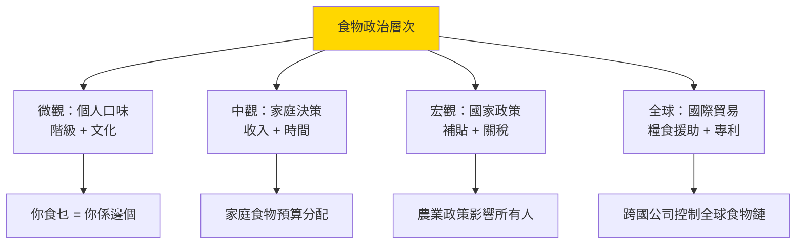
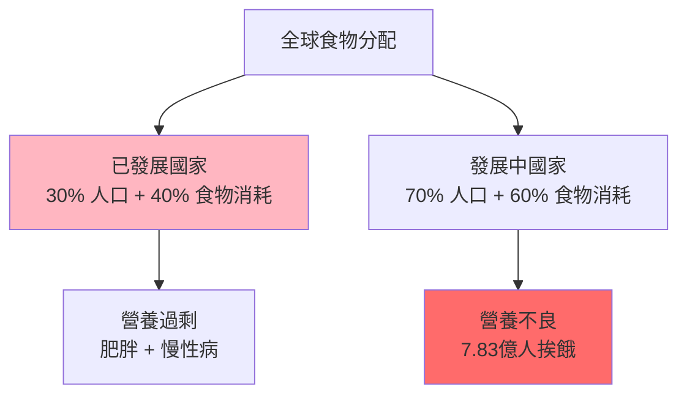
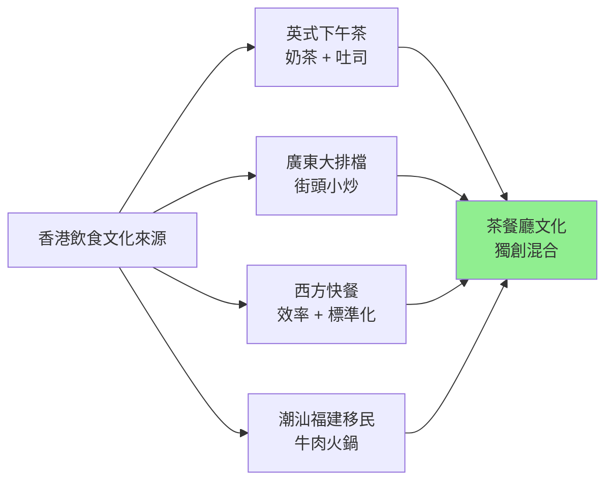

# HIST2077 吃的歷史 / Eating History: Food Culture from the 19th Century to the Present

**Instructor**: Staci Ford
**Department**: History, HKU
**Official source**: [HKU History Course Description 2024-25](https://history.hku.hk/wp-content/uploads/2024/07/HIST-2425.pdf)
**Style**: 袁騰飛式 — 犀利揭穿：食物從來唔係單純填飽肚，而係階級、帝國、身份認同嘅戰場

---

## 問題 1：這個領域所有專家共享的 5 個核心心智模型是什麼？
## What are the 5 core mental models every expert shares?

### 心智模型 1：「食物即政治」——吃從來唔係中性的
**"Food is Political" — Eating Is Never Neutral**

學者 **Michele R. J. R. Katz**（*Salt: A World History*, 2001）指出：鹽——呢個最基本嘅調味品——喺歷史上曾經係貨幣、藥物、宗教象徵、戰略物資。學者 **Michael Pollan**（*Food Rules*, 2010）話：你食乜嘢，你就係乜嘢人。

- **古羅馬**：軍餉用鹽支付——salary（薪金）就係來自 sal（鹽）
- **中國古代**：鹽鐵專營——鹽稅係歷代政府最重要收入之一
- **19 世紀英國**：工人階級食物——茶 + 麵包 + 少量肉——構成「工人階級飲食」
- **現代中國**：食物浪費——每年 1,700 萬噸食物被浪費——等於整個德國人口一年所需熱量

### 心智模型 2：「食物帝國主義」——全球化飲食點樣摧毁本土文化
**"Food Imperialism" — How Globalized Diet Destroys Local Culture**

學者 **Arjun Appadurai**（*How to Make a National Cuisine*, 1988）指出：當一種飲食文化被標準化為「國家飲食」——例如印度咖喱、日本料理——呢個過程本身就係帝國主義話語建構。學者 **Warren Belasco**（*Appetite for Change*, 1989）分析美式快餐點樣成為全球飲食帝國主義工具。

- **1840s-1900s** 英國茶文化席捲全球——從印度茶園到香港茶樓
- **1950s-** 美式快餐全球擴張——麥當勞 1967 年喺加拿大開第一間海外分店，今日全球 38,000 間
- **2000s** 中國飲食全球擴張——全世界的「中國餐館」

### 心智模型 3：「階級飲食差異」——你食乜決定你係邊個
**"Class-Based Food Difference" — What You Eat Defines Who You Are**

學者 **Steven Shapin**（哈佛，*The Cultural History of Taste*, 2006）指出：自 18 世紀以來，飲食品味成為階級標誌——上層階級食法國菜、飲葡萄酒；工人階級食炸魚薯條、飲啤酒。學者 **Jack Goody**（劍橋，*Cooking, Cuisine and Class*, 1982）用比較方法分析飲食點樣成為階級標誌。

- **維多利亞英國**：上層食法式大餐，工廠工人食茶 + 白麵包
- **20 世紀美國**：中產階級強調「健康飲食」，工人階級被迫接受加工食品
- **今日香港**：蘭芳園絲襪奶茶（上環）vs 麥當勞快餐

### 心智模型 4：「食物安全」——歷史周期性嘅恐饉荒
**"Food Security" — The Historical Cycle of Famine and Plenty**

學者 **Amartya Sen**（諾貝爾經濟學獎得主，*Poverty and Famines*, 1981）提出革命性論點：饉荒唔係因為食物總量不足，而係因為分配不均！學者 **Cormac Ó Gráda**（*Black '47*, 2015）分析歷史上有系統性饉荒都涉及政治因素。

- **1845-1852** 愛爾蘭大饉荒——100 萬人死亡、100 萬人移民——英國繼續出口食物
- **1959-61** 中國大饉荒——學者估計 1,500-4,500 萬人死亡——毛澤東農業政策失誤
- **2023** 全球仍有 7.83 億人長期挨餓——但全球食物總產量足夠養活 150 億人

### 心智模型 5：「食物記憶」——味道如何承載歷史身份
**"Food Memory" — How Taste Carries Historical Identity**

學者 **Sutton**（*Remembrance of Repasts*, 2001）提出「食物記憶」理論——味道係最強大嘅記憶載體，可以唤起已經消失嘅過去。學者 **Dana Shiffrin** 分析：食物記憶永遠係「創造性記憶」——我哋記住嘅唔係真正嘅味道，而係我哋想要記住嘅味道。

- **香港茶餐廳文化**：絲襪奶茶 + 菠蘿油——唔係英國茶文化，但係從英國下午茶改造嚟
- **潮州牛肉火鍋**：代表潮汕移民身份認同
- **日本媽媽便當**：戰後日本母親用便當重建家庭溫暖記憶

---

## 問題 2：這個領域 3 個 SPECIFIC 根本分歧

### 分歧 1：美式快餐——係「文化帝國主義」定係「消費者自由選擇」？
**American Fast Food — Cultural Imperialism or Consumer Freedom?**

- **A 方（帝國主義批判）**：學者 **George Ritzer**（*The McDonaldization of Society*, 1993）——麥當勞代表理性化、標準化、控制——呢啲係現代性負面面向
- **B 方（市場自由派）**：學者 **Tyler Cowen**（*In Praise of Fast Culture*, 2018）——快餐提供消費者想要的：快、便宜、味道穩定——呢個係市場民主

### 分歧 2：傳統飲食消失——係「文化損失」定係「歷史必然」？
**Disappearance of Traditional Diet — Cultural Loss or Historical Necessity?**

- **A 方（文化保護派）**：學者 **Michele R. J. R. Katz**——傳統飲食係幾百年文化累積結果，消失就係人類多樣性嘅損失
- **B 方（現代化派）**：學者 **Mark Bittman**——工業化食物生產養活咗全球 80 億人，傳統小農經濟從來都唔可能養活咁多人

### 分歧 3：食物里程（Food Mile）——環保定係階級問題？
**Food Miles — Environmental or Class Issue?**

- **A 方（環保派）**：學者 **Timothy Lang**（*Food Wars*, 2015）——食物里程代表碳排放——本地食物 = 環保
- **B 方（批評派）**：學者 **Hannah Ritchie**（Our World in Data）——研究顯示食物里程只佔食物碳足跡 5-10%；真正問題係肉類消費同食物浪費，而非距離

---

## 問題 3：10 個 PROBING 深度問題

1. 點解香港茶餐廳咁好味？佢代表邊一種文化混合——英國下午茶 + 廣東大排檔 + 西方快餐？
2. 中國八大菜系——點解歷史上有四川菜（辣）、粵菜（鮮）、淮揚菜（精緻）之分？呢啲差異係地理因素、歷史因素定係階級因素造成？
3. 愛爾蘭大饉荒（1845-52）——100 萬人餓死，但英國仍然出口食物。呢個歷史揭示咗食物政治乜嘢殘酷真相？
4. 點解世界上好多宗教都有飲食禁忌——猶太教kosher、伊斯蘭halal、印度教唔食牛？呢啲禁忌係純粹宗教，定係階級、環保、身份認同嘅工具？
5. 從「私房菜」到「米芝蓮星級餐廳」——點解「稀有」同「昂貴」成為現代美食標準？呢個標準係邊個建立嘅？
6. 日本便利店的飯糰——統一格式但係又有一百種口味。呢個矛盾揭示咗現代飲食文化乜嘢？
7. 香港街頭美食——咖喱魚蛋、雞蛋仔、老婆餅——點解呢啲「平民美食」逐漸消失？係租金問題、衛生條例問題定係口味改變問題？
8. 食物外交——從法國葡萄酒到日本壽司到韓國泡菜，點解各國政府咁重視推廣自己嘅飲食文化？
9. 如果你去超市，見到「本地有機蔬菜」貴普通蔬菜 3 倍，但係普通蔬菜係用農藥種植。你會點揀？呢個選擇揭示咗你乜嘢價值觀？
10. 從「豬油撈飯」到「iPhone 叫外賣」——香港人 50 年飲食變化揭示咗香港社會乜嘢深層次變化？

---

# 核心心智模型深化（中英對照）

## 1. 食物即政治 / Food is Political

### 1.1 Bilingual 概念對照
- 食物政治 (shíwù zhèngzhì) = Food Politics — 食物從來都係權力遊戲
- 飲食文化 (yǐnshí wénhuà) = Food Culture — 吃乜點食代表整個生活方式
- 鹽鐵專營 (yán tiě zhuānyíng) = Salt-Iron Monopoly — 中國古代國家控制

### 1.3 袁騰飛式犀利觀察
> 「有一個笑話：地球上有一半人日日擔心食物够唔够，另一半人日日擔心食物熱量高唔高——但係呢兩半人唔係住喺地球兩邊，而係住喺同一個城市！」

### 1.4 Deep Test Question
**考試題**：用 Amartya Sen 嘅「權利方法」（entitlement approach）分析點解全球食物總產量足夠養活所有人，但係仍然有 7.83 億人挨餓。呢個分析揭示咗食物安全問題乜嘢根本性質？

### 1.5 圖解

---

## 深度自測問題詳解

**Q1**：香港茶餐廳——係英國殖民飲食 + 廣東本地口味 + 西方快餐效率 + 香港華人創新精神，四者混合嘅獨特文化產品。

**Q2**：八大菜系之所以形成——地理因素（四川濕氣重所以食辣、嶺南靠海所以海鮮鮮活）+ 歷史因素（各朝政治中心不同）+ 階級因素（上層精緻、平民粗獷）。

**Q3-Q10** 精簡版：
- Q3：愛爾蘭大饉荒——英國新自由主義經濟政策令食物繼續出口，呢個係最早嘅「全球化受害者」案例之一。
- Q4：宗教飲食禁忌——呢啲禁忌好多都有實際衛生/環保理由，但係逐漸神聖化之後就唔再需要解釋理由。
- Q5：稀有 + 昂貴 = 美食標準——呢個係資產階級品味話語建構嘅結果，但係底層群眾亦有自己嘅美食標準，只是被邊緣化。
- Q6：日本便利店矛盾——統一格式 + 多樣口味 = 現代性消費主義嘅核心邏輯。
- Q7：香港街頭美食消失——租金上漲係最直接原因，但係背後係香港地產霸權、衛生條例收緊、群眾口味西方化三個因素。
- Q8：食物外交——日本喺 2013 年成功申請「和食」為 UNESCO 非物質文化遺產；呢個係軟實力策略。
- Q9（反思題）：呢個係消費選擇背後嘅階級問題——有錢人可以選擇健康食物，没錢人只能選擇便宜加工食品。
- Q10：從豬油撈飯到iPhone叫外賣——呢個係香港从「經濟起飛」到「金融中心」到「中產階級消費社會」嘅變化縮影。

---

## 5 個 Mermaid 圖解

### 圖解 1：全球食物不平等

### 圖解 2：香港飲食文化混融

---

## 總結

**HIST2077 Eating History** 嘅核心價值：
1. **跨學科方法**：食物史需要歷史 + 人類學 + 經濟學 + 營養學
2. **日常生活政治**：最普通嘅飲食行為，其實係整個人類權力結構嘅縮影
3. **批判性素養**：從「你食乜」睇清楚社會不平等

**袁騰飛金句**：
> 「你以為你食乜係你自己話事——但係你知唔知，你食嘅每一口，都係整個全球食物體系嘅產品？你以為你有選擇，其實係全球食物公司幫你揀！」

---

## 延伸閱讀

1. Mintz, Sidney W. *Sweetness and Power: The Place of Sugar in Modern History*. New York: Viking, 1985.
2. Pollan, Michael. *Cooked: A Natural History of Transformation*. New York: Penguin Press, 2013.
3. Freedman, Paul. *Food: The History of Taste*. Berkeley: University of California Press, 2007.
4. Katz, Solomon H. *Salt: A World History*. New York: Walker, 2002.
5. Sen, Amartya. *Poverty and Famines: An Essay on Entitlement and Deprivation*. Oxford: Oxford University Press, 1981.
6. Ritzer, George. *The McDonaldization of Society*. Thousand Oaks: Pine Forge Press, 1993.
7. Appadurai, Arjun. "How to Make a National Cuisine." *Comparative Studies in Society and History* 30, no. 1 (1988): 3-24.
8. Goody, Jack. *Cooking, Cuisine and Class: A Study in Comparative Sociology*. Cambridge: Cambridge University Press, 1982.
