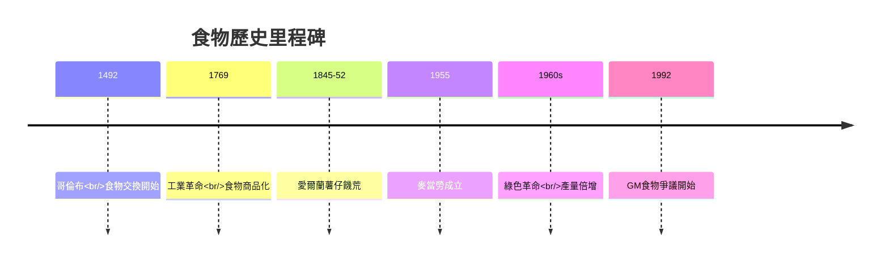
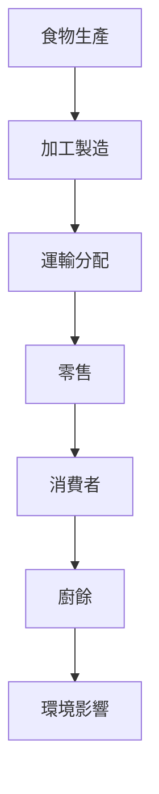
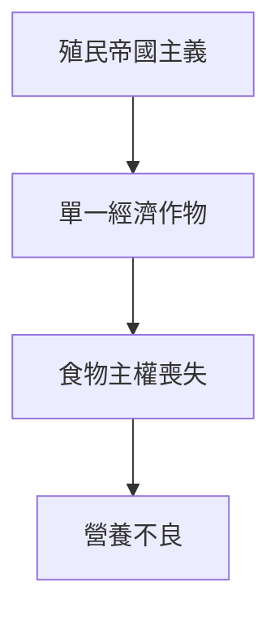
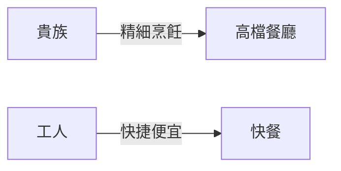
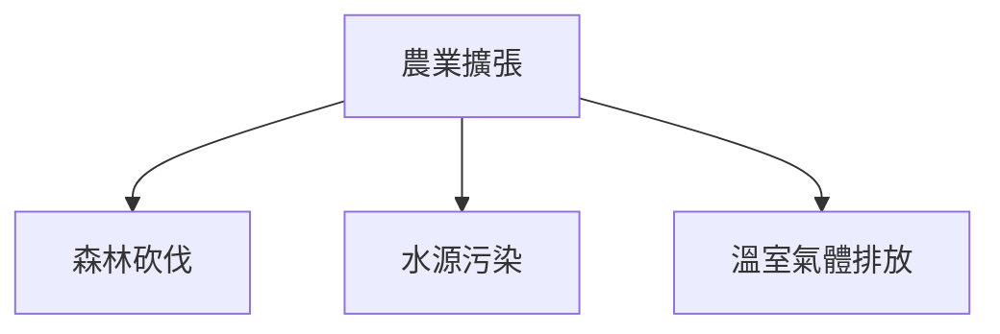

# HIST2077 食的历史 / Eating History: Food Culture from the 19th Century to the Present (6 credits)

**Instructor**: Staci Ford
**Department**: History, HKU  
**Official source**: [HKU History Course Description 2024-25](https://history.hku.hk/wp-content/uploads/2024/07/HIST-2425.pdf)
**Style**: 袁騰飛式 — 犀利、聚焦食物點解揭示階級、殖民主義、環境

---

## 問題 1：這個領域所有專家共享的 5 個核心心智模型

### 心智模型 1：你係你食的 (You Are What You Eat)
學者 **Michael Pollan** (*In Defense of Food*, 2008) 提出：「你係你食的」唔係比喻，而係生物學事實——食物直接影響我哋身體、腸道菌群、基因表達。

學者 **Sidney Mintz** (*Tasting Food, Tasting Freedom*, 1996) 從歷史角度研究：食物選擇從來唔係純粹個人決定，而係政治、經濟、文化權力嘅表達。

- 蔗糖：從奴隸種植園到全球商品化
- 咖啡：從阿拉伯宗教飲料到全球必需品
- 薯仔：愛爾蘭大饑荒與中國人口爆炸

### 心智模型 2：食物揭示階級與權力
學者 **Jack Goody** (*Cooking, Cuisine and Class*, 1982) 研究：食物消費模式揭示社會階級結構。貴族有閒暇時間準備精細食物；工人階級需要快捷便宜熱量。

學者 **Mathew T. Cowie** 研究殖民時期印度食物——英國人食肉、印人食素——階級種族話語隱藏喺食物選擇背後。

### 心智模型 3：全球化與食物帝國主義
學者 **Frederick Kaufman** (*Salt*, 2012) 研究：鹽——人類歷史上最大規模嘅國際貿易商品——塑造帝國興衰、戰爭走向。

學者 **Randy Laist** 研究麥當勞全球化——1990 年代東歐共產主義崩潰後，麥當勞被視為「自由」象徵象徵。

### 心智模型 4：食物安全與國家權力
學者 **James C. Scott** (*Seeing Like a State*, 1998) 研究：國家如何通過食物生產管理人口——現代國家對食物嘅監管程度史無前例。

學者 **David Goodman** 研究中國食物安全——食品安全危機揭示國家權力同市場失靈之間嘅張力。

### 心智模型 5：環境轉型與食物系統
學者 **William Cronon** (*Changes in the Land*, 1991) 研究：哥倫布抵達後美洲，生態系統被徹底改變——引入牛隻、豬隻、小麥，改變土地利用方式。

學者 **Mark B. Smith** 研究全球食物系統——當代食物系統係地球暖化第二大因素，僅次於能源。

---

## 問題 2：3 個根本分歧

### 分歧 1：傳統飲食 vs 全球飲食——傳統食物文化應該保護嗎？
- **A 方**：傳統飲食文化值得保育
  - UNESCO Intangible Cultural Heritage 保護傳統食物文化
  - 論點：食物文化係身份認同核心
- **B 方**：保護傳統飲食係階級話語
  - **Rebecca T. Reichard** 研究：邊緣群體被迫「保存」自己飲食文化係歧視

### 分歧 2：有機農業 vs 工業農業——邊個係未來？
- **A 方**：有機農業可持續
  - 環境效益、食物品質
- **B 方**：工業農業養活全球人口
  - 全球 80 億人口依賴工業農業
  - 有機農業產量唔夠

### 分歧 3：食物里程 (Food Miles) ——環保定階級問題？
- **A 方**：本地食物減少碳排放
  - 空運食物佔全球碳排放 1%
- **B 方**：本地食物不一定更環保
  - 季節性食物可能需要温室種植

---

## 問題 3：10 個深度問題

1. 如果全球食物系統崩潰，邊個最先饿死？（提示：城市人口）
2. 點解人類史上最大規模嘅饑荒——愛爾蘭薯仔饑荒——發生喺英國殖民地？
3. 速食 (Fast Food) 係歷史必然定文化帝國主義？
4. 中國 1960 年代大饑荒——點解仍然係禁忌話題？
5. 如果你係食物歷史學家，點解研究奴隸飲食習慣好重要？
6. 點解「美食博主」文化其實係新形式嘅階級話語？
7. 基因改造食物——歷史經驗證明安全但公眾仍然恐懼，點解？
8. 食物過敏症增加——環境原因定診斷進步？
9. 點解「地中海飲食」被塑造為健康標準？邊個受惠？
10. 如果你去殖民時期印度做田野考察，食物可以揭示幾多資訊？

---

## 核心心智模型深化

### 1. 食物歷史時間線

### 2. 全球食物帝國主義

---

## 深度自測問題

### 詳解 1: 如果全球食物系統崩潰，邊個最先饿死？
答案是城市貧民——城市化導致人類失去食物自主能力。全球 55% 人口住喺城市，依賴複雜嘅食物供應鏈。呢個揭示現代化嘅脆弱性。

### 詳解 2: 愛爾蘭薯仔饑荒點解係殖民暴力？
1845-1852 年愛爾蘭饑荒，100 萬人死亡、200 萬人移民。英國政府拒絕救濟、愛爾蘭出口食物照常——呢個就係「結構性暴力」最佳例子。

---

## 5 個 Mermaid 圖解

### 📊 Diagram 1: 全球食物系統

### 📊 Diagram 2: 愛爾蘭饑荒原因

### 📊 Diagram 3: 殖民與食物

### 📊 Diagram 4: 食物與階級

### 📊 Diagram 5: 環境與食物

---

## 總結

1. 食物揭示階級、殖民主義、環境危機
2. 愛爾蘭饑荒係殖民暴力結構性案例
3. 全球化食物系統極脆弱
4. 「你係你食的」係權力話語
5. 食物歷史提醒：我哋依賴複雜系統

**最後尖銳問題**: 當全球食物系統面對氣候危機，我哋仲可以繼續忽視食物正義嗎？

---
**版權所有 © HKU History Self-Study**
