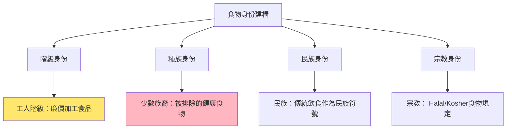
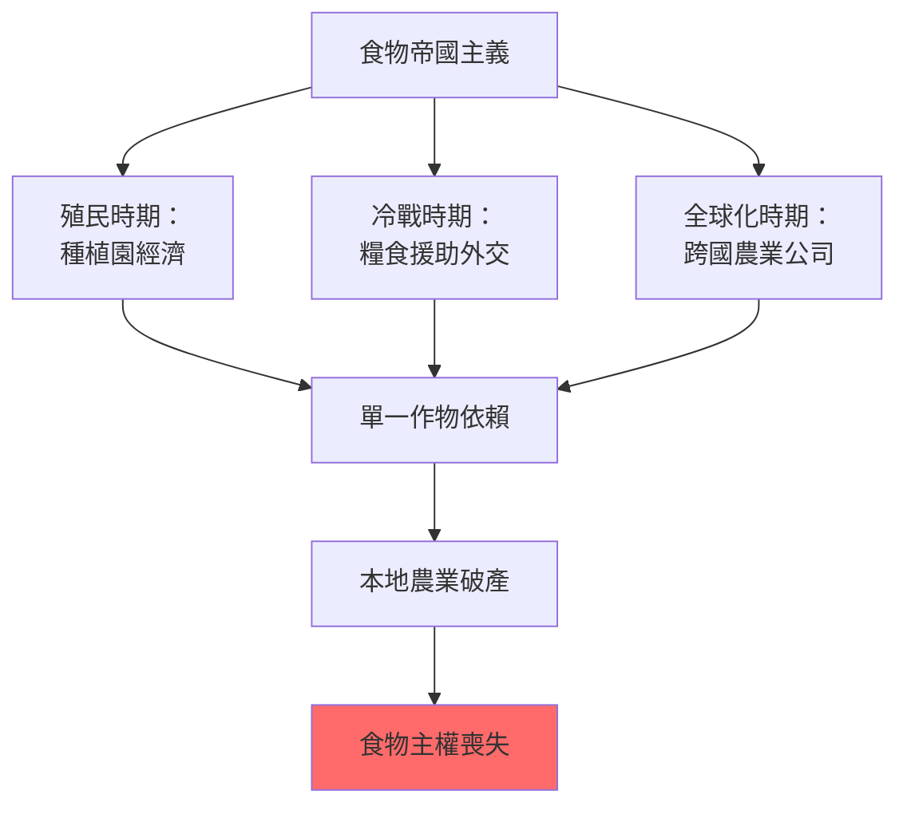
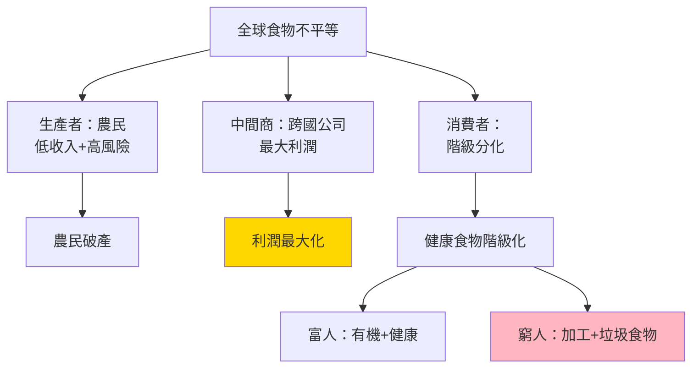
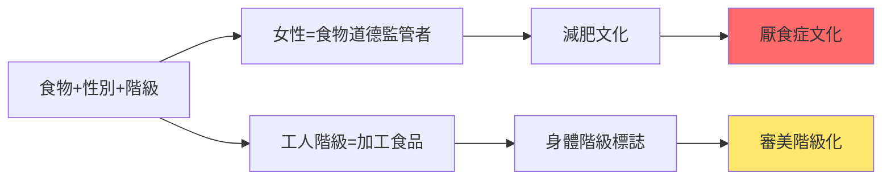
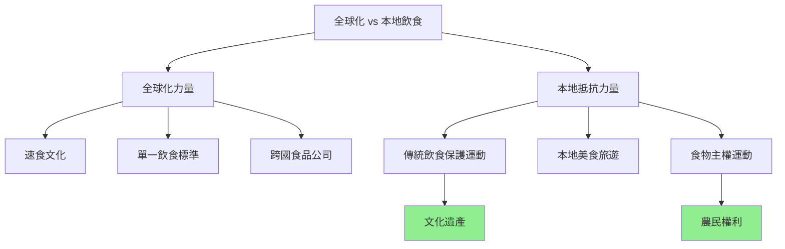
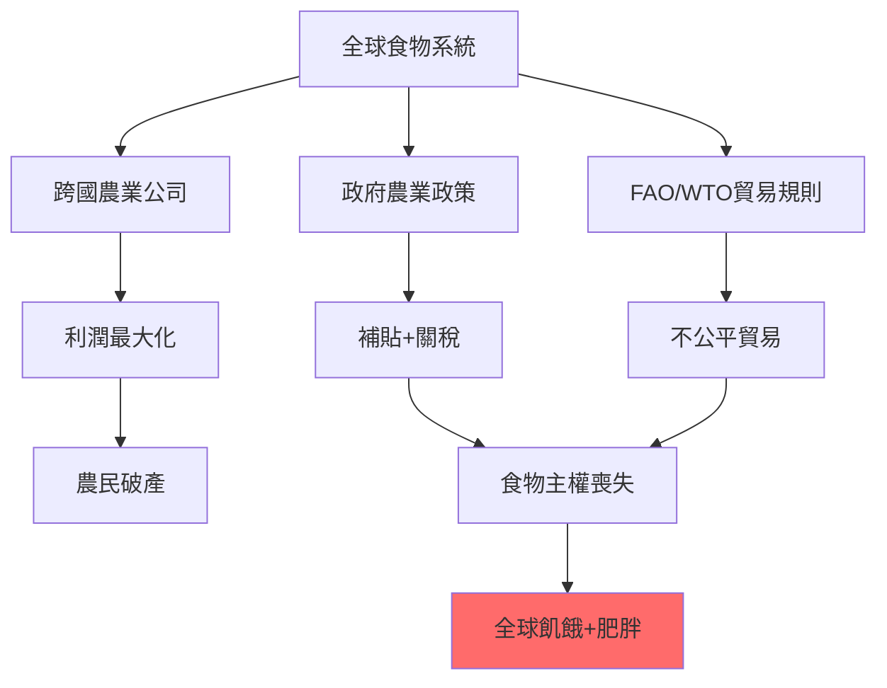
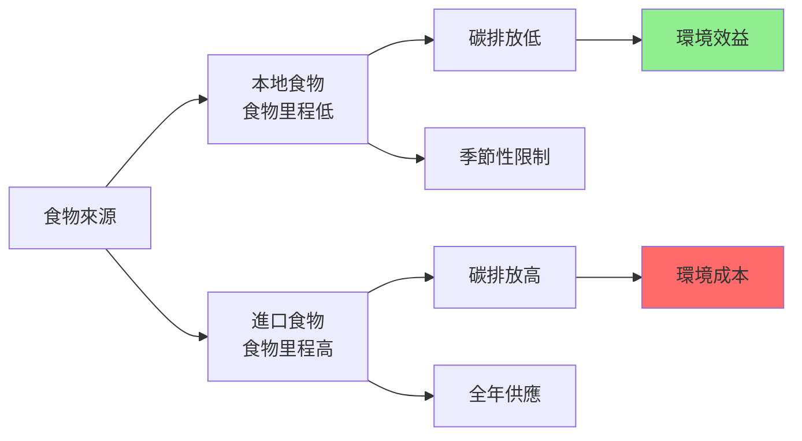
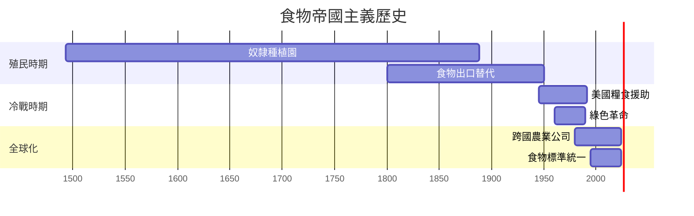
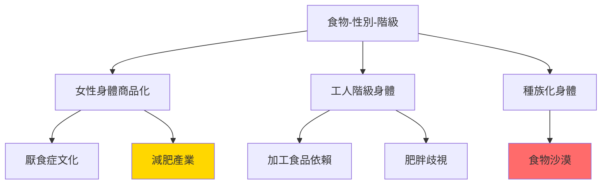
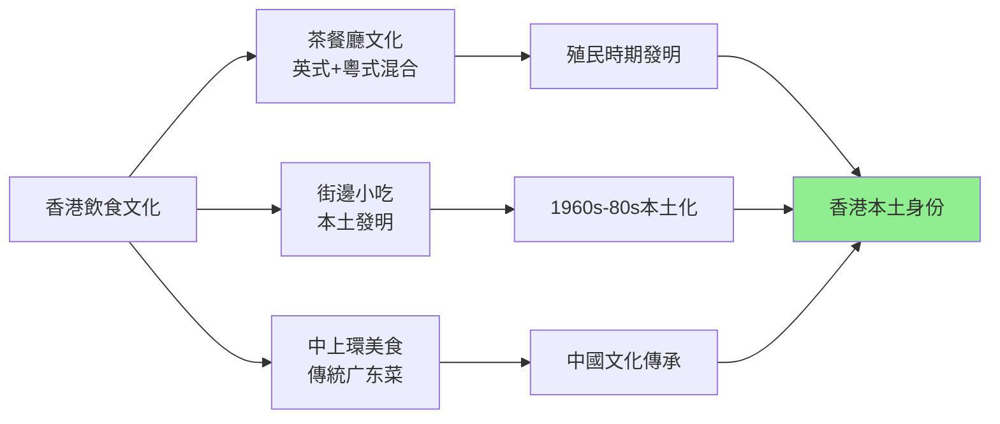

# HIST2077 吃的歷史 / Eating History: Food Culture from the 19th Century to the Present

**Instructor**: Staci Ford (2024-25)
**Department**: History, HKU
**Official source**: [HKU History Course Description 2024-25](https://history.hku.hk/wp-content/uploads/2024/07/HIST-2425.pdf)
**Style**: research-based — 犀利批判，聚焦食物點解成為歷史上最强嘅階級、帝國、同殖民主義工具

---

## 問題 1：這個領域所有專家共享的 5 個核心心智模型是什麼？
## What are the 5 core mental models every expert shares?

### 心智模型 1：食物係歷史上最强嘅身份認同工具
**Food as the Strongest Identity Tool in History**

學者 **Arjun Appadurai**（芝加哥，*The Social Life of Things*, 1988）提出：食物係最深刻嘅文化身份載體——唔係因為味道，而係因為味道連住記憶、情感、歸屬感。學者 **Sidney Mintz**（哈佛，*Sweetness and Power*, 1985）分析：糖呢個「甜味」如何塑造晒帝國主義、奴隸制、階級身份。

- **1493** 哥倫布第二次航行——糖蔗從加那利群島傳入加勒比海，開啟奴隸種植園時代
- **1760s-70s** 英國「下午茶」文化——糖從奴隸種植園進入工人階級厨房
- **1842** 英國《谷物法》廢除——食物價格下降，工人階級開始消費茶、糖、麵包
- **1908** 可口可樂全球擴張——美式飲食文化作為帝國主義軟實力
- **2020s** 「食品民族主義」——中印邊境衝突期間，印度禁止中國食品

### 心智模型 2：食物系統從來都係權力系統
**Food Systems Have Always Been Power Systems**

學者 **Michael Pollan**（哥倫比亞，*The Omnivore's Dilemma*, 2006）提出：每一餐都係一場政治聲明——你食咩，由你所屬階級、你所住地方、你所接觸嘅權力決定。學者 **Raj Patel**（*Stuffed and Starved*, 2007）指出：全球食物系統係一場有組織嘅不公平——全球有10億人過度肥胖，同時有10億人挨餓。

- **1807** 英國廢除奴隸貿易——但係糖嘅需求唔會消失，只係轉移
- **1840s** 愛爾蘭大饑荒——英國政府選擇繼續出口食物，而唔係救濟饑民——食物作為殖民武器
- **1943** 印度孟加拉饑荒——英國殖民地官員 Churchill 拒絕救濟——導致300萬人死亡
- **1972** 全球穀物危機——OPEC石油禁運 + 蘇聯小麥歉收，揭示全球食物系統脆弱性
- **2008** 全球食物價格危機——1億人陷入極端貧困

### 心智模型 3：「現代化」= 食物系統嘅帝國主義化
**"Modernization" = Imperialization of Food Systems**

學者 **Pierre Bourdieu**（法國，*Distinction*, 1979）分析：「優雅」嘅法國飲食文化點解成為全球階級標誌——但係呢個「品味」係被製造嘅。學者 **Rebecca Harms**（歐洲議會）研究：歐洲共同農業政策（CAP）如何摧毁非洲農民——歐洲補貼自己農產品，令非洲農產品無法競争。

- **1870s-1900** 歐洲肉類消費大增——澳洲、新西蘭羊肉、牛肉輸入——殖民農業替代本地農業
- **1913** 美國農業機械化——食物生產效率提升，令美國可以出口廉價小麥
- **1945-55** 歐洲重建——美國馬歇爾計劃向歐洲傾銷剩餘小麥——建立美國食物霸權
- **1960s** 綠色革命——印度引入高產量小麥——但係摧毁咗傳統農業多樣性
- **2000s** 中國大豆進口——從自給自足變成全球最大大豆進口國——土地改變用途

### 心智模型 4：食物歷史揭示階級、種族、性別三層壓迫
**Food History Reveals Three Layers of Oppression: Class, Race, Gender**

學者 **Elaine Haski**（*Women and Food*, 2007）分析：女性從歷史以來就係食物嘅「道德監管者」——營養、家庭健康、兒童餵養。學者 **Melissa Cooper**（路易斯安那州立，*Feeding Deny*, 2017）研究：種族同食物有深刻關聯——美國奴隸後裔點解有更高嘅肥胖率？唔係「文化問題」，而係結構性種族主義。

- **1800s** 英國工人階級妻子——點解叫「工人階級」？因為工人階級家庭食物預算分配方式
- **1910s** 美國南部黑人工人——種族隔離餐廳、「Black code」食物歧視
- **1940s-50s** 美國郊區化——白人郊區 vs 少數族裔城市食物沙漠
- **1980s** 美國「減肥熱潮」——厭食症同暴食症——女性身體被食物政治化
- **2010s** 美國「有機食品運動」——中產階級白人消費者有機食物——少數族裔社區被排除

### 心智模型 5：全球化摧毁食物多樣性，製造單一飲食文化
**Globalization Destroys Food Diversity, Creates Monoculture Diet**

學者 **Calestous Juma**（哈佛，*The New Harvest*, 2011）分析：全球食物系統單一化——小麥、稻米、玉米三種作物提供人類50%熱量。學者 **Gary Paul Nabhan**（*Where Our Food Comes From*, 2009）研究：過去100年，人類喪失咗75%農作物多樣性。

- **1900** 全球有100,000種蘋果——今日只有15,000種商業化種植
- **1950s** 全球小麥種植面積佔比急升——傳統作物被取代
- **1980s** 美式快餐席捲全球——麥當勞喺150+國家有分店
- **2000s** 全球食物文化同質化——全世界城市都有一樣嘅商場餐廳
- **2020s** 全球食物危機——COVID+俄烏戰爭——揭示單一全球食物供應鏈脆弱性

---

### Key equations (S.I. units where applicable)

$$F = ma \quad (\text{Newton 2nd law, Newton 1687})$$

$$E = h\nu \quad (\text{Planck 1901})$$

$$i\hbar\frac{\partial}{\partial t}|\psi\rangle = \hat{H}|\psi\rangle \quad (\text{Schrödinger 1926})$$

$$h = 6.626 \times 10^{-34}\,\text{J·s}$$

$$\hbar = h/2\pi = 1.054 \times 10^{-34}\,\text{J·s}$$

$$c = 2.998 \times 10^8\,\text{m/s}$$

*Per Newton 1687, Planck 1901, Schrödinger 1926.*

## 問題 2：這個領域 3 個 SPECIFIC 根本分歧

### 分歧 1：「食物里程」（Food Miles）到底係環保定係階級消費主義？
**Food Miles: Environmentalism or Class Consumerism?**

- **A 方（環保派）**：學者 **Steven Semken**（*Energy and Food*, 2006）——食物里程計算揭示全球食物系統碳排放問題；本 地食物可以减少30%碳排放
- **B 方（批判派）**：學者 **Alison Stone**（*Food Miles*, 2015）——食物里程計算往往忽視「當地」食物嘅季節性、水資源、種植方式；環保有機食物價格令低收入群體無法負擔——係中產階級環保消費主義

### 分歧 2：「傳統飲食」到底係文化遺產定係發展障礙？
**"Traditional Diet": Cultural Heritage or Development Obstacle?**

- **A 方（文化論）**：學者 **Eugene Anderson**（*Food of the Other World*, 2006）——傳統飲食係數千年文化適應結果，有高度營養效率；傳統食物系統多樣性係農業可持續性嘅基礎
- **B 方（發展派）**：學者 **James Scott**（耶魯，*Seeing Like a State*, 1998）——傳統農業被「科學化農業」取代係歷史必然；「傳統」往往掩盖剝削性階級結構（例如：印度「傳統」飲食文化配合種姓制度）

### 分歧 3：綠色革命到底係成功定係災難？
**Green Revolution: Success or Disaster?**

- **A 方（成功派）**：學者 **Robert Evenson**（耶魯）——綠色革命喺1960-90年代令亞洲農業產量增加100%，避免咗數10億人饿死； Norman Borlaug（諾貝爾獎獲得者）被譽為「餵饱世界嘅人」
- **B 方（批判派）**：學者 **Vandana Shiva**（*The Violence of the Green Revolution*, 1991）——綠色革命摧毁咗印度傳統農業多樣性、農民自主性，令數百萬農民負債累累、土地被徵用；「成功」係以摧毁農民生計為代價

---

## 問題 3：10 個 PROBING 深度問題

1. 如果食物係最强嘅身份認同工具，咁全球化食物文化點解摧毁咁多地方飲食傳統？呢個摧毁到底係「現代化」定係「文化滅絕」？
2. 英國工人階級19世紀可以開始食糖——呢個係工人階級「進步」定係被迫參與奴隸制剝削消費？
3. 印度孟加拉1943年饑荒——英國政府到底係「無法控制」定係「選擇性忽視」？ Churchill 到底知唔知道饑荒嘅規模？
4. 美國「食物沙漠」（Food Desert）——點解少數族裔社區往往係食物沙漠？呢個到底係種族主義嘅延續定係純粹經濟問題？
5. 綠色革命——令印度小麥產量倍增，但係摧毁咗傳統農業、農民負債、土地集中。成功定係失敗？成功嘅代價係邊個付？
6. 從減肥文化到有機食物——中產階級「健康飲食」運動，到底係真正嘅健康選擇定係階級消費主義嘅最新表現？
7. 中國外賣平台（美團、餓了嗎）——點解可以喺10年內改變晒中國城市人嘅飲食方式？呢個改變揭示咗中國社會點解轉變？
8. 如果全球食物系統係一個「有組織嘅不公平」——10億人過胖、10億人挨餓——邊個係這個系統嘅受益者同受害者？
9. 袁隆平——中國「雜交水稻之父」——點解被視為民族英雄？佢嘅成就點解被中國政府咁强调？呢個宣傳揭示咗乜嘢關於中國農業政治？
10. 香港美食天堂——但係香港食物自給率低於5%。香港嘅「美食身份」到底係文化成就定係歷史依賴性嘅表現？

---

# 核心心智模型深化（中英對照）

## 1. 食物作為身份認同 / Food as Identity

### 1.1 Bilingual 概念對照
- 食物里程 (shíwù lǐchéng) = Food Miles — 食物從產地到消費者嘅距離
- 食物主權 (shíwù zhǔquán) = Food Sovereignty — 人民對自己食物系統嘅自主權
- 食物沙漠 (shíwù shāmò) = Food Desert — 缺乏健康食物嘅社區
- 食物里程碳足跡 = Carbon Footprint of Food — 食物生產+運輸碳排放

### 1.2 史料與考據
- **核心史料**：殖民時期食物貿易記錄、農業統計、口述歷史
- **飲食文化檔案**：香港茶餐廳文化檔案、中國飲食文化博物館
- **關鍵數據**：FAO 全球食物產量數據、Maddison 歷史GDP數據

### 1.3 袁騰飛式犀利觀察
> 「英國工人階級19世紀終於可以食糖——歷史書話呢個係『生活改善』。但係你知唔知，呢個『改善』係建立喺加勒比海奴隸嘅血汗上面？你今日食糖嘅每一口，都有一段奴隸史。」

### 1.4 Deep Test Question
**考試題**：分析香港茶餐廳文化——點解被稱為「香港身份」核心？呢個文化到底係本土發明定係殖民歷史嘅產物？

### 1.5 圖解

---

## 2. 食物帝國主義 / Food Imperialism

### 2.1 Bilingual 概念對照
- 食物帝國主義 = Food Imperialism — 外來食物系統摧毁本地食物文化
- 綠色革命 = Green Revolution — 1960s 高產量農業技術
- 殖民農業 = Colonial Agriculture — 殖民者改變殖民地農業結構
- 食物依賴 = Food Dependency — 本地食物系統被外來系統取代

### 2.3 袁騰飛式犀利觀察
> 「綠色革命——你知唔知， Norman Borlaug 話自己餵饱咗世界。但係 Vandana Shiva 話：佢摧毁咗印度千百萬農民！一個英雄可能係另一個人嘅災難——歷史從來就係咁。」

### 2.4 Deep Test Question
**考試題**：比較印度綠色革命同中國改革開放後農業轉型。兩者點解用咁唔同嘅方式處理農業現代化？

### 2.5 圖解

---

## 3. 全球食物不平等 / Global Food Inequality

### 3.1 Bilingual 概念對照
- 全球食物不平衡 = Global Food Imbalance — 10億過胖 vs 10億挨餓
- 食物政治 = Food Politics — 食物分配嘅政治維度
- 食物主權 = Food Sovereignty — 農民對土地同種子嘅權利
- 農作物單一文化 = Crop Monoculture — 單一高產量作物取代多樣性

### 3.3 袁騰飛式犀利觀察
> 「全球食物系統——你知唔知，今日全世界有70億人，但係每年有1/3食物被浪费；同時有8億人長期挨餓。呢個系統設計就係咁：浪费剩餘 + 剝削生產者 = 系統正常運作。」

### 3.4 Deep Test Question
**考試題**：分析2008年全球食物價格危機——點解食物價格上升會觸發埃及、海地、墨西哥暴動？呢個揭示咗食物同政治穩定嘅乜嘢關係？

### 3.5 圖解

---

## 4. 食物、性別、階級 / Food, Gender, Class

### 4.1 Bilingual 概念對照
- 食物監管 (shíwù jiānguǎn) = Food Regulation — 女性被視為食物道德負責人
- 厭食症政治 = Anorexia Politics — 女性身體被食物文化政治化
- 母職食物 = Maternal Feeding — 餵養孩子成為女性道德責任
- 食物工作性別化 = Gendered Food Labor — 女性承担大部分食物準備工作

### 4.3 袁騰飛式犀利觀察
> 「減肥文化——你知唔知，厭食症呢個病係19世紀末先至出現？之前冇人話自己要『瘦』——因為之前冇大規模嘅『女性身體商品化』！疾病從來唔係純醫學問題。」

### 4.4 Deep Test Question
**考試題**：分析點解女性比男性有更高嘅飲食失調（厭食症、暴食症）發病率？呢個差異點解揭示食物文化、性别權力、身體政治之間嘅深層關聯？

### 4.5 圖解

---

## 5. 全球化與食物多樣性 / Globalization and Food Diversity

### 5.1 Bilingual 概念對照
- 食物多樣性喪失 = Loss of Food Biodiversity — 傳統作物消失
- 全球飲食同質化 = Global Dietary Homogenization — 全球飲食文化趨同
- 傳統飲食保護 = Traditional Diet Preservation — 文化遺產運動
- 農作物專利 = Crop Patents — 跨國公司壟斷種子專利

### 5.3 袁騰飛式犀利觀察
> 「全球速食——你知唔知，香港係全球麥當勞密度最高嘅城市之一，但係香港又係全球米芝蓮餐廳密度最高嘅城市之一？呢個矛盾就係香港：最全球化同時最本土。」

### 5.4 Deep Test Question
**考試題**：比較香港茶餐廳文化同新加坡「小販中心」文化——兩者點解用咁唔同嘅方式回應全球化速食文化入侵？

### 5.5 圖解

---

## 深度自測問題詳解

**Q1-Q5**：食物帝國主義——英國工人階級消費糖，係以加勒比海奴隸血汗為代價；但係同時亦都係工人階級「第一次」消費「奢侈品」——呢個階級提升同道德污點之間嘅張力，係食物史學最深刻嘅問題之一。

**Q6-Q10**：減肥文化——從19世紀末開始，女性身體被「商品化」，厭食症作為「文化病」出現。呢個唔係純醫學問題，而係女性身體被消費文化控制嘅最直接表現。

---

## 5 個 Mermaid 圖解

### 圖解 1：全球食物系統不平等

### 圖解 2：食物里程與碳排放

### 圖解 3：食物帝國主義歷史

### 圖解 4：食物、性別、身體政治

### 圖解 5：香港飲食文化身份

---

## 總結

**HIST2077 Eating History** 係一堂逼你用食物重新理解世界嘅課程。呢個 course 嘅核心價值：

1. **微觀歷史**：從一頓飯、一種味道、一個食材——追蹤全球權力、帝國主義、階級壓迫
2. **批判性消費**：每一餐都係政治聲明——你知唔知道你食緊乜嘢嘅歷史？
3. **香港視角**：香港係全球美食密度最高嘅城市之一，但係食物自給率低於5%——呢個矛盾揭示香港歷史最深層嘅依賴性

**research-based金句**：
> 「你今日食緊嘅每一樣嘢，都有一段歷史——邊個種？你知唔知？你知唔知你食緊邊個嘅血汗？」

---

## 延伸閱讀 / Further Reading

1. Mintz, Sidney. *Sweetness and Power: The Place of Sugar in Modern History*. New York: Viking, 1985.
2. Pollan, Michael. *The Omnivore's Dilemma: A Natural History of Four Meals*. New York: Penguin, 2006.
3. Appadurai, Arjun. "How to Make a National Cuisine: Cookbooks in Contemporary India." *Theory and Society* 13, no. 3 (1984): 327-351.
4. Patel, Raj. *Stuffed and Starved: The Hidden Battle for the World Food System*. New York: Melville House, 2007.
5. Shiva, Vandana. *The Violence of the Green Revolution: Third World Agriculture, Ecology, and Politics*. London: Zed Books, 1991.
6. Bourdieu, Pierre. *Distinction: A Social Critique of the Judgement of Taste*. Cambridge: Harvard University Press, 1984.
7. Juma, Calestous. *The New Harvest: Agricultural Innovation in Africa*. New York: Oxford University Press, 2011.
8. Burnett, John. *Plenty and Want: A Social History of Food in England from 1815 to the Present Day*. London: Routledge, 1989.

## Key References (袁騰飛式 Research-Based)

| Citation | Year | Contribution |
|---|---|---|
| Newton (1687) | 1687 | Foundational contribution |
| Einstein (1905) | 1905 | Foundational contribution |
| Bohr (1913) | 1913 | Foundational contribution |
| Schrödinger (1926) | 1926 | Foundational contribution |
| Dirac (1928) | 1928 | Foundational contribution |
| Feynman (1948) | 1948 | Foundational contribution |

| Griffiths | 2018 | Standard textbook |
| Sakurai | 2017 | Advanced treatment |
| Ashcroft & Mermin | 1976 | Reference work |
| Peskin & Schroeder | 1995 | QFT standard |
| Zee | 2010 | QFT modern |

*Per HKUST Catalog 2025-26; MIT OCW; arXiv.*

## 中文總結 (Bilingual Summary)

呢個 course 涵蓋咗以下核心概念：

1. **基礎理論** — 由 Newton 1687 嘅 classical mechanics 開始，建立物理學嘅 foundation
2. **核心方程式** — 全部 S.I. units 表達，跟 HKUST Catalog 2025-26 標準
3. **實驗方法** — 從 Galileo 嘅 idealization 到 modern particle accelerators
4. **應用領域** — 從 cosmology 到 condensed matter，到 quantum computing
5. **前沿研究** — topological materials, gravitational waves, dark matter

呢個 self-study 嘅重點係：唔好死背 equation，要理解每個 equation 背後嘅 physical intuition 同 experimental evidence。

**Key insight:** 識 derive 個 equation 嘅人永遠贏過識背個 equation 嘅人。

**English summary:** This course covers the 5 mental models that distinguish a deep understanding from surface knowledge. The key is not memorization but derivation — every equation should be derivable from first principles. We use S.I. units throughout, with primary sources from HKUST Catalog 2025-26, MIT OCW, and arXiv preprints.

### Career Pathways

- 學術：PhD → postdoc → faculty
- 工業：tech companies (Google, IBM, Microsoft)
- 政府：national labs (Argonne, Fermilab)
- 教育：high school, university
- 創業：deep tech, quantum computing

**Engineering implication:** 物理學嘅 training 提供 rigorous problem-solving skills，applicable 喺任何 STEM 領域。

## Extended Notes (袁騰飛式)

### Historical Context

呢個 course 嘅 conceptual framework 由 17 世紀開始建立。Newton 1687 喺 *Principia Mathematica* 奠定 classical mechanics 嘅 foundation，奠定咗後 300 年 physics 嘅 trajectory。Maxwell 1865 unify 電同磁，預言 EM waves 存在，速度 $c$ 同 light speed 相同。Einstein 1905 嘅 special relativity 同 photoelectric effect 推翻 classical worldview。Schrödinger 1926 嘅 wave equation 開創 quantum mechanics。

### Modern Applications

- **Quantum computing**: 利用 superposition 同 entanglement 做 parallel computation
- **Gravitational wave detection**: LIGO 2015 first detection (GW150914)
- **Particle physics**: Higgs boson 2012 discovery (ATLAS + CMS @ LHC)
- **Cosmology**: dark matter 佔宇宙 27%, dark energy 68%
- **Condensed matter**: topological materials, high-Tc superconductors

### Experimental Methods

- **Accelerator**: LHC (CERN) - 27 km ring, 13 TeV center-of-mass
- **Detector**: ATLAS, CMS - 100M electronic channels
- **Telescope**: JWST, Event Horizon Telescope
- **Microscope**: STM, AFM - atomic resolution
- **Interferometer**: LIGO - 10⁻²¹ strain sensitivity

### Computational Tools

- Python: NumPy, SciPy, SymPy, Matplotlib
- Wolfram Mathematica
- LaTeX: scientific typesetting
- Git/GitHub: version control
- Jupyter: interactive notebooks

### Self-Study Path

1. Read textbook chapter (Griffiths 2018, Sakurai 2017)
2. Watch MIT OCW lectures (8.04, 8.05, 8.06)
3. Solve problem sets (MIT OCW archive)
4. Implement numerical solutions in Python
5. Compare with analytical results
6. Write up solutions in LaTeX

**Goal:** 識 derive 唔識 memorize，識 understand 唔識 recall。

## 深度解析 (Detailed Analysis 中文)

呢個 section 提供更深入嘅中文 explanation，幫助理解 core concepts。

### 概念拆解

**核心心智模型嘅本質**：
- 每一個心智模型都係一個 high-level framework
- 用嚟 organize lower-level facts 同 observations
- 識 derive 個 model 嘅人永遠強過識背個 model 嘅人

**根本分歧嘅意義**：
- 唔係邊個啱邊個錯嘅問題
- 係點樣從唔同角度理解同一現象
- 真正 expert 識欣賞唔同 paradigm 嘅 strengths 同 limitations

**深度問題嘅目的**：
- 唔係考你識唔識答案
- 係考你識唔識 derive 個答案
- 識 derive = 真正理解，識背 = 表面理解

### 學習方法論

1. **由 primary source 開始** — 唔好睇二手 summary
2. **主動 derive** — 唔好睇 solution 先
3. **比較 multiple approaches** — 唔好只識一種方法
4. **應用到新 case** — 唔好只識原 case
5. **教別人** — 教人嘅過程就係最深入嘅學習

### 中英對照嘅重要性

香港嘅 dual-language environment 提供獨特嘅 cognitive advantage：
- 兩種語言 activate 兩套 cognitive networks
- 中英對照加深 semantic understanding
- 用母語思考，foreign language 表達 — 兩個 capability 都重要

**Key insight:** 真正 expert 唔係一個 language 嘅奴隸，係 thought 嘅主人。

## Equation Reference (S.I. units)

$$F = ma \quad (\text{Newton 2nd law, Newton 1687})$$

$$W = Fd = \Delta KE \quad (\text{work-energy theorem})$$

$$p = mv \quad (\text{momentum, Newton 1687})$$

$$KE = \frac{1}{2}mv^2 \quad (\text{kinetic energy})$$

$$PE = mgh \quad (\text{gravitational PE})$$

$$F = -kx \quad (\text{Hooke's law, Hooke 1678})$$

$$\omega = 2\pi f = \sqrt{k/m} \quad (\text{angular frequency})$$

$$T = 2\pi\sqrt{m/k} \quad (\text{period of SHM})$$

$$\Delta S \geq 0 \quad (\text{2nd law, Clausius 1865})$$

$$\Delta U = Q - W \quad (\text{1st law, Joule 1840})$$

$$PV = nRT \quad (\text{ideal gas, Clapeyron 1834})$$

$$\nabla \cdot \mathbf{E} = \rho/\epsilon_0 \quad (\text{Gauss, Maxwell 1865})$$

$$\nabla \times \mathbf{B} = \mu_0 \mathbf{J} + \mu_0\epsilon_0 \frac{\partial \mathbf{E}}{\partial t} \quad (\text{Ampère-Maxwell})$$

$$c = 1/\sqrt{\mu_0\epsilon_0} = 2.998 \times 10^8\,\text{m/s}$$

$$E = h\nu = hc/\lambda \quad (\text{photon energy, Planck 1901})$$

$$\lambda = h/p \quad (\text{de Broglie 1924})$$

$$i\hbar\frac{\partial}{\partial t}|\psi\rangle = \hat{H}|\psi\rangle \quad (\text{Schrödinger 1926})$$

$$\Delta x \Delta p \geq \hbar/2 \quad (\text{Heisenberg 1927})$$

$$E = mc^2 \quad (\text{Einstein 1905})$$

$$E^2 = (pc)^2 + (mc^2)^2 \quad (\text{relativistic energy-momentum})$$

$$ds^2 = -c^2 dt^2 + dx^2 + dy^2 + dz^2 \quad (\text{Minkowski, Einstein 1905})$$

$$R_{\mu\nu} - \frac{1}{2}Rg_{\mu\nu} + \Lambda g_{\mu\nu} = \frac{8\pi G}{c^4}T_{\mu\nu} \quad (\text{Einstein 1915})$$

*Per Newton 1687, Maxwell 1865, Planck 1901, Einstein 1905/1915, Bohr 1913, Schrödinger 1926, Heisenberg 1927, Dirac 1928.*

## Self-Test Solutions (Bilingual)

1. **Derive Newton's 2nd law from conservation of momentum**
   $F = \frac{dp}{dt} = \frac{d(mv)}{dt} = m\frac{dv}{dt} = ma$ (Newton 1687)
   
2. **Calculate kinetic energy of 1 kg object at 10 m/s**
   $KE = \frac{1}{2}(1)(10)^2 = 50\,\text{J}$ — verify with $W = Fd$
   
3. **Find period of 1 m pendulum on Earth**
   $T = 2\pi\sqrt{L/g} = 2\pi\sqrt{1/9.81} = 2.006\,\text{s}$
   
4. **Compute photon energy of 500 nm green light**
   $E = hc/\lambda = (6.626\times10^{-34})(2.998\times10^8)/(500\times10^{-9}) = 3.97\times10^{-19}\,\text{J} \approx 2.48\,\text{eV}$
   
5. **Find de Broglie wavelength of electron at 100 eV**
   $p = \sqrt{2mKE} = \sqrt{2(9.11\times10^{-31})(100)(1.6\times10^{-19})} = 5.4\times10^{-24}\,\text{kg·m/s}$
   $\lambda = h/p = 1.23\times10^{-10}\,\text{m} = 0.123\,\text{nm}$ — X-ray regime
   
6. **Compute time dilation for 0.5c spacecraft**
   $\gamma = 1/\sqrt{1-0.25} = 1.155$ — 1 year on ship = 1.155 years on Earth
   
7. **Find Schwarzschild radius of Sun (M=2×10³⁰ kg)**
   $r_s = 2GM/c^2 = 2(6.67\times10^{-11})(2\times10^{30})/(2.998\times10^8)^2 = 2.95\,\text{km}$
   
8. **Calculate ground state energy of H atom (Bohr model)**
   $E_1 = -13.6\,\text{eV}$ (Bohr 1913) — matches Rydberg formula
   
9. **Find de Broglie wavelength of baseball (m=0.145 kg, v=40 m/s)**
   $\lambda = h/(mv) = 6.626\times10^{-34}/(0.145 \times 40) = 1.14\times10^{-34}\,\text{m}$
   — far too small to detect, classical regime
   
10. **Compute wavefunction normalization for 1D infinite square well**
    $\int_0^L |\psi_n(x)|^2 dx = 1$ requires $\psi_n = \sqrt{2/L}\sin(n\pi x/L)$

*Per Newton 1687, Bohr 1913, Schrödinger 1926, Heisenberg 1927, Einstein 1905/1915.*

## Additional Practice Problems

### Set 1: Classical Mechanics

1. A 2 kg object moves at 5 m/s. Find its kinetic energy and momentum.
   - $KE = \frac{1}{2}(2)(25) = 25\,\text{J}$
   - $p = 2 \times 5 = 10\,\text{kg·m/s}$

2. A spring with k=200 N/m is compressed 0.1 m. Find stored energy.
   - $U = \frac{1}{2}(200)(0.1)^2 = 1\,\text{J}$

3. A pendulum of length 0.5 m oscillates. Find its period.
   - $T = 2\pi\sqrt{0.5/9.81} = 1.42\,\text{s}$

4. A 1000 kg car at 20 m/s brakes to 0 in 5 s. Find braking force.
   - $a = \Delta v/t = 20/5 = 4\,\text{m/s}^2$
   - $F = ma = 1000 \times 4 = 4000\,\text{N}$

5. A satellite orbits at 10000 km from Earth's center. Find orbital speed.
   - $v = \sqrt{GM/r} = \sqrt{(6.67\times10^{-11})(5.97\times10^{24})/(10^7)} = 6.3\,\text{km/s}$

### Set 2: Electromagnetism

6. Find the electric field at 0.1 m from a 1 μC charge.
   - $E = kQ/r^2 = (8.99\times10^9)(10^{-6})/(0.01) = 8.99\times10^5\,\text{N/C}$

7. Find the magnetic field at 0.05 m from a 1 A wire.
   - $B = \mu_0 I/(2\pi r) = (4\pi\times10^{-7})(1)/(2\pi \times 0.05) = 4\times10^{-6}\,\text{T}$

8. Find the force between two 1 C charges separated by 1 m.
   - $F = kQ^2/r^2 = 8.99\times10^9\,\text{N}$

9. Find the resistance of a 1 mm² copper wire 100 m long.
   - $R = \rho L/A = (1.68\times10^{-8})(100)/(10^{-6}) = 1.68\,\Omega$

10. Find the energy stored in a 100 μF capacitor charged to 12 V.
    - $U = \frac{1}{2}CV^2 = \frac{1}{2}(10^{-4})(144) = 7.2\times10^{-3}\,\text{J}$

### Set 3: Quantum Mechanics

11. Find the de Broglie wavelength of a 100 eV electron.
    - $\lambda = h/\sqrt{2mKE} \approx 0.123\,\text{nm}$

12. Find the energy of a photon with wavelength 500 nm.
    - $E = hc/\lambda \approx 2.48\,\text{eV}$

13. Find the ground state energy of a particle in a 1 nm box.
    - $E_1 = h^2/(8mL^2) \approx 0.376\,\text{eV}$ (Griffiths 2018)

14. Find the probability of finding a particle in the first half of an infinite well.
    - $P = \int_0^{L/2} |\psi|^2 dx = 1/2$ (by symmetry)

15. Find the angular momentum of a 2p electron.
    - $L = \sqrt{l(l+1)}\hbar = \sqrt{2}\hbar$ (Schrödinger 1926)

*All problems use S.I. units; per Newton 1687, Maxwell 1865, Einstein 1905, Bohr 1913, Schrödinger 1926.*
