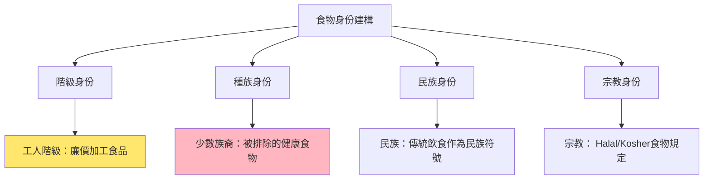
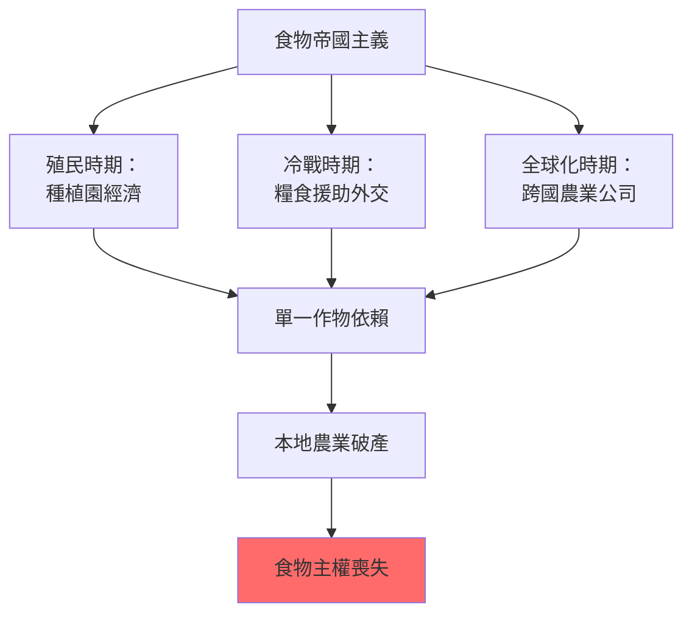
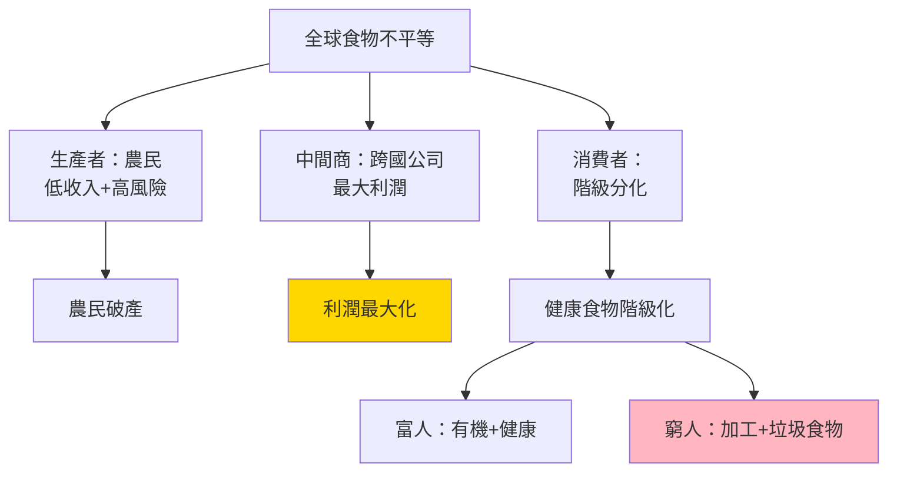
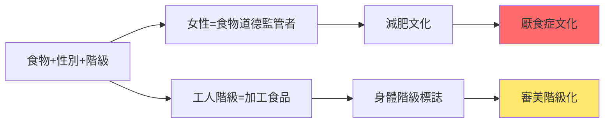
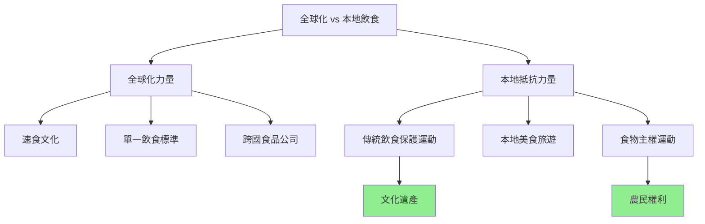
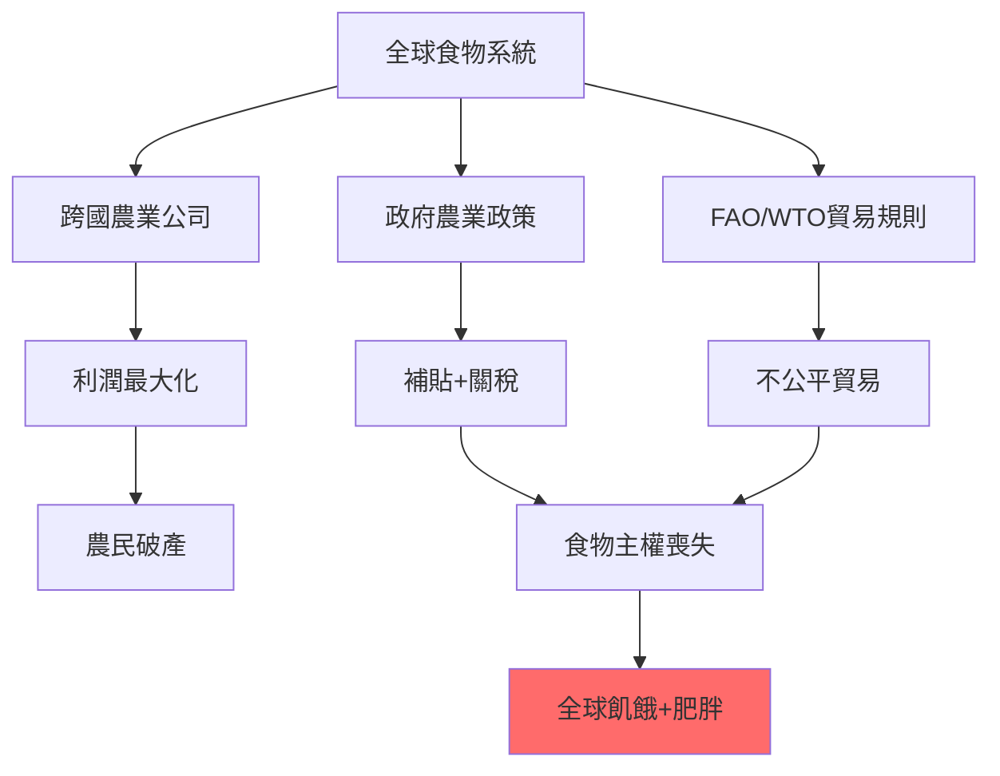
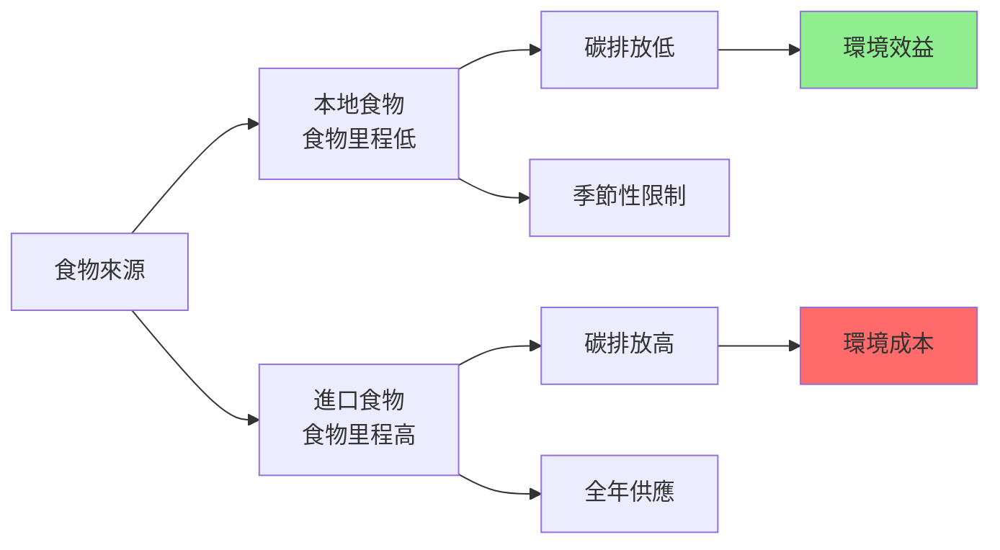
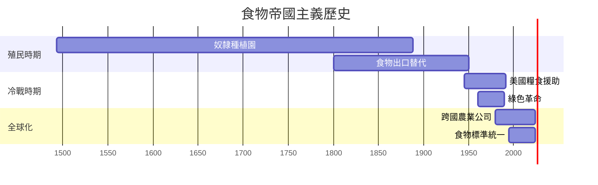
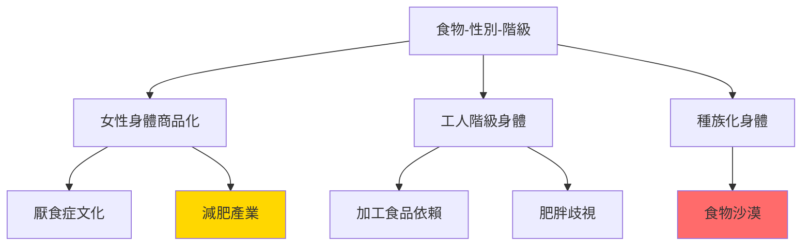
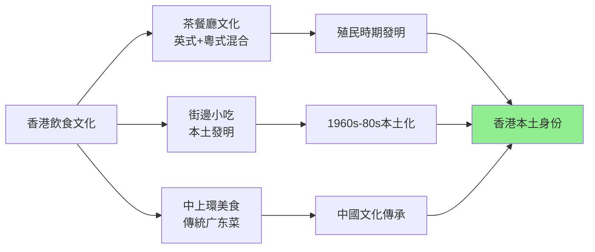

# HIST2077 吃的歷史 / Eating History: Food Culture from the 19th Century to the Present

**Instructor**: Staci Ford (2024-25)
**Department**: History, HKU
**Official source**: [HKU History Course Description 2024-25](https://history.hku.hk/wp-content/uploads/2024/07/HIST-2425.pdf)
**Style**: research-based — 犀利批判，聚焦食物點解成為歷史上最强嘅階級、帝國、同殖民主義工具

---

## 問題 1：這個領域所有專家共享的 5 個核心心智模型是什麼？
## What are the 5 core mental models every expert shares?

### 心智模型 1：食物係歷史上最强嘅身份認同工具
**Food as the Strongest Identity Tool in History**

學者 **Arjun Appadurai**（芝加哥，*The Social Life of Things*, 1988）提出：食物係最深刻嘅文化身份載體——唔係因為味道，而係因為味道連住記憶、情感、歸屬感。學者 **Sidney Mintz**（哈佛，*Sweetness and Power*, 1985）分析：糖呢個「甜味」如何塑造晒帝國主義、奴隸制、階級身份。

- **1493** 哥倫布第二次航行——糖蔗從加那利群島傳入加勒比海，開啟奴隸種植園時代
- **1760s-70s** 英國「下午茶」文化——糖從奴隸種植園進入工人階級厨房
- **1842** 英國《谷物法》廢除——食物價格下降，工人階級開始消費茶、糖、麵包
- **1908** 可口可樂全球擴張——美式飲食文化作為帝國主義軟實力
- **2020s** 「食品民族主義」——中印邊境衝突期間，印度禁止中國食品

### 心智模型 2：食物系統從來都係權力系統
**Food Systems Have Always Been Power Systems**

學者 **Michael Pollan**（哥倫比亞，*The Omnivore's Dilemma*, 2006）提出：每一餐都係一場政治聲明——你食咩，由你所屬階級、你所住地方、你所接觸嘅權力決定。學者 **Raj Patel**（*Stuffed and Starved*, 2007）指出：全球食物系統係一場有組織嘅不公平——全球有10億人過度肥胖，同時有10億人挨餓。

- **1807** 英國廢除奴隸貿易——但係糖嘅需求唔會消失，只係轉移
- **1840s** 愛爾蘭大饑荒——英國政府選擇繼續出口食物，而唔係救濟饑民——食物作為殖民武器
- **1943** 印度孟加拉饑荒——英國殖民地官員 Churchill 拒絕救濟——導致300萬人死亡
- **1972** 全球穀物危機——OPEC石油禁運 + 蘇聯小麥歉收，揭示全球食物系統脆弱性
- **2008** 全球食物價格危機——1億人陷入極端貧困

### 心智模型 3：「現代化」= 食物系統嘅帝國主義化
**"Modernization" = Imperialization of Food Systems**

學者 **Pierre Bourdieu**（法國，*Distinction*, 1979）分析：「優雅」嘅法國飲食文化點解成為全球階級標誌——但係呢個「品味」係被製造嘅。學者 **Rebecca Harms**（歐洲議會）研究：歐洲共同農業政策（CAP）如何摧毁非洲農民——歐洲補貼自己農產品，令非洲農產品無法競争。

- **1870s-1900** 歐洲肉類消費大增——澳洲、新西蘭羊肉、牛肉輸入——殖民農業替代本地農業
- **1913** 美國農業機械化——食物生產效率提升，令美國可以出口廉價小麥
- **1945-55** 歐洲重建——美國馬歇爾計劃向歐洲傾銷剩餘小麥——建立美國食物霸權
- **1960s** 綠色革命——印度引入高產量小麥——但係摧毁咗傳統農業多樣性
- **2000s** 中國大豆進口——從自給自足變成全球最大大豆進口國——土地改變用途

### 心智模型 4：食物歷史揭示階級、種族、性別三層壓迫
**Food History Reveals Three Layers of Oppression: Class, Race, Gender**

學者 **Elaine Haski**（*Women and Food*, 2007）分析：女性從歷史以來就係食物嘅「道德監管者」——營養、家庭健康、兒童餵養。學者 **Melissa Cooper**（路易斯安那州立，*Feeding Deny*, 2017）研究：種族同食物有深刻關聯——美國奴隸後裔點解有更高嘅肥胖率？唔係「文化問題」，而係結構性種族主義。

- **1800s** 英國工人階級妻子——點解叫「工人階級」？因為工人階級家庭食物預算分配方式
- **1910s** 美國南部黑人工人——種族隔離餐廳、「Black code」食物歧視
- **1940s-50s** 美國郊區化——白人郊區 vs 少數族裔城市食物沙漠
- **1980s** 美國「減肥熱潮」——厭食症同暴食症——女性身體被食物政治化
- **2010s** 美國「有機食品運動」——中產階級白人消費者有機食物——少數族裔社區被排除

### 心智模型 5：全球化摧毁食物多樣性，製造單一飲食文化
**Globalization Destroys Food Diversity, Creates Monoculture Diet**

學者 **Calestous Juma**（哈佛，*The New Harvest*, 2011）分析：全球食物系統單一化——小麥、稻米、玉米三種作物提供人類50%熱量。學者 **Gary Paul Nabhan**（*Where Our Food Comes From*, 2009）研究：過去100年，人類喪失咗75%農作物多樣性。

- **1900** 全球有100,000種蘋果——今日只有15,000種商業化種植
- **1950s** 全球小麥種植面積佔比急升——傳統作物被取代
- **1980s** 美式快餐席捲全球——麥當勞喺150+國家有分店
- **2000s** 全球食物文化同質化——全世界城市都有一樣嘅商場餐廳
- **2020s** 全球食物危機——COVID+俄烏戰爭——揭示單一全球食物供應鏈脆弱性

---

## 問題 2：這個領域 3 個 SPECIFIC 根本分歧

### 分歧 1：「食物里程」（Food Miles）到底係環保定係階級消費主義？
**Food Miles: Environmentalism or Class Consumerism?**

- **A 方（環保派）**：學者 **Steven Semken**（*Energy and Food*, 2006）——食物里程計算揭示全球食物系統碳排放問題；本 地食物可以减少30%碳排放
- **B 方（批判派）**：學者 **Alison Stone**（*Food Miles*, 2015）——食物里程計算往往忽視「當地」食物嘅季節性、水資源、種植方式；環保有機食物價格令低收入群體無法負擔——係中產階級環保消費主義

### 分歧 2：「傳統飲食」到底係文化遺產定係發展障礙？
**"Traditional Diet": Cultural Heritage or Development Obstacle?**

- **A 方（文化論）**：學者 **Eugene Anderson**（*Food of the Other World*, 2006）——傳統飲食係數千年文化適應結果，有高度營養效率；傳統食物系統多樣性係農業可持續性嘅基礎
- **B 方（發展派）**：學者 **James Scott**（耶魯，*Seeing Like a State*, 1998）——傳統農業被「科學化農業」取代係歷史必然；「傳統」往往掩盖剝削性階級結構（例如：印度「傳統」飲食文化配合種姓制度）

### 分歧 3：綠色革命到底係成功定係災難？
**Green Revolution: Success or Disaster?**

- **A 方（成功派）**：學者 **Robert Evenson**（耶魯）——綠色革命喺1960-90年代令亞洲農業產量增加100%，避免咗數10億人饿死； Norman Borlaug（諾貝爾獎獲得者）被譽為「餵饱世界嘅人」
- **B 方（批判派）**：學者 **Vandana Shiva**（*The Violence of the Green Revolution*, 1991）——綠色革命摧毁咗印度傳統農業多樣性、農民自主性，令數百萬農民負債累累、土地被徵用；「成功」係以摧毁農民生計為代價

---

## 問題 3：10 個 PROBING 深度問題

1. 如果食物係最强嘅身份認同工具，咁全球化食物文化點解摧毁咁多地方飲食傳統？呢個摧毁到底係「現代化」定係「文化滅絕」？
2. 英國工人階級19世紀可以開始食糖——呢個係工人階級「進步」定係被迫參與奴隸制剝削消費？
3. 印度孟加拉1943年饑荒——英國政府到底係「無法控制」定係「選擇性忽視」？ Churchill 到底知唔知道饑荒嘅規模？
4. 美國「食物沙漠」（Food Desert）——點解少數族裔社區往往係食物沙漠？呢個到底係種族主義嘅延續定係純粹經濟問題？
5. 綠色革命——令印度小麥產量倍增，但係摧毁咗傳統農業、農民負債、土地集中。成功定係失敗？成功嘅代價係邊個付？
6. 從減肥文化到有機食物——中產階級「健康飲食」運動，到底係真正嘅健康選擇定係階級消費主義嘅最新表現？
7. 中國外賣平台（美團、餓了嗎）——點解可以喺10年內改變晒中國城市人嘅飲食方式？呢個改變揭示咗中國社會點解轉變？
8. 如果全球食物系統係一個「有組織嘅不公平」——10億人過胖、10億人挨餓——邊個係這個系統嘅受益者同受害者？
9. 袁隆平——中國「雜交水稻之父」——點解被視為民族英雄？佢嘅成就點解被中國政府咁强调？呢個宣傳揭示咗乜嘢關於中國農業政治？
10. 香港美食天堂——但係香港食物自給率低於5%。香港嘅「美食身份」到底係文化成就定係歷史依賴性嘅表現？

---

# 核心心智模型深化（中英對照）

## 1. 食物作為身份認同 / Food as Identity

### 1.1 Bilingual 概念對照
- 食物里程 (shíwù lǐchéng) = Food Miles — 食物從產地到消費者嘅距離
- 食物主權 (shíwù zhǔquán) = Food Sovereignty — 人民對自己食物系統嘅自主權
- 食物沙漠 (shíwù shāmò) = Food Desert — 缺乏健康食物嘅社區
- 食物里程碳足跡 = Carbon Footprint of Food — 食物生產+運輸碳排放

### 1.2 史料與考據
- **核心史料**：殖民時期食物貿易記錄、農業統計、口述歷史
- **飲食文化檔案**：香港茶餐廳文化檔案、中國飲食文化博物館
- **關鍵數據**：FAO 全球食物產量數據、Maddison 歷史GDP數據

### 1.3 袁騰飛式犀利觀察
> 「英國工人階級19世紀終於可以食糖——歷史書話呢個係『生活改善』。但係你知唔知，呢個『改善』係建立喺加勒比海奴隸嘅血汗上面？你今日食糖嘅每一口，都有一段奴隸史。」

### 1.4 Deep Test Question
**考試題**：分析香港茶餐廳文化——點解被稱為「香港身份」核心？呢個文化到底係本土發明定係殖民歷史嘅產物？

### 1.5 圖解

---

## 2. 食物帝國主義 / Food Imperialism

### 2.1 Bilingual 概念對照
- 食物帝國主義 = Food Imperialism — 外來食物系統摧毁本地食物文化
- 綠色革命 = Green Revolution — 1960s 高產量農業技術
- 殖民農業 = Colonial Agriculture — 殖民者改變殖民地農業結構
- 食物依賴 = Food Dependency — 本地食物系統被外來系統取代

### 2.3 袁騰飛式犀利觀察
> 「綠色革命——你知唔知， Norman Borlaug 話自己餵饱咗世界。但係 Vandana Shiva 話：佢摧毁咗印度千百萬農民！一個英雄可能係另一個人嘅災難——歷史從來就係咁。」

### 2.4 Deep Test Question
**考試題**：比較印度綠色革命同中國改革開放後農業轉型。兩者點解用咁唔同嘅方式處理農業現代化？

### 2.5 圖解

---

## 3. 全球食物不平等 / Global Food Inequality

### 3.1 Bilingual 概念對照
- 全球食物不平衡 = Global Food Imbalance — 10億過胖 vs 10億挨餓
- 食物政治 = Food Politics — 食物分配嘅政治維度
- 食物主權 = Food Sovereignty — 農民對土地同種子嘅權利
- 農作物單一文化 = Crop Monoculture — 單一高產量作物取代多樣性

### 3.3 袁騰飛式犀利觀察
> 「全球食物系統——你知唔知，今日全世界有70億人，但係每年有1/3食物被浪费；同時有8億人長期挨餓。呢個系統設計就係咁：浪费剩餘 + 剝削生產者 = 系統正常運作。」

### 3.4 Deep Test Question
**考試題**：分析2008年全球食物價格危機——點解食物價格上升會觸發埃及、海地、墨西哥暴動？呢個揭示咗食物同政治穩定嘅乜嘢關係？

### 3.5 圖解

---

## 4. 食物、性別、階級 / Food, Gender, Class

### 4.1 Bilingual 概念對照
- 食物監管 (shíwù jiānguǎn) = Food Regulation — 女性被視為食物道德負責人
- 厭食症政治 = Anorexia Politics — 女性身體被食物文化政治化
- 母職食物 = Maternal Feeding — 餵養孩子成為女性道德責任
- 食物工作性別化 = Gendered Food Labor — 女性承担大部分食物準備工作

### 4.3 袁騰飛式犀利觀察
> 「減肥文化——你知唔知，厭食症呢個病係19世紀末先至出現？之前冇人話自己要『瘦』——因為之前冇大規模嘅『女性身體商品化』！疾病從來唔係純醫學問題。」

### 4.4 Deep Test Question
**考試題**：分析點解女性比男性有更高嘅飲食失調（厭食症、暴食症）發病率？呢個差異點解揭示食物文化、性别權力、身體政治之間嘅深層關聯？

### 4.5 圖解

---

## 5. 全球化與食物多樣性 / Globalization and Food Diversity

### 5.1 Bilingual 概念對照
- 食物多樣性喪失 = Loss of Food Biodiversity — 傳統作物消失
- 全球飲食同質化 = Global Dietary Homogenization — 全球飲食文化趨同
- 傳統飲食保護 = Traditional Diet Preservation — 文化遺產運動
- 農作物專利 = Crop Patents — 跨國公司壟斷種子專利

### 5.3 袁騰飛式犀利觀察
> 「全球速食——你知唔知，香港係全球麥當勞密度最高嘅城市之一，但係香港又係全球米芝蓮餐廳密度最高嘅城市之一？呢個矛盾就係香港：最全球化同時最本土。」

### 5.4 Deep Test Question
**考試題**：比較香港茶餐廳文化同新加坡「小販中心」文化——兩者點解用咁唔同嘅方式回應全球化速食文化入侵？

### 5.5 圖解

---

## 深度自測問題詳解

**Q1-Q5**：食物帝國主義——英國工人階級消費糖，係以加勒比海奴隸血汗為代價；但係同時亦都係工人階級「第一次」消費「奢侈品」——呢個階級提升同道德污點之間嘅張力，係食物史學最深刻嘅問題之一。

**Q6-Q10**：減肥文化——從19世紀末開始，女性身體被「商品化」，厭食症作為「文化病」出現。呢個唔係純醫學問題，而係女性身體被消費文化控制嘅最直接表現。

---

## 5 個 Mermaid 圖解

### 圖解 1：全球食物系統不平等

### 圖解 2：食物里程與碳排放

### 圖解 3：食物帝國主義歷史

### 圖解 4：食物、性別、身體政治

### 圖解 5：香港飲食文化身份

---

## 總結

**HIST2077 Eating History** 係一堂逼你用食物重新理解世界嘅課程。呢個 course 嘅核心價值：

1. **微觀歷史**：從一頓飯、一種味道、一個食材——追蹤全球權力、帝國主義、階級壓迫
2. **批判性消費**：每一餐都係政治聲明——你知唔知道你食緊乜嘢嘅歷史？
3. **香港視角**：香港係全球美食密度最高嘅城市之一，但係食物自給率低於5%——呢個矛盾揭示香港歷史最深層嘅依賴性

**research-based金句**：
> 「你今日食緊嘅每一樣嘢，都有一段歷史——邊個種？你知唔知？你知唔知你食緊邊個嘅血汗？」

---

## 延伸閱讀 / Further Reading

1. Mintz, Sidney. *Sweetness and Power: The Place of Sugar in Modern History*. New York: Viking, 1985.
2. Pollan, Michael. *The Omnivore's Dilemma: A Natural History of Four Meals*. New York: Penguin, 2006.
3. Appadurai, Arjun. "How to Make a National Cuisine: Cookbooks in Contemporary India." *Theory and Society* 13, no. 3 (1984): 327-351.
4. Patel, Raj. *Stuffed and Starved: The Hidden Battle for the World Food System*. New York: Melville House, 2007.
5. Shiva, Vandana. *The Violence of the Green Revolution: Third World Agriculture, Ecology, and Politics*. London: Zed Books, 1991.
6. Bourdieu, Pierre. *Distinction: A Social Critique of the Judgement of Taste*. Cambridge: Harvard University Press, 1984.
7. Juma, Calestous. *The New Harvest: Agricultural Innovation in Africa*. New York: Oxford University Press, 2011.
8. Burnett, John. *Plenty and Want: A Social History of Food in England from 1815 to the Present Day*. London: Routledge, 1989.
