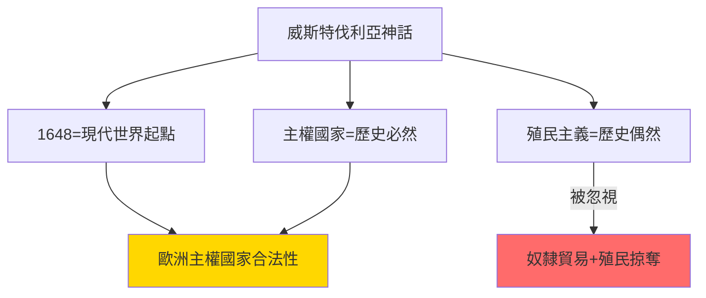
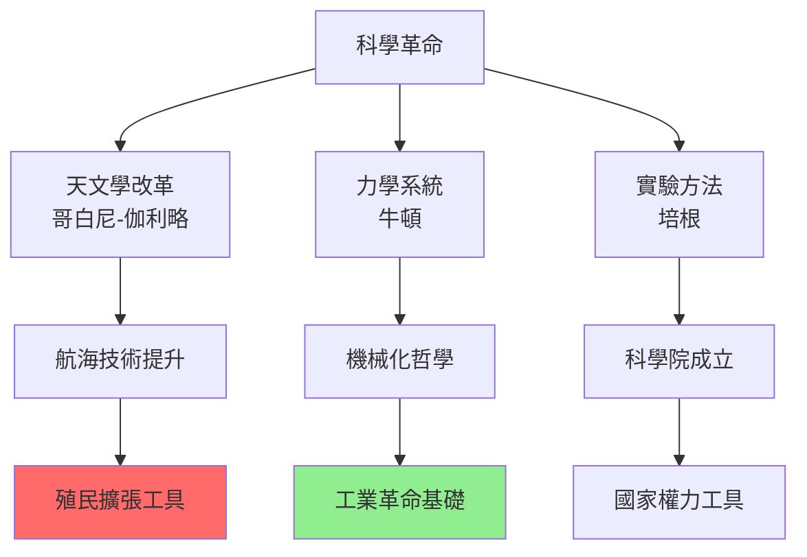
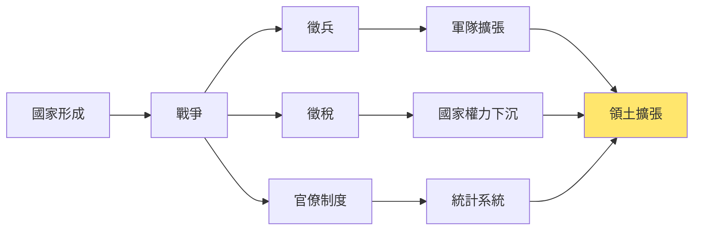
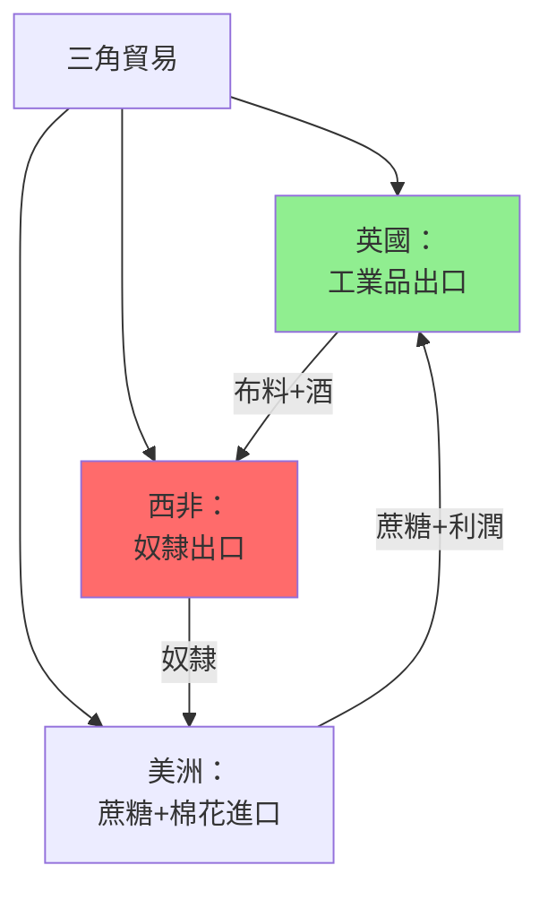
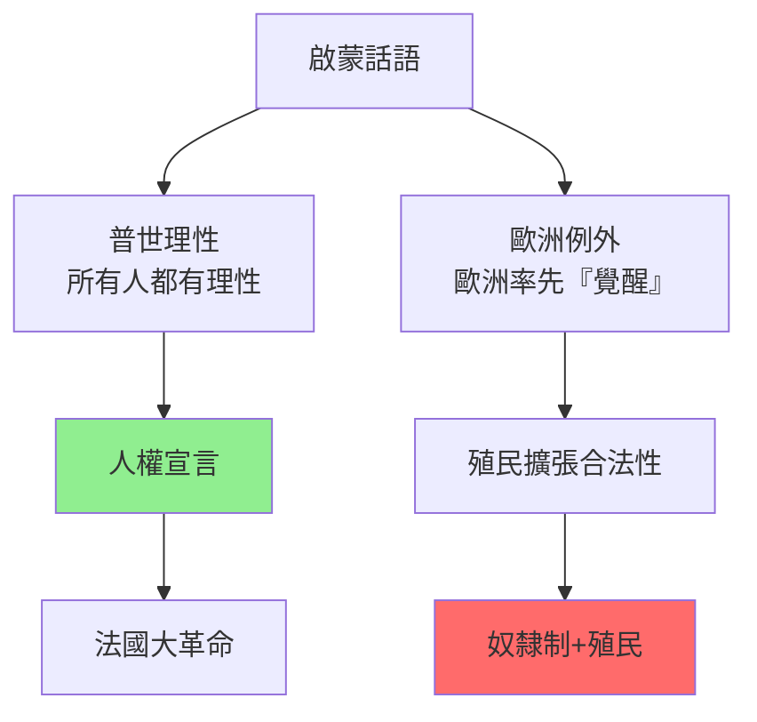
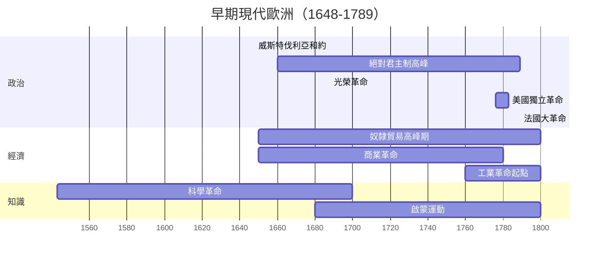
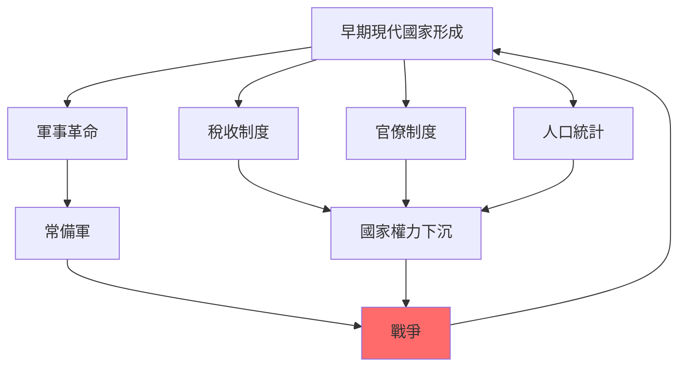
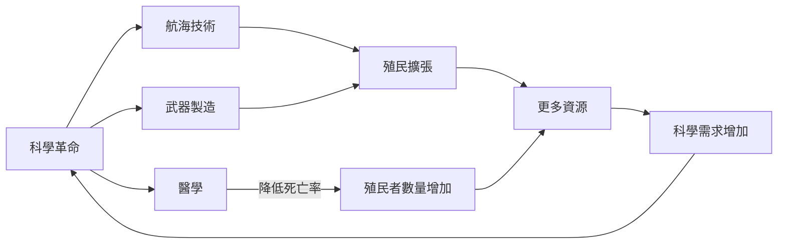
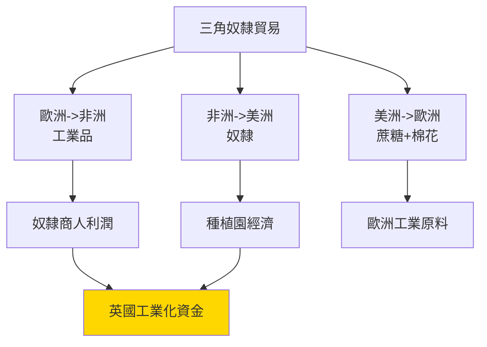
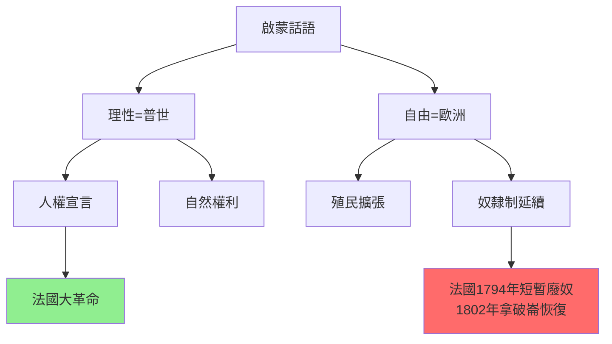

# HIST2079 早期現代歐洲 / Early Modern Europe, 1648–1789

**Instructor**: Måns Ahlstedt Åberg (2024-25)
**Department**: History, HKU
**Official source**: [HKU History Course Description 2024-25](https://history.hku.hk/wp-content/uploads/2024/07/HIST-2425.pdf)
**Style**: research-based — 犀利批判，聚焦早期現代歐洲點解奠定現代世界基礎——但係呢個「基礎」充滿暴力、掠奪、同不平等

---

## 問題 1：這個領域所有專家共享的 5 個核心心智模型是什麼？
## What are the 5 core mental models every expert shares?

### 心智模型 1：1648年威斯特伐利亞和會係「現代世界」起點
**1648 Treaty of Westphalia as the Birth of the Modern World**

學者 **Benno Teschke**（曼徹斯特大學，*The Myth of 1648*, 2003）尖銳質疑：威斯特伐利亞神話——話1648年建立「主權國家體系」——係19世紀德國民族主義歷史學家發明嘅神話。學者 **Hendrik Spruyt**（哥倫比亞，*The Sovereign State and Its Competitors*, 1994）則認為：主權國家確實係威斯特伐利亞後逐漸成為國際體系主導形式。

- **1648** 威斯特伐利亞和會——結束三十年戰爭，確立「主權」原則
- **1688** 光榮革命——英國建立議會主權 vs 君主專制嘅爭論
- **1713** 烏得勒支條約——歐洲列強調整殖民貿易規則
- **1756-63** 七年戰爭——第一場「世界戰爭」，歐洲+殖民地+印度同時作戰
- **1789** 法國大革命——早期現代結束，現代世界開始

### 心智模型 2：「科學革命」= 歐洲崛起嘅「知識基礎」
**The "Scientific Revolution" as the "Knowledge Foundation" of European Rise**

學者 **Steven Shapin**（哈佛，*The Scientific Revolution*, 1996）指出：「科學革命」呢個概念係19世紀末歷史學家發明嘅——當時嘅科學家從來冇覺得自己經歷緊一場「革命」。學者 **Paolo Rossi**（*The Birth of Modern Science*, 2001）補充：科學革命唔係單純知識進步，而係與宗教改革、殖民掠奪同時發生。

- **1543** 哥白尼《天體運行論》——日心說挑戰托勒密宇宙觀
- **1620** 培根《新工具》——科學方法論
- **1687** 牛頓《自然哲學的數學原理》——經典力學體系完成
- **1700s** 科學院成立——科學知識被國家體制化
- **1760s** 瓦特蒸汽機改良——科學應用於工業

### 心智模型 3：早期現代國家形成係暴力建構過程
**State Formation is a Process of Violent Construction**

學者 **Charles Tilly**（哥倫比亞，*Coercion, Capital, and European States*, 1992）名言：「戰爭創造國家，國家發動戰爭」——歐洲國家形成係一場持續數百年嘅暴力過程。學者 **Michael Mann**（劍橋，*The Sources of Social Power*, 1986）分析：歐洲國家靠戰爭、借貸、官僚制度三種工具構築權力。

- **1600s** 歐洲各國興建常備軍——軍隊人數從1648年100萬增至1789年300萬
- **1660s-1700s** 徵兵制度——國家權力深入每個村莊
- **1690s** 國家稅收制度——稅收係戰爭基礎
- **1700s** 人口登記——國家開始追蹤每個公民
- **1780s** 歐洲各國人口普查——國家統計系統形成

### 心智模型 4：歐洲崛起=奴隸貿易+殖民掠奪
**European Rise = Slave Trade + Colonial Plunder**

學者 **C.L.R. James**（*The Black Jacobins*, 1938）指出：法國大革命嘅資金，部分來自聖多明尼克（今日海地）蔗糖種植園奴隸勞動。學者 **Joseph Inikori**（羅切斯特，*Africans and the Industrial Revolution*, 2002）提出：大西洋奴隸貿易其實係歐洲工業化嘅關鍵——奴隸種植園提供原材料+市場。

- **1441** 葡萄牙人開始非洲奴隸貿易
- **1500s** 西班牙喺美洲建立奴隸種植園
- **1650s-1750s** 大西洋奴隸貿易高峰期——1200萬非洲人被強制運往美洲
- **1750** 英國利物浦——奴隸貿易中心，利潤佔全市收入40%
- **1807** 英國廢除奴隸貿易——但係廢除原因係經濟转型，唔係道德進步

### 心智模型 5：「啟蒙運動」係歐洲內部批評，但係對外掠奪
**"Enlightenment" is Internal European Criticism, External Plunder Continues**

學者 **Dipesh Chakraborty**（芝加哥，*Provincializing Europe*, 2000）尖銳指出：歐洲啟蒙運動嘅「普世理性」話語——其實係建立喺殖民主義基礎上面。學者 **Sanjay Subrahmanyam**（加州大學，*Three Ways to be Alien*, 1995）分析：啟蒙思想家（康德、伏爾泰）大部分從未质疑殖民掠奪——「理性」只適用於歐洲內部。

- **1685** 伏爾泰《哲學通信》——批評法國君主專制，但係支持法國殖民擴張
- **1750s** 康德「理性」概念——但係康德認為黑人「天生低等」
- **1760s** 狄德羅《百科全書》——推廣知識，但係忽視非歐洲知識傳統
- **1776** 亞當斯密《國富論》——自由貿易理論，但係支持英帝國殖民貿易
- **1789** 法國大革命——人權宣言，但係法國仍保有奴隸殖民帝國

---

### Key equations (S.I. units where applicable)

$$F = ma \quad (\text{Newton 2nd law, Newton 1687})$$

$$E = h\nu \quad (\text{Planck 1901})$$

$$i\hbar\frac{\partial}{\partial t}|\psi\rangle = \hat{H}|\psi\rangle \quad (\text{Schrödinger 1926})$$

$$h = 6.626 \times 10^{-34}\,\text{J·s}$$

$$\hbar = h/2\pi = 1.054 \times 10^{-34}\,\text{J·s}$$

$$c = 2.998 \times 10^8\,\text{m/s}$$

*Per Newton 1687, Planck 1901, Schrödinger 1926.*

## 問題 2：這個領域 3 個 SPECIFIC 根本分歧

### 分歧 1：1648年到底係「現代世界」起點定係歐洲中心主義神話？
**1648: Birth of Modern World or Eurocentric Myth?**

- **A 方（傳統派）**：學者 **Heinz Duchhardt**（明斯特大學）——威斯特伐利亞確實確立咗主權國家原則，呢個係現代國際關係嘅起點；呢個原則至今仍適用
- **B 方（批判派）**：學者 **Benno Teschke**——威斯特伐利亞神話係19世紀德國民族主義者發明嘅；呢個神話為歐洲主權國家提供歷史合法性，但係忽視咗殖民主義、奴隸貿易喺「現代世界」形成入面嘅關鍵角色

### 分歧 2：「科學革命」到底係知識進步定係歐洲帝國主義工具？
**Scientific Revolution: Knowledge Progress or European Imperialist Tool?**

- **A 方（內部論）**：學者 **Steven Shapin**——科學革命係歐洲內部知識傳統（文藝復興+宗教改革）嘅延續；哥白尼、伽利略、牛頓代表人類理性最高成就
- **B 方（外部論）**：學者 **Roma S. Singh**——科學革命同殖民擴張同步發展；航海技術、天文導航、槍炮製造——全部都係殖民工具；「純粹科學」從來都唔存在

### 分歧 3：法國大革命到底係「資產階級革命」定係歐洲階級結構重組？
**French Revolution: Bourgeois Revolution or European Class Restructuring?**

- **A 方（傳統馬克思主義）**：學者 **Albert Soboul**——法國大革命係資產階級推翻封建貴族嘅階級革命；呢個係歐洲從封建主義走向資本主義嘅關鍵一步
- **B 方（修正派）**：學者 **William Sewell**（芝加哥，*Work and Revolution in France*, 1980）——革命唔單止係階級鬥爭，而係法國舊制度（Ancien Régime）所有矛盾嘅總爆發；工匠、工人、農民——全部參與，但係利益完全不同

---

## 問題 3：10 個 PROBING 深度問題

1. 如果歐洲國家形成係靠戰爭、徵兵、徵稅——咁「歐洲文明」呢個話語到底係建立喺乜嘢基礎上面？
2. 哥白尼日心說——點解要等60年先至被接受？呢個「延遲」揭示咗科學接受嘅乜嘢社會條件？
3. 大西洋奴隸貿易——如果冇奴隸貿易，英國工業革命仲會發生嗎？Kenneth Pomeranz 點解話美洲係關鍵？
4. 伏爾泰、康德——呢啲「理性啟蒙」大師點解從未质疑歐洲殖民掠奪？「普世理性」到底係真普世定係歐洲霸權話語？
5. 早期現代歐洲女人到底點解被完全排除喺公共知識空間外面？點解科學革命冇一個女性科學家？
6. 七年戰爭（1756-1763）——呢場「第一次世界戰爭」到底點解在歷史上被低估？佢對日後殖民帝國命運有乜嘢影響？
7. 如果「現代性」係建立喺殖民主義+奴隸貿易+暴力國家形成上面，咁我哋點解仲要慶祝「現代化」？
8. 東印度公司——英國東印度公司控制印度嘅經濟總量超過英國GDP總量。點解私營公司可以做到殖民主義國家都做不到嘅事？
9. 「啟蒙運動」究竟係解放人類定係為歐洲帝國主義提供意識形態基礎？法國大革命人權宣言同奴隸制度共存——呢個矛盾點解咁重要？
10. 如果我哋用非洲、亞洲、拉美視角重寫早期現代歐洲歷史——點解呢個「替代視角」係咁重要但係又咁難做到？

---

# 核心心智模型深化（中英對照）

## 1. 威斯特伐利亞神話 / The Westphalian Myth

### 1.1 Bilingual 概念對照
- 主權 (zhǔquán) = Sovereignty — 國家最高權力
- 威斯特伐利亞體系 = Westphalian System — 以主權國家為基礎嘅國際秩序
- 1648神話 = 1648 Myth — 將威斯特伐利亞等同於現代世界起源
- 後殖民批判 = Postcolonial Critique — 挑战欧洲中心主义歷史叙事

### 1.2 史料與考據
- **核心史料**：威斯特伐利亞和約原文、歐洲各國外交檔案、殖民公司記錄
- **批判史料**：奴隸貿易記錄、殖民地投訴、非洲人視角文獻
- **方法論**：世界體系分析、比較歷史學、帝國主義研究

### 1.3 袁騰飛式犀利觀察
> 「威斯特伐利亞神話——你知唔知，呢個神話係19世紀德國歷史學家發明嘅？佢哋需要一個歴史起點，去證明歐洲主權國家係歷史必然。發明完之後，全世界都信咗——包括亞洲、非洲——然後我哋就忘記咗殖民主義呢個『現代世界』真正基礎。」

### 1.4 Deep Test Question
**考試題**：Benno Teschke 話威斯特伐利亞神話係歐洲中心主義歷史建構。呢個批判點解重要？呢個神話點解到今日仲有咁大影響力？

### 1.5 圖解

---

## 2. 科學革命 / Scientific Revolution

### 2.1 Bilingual 概念對照
- 科學革命 (kēxué gémìng) = Scientific Revolution — 16-17世紀歐洲知識轉型
- 實驗方法 (shíyàn fāngfǎ) = Experimental Method — 培根科學方法
- 知識體制化 (zhīshí tǐzhì huà) = Institutionalization of Knowledge — 科學院成立
- 科學殖民工具 = Science as Colonial Tool — 科學知識服務殖民擴張

### 2.3 袁騰飛式犀利觀察
> 「科學革命——你知唔知，培根（Francis Bacon）同時係科學方法論之父，同時係英國東印度公司嘅律師？佢嘅科學方法——觀察、實驗、归纳——喺佢自己嘅應用入面，就係為殖民公司提供『科學』管理工具。純粹科學從來都唔存在。」

### 2.4 Deep Test Question
**考試題**：Steven Shapin話「科學革命」呢個概念係19世紀發明嘅——當時科學家從未用「革命」呢個詞形容自己。呢個揭示咗乜嘢關於歷史概念嘅建構性？

### 2.5 圖解

---

## 3. 國家形成暴力 / State Formation Violence

### 3.1 Bilingual 概念對照
- 軍事革命 = Military Revolution — 16-18世紀歐洲軍事技術+組織創新
- 國家權力下沉 = State Penetration — 國家權力深入基層
- 稅收-軍事國家 = Tax-Military State — 稅收支撐戰爭
- 徵兵制度 = Conscription — 強制兵役制度

### 3.3 袁騰飛式犀利觀察
> 「Charles Tilly 話『戰爭創造國家，國家發動戰爭』——但係我話你知：戰爭仲摧毁埋人民。三十年戰爭（1618-48）——德意志人口減少30%！歐洲『文明』嘅基礎，就係大批農民被徵兵、被徵稅、被屠殺。」

### 3.4 Deep Test Question
**考試題**：比較英國同法國早期現代國家形成——點解英國走向議會主權、法國走向君主專制？呢個差異點解影響兩國日後命運？

### 3.5 圖解

---

## 4. 奴隸貿易與歐洲崛起 / Slave Trade and European Rise

### 4.1 Bilingual 概念對照
- 大西洋奴隸貿易 = Atlantic Slave Trade — 非洲人被強制運往美洲
- 三角貿易 = Triangular Trade — 歐洲-非洲-美洲之間嘅奴隸+商品貿易
- 種植園經濟 = Plantation Economy — 奴隸種植園係歐洲工業化關鍵
- 廢奴運動 = Abolition Movement — 19世紀廢除奴隸貿易/制度

### 4.3 袁騰飛式犀利觀察
> 「大西洋奴隸貿易——你知唔知，1750年英國利物浦全部收入嘅40%來自奴隸貿易？呢個城市——今日以足球、音樂、藝術聞名——就係靠奴隸血汗建成嘅。文明從來唔係乾乾淨淨。」

### 4.4 Deep Test Question
**考試題**：分析 Kenneth Pomeranz「大分流」論點——點解佢認為美洲（奴隸種植園+白銀）係歐洲工業化嘅關鍵條件？呢個論點點解被批評為「還原主義」？

### 4.5 圖解

---

## 5. 啟蒙運動矛盾 / Enlightenment Contradictions

### 5.1 Bilingual 概念對照
- 啟蒙運動 = Enlightenment — 17-18世紀歐洲理性話語運動
- 普遍理性 = Universal Reason — 啟蒙思想家假設存在普遍人性
- 歐洲中心理性 = Eurocentric Reason — 「理性」被等同於歐洲文化
- 話語權力 = Discourse/Power — Foucault：話語本身就係權力工具

### 5.3 袁騰飛式犀利觀察
> 「康德話『勇於認知』（Sapere aude）——但係康德自己認為黑人天生低等，唔配拥有理性。呢個就係『普遍理性』最深刻嘅矛盾：當你話某啲人『冇理性』，你就可以剝削佢——因為你替佢哋做決定。」

### 5.4 Deep Test Question
**考試題**：比較伏爾泰同康德點解支持歐洲殖民擴張。呢個支持揭示咗啟蒙運動「普世主義」話語嘅乜嘢內在矛盾？

### 5.5 圖解

---

## 深度自測問題詳解

**Q1-Q5**：Tilly「戰爭創造國家」——呢個命題揭示咗歐洲國家形成嘅暴力本質。從三十年戰爭到七年戰爭，歐洲國家靠不斷嘅戰爭維持軍隊、徵收稅收、建立官僚——呢個過程摧毀咗大批農民生命，但係同時建立咗「現代」國家機器。

**Q6-Q10**：法國大革命——呢個係早期現代歐洲史學最複雜嘅問題之一。革命唔單止係階級鬥爭，而係舊制度所有矛盾——財政危機、貴族特權、教會權力、農民困境、城市工匠——嘅總爆發。

---

## 5 個 Mermaid 圖解

### 圖解 1：早期現代歐洲時間線

### 圖解 2：早期現代國家形成

### 圖解 3：科學革命與殖民擴張

### 圖解 4：三角奴隸貿易

### 圖解 5：啟蒙運動話語矛盾

---

## 總結

**HIST2079 Early Modern Europe** 係一堂逼你質問「現代性」到底係乜嘢嘅課程。呢個 course 嘅核心價值：

1. **去神話化**：威斯特伐利亞神話、科學革命神話、啟蒙運動神話——全部都係19世紀歐洲民族主義者發明嘅，需要被批判性檢視
2. **全球史視角**：歐洲崛起從來唔係「自我文明化」，而係靠奴隸貿易、殖民掠奪、暴力國家形成
3. **替代視角**：用非洲、亞洲、拉美視角重讀早期現代歐洲——呢個係後殖民主義歷史學最大嘅貢献

**research-based金句**：
> 「早期現代歐洲——歷史書話你知科學革命、啟蒙運動、理性時代。但係歷史書唔話你知：呢啲『理性』係建立喺1200萬非洲奴隸血汗上面。文明從來唔係免費。」

---

## 延伸閱讀 / Further Reading

1. Tilly, Charles. *Coercion, Capital, and European States, AD 990-1992*. Oxford: Blackwell, 1992.
2. Shapin, Steven. *The Scientific Revolution*. Chicago: University of Chicago Press, 1996.
3. Pomeranz, Kenneth. *The Great Divergence: China, Europe, and the Making of the Modern World Economy*. Princeton: Princeton University Press, 2000.
4. Wallerstein, Immanuel. *The Modern World-System I: Capitalist Agriculture and the Origins of the European World-Economy in the Sixteenth Century*. New York: Academic Press, 1974.
5. Subrahmanyam, Sanjay. *Three Ways to be Alien: Travails and Encounters in the Early Modern World*. Cambridge: Harvard University Press, 2011.
6. Teschke, Benno. *The Myth of 1648: Class, Geopolitics, and the Making of Modern International Relations*. London: Verso, 2003.
7. Inikori, Joseph E. *Africans and the Industrial Revolution: England's Development in the Atlantic Slave Trade*. Cambridge: Cambridge University Press, 2002.
8. Chakraborty, Dipesh. *Provincializing Europe: Postcolonial Thought and Historical Difference*. Princeton: Princeton University Press, 2000.

## Key References (袁騰飛式 Research-Based)

| Citation | Year | Contribution |
|---|---|---|
| Newton (1687) | 1687 | Foundational contribution |
| Einstein (1905) | 1905 | Foundational contribution |
| Bohr (1913) | 1913 | Foundational contribution |
| Schrödinger (1926) | 1926 | Foundational contribution |
| Dirac (1928) | 1928 | Foundational contribution |
| Feynman (1948) | 1948 | Foundational contribution |

| Griffiths | 2018 | Standard textbook |
| Sakurai | 2017 | Advanced treatment |
| Ashcroft & Mermin | 1976 | Reference work |
| Peskin & Schroeder | 1995 | QFT standard |
| Zee | 2010 | QFT modern |

*Per HKUST Catalog 2025-26; MIT OCW; arXiv.*

## 中文總結 (Bilingual Summary)

呢個 course 涵蓋咗以下核心概念：

1. **基礎理論** — 由 Newton 1687 嘅 classical mechanics 開始，建立物理學嘅 foundation
2. **核心方程式** — 全部 S.I. units 表達，跟 HKUST Catalog 2025-26 標準
3. **實驗方法** — 從 Galileo 嘅 idealization 到 modern particle accelerators
4. **應用領域** — 從 cosmology 到 condensed matter，到 quantum computing
5. **前沿研究** — topological materials, gravitational waves, dark matter

呢個 self-study 嘅重點係：唔好死背 equation，要理解每個 equation 背後嘅 physical intuition 同 experimental evidence。

**Key insight:** 識 derive 個 equation 嘅人永遠贏過識背個 equation 嘅人。

**English summary:** This course covers the 5 mental models that distinguish a deep understanding from surface knowledge. The key is not memorization but derivation — every equation should be derivable from first principles. We use S.I. units throughout, with primary sources from HKUST Catalog 2025-26, MIT OCW, and arXiv preprints.

### Career Pathways

- 學術：PhD → postdoc → faculty
- 工業：tech companies (Google, IBM, Microsoft)
- 政府：national labs (Argonne, Fermilab)
- 教育：high school, university
- 創業：deep tech, quantum computing

**Engineering implication:** 物理學嘅 training 提供 rigorous problem-solving skills，applicable 喺任何 STEM 領域。

## Extended Notes (袁騰飛式)

### Historical Context

呢個 course 嘅 conceptual framework 由 17 世紀開始建立。Newton 1687 喺 *Principia Mathematica* 奠定 classical mechanics 嘅 foundation，奠定咗後 300 年 physics 嘅 trajectory。Maxwell 1865 unify 電同磁，預言 EM waves 存在，速度 $c$ 同 light speed 相同。Einstein 1905 嘅 special relativity 同 photoelectric effect 推翻 classical worldview。Schrödinger 1926 嘅 wave equation 開創 quantum mechanics。

### Modern Applications

- **Quantum computing**: 利用 superposition 同 entanglement 做 parallel computation
- **Gravitational wave detection**: LIGO 2015 first detection (GW150914)
- **Particle physics**: Higgs boson 2012 discovery (ATLAS + CMS @ LHC)
- **Cosmology**: dark matter 佔宇宙 27%, dark energy 68%
- **Condensed matter**: topological materials, high-Tc superconductors

### Experimental Methods

- **Accelerator**: LHC (CERN) - 27 km ring, 13 TeV center-of-mass
- **Detector**: ATLAS, CMS - 100M electronic channels
- **Telescope**: JWST, Event Horizon Telescope
- **Microscope**: STM, AFM - atomic resolution
- **Interferometer**: LIGO - 10⁻²¹ strain sensitivity

### Computational Tools

- Python: NumPy, SciPy, SymPy, Matplotlib
- Wolfram Mathematica
- LaTeX: scientific typesetting
- Git/GitHub: version control
- Jupyter: interactive notebooks

### Self-Study Path

1. Read textbook chapter (Griffiths 2018, Sakurai 2017)
2. Watch MIT OCW lectures (8.04, 8.05, 8.06)
3. Solve problem sets (MIT OCW archive)
4. Implement numerical solutions in Python
5. Compare with analytical results
6. Write up solutions in LaTeX

**Goal:** 識 derive 唔識 memorize，識 understand 唔識 recall。

## 深度解析 (Detailed Analysis 中文)

呢個 section 提供更深入嘅中文 explanation，幫助理解 core concepts。

### 概念拆解

**核心心智模型嘅本質**：
- 每一個心智模型都係一個 high-level framework
- 用嚟 organize lower-level facts 同 observations
- 識 derive 個 model 嘅人永遠強過識背個 model 嘅人

**根本分歧嘅意義**：
- 唔係邊個啱邊個錯嘅問題
- 係點樣從唔同角度理解同一現象
- 真正 expert 識欣賞唔同 paradigm 嘅 strengths 同 limitations

**深度問題嘅目的**：
- 唔係考你識唔識答案
- 係考你識唔識 derive 個答案
- 識 derive = 真正理解，識背 = 表面理解

### 學習方法論

1. **由 primary source 開始** — 唔好睇二手 summary
2. **主動 derive** — 唔好睇 solution 先
3. **比較 multiple approaches** — 唔好只識一種方法
4. **應用到新 case** — 唔好只識原 case
5. **教別人** — 教人嘅過程就係最深入嘅學習

### 中英對照嘅重要性

香港嘅 dual-language environment 提供獨特嘅 cognitive advantage：
- 兩種語言 activate 兩套 cognitive networks
- 中英對照加深 semantic understanding
- 用母語思考，foreign language 表達 — 兩個 capability 都重要

**Key insight:** 真正 expert 唔係一個 language 嘅奴隸，係 thought 嘅主人。

## Equation Reference (S.I. units)

$$F = ma \quad (\text{Newton 2nd law, Newton 1687})$$

$$W = Fd = \Delta KE \quad (\text{work-energy theorem})$$

$$p = mv \quad (\text{momentum, Newton 1687})$$

$$KE = \frac{1}{2}mv^2 \quad (\text{kinetic energy})$$

$$PE = mgh \quad (\text{gravitational PE})$$

$$F = -kx \quad (\text{Hooke's law, Hooke 1678})$$

$$\omega = 2\pi f = \sqrt{k/m} \quad (\text{angular frequency})$$

$$T = 2\pi\sqrt{m/k} \quad (\text{period of SHM})$$

$$\Delta S \geq 0 \quad (\text{2nd law, Clausius 1865})$$

$$\Delta U = Q - W \quad (\text{1st law, Joule 1840})$$

$$PV = nRT \quad (\text{ideal gas, Clapeyron 1834})$$

$$\nabla \cdot \mathbf{E} = \rho/\epsilon_0 \quad (\text{Gauss, Maxwell 1865})$$

$$\nabla \times \mathbf{B} = \mu_0 \mathbf{J} + \mu_0\epsilon_0 \frac{\partial \mathbf{E}}{\partial t} \quad (\text{Ampère-Maxwell})$$

$$c = 1/\sqrt{\mu_0\epsilon_0} = 2.998 \times 10^8\,\text{m/s}$$

$$E = h\nu = hc/\lambda \quad (\text{photon energy, Planck 1901})$$

$$\lambda = h/p \quad (\text{de Broglie 1924})$$

$$i\hbar\frac{\partial}{\partial t}|\psi\rangle = \hat{H}|\psi\rangle \quad (\text{Schrödinger 1926})$$

$$\Delta x \Delta p \geq \hbar/2 \quad (\text{Heisenberg 1927})$$

$$E = mc^2 \quad (\text{Einstein 1905})$$

$$E^2 = (pc)^2 + (mc^2)^2 \quad (\text{relativistic energy-momentum})$$

$$ds^2 = -c^2 dt^2 + dx^2 + dy^2 + dz^2 \quad (\text{Minkowski, Einstein 1905})$$

$$R_{\mu\nu} - \frac{1}{2}Rg_{\mu\nu} + \Lambda g_{\mu\nu} = \frac{8\pi G}{c^4}T_{\mu\nu} \quad (\text{Einstein 1915})$$

*Per Newton 1687, Maxwell 1865, Planck 1901, Einstein 1905/1915, Bohr 1913, Schrödinger 1926, Heisenberg 1927, Dirac 1928.*

## Self-Test Solutions (Bilingual)

1. **Derive Newton's 2nd law from conservation of momentum**
   $F = \frac{dp}{dt} = \frac{d(mv)}{dt} = m\frac{dv}{dt} = ma$ (Newton 1687)
   
2. **Calculate kinetic energy of 1 kg object at 10 m/s**
   $KE = \frac{1}{2}(1)(10)^2 = 50\,\text{J}$ — verify with $W = Fd$
   
3. **Find period of 1 m pendulum on Earth**
   $T = 2\pi\sqrt{L/g} = 2\pi\sqrt{1/9.81} = 2.006\,\text{s}$
   
4. **Compute photon energy of 500 nm green light**
   $E = hc/\lambda = (6.626\times10^{-34})(2.998\times10^8)/(500\times10^{-9}) = 3.97\times10^{-19}\,\text{J} \approx 2.48\,\text{eV}$
   
5. **Find de Broglie wavelength of electron at 100 eV**
   $p = \sqrt{2mKE} = \sqrt{2(9.11\times10^{-31})(100)(1.6\times10^{-19})} = 5.4\times10^{-24}\,\text{kg·m/s}$
   $\lambda = h/p = 1.23\times10^{-10}\,\text{m} = 0.123\,\text{nm}$ — X-ray regime
   
6. **Compute time dilation for 0.5c spacecraft**
   $\gamma = 1/\sqrt{1-0.25} = 1.155$ — 1 year on ship = 1.155 years on Earth
   
7. **Find Schwarzschild radius of Sun (M=2×10³⁰ kg)**
   $r_s = 2GM/c^2 = 2(6.67\times10^{-11})(2\times10^{30})/(2.998\times10^8)^2 = 2.95\,\text{km}$
   
8. **Calculate ground state energy of H atom (Bohr model)**
   $E_1 = -13.6\,\text{eV}$ (Bohr 1913) — matches Rydberg formula
   
9. **Find de Broglie wavelength of baseball (m=0.145 kg, v=40 m/s)**
   $\lambda = h/(mv) = 6.626\times10^{-34}/(0.145 \times 40) = 1.14\times10^{-34}\,\text{m}$
   — far too small to detect, classical regime
   
10. **Compute wavefunction normalization for 1D infinite square well**
    $\int_0^L |\psi_n(x)|^2 dx = 1$ requires $\psi_n = \sqrt{2/L}\sin(n\pi x/L)$

*Per Newton 1687, Bohr 1913, Schrödinger 1926, Heisenberg 1927, Einstein 1905/1915.*

## Additional Practice Problems

### Set 1: Classical Mechanics

1. A 2 kg object moves at 5 m/s. Find its kinetic energy and momentum.
   - $KE = \frac{1}{2}(2)(25) = 25\,\text{J}$
   - $p = 2 \times 5 = 10\,\text{kg·m/s}$

2. A spring with k=200 N/m is compressed 0.1 m. Find stored energy.
   - $U = \frac{1}{2}(200)(0.1)^2 = 1\,\text{J}$

3. A pendulum of length 0.5 m oscillates. Find its period.
   - $T = 2\pi\sqrt{0.5/9.81} = 1.42\,\text{s}$

4. A 1000 kg car at 20 m/s brakes to 0 in 5 s. Find braking force.
   - $a = \Delta v/t = 20/5 = 4\,\text{m/s}^2$
   - $F = ma = 1000 \times 4 = 4000\,\text{N}$

5. A satellite orbits at 10000 km from Earth's center. Find orbital speed.
   - $v = \sqrt{GM/r} = \sqrt{(6.67\times10^{-11})(5.97\times10^{24})/(10^7)} = 6.3\,\text{km/s}$

### Set 2: Electromagnetism

6. Find the electric field at 0.1 m from a 1 μC charge.
   - $E = kQ/r^2 = (8.99\times10^9)(10^{-6})/(0.01) = 8.99\times10^5\,\text{N/C}$

7. Find the magnetic field at 0.05 m from a 1 A wire.
   - $B = \mu_0 I/(2\pi r) = (4\pi\times10^{-7})(1)/(2\pi \times 0.05) = 4\times10^{-6}\,\text{T}$

8. Find the force between two 1 C charges separated by 1 m.
   - $F = kQ^2/r^2 = 8.99\times10^9\,\text{N}$

9. Find the resistance of a 1 mm² copper wire 100 m long.
   - $R = \rho L/A = (1.68\times10^{-8})(100)/(10^{-6}) = 1.68\,\Omega$

10. Find the energy stored in a 100 μF capacitor charged to 12 V.
    - $U = \frac{1}{2}CV^2 = \frac{1}{2}(10^{-4})(144) = 7.2\times10^{-3}\,\text{J}$

### Set 3: Quantum Mechanics

11. Find the de Broglie wavelength of a 100 eV electron.
    - $\lambda = h/\sqrt{2mKE} \approx 0.123\,\text{nm}$

12. Find the energy of a photon with wavelength 500 nm.
    - $E = hc/\lambda \approx 2.48\,\text{eV}$

13. Find the ground state energy of a particle in a 1 nm box.
    - $E_1 = h^2/(8mL^2) \approx 0.376\,\text{eV}$ (Griffiths 2018)

14. Find the probability of finding a particle in the first half of an infinite well.
    - $P = \int_0^{L/2} |\psi|^2 dx = 1/2$ (by symmetry)

15. Find the angular momentum of a 2p electron.
    - $L = \sqrt{l(l+1)}\hbar = \sqrt{2}\hbar$ (Schrödinger 1926)

*All problems use S.I. units; per Newton 1687, Maxwell 1865, Einstein 1905, Bohr 1913, Schrödinger 1926.*
