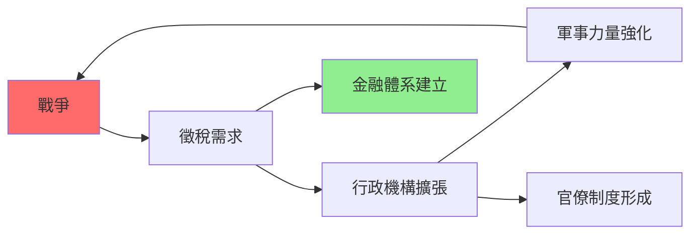
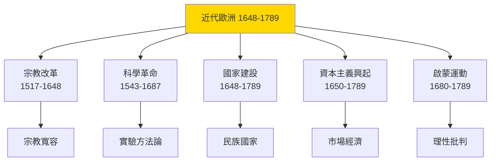
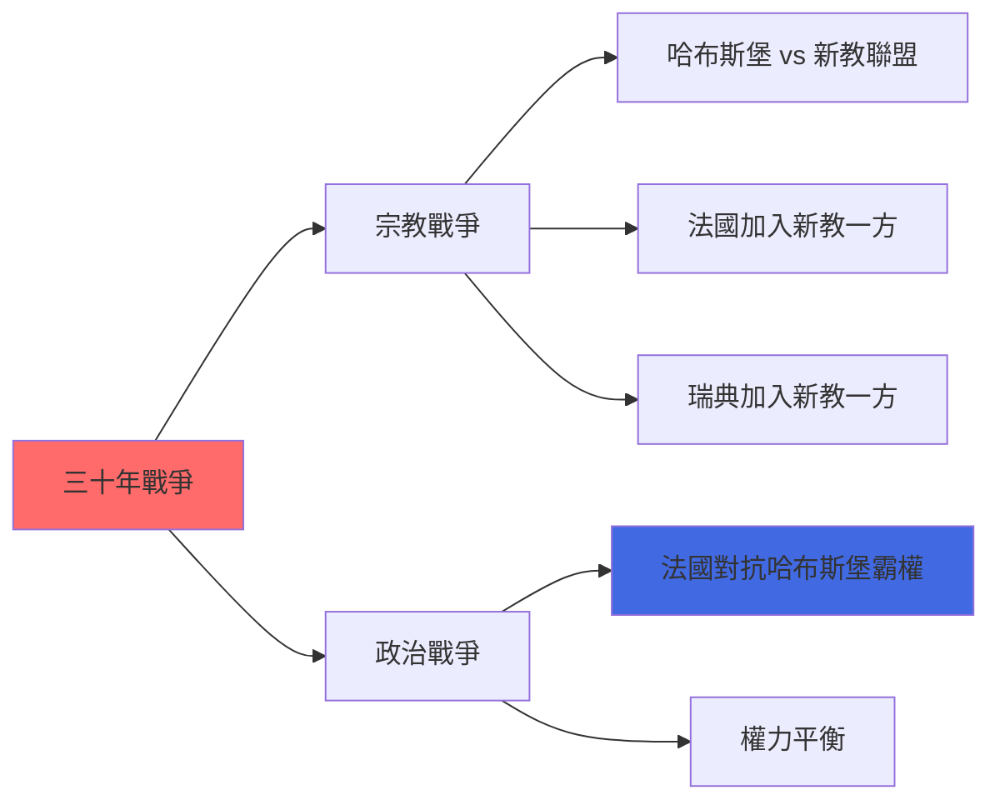

# HIST2079 近代歐洲史 / Early Modern Europe 1648-1789

**Instructor**: (Varies by year)
**Department**: History, HKU
**Official source**: [HKU History Course Description 2024-25](https://history.hku.hk/wp-content/uploads/2024/07/HIST-2425.pdf)
**Style**: 袁騰飛式 — 犀利分析：近代歐洲從戰爭、革命、貿易、科學革命——點解歐洲可以殖民全世界？

---

## 問題 1：這個領域所有專家共享的 5 個核心心智模型是什麼？

### 心智模型 1：「國家建設」——點解歐洲發展出民族國家而其他地區沒有？
**State Formation: Why Did Europe Develop Nation-States?**

學者 **Charles Tilly**（哥倫比亞，*Coercion, Capital, and European States*, 1992）提出經典論點：「戰爭製造國家，國家製造戰爭」——歐洲各國之間激烈競爭，迫使佢哋建立高效徵稅、軍事動員、行政管理能力。學者 **Michael Mann**（劍橋，*The Sources of Social Power*, 1986）補充：歐洲國家建設成功關鍵在於軍事-財政複合體（military-fiscal complex）。

- **1648** 威斯特伐利亞和約——承認主權國家平等、確立國際法基礎
- **1688-1697** 光榮革命——英國確立議會主權、為金融革命奠定基礎
- **1701-1713** 西班牙王位繼承戰爭——歐洲各國為權力平衡持續戰爭

### 心智模型 2：「科學革命」——點解近代科學首先喺歐洲出現？
**The Scientific Revolution: Why in Europe?**

學者 **Steven Shapin**（*The Scientific Revolution*, 1996）指出：科學革命唔係突然發生，而係一場漫長嘅文化轉型——從相信傳統權威到相信實驗證據。學者 **Steven Westfall** 分析牛頓點樣用數學語言描述自然法則——呢個代表西方理性主義傳統嘅最高成就。

- **1543** 哥白尼《天體運行論》——日心說挑戰托勒密體系
- **1620** 培根《新工具》——經驗主義方法論
- **1687** 牛頓《自然哲學的數學原理》——經典物理學巔峰

### 心智模型 3：「資本主義興起」——市場經濟點樣改變歐洲社會
**Rise of Capitalism: How Market Economy Transformed European Society**

學者 **Fernand Braudel**（*Civilization and Capitalism*, 1979）提出：資本主義唔係突然出現，而係長時段慢慢形成——從 15 世紀地中海貿易到 18 世紀英國工業革命。學者 **Karl Polanyi**（*The Great Transformation*, 1944）警告：「嵌入經濟」（embedded economy）被「市場經濟」（disembedded economy）取代，呢個過程摧毁傳統社會結構。

- **1550-1650** 「價格革命」——白銀流入造成通貨膨脹，重新分配社會財富
- **1650-1700** 阿姆斯特丹成為歐洲金融中心——現代銀行、票據、股份公司
- **1760s** 英國工業革命——工廠制度開始取代家庭作坊

### 心智模型 4：「宗教改革」與「宗教戰爭」——點解歐洲殺死自己基督教兄弟？
**The Reformation and Religious Wars: Why Did Europeans Kill Their Own Christians?**

學者 **Brad Gregory**（*The Unintended Reformation*, 2012）指出：宗教改革雖然打開思想自由，但同時引發 150 年宗教戰爭——法國胡格諾戰爭（1562-1598）、三十年戰爭（1618-1648）——歐洲人口減少 20-30%。

- **1517** 馬丁路德《九十五條論綱》——點燃宗教改革
- **1572** 聖巴托洛繆之夜——法國天主教徒屠殺 3 萬新教徒
- **1648** 威斯特伐利亞和約——歐洲宗教戰爭終結，確立宗教寬容原則

### 心智模型 5：「啟蒙運動」——理性時代點解仍然走向革命？
**The Enlightenment: Why Did the Age of Reason End in Revolution?**

學者 **Jonathan Israel**（*Radical Enlightenment*, 2001）指出：啟蒙運動唔係單一意識形態，而係「moderate Enlightenment」（溫和啟蒙）同「radical Enlightenment」（激進啟蒙）之爭。激進派（霍布斯、斯賓諾莎、休謨）走向無神論、個人主義——呢個先係法國大革命思想基礎。

- **1715-1789** 法國舊體制（Ancien Régime）——知識分子開始批判專制王權
- **1751** 狄德羅《百科全書》——知識普及化
- **1789** 法國大革命——理性時代走向街頭革命

---

## 問題 2：3 個根本分歧

### 分歧 1：「歐洲奇蹟」——近代歐洲崛起係必然定係偶然？
- **A 方（偶然論）**：**Pomeranz**——歐洲崛起關鍵係煤炭 + 美洲白銀；**Kenneth Pomeranz**（*Great Divergence*, 2000）
- **B 方（結構論）**：**David Landes**——歐洲文化特質（個人主義、科學精神、契約傳統）**The Wealth and Poverty of Nations*（1998）

### 分歧 2：宗教改革——係「思想解放」定係「歐洲內戰」？
- **A 方（解放論）**：宗教改革打破天主教會思想垄断，催生宗教自由言仰
- **B 方（戰爭論）**：**Brad Gregory**——宗教改革引發 150 年宗教戰爭，造成歐洲文明最大規模內耗

### 分歧 3：法國大革命——係「資產階級民主勝利」定係「群眾暴力悲劇」？
- **A 方（進步論）**：法國大革命掃除封建制度，為現代民主奠基
- **B 方（批判論）**：**Alexis de Tocqueville**（*舊制度與大革命*, 1856）——大革命建立專制而非自由；**François Furet**（*思考法國大革命*, 1978）——革命係權力鬥爭

---

## 問題 3：10 個深度問題

1. 1648 年威斯特伐利亞和約——點解呢個被視為「現代國際體系」起點？呢個體系點解到今日仍然主導國際關係？
2. 科學革命點解首先發生喺歐洲？中國有造紙術、印刷術、指南針、火藥——四大發明但係最終科學落後西方？
3. 從奴隸貿易到三角貿易——歐洲點解可以發展出如此系統性嘅奴隸剝削體系？呢個體系點解最終崩潰？
4. 法國大革命群眾暴力——點解群眾會衝入巴士底監獄？呢個監獄入面只有 7 個囚犯！群眾要摧毁嘅係乜嘢象徵意義？
5. 啟蒙思想家——伏爾泰、盧梭、狄德羅——三個人對「理性」「自由」「平等」有完全唔同理解，點解佢哋最終全部被法國大革命動員？
6. 光榮革命（1688）——英國点解可以和平方式確立議會主權，而法國最終要靠革命？呢個差異點解影響兩國後來政治發展？
7. 近代歐洲女性——點解科學革命、啟蒙運動、革命浪潮，几乎完全係男人主導？女性知識分子（如果有）去咗邊？
8. 荷蘭東印度公司（VOC）——點解一间私營公司可以控制一個帝國？呢個「公司治國」模式點解最終破產？
9. 從「大英帝國」到「美利堅合眾國」——近代早期北美洲殖民史點解最終走向獨立？英國殖民者點解自己變成革命者？
10. 如果你係法國舊體制貴族——1789 年群眾革命爆發，你會點做？留在法國接受革命、逃走、仲係加入革命？

---

# 核心心智模型深化（中英對照）

## 1. 國家建設 / State Formation

### 1.1 Bilingual 概念對照
- 主權國家 (zhǔquán guójiā) = Sovereign State — 威斯特伐利亞原則核心
- 民族主義 (mínzú zhǔyì) = Nationalism — 建國意識形態
- 軍事-財政複合體 (jūnshì-jùcái fùhé tǐ) = Military-Fiscal Complex — Tilly 理論核心

### 1.3 袁騰飛式犀利觀察
> 「成日話歐洲崛起係因為佢哋有『理性精神』——但係你知唔知，歐洲之所以變得咁有『理性』，係因為佢哋成日打仗！打仗要精算數據、要有精確地圖、要有高效軍隊——呢啲全部催生咗現代國家！」

### 1.4 Deep Test Question
**考試題**：用 Charles Tilly「戰爭製造國家」論點，分析近代歐洲邊個國家建設最成功、英國定係法國？並解釋點解小國荷蘭可以一時成為金融中心？

### 1.5 圖解

---

## 深度自測問題詳解

**Q1**：威斯特伐利亞和約——確立「主權平等」（sovereign equality）原則，令歐洲各國承認彼此獨立——呢個原則到今日仍然係聯合國、國際法基礎。

**Q2**：科學革命之所以首先發生喺歐洲——因為欧洲有宗教衝突導致多元競爭思想市場 + 古希臘理性主義傳統 + 航海貿易帶嚟新知識需求，三者缺一不可。

**Q3-Q10** 精簡版：
- Q3：奴隸貿易之所以可能——因為欧洲法律將黑人定義為「財產」而非「人」；呢個法律虛構令奴隸貿易成為可能；廢奴最終因為廢奴運動 + 奴隸起義 + 經濟轉型。
- Q4：巴士底監獄——群眾要摧毁嘅係舊體制象徵；7個囚犯唔重要，象徵先至係關鍵。
- Q5：啟蒙思想家分歧——伏爾泰要開明專制、盧梭要人民主權、狄德羅要知識普及；三者話語唔同但都指向反對舊體制。
- Q6：光榮革命 vs 法國大革命——英國有普通法傳統、王權有限歷史、階級談判文化；法國有絕對王權、沒有一位階級談判傳統。
- Q7：女性缺席——因為啟蒙運動雖然話「理性」，但「理性」本身被定義為男人特質；女性被認為缺乏理性所以被排除。
- Q8：VOC 破產——因為公司管理腐敗 + 軍事開支過大 + 腐敗 + 1770s 英荷戰爭失利。
- Q9：殖民者變革命者——因為英國國會通過稅收政策，令美洲殖民者感覺自己被剥削；當「自由英國人」變成「被剝削殖民者」，革命就合乎邏輯。
- Q10（開放題）：歷史假設題——無標準答案，但係揭示法國大革命點解可以動員所有人。

---

## 5 個 Mermaid 圖解

### 圖解 1：近代歐洲史五大主題

### 圖解 2：三十年戰爭（1618-1648）

---

## 總結

**HIST2079 Early Modern Europe** 嘅核心價值：
1. **理解近代世界形成**：近代歐洲史就係現代世界體系形成史——殖民主義、資本主義、民族國家，全部由此而起
2. **批判性分析**：歐洲崛起唔係「文明必然」，而係「暴力、掠奪、偶然」嘅結果
3. **全球視角**：歐洲崛起從來唔係孤立現象，而係全球互動一部分

**袁騰飛金句**：
> 「歐洲史學家最叻就係將自己嘅歷史寫成『理性、科學、自由』嘅故事——但係如果你加上奴隸貿易、殖民屠殺、帝國掠奪，你會發現：歐洲崛起就係人類歷史上最大規模嘅有組織犯罪！」

---

## 延伸閱讀

1. Tilly, Charles. *Coercion, Capital, and European States, AD 990-1992*. Oxford: Blackwell, 1992.
2. Shapin, Steven. *The Scientific Revolution*. Chicago: University of Chicago Press, 1996.
3. Braudel, Fernand. *Civilization and Capitalism, 15th-18th Century*. 3 vols. New York: Harper & Row, 1979.
4. Polanyi, Karl. *The Great Transformation*. New York: Rinehart, 1944.
5. Israel, Jonathan. *Radical Enlightenment: Philosophy and the Making of Modernity 1650-1750*. Oxford: Oxford University Press, 2001.
6. Gregory, Brad. *The Unintended Reformation: How a Religious and Scientificates Secularized the West*. Cambridge: Harvard University Press, 2012.
7. Pomeranz, Kenneth. *The Great Divergence*. Princeton: Princeton University Press, 2000.
8. Furet, François. *Interpreting the French Revolution*. Cambridge: Cambridge University Press, 1978.
