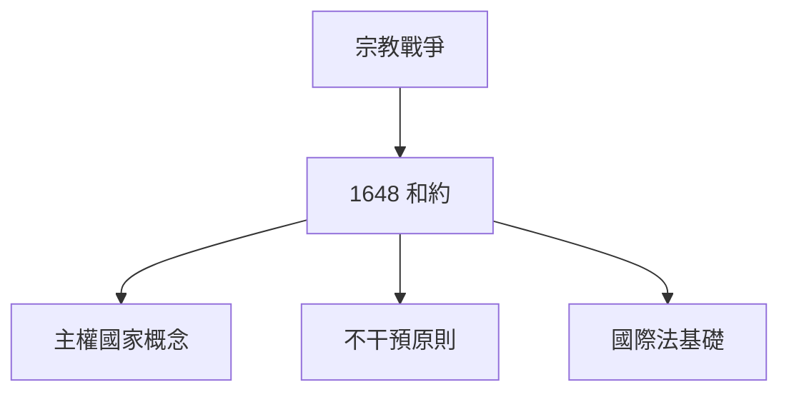
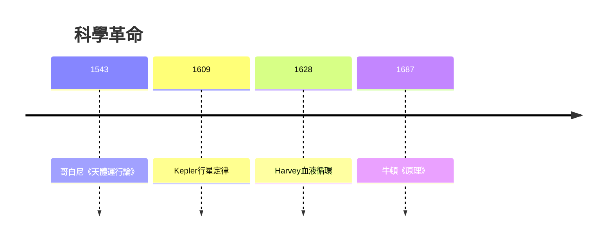
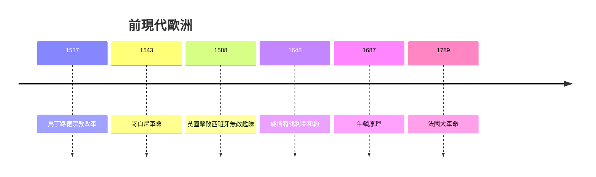
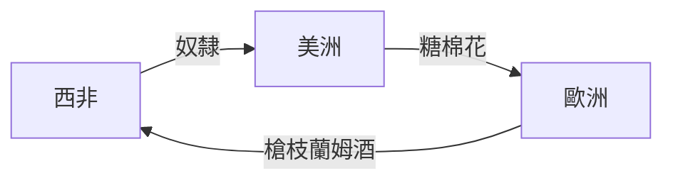
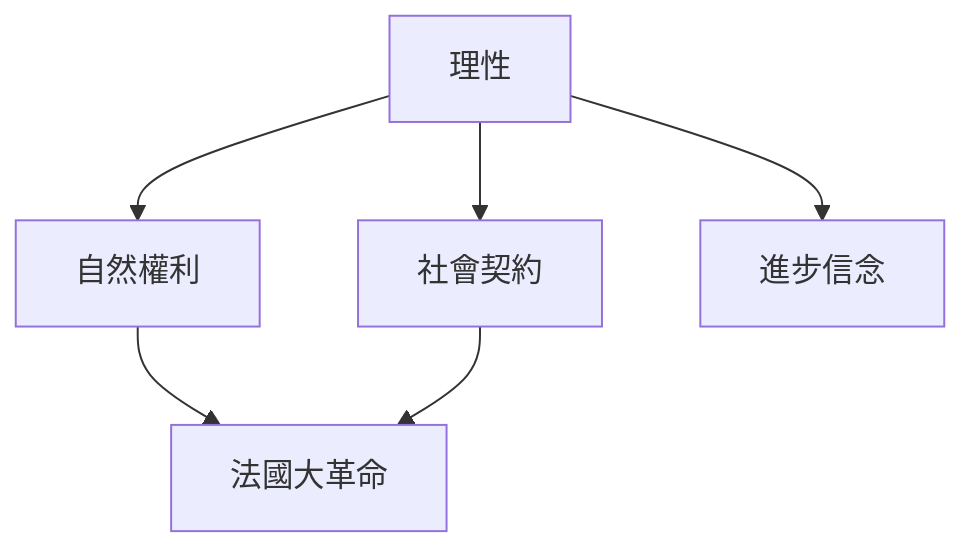
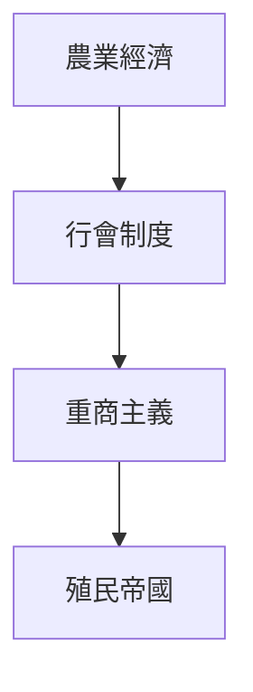

# HIST2079 前現代歐洲 / Early Modern Europe, 1648-1789 (6 credits)

**Instructor**: Måns Åberg
**Department**: History, HKU  
**Official source**: [HKU History Course Description 2024-25](https://history.hku.hk/wp-content/uploads/2024/07/HIST-2425.pdf)
**Style**: 袁騰飛式 — 犀利、聚焦歐洲點解走向現代世界

---

## 問題 1：這個領域所有專家共享的 5 個核心心智模型

### 心智模型 1：1648 年威斯特伐利亞和約與現代國際秩序
學者 **Henry Kissinger** (*World Order*, 2014) 指出：1648 年威斯特伐利亞和約建立現代國際體系基礎——主權國家、不干預內政、集體安全。呢個體系延續至今。

學者 **Benno T. B. Schmidt** 研究：三十年戰爭 (1618-1648) 導致德意志人口減少三分之一——呢個悲劇催生國際法。

- 1648 和約：現代國際法起點
- 主權概念：國家領土內最高權力
- 不干預原則：外國唔可以干預內政

### 心智模型 2：科學革命與理性時代
學者 **Steven Shapin** (*The Scientific Life*, 2006) 研究：17 世紀科學革命改變人類認識世界方式——從宗教權威到實驗驗證。

學者 **Jonathan Israel** (*Radical Enlightenment*, 2001) 指出：理性主義興起挑戰宗教權威，為法國大革命意識形態奠定基礎。

- 1543哥白尼《天體運行論》
- 1687牛頓《自然哲學的數學原理》
- 1762盧梭《社會契約論》

### 心智模型 3：歐洲擴張與殖民征服
學者 **C.R. Boxer** (*The Portuguese Seaborne Empire*, 1969) 研究：葡萄牙、西班牙、荷蘭、英國、法國先後建立全球殖民帝國。

學者 **John H. Elliott** (*The Old World and the New*, 1970) 分析：1492 年哥倫布抵達美洲標誌著全球化起點——呢個「碰撞」改變所有人類命運。

- 1492 哥倫布抵達美洲
- 1498 達伽馬繞過好望角
- 1600 英國東印度公司成立

### 心智模型 4：專制主義與歐洲政治多元化
學者 **Perry Anderson** (*Lineages of the Absolutist State*, 1974) 研究：西歐專制主義係特定歷史條件下嘅產物——地理因素、階級結構、國際競爭。

學者 **Robert Darnton** (*The Great Cat Massacre*, 1984) 提醒：歷史要從下層視角理解——唔好淨係研究君王戰爭，要研究普通人生活。

### 心智模型 5：啟蒙運動與現代價值觀
學者 **Jonathan Israel** (*Enlightenment Contested*, 2006) 分析：啟蒙運動唔係單一現象，而係激進同溫和兩派嘅持續鬥爭。

學者 **Dorinda Outram** (*The Enlightenment*, 2006) 指出：啟蒙運動雖然標榜「普遍理性」，但典型歐洲中心主義——女性、殖民地人民被排除。

---

## 問題 2：3 個根本分歧

### 分歧 1：宗教改革——個人良心勝利定歐洲悲劇？
- **A 方**：宗教改革釋放個人良心
  - **Martin Luther**：「因信稱義」挑戰教會權威
- **B 方**：宗教改革導致 30 年戰爭
  - 1618-1648 年宗教戰爭：800 萬人死亡

### 分歧 2：科學革命——客觀真理定歐洲文化霸權？
- **A 方**：科學方法揭示客觀真理
  - 牛頓物理學仍然適用
- **B 方**：科學係歐洲文化霸權工具
  - 殖民科學為帝國服務

### 分歧 3：專制主義——歷史進步定歷史倒退？
- **A 方**：專制主義建立中央集權，推動現代化
- **B 方**：專制主義鎮壓人民，延遲民主

---

## 問題 3：10 個深度問題

1. 如果宗教改革冇爆發，歐洲會變成點？
2. 點解科學革命發生喺歐洲而唔係中國？
3. 如果哥倫布冇發現美洲，今日世界會係點？
4. 1648 年威斯特伐利亞和約點解仍然影響今日國際關係？
5. 點解啟蒙思想家大部分都歧視女性？
6. 如果法國大革命冇爆發，歐洲會點樣走向現代性？
7. 奴隸貿易點解成為大西洋經濟核心？
8. 點解 18 世紀歐洲農民仍然相信巫術？
9. 如果你是 1700 年普通歐洲人，你點樣理解世界？
10. 專制君主點解要建立絕對皇權？

---

## 核心心智模型深化

### 1. 1648 威斯特伐利亞和約意義



### 2. 科學革命



---

## 深度自測問題

### 詳解 1: 如果宗教改革冇爆發...
如果宗教改革冇爆發，天主教會可能繼續壟斷歐洲思想界，印刷術可能發展得更慢，宗教戰爭可能以其他形式爆發。歷史從來冇「如果」。

### 詳解 2: 點解科學革命發生喺歐洲？
學者提出多個解釋：阿拉伯翻譯運動保存古典希臘羅馬文本；中世紀大學提供制度基礎；宗教改革後思想多元化；地理大發現帶來新知識。

---

## 5 個 Mermaid 圖解

### 📊 Diagram 1: 前現代歐洲大事



### 📊 Diagram 2: 大西洋奴隸貿易



### 📊 Diagram 3: 歐洲殖民帝國

```mermaid
graph LR
    A[葡萄牙] -->|東半球| B[巴西]
    C[西班牙] -->|中美洲| D[墨西哥秘魯]
    E[荷蘭] -->|印尼| F[好望角]
    G[英國] -->|印度北美| H[印度
```

### 📊 Diagram 4: 啟蒙運動思想



### 📊 Diagram 5: 前現代經濟



---

## 總結

1. 1648 年威斯特伐利亞建立現代國際體系
2. 科學革命改變人類認識世界
3. 歐洲擴張改變全球權力格局
4. 啟蒙運動為現代價值觀奠基
5. 前現代歐洲為現代世界提供所有要素

**最後問題**: 如果你去 1700 年，你最驚訝嘅會係乜嘢？

---
**版權所有 © HKU History Self-Study**
