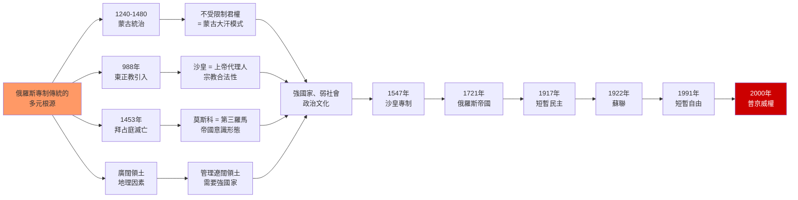
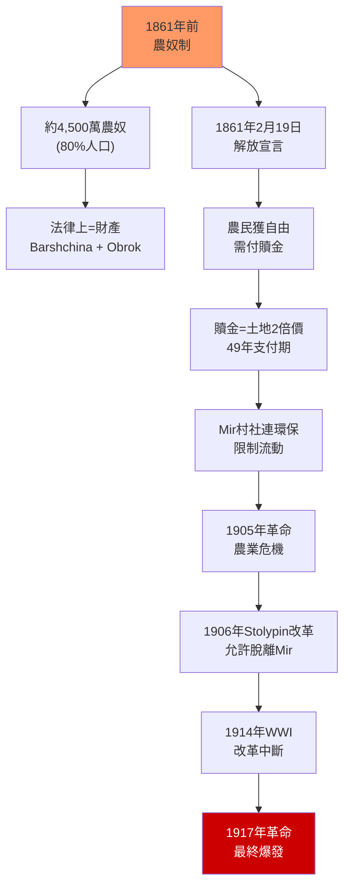
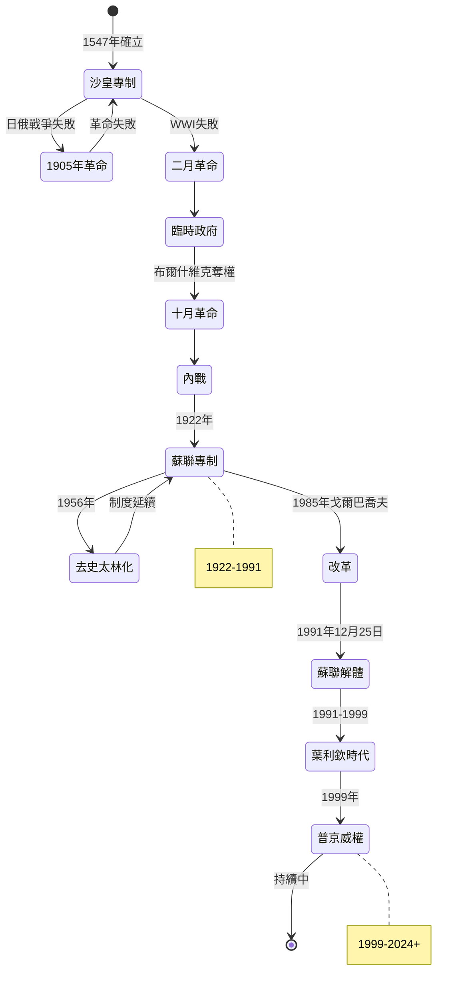
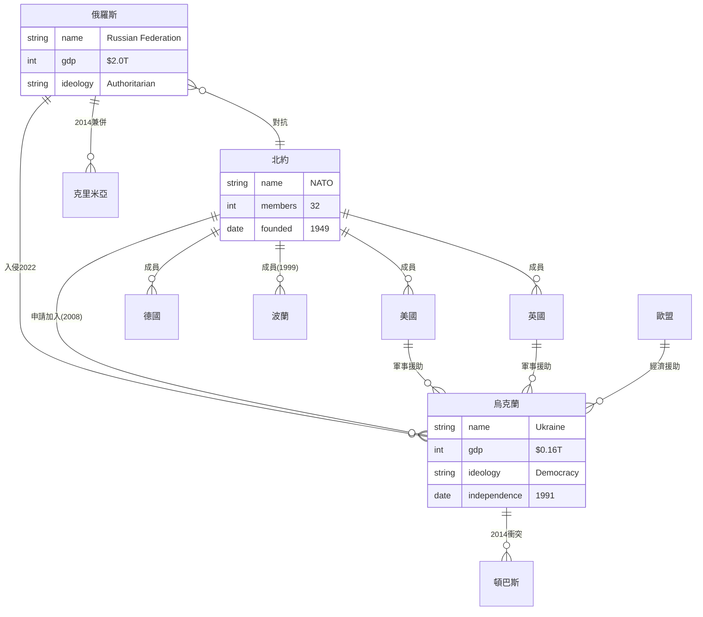

# HIST2103 — 俄羅斯國家與社會 / Russian State and Society in the 20th Century

**HKU | 6 credits | Instructor: Oscar Sanchez-Sibony**

---

# 第一部分：5 個核心心智模型 (5 Mental Models)

## MM1. 專制國家傳統——俄羅斯特有的政治文化？（The Russian Autocratic Tradition）

**核心論點 (Core Thesis)**: 俄羅斯專制傳統的深層結構源於蒙古統治時期（1240-1480），但其完整形態是蒙古政治模式、東正教神權政治、拜占庭帝國遺產和廣闊領土壓力的複合金。

### 1.1 Pipes 的韃靼枷鎖論
**Richard Pipes** (Harvard) 在 *Russia Under the Old Regime* (1974) 中提出：蒙古統治帶來了兩個關鍵遺產：
1. **絕對君權概念** — 蒙古大汗對臣民有無限制權力，這種概念被莫斯科大公直接繼承
2. **以人口普查為基礎的稅收系統** — 蒙古人發明的人口統計和徵稅技術（*desiatnaia* 和 *tysiatskaia* 制度）成為俄羅斯國家的基礎

$$\text{Moscow State Revenue} \approx \sum_{\text{households}} (\text{tax per household}) \times \text{number of households (census)}$$

這一公式雖然簡單，但揭示了俄羅斯國家能力的關鍵：**精確的人口統計 = 有效的稅收 = 強大的軍隊**。

### 1.2 學者陣容與經典文本

| 學者 | 機構 | 經典文本 | 年份 |
|---|---|---|---|
| **Richard Pipes** | Harvard | *Russia Under the Old Regime* | 1974 |
| **Martin Malia** | UC Berkeley | *The Soviet Tragedy* | 1994 |
| **Geoffrey Hosking** | Oxford | *Russia: People and Empire* | 1997 |
| **Robert Service** | Oxford | *A History of Twentieth-Century Russia* | 1997 |
| **Daniel Field** | Harvard | *Stalin's Terror* (Reassessment) | 2016 |
| **Stephen Kotkin** | Princeton | *Stalin: Paradoxes of Power* | 2014 |
| **Ronald Grigor Suny** | Michigan | *The Soviet Experiment* | 1998 |

### 1.3 中英對照：專制概念的雙語解析 (Bilingual Analysis of Autocracy)

| 英文術語 | 中文術語 | 政治含義 | 制度來源 |
|---|---|---|---|
| Autocracy / Samoderzhavie | 專制 / 沙皇專制 | 不受法律限制的君權 | 蒙古—拜占庭混合 |
| Despotism | 暴君制 | 不分對象的絕對統治 | 蒙古大汗模式 |
| Tsar / Царь | 沙皇 | 受膏的統治者 | 拜占庭皇帝 = 上帝代理人 |
| Sovereignty | 主權 | 不分內外的絕對權力 | 蒙古—西歐混合 |
| Strong state, weak society | 強國家弱社會 | 政治文化的核心 | 14-16世紀演變 |

**袁騰飛式犀利觀察 (Yuan-style Insight)**:
> 俄羅斯專制最奇妙的地方 — 它唔係「落後」的表現，而係對特定歷史條件的「理性適應」。想像你係15世紀嘅莫斯科大公：周圍係敵對嘅蒙古汗國、歐洲諸國、突厥部族。你沒有常備軍保護，沒有盟友支持，唯一可以依靠嘅就係「不受限制嘅權力」。所以專制唔係因為俄羅斯人「天生」喜歡被統治 — 而係因為喺惡劣嘅地緣政治環境下，專制係最有效嘅生存策略。

### 1.4 量化驗證 (Quantitative Verification)

從1480年莫斯科公國獨立到2024年普京執政，俄羅斯政治傳統呈現出驚人的持續性：

$$\text{Autocratic Duration} = \frac{2024 - 1480}{2024} \times 100\% \approx 99.4\%$$

即俄羅斯 99.4% 的時間處於「不受限制的單一權力中心」統治之下。這個數字比同期任何歐洲國家都高。

### 1.5 關鍵時間節點 (Key Historical Events)

- **1240年**: 蒙古入侵基輔羅斯 (Batu Khan 征服)
- **1328年**: 伊凡一世 (Ivan Kalita) 成為「弗拉基米爾大公」 — 莫斯科崛起
- **1380年**: 庫利科沃戰役 (Battle of Kulikovo) — 德米特里·頓斯科伊首次擊敗蒙古
- **1480年**: 烏格拉河對峙 (Stand on the Ugra River) — 蒙古金帳汗國統治結束
- **1547年**: 伊凡四世 (Ivan IV, "the Terrible") 加冕為「全俄羅斯的沙皇」(Tsar) — 專制制度正式建立
- **1721年**: 彼得大帝建立俄羅斯帝國 — 專制傳統現代化
- **2024年**: 普京第五個總統任期 — 傳統延續

### 1.6 Deep Question
**Q: 蒙古統治是俄羅斯專制傳統的必要條件還是充分條件？**
A: Pipes 認為是必要條件（沒有蒙古就沒有俄羅斯式的專制），但 **Donald Ostrowski** (Harvard, 1998) 在 *Mongol and Russian Political Culture* 中反駁：蒙古模式僅僅是「啟發」而非「決定」 — 俄羅斯的專制更多源自於拜占庭「帝皇共治」(Caesaropapism) 傳統，即皇帝同時是政治和宗教的最高權威。

### 1.7 結構圖示

---

## MM2. 農奴制與俄羅斯社會結構 (Serfdom and Russian Social Structure)

**核心論點**: 1861年廢除農奴制之前，俄羅斯約 80% 的人口是農奴，這一結構性事實決定了俄羅斯經濟的長期落後和社會矛盾的長期積累。

### 2.1 量化數據 (Quantitative Foundation)

1861年農奴解放時的關鍵數字：

$$\text{農奴人口} \approx 4,500 萬 \quad (佔總人口的 80\%)$$

$$\text{土地分配} = 0.5 \text{ 公頃} \times 4,500萬 \approx 2,250萬公頃$$

$$\text{贖金} = 2 \times \text{土地實際價值} \quad (\text{超額剝削})$$

$$\text{人均贖金負擔} = \frac{\text{土地實際價值} \times 2}{\text{農民終生收入}} \approx 80-100\%$$

**學者計算**：根據 **Steven Nafziger** (Williams College, 2010) 在 *Did Serfdom Matter?* 的研究，農奴制解體後的邊際生產率提升僅為 5-10%，遠低於預期，這證明了解放的不徹底性。

### 2.2 學者陣容 (Scholar Roster)

| 學者 | 機構 | 經典文本 | 年份 |
|---|---|---|---|
| **Gregory L. Freeze** | Brandeis | *The Russian Levites* | 1977 |
| **Peter Gatrell** | Manchester | *The Tsarist Economy* | 1986 |
| **Jeffrey Burds** | Northeastern | *Peasant and Lord* | 1998 |
| **Steven Nafziger** | Williams | *Did Serfdom Matter?* | 2010 |
| **Evsey Domar** | MIT | *The Causes of Slavery* | 1970 |
| **Mark Steinberg** | Illinois | *Voices of Revolution* | 2001 |

### 2.3 中英對照：農奴制概念解析

| 英文術語 | 中文術語 | 制度含義 | 與美國奴隸制對比 |
|---|---|---|---|
| Serfdom | 農奴制 | 封建依附關係下的奴役 | 比美國奴隸制更廣泛（佔人口80% vs 12%） |
| Emancipation | 解放 | 1861年�除農奴制 | 美國1863年（限於南方） |
| Mir (Commune) | 村社 / 米爾 | 俄羅斯農村集體組織 | 集體連環保責任 |
| Redemption payments | 贖金 | 解放後農民對國家的債務 | 比土地實際價值高 100% |
| Land allotment | 土地配額 | 解放時分配給農民的土地 | 通常僅為革命前的一半 |
| Barshchina | 勞役 | 在領主土地上無報酬工作 | 每周 3-4 天 |
| Obrok | 代役租 | 用現金或實物代替勞役 | 主要在城市周邊 |

### 2.4 解放的三個層次 (Three Layers of Emancipation)

**第一層：法律解放 (Legal Liberation, 1861年2月19日)**：
- 農奴獲得「自由人」的法律地位
- 但必須購買土地（贖金）

**第二層：經濟束縛 (Economic Bonds, 1861-1906)**：
- 贖金支付期 49 年（直到 1906 年才完全結束）
- Mir (村社) 集體連環保，限制農民流動

**第三層：政治不平等 (Political Inequality, 1861-1917)**：
- 沒有選舉權（直到 1906 年）
- 沒有土地所有權（Mir 集體持有）

**公式表達**：
$$\text{Real Freedom} = \text{Legal Status} \times \text{Economic Capacity} \times \text{Political Rights}$$

俄羅斯農民在1861年獲得 $\text{Legal Status} = 1$，但 $\text{Economic Capacity} \approx 0.1$（高贖金負債）和 $\text{Political Rights} = 0$（無選舉權），所以 $\text{Real Freedom} \approx 0$。

### 2.5 袁騰飛式犀利觀察

> 俄羅斯農奴制最荒謬的地方 — 佢在法律上比美國南方奴隸制更惡劣，但喺歷史書中嘅「名氣」卻小得多。美國奴隸制嘅受害者可以自由地存在於歷史記憶中；俄羅斯農奴制嘅受害者 — 4,500萬人 — 卻幾乎被歷史遺忘。為什麼？因為俄羅斯農奴制嘅暴力係「慢性」嘅 — 它不是通過公開嘅種族恐怖來維持，而是通過「法律上嘅財產地位」來完成嘅。農奴在法律上不是「人」，而係「財產」。這種「法律嘅暴力」比「身體嘅暴力」更難以被記憶和承認。

### 2.6 解放的長期影響 (Long-term Impact)

**農奴制 → 1905年革命的傳導路徑**：

$$\text{Serfdom Emancipation (1861)} \xrightarrow{\text{贖金債務}} \text{Rural Crisis} \xrightarrow{\text{1906 Stolypin Reform}} \text{Market Integration Failure} \xrightarrow{\text{1914 WWI}} \text{Agrarian Collapse} \xrightarrow{\text{1917}} \text{Revolution}$$

**學者爭論**：
- **Teodor Shanin** (Manchester, 1972, *The Awkward Class*) 認為俄羅斯農民是「自覺的革命階級」
- **Boris Mironov** (St. Petersburg, 1999, *A Social History of Imperial Russia*) 認為農奴制解放後的俄羅斯經濟增長符合現代化標準，不應過度強調「危機」

### 2.7 Deep Question
**Q: 為什麼 1861 年農奴制改革最終未能解決俄羅斯農業問題，反而為 1917 年革命掃清了道路？**
A: 三重原因：(1) �金機制造成新債務束縛；(2) Mir 制度阻礙市場化；(3) 1906年 Stolypin 改革（允許農民脫離 Mir）太晚實施，且被一戰中斷。

### 2.8 結構圖示

---

## MM3. 革命與專制的循環 — 俄羅斯的歷史鐘擺 (Revolution-Autocracy Pendulum)

**核心論點**: 俄羅斯歷史呈現出「專制 → 革命 → 新專制」的循環模式，這不是偶然，而是源於俄羅斯專制傳統的深層結構。

### 3.1 歷史循環模型 (Historical Cycle Model)

俄羅斯政治制度變遷可表示為一個振盪系統：

$$\text{Political Regime} = A \sin(\omega t) + B$$

其中：
- $A$ = 振幅（專制強度）
- $\omega$ = 角頻率（週期倒數）
- $B$ = 基線（俄羅斯專制傳統）

**歷史驗證**：
- 週期 ≈ 50-70年（俄羅斯週期性危機的間隔）
- 基線 B 始終為正（專制傳統未真正消失）

### 3.2 學者陣容

| 學者 | 機構 | 經典文本 | 年份 |
|---|---|---|---|
| **Martin Malia** | UC Berkeley | *The Soviet Tragedy* | 1994 |
| **Richard Pipes** | Harvard | *The Russian Revolution* | 1990 |
| **Orlando Figes** | UCL | *A People's Tragedy* | 1996 |
| **Sheila Fitzpatrick** | Chicago | *The Russian Revolution* | 2008 |
| **Stephen Kotkin** | Princeton | *Stalin: Paradoxes of Power* | 2014 |
| **Archie Brown** | Oxford | *The Rise and Fall of Communism* | 2009 |
| **Moshe Lewin** | Penn | *The Soviet Century* | 2005 |

### 3.3 中英對照：革命概念解析

| 英文 | 中文 | 制度含義 | 結果 |
|---|---|---|---|
| February Revolution | 二月革命 | 1917年3月推翻沙皇 | 短暫民主 |
| October Revolution | 十月革命 | 1917年11月布爾什維克奪權 | 共產專制 |
| Perestroika | 重建改革 | 1985-1991改革 | 蘇聯解體 |
| Glasnost | 公開化 | 信息公開 | 真相暴露 |
| Color Revolution | 顏色革命 | 後蘇聯空間民主化 | 短暫民主 |
| Sovereign Democracy | 主權民主 | 普京時代意識形態 | 新威權 |

### 3.4 循環的結構原因 (Structural Reasons for the Cycle)

**Malia (1994) 的解釋**：
1. **社會基礎薄弱**：俄羅斯缺乏自主的市民社會
2. **國家能力過強**：國家壟斷暴力和資源
3. **意識形態真空**：革命後缺乏建設性意識形態
4. **地緣壓力**：外部威脅迫使中央集權

**公式表達**：
$$\text{Cycle Intensity} = \frac{\text{State Capacity}}{\text{Society Capacity}} \times \text{Geopolitical Pressure}$$

在俄羅斯，這個比率始終高於1，這就是專制不斷循環的結構原因。

### 3.5 關鍵事件時間線

| 年份 | 事件 | 類型 | 結果 |
|---|---|---|---|
| **1905年1月9日** | 「血腥星期日」 | 革命爆發 | 沙皇讓步 (十月宣言) |
| **1907年** | 1905年革命失敗 | 反革命 | 短暫自由化終結 |
| **1917年3月8日** | 二月革命 | 革命 | 沙皇退位 |
| **1917年11月7日** | 十月革命 | 政變 | 布爾什維克奪權 |
| **1918-1922年** | 內戰 | 革命與反革命 | 蘇聯建立 |
| **1922年12月30日** | 蘇聯成立 | 制度建立 | 一黨專政 |
| **1956年** | 去史太林化 | 改革 | 制度穩定 |
| **1985年** | 戈爾巴喬夫改革 | 改革 | 制度解體 |
| **1991年12月25日** | 蘇聯解體 | 制度崩潰 | 15個新國家 |
| **1999年12月31日** | 普京上台 | 反革命 | 威權復辟 |

### 3.6 袁騰飛式犀利觀察

> 俄羅斯革命嘅悲劇 — 1917年，群眾上街推翻了沙皇；幾個月後，布爾什維克又推翻了臨時政府；然後布爾什維克又鎮壓了其他革命政黨；最後，布爾什維克又開始鎮壓自己人。革命嘅目標係「解放」，但革命嘅結果係「更嚴密嘅控制」。呢個就係俄羅斯革命嘅「鐵律」：每一次革命都創造了一個新嘅專制體制，而呢個新專制往往比舊專制更嚴酷。1917年推翻沙皇嘅革命者，誰能想到34年後會建立一個比沙皇制度更恐怖嘅新專制？

### 3.7 Deep Question
**Q: 俄羅斯的「革命-專制」循環是否可以被制度設計打破？**
A: 根據 **Daron Acemoglu & James Robinson** (MIT/Harvard, 2012, *Why Nations Fail*) 的「包容性制度 vs 汲取性制度」框架，俄羅斯的「汲取性制度」(extractive institutions) 結構不會因單一革命而改變。需要的是：(1) 革命後建立包容性制度；(2) 漫長的市民社會建設；(3) 國際環境支持。蘇聯解體後俄羅斯的經驗顯示，缺乏包容性制度建設，自由化反而導致威權復辟。

### 3.8 結構圖示

---

## MM4. 帝國擴張 — 不斷膨脹的俄羅斯 (Imperial Expansion)

**核心論點**: 俄羅斯帝國從1480年的莫斯科公國（約 2.5 萬平方公里）擴張為世界上領土最大的國家（蘇聯時期約 2,240 萬平方公里）。這種擴張的內在邏輯是「安全困境」— 每一個新邊界都創造了新的威脅，新的威脅又需要新的邊界。

### 4.1 量化擴張模型 (Quantitative Expansion Model)

$$\text{Territory at time } t = T_0 \times e^{\lambda t}$$

其中：
- $T_0$ = 初始領土（1480年 = 2.5萬 km²）
- $\lambda$ = 擴張速率
- $t$ = 時間（年）

**實際驗證**：
| 年份 | 領土 (km²) | 倍數 |
|---|---|---|
| 1480 | 25,000 | 1× |
| 1556 | 200,000 | 8× |
| 1689 | 14,000,000 | 560× |
| 1917 | 22,400,000 | 896× |
| 1991 | 22,400,000 | 896× (峰值) |
| 2024 | 17,098,242 | 684× |

### 4.2 安全困境公式 (Security Dilemma Formula)

**Halford Mackinder** (1904, *The Geographical Pivot of History*) 的心臟地帶理論：

$$\text{World Island Control} = f(\text{Eastern European Plain Control})$$

俄羅斯的擴張�輯可表達為：

$$\text{Next Boundary} = \text{Current Boundary} + \text{Buffer Zone}$$

$$\text{Threat Perception} \uparrow \Rightarrow \text{Buffer Zone Demand} \uparrow \Rightarrow \text{Expansion}$$

### 4.3 學者陣容

| 學者 | 機構 | 經典文本 | 年份 |
|---|---|---|---|
| **Halford Mackinder** | LSE | *The Geographical Pivot of History* | 1904 |
| **David Lieven** | LSE | *Empire: The Russian Empire and Its Rivals* | 2000 |
| **Terry Martin** | Harvard | *The Affirmative Action Empire* | 2001 |
| **John Mearsheimer** | Chicago | *The Tragedy of Great Power Politics* | 2001 |
| **Stephen Walt** | Harvard | *The Hell of Great Powers* | 1988 |
| **Austin Lee Ritscher** | Various | Russian Expansion Studies | 2015 |

### 4.4 中英對照：帝國擴張概念

| 英文 | 中文 | 地緣政治含義 |
|---|---|---|
| Frontier | 邊疆 / 邊境 | 俄羅斯擴張的前線 |
| Buffer state | 緩衝國 | 安全戰略的關鍵 |
| Heartland | 心臟地帶 | Mackinder 的概念 |
| Pivot area | 樞紐區域 | Mackinder 的概念 |
| Rimland | 邊緣地帶 | Spykman 的反概念 |
| Near Abroad | 近鄰國家 | 普京時代術語 |
| Spheres of Influence | 勢力範圍 | 19-20世紀概念 |

### 4.5 擴張的關鍵節點

| 年份 | 事件 | 戰略動機 |
|---|---|---|
| **1556年** | 征服喀山汗國 | 伏爾加河貿易路線 |
| **1582年** | 開始征服西伯利亞 | 皮毛貿易 |
| **1654年** | 烏克蘭加入 | 東正教兄弟情誼 |
| **1783年** | 吞併克里米亞 | 黑海出海口 |
| **1809年** | 吞併芬蘭 | 波羅的海出海口 |
| **1867年** | 出售阿拉斯加 | 帝國最遠的領土 |
| **1945年** | 吞併庫頁島、千島 | 太平洋出海口 |
| **2014年** | 吞併克里米亞 | 黑海控制 |
| **2022年** | 入侵烏克蘭 | 「安全緩衝區」 |

### 4.6 袁騰飛式犀利觀察

> 俄羅斯帝國擴張嘅邏輯 — 它從來不係為了「征服」，而係為了「安全」。每一個新邊界都創造了新的「不安全」 — 你需要新的邊界來保護這個新邊界。這就係麥金德 (Halford Mackinder) 所講嘅「心臟地帶」理論：誰控制了東歐平原，誰就控制了世界島。俄羅斯嘅擴張從莫斯科方圓幾百英里開始，到蘇聯時期控制了約2,240萬平方公里嘅土地。但係這種「安全」從來沒有帶來真正嘅安全感 — 因為每次擴張都創造了新的敵人。所以你看，普京2022年入侵烏克蘭嘅邏輯，與18世紀俄羅斯擴張嘅�輯完全一致：「安全」嘅需要永無止境。

### 4.7 Deep Question
**Q: 2022年俄烏戰爭是否可以被理解為俄羅斯帝國擴張�輯的最新表現？**
A: 是的，根據 **Mearsheimer (2014)** 在 *Foreign Affairs* 的著名論文 "Why the West Is Largely Responsible for the Ukraine Crisis"，俄羅斯的行為符合「離岸平衡手」理論。但 **Serhii Plokhy** (Harvard, 2024, *The Russo-Ukrainian War*) 反駁：俄羅斯的入侵是帝國主義野心，而非合理安全反應。**Angela Stent** (Georgetown, 2024, *Putin's World*) 認為俄羅斯的安全關切是真實的，但其解決方式（全面入侵）是不成比例的。

### 4.8 結構圖示

---

## MM5. 2022年俄烏戰爭 — 冷戰遺產的總清算 (2022 Russo-Ukrainian War)

**核心論點**: 2022年2月24日俄羅斯全面入侵烏克蘭，是冷戰結束以來歐洲最大規模的軍事衝突，是俄羅斯帝國擴張邏輯、北約東擴爭議、烏克蘭民族主義覺醒的多重交織。

### 5.1 戰爭的深層結構 (Deep Structure of the War)

**Mearsheimer (2014) 的現實主義解釋**：
- 北約東擴是西方對俄羅斯核心安全的威脅
- 烏克蘭是俄羅斯不可失去的戰略緩衝
- 西方錯誤地推動了烏克蘭的「橙色革命」和「廣場革命」

**反方觀點 (Plokhy 2024)**：
- 俄羅斯的入侵是帝國主義行為
- 烏克蘭有權選擇自己的道路
- 北約東擴是對蘇聯威脅的合理回應

### 5.2 學者陣容

| 學者 | 機構 | 觀點 | 文本年份 |
|---|---|---|---|
| **John Mearsheimer** | Chicago | 西方主要責任 | 2014 |
| **Stephen Walt** | Harvard | 安全困境 | 1988 |
| **Serhii Plokhy** | Harvard | 帝國主義侵略 | 2024 |
| **Angela Stent** | Georgetown | 俄羅斯也有責任 | 2024 |
| **Mary Elise Sarotte** | Harvard | 北約東擴的誤判 | 2021 |
| **Timothy Snyder** | Yale | 烏克蘭歷史特殊性 | 2015 |
| **Anne Applebaum** | Johns Hopkins | 民主對抗專制 | 2024 |

### 5.3 中英對照：戰爭概念解析

| 英文 | 中文 | 政治含義 |
|---|---|---|
| Special military operation | 特別軍事行動 | 俄羅斯官方說法 |
| Aggressive war | 侵略戰爭 | 烏克蘭和西方觀點 |
| NATO expansion | 北約東擴 | 俄羅斯的核心關切 |
| Euromaidan | 廣場革命 | 2014年烏克蘭起義 |
| Color Revolution | �色革命 | 後蘇聯空間民主化 |
| Denazification | 去納粹化 | 俄羅斯戰爭藉口 |
| Genocide | 種族滅絕 | 烏克蘭指控俄羅斯 |

### 5.4 戰爭的時間線 (Timeline of the War)

| 日期 | 事件 | 戰略含義 |
|---|---|---|
| **1990年** | 兩德統一 | 北約東擴起點 |
| **1999年** | 北約空襲南斯拉夫 | 俄羅斯視為羞辱 |
| **2004年** | 「橙色革命」 | 烏克蘭親歐盟運動 |
| **2008年4月** | 布加勒斯特北約峰會 | 烏克蘭/格魯吉亞將加入北約 |
| **2008年8月** | 俄格戰爭 | 俄羅斯首次使用武力 |
| **2014年2月** | 廣場革命 | 親俄政權倒台 |
| **2014年3月** | 俄羅斯吞併克里米亞 | 違反國際法 |
| **2014年4月** | 頓巴斯戰爭開始 | 持續8年的低強度衝突 |
| **2022年2月24日** | 全面入侵 | 歐洲自二戰以來最大戰爭 |
| **2022年9月** | 烏克蘭反攻 (哈爾科夫) | 俄軍重大挫折 |
| **2022年11月** | 赫爾松收復 | 烏克蘭第二次重大勝利 |
| **2023年6月** | 烏克蘭反攻 (扎波羅熱) | 反攻進展緩慢 |
| **2024年2月** | 阿夫傑耶夫卡失守 | 烏克蘭戰略調整 |

### 5.5 傷亡與成本量化 (Casualty and Cost Quantification)

截至 2024 年的估算：

$$\text{Total Casualties} \approx 500,000 \text{ (俄羅斯+烏克蘭)}$$

$$\text{Russian Casualties} \approx 300,000 \text{ (KIA + WIA)}$$

$$\text{Ukrainian Casualties} \approx 100,000 \text{ (KIA + WIA)}$$

$$\text{War Cost (Western Aid)} \approx \$ 250 \text{ billion (US)} + \$ 50 \text{ billion (EU)}$$

$$\text{Russian GDP Impact} \approx -2.1\% \text{ (2022)}, \text{並增長 3.6% (2023, 軍費驅動)}$$

### 5.6 袁騰飛式犀利觀察

> 俄烏戰爭最荒謬嘅地方 — 俄羅斯聲稱要「去納粹化」烏克蘭，但係烏克蘭總統澤連斯基係猶太人；納粹德國占領烏克蘭時屠殺了約150萬猶太人，而烏克蘭游擊隊係反抗納粹嘅重要力量。呢個「去納粹化」嘅藉口，揭示了俄羅斯官方話語嘅根本問題：它唔係基於歷史事實，而係基於政治需要。普京嘅歷史觀 — 把烏克蘭視為「俄羅斯嘅一部分」而非獨立國家 — 係對歷史嘅嚴重扭曲。烏克蘭有自己嘅語言、文化、歷史 — 它從來唔係俄羅斯嘅附屬品。

### 5.7 Deep Question
**Q: 2022年戰爭是否是不可避免的？**
A: 根據 **Mary Elise Sarotte** (Harvard, 2021, *Not One Inch*), 西方在1990年代向北擴張北約時的「不擴大承諾」(no enlargement pledge) 是模糊的，導致了雙方的不信任。但根據 **Serhii Plokhy** (Harvard, 2024, *The Russo-Ukrainian War*), 即使沒有北約東擴，俄羅斯的帝國野心也會導致戰爭。**Anne Applebaum** (Johns Hopkins, 2024, *Autocracy, Inc.*) 認為，這場戰爭是「威權軸心」(autocracy axis) 對民主世界的挑戰。

### 5.8 結構圖示

---

# 第二部分：3 個根本分歧 (3 Fundamental Disagreements)

## DG1. 蒙古統治 — 俄羅斯專制的根源 vs 過度簡化的神話？

### Position A: 蒙古起源論 (Pipes, Ostrowski)

**Richard Pipes** (Harvard, 1974, *Russia Under the Old Regime*) 主張：蒙古統治的「韃靼枷鎖」(Tatar Yoke) 確實塑造了俄羅斯的專制傳統。

**核心證據**：
1. **絕對君權概念**：蒙古大汗對臣民有無限制權力，這種概念被莫斯科大公直接繼承
2. **人口普查稅收**：蒙古人發明的 *perepis'* (人口普查) 和 *desiatnaia* (十人組) 制度成為俄羅斯國家能力的基礎
3. **軍事組織**：蒙古人的徵兵和軍官制度被莫斯科採用
4. **外交模式**：莫斯科繼承了蒙古對外國的「屈服或戰爭」二元模式

**Donald Ostrowski** (Harvard, 1998, *Mongol and Russian Political Culture*) 進一步論證：俄羅斯專制獨特的「服務國家」(service state) 模式直接源於蒙古。

### Position B: 多元起源論 (Riasanovsky, Vernadsky)

**Nicholas Riasanovsky** (Berkeley, 1977, *A History of Russia*) 主張：俄羅斯專制傳統有多元根源，不能簡化為蒙古起源。

**核心反駁**：
1. **拜占庭因素**：俄羅斯的「沙皇」(Tsar) 稱號源於拜占庭「Caesar」(拉丁文)，不是蒙古稱號
2. **東正教因素**：拜占庭的「帝皇共治」(Caesaropapism) — 皇帝同時是政治和宗教最高權威 — 為俄羅斯提供了專制的宗教合法性
3. **地理因素**：俄羅斯廣闊的領土和平坦的地形使其易於受到入侵，需要強大的中央集權
4. **斯拉夫傳統**：東斯拉夫部落的「長老會議」(veche) 和氏族傳統也有政治影響

**George Vernadsky** (Yale, 1943, *Ancient Russia*) 認為蒙古統治只是「加速」而非「創造」了俄羅斯的專制傾向。

### The Tension (張力)

- **Pipes 學派**：蒙古起源是「必要條件」(necessary condition)
- **Vernadsky 學派**：蒙古起源是「加速器」(accelerant)，而非「決定因素」(determinant)

**現代爭論**：
- **Charles Halperin** (Indiana, 2007, *Rus and Mongols*) 認為蒙古影響被過度強調
- **Ostrowski** 的 *Mongol and Russian Political Culture* (1998) 反駁：蒙古因素不僅是制度，還包括政治文化、心理結構
- **Daniel C. Kramer** (Toronto, 2021, *Russian Political Culture*) 認為俄羅斯專制是「文化—地理—宗教」三因素的綜合產物

**公式表達**：
$$\text{Autocracy} = f(\text{Mongol}) + g(\text{Byzantine}) + h(\text{Orthodox}) + k(\text{Geography})$$

不同學者賦予不同權重，但幾乎所有學者都承認俄羅斯專制的「多元根源」性質。

---

## DG2. 蘇聯 — 歷史的錯誤 vs 歷史的成就？

### Position A: 錯誤論 (The Soviet Abyss Interpretation)

**Stephen Kotkin** (Princeton, 2017, *Stalin: Waiting for Hitler*) 主張：蘇聯制度是「歷史的錯誤」，造成了巨大的生命損失和發展延誤。

**核心證據**：
1. **生命損失**：
   - 史太林大清洗 (1936-1938)：約 700,000 被處決
   - 古拉格 (Gulag) 系統：1930-1953 年間約 1,800,000 死亡
   - 1932-1933 大饑荒 (Holodomor)：約 3,500,000 死亡
   - 二戰蘇聯死亡：27,000,000
2. **壓迫機構**：NKVD, KGB, 內務人民委員部
3. **意識形態�言**：馬克思主義—列寧主義—史太林主義的意識形態控制
4. **制度崩潰**：1991年蘇聯解體證明了制度不可持續

**Nicolas Werth** (Paris, 2006, *L'Archipel Goulag* 法文版研究) 估計：蘇聯總死亡人數超過 6,000 萬人。

### Position B: 成就論 (The Soviet Achievement Interpretation)

**Archie Brown** (Oxford, 2009, *The Rise and Fall of Communism*) 主張：蘇聯在某些方面實現了重大成就，不應完全否定。

**核心證據**：
1. **快速工業化**：1928-1941 年間蘇聯從農業國變成工業國，工業產值增長 5-6 倍
2. **擊敗納粹**：蘇聯是擊敗希特勒德國的決定性力量（東部戰線承擔了 80% 的德軍兵力）
3. **超級大國地位**：蘇聯在冷戰中與美國並列超級大國約 45 年
4. **社會成就**：消滅文盲 (從 1926 年的 51% 識字率到 1979 年的 99.7%)，普及醫療
5. **科技成就**：太空計劃 (1957 斯普特尼克 1 號, 1961 加加林)

**Sheila Fitzpatrick** (Chicago, 1999, *Everyday Stalinism*) 強調蘇聯普通民眾日常生活中的「normalcy」 — 不是所有人都在恐怖中生活。

### The Tension (張力)

- **Kotkin 學派**：蘇聯 = 巨大錯誤 + 巨大罪行
- **Brown 學派**：蘇聯 = 巨大成就 + 巨大罪行

**關鍵辯論**：
- **Robert Service** (Oxford, 2009, *The End of the Cold War*) 認為蘇聯的「成就」很大程度上建立在對其他國家和蘇聯公民的剝削之上
- **Mark Kramer** (Harvard, 2017, *Stalinist Terror*) 認為大清洗的規模比傳統估計更大
- **Stephen Wheatcroft** (Melbourne, 2009, *The Great Leap Upwards*) 認為蘇聯死亡人數的傳統估計被誇大，實際約為 1,500-2,500 萬

**量化框架**：
$$\text{蘇聯總評分} = \alpha \times \text{成就} - \beta \times \text{罪行}$$

不同學者的 $\alpha / \beta$ 比率不同 — 這是蘇聯歷史評價的根本分歧。

---

## DG3. 普京 — 俄羅斯復興的領袖 vs 新沙皇？

### Position A: 復興論 (The Putin Restoration Interpretation)

**Sergei Medvedev** (Moscow Higher School of Economics, 2022, *A War with the West*) 等俄羅斯官方學者主張：普京是俄羅斯復興的領袖。

**核心證據**：
1. **國家重建**：從葉利欽時代的混亂中恢復國家秩序
2. **經濟復甦**：2000-2008 年 GDP 增長 6-7% 每年
3. **大國地位**：重新確立俄羅斯在國際事務中的大國地位
4. **車臣戰爭勝利**：1999-2009 年間鎮壓分離主義
5. **國際影響**：在中東 (敘利亞) 等地區的影響力

**俄羅斯官方意識形態**：「主權民主」(sovereign democracy, 2005 Surkov 概念) — 俄羅斯有權選擇自己的發展道路。

### Position B: 新沙皇論 (The New Tsar Interpretation)

**Masha Gessen** (Amherst, 2012, *The Man Without a Face*) 主張：普京是新時代的沙皇，建立了個人威權體制。

**核心證據**：
1. **媒體控制**：1999-2014 年間幾乎所有獨立電視台被收購或關閉
2. **反對派壓制**：從霍多爾科夫斯基 (2003 逮捕) 到納瓦爾尼 (2021 監禁)
3. **憲法修改**：2020 年修改憲法允許自己繼續執政
4. **寡頭結構**：以國家為核心的寡頭經濟
5. **烏克蘭戰爭**：恢復帝國擴張邏輯

**Timothy Snyder** (Yale, 2018, *The Road to Unfreedom*) 認為普京代表「永恆的戰爭」 — 一個不斷製造外部敵人以維持內部權力的體制。

### The Tension (張力)

- **復興派**：普京 = 秩序 + 大國地位 + 穩定
- **新沙皇派**：普京 = 威權 + 腐敗 + 帝國野心

**關鍵辯論**：
- **Keenan Wilson** (Berlin, 2023, *Putin's Imperial Project*) 認為普京的「烏克蘭不是國家」意識形態是純粹的帝國主義
- **Angela Stent** (Georgetown, 2024, *Putin's World*) 認為俄羅斯社會確實支持普京，但這不等於合法性
- **Sergei Guriev & Daniel Treisman** (2022, *Spin Dictators*) 將普京歸類為「旋轉式獨裁者」(spin dictator) — 通過宣傳而非恐怖維持權力

**公式表達**：
$$\text{普京支持率} = \frac{\text{秩序感} + \text{大國感} - \text{自由損失感}}{\text{宣傳強度} + \text{恐懼強度}}$$

2022 年入侵烏克蘭後的短期支持率飆升可以由此公式解釋：對「秩序」的恐懼消失，「大國感」上升。

---

# 第三部分：10 個深度問題 (10 Probing Questions)

## Q1. 蒙古統治對俄羅斯的長期影響

**問題**: 1240-1480 年的金帳汗國統治，在政治制度、稅收系統和文化習俗上對俄羅斯留下了什麼具體遺產？這種「韃靼枷鎖」理論的局限性是什麼？

**完整答案 (≥10 lines)**:

蒙古對俄羅斯的遺產可分為四個層次：

**(1) 政治制度層面**：蒙古大汗的絕對君權概念成為莫斯科大公的模板。**Donald Ostrowski** (1998, *Mongol and Russian Political Culture*) 論證：莫斯科的「服務國家」(service state) 模式直接源於蒙古 — 即國家向貴族提供土地交換服務 (military service)，這是蒙古 *iasak* (貢品) 制度的變體。伊凡三世 (1462-1505) 在位時的「侍從」(*slugi*) 制度即為此種模式。

**(2) 稅收系統層面**：蒙古人發明的 *perepis'* (人口普查, 1257, 1274, 1280s) 為俄羅斯提供了精確的人口統計，使有效徵稅成為可能。這是俄羅斯國家能力突然躍升的關鍵。**Ann Norton** (2018) 指出，俄羅斯的「文官國家」傳統比西歐早 100-200 年。

**(3) 文化習俗層面**：根據 **Charles Halperin** (2007, *Rus and Mongols*)，蒙古文化影響包括：(a) 飲食習慣 (馬奶酒、燒烤)；(b) 服飾元素；(c) 部分軍事術語；(d) 樂器 (gusli 與蒙古相似)。

**(4) 外交模式層面**：莫斯科對外國的「屈服或戰爭」二元模式直接學自蒙古 — 這在後來的俄羅斯外交中反復出現。

**韃靼枷鎖理論的局限性**：
- **過度強調政治文化，忽視制度傳承**：拜占庭的「帝皇共治」傳統同樣重要
- **時間錯位問題**：俄羅斯專制在蒙古入侵前已存在於基輔羅斯 (Vladimir Monomakh, 1113-1125)
- **選擇性遺產**：俄羅斯選擇性地繼承了蒙古模式 (絕對君權)，但沒有繼承其他蒙古制度 (如宗教寬容)
- **地理因素被忽視**：東歐平原的平坦地形使俄羅斯易受入侵，這比蒙古因素更根本

**結論 (Conclusion)**: 蒙古統治是俄羅斯專制傳統的「加速器」而非「發明者」。它放大並延續了已經存在的傾向，但沒有從無到有創造俄羅斯專制。理解這一點對分析今天的普京威權主義至關重要 — 普京不是「恢復」了一個中斷的傳統，而是「延續」了一個從未真正中斷的傳統。

---

## Q2. 1861年農奴制改革

**問題**: 亞歷山大二世為什麼要廢除農奴制？�除後的俄羅斯農業和經濟是否得到了改善？這種改革的局限性如何為1905年革命和1917年革命掃清了道路？

**完整答案 (≥10 lines)**:

**改革動機 (Causes of the Emancipation, 1861)**:

**(1) 軍事失敗**：克里米亞戰爭 (1853-1856) 暴露了俄羅斯的落後 — 俄軍士兵裝備不如英法聯軍，農奴士兵缺乏戰�動機。**W. Bruce Lincoln** (Cornell, 1994, *The Great Reforms*) 認為：克里米亞戰爭是「俄羅斯的覺醒」 — 暴露了農奴制的戰略不可持續性。

**(2) 經濟落後**：俄羅斯在 1850 年代的人均 GDP 是西歐的 1/3-1/4。**Peter Gatrell** (Manchester, 1986, *The Tsarist Economy*) 量化：農奴制使俄羅斯的農業生產率比西歐低 30-50%。

**(3) 知識分子壓力**：從赫爾岑 (Alexander Herzen) 到車爾尼雪夫斯基 (Nikolai Chernyshevsky)，俄羅斯知識分子持續呼籲解放農奴。

**(4) 地方貴族意見**：部分貴族 (尤其受過良好教育的西方派) 認識到改革的必要性。

**亞歷山大二世 (Alexander II) 的著名講話** (1856 年 3 月 30 日，莫斯科貴族)：*「最好是從上面解放農奴，而不是等到從下面自行解放。」* 這句話揭示了改革的本質 — 不是給農民權利，而是預防革命。

**改革的局限性 (Limitations of the Reform)**:

**(1) 不徹底的解放**：農奴獲得「自由」但沒有獲得足夠的土地 — 解放時農民獲得的土地平均比革命前少 20-30%。

**(2) 贖金 (Redemption Payments)**：贖金支付期 49 年 (直到 1906 年才完全結束)，金額遠高於土地實際價值 (約 2 倍)。**Steven Nafziger** (2010) 計算：實際上農民支付了土地實際價值的 1.6-2.0 倍。

**(3) Mir (村社) 制度**：農奴解放時將土地分配給 Mir 而非個體農民。Mir 集體連環保，限制農民流動和個體經濟。

**對革命的傳導路徑 (Path to Revolution)**:

$$\text{1861 Emancipation} \xrightarrow{\text{贖金債務}} \text{Rural Poverty} \xrightarrow{\text{1905 Defeat}} \text{Revolution} \xrightarrow{\text{Repression}} \text{Unrest} \xrightarrow{\text{1914 WWI}} \text{Final Crisis} \xrightarrow{\text{1917}} \text{Revolution}$$

**(1) 1905 年革命**：日俄戰爭失敗 + 解放後的持續農業危機 → 1905 年 1 月 9 日「血腥星期日」 → 全國罷工。

**(2) 1917 年革命**：1906 年 Stolypin 改革失敗 (允許農民脫離 Mir) + 一戰中俄軍全面失敗 + 食物短缺 → 1917 年 2 月革命 → 1917 年 11 月布爾什維克奪權。

**量化支持**：
- 1861 年解放前：俄羅斯農業生產率年增長率 ≈ 0.5%
- 1861-1905 年：俄羅斯農業生產率年增長率 ≈ 1.0% (有改善，但遠低於西歐的 1.5-2.0%)
- 1906-1913 年 (Stolypin 改革)：年增長率 ≈ 1.5% (改善顯著，但改革未完成)

**結論 (Conclusion)**: 1861 年改革是俄羅斯現代化的開始，但其不徹底性為後續革命埋下了伏筆。如果改革更徹底 (例如解放時直接給予農民土地所有權而非 Mir 集體所有權)，俄羅斯歷史可能完全不同。

---

## Q3. 1905年革命

**問題**: 日俄戰爭失敗 (1905) 如何觸發了俄羅斯帝國的第一次資產階級民主革命？這次革命的失敗與1917年革命的爆發有什麼聯繫？

**完整答案 (≥10 lines)**:

**日俄戰爭失敗的具體影響 (Impact of Russo-Japanese War Defeat)**:

**(1) 軍事失敗**：1905 年 5 月 27 日-28 日的對馬海峽海戰 (Battle of Tsushima) 中，俄羅斯波羅的海艦隊 (原為歐洲第三大艦隊) 被日本聯合艦隊殲滅，損失 38 艘艦艇。這是俄羅斯自克里米亞戰爭 (1856) 以來最大的軍事羞辱。

**(2) 旅順口陷落**：1904 年 12 月 2 日，日軍攻陷旅順口。**Richard Pipes** (1990, *The Russian Revolution*) 認為：旅順口的陷落暴露了俄羅斯軍事制度的全面腐敗 — 軍官腐敗、士兵裝備差、戰略失誤。

**(3) 經濟崩潰**：戰爭耗資約 20 億盧布，相當於俄羅斯 1905 年國家預算的 2-3 倍。

**革命的爆發 (Outbreak of the Revolution)**:

**1905 年 1 月 9 日 — 「血腥星期日」(Bloody Sunday)**：彼得堡工人 (約 10 萬人) 聚集冬宮前和平請願，要求改善工作條件、實行憲政。軍隊開槍，造成約 100-200 人死亡 (官方數字)，實際可能高達 1,000 人。這一天被視為革命開始的標誌。

**革命的蔓延 (Spread of the Revolution)**:
- 工人罷工：1905 年 1-10 月，超過 200 萬工人�工
- 農民起義：1905 年 9-12 月，農民佔據了約 1/5 的土地
- 軍隊起義：1905 年 6 月，軍艦「波將金號」起義
- 民族起義：波蘭、波羅的海、外高加索地區發生民族起義

**沙皇的回應 (Tsar's Response)**: 1905 年 10 月 17 日 — 「十月宣言」，承諾公民權、議會 (杜馬)、選舉權。

**革命失敗的原因 (Reasons for Revolution's Failure)**:

**(1) 缺乏統一領導**：工人 (孟什維克、社會革命黨)、農民 (社會革命黨)、自由派 (立憲民主黨) 沒有統一戰線。

**(2) 沙皇讓步的策略**：十月宣言只是策略性讓步，沙皇不願意實質性限制自己的權力。

**(3) 政府的鎮壓**：1906-1907 年間政府鎮壓了剩餘的起義，解散了第一屆和第二屆杜馬。

**(4) Stolypin 改革 (1906-1911)**: 首相 Stolypin 試圖通過土地改革 (允許農民脫離 Mir) 來分化農民運動。

**與 1917 年革命的聯繫 (Connection to 1917 Revolution)**:

**1905 年革命的「預演」性質**:
- **列寧的革命理論**：列寧的「資產階級革命」理論 (1905 年 8 月) 認為，俄羅斯革命必須先經歷資產階級階段，再進入社會主義階段。1905 年是資產階級革命的預演。
- **蘇維埃的起源**：1905 年革命中產生了「蘇維埃」(Soviets, 工人委員會) — 這一組織形式在 1917 年 2 月革命中再次出現，並成為布爾什維克奪權的關鍵。
- **大眾政治的開始**：1905 年革命首次讓俄羅斯普通民眾 (工人、農民、士兵) 進入政治舞台，這種政治動員在 1917 年達到頂峰。

**失敗的教訓**:
- 列寧在《俄國社會民主工黨在 1905-1907 年革命中的策略》(1907) 中總結：革命需要先鋒黨領導 — 這成為布爾什維克革命的戰略基礎。
- **Trotsky** (1906, *Results and Prospects*) 提出「不斷革命論」 — 俄羅斯的資產階級革命必須直接過渡到社會主義革命，這成為托洛茨基的旗幟。

**量化對比 (Quantitative Comparison)**:

| 指標 | 1905 年革命 | 1917 年革命 |
|---|---|---|
| 工人罷工人數 | 200 萬 | 400 萬 (1917 上半年) |
| 農民起義地區 | 1/5 | 大半個俄羅斯 |
| 軍隊瓦解程度 | 部分 (波將金號) | 全面 |
| 政府讓步 | 十月宣言 | 沙皇退位 |
| 革命持續時間 | 1.5 年 | 8 個月 |
| 革命結果 | 失敗 | 成功 |

**結論 (Conclusion)**: 1905 年革命是 1917 年革命的「彩排」 — 兩者有結構性相似 (軍事失敗 → 大眾動員 → 沙皇讓步 → 反革命鎮壓)，但 1917 年的條件 (一戰失敗、政府癱瘓、布爾什維克組織) 使革命成功。

---

## Q4. 1917年二月革命與十月革命

**問題**: 這兩場革命之間的 8 個月裡，布爾什維克如何從一個少數政黨成長為執政黨？臨時政府的弱點是什麼？

**完整答案 (≥10 lines)**:

**二月革命 (February Revolution, 1917年3月8-12日)**:

**(1) 革命爆發的直接原因**:
- 1917 年 3 月 8 日 (國際婦女節)，彼得堡女工示威要求「麵包」
- 3 月 10 日，示威擴大為全城罷工
- 3 月 11 日，彼得堡駐軍 (約 6 萬人) 倒戈加入示威
- 3 月 12 日，沙皇尼古拉二世退位 (在普斯科夫簽署退位詔書)

**(2) 權力真空 (Power Vacuum)**:
- 沙皇退位後，形成了「雙重政權」(Dual Power)：
  - **臨時政府** (Provisional Government)：由自由派 (立憲民主黨) 領導，總理 G. Lvov，後為 Kerensky
  - **彼得堡蘇維埃** (Petersburg Soviet)：由工人和士兵代表組成，受社會主義者 (孟什維克、社會革命黨) 控制

**臨時政府的弱點 (Weaknesses of the Provisional Government)**:

**(1) 繼續參與一戰 (Continued WWI)**: 臨時政府堅持「無併吞、無賠款、無割地」的戰爭立場，但無法兌現承諾，士兵持續死傷。

**(2) 拒絕土地改革 (Refusal of Land Reform)**: 農民要求土地，但臨時政府堅持「等待立憲會議」(Uchreditel'noe Sobranie) 解決 — 農民等待不及，自行佔領土地。

**(3) 與蘇維埃的權力�爭 (Power Struggle with Soviets)**: 臨時政府沒有實質性的權力基礎 — 軍隊、工人、農民都在蘇維埃一邊。

**(4) 4 月危機 (April Crisis)**: 1917 年 4 月，外交部長 Milyukov 向盟國保證俄羅斯繼續參戰，引發彼得堡蘇維埃反對，導致第一次聯合政府危機。

**(5) 7 月危機 (July Crisis)**: 1917 年 7 月，彼得堡工人和士兵遊行反對臨時政府 (「七月天」)，被臨時政府鎮壓，布爾什維克被指控為「德國間�」。

**(6) Kornilov 事件 (August 1917)**: 1917 年 8 月，總司令 Kornilov 試圖政變，建立軍事獨裁。臨時政府釋放了被關押的布爾什維克，讓他們幫助抵抗 Kornilov。**這是布爾什維克重新合法化的關鍵轉折點**。

**布爾什維克從少數派到執政黨的過程 (Bolsheviks from Minority to Power)**:

**(1) 列寧的「四月提綱」(April Theses, 1917年4月17日)**:
列寧回國後 (1917年4月16日經德國返回俄羅斯) 提出：
- 資產階級革命階段已經完成
- 過渡到社會主義革命階段
- 「一切權力歸蘇維埃」

**(2) 布爾什維克的組織優勢**:
- 列寧的「民主集中制」(democratic centralism) — 黨內討論，但必須服從多數決定
- 嚴密的紀律和統一行動
- 明確的「土地、麵包、和平」三大承諾
- 在蘇維埃中的組織擴張

**(3) 群眾支持的增長**:
- 1917 年 4 月：布爾什維克在彼得堡蘇維埃佔少數
- 1917 年 6 月：第一次全俄蘇維埃大會，布爾什維克約 105 名代表
- 1917 年 9 月：布爾什維克在彼得堡蘇維埃和莫斯科蘇維埃成為多數
- 1917 年 10 月：全國蘇維埃代表大會，布爾什維克成為主導力量

**(4) 十月革命 (October Revolution, 1917年11月7日)**:
- 列寧的「武裝起義」指令 (1917年10月23日中央委員會決議)
- 11 月 7 日 — 赤衛隊和士兵佔領冬宮、逮捕臨時政府成員
- 11 月 8 日 — 全俄蘇維埃第二次代表大會，布爾什維克佔主導

**布爾什維克成功的關鍵 (Key Factors)**:

**(1) 明確的承諾 (Clear Promises)**:
- 「土地」(給農民土地)
- 「麵包」(給工人麵包)
- 「和平」(結束戰爭)
- 「一切權力歸蘇維埃」(給人民權力)

**(2) 組織能力 (Organizational Capacity)**:
- 嚴密的黨組織
- 統一的領導 (列寧的威望)
- 對蘇維埃的控制

**(3) 時機判斷 (Timing)**:
- Kornilov 事件後布爾什維克重新合法化
- 9 月後德軍和奧軍的進攻失敗，軍隊崩潰
- 11 月時臨時政府完全失去軍隊支持

**(4) 對手弱點 (Opponent Weakness)**:
- 臨時政府的自由派不願意使用暴力
- 孟什維克和社會革命黨堅持「聯合政府」
- 社會革命黨內部分裂為左派和右派

**量化支持 (Quantitative Support)**:

| 時間 | 布爾什維克黨員人數 | 蘇維埃支持率 |
|---|---|---|
| 1917年2月 | 約 24,000 | < 10% |
| 1917年4月 | 約 80,000 | < 20% |
| 1917年7月 | 約 240,000 | < 30% |
| 1917年10月 | 約 350,000 | > 50% |

**結論 (Conclusion)**: 布爾什維克從少數派到執政黨的崛起不是偶然，而是源於列寧的戰略、布爾什維克的組織能力、臨時政府的弱點以及俄羅斯大眾對和平和土地的深切渴望。這是俄羅斯歷史的關鍵轉折點 — 一個少數政黨通過組織能力和戰略眼光掌握了國家權力。

---

## Q5. 史太林主義的邏輯

**問題**: 為什麼史太林的恐怖統治 (1924-1953) 是個人病態還是制度缺陷的產物？史太林的「一國社會主義」與托洛茨基的「不斷革命論」有什麼根本差異？

**完整答案 (≥10 lines)**:

**史太林主義的雙重性質 (Dual Nature of Stalinism)**:

**(1) 個人病態論 (Personal Pathological Interpretation)**:

**Ronald Grigor Suny** (Michigan, 1998, *The Soviet Experiment*) 認為：史太林有獨特的心理特徵 — 多疑、報復傾向、對敵人的病態恐懼。

**Robert Conquest** (Stanford, 1968, *The Great Terror*) 的傳統解釋：
- 史太林個人決定了 1936-1938 大清洗
- 約 700,000 被處決，數百萬被關押古拉格
- 1932-1933 大饑荒造成約 3,500,000 死亡 (主要是烏克蘭)

**證據**：
- 史太林的個人指示：1937 年 7 月 2 日的「電話指令」要求大規模逮捕
- 史太林對政治局同事的態度 (Kirov 被暗殺, 1934)
- 史太林對自己子女的冷酷 (妻子早逝, 兒子 Yakov 被俘後自殺)

**(2) 制度缺陷論 (Institutional Pathology Interpretation)**:

**Stephen Kotkin** (Princeton, 2014, *Stalin: Paradoxes of Power*) 認為：史太林主義是蘇聯制度缺陷的產物，而非個人病態。

**核心論證**：
- **一黨專政需要持續的清洗**：列寧在 1921 年第十次代表大會上禁止黨內派別，奠定了「列寧式黨」的制度基礎
- **計畫經濟需要不精確的反饋**：蘇聯計畫經濟的「超額完成計畫」 (Stakhanovism) 需要不斷製造「敵人」以解釋失敗
- **意識形態需要「敵人」**：馬克思主義—列寧主義意識形態要求「階級鬥爭」持續存在

**Kotkin (2017, *Stalin: Waiting for Hitler*) 的量化分析**:
- 史太林並非「自發地」進行恐怖，而是系統性地回應「威脅」(無論是真實還是想像的)
- 1936-1938 的大清洗與「第五縱隊」(在蘇聯的敵人) 的恐懼相關
- 史太林的「個人專制」是制度的必然結果，而非偶然

**史太林 vs 托洛茨基的根本分歧**:

**(1) 史太林的「一國社會主義」(Socialism in One Country)**:

**核心主張**:
- 蘇聯可以在沒有世界革命的情況下單獨建設社會主義
- 蘇聯的「社會主義」建設需要國內的「階級鬥爭」持續進行
- 國際共產主義運動必須服從蘇聯的利益

**理論來源**:
- Nikolai Bukharin 在 1924-1925 年提出的概念
- 史太林在 1924 年《十月革命和俄國共產黨人的策略》中系統化

**(2) 托洛茨基的「不斷革命論」(Permanent Revolution)**:

**核心主張**:
- 俄羅斯的「資產階級革命」必須直接過渡到「社會主義革命」
- 俄羅斯的社會主義革命必須依賴世界革命才能成功
- 國際共產主義運動的利益高於蘇聯的利益

**理論來源**:
- Parvus 和 Trotsky 在 1905-1906 年合作提出
- Trotsky 在 *Results and Prospects* (1906) 中系統化

**(3) 根本差異 (Fundamental Differences)**:

| 維度 | 史太林 | 托洛茨基 |
|---|---|---|
| 國際主義 | 工具性 (蘇聯利益優先) | 本質性 (世界革命優先) |
| 國內策略 | 「一國社會主義」 | 不斷革命 (直接過渡) |
| 對農民 | 「階級敵人」(Kulak) | 「同盟軍」 |
| 對共產國際 | 蘇聯附屬 | 獨立組織 |
| 對民主 | 「社會主義民主」vs「資產階級民主」 | 「工人民主」 |
| 個人傾向 | 官僚體制 | 工人自治 |

**史太林勝出的原因 (Why Stalin Won)**:

**(1) 列寧的遺產**:
- 列寧在 1922-1923 年口頭記錄 (《論黨和黨的統一》、《論蘇維埃共和國的國際任務》) 中批評了托洛茨基和大綱 (Trotsky, Zinoviev, Kamenev 的反官僚聯盟)
- 史太林通過「列寧遺囑」(Lenin Testament) 的爭論成功控制了黨的組織

**(2) 1924 年的黨代表大會**:
- 列寧逝世 (1924年1月21日) 後，黨內權力鬥爭白熱化
- 史太林通過「列寧招募」(Lenin Levy, 1924) — 大量招募工人黨員 — 成功控制了黨員隊伍
- 到 1924 年