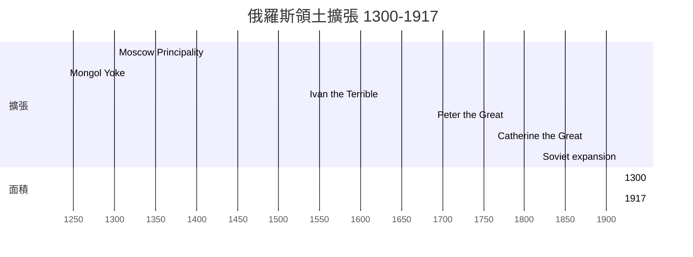
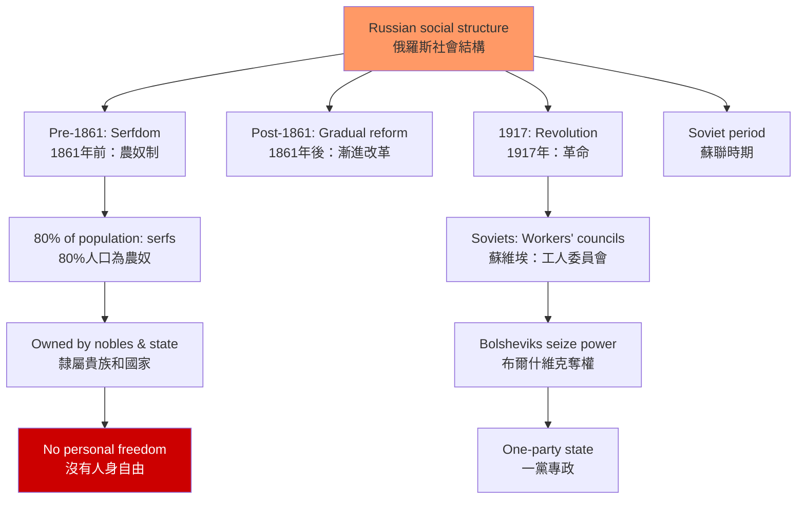
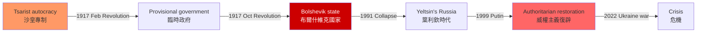
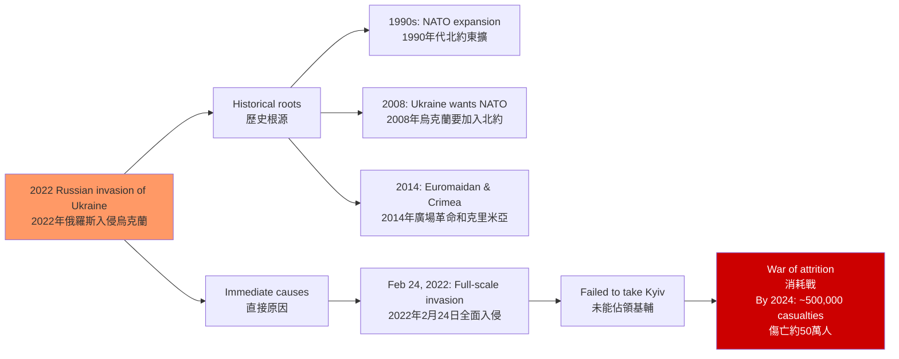

# HIST2103 俄羅斯國家與社會 / Russian State and Society

**Instructor**: HKU History Staff
**Department**: History, HKU
**Official source**: [HKU History Course Description](https://history.hku.hk/ug_cd/)
**Style**: 袁騰飛式 — 犀利、聚焦俄羅斯的專制傳統——從沙皇到普京，俄羅斯為什麼總是走向威權？

---

## 問題 1：5 個核心心智模型

### 1. 專制國家傳統——俄羅斯特有的政治文化？
學者 **Richard Pipes** 在 *Russia Under the Old Regime* (1974) 中論證：俄羅斯的專制傳統起源於蒙古統治時期（1240-1480）。蒙古人帶來了「不受限制的國家權力」概念，這種政治文化在蒙古統治結束後仍然延續，成為俄羅斯政治的核心特徵。

### 2. 農奴制與俄羅斯社會結構
1861 年廢除農奴制之前，俄羅斯約 80% 的人口是農奴。學者 **Jeffrey Burds** 研究：這種落後的社會結構，決定了俄羅斯經濟的長期落後和農民的長期悲慘命運。

### 3. 革命與專制的循環——俄羅斯的歷史鐘擺
1917 年二月革命推翻了沙皇，但布爾什維克在十月革命中奪取了政權，建立了蘇聯。1991 年蘇聯解體後，俄羅斯聯邦誕生，但普京時代重新走向威權。學者 **Martin Malia** 在 *The Soviet Tragedy* (1994) 中分析了這種「革命-專制」循環的結構原因。

### 4. 帝國擴張——不斷膨脹的俄羅斯
俄羅斯帝國從 1480 年的莫斯科公國，擴張為世界上領土最大的國家。學者 **Austin Lee** 和 **David Lieven** 研究：這種無止境的領土擴張，背後是對「安全」的永恆焦慮。

### 5. 2022 年俄烏戰爭——冷戰遺產的總清算
2022 年 2 月 24 日俄羅斯全面入侵烏克蘭，是冷戰結束以來歐洲最大規模的軍事衝突。學者 **Stephen Walt** 和 **John Mearsheimer** 從不同角度分析了這場戰爭的地緣政治根源。

---

## 問題 2：3 個根本分歧

### 分歧 1：蒙古統治——俄羅斯專制的根源 vs 過度簡化的神話？
Pipes 的「蒙古起源論」是關於俄羅斯專制傳統的經典解釋，但也有學者認為這種解釋過度簡化，忽視了俄羅斯本身的政治文化傳統（東正教、拜占庭帝國遺產）。

### 分歧 2：蘇聯——歷史的錯誤 vs 歷史的成就？
蘇聯解體後，俄羅斯知識界圍繞蘇聯的歷史評價展開了激烈爭論：蘇聯是歷史的錯誤（带来了斯大林的恐怖統治）還是歷史的成就（實現了工業化、擊敗了納粹德國）？

### 分歧 3：普京——俄羅斯復興的領袖 vs 新沙皇？
普京執政 24 年（1999-2024），俄羅斯從葉利欽時代的虛弱恢復為咄咄逼人的強國——但這種「復興」的代價是什麼？自由主義的死亡？

---

## 問題 3：10 個深度問題

1. **蒙古統治對俄羅斯的長期影響**：1240-1480 年的金帳汗國統治，在政治制度、税收系統和文化習俗上對俄羅斯留下了什麼具體遺產？
2. **1861 年農奴制改革**：亞歷山大二世為什麼要廢除農奴制？廢除後的俄羅斯農業和經濟是否得到了改善？這種改革的局限性是什麼？
3. **1905 年革命**：日俄戰爭失敗（1905）如何触发了俄羅斯帝國的第一次資產階級革命？這次革命的失敗與 1917 年革命的爆發有什麼聯繫？
4. **1917 年二月革命與十月革命**：這兩場革命之間的 8 個月裏，布爾什維克如何從一個少數政黨成長為執政黨？臨時政府的弱點是什麼？
5. **史太林主義的邏輯**：為什麼列寧選擇了史太林作為接班人？史太林的恐怖統治（1924-1953）是個人病態還是制度缺陷的產物？史太林的「一國社會主義」與托洛茨基的「不斷革命論」有什麼根本差異？
6. **赫魯曉夫的「去史太林化」**：1956 年史太林屍體被移出列寧墓——赫魯曉夫的「秘密報告」揭示了什麼？這種「去史太林化」運動對蘇聯制度的穩定性有什麼影響？
7. **蘇聯經濟模式的失敗**：蘇聯的計劃經濟為什麼在 1970 年代後開始停滯？這種停滯與美國的軍備競賽有什麼關係？
8. **1991 年蘇聯解體**：為什麼 1991 年聖誕節蘇聯正式解體？葉利欽的激進市場改革（「震療法」）為什麼最終失敗了？這種失敗如何為普京的威權主義掃清了道路？
9. **普京的「可控民主」**：普京如何系統性地摧毁了葉利欽時代的媒體自由和政治多元化？這種威權主義與葉利欽時代的「自由主義」有什麼連續性和斷裂？
10. **2022 年俄烏戰爭**：這場戰爭是「帝國主義侵略」（烏克蘭和西方的觀點）還是「特別軍事行動」（俄羅斯的官方說法）？這場戰爭的歷史根源可以追溯到哪裡？

---

# 核心心智模型深化（中英對照）

## 1. 專制國家傳統

### 1.1 圖解：俄羅斯領土擴張的時間線


---

## 2. 農奴制與社會結構

### 2.1 圖解：俄羅斯社會結構的歷史


---

## 3. 革命與專制的循環

### 3.1 圖解：俄羅斯的專制-革命鐘擺


---

## 4. 帝國擴張

### 4.1 圖解：俄羅斯帝國 vs 西歐的發展路徑
```mermaid
graph TD
    A[Two paths: Russia vs Western Europe<br/>兩條路徑：俄羅斯vs西歐] --> B[Western Europe<br/>西歐]
    A --> C[Russia<br/>俄羅斯]
    
    B --> B1[Urbanization first<br/>先城市化]
    B1 --> B2[Industrial revolution<br/>工業革命]
    B2 --> B3[Political modernization<br/>政治現代化<br/>Parliament, rule of law<br/>議會、法治]
    
    C --> C1[State expansion first<br/>先國家擴張]
    C1 --> C2[Territorial security<br/>領土安全]
    C2 --> C3[Autocracy maintained<br/>專制維護<br/>"Need strong state first"<br/>「需要先有強國」]
    
    style B fill:#9f6
    style C fill:#f90
```

---

## 5. 2022 年俄烏戰爭

### 5.1 圖解：俄烏戰爭的歷史根源


---

# 總結

1. **俄羅斯的專制傳統不是單一因素造成的**：蒙古統治、東正教、拜占庭帝國遺產、寬廣的領土——這些因素共同塑造了俄羅斯的政治文化。

2. **1917 年革命的真正教訓**：革命不是因為「沙皇太腐敗」——而是因為俄羅斯在一次大戰中的軍事失敗暴露了整個制度的失敗——戰爭與革命的關係是理解俄羅斯歷史的關鍵。

3. **蘇聯的計劃經濟失敗是結構性的**：不是因為「共產主義不好」——而是因為計劃經濟無法有效處理複雜的現代經濟信息（哈耶克的批評在蘇聯計劃經濟失敗中得到了最極端的驗證）。

4. **普京主義是俄羅斯專制傳統的最新表現**：它不是對蘇聯的「恢復」，而是利用了葉利欽時代自由主義失敗後的社會失落感——威權主義的吸引力在於它對「秩序」的承諾。

5. **2022 年俄烏戰爭是冷戰遺產的總清算**：1990 年代西方未能將俄羅斯有效整合入歐洲安全架構，北約東擴的歷史爭議——這一切在 2022 年以戰爭的形式爆發。

**自學建議**: 配合 Richard Pipes 的 *Russia Under the Old Regime* + Martin Malia 的 *The Soviet Tragedy* + Stephen Walt 的 *The Hell of Great Powers*，輸出讀書筆記到 `06_Reading_Notes/`。
