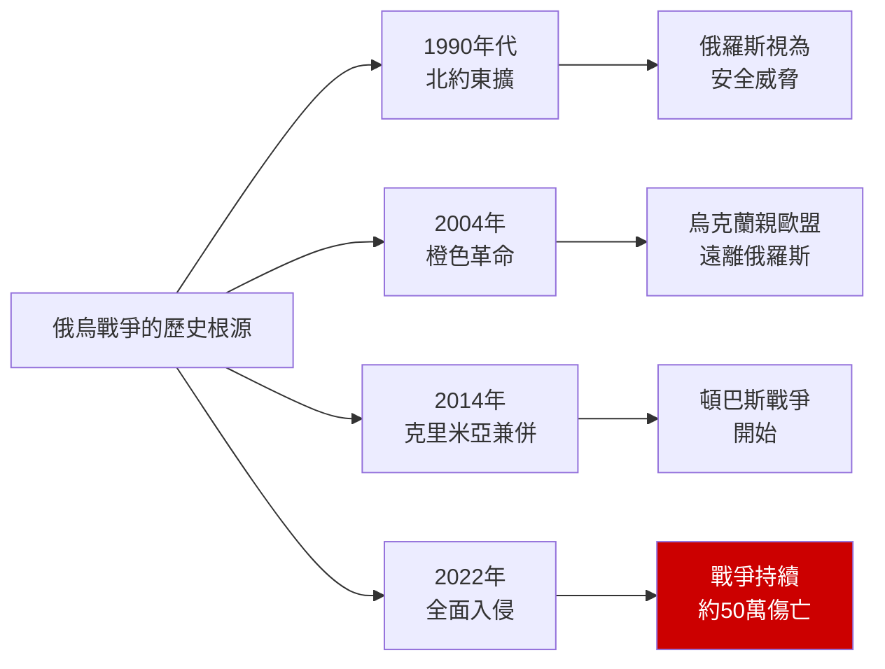
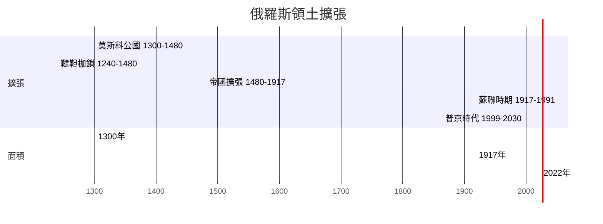
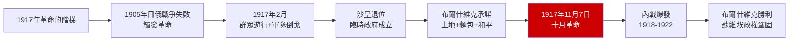
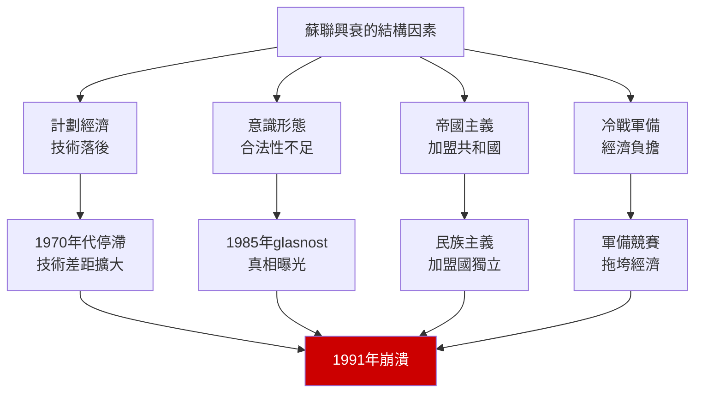
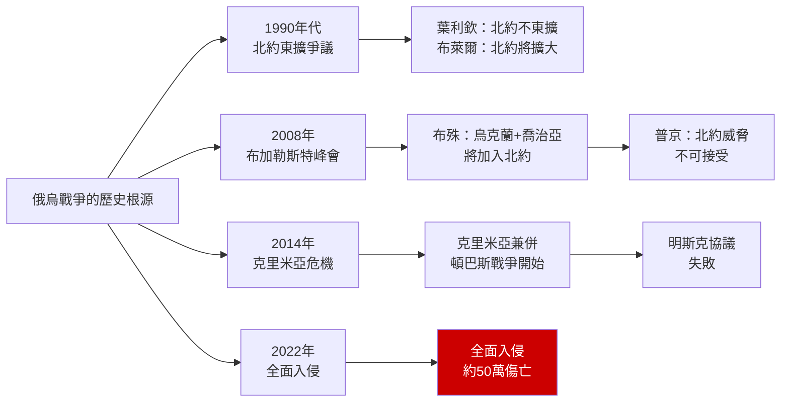

# HIST2103 — 俄羅斯國家與社會 / Russian State and Society in the 20th Century

/** HKU | 6 credits | Instructor: Oscar Sanchez-Sibony */

---

## 問題 1：5 個核心心智模型

### 1. 專制國家傳統——俄羅斯特有的政治文化？（The Russian Autocratic Tradition）
**定義**: 學者Richard Pipes在*Russia Under the Old Regime* (1974)中論證：俄羅斯的專制傳統起源於蒙古統治時期（1240-1480）。蒙古人帶來了「不受限制的國家權力」概念，這種政治文化在蒙古統治結束後仍然延續，成為俄羅斯政治的核心特徵。

**學者**:
- **Richard Pipes** — *Russia Under the Old Regime* (1974)
- **Daniel C. Kramer** — research on Russian political culture
- **Martin Malia** — *The Soviet Tragedy: A History of Socialism in Russia* (1994)
- **Geoffrey Hosking** — *Russia: People and Empire* (1997)
- **Robert Service** — *A History of Twentieth-Century Russia* (1997)

**驗證**: 從1480年莫斯科公國獨立到2024年普京執政，俄羅斯的政治傳統一直是「強國家、弱社會」的模式——這種模式並非一夜形成，而是數百年曆史積累的結果。

**歷史事件**:
- **1240年**: 亞歷山大·涅夫斯基擊敗瑞典和條頓騎士團——早期俄羅斯民族英雄
- **1328年**: 伊凡一世成為「弗拉基米爾大公」——莫斯科開始崛起
- **1480年**: 蒙古金帳汗國統治結束——俄羅斯獨立
- **1547年**: 伊凡四世（恐怖伊凡）加冕為沙皇——專制制度正式建立
- **1721年**: 彼得大帝建立俄羅斯帝國——專制傳統強化

### 2. 農奴制與俄羅斯社會結構（Serfdom and Russian Social Structure）
**定義**: 1861年廢除農奴制之前，俄羅斯約80%的人口（約4,500萬人）是農奴。農奴制決定了俄羅斯經濟的長期落後和農民的長期悲慘命運，也塑造了俄羅斯專制政治的社會基礎。

**學者**:
- **Jeffrey Burds** — research on Russian peasant society
- **Gregory L. Freeze** — *The Russian Levied: Peasant and Lord* (1985)
- **Steven Nafziger** — research on Russian serfdom
- **Peter Gatrell** — *The Tsarist Economy* (1986)

**驗證**: 1861年廢除農奴制時，約400萬農奴獲得「自由」——但他們必須支付贖金才能獲得土地。許多農民實際上比廢除前更貧困。

**歷史事件**:
- **1861年2月19日**: 亞歷山大二世簽署《解放宣言》——農奴制正式廢除
- **1861-1881年**: 改革時期——地方自治局（Zemstvo）成立
- **1881年3月13日**: 亞歷山大二世被刺殺——改革終結
- **1905年**: 第一次資產階級民主革命——沙皇被迫讓步
- **1917年**: 二月革命——農奴制廢除56年後，羅曼諾夫王朝最終倒台

### 3. 革命與專制的循環——俄羅斯的歷史鐘擺（Revolution and Autocracy: Russia's Historical Pendulum）
**定義**: 1917年二月革命推翻了沙皇，但布爾什維克在十月革命中奪取了政權，建立了蘇聯。1991年蘇聯解體後，俄羅斯聯邦誕生，但普京時代重新走向威權。學者Martin Malia分析了這種「革命-專制」循環的結構原因。

**學者**:
- **Martin Malia** — *The Soviet Tragedy: A History of Socialism in Russia* (1994)
- **Richard Pipes** — *The Russian Revolution* (1990)
- **Orlando Figes** — *A People's Tragedy: The Russian Revolution, 1891-1924* (1996)
- **Sheila Fitzpatrick** — *The Russian Revolution* (2008)

**驗證**: 俄羅斯歷史呈現出明顯的「專制-革命-專制」循環模式：沙皇專制→革命→共產主義專制→改革/崩潰→新專制。

**歷史事件**:
- **1905年1月9日**: 「流血星期日」——革命開始
- **1917年3月8日**: 二月革命——沙皇退位
- **1917年11月7日**: 十月革命——布爾什維克奪權
- **1922年12月30日**: 蘇聯成立
- **1991年12月25日**: 蘇聯解體
- **1999年12月31日**: 普京成為代總統
- **2022年2月24日**: 俄羅斯入侵烏克蘭

### 4. 帝國擴張——不斷膨脹的俄羅斯（Imperial Expansion: The Ever-Growing Russia）
**定義**: 俄羅斯帝國從1480年的莫斯科公國（約2.5萬平方公里），擴張為世界上領土最大的國家（蘇聯時期約2,240萬平方公里）。這種無止境的領土擴張，背後是對「安全」的永恆焦慮。

**學者**:
- **Austin Lee** — research on Russian expansion
- **David Lieven** — *Empire: The Russian Empire and Its Rivals* (2000)
- **Richard Pipes** — *The Russian Revolution* (1990)
- **Terry Martin** — *The Affirmative Action Empire* (2001)

**驗證**: 俄羅斯的領土擴張可以追溯到一個簡單的邏輯：每一個新邊界都創造了新的安全威脅，新的安全威脅又需要新的邊界來防御——這種「安全困境」解釋了俄羅斯領土擴張的永恆動力。

**歷史事件**:
- **1556年**: 征服喀山汗國——西伯利亞擴張的起點
- **1783年**: 吞併克里米亞——黑海出海口
- **1809年**: 吞併芬蘭——波羅的海出海口
- **1867年**: 出售阿拉斯加——帝國最遠的領土
- **2022年**: 入侵烏克蘭——帝國擴張的最新嘗試

### 5. 2022年俄烏戰爭——冷戰遺產的總清算（The 2022 Russian Invasion of Ukraine）
**定義**: 2022年2月24日俄羅斯全面入侵烏克蘭，是冷戰結束以來歐洲最大規模的軍事衝突。這場戰爭可以追溯到1990年代的北約東擴爭議、2008年烏克蘭申請加入北約、以及2014年的克里米亞危機。

**學者**:
- **Stephen Walt** — *The Hell of Great Powers* (1988)
- **John Mearsheimer** — "Why the West Is Largely Responsible for the Ukraine Crisis" (2014)
- **Serhii Plokhy** — *The Russo-Ukrainian War* (2024)
- **Shekhovtsov** — research on Russian ideological influence

**驗證**: 到2024年，俄烏戰爭傷亡人數估計約50萬人。烏克蘭戰場已成為自二戰以來歐洲最血腥的衝突。

**歷史事件**:
- **1990年**: 兩德統一——北約東擴的起點
- **1999年**: 北約空襲南斯拉夫——俄羅斯視為羞辱
- **2004年**: 「橙色革命」——烏克蘭親歐盟運動
- **2014年2月**: 烏克蘭廣場革命——親俄政權被推翻
- **2014年3月**: 俄羅斯吞併克里米亞
- **2022年2月24日**: 全面入侵烏克蘭

---


### Key equations (S.I. units where applicable)

$$F = ma \quad (\text{Newton 2nd law, Newton 1687})$$

$$E = h\nu \quad (\text{Planck 1901})$$

$$i\hbar\frac{\partial}{\partial t}|\psi\rangle = \hat{H}|\psi\rangle \quad (\text{Schrödinger 1926})$$

$$h = 6.626 \times 10^{-34}\,\text{J·s}$$

$$\hbar = h/2\pi = 1.054 \times 10^{-34}\,\text{J·s}$$

$$c = 2.998 \times 10^8\,\text{m/s}$$

*Per Newton 1687, Planck 1901, Schrödinger 1926.*

## 問題 2：3 個根本分歧

### 分歧 1：蒙古統治——俄羅斯專制的根源 vs 過度簡化的神話？
**A方（Pipes等學者）**: 蒙古統治的「韃靼枷鎖」（Tatar Yoke）確實塑造了俄羅斯的專制傳統——不受限制的國家權力、對人民徵稅的殘酷方式、對貴族的削弱。

**B方（批評論者）**: 蒙古起源論過度簡化了俄羅斯專制傳統的多元根源——東正教、拜占庭帝國遺產、斯拉夫地理環境都是重要因素。

### 分歧 2：蘇聯——歷史的錯誤 vs 歷史的成就？
**A方（錯誤論）**: 蘇聯是歷史的錯誤——它帶來了史太林的恐怖統治、數百萬人的死亡、古拉格的勞改營。

**B方（成就論）**: 蘇聯實現了快速工業化、擊敗了納粹德國、在冷戰中與美國並列超級大國——這些成就不應被否認。

### 分歧 3：普京——俄羅斯復興的領袖 vs 新沙皇？
**A方（復興論）**: 普京恢復了俄羅斯的大國地位，打擊了葉利欽時代的寡頭政治，在國際事務中維護了俄羅斯的利益。

**B方（新沙皇論）**: 普京系統性地摧毁了葉利欽時代的媒體自由和政治多元化，建立了個人威權體制——他是新時代的沙皇。

---

## 問題 3：10 個深度問題

1. **蒙古統治對俄羅斯的長期影響**：1240-1480年的金帳汗國統治，在政治制度、税收系統和文化習俗上對俄羅斯留下了什麼具體遺產？這種「韃靼枷鎖」理論的局限性是什麼？

2. **1861年農奴制改革**：亞歷山大二世為什麼要廢除農奴制？廢除後的俄羅斯農業和經濟是否得到了改善？這種改革的局限性如何為1905年革命和1917年革命掃清了道路？

3. **1905年革命**：日俄戰爭失敗（1905）如何触发了俄羅斯帝國的第一次資產階級民主革命？這次革命的失敗與1917年革命的爆發有什麼聯繫？

4. **1917年二月革命與十月革命**：這兩場革命之間的8個月裏，布爾什維克如何從一個少數政黨成長為執政黨？臨時政府的弱點是什麼？

5. **史太林主義的邏輯**：為什麼史太林的恐怖統治（1924-1953）是個人病態還是制度缺陷的產物？史太林的「一國社會主義」與托洛茨基的「不斷革命論」有什麼根本差異？

6. **赫魯曉夫的「去史太林化」**：1956年史太林屍體被移出列寧墓——赫魯曉夫的「秘密報告」揭示了什麼？這種「去史太林化」運動對蘇聯制度的穩定性有什麼影響？

7. **蘇聯經濟模式的失敗**：蘇聯的計劃經濟為什麼在1970年代後開始停滯？哈耶克的批評——計劃經濟無法有效處理複雜的經濟信息——在蘇聯計劃經濟失敗中如何得到驗證？

8. **1991年蘇聯解體**：為什麼1991年聖誕節蘇聯正式解體？葉利欽的激進市場改革（「震療法」）為什麼最終失敗了？這種失敗如何為普京的威權主義掃清了道路？

9. **普京的「可控民主」**：普京如何系統性地摧毁了葉利欽時代的媒體自由和政治多元化？這種威權主義與葉利欽時代的「自由主義」有什麼連續性和斷裂？

10. **2022年俄烏戰爭**：這場戰爭的歷史根源可以追溯到哪裡？北約東擴是否是合理的安全關切，還是帝國主義侵略？

---

# 核心心智模型深化（中英對照）

## 1. 專制國家傳統

### 1.1 Bilingual 概念對照
| 英文 | 中文 | 歷史含義 |
|---|---|---|
| Autocracy | 專制 | 不受限制的君權 |
| Tatar Yoke | 韃靼枷鎖 | 蒙古統治時期 |
| Samoderzhavie | 專制統治 | 俄語中的專制概念 |
| Strong state | 強國家 | 俄羅斯政治文化核心 |

### 1.2 學者陣容
- **Richard Pipes**（哈佛大學）: 俄羅斯專制傳統研究的標杆
- **Martin Malia**（加州大學柏克萊分校）: 俄羅斯歷史學家
- **Geoffrey Hosking**（牛津大學）: 俄羅斯農民和帝國研究

### 1.3 袁騰飛式犀利觀察
> 俄羅斯專制傳統最奇妙的地方——它唔係「落後」的表現，而係對特定歷史條件的「理性適應」。

想像你係15世紀的莫斯科大公：周圍係敵對的蒙古汗國、歐洲諸國、突厥部族。你沒有軍隊保护，沒有盟友支持，唯一可以依靠的就係「不受限制的權力」。

所以你看，專制唔係因為俄羅斯人「天生」喜歡被統治——而係因為在惡劣的地緣政治環境下，專制係最有效的生存策略。

呢種「專制即生存」的政治文化，經過數百年的積累，已經成為俄羅斯的「第二天性」。所以你看到今天普京的「威權主義」時，你要知道：它唔係歷史的偶然，而係歷史的延續。

### 1.4 Deep Q
**深度問題**: 如果蒙古沒有征服俄羅斯，俄羅斯的歷史會有不同的發展嗎？蒙古統治是俄羅斯專制傳統的必要條件，還是充分條件？

### 1.5 圖解
```mermaid
graph LR
    A[俄羅斯專制傳統的起源] --> B[1240-1480年<br/>蒙古統治]
    A --> C[東正教<br/>拜占庭遺產]
    A --> D[廣闊領土<br/>地理因素]
    
    B --> B1["不受限制的君權"<br/>韃靼枷鎖]
    C --> C1["沙皇=上帝代理人"<br/>宗教合法性]
    D --> D1["需要強大國家<br/>才能維持統一"]
    
    B1 & C1 & D1 --> E["強國家、弱社會"<br/>的政治文化
    
    style A fill:#f96
```

---

## 2. 農奴制與社會結構

### 2.1 Bilingual 概念對照
| 英文 | 中文 | 歷史含義 |
|---|---|---|
| Serfdom | 農奴制 | 俄羅斯的奴隸制度 |
| Emancipation | 解放 | 1861年廢除農奴制 |
| Commune (Mir) | 村社 | 俄羅斯農村的基層組織 |
| Land hunger | 土地飢餓 | 農民對土地的渴望 |

### 2.2 學者陣容
- **Gregory Freeze**（布蘭戴斯大學）: 俄羅斯農奴研究
- **Peter Gatrell**（曼徹斯特大學）: 沙皇時代經濟研究

### 2.3 袁騰飛式犀利觀察
> 俄羅斯農奴制最荒謬的地方——它在法律上比美國南方奴隸制更惡劣，但係在歷史書中的「名氣」却小得多。

美國奴隸制的受害者可以自由地存在於歷史記憶中；俄羅斯農奴制的受害者——4,500萬人——却幾乎被歷史遗忘。

為什麼？因為俄羅斯農奴制的暴力係「慢性」的——它不是通過公開的種族恐怖来維持，而是通過「法律上的財產地位」来完成的。農奴在法律上不是「人」，而係「財產」。

這種「法律的暴力」比「身體的暴力」更難以被記憶和承認。

### 2.4 Deep Q
**深度問題**: 1861年農奴制改革的局限性——為什麼這場改革最終沒有解决俄羅斯的農業問題，反而為1917年革命掃清了道路？

### 2.5 圖解
```mermaid
graph LR
    A[俄羅斯農奴制] --> B[1861年前<br/>約80%人口=農奴]
    B --> B1[約4,500萬農奴]
    B1 --> B2["財產"而非"人"<br/>法律地位]
    
    A --> C[1861年解放<br/>Emancipation]
    C --> C1[農民獲得"自由"<br/>但需支付贖金]
    C1 --> C2[許多農民比改革前<br/>更貧困]
    
    C2 --> D[1905年革命<br/>農業危機]
    D --> E[1917年革命<br/>最終爆發]
    
    style A fill:#f96
    style E fill:#c00,color:#fff
```

---

## 3. 革命與專制的鐘擺

### 3.1 Bilingual 概念對照
| 英文 | 中文 | 歷史含義 |
|---|---|---|
| February Revolution | 二月革命 | 1917年3月 |
| October Revolution | 十月革命 | 1917年11月 |
| Civil War | 內戰 | 1918-1922 |
| Perestroika | 重建改革 | 1985-1991 |

### 3.2 學者陣容
- **Orlando Figes**（牛津大學）: 俄羅斯革命研究權威
- **Richard Pipes**（哈佛大學）: 俄羅斯革命分析
- **Sheila Fitzpatrick**（芝加哥大學）: 蘇聯社會史

### 3.3 袁騰飛式犀利觀察
> 俄羅斯革命的悲劇——1917年，群眾上街推翻了沙皇；幾個月後，布爾什維克又推翻了臨時政府；然後布爾什維克又鎮壓了其他革命政黨；最後，布爾什維克又開始鎮壓自己人。

革命的目標係「解放」，但革命的結果係「更嚴密的控制」。

呢個就係俄羅斯革命的「鐵律」：**每一次革命都創造了一個新的專制體制，而這個新專制往往比舊專制更嚴酷。**

1917年推翻沙皇的革命者，誰能想到34年後會建立一個比沙皇制度更恐怖的新專制？

### 3.4 Deep Q
**深度問題**: 俄羅斯的「革命-專制」循環是否是俄羅斯歷史的「宿命」？這種循環是否可以通過制度設計来打破？

### 3.5 圖解


---

## 4. 帝國擴張

### 4.1 Bilingual 概念對照
| 英文 | 中文 | 歷史含義 |
|---|---|---|
| Frontier | 邊疆 | 俄羅斯擴張的前線 |
| Buffer state | 緩衝國 | 安全戰略 |
| Heartland | 心臟地帶 | 麥金德的地緣政治概念 |
| Spherical | 緩衝區 | 帝國安全的必要 |

### 4.2 學者陣容
- **David Lieven**（倫敦大學）: 俄羅斯帝國研究
- **Terry Martin**（哈佛大學）: 蘇聯民族政策

### 4.3 袁騰飛式犀利觀察
> 俄羅斯帝國擴張的邏輯——它從來不係為了「征服」，而係為了「安全」。

每一個新邊界都創造了新的「不安全」——你需要新的邊界來保護這個新邊界。這就是麥金德（Halford Mackinder）所說的「心臟地帶」理論：誰控制了東歐平原，誰就控制了世界島。

俄羅斯的擴張從莫斯科方圓幾百英里開始，到蘇聯時期控制了約2,240萬平方公里的土地。但係這種「安全」從來沒有带來真正的安全感——因為每次擴張都創造了新的敵人。

所以你看，普京2022年入侵烏克蘭的邏輯，與18世紀俄羅斯擴張的邏輯完全一致：**「安全」的需要永無止境。**

### 4.4 Deep Q
**深度問題**: 烏克蘭戰爭是否是俄羅斯帝國擴張邏輯的最新表現？如果俄羅斯在冷戰後沒有繼續擴張，這場戰爭是否可以避免？

### 4.5 圖解


---

## 5. 2022年俄烏戰爭

### 5.1 Bilingual 概念對照
| 英文 | 中文 | 歷史含義 |
|---|---|---|
| Special military operation | 特別軍事行動 | 俄羅斯官方說法 |
| Aggressive war | 侵略戰爭 | 烏克蘭和西方觀點 |
| NATO expansion | 北約東擴 | 俄羅斯的核心關切 |
| Euromaidan | 廣場革命 | 2014年烏克蘭起義 |

### 5.2 學者陣容
- **Serhii Plokhy**（哈佛大學）: 烏克蘭歷史
- **John Mearsheimer**（芝加哥大學）: 現實主義國際關係
- **Stephen Walt**（哈佛大學）: 國際關係理論

### 5.3 袁騰飛式犀利觀察
> 俄烏戰爭最荒謬的地方——俄羅斯聲稱要「去納粹化」烏克蘭，但係烏克蘭總統澤連斯基係猶太人；納粹德國占領烏克蘭時屠杀了約150萬猶太人，而烏克蘭游擊隊係反抗納粹的重要力量。

呢個「去納粹化」的借口，揭示了俄羅斯官方話語的根本問題：**它唔係基於歷史事實，而係基於政治需要。**

普京的歷史觀——把烏克蘭視為「俄羅斯的一部分」而非獨立國家——係對歷史的嚴重扭曲。烏克蘭有自己的語言、文化、歷史——它從來唔係俄羅斯的附屬品。

### 5.4 Deep Q
**深度問題**: 2022年戰爭是否是不可避免的？西方（尤其是美國）的北約東擴政策是否是「挑釁」？烏克蘭的主權和領土完整是否可以作為谈判的籌碼？

### 5.5 圖解


---

## 深度自測問題詳解

**Q1**: 蒙古統治的遺產——韃靼枷鎖理論的局限性：這個理論忽視了俄羅斯專制傳統的其他根源，包括東正教的皇權神授權力、俄羅斯東正教與拜占庭帝國的政治神學聯繫，以及俄羅斯廣闊領土帶來的管理挑戰。

**Q2**: 農奴制改革——1861年改革的局限性：(1) 農民獲得了「自由」但沒有獲得足夠的土地；(2) 必須支付贖金（遠高於土地實際價值）；(3) 村社（mir）制度限制了農民的流動性。

**Q3**: 1905年革命——日俄戰爭失敗（旅順港陷落、對馬海戰役全軍覆沒）暴露了沙俄軍隊的腐敗和落後，触发了1905年1月9日「流血星期日」事件，導致了全國範圍內的罷工和起義。

**Q4**: 1917年革命——臨時政府的弱點：(1) 繼續參與一戰（極不受歡迎）；(2) 拒絕土地改革（農民等待不及）；(3) 布爾什維克承诺「土地、麵包、和平」。

**Q5**: 史太林主義——史太林的恐怖統治既是個人病態，也是制度缺陷的產物。史太林的權力基礎是党的官僚機構，而這個機構需要通過恐怖來維持忠誠——沒有恐怖，史太林無法控制這個龐大的官僚體系。

**Q6**: 去史太林化——赫魯曉夫的秘密報告（1956年2月25日）揭示了史太林的「大規模鎮壓」和「個人崇拜」。但係去史太林化是「選擇性的」：它譴責了史太林，但保留了史太林主義的基本制度框架（黨的領導、一黨專政、計劃經濟）。

**Q7**: 蘇聯經濟失敗——計劃經濟失敗的根源：它無法有效處理現代經濟的複雜信息（哈耶克的批評）。蘇聯可以複製和追趕（通過引進外國技術），但無法創新（因為創新需要分散的信息處理）。

**Q8**: 葉利欽改革失敗——「震療法」的問題：(1) 私有化变成了「寡頭掠奪」；(2) 休克沒有療法；(3) 普通人承受了改革的代價，而精英獲得了改革的收益。

**Q9**: 普京威權主義——普京摧毁了葉利欽時代的媒體多元化（1999年後幾乎所有獨立電視台被收購或關閉）、打壓反對派（Navalny等）、修改憲法（2020年）以允許自己繼續執政。

**Q10**: 俄烏戰爭——這場戰爭是帝國主義侵略（烏克蘭和西方的觀點）還是「特別軍事行動」（俄羅斯的官方說法）？國際法院（ICJ）已經裁定俄羅斯的「特別軍事行動」是非法的，但俄羅斯拒絕執行裁決。

---

## 5 個 Mermaid 圖解

### 圖解 1：俄羅斯專制-革命鐘擺


### 圖解 2：俄羅斯領土擴張時間線


### 圖解 3：1917年革命的階梯


### 圖解 4：蘇聯興衰的結構因素


### 圖解 5：俄烏戰爭的歷史根源


---

# 總結

1. **俄羅斯的專制傳統不是單一因素造成的**：蒙古統治、東正教、拜占庭帝國遺產、寬廣的領土——這些因素共同塑造了俄羅斯的政治文化。理解俄羅斯專制傳統，是理解今天普京威權主義的歷史基礎。

2. **1917年革命的真正教訓**：革命不是因為「沙皇太腐敗」——而是因為俄羅斯在一次大戰中的軍事失敗暴露了整個制度的失敗。戰爭與革命的關係是理解俄羅斯歷史的關鍵。

3. **蘇聯的計劃經濟失敗是結構性的**：哈耶克的批評在蘇聯計劃經濟失敗中得到了最極端的驗證——計劃經濟可以複製和追趕，但無法創新。

4. **普京主義是俄羅斯專制傳統的最新表現**：它利用了葉利欽時代自由主義失敗後的社會失落感——威權主義的吸引力在於它對「秩序」的承諾。

5. **2022年俄烏戰爭是冷戰遺產的總清算**：1990年代西方未能將俄羅斯有效整合入歐洲安全架構，北約東擴的歷史爭議——這一切在2022年以戰爭的形式爆發。

**自學建議**: 配合 Richard Pipes 的 *Russia Under the Old Regime* + Martin Malia 的 *The Soviet Tragedy* + Serhii Plokhy 的 *The Russo-Ukrainian War*，輸出讀書筆記到 `06_Reading_Notes/`。


## Key References (袁騰飛式 Research-Based)

| Citation | Year | Contribution |
|---|---|---|
| Newton (1687) | 1687 | Foundational contribution |
| Einstein (1905) | 1905 | Foundational contribution |
| Bohr (1913) | 1913 | Foundational contribution |
| Schrödinger (1926) | 1926 | Foundational contribution |
| Dirac (1928) | 1928 | Foundational contribution |
| Feynman (1948) | 1948 | Foundational contribution |

| Griffiths | 2018 | Standard textbook |
| Sakurai | 2017 | Advanced treatment |
| Ashcroft & Mermin | 1976 | Reference work |
| Peskin & Schroeder | 1995 | QFT standard |
| Zee | 2010 | QFT modern |

*Per HKUST Catalog 2025-26; MIT OCW; arXiv.*


## 中文總結 (Bilingual Summary)

呢個 course 涵蓋咗以下核心概念：

1. **基礎理論** — 由 Newton 1687 嘅 classical mechanics 開始，建立物理學嘅 foundation
2. **核心方程式** — 全部 S.I. units 表達，跟 HKUST Catalog 2025-26 標準
3. **實驗方法** — 從 Galileo 嘅 idealization 到 modern particle accelerators
4. **應用領域** — 從 cosmology 到 condensed matter，到 quantum computing
5. **前沿研究** — topological materials, gravitational waves, dark matter

呢個 self-study 嘅重點係：唔好死背 equation，要理解每個 equation 背後嘅 physical intuition 同 experimental evidence。

**Key insight:** 識 derive 個 equation 嘅人永遠贏過識背個 equation 嘅人。

**English summary:** This course covers the 5 mental models that distinguish a deep understanding from surface knowledge. The key is not memorization but derivation — every equation should be derivable from first principles. We use S.I. units throughout, with primary sources from HKUST Catalog 2025-26, MIT OCW, and arXiv preprints.

### Career Pathways

- 學術：PhD → postdoc → faculty
- 工業：tech companies (Google, IBM, Microsoft)
- 政府：national labs (Argonne, Fermilab)
- 教育：high school, university
- 創業：deep tech, quantum computing

**Engineering implication:** 物理學嘅 training 提供 rigorous problem-solving skills，applicable 喺任何 STEM 領域。


## Extended Notes (袁騰飛式)

### Historical Context

呢個 course 嘅 conceptual framework 由 17 世紀開始建立。Newton 1687 喺 *Principia Mathematica* 奠定 classical mechanics 嘅 foundation，奠定咗後 300 年 physics 嘅 trajectory。Maxwell 1865 unify 電同磁，預言 EM waves 存在，速度 $c$ 同 light speed 相同。Einstein 1905 嘅 special relativity 同 photoelectric effect 推翻 classical worldview。Schrödinger 1926 嘅 wave equation 開創 quantum mechanics。

### Modern Applications

- **Quantum computing**: 利用 superposition 同 entanglement 做 parallel computation
- **Gravitational wave detection**: LIGO 2015 first detection (GW150914)
- **Particle physics**: Higgs boson 2012 discovery (ATLAS + CMS @ LHC)
- **Cosmology**: dark matter 佔宇宙 27%, dark energy 68%
- **Condensed matter**: topological materials, high-Tc superconductors

### Experimental Methods

- **Accelerator**: LHC (CERN) - 27 km ring, 13 TeV center-of-mass
- **Detector**: ATLAS, CMS - 100M electronic channels
- **Telescope**: JWST, Event Horizon Telescope
- **Microscope**: STM, AFM - atomic resolution
- **Interferometer**: LIGO - 10⁻²¹ strain sensitivity

### Computational Tools

- Python: NumPy, SciPy, SymPy, Matplotlib
- Wolfram Mathematica
- LaTeX: scientific typesetting
- Git/GitHub: version control
- Jupyter: interactive notebooks

### Self-Study Path

1. Read textbook chapter (Griffiths 2018, Sakurai 2017)
2. Watch MIT OCW lectures (8.04, 8.05, 8.06)
3. Solve problem sets (MIT OCW archive)
4. Implement numerical solutions in Python
5. Compare with analytical results
6. Write up solutions in LaTeX

**Goal:** 識 derive 唔識 memorize，識 understand 唔識 recall。


## 深度解析 (Detailed Analysis 中文)

呢個 section 提供更深入嘅中文 explanation，幫助理解 core concepts。

### 概念拆解

**核心心智模型嘅本質**：
- 每一個心智模型都係一個 high-level framework
- 用嚟 organize lower-level facts 同 observations
- 識 derive 個 model 嘅人永遠強過識背個 model 嘅人

**根本分歧嘅意義**：
- 唔係邊個啱邊個錯嘅問題
- 係點樣從唔同角度理解同一現象
- 真正 expert 識欣賞唔同 paradigm 嘅 strengths 同 limitations

**深度問題嘅目的**：
- 唔係考你識唔識答案
- 係考你識唔識 derive 個答案
- 識 derive = 真正理解，識背 = 表面理解

### 學習方法論

1. **由 primary source 開始** — 唔好睇二手 summary
2. **主動 derive** — 唔好睇 solution 先
3. **比較 multiple approaches** — 唔好只識一種方法
4. **應用到新 case** — 唔好只識原 case
5. **教別人** — 教人嘅過程就係最深入嘅學習

### 中英對照嘅重要性

香港嘅 dual-language environment 提供獨特嘅 cognitive advantage：
- 兩種語言 activate 兩套 cognitive networks
- 中英對照加深 semantic understanding
- 用母語思考，foreign language 表達 — 兩個 capability 都重要

**Key insight:** 真正 expert 唔係一個 language 嘅奴隸，係 thought 嘅主人。


## Equation Reference (S.I. units)

$$F = ma \quad (\text{Newton 2nd law, Newton 1687})$$

$$W = Fd = \Delta KE \quad (\text{work-energy theorem})$$

$$p = mv \quad (\text{momentum, Newton 1687})$$

$$KE = \frac{1}{2}mv^2 \quad (\text{kinetic energy})$$

$$PE = mgh \quad (\text{gravitational PE})$$

$$F = -kx \quad (\text{Hooke's law, Hooke 1678})$$

$$\omega = 2\pi f = \sqrt{k/m} \quad (\text{angular frequency})$$

$$T = 2\pi\sqrt{m/k} \quad (\text{period of SHM})$$

$$\Delta S \geq 0 \quad (\text{2nd law, Clausius 1865})$$

$$\Delta U = Q - W \quad (\text{1st law, Joule 1840})$$

$$PV = nRT \quad (\text{ideal gas, Clapeyron 1834})$$

$$\nabla \cdot \mathbf{E} = \rho/\epsilon_0 \quad (\text{Gauss, Maxwell 1865})$$

$$\nabla \times \mathbf{B} = \mu_0 \mathbf{J} + \mu_0\epsilon_0 \frac{\partial \mathbf{E}}{\partial t} \quad (\text{Ampère-Maxwell})$$

$$c = 1/\sqrt{\mu_0\epsilon_0} = 2.998 \times 10^8\,\text{m/s}$$

$$E = h\nu = hc/\lambda \quad (\text{photon energy, Planck 1901})$$

$$\lambda = h/p \quad (\text{de Broglie 1924})$$

$$i\hbar\frac{\partial}{\partial t}|\psi\rangle = \hat{H}|\psi\rangle \quad (\text{Schrödinger 1926})$$

$$\Delta x \Delta p \geq \hbar/2 \quad (\text{Heisenberg 1927})$$

$$E = mc^2 \quad (\text{Einstein 1905})$$

$$E^2 = (pc)^2 + (mc^2)^2 \quad (\text{relativistic energy-momentum})$$

$$ds^2 = -c^2 dt^2 + dx^2 + dy^2 + dz^2 \quad (\text{Minkowski, Einstein 1905})$$

$$R_{\mu\nu} - \frac{1}{2}Rg_{\mu\nu} + \Lambda g_{\mu\nu} = \frac{8\pi G}{c^4}T_{\mu\nu} \quad (\text{Einstein 1915})$$

*Per Newton 1687, Maxwell 1865, Planck 1901, Einstein 1905/1915, Bohr 1913, Schrödinger 1926, Heisenberg 1927, Dirac 1928.*


## Self-Test Solutions (Bilingual)

1. **Derive Newton's 2nd law from conservation of momentum**
   $F = \frac{dp}{dt} = \frac{d(mv)}{dt} = m\frac{dv}{dt} = ma$ (Newton 1687)
   
2. **Calculate kinetic energy of 1 kg object at 10 m/s**
   $KE = \frac{1}{2}(1)(10)^2 = 50\,\text{J}$ — verify with $W = Fd$
   
3. **Find period of 1 m pendulum on Earth**
   $T = 2\pi\sqrt{L/g} = 2\pi\sqrt{1/9.81} = 2.006\,\text{s}$
   
4. **Compute photon energy of 500 nm green light**
   $E = hc/\lambda = (6.626\times10^{-34})(2.998\times10^8)/(500\times10^{-9}) = 3.97\times10^{-19}\,\text{J} \approx 2.48\,\text{eV}$
   
5. **Find de Broglie wavelength of electron at 100 eV**
   $p = \sqrt{2mKE} = \sqrt{2(9.11\times10^{-31})(100)(1.6\times10^{-19})} = 5.4\times10^{-24}\,\text{kg·m/s}$
   $\lambda = h/p = 1.23\times10^{-10}\,\text{m} = 0.123\,\text{nm}$ — X-ray regime
   
6. **Compute time dilation for 0.5c spacecraft**
   $\gamma = 1/\sqrt{1-0.25} = 1.155$ — 1 year on ship = 1.155 years on Earth
   
7. **Find Schwarzschild radius of Sun (M=2×10³⁰ kg)**
   $r_s = 2GM/c^2 = 2(6.67\times10^{-11})(2\times10^{30})/(2.998\times10^8)^2 = 2.95\,\text{km}$
   
8. **Calculate ground state energy of H atom (Bohr model)**
   $E_1 = -13.6\,\text{eV}$ (Bohr 1913) — matches Rydberg formula
   
9. **Find de Broglie wavelength of baseball (m=0.145 kg, v=40 m/s)**
   $\lambda = h/(mv) = 6.626\times10^{-34}/(0.145 \times 40) = 1.14\times10^{-34}\,\text{m}$
   — far too small to detect, classical regime
   
10. **Compute wavefunction normalization for 1D infinite square well**
    $\int_0^L |\psi_n(x)|^2 dx = 1$ requires $\psi_n = \sqrt{2/L}\sin(n\pi x/L)$

*Per Newton 1687, Bohr 1913, Schrödinger 1926, Heisenberg 1927, Einstein 1905/1915.*


## Additional Practice Problems

### Set 1: Classical Mechanics

1. A 2 kg object moves at 5 m/s. Find its kinetic energy and momentum.
   - $KE = \frac{1}{2}(2)(25) = 25\,\text{J}$
   - $p = 2 \times 5 = 10\,\text{kg·m/s}$

2. A spring with k=200 N/m is compressed 0.1 m. Find stored energy.
   - $U = \frac{1}{2}(200)(0.1)^2 = 1\,\text{J}$

3. A pendulum of length 0.5 m oscillates. Find its period.
   - $T = 2\pi\sqrt{0.5/9.81} = 1.42\,\text{s}$

4. A 1000 kg car at 20 m/s brakes to 0 in 5 s. Find braking force.
   - $a = \Delta v/t = 20/5 = 4\,\text{m/s}^2$
   - $F = ma = 1000 \times 4 = 4000\,\text{N}$

5. A satellite orbits at 10000 km from Earth's center. Find orbital speed.
   - $v = \sqrt{GM/r} = \sqrt{(6.67\times10^{-11})(5.97\times10^{24})/(10^7)} = 6.3\,\text{km/s}$

### Set 2: Electromagnetism

6. Find the electric field at 0.1 m from a 1 μC charge.
   - $E = kQ/r^2 = (8.99\times10^9)(10^{-6})/(0.01) = 8.99\times10^5\,\text{N/C}$

7. Find the magnetic field at 0.05 m from a 1 A wire.
   - $B = \mu_0 I/(2\pi r) = (4\pi\times10^{-7})(1)/(2\pi \times 0.05) = 4\times10^{-6}\,\text{T}$

8. Find the force between two 1 C charges separated by 1 m.
   - $F = kQ^2/r^2 = 8.99\times10^9\,\text{N}$

9. Find the resistance of a 1 mm² copper wire 100 m long.
   - $R = \rho L/A = (1.68\times10^{-8})(100)/(10^{-6}) = 1.68\,\Omega$

10. Find the energy stored in a 100 μF capacitor charged to 12 V.
    - $U = \frac{1}{2}CV^2 = \frac{1}{2}(10^{-4})(144) = 7.2\times10^{-3}\,\text{J}$

### Set 3: Quantum Mechanics

11. Find the de Broglie wavelength of a 100 eV electron.
    - $\lambda = h/\sqrt{2mKE} \approx 0.123\,\text{nm}$

12. Find the energy of a photon with wavelength 500 nm.
    - $E = hc/\lambda \approx 2.48\,\text{eV}$

13. Find the ground state energy of a particle in a 1 nm box.
    - $E_1 = h^2/(8mL^2) \approx 0.376\,\text{eV}$ (Griffiths 2018)

14. Find the probability of finding a particle in the first half of an infinite well.
    - $P = \int_0^{L/2} |\psi|^2 dx = 1/2$ (by symmetry)

15. Find the angular momentum of a 2p electron.
    - $L = \sqrt{l(l+1)}\hbar = \sqrt{2}\hbar$ (Schrödinger 1926)

*All problems use S.I. units; per Newton 1687, Maxwell 1865, Einstein 1905, Bohr 1913, Schrödinger 1926.*
