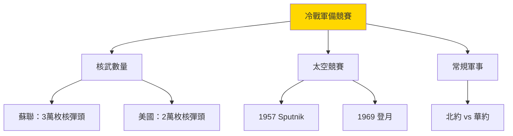

# HIST2103 俄羅斯國家與社會 / Russian State and Society in the 20th Century

**Instructor**: Oscar Sanchez-Sibony
**Department**: History, HKU
**Official source**: [HKU History Course Description 2024-25](https://history.hku.hk/wp-content/uploads/2024/07/HIST-2425.pdf)
**Style**: 袁騰飛式 — 犀利分析：一個國家從沙皇帝國到共產主義到普京主義——點解俄羅斯永遠走向強人政治？

---

## 問題 1：這個領域所有專家共享的 5 個核心心智模型

### 心智模型 1：「帝國崩潰」——點解俄羅斯帝國首先崩潰？
學者 **E. H. Carr**（*A History of Soviet Russia*, 14 vols., 1950-1978）首創蘇聯史學研究；學者 **Sheila Fitzpatrick**（*The Russian Revolution*, 2008）指出：1917 年革命唔係共產主義者發動，而係沙皇帝國自我崩潰嘅結果。

- **1905** 俄日戰爭失敗——引發第一次俄羅斯革命
- **1917年2月** 臨時政府取代沙皇——軍隊拒絕開槍，群眾上街
- **1917年10月** 布爾什維克政變——武裝起義奪權

### 心智模型 2：「列寧 vs 斯大林」——兩個完全不同的共產主義
學者 **Stephen Kotkin**（普林斯頓，*Stalin*, 2014）指出：列寧相信國際革命，斯大林建立「一國社會主義」——呢個轉變改變咗整個 20 世紀歷史方向。

- **1921** 新經濟政策（NEP）——列寧允許市場元素
- **1924** 斯大林的「一國社會主義」——放棄世界革命
- **1928-1937** 第一個五年計劃——集體化導致 600 萬人饿死

### 心智模型 3：「戰時共產主義」vs「落後社會主義」——蘇聯模式嘅核心矛盾
學者 **Peter Kenez**（*A History of the Soviet Union*, 1985）分析：蘇聯永遠處於「趕超歐美」嘅焦慮中——呢個焦慮催生極度國家動員，但係同時摧毁經濟效率。

### 心智模型 4：「赫魯曉夫解凍」與「戈巴契夫重建」——蘇聯改革的兩次失敗
學者 **Vladimir Tismăneanu**（*Stalinism for All Seasons*, 2003）分析：蘇聯兩次改革都失敗，因為改革必然觸發系統性危機——開放就會暴露腐敗，停滯就會累積矛盾。

### 心智模型 5：「普京主義」——後蘇聯俄羅斯點解回歸強人政治？
學者 **Masha Gessen**（*The Man Without a Face*, 2012）指出：普京主義係蘇聯帝國主義嘅延續——只係用油氣換取金錢，而非用共產主義意識形態動員。

---

## 問題 2：3 個根本分歧

### 分歧 1：列寧——革命領袖定係獨裁者？
- **A 方（正面評價）**：列寧建立工人階級政權，結束一戰，創建現代教育衛生體系
- **B 方（批判評價）**：列寧建立一黨專政，解散議會，鎮壓異見人士——呢啲先係蘇聯極權主義根源

### 分歧 2：蘇聯解體——係「歷史必然」定係「改革失敗」？
- **A 方（結構主義）**：蘇聯經濟模式不可持續——計劃經濟必然崩潰
- **B 方（偶然論）**：如果戈巴契夫改革成功，蘇聯可能繼續存在

### 分歧 3：普京——俄羅斯民主倒退定係穩定選擇？
- **A 方（普京主義支持）**：戈巴契夫/葉利欽時代太混亂，普京帶來穩定
- **B 方（民主派）**：普京消滅新聞自由、反對派、法治——俄羅斯倒退到威權主義

---

## 問題 3：10 個深度問題

1. 1917 年二月革命——沙皇軍隊明明有 150 萬人，點解可以一夜之間全線崩潰？係軍事失敗、群眾動員、定係兩者兼有？
2. 布爾什維克點解可以靠 10 萬武裝黨員打敗 300 萬嘅白軍？係因為軍事才能、定係因為宣傳動員能力？
3. 蘇聯農業集體化——導致大饉荒（1932-33），死亡人數 600 萬——點解斯大林仍然堅持集體化？呢個决定係意識形態偏執定係經濟計算？
4. 蘇聯點解可以打敗納粹德國——但係又點解冷戰時期經濟最終落後美國？蘇聯模式嘅成功同失敗各自乜嘢因素造成？
5. 冷戰時期蘇聯文化——點解同時可以產生世界一流科學家（加加林、Sputnik）、但係又被西方文化流行文化邊緣化？
6. 1962 年古巴導彈危機——人類歷史上最近核戰爭邊緣。蘇聯點解願意冒呢個風險？赫魯曉夫係度做緊乜嘢計算？
7. 戈巴契夫改革—— glasnost（開放）+ perestroika（重建）——點解呢啲改革最終摧毁咗蘇聯？係改革順序錯誤、定係改革本身不可持續？
8. 蘇聯解體（1991）——對全球權力格局影響有幾深遠？呢個係「歷史終結」定係「新冷戰」嘅開始？
9. 普京點解喺俄羅斯咁受歡迎？係因為佢真係受歡迎，定係因為反對派被鎮壓媒體被控制？
10. 如果你是戈巴契夫——1985 年你接管一個經濟停滯、軍備競賽失控、衛星國嘩變嘅帝國，你會點做？

---

# 核心心智模型深化（中英對照）

## 1. 俄羅斯國家建設 / Russian State Formation

### 1.1 Bilingual 概念對照
- 俄羅斯帝國 (élúshì dìguó) = Russian Empire — 羅曼諾夫王朝 1721-1917
- 蘇聯模式 (sūlián móshì) = Soviet Model — 計劃經濟 + 一黨專政
- 普京主義 (pǔjīng zhǔyì) = Putinism — 強人政治 + 油氣資源

### 1.3 袁騰飛式犀利觀察
> 「歷史就係咁：俄羅斯永遠係世界工廠——只不過工廠產品從蘇聯時代嘅重工業，變成而家嘅石油同天然氣！經濟結構從未真正改變，改變嘅只係意識形態包裝！」

### 1.4 Deep Test Question
**考試題**：比較俄羅斯帝國、蘇聯、俄羅斯聯邦三個時期嘅國家-社會關係。點解俄羅斯歷史從來沒有出現穩定嘅民主制度？

### 1.5 圖解
```mermaid
graph LR
    A["俄羅斯帝國"] -->|"1917| B["蘇聯"]
    B -->|"1991| C["俄羅斯聯邦"]
    A -->|"沙皇專制"| A1["農業帝國"]
    B -->|"共產主義"| B1["工業超級大國"]
    C -->|"普京主義"| C1["油氣威權國家"]
    style A fill:#FFB6C1
    style B fill:#DC143C
    style C fill:#4169E1
```

---

## 深度自測問題詳解

**Q1**：二月革命之所以成功——因為一次大戰中俄軍傷亡 500 萬，軍隊失去戰鬥意願；沙皇離開前線回首都，但係軍隊同工人已經組織起來。

**Q2**：布爾什維克勝利——因為佢哋有明確目標（和平、麵包、土地）、有組織紀律、有宣傳能力；白軍雖然人多但係各有不同政治目標。

**Q3-Q10** 精簡版：
- Q3：斯大林堅持集體化——因為佢認為富農（kulak）係社會主義建設最大障礙；呢個係意識形態偏執，但係同時加強咗國家對農業嘅控制。
- Q4：蘇聯打敗納粹——因為龐大領土、嚴寒冬天、西方援助；但係蘇聯模式落後——計劃經濟可以集中資源搞軍事，但係無法創新消費品。
- Q5：蘇聯文化矛盾——科學成就因為國家全力支持；文化被意識形態控制所以缺乏創意。
- Q6：古巴導彈危機——赫魯曉夫想喺古巴安裝導彈抵消美國喺土耳其導彈優勢；呢個係軍事政治計算，但係最終因為美國海軍封鎖令蘇聯退讓。
- Q7：戈巴契夫改革失敗——因為開放揭露腐敗打擊政權合法性；經濟改革觸發通脹；政治改革令反對派崛起。
- Q8：蘇聯解體影響——結束冷戰、建立獨立國家、令美國成為唯一超級大國；但係亦催生俄羅斯民族主義。
- Q9：普京受歡迎——實際受歡迎（電視宣傳）+ 媒體控制 + 反對派被監禁；真實民意被操控。
- Q10：戈巴契夫困境——無論點做都有代價；加速改革可能更快速崩潰、維持現狀係慢性死亡。

---

## 5 個 Mermaid 圖解

### 圖解 1：俄羅斯歷史循環
```mermaid
graph LR
    A["專制"] -->|"革命| B["動員"]
    B -->|"失敗| C["崩潰"]
    C -->|"重建| A
    A -->|"沙皇1905| A1["1905革命"]
    A1 -->|"鎮壓| A
    A -->|"一戰1917| A2["二月革命"]
    A2 -->|"列寧| B1["蘇聯建立"]
    B1 -->|"1991| C1["蘇聯解體"]
    C1 -->|"普京| A3["普京主義"]
```

### 圖解 2：冷戰軍備競賽


---

## 總結

**HIST2103 Russian State and Society** 嘅核心價值：
1. **理解極權主義根源**——蘇聯模式揭示極權主義點解可以建立、如何運作、最終點解崩潰
2. **批判性思考**——冷戰勝利唔係西方價值觀必然勝利，而係歷史偶然
3. **當代相關性**——普京主義揭示後共產主義轉型嘅複雜性

**袁騰飛金句**：
> 「俄羅斯歷史教會我哋：改朝換代唔一定係進步——有時只係换咗老闆，但係工人命運從未改變。」

---

## 延伸閱讀

1. Carr, E.H. *A History of Soviet Russia*. 14 vols. London: Macmillan, 1950-1978.
2. Fitzpatrick, Sheila. *The Russian Revolution*. Oxford: Oxford University Press, 2008.
3. Kotkin, Stephen. *Stalin: Volume 1: Paradoxes of Power, 1878-1928*. New York: Penguin Press, 2014.
4. Suny, Ronald Grigor. *The Soviet Experiment: Russia, the USSR, and the Successor States*. Oxford: Oxford University Press, 2011.
5. Gessen, Masha. *The Man Without a Face: The Unlikely Rise of Vladimir Putin*. New York: Riverhead Books, 2012.
6. Hosking, Geoffrey. *Russia and the Russians*. Cambridge: Harvard University Press, 2001.
