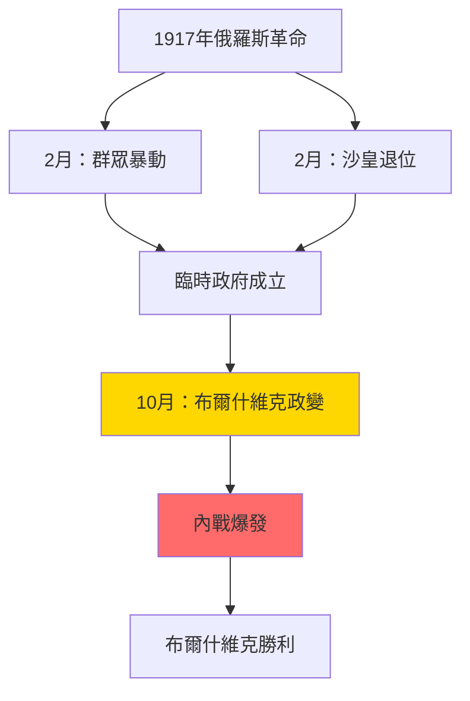
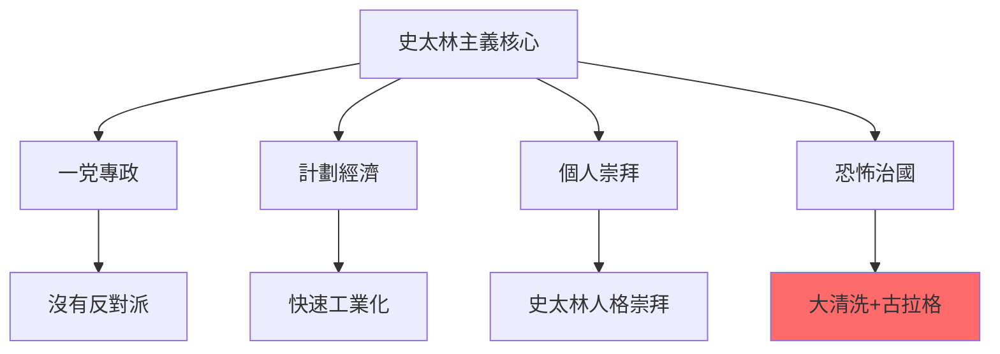
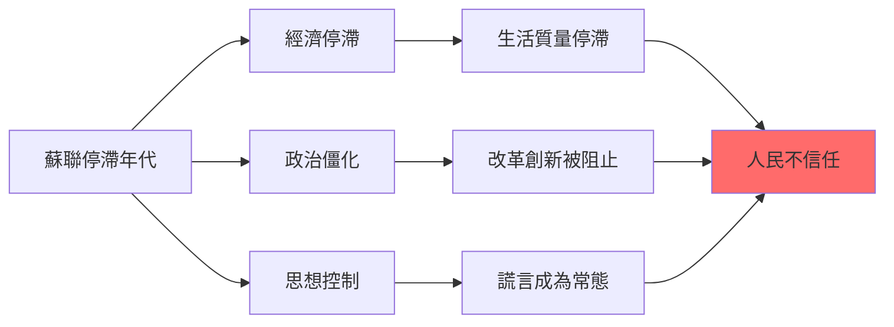
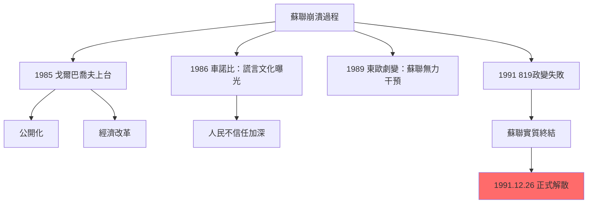
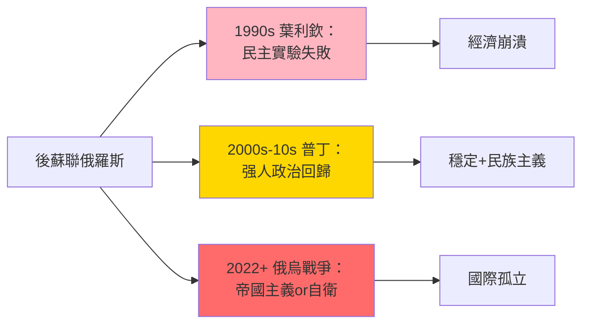
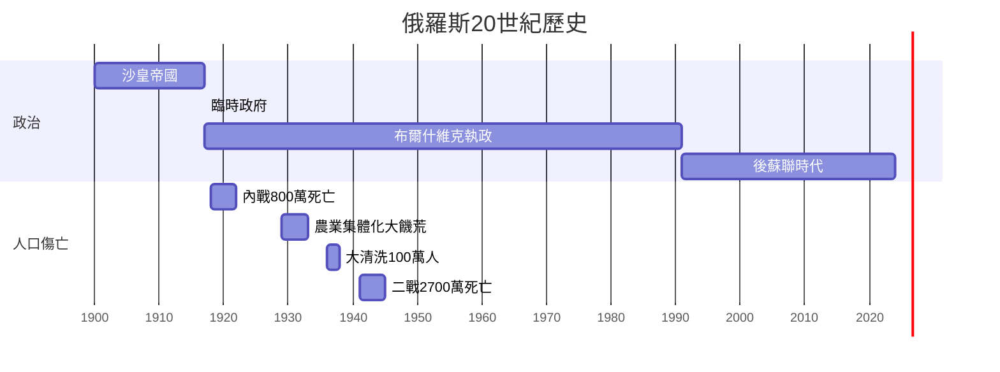
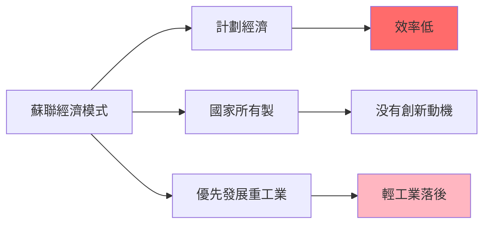
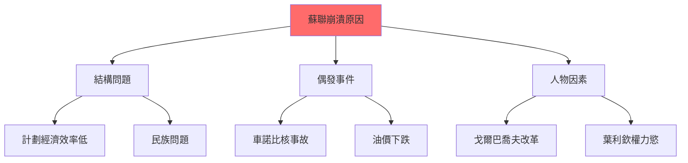
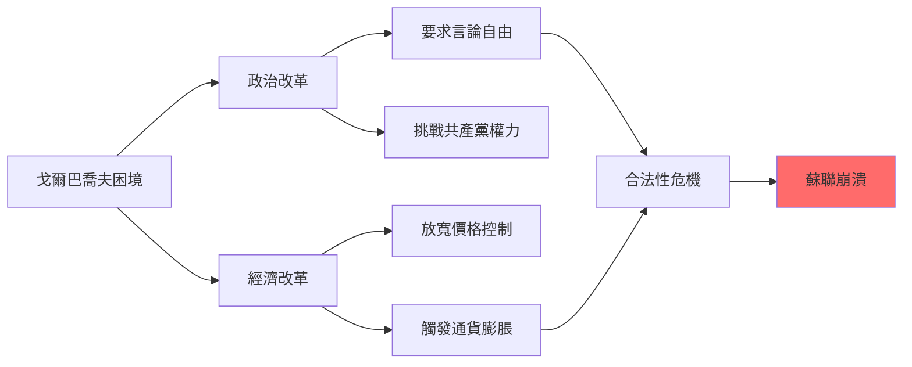
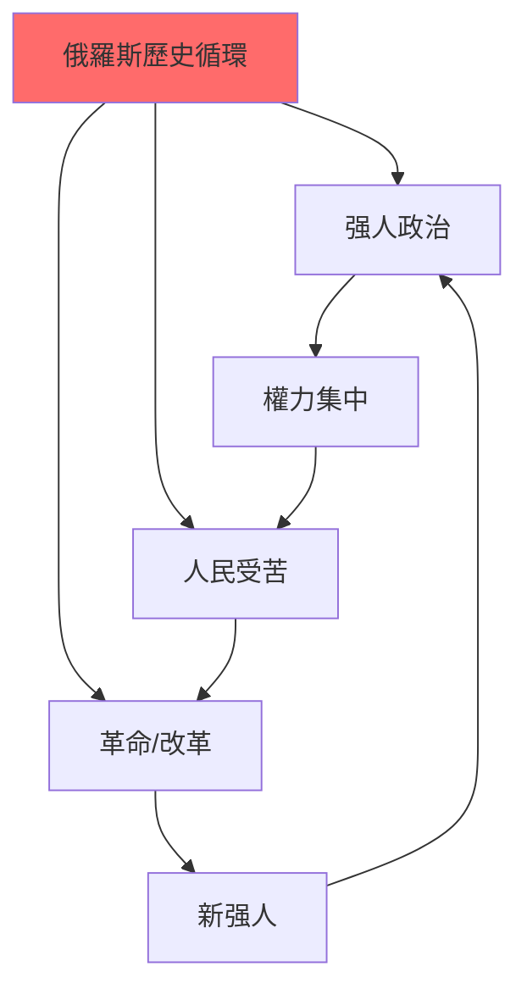

# HIST2103 俄羅斯國家與社會 / Russian State and Society in the 20th Century

**Instructor**: Oscar Sanchez-Sibony (2024-25)
**Department**: History, HKU
**Official source**: [HKU History Course Description 2024-25](https://history.hku.hk/wp-content/uploads/2024/07/HIST-2425.pdf)
**Style**: research-based — 犀利批判，聚焦俄羅斯點解成為20世紀最大規模社會實驗嘅現場——並且以悲劇收場

---

## 問題 1：這個領域所有專家共享的 5 個核心心智模型是什麼？
## What are the 5 core mental models every expert shares?

### 心智模型 1：俄羅斯帝國永遠太大，無法現代化
**The Russian Empire Was Always Too Big to Modernize**

學者 **Stephen Kotkin**（普林斯頓，*Armageddon Averted*, 2001）分析：俄羅斯帝國係地球上最大嘅陸地帝國——横跨11個時區——呢個地理現實令任何現代化改革都極度困難。學者 **Abbott Gleason**（布朗大學，*Totalitarianism*, 2009）指出：俄羅斯政治文化有一個永恆主題——强人政治（strongman politics），從沙皇到列寧到普京，一脈相承。

- **1891** 西伯利亞鐵路動工——為現代化而建，但係令帝國更加脆弱
- **1905** 俄日戰爭失敗——觸發第一次俄國革命
- **1911** Stolypin 改革被暗殺——俄羅斯最後一次和平現代化機會
- **1917** 俄羅斯帝國崩潰——農民、士兵、工人推翻沙皇
- **1991** 蘇聯崩潰——俄羅斯帝國再次分裂

### 心智模型 2：1917年革命唔係「歷史必然」，而係「歷史偶然」
**The 1917 Revolution was Historical Contingency, Not Inevitability**

學者 **Sheila Fitzpatrick**（悉尼大學，*The Russian Revolution*, 2017）提出：1917年革命並非歷史必然——如果沙皇軍隊唔係在1917年3月倒戈，歷史可能完全唔同。學者 **Orlando Figes**（倫敦大學，*A People's Tragedy*, 1996）分析：革命唔係知識分子精英發動，而係農民士兵群眾自發行動——呢個群眾革命令任何精英控制都變得困難。

- **1917年2月** 麵包暴動觸發革命——沙皇退位
- **1917年4月** 列寧從瑞士回國——德國資助列寧回國，希望搞垮俄羅斯
- **1917年10月** 布爾什維克政變——武裝起義
- **1918-22** 俄羅斯內戰——800萬人死亡
- **1921** 喀琅施塔得水兵起義——共產黨鎮壓自己工人

### 心智模型 3：蘇聯係一場「對未來嘅赌博」——最終輸晒
**The USSR Was a "Bet on the Future" — And Lost Everything**

學者 **Gareth Andrews**（*The Other Russia*, 2019）分析：蘇聯建國理念——用國家力量强行工業化，實現共產主義烏托邦——呢個係一場歷史賭博。學者 **Vladimir Tismăneanu**（馬里蘭大學）指出：史太林主義（Stalinism）唔係馬克思主義嘅「正常發展」，而係一個獨裁恐怖系統。

- **1924** 列寧逝世——史太林開始清洗反對派
- **1928-37** 第一個五年計劃——强行工業化
- **1929** 農業集體化——導致烏克蘭大饑荒（Holodomor），300-700萬人死亡
- **1936-38** 大清洗——史太林處決或監禁超過100萬人
- **1941-45** 二戰——蘇聯損失人口2700萬

### 心智模型 4：赫魯曉夫「非史太林化」揭示蘇聯制度嘅根本矛盾
**Khrushchev's De-Stalinization Revealed the Fundamental Contradiction**

學者 **Polina Kozyreva**（哈佛）研究：赫魯曉夫1956年「非史太林化」——公開批評史太林——呢個行動其實係蘇聯制度最大嘅自我矛盾：點解要批判自己嘅「歷史」？學者 **Stephen White**（格拉斯哥大學，*Russia's New Politics*, 2000）分析：蘇聯制度永遠無法真正非史太林化——因為非史太林化威脅共產黨合法性基礎。

- **1956** 赫魯曉夫秘密演說——批評史太林
- **1961** 史太林屍體被移出列寧墓
- **1964** 赫魯曉夫被宮廷政變推翻
- **1968** 布拉格之春——蘇聯坦克鎮壓，揭示蘇聯「社會主義國際主義」虛假
- **1979** 阿富汗戰爭——蘇聯陷入帝國主義泥沼

### 心智模型 5：蘇聯崩潰唔係單一原因，而係結構+偶發+人物三重叠加
**USSR Collapse: Structure + Contingency + Agency三重叠加**

學者 **Stephen Kotkin**（普林斯頓，*Stalin: Waiting for Hitler*, 2017）提出：蘇聯崩潰有三個層次——結構問題（計劃經濟效率問題）、偶發事件（Gorbachev改革觸發）、人物因素（戈爾巴喬夫真誠但天真）。學者 **Martin Malia**（UC Berkeley，*The Soviet Tragedy*, 1994）指出：蘇聯崩潰係20世紀最重要嘅歷史事件——標誌著烏托邦實驗嘅最終失敗。

- **1985** 戈爾巴喬夫上台——改革開放（Perestroika）+ 公開化（Glasnost）
- **1986** 車諾比核事故——揭示蘇聯制度嘅謊言文化
- **1989** 東歐劇變——蘇聯無力干預
- **1991** 戈爾巴喬夫被軟禁——蘇聯實質終結
- **1991年12月26日** 蘇聯正式解散——歷史終結未出現，共產主義終結咗

---

## 問題 2：這個領域 3 個 SPECIFIC 根本分歧

### 分歧 1：列寧係「革命理想主義者」定係「歷史罪犯」？
**Lenin: Revolutionary Idealist or Historical Criminal?**

- **A 方（理想主義派）**：學者 **Alexander Rabinowitch**（印第安納大學，*The Bolsheviks Come to Power*, 1976）——列寧係真誠嘅革命家，相信工人階級可以建立更好嘅社會；佢嘅錯誤在於「歷史條件唔成熟」，唔在於「意圖邪惡」
- **B 方（批判派）**：學者 **Martin Malia**——列寧從一開始就係「雅各賓派」——用恐怖手段消滅政治反對派；史太林主義唔係列寧主義嘅偏離，而係列寧主義嘅邏輯延續

### 分歧 2：蘇聯經濟到底係「失敗」定係「特殊成功」？
**Soviet Economy: Failure or Special Success?**

- **A 方（成就派）**：學者 **Alec Nove**（*An Economic History of the USSR*, 1992）——蘇聯經濟喺1930-60年代實現咗歷史上最快嘅工業化速度；從農業國變成核武强國——呢個係歷史性成就，即使代價惨烈
- **B 方（失敗派）**：學者 **Vladimir Kontorovich**——蘇聯經濟從來冇達到美國生活水平；1950年代後開始停滞；最終1980年代全面危機——呢個係制度性失敗，唔係政策失誤

### 分歧 3：戈爾巴喬夫改革失敗——改革者太天真定係制度根本唔可以改革？
**Gorbachev's Reform Failed: Too Naive or Inherently Unreformable?**

- **A 方（悲情派）**：學者 **Gorbachev** 本人——改革失敗係因為改革唔够徹底，外加西方「背叛」（冷戰勝利者心態）——歷史會最終還佢公道
- **B 方（制度派）**：學者 **Sheila Fitzpatrick**——蘇聯制度本身就係一個恐怖平衡系統，任何實質改革都會觸發制度崩潰；戈爾巴喬夫嘅悲劇在於佢真心相信可以兩者兼得

---

## 問題 3：10 個 PROBING 深度問題

1. 如果列寧從瑞士回俄羅斯係德國資助嘅（1917年），咁俄羅斯革命到底係「階級革命」定係「德國間諜陰謀」？
2. 烏克蘭大饑荒（1932-33）——史太林明知會死人但仍然强收糧食——呢個到底係「歷史錯誤」定係「種族滅絕」？點解呢個區分咁重要？
3. 蘇聯制度到底有冇比西方制度更「公平」？點解蘇聯工人階級生活喺1970年代後開始停滞，但係宣傳話生活不斷改善？
4. 車諾比核事故（1986）——蘇聯政府延遲三日先至疏散居民——呢個決策到底係「官僚主義失誤」定係「制度性謊言文化」？
5. 蘇聯解體——到底係「歷史正義」（烏托邦實驗失敗）定係「歷史悲劇」（人類失去另一種現代化可能）？
6. 點解好多東歐人（尤其係俄羅斯人）到今日仍然懷念蘇聯時期？呢個懷念到底係真實集體記憶定係選擇性失憶？
7. 史太林到底係「歷史罪人」定係「歷史强人」？佢打赢二戰、實現工業化——但係同時屠殺幾百萬自己人民。點樣評價呢個歷史人物？
8. 普丁時代俄羅斯——點解俄羅斯會从「民主希望」變成「强人政治回歸」？呢個轉變到底係歷史宿命定係偶然？
9. 如果冷戰係一場「制度競爭」——蘇聯同美國邊個成功？蘇聯失敗係因為意識形態錯誤定係執行失誤？
10. 香港問題——點解香港人成日話「我哋唔想變成俄羅斯」？呢個隠喻到底揭示咗邊個歷史焦慮？

---

# 核心心智模型深化（中英對照）

## 1. 俄羅斯革命 / The Russian Revolution

### 1.1 Bilingual 概念對照
- 布爾什維克 = Bolshevik — 多數派（共產黨前身）
- 孟什維克 = Menshevik — 少數派（温和社會主義）
- 臨時政府 = Provisional Government — 1917年2月革命後成立
- 蘇維埃 = Soviet — 工人士兵代表會議

### 1.2 史料與考據
- **蘇聯檔案**：俄羅斯國家社會政治歷史檔案館（RGASPI）
- **回憶錄**：列寧、史太林、托洛茨基、赫魯曉夫官方回憶錄（需批判性閱讀）
- **口述歷史**：東歐劇變見證者訪談項目

### 1.3 犀利觀察
> 「列寧——歷史書話你知佢係『革命導師』。但係你知唔知，列寧1917年坐德國火車回俄羅斯——係德國皇帝威廉二世資助嘅？為咗搞垮俄羅斯！革命導師？不如話係德國間諜。」

### 1.4 Deep Test Question
**考試題**：比較1905年革命同1917年革命——點解1905年失敗但係1917年成功？呢個差異揭示咗俄羅斯沙皇帝國乜嘢結構性弱點？

### 1.5 圖解

---

## 2. 史太林主義 / Stalinism

### 2.1 Bilingual 概念對照
- 史太林主義 = Stalinism — 史太林時期嘅極權主義模式
- 農業集體化 = Collectivization — 將私人農場合併為集體農莊
- 大清洗 = Great Purge — 1936-38年政治清洗
- 古拉格 = Gulag — 蘇聯勞改營系統

### 2.3 犀利觀察
> 「史太林——共產主義者話佢係『歷史罪人』。但係問題在於：如果冇史太林，共產主義會唔會到今日仲有人信？史太林用最惨烈嘅方式，證明咗烏托邦到底係幾咁危險。」

### 2.4 Deep Test Question
**考試題**：比較史太林農業集體化（1929-33）同毛澤東大躍進（1958-62）——兩者都導致大規模饑荒。點解兩位領導人明知會死人仍然强行推進？

### 2.5 圖解

---

## 3. 冷戰蘇聯 / Cold War USSR

### 3.1 Bilingual 概念對照
- 冷戰 = Cold War — 美蘇意識形態之戰（無直接軍事衝突）
- 蘇修 = Soviet Revisionism — 中國批評蘇聯已經偏離馬克思主義
- 勃列日涅夫 = Brezhnev — 1964-82年蘇聯領導人
- 停滯年代 = Era of Stagnation — 勃列日涅夫時期經濟停滯

### 3.3 犀利觀察
> 「勃列日涅夫時期——歷史書話呢個係『停滯年代』。但係你知唔知，停滯緊嘅唔單止經濟，而係成個蘇聯制度——任何人、任何事都唔可以挑战現狀。制度性衰老，係最恐怖嘅衰老。」

### 3.4 Deep Test Question
**考試題**：分析蘇聯停滯年代（1964-82）點解成為蘇聯最終崩潰嘅遠因。呢個「停滯」到底係歷史必然定係可以避免？

### 3.5 圖解

---

## 4. 蘇聯崩潰 / Collapse of the USSR

### 4.1 Bilingual 概念對照
- 公開化 = Glasnost — 開放、透明度
- 重建 = Perestroika — 改革、經濟重組
- 戈爾巴喬夫 = Gorbachev — 1985-91年蘇聯領導人
- 獨立國協 = CIS — 蘇聯解體後成立

### 4.3 犀利觀察
> 「戈爾巴喬夫——歷史書話佢改革失敗。但係我話你知，真正嘅悲劇在於：戈爾巴喬夫係真心相信可以兩者兼得——共產主義 + 民主化。呢個信念本身，就係悲劇。」

### 4.4 Deep Test Question
**考試題**：比較戈爾巴喬夫改革同中國鄧小平改革。兩者都係「社會主義改革」——點解一個成功、一個失敗？

### 4.5 圖解

---

## 5. 後蘇聯俄羅斯 / Post-Soviet Russia

### 5.1 Bilingual 概念對照
- 後蘇聯時代 = Post-Soviet Era — 1991年後俄羅斯
- 普丁主義 = Putinism — 普丁時期强人政治模式
- 俄羅斯民族主義 = Russian Nationalism — 蘇聯解體後復興
- 新冷戰 = New Cold War — 2014年後美俄關係

### 5.3 犀利觀察
> 「普丁——西方話佢係獨裁者。但係俄羅斯人民點解支持佢？因為普丁帶嚟穩定 + 俄羅斯民族尊嚴。民主？俄羅斯人有得揀——但係佢哋選擇咗普丁。呢個就係民主最尴尬嘅事實。」

### 5.4 Deep Test Question
**考試題**：分析俄羅斯2014年兼併克里米亞、2022年入侵烏克蘭——呢啲行動到底係「帝國主義復興」定係「歷史補償」？

### 5.5 圖解

---

## 深度自測問題詳解

**Q1-Q5**：1917年革命——呢個係20世紀最重要嘅歷史事件之一。革命唔係單一原因，而係結構性（沙皇帝國農民問題）、偶發性（一戰消耗）、人物因素（列寧個人决定）三者叠加嘅結果。

**Q6-Q10**：蘇聯解體——呢個標誌着20世紀最大規模烏托邦實驗嘅失敗。但係問題在於：呢個失敗到底係「歷史必然」（共產主義從來就唔可能成功）定係「歷史偶然」（如果戈爾巴喬夫决策不同）？

---

## 5 個 Mermaid 圖解

### 圖解 1：俄羅斯歷史時間線

### 圖解 2：蘇聯經濟 vs 西方經濟

### 圖解 3：蘇聯崩潰原因

### 圖解 4：戈爾巴喬夫改革困境

### 圖解 5：俄羅斯歷史循環

---

## 總結

**HIST2103 Russian State and Society** 係一堂關於20世紀最大膽烏托邦實驗失敗嘅課程。呢個 course 嘅核心價值：

1. **去意識形態化**：唔再相信任何單一意識形態——無論係共產主義定係自由主義——而係追問具體制度、具體人、具體後果
2. **檔案批判**：蘇聯留下咗大量檔案，但係呢啲檔案本身就需要批判性閱讀——共產黨從來唔會完整披露真相
3. **當代相關性**：普丁俄羅斯、烏克蘭戰爭——俄羅斯問題並未因為蘇聯解體而消失

**research-based金句**：
> 「蘇聯解體——自由派話呢個係『歷史終結』一部分。但係我話你知，蘇聯解體真正嘅教訓在於：任何制度，如果需要靠暴力同謊言維持——就係一個失敗咗嘅制度。」

---

## 延伸閱讀 / Further Reading

1. Figes, Orlando. *A People's Tragedy: The Russian Revolution, 1891-1924*. London: Jonathan Cape, 1996.
2. Fitzpatrick, Sheila. *The Russian Revolution*. Oxford: Oxford University Press, 2017.
3. Kotkin, Stephen. *Stalin: Waiting for Hitler, 1929-1941*. New York: Penguin, 2017.
4. Kotkin, Stephen. *Armageddon Averted: The Soviet Collapse, 1970-2000*. Oxford: Oxford University Press, 2001.
5. Suny, Ronald Grigor. *The Soviet Experiment: Russia, the USSR, and the Successor States*. Oxford: Oxford University Press, 2020.
6. Malia, Martin. *The Soviet Tragedy: A History of Socialism in Russia, 1917-1991*. New York: Free Press, 1994.
7. Smith, Kathleen E. *Remembering the Soviet Past in Russia*. New York: Columbia University Press, 2002.
8. Lynch, Allan C. *Cold War史學*. Cambridge: Cambridge University Press, 2005.
