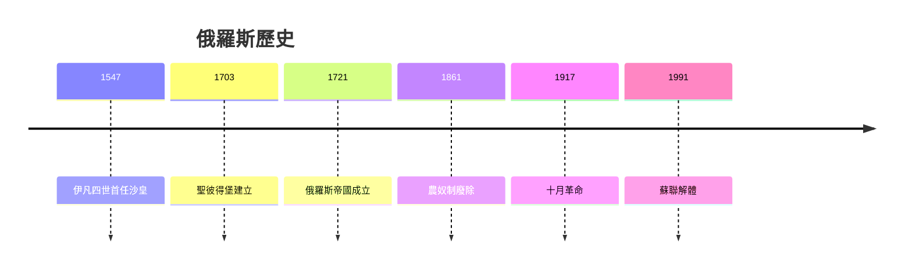
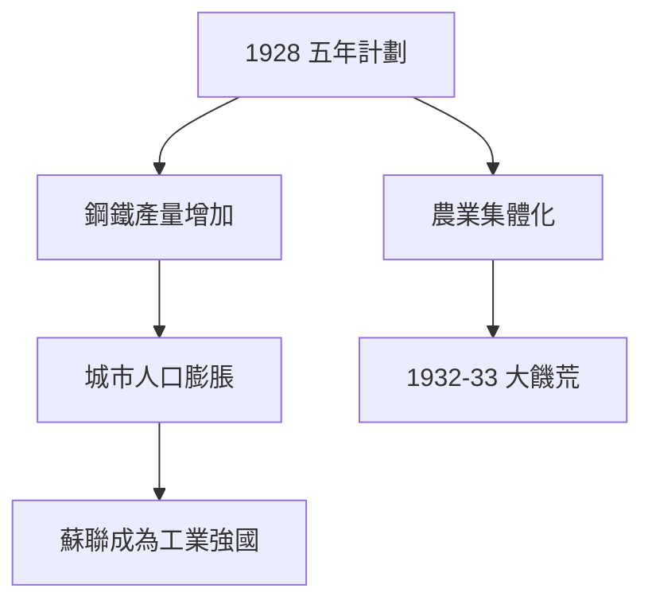
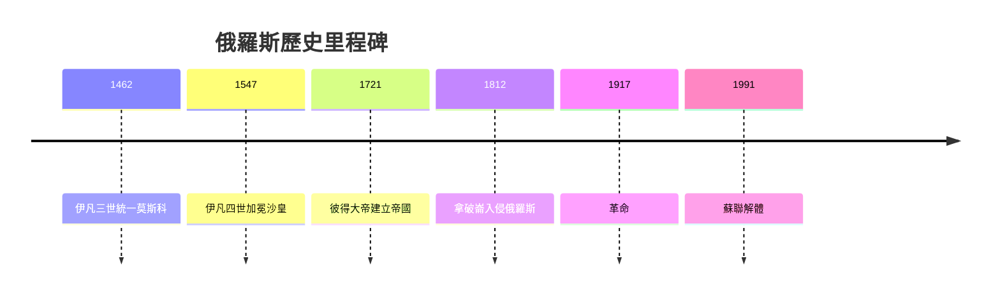
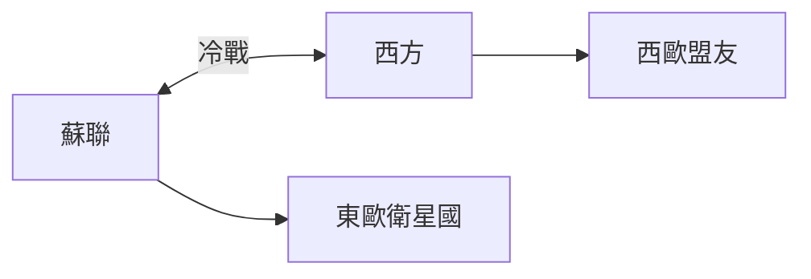
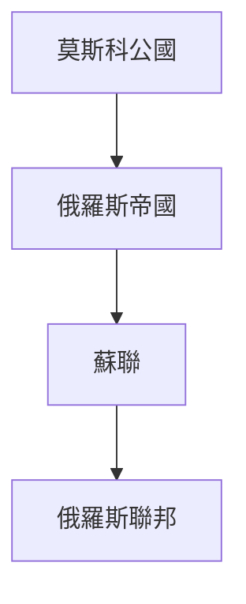
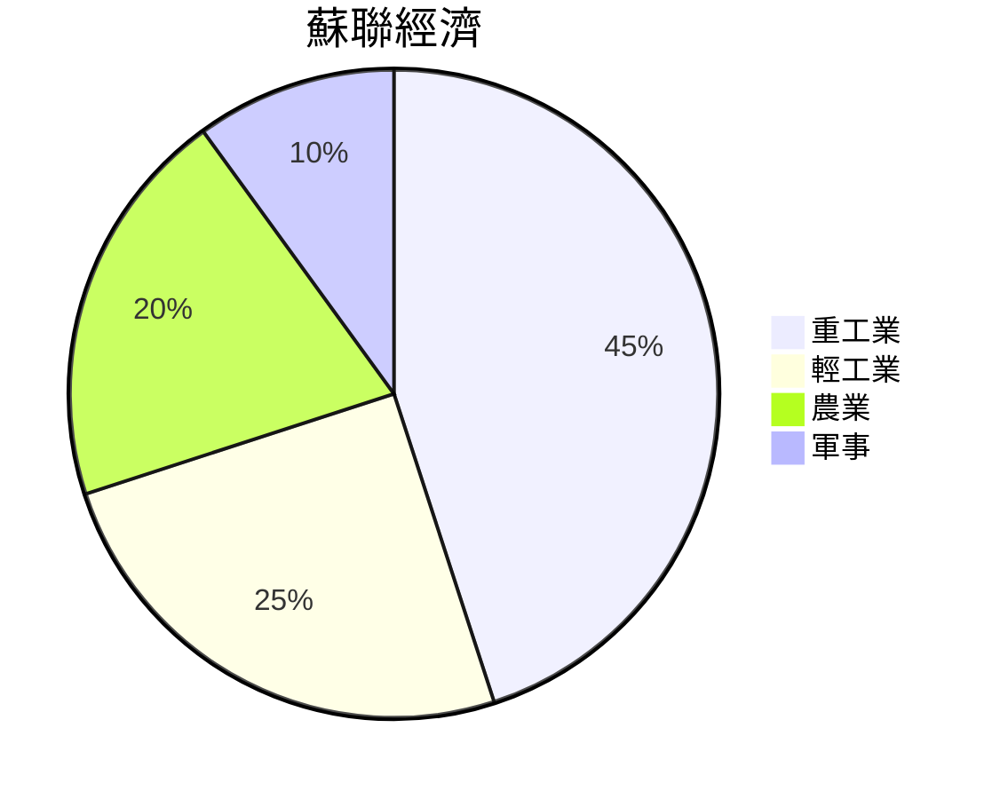
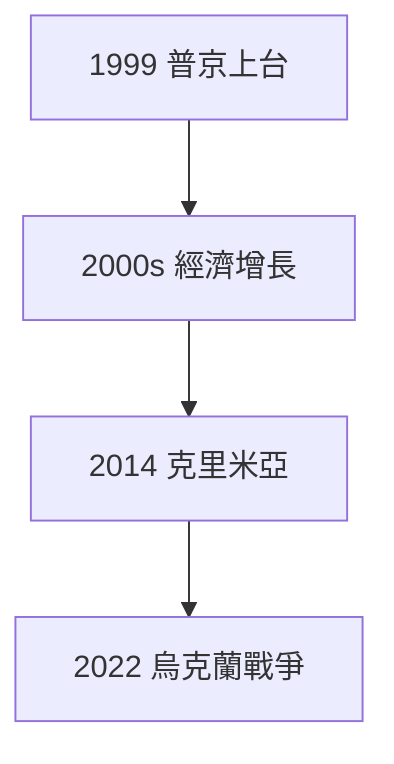

# HIST2103 俄國國家與社會 / Russian State and Society in the 20th Century (6 credits)

**Instructor**: Oscar Sanchez-Sibony
**Department**: History, HKU  
**Official source**: [HKU History Course Description 2024-25](https://history.hku.hk/wp-content/uploads/2024/07/HIST-2425.pdf)
**Style**: 袁騰飛式 — 犀利、聚焦俄國點解成為超級大國

---

## 問題 1：這個領域所有專家共享的 5 個核心心智模型

### 心智模型 1：俄羅斯專制主義傳統
學者 **Richard Pipes** (哈佛, *Russia under the Old Regime*, 1974) 指出：俄羅斯專制主義唔係歷史偶然，而係東正教-拜占庭政治文化嘅必然產物。沙皇被視為「神授」權力。

學者 **Fernand Braudel** 研究：俄羅斯地理幅員遼闊，導致中央集權需要——距離令地方自治困難。

- 1547 伊凡四世成為首位沙皇
- 1721 彼得大帝建立俄羅斯帝國
- 1917 布爾什維克革命建立蘇聯

### 心智模型 2：蘇聯計劃經濟實驗
學者 **Alec Nove** (*An Economic History of the USSR*, 1992) 分析：蘇聯計劃經濟係人類史上最大規模嘅經濟實驗——從農業社會到工業強國只用 30 年。

學者 **Sheila Fitzpatrick** (*The Russian Revolution*, 2005) 提醒：蘇聯快速工業化代價——農業集體化導致 1932-33 年大饑荒，數百萬人死亡。

- 1928 史太林第一個五年計劃
- 1932 集體農業強制推行
- 1945 蘇聯成為超級大國

### 心智模型 3：俄羅斯貴族農奴關係
學者 **Gregory L. Freeze** 研究：俄羅斯農奴制維持到 1861 年——係歐洲最後廢除農奴制嘅大國。

學者 **Daniel Brower** 研究：農奴制造成俄羅斯社會落後——農民缺乏教育機會，社會流動停滯。

### 心智模型 4：冷戰時期蘇聯全球擴張
學者 **Odd Arne Westad** (*The Global Cold War*, 2007) 分析：蘇聯冷戰唔單止係美蘇對抗，而係全球範圍內意識形態、軍事、經濟全方位競爭。

學者 **Vladimir Tismăneanu** 研究：蘇聯東歐衛星國——1968 年布拉格之春、1981 年團結工聯——蘇聯控制依靠武力。

### 心智模型 5：俄羅斯民族主義與帝國身份
學者 **Lars Høner** 研究：俄羅斯身份認同問題——俄羅斯係斯拉夫民族定歐亞帝國？東正教定世俗現代化？呢個緊張關係延續至今。

學者 **Terry Eagleton** 分析：民族主義係蘇聯崩潰後俄羅斯填補意識形態真空嘅工具。

---

## 問題 2：3 個根本分歧

### 分歧 1：十月革命——歷史必然定偶然？
- **A 方**：歷史結構論
  - **Eric Hobsbawm** (*Age of Extremes*, 1994)
  - 俄羅斯階級矛盾、無產階級運動必然導致革命
- **B 方**：歷史偶然論
  - **Richard Pipes** (*Russia's February Revolution*, 2014)
  - 如果沙皇冇被暗殺、如果列寧冇回國——革命可以避免

### 分歧 2：蘇聯計劃經濟——失敗定成就？
- **A 方**：成就顯著
  - 從農業國到工業強國
  - 教育、醫療普及
- **B 方**：最終失敗
  - 經濟效率低下
  - 1991 年蘇聯崩潰證明

### 分歧 3：普京時代——俄羅斯復興定歷史倒退？
- **A 方**：恢復大國地位
  - 克里米亞、敘利亞干預
- **B 方**：歷史倒退
  - 民主倒退、經濟依賴石油

---

## 問題 3：10 個深度問題

1. 如果列寧冇返俄羅斯，十月革命會發生嗎？
2. 點解蘇聯會崩潰？——結構問題定領導人錯誤？
3. 如果你是史太林，點解要搞農業集體化？
4. 點解俄羅斯人懷念蘇聯？——真實集體記憶定政治宣傳？
5. 普京點解要入侵烏克蘭？——安全考慮定帝國野心？
6. 點解俄羅斯民主化失敗？
7. 蘇聯女性平權——社會主義實驗成功嗎？
8. 點解俄羅斯共產主義可以係「另類現代性」？
9. 如果你是冷戰時期美國决策者，點樣阻止蘇聯擴張？
10. 俄羅斯歷史教我哋乜嘢關於專制主義穩定性？

---

## 核心心智模型深化

### 1. 俄羅斯帝國形成

### 2. 蘇聯工業化

---

## 5 個 Mermaid 圖解

### 📊 Diagram 1: 俄羅斯帝國時間線

### 📊 Diagram 2: 蘇聯與西方

### 📊 Diagram 3: 俄羅斯領土變化

### 📊 Diagram 4: 蘇聯經濟數據

### 📊 Diagram 5: 普京時代

---

## 總結

1. 俄羅斯專制主義係歷史文化產物
2. 蘇聯實驗係20世紀最大膽社會工程
3. 冷戰塑造俄羅斯同世界命運
4. 普京時代揭示專制主義穩定性
5. 俄羅斯歷史教我哋關於帝國主義、民族主義、意識形態

**最後問題**: 俄羅斯會再次成為超級大國嗎？

---
**版權所有 © HKU History Self-Study**
