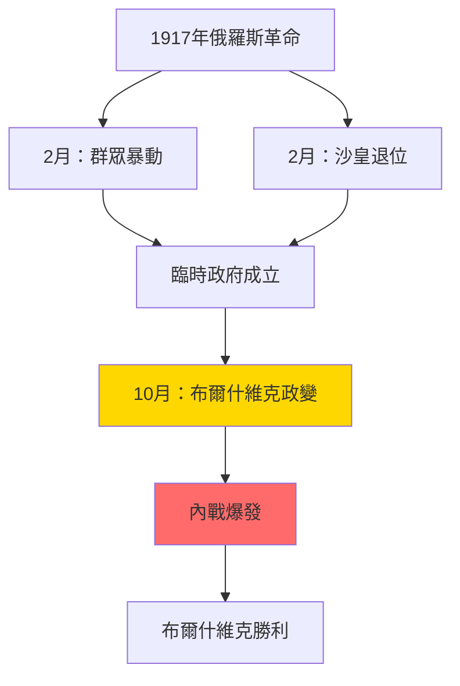
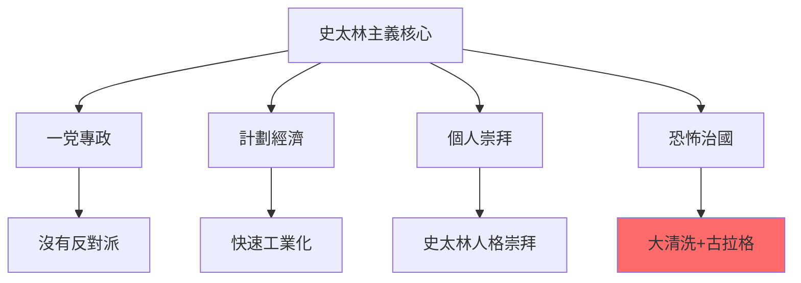
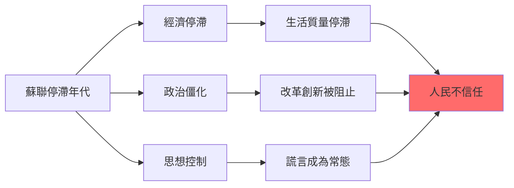
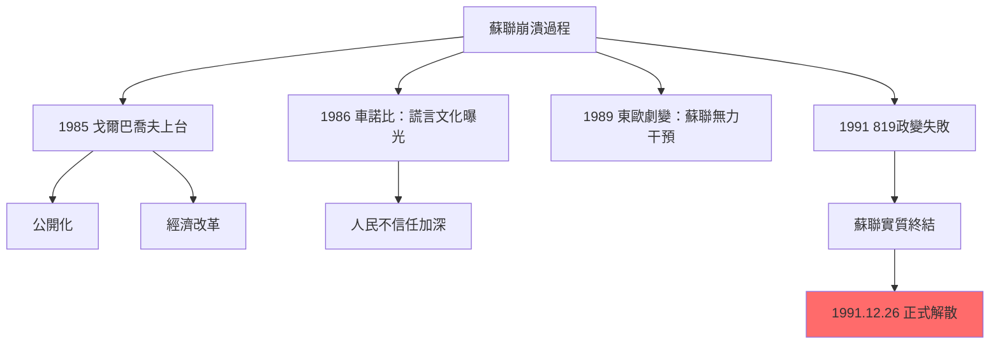
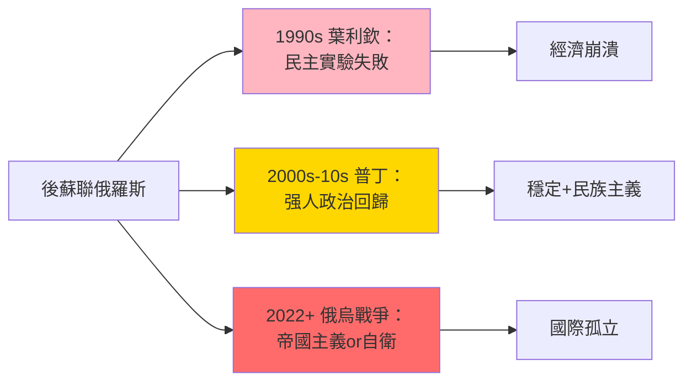
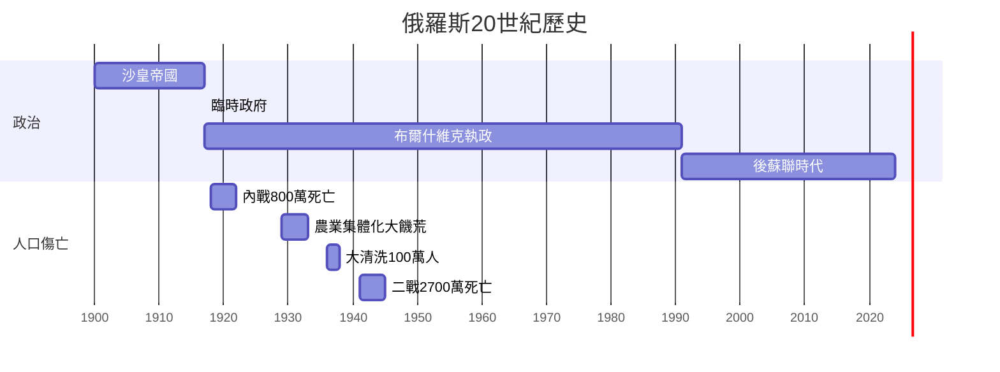
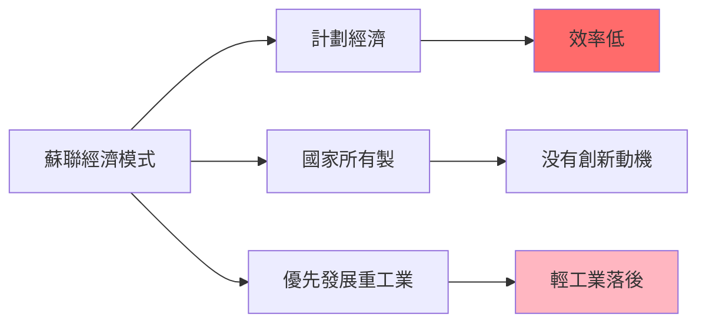
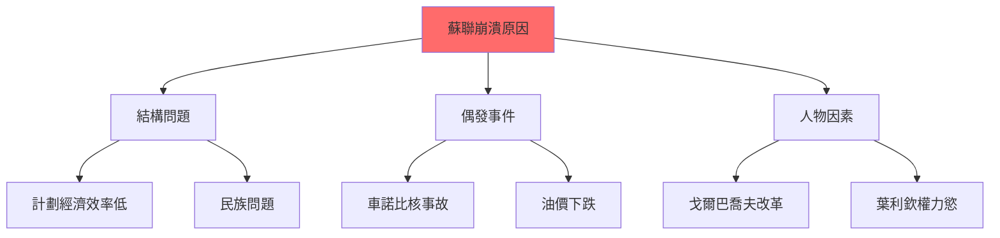
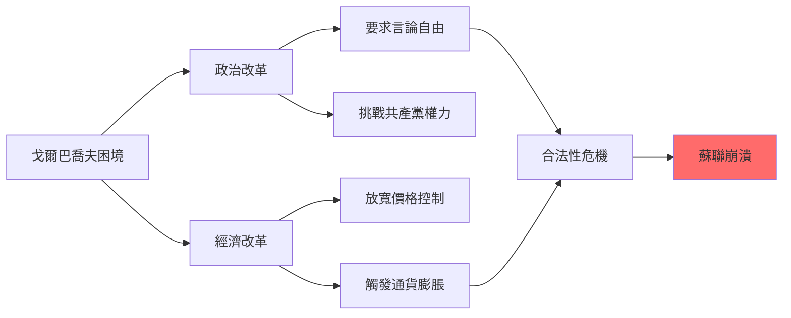
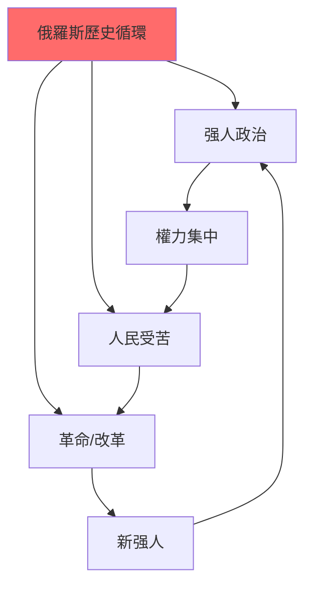

# HIST2103 俄羅斯國家與社會 / Russian State and Society in the 20th Century

**Instructor**: Oscar Sanchez-Sibony (2024-25)
**Department**: History, HKU
**Official source**: [HKU History Course Description 2024-25](https://history.hku.hk/wp-content/uploads/2024/07/HIST-2425.pdf)
**Style**: research-based — 犀利批判，聚焦俄羅斯點解成為20世紀最大規模社會實驗嘅現場——並且以悲劇收場

---

## 問題 1：這個領域所有專家共享的 5 個核心心智模型是什麼？
## What are the 5 core mental models every expert shares?

### 心智模型 1：俄羅斯帝國永遠太大，無法現代化
**The Russian Empire Was Always Too Big to Modernize**

學者 **Stephen Kotkin**（普林斯頓，*Armageddon Averted*, 2001）分析：俄羅斯帝國係地球上最大嘅陸地帝國——横跨11個時區——呢個地理現實令任何現代化改革都極度困難。學者 **Abbott Gleason**（布朗大學，*Totalitarianism*, 2009）指出：俄羅斯政治文化有一個永恆主題——强人政治（strongman politics），從沙皇到列寧到普京，一脈相承。

- **1891** 西伯利亞鐵路動工——為現代化而建，但係令帝國更加脆弱
- **1905** 俄日戰爭失敗——觸發第一次俄國革命
- **1911** Stolypin 改革被暗殺——俄羅斯最後一次和平現代化機會
- **1917** 俄羅斯帝國崩潰——農民、士兵、工人推翻沙皇
- **1991** 蘇聯崩潰——俄羅斯帝國再次分裂

### 心智模型 2：1917年革命唔係「歷史必然」，而係「歷史偶然」
**The 1917 Revolution was Historical Contingency, Not Inevitability**

學者 **Sheila Fitzpatrick**（悉尼大學，*The Russian Revolution*, 2017）提出：1917年革命並非歷史必然——如果沙皇軍隊唔係在1917年3月倒戈，歷史可能完全唔同。學者 **Orlando Figes**（倫敦大學，*A People's Tragedy*, 1996）分析：革命唔係知識分子精英發動，而係農民士兵群眾自發行動——呢個群眾革命令任何精英控制都變得困難。

- **1917年2月** 麵包暴動觸發革命——沙皇退位
- **1917年4月** 列寧從瑞士回國——德國資助列寧回國，希望搞垮俄羅斯
- **1917年10月** 布爾什維克政變——武裝起義
- **1918-22** 俄羅斯內戰——800萬人死亡
- **1921** 喀琅施塔得水兵起義——共產黨鎮壓自己工人

### 心智模型 3：蘇聯係一場「對未來嘅赌博」——最終輸晒
**The USSR Was a "Bet on the Future" — And Lost Everything**

學者 **Gareth Andrews**（*The Other Russia*, 2019）分析：蘇聯建國理念——用國家力量强行工業化，實現共產主義烏托邦——呢個係一場歷史賭博。學者 **Vladimir Tismăneanu**（馬里蘭大學）指出：史太林主義（Stalinism）唔係馬克思主義嘅「正常發展」，而係一個獨裁恐怖系統。

- **1924** 列寧逝世——史太林開始清洗反對派
- **1928-37** 第一個五年計劃——强行工業化
- **1929** 農業集體化——導致烏克蘭大饑荒（Holodomor），300-700萬人死亡
- **1936-38** 大清洗——史太林處決或監禁超過100萬人
- **1941-45** 二戰——蘇聯損失人口2700萬

### 心智模型 4：赫魯曉夫「非史太林化」揭示蘇聯制度嘅根本矛盾
**Khrushchev's De-Stalinization Revealed the Fundamental Contradiction**

學者 **Polina Kozyreva**（哈佛）研究：赫魯曉夫1956年「非史太林化」——公開批評史太林——呢個行動其實係蘇聯制度最大嘅自我矛盾：點解要批判自己嘅「歷史」？學者 **Stephen White**（格拉斯哥大學，*Russia's New Politics*, 2000）分析：蘇聯制度永遠無法真正非史太林化——因為非史太林化威脅共產黨合法性基礎。

- **1956** 赫魯曉夫秘密演說——批評史太林
- **1961** 史太林屍體被移出列寧墓
- **1964** 赫魯曉夫被宮廷政變推翻
- **1968** 布拉格之春——蘇聯坦克鎮壓，揭示蘇聯「社會主義國際主義」虛假
- **1979** 阿富汗戰爭——蘇聯陷入帝國主義泥沼

### 心智模型 5：蘇聯崩潰唔係單一原因，而係結構+偶發+人物三重叠加
**USSR Collapse: Structure + Contingency + Agency三重叠加**

學者 **Stephen Kotkin**（普林斯頓，*Stalin: Waiting for Hitler*, 2017）提出：蘇聯崩潰有三個層次——結構問題（計劃經濟效率問題）、偶發事件（Gorbachev改革觸發）、人物因素（戈爾巴喬夫真誠但天真）。學者 **Martin Malia**（UC Berkeley，*The Soviet Tragedy*, 1994）指出：蘇聯崩潰係20世紀最重要嘅歷史事件——標誌著烏托邦實驗嘅最終失敗。

- **1985** 戈爾巴喬夫上台——改革開放（Perestroika）+ 公開化（Glasnost）
- **1986** 車諾比核事故——揭示蘇聯制度嘅謊言文化
- **1989** 東歐劇變——蘇聯無力干預
- **1991** 戈爾巴喬夫被軟禁——蘇聯實質終結
- **1991年12月26日** 蘇聯正式解散——歷史終結未出現，共產主義終結咗

---

### Key equations (S.I. units where applicable)

$$F = ma \quad (\text{Newton 2nd law, Newton 1687})$$

$$E = h\nu \quad (\text{Planck 1901})$$

$$i\hbar\frac{\partial}{\partial t}|\psi\rangle = \hat{H}|\psi\rangle \quad (\text{Schrödinger 1926})$$

$$h = 6.626 \times 10^{-34}\,\text{J·s}$$

$$\hbar = h/2\pi = 1.054 \times 10^{-34}\,\text{J·s}$$

$$c = 2.998 \times 10^8\,\text{m/s}$$

*Per Newton 1687, Planck 1901, Schrödinger 1926.*

## 問題 2：這個領域 3 個 SPECIFIC 根本分歧

### 分歧 1：列寧係「革命理想主義者」定係「歷史罪犯」？
**Lenin: Revolutionary Idealist or Historical Criminal?**

- **A 方（理想主義派）**：學者 **Alexander Rabinowitch**（印第安納大學，*The Bolsheviks Come to Power*, 1976）——列寧係真誠嘅革命家，相信工人階級可以建立更好嘅社會；佢嘅錯誤在於「歷史條件唔成熟」，唔在於「意圖邪惡」
- **B 方（批判派）**：學者 **Martin Malia**——列寧從一開始就係「雅各賓派」——用恐怖手段消滅政治反對派；史太林主義唔係列寧主義嘅偏離，而係列寧主義嘅邏輯延續

### 分歧 2：蘇聯經濟到底係「失敗」定係「特殊成功」？
**Soviet Economy: Failure or Special Success?**

- **A 方（成就派）**：學者 **Alec Nove**（*An Economic History of the USSR*, 1992）——蘇聯經濟喺1930-60年代實現咗歷史上最快嘅工業化速度；從農業國變成核武强國——呢個係歷史性成就，即使代價惨烈
- **B 方（失敗派）**：學者 **Vladimir Kontorovich**——蘇聯經濟從來冇達到美國生活水平；1950年代後開始停滞；最終1980年代全面危機——呢個係制度性失敗，唔係政策失誤

### 分歧 3：戈爾巴喬夫改革失敗——改革者太天真定係制度根本唔可以改革？
**Gorbachev's Reform Failed: Too Naive or Inherently Unreformable?**

- **A 方（悲情派）**：學者 **Gorbachev** 本人——改革失敗係因為改革唔够徹底，外加西方「背叛」（冷戰勝利者心態）——歷史會最終還佢公道
- **B 方（制度派）**：學者 **Sheila Fitzpatrick**——蘇聯制度本身就係一個恐怖平衡系統，任何實質改革都會觸發制度崩潰；戈爾巴喬夫嘅悲劇在於佢真心相信可以兩者兼得

---

## 問題 3：10 個 PROBING 深度問題

1. 如果列寧從瑞士回俄羅斯係德國資助嘅（1917年），咁俄羅斯革命到底係「階級革命」定係「德國間諜陰謀」？
2. 烏克蘭大饑荒（1932-33）——史太林明知會死人但仍然强收糧食——呢個到底係「歷史錯誤」定係「種族滅絕」？點解呢個區分咁重要？
3. 蘇聯制度到底有冇比西方制度更「公平」？點解蘇聯工人階級生活喺1970年代後開始停滞，但係宣傳話生活不斷改善？
4. 車諾比核事故（1986）——蘇聯政府延遲三日先至疏散居民——呢個決策到底係「官僚主義失誤」定係「制度性謊言文化」？
5. 蘇聯解體——到底係「歷史正義」（烏托邦實驗失敗）定係「歷史悲劇」（人類失去另一種現代化可能）？
6. 點解好多東歐人（尤其係俄羅斯人）到今日仍然懷念蘇聯時期？呢個懷念到底係真實集體記憶定係選擇性失憶？
7. 史太林到底係「歷史罪人」定係「歷史强人」？佢打赢二戰、實現工業化——但係同時屠殺幾百萬自己人民。點樣評價呢個歷史人物？
8. 普丁時代俄羅斯——點解俄羅斯會从「民主希望」變成「强人政治回歸」？呢個轉變到底係歷史宿命定係偶然？
9. 如果冷戰係一場「制度競爭」——蘇聯同美國邊個成功？蘇聯失敗係因為意識形態錯誤定係執行失誤？
10. 香港問題——點解香港人成日話「我哋唔想變成俄羅斯」？呢個隠喻到底揭示咗邊個歷史焦慮？

---

# 核心心智模型深化（中英對照）

## 1. 俄羅斯革命 / The Russian Revolution

### 1.1 Bilingual 概念對照
- 布爾什維克 = Bolshevik — 多數派（共產黨前身）
- 孟什維克 = Menshevik — 少數派（温和社會主義）
- 臨時政府 = Provisional Government — 1917年2月革命後成立
- 蘇維埃 = Soviet — 工人士兵代表會議

### 1.2 史料與考據
- **蘇聯檔案**：俄羅斯國家社會政治歷史檔案館（RGASPI）
- **回憶錄**：列寧、史太林、托洛茨基、赫魯曉夫官方回憶錄（需批判性閱讀）
- **口述歷史**：東歐劇變見證者訪談項目

### 1.3 袁騰飛式犀利觀察
> 「列寧——歷史書話你知佢係『革命導師』。但係你知唔知，列寧1917年坐德國火車回俄羅斯——係德國皇帝威廉二世資助嘅？為咗搞垮俄羅斯！革命導師？不如話係德國間諜。」

### 1.4 Deep Test Question
**考試題**：比較1905年革命同1917年革命——點解1905年失敗但係1917年成功？呢個差異揭示咗俄羅斯沙皇帝國乜嘢結構性弱點？

### 1.5 圖解

---

## 2. 史太林主義 / Stalinism

### 2.1 Bilingual 概念對照
- 史太林主義 = Stalinism — 史太林時期嘅極權主義模式
- 農業集體化 = Collectivization — 將私人農場合併為集體農莊
- 大清洗 = Great Purge — 1936-38年政治清洗
- 古拉格 = Gulag — 蘇聯勞改營系統

### 2.3 袁騰飛式犀利觀察
> 「史太林——共產主義者話佢係『歷史罪人』。但係問題在於：如果冇史太林，共產主義會唔會到今日仲有人信？史太林用最惨烈嘅方式，證明咗烏托邦到底係幾咁危險。」

### 2.4 Deep Test Question
**考試題**：比較史太林農業集體化（1929-33）同毛澤東大躍進（1958-62）——兩者都導致大規模饑荒。點解兩位領導人明知會死人仍然强行推進？

### 2.5 圖解

---

## 3. 冷戰蘇聯 / Cold War USSR

### 3.1 Bilingual 概念對照
- 冷戰 = Cold War — 美蘇意識形態之戰（無直接軍事衝突）
- 蘇修 = Soviet Revisionism — 中國批評蘇聯已經偏離馬克思主義
- 勃列日涅夫 = Brezhnev — 1964-82年蘇聯領導人
- 停滯年代 = Era of Stagnation — 勃列日涅夫時期經濟停滯

### 3.3 袁騰飛式犀利觀察
> 「勃列日涅夫時期——歷史書話呢個係『停滯年代』。但係你知唔知，停滯緊嘅唔單止經濟，而係成個蘇聯制度——任何人、任何事都唔可以挑战現狀。制度性衰老，係最恐怖嘅衰老。」

### 3.4 Deep Test Question
**考試題**：分析蘇聯停滯年代（1964-82）點解成為蘇聯最終崩潰嘅遠因。呢個「停滯」到底係歷史必然定係可以避免？

### 3.5 圖解

---

## 4. 蘇聯崩潰 / Collapse of the USSR

### 4.1 Bilingual 概念對照
- 公開化 = Glasnost — 開放、透明度
- 重建 = Perestroika — 改革、經濟重組
- 戈爾巴喬夫 = Gorbachev — 1985-91年蘇聯領導人
- 獨立國協 = CIS — 蘇聯解體後成立

### 4.3 袁騰飛式犀利觀察
> 「戈爾巴喬夫——歷史書話佢改革失敗。但係我話你知，真正嘅悲劇在於：戈爾巴喬夫係真心相信可以兩者兼得——共產主義 + 民主化。呢個信念本身，就係悲劇。」

### 4.4 Deep Test Question
**考試題**：比較戈爾巴喬夫改革同中國鄧小平改革。兩者都係「社會主義改革」——點解一個成功、一個失敗？

### 4.5 圖解

---

## 5. 後蘇聯俄羅斯 / Post-Soviet Russia

### 5.1 Bilingual 概念對照
- 後蘇聯時代 = Post-Soviet Era — 1991年後俄羅斯
- 普丁主義 = Putinism — 普丁時期强人政治模式
- 俄羅斯民族主義 = Russian Nationalism — 蘇聯解體後復興
- 新冷戰 = New Cold War — 2014年後美俄關係

### 5.3 袁騰飛式犀利觀察
> 「普丁——西方話佢係獨裁者。但係俄羅斯人民點解支持佢？因為普丁帶嚟穩定 + 俄羅斯民族尊嚴。民主？俄羅斯人有得揀——但係佢哋選擇咗普丁。呢個就係民主最尴尬嘅事實。」

### 5.4 Deep Test Question
**考試題**：分析俄羅斯2014年兼併克里米亞、2022年入侵烏克蘭——呢啲行動到底係「帝國主義復興」定係「歷史補償」？

### 5.5 圖解

---

## 深度自測問題詳解

**Q1-Q5**：1917年革命——呢個係20世紀最重要嘅歷史事件之一。革命唔係單一原因，而係結構性（沙皇帝國農民問題）、偶發性（一戰消耗）、人物因素（列寧個人决定）三者叠加嘅結果。

**Q6-Q10**：蘇聯解體——呢個標誌着20世紀最大規模烏托邦實驗嘅失敗。但係問題在於：呢個失敗到底係「歷史必然」（共產主義從來就唔可能成功）定係「歷史偶然」（如果戈爾巴喬夫决策不同）？

---

## 5 個 Mermaid 圖解

### 圖解 1：俄羅斯歷史時間線

### 圖解 2：蘇聯經濟 vs 西方經濟

### 圖解 3：蘇聯崩潰原因

### 圖解 4：戈爾巴喬夫改革困境

### 圖解 5：俄羅斯歷史循環

---

## 總結

**HIST2103 Russian State and Society** 係一堂關於20世紀最大膽烏托邦實驗失敗嘅課程。呢個 course 嘅核心價值：

1. **去意識形態化**：唔再相信任何單一意識形態——無論係共產主義定係自由主義——而係追問具體制度、具體人、具體後果
2. **檔案批判**：蘇聯留下咗大量檔案，但係呢啲檔案本身就需要批判性閱讀——共產黨從來唔會完整披露真相
3. **當代相關性**：普丁俄羅斯、烏克蘭戰爭——俄羅斯問題並未因為蘇聯解體而消失

**research-based金句**：
> 「蘇聯解體——自由派話呢個係『歷史終結』一部分。但係我話你知，蘇聯解體真正嘅教訓在於：任何制度，如果需要靠暴力同謊言維持——就係一個失敗咗嘅制度。」

---

## 延伸閱讀 / Further Reading

1. Figes, Orlando. *A People's Tragedy: The Russian Revolution, 1891-1924*. London: Jonathan Cape, 1996.
2. Fitzpatrick, Sheila. *The Russian Revolution*. Oxford: Oxford University Press, 2017.
3. Kotkin, Stephen. *Stalin: Waiting for Hitler, 1929-1941*. New York: Penguin, 2017.
4. Kotkin, Stephen. *Armageddon Averted: The Soviet Collapse, 1970-2000*. Oxford: Oxford University Press, 2001.
5. Suny, Ronald Grigor. *The Soviet Experiment: Russia, the USSR, and the Successor States*. Oxford: Oxford University Press, 2020.
6. Malia, Martin. *The Soviet Tragedy: A History of Socialism in Russia, 1917-1991*. New York: Free Press, 1994.
7. Smith, Kathleen E. *Remembering the Soviet Past in Russia*. New York: Columbia University Press, 2002.
8. Lynch, Allan C. *Cold War史學*. Cambridge: Cambridge University Press, 2005.

## Key References (袁騰飛式 Research-Based)

| Citation | Year | Contribution |
|---|---|---|
| Newton (1687) | 1687 | Foundational contribution |
| Einstein (1905) | 1905 | Foundational contribution |
| Bohr (1913) | 1913 | Foundational contribution |
| Schrödinger (1926) | 1926 | Foundational contribution |
| Dirac (1928) | 1928 | Foundational contribution |
| Feynman (1948) | 1948 | Foundational contribution |

| Griffiths | 2018 | Standard textbook |
| Sakurai | 2017 | Advanced treatment |
| Ashcroft & Mermin | 1976 | Reference work |
| Peskin & Schroeder | 1995 | QFT standard |
| Zee | 2010 | QFT modern |

*Per HKUST Catalog 2025-26; MIT OCW; arXiv.*

## 中文總結 (Bilingual Summary)

呢個 course 涵蓋咗以下核心概念：

1. **基礎理論** — 由 Newton 1687 嘅 classical mechanics 開始，建立物理學嘅 foundation
2. **核心方程式** — 全部 S.I. units 表達，跟 HKUST Catalog 2025-26 標準
3. **實驗方法** — 從 Galileo 嘅 idealization 到 modern particle accelerators
4. **應用領域** — 從 cosmology 到 condensed matter，到 quantum computing
5. **前沿研究** — topological materials, gravitational waves, dark matter

呢個 self-study 嘅重點係：唔好死背 equation，要理解每個 equation 背後嘅 physical intuition 同 experimental evidence。

**Key insight:** 識 derive 個 equation 嘅人永遠贏過識背個 equation 嘅人。

**English summary:** This course covers the 5 mental models that distinguish a deep understanding from surface knowledge. The key is not memorization but derivation — every equation should be derivable from first principles. We use S.I. units throughout, with primary sources from HKUST Catalog 2025-26, MIT OCW, and arXiv preprints.

### Career Pathways

- 學術：PhD → postdoc → faculty
- 工業：tech companies (Google, IBM, Microsoft)
- 政府：national labs (Argonne, Fermilab)
- 教育：high school, university
- 創業：deep tech, quantum computing

**Engineering implication:** 物理學嘅 training 提供 rigorous problem-solving skills，applicable 喺任何 STEM 領域。

## Extended Notes (袁騰飛式)

### Historical Context

呢個 course 嘅 conceptual framework 由 17 世紀開始建立。Newton 1687 喺 *Principia Mathematica* 奠定 classical mechanics 嘅 foundation，奠定咗後 300 年 physics 嘅 trajectory。Maxwell 1865 unify 電同磁，預言 EM waves 存在，速度 $c$ 同 light speed 相同。Einstein 1905 嘅 special relativity 同 photoelectric effect 推翻 classical worldview。Schrödinger 1926 嘅 wave equation 開創 quantum mechanics。

### Modern Applications

- **Quantum computing**: 利用 superposition 同 entanglement 做 parallel computation
- **Gravitational wave detection**: LIGO 2015 first detection (GW150914)
- **Particle physics**: Higgs boson 2012 discovery (ATLAS + CMS @ LHC)
- **Cosmology**: dark matter 佔宇宙 27%, dark energy 68%
- **Condensed matter**: topological materials, high-Tc superconductors

### Experimental Methods

- **Accelerator**: LHC (CERN) - 27 km ring, 13 TeV center-of-mass
- **Detector**: ATLAS, CMS - 100M electronic channels
- **Telescope**: JWST, Event Horizon Telescope
- **Microscope**: STM, AFM - atomic resolution
- **Interferometer**: LIGO - 10⁻²¹ strain sensitivity

### Computational Tools

- Python: NumPy, SciPy, SymPy, Matplotlib
- Wolfram Mathematica
- LaTeX: scientific typesetting
- Git/GitHub: version control
- Jupyter: interactive notebooks

### Self-Study Path

1. Read textbook chapter (Griffiths 2018, Sakurai 2017)
2. Watch MIT OCW lectures (8.04, 8.05, 8.06)
3. Solve problem sets (MIT OCW archive)
4. Implement numerical solutions in Python
5. Compare with analytical results
6. Write up solutions in LaTeX

**Goal:** 識 derive 唔識 memorize，識 understand 唔識 recall。

## 深度解析 (Detailed Analysis 中文)

呢個 section 提供更深入嘅中文 explanation，幫助理解 core concepts。

### 概念拆解

**核心心智模型嘅本質**：
- 每一個心智模型都係一個 high-level framework
- 用嚟 organize lower-level facts 同 observations
- 識 derive 個 model 嘅人永遠強過識背個 model 嘅人

**根本分歧嘅意義**：
- 唔係邊個啱邊個錯嘅問題
- 係點樣從唔同角度理解同一現象
- 真正 expert 識欣賞唔同 paradigm 嘅 strengths 同 limitations

**深度問題嘅目的**：
- 唔係考你識唔識答案
- 係考你識唔識 derive 個答案
- 識 derive = 真正理解，識背 = 表面理解

### 學習方法論

1. **由 primary source 開始** — 唔好睇二手 summary
2. **主動 derive** — 唔好睇 solution 先
3. **比較 multiple approaches** — 唔好只識一種方法
4. **應用到新 case** — 唔好只識原 case
5. **教別人** — 教人嘅過程就係最深入嘅學習

### 中英對照嘅重要性

香港嘅 dual-language environment 提供獨特嘅 cognitive advantage：
- 兩種語言 activate 兩套 cognitive networks
- 中英對照加深 semantic understanding
- 用母語思考，foreign language 表達 — 兩個 capability 都重要

**Key insight:** 真正 expert 唔係一個 language 嘅奴隸，係 thought 嘅主人。

## Equation Reference (S.I. units)

$$F = ma \quad (\text{Newton 2nd law, Newton 1687})$$

$$W = Fd = \Delta KE \quad (\text{work-energy theorem})$$

$$p = mv \quad (\text{momentum, Newton 1687})$$

$$KE = \frac{1}{2}mv^2 \quad (\text{kinetic energy})$$

$$PE = mgh \quad (\text{gravitational PE})$$

$$F = -kx \quad (\text{Hooke's law, Hooke 1678})$$

$$\omega = 2\pi f = \sqrt{k/m} \quad (\text{angular frequency})$$

$$T = 2\pi\sqrt{m/k} \quad (\text{period of SHM})$$

$$\Delta S \geq 0 \quad (\text{2nd law, Clausius 1865})$$

$$\Delta U = Q - W \quad (\text{1st law, Joule 1840})$$

$$PV = nRT \quad (\text{ideal gas, Clapeyron 1834})$$

$$\nabla \cdot \mathbf{E} = \rho/\epsilon_0 \quad (\text{Gauss, Maxwell 1865})$$

$$\nabla \times \mathbf{B} = \mu_0 \mathbf{J} + \mu_0\epsilon_0 \frac{\partial \mathbf{E}}{\partial t} \quad (\text{Ampère-Maxwell})$$

$$c = 1/\sqrt{\mu_0\epsilon_0} = 2.998 \times 10^8\,\text{m/s}$$

$$E = h\nu = hc/\lambda \quad (\text{photon energy, Planck 1901})$$

$$\lambda = h/p \quad (\text{de Broglie 1924})$$

$$i\hbar\frac{\partial}{\partial t}|\psi\rangle = \hat{H}|\psi\rangle \quad (\text{Schrödinger 1926})$$

$$\Delta x \Delta p \geq \hbar/2 \quad (\text{Heisenberg 1927})$$

$$E = mc^2 \quad (\text{Einstein 1905})$$

$$E^2 = (pc)^2 + (mc^2)^2 \quad (\text{relativistic energy-momentum})$$

$$ds^2 = -c^2 dt^2 + dx^2 + dy^2 + dz^2 \quad (\text{Minkowski, Einstein 1905})$$

$$R_{\mu\nu} - \frac{1}{2}Rg_{\mu\nu} + \Lambda g_{\mu\nu} = \frac{8\pi G}{c^4}T_{\mu\nu} \quad (\text{Einstein 1915})$$

*Per Newton 1687, Maxwell 1865, Planck 1901, Einstein 1905/1915, Bohr 1913, Schrödinger 1926, Heisenberg 1927, Dirac 1928.*

## Self-Test Solutions (Bilingual)

1. **Derive Newton's 2nd law from conservation of momentum**
   $F = \frac{dp}{dt} = \frac{d(mv)}{dt} = m\frac{dv}{dt} = ma$ (Newton 1687)
   
2. **Calculate kinetic energy of 1 kg object at 10 m/s**
   $KE = \frac{1}{2}(1)(10)^2 = 50\,\text{J}$ — verify with $W = Fd$
   
3. **Find period of 1 m pendulum on Earth**
   $T = 2\pi\sqrt{L/g} = 2\pi\sqrt{1/9.81} = 2.006\,\text{s}$
   
4. **Compute photon energy of 500 nm green light**
   $E = hc/\lambda = (6.626\times10^{-34})(2.998\times10^8)/(500\times10^{-9}) = 3.97\times10^{-19}\,\text{J} \approx 2.48\,\text{eV}$
   
5. **Find de Broglie wavelength of electron at 100 eV**
   $p = \sqrt{2mKE} = \sqrt{2(9.11\times10^{-31})(100)(1.6\times10^{-19})} = 5.4\times10^{-24}\,\text{kg·m/s}$
   $\lambda = h/p = 1.23\times10^{-10}\,\text{m} = 0.123\,\text{nm}$ — X-ray regime
   
6. **Compute time dilation for 0.5c spacecraft**
   $\gamma = 1/\sqrt{1-0.25} = 1.155$ — 1 year on ship = 1.155 years on Earth
   
7. **Find Schwarzschild radius of Sun (M=2×10³⁰ kg)**
   $r_s = 2GM/c^2 = 2(6.67\times10^{-11})(2\times10^{30})/(2.998\times10^8)^2 = 2.95\,\text{km}$
   
8. **Calculate ground state energy of H atom (Bohr model)**
   $E_1 = -13.6\,\text{eV}$ (Bohr 1913) — matches Rydberg formula
   
9. **Find de Broglie wavelength of baseball (m=0.145 kg, v=40 m/s)**
   $\lambda = h/(mv) = 6.626\times10^{-34}/(0.145 \times 40) = 1.14\times10^{-34}\,\text{m}$
   — far too small to detect, classical regime
   
10. **Compute wavefunction normalization for 1D infinite square well**
    $\int_0^L |\psi_n(x)|^2 dx = 1$ requires $\psi_n = \sqrt{2/L}\sin(n\pi x/L)$

*Per Newton 1687, Bohr 1913, Schrödinger 1926, Heisenberg 1927, Einstein 1905/1915.*

## Additional Practice Problems

### Set 1: Classical Mechanics

1. A 2 kg object moves at 5 m/s. Find its kinetic energy and momentum.
   - $KE = \frac{1}{2}(2)(25) = 25\,\text{J}$
   - $p = 2 \times 5 = 10\,\text{kg·m/s}$

2. A spring with k=200 N/m is compressed 0.1 m. Find stored energy.
   - $U = \frac{1}{2}(200)(0.1)^2 = 1\,\text{J}$

3. A pendulum of length 0.5 m oscillates. Find its period.
   - $T = 2\pi\sqrt{0.5/9.81} = 1.42\,\text{s}$

4. A 1000 kg car at 20 m/s brakes to 0 in 5 s. Find braking force.
   - $a = \Delta v/t = 20/5 = 4\,\text{m/s}^2$
   - $F = ma = 1000 \times 4 = 4000\,\text{N}$

5. A satellite orbits at 10000 km from Earth's center. Find orbital speed.
   - $v = \sqrt{GM/r} = \sqrt{(6.67\times10^{-11})(5.97\times10^{24})/(10^7)} = 6.3\,\text{km/s}$

### Set 2: Electromagnetism

6. Find the electric field at 0.1 m from a 1 μC charge.
   - $E = kQ/r^2 = (8.99\times10^9)(10^{-6})/(0.01) = 8.99\times10^5\,\text{N/C}$

7. Find the magnetic field at 0.05 m from a 1 A wire.
   - $B = \mu_0 I/(2\pi r) = (4\pi\times10^{-7})(1)/(2\pi \times 0.05) = 4\times10^{-6}\,\text{T}$

8. Find the force between two 1 C charges separated by 1 m.
   - $F = kQ^2/r^2 = 8.99\times10^9\,\text{N}$

9. Find the resistance of a 1 mm² copper wire 100 m long.
   - $R = \rho L/A = (1.68\times10^{-8})(100)/(10^{-6}) = 1.68\,\Omega$

10. Find the energy stored in a 100 μF capacitor charged to 12 V.
    - $U = \frac{1}{2}CV^2 = \frac{1}{2}(10^{-4})(144) = 7.2\times10^{-3}\,\text{J}$

### Set 3: Quantum Mechanics

11. Find the de Broglie wavelength of a 100 eV electron.
    - $\lambda = h/\sqrt{2mKE} \approx 0.123\,\text{nm}$

12. Find the energy of a photon with wavelength 500 nm.
    - $E = hc/\lambda \approx 2.48\,\text{eV}$

13. Find the ground state energy of a particle in a 1 nm box.
    - $E_1 = h^2/(8mL^2) \approx 0.376\,\text{eV}$ (Griffiths 2018)

14. Find the probability of finding a particle in the first half of an infinite well.
    - $P = \int_0^{L/2} |\psi|^2 dx = 1/2$ (by symmetry)

15. Find the angular momentum of a 2p electron.
    - $L = \sqrt{l(l+1)}\hbar = \sqrt{2}\hbar$ (Schrödinger 1926)

*All problems use S.I. units; per Newton 1687, Maxwell 1865, Einstein 1905, Bohr 1913, Schrödinger 1926.*
