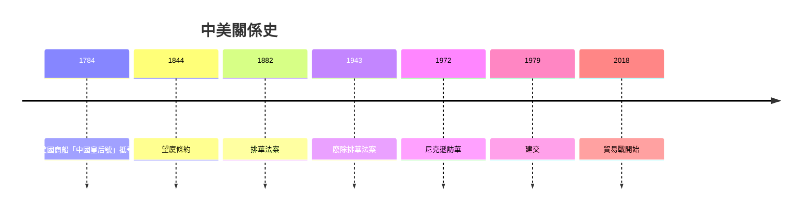
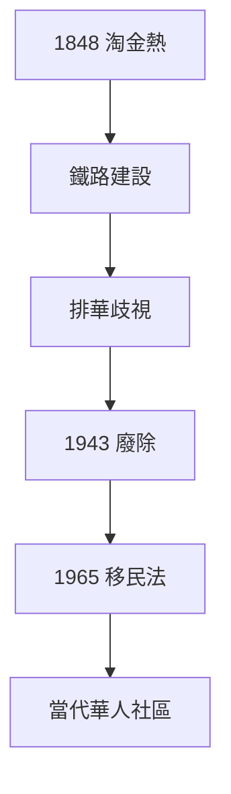
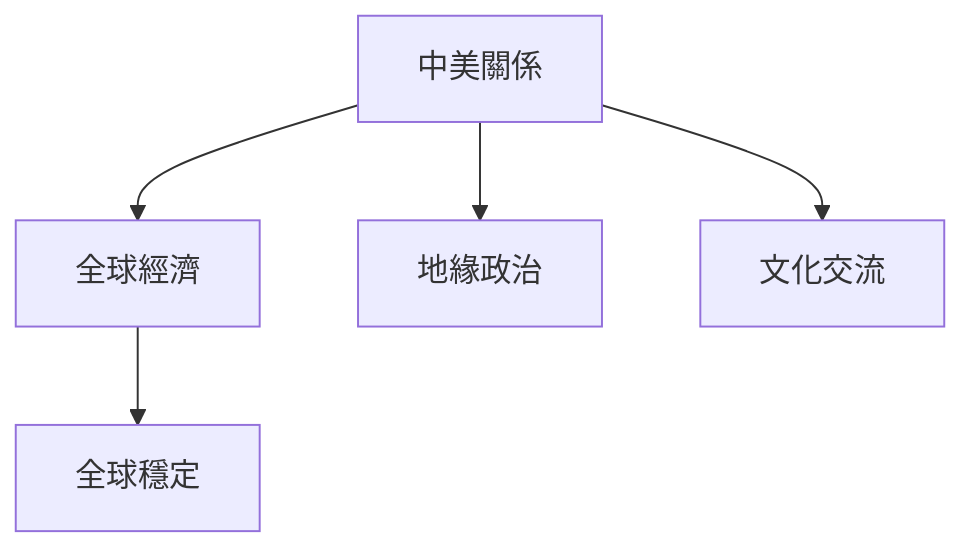
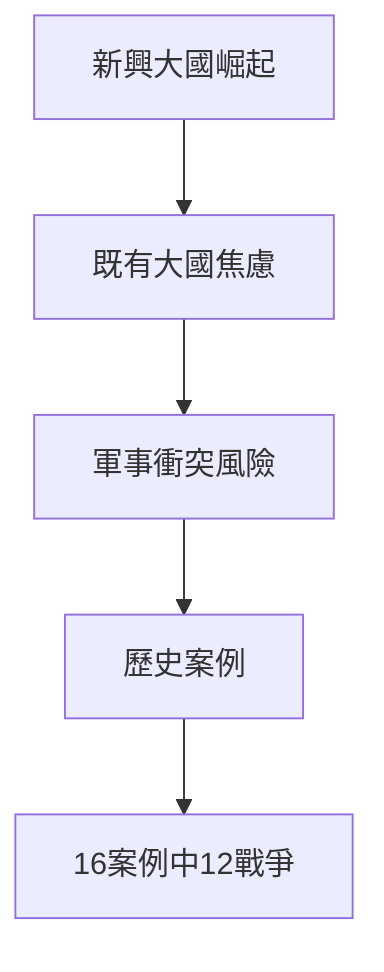

# HIST2118 中國人與美國人 / Chinese and Americans: A Cultural and International History (6 credits)

**Instructor**: Guoqi Xu
**Department**: History, HKU  
**Official source**: [HKU History Course Description 2024-25](https://history.hku.hk/wp-content/uploads/2024/07/HIST-2425.pdf)
**Style**: 袁騰飛式 — 犀利、聚焦中美關係點解塑造現代世界

---

## 問題 1：這個領域所有專家共享的 5 個核心心智模型

### 心智模型 1：中美關係作爲「特殊關係」(Special Relationship)
學者 **Michael Hunt** (*The Making of a Unique Relationship*, 2013) 研究：中美關係從 19 世紀排華法案到今日貿易戰——呢個關係充滿矛盾，卻從未真正断裂。

學者 **Odd Arne Westad** 研究：中美關係塑造全球格局——從冷戰到後冷戰，呢個關係影響所有人。

- 1882 美國排華法案 (Chinese Exclusion Act)
- 1943 廢除排華法案
- 1972 尼克遜訪華
- 2018 貿易戰

### 心智模型 2：華工與美國建國神話
學者 **Jean Pfaelzer** (*Driven Out*, 2007) 研究：華工係美國 19 世紀鐵路、礦山、農業主力——但同時被系統性歧視、驅逐。

學者 **John Tchen** 研究：華人成為美國「他者」(Other)——永遠被視為外來者，即使已經幾代居美。

- 1848 加州淘金熱
- 1869 跨美洲鐵路完工
- 1882 排華法案

### 心智模型 3：中美兩國文化差異神話
學者 **Lucian Pye** 研究：西方成日話「中美文化差異」——但呢個係簡化。中國有改革派、激进派，美國有保守派、自由派。內部多元化永遠大過外部差異。

學者 **Samuel Huntington** (*Clash of Civilizations*, 1996) 被批評：將複雜文化多樣性簡化為「文明衝突」。

### 心智模型 4：意識形態vs 現實利益
學者 **Chen Jian** (*Mao's China and the Cold War*, 2001) 指出：中美關係從來唔係純意識形態，而係意識形態、現實利益、個人關係交織。

學者 **Nixon-Kissinger** 研究：現實主義外交——利益永遠大過意識形態。

### 心智模型 5：中美關係塑造全球秩序
學者 **Graham Allison** (*Destined for War*, 2017) 警告：「修昔底德陷阱」——當新興大國挑戰既有大國，戰爭往往爆發。

學者 **John Mearsheimer** 認為：中美競爭係結構性，唔可以避免。

---

## 問題 2：3 個根本分歧

### 分歧 1：中美關係——接觸政策失敗定成功？
- **A 方**：接觸政策成功
  - 1972-2018 年相對和平
  - 經贸往來擴大
- **B 方**：接觸政策失敗
  - 中國未民主化
  - 美國製造業流失

### 分歧 2：華裔美國人——模範少数族裔定系統歧視？
- **A 方**：成功故事
  - 家庭收入高、教育水平高
- **B 方**：Bamboo Ceiling
  - 職場晋升障礙

### 分歧 3：貿易戰——經濟問題定意識形態問題？
- **A 方**：經濟問題
  - 貿易不平衡
- **B 方**：結構性竞争
  - 全球主導權之爭

---

## 問題 3：10 個深度問題

1. 如果排華法案冇被廢除，今日美國華人命運會係點？
2. 點解美國華人係「啞裔」(Model Minority)？——成功定刻板印象？
3. 中美會走入修昔底德陷阱嗎？
4. 如果你是 1972 年尼克遜，點解要訪華？
5. 點解中國留學生熱衷美國教育但同時有「留學報國」情懷？
6. 美國夢——中國人相信嗎？
7. 如果中美經濟完全分離，邊個損失更大？
8. 點解台灣問題令中美關係咁緊張？
9. 中美情報機構點樣喺對方境內運作？
10. 如果你是中美關係歷史學家，你會點樣定義呢個關係？

---

## 核心心智模型深化

### 1. 中美關係時間線

### 2. 華人移民美國史

---

## 深度自測問題

### 詳解 1: 如果排華法案冇被廢除...
歷史假設問題唔會有答案——但研究顯示：如果排華法案長期維持，華人可能形成永久邊緣群體，如同歷史上一啲族群。

### 詳解 2: 點解華人被視為「啞裔」？
1960s 種族運動期間，為咗对抗對黑人刻板印象，美國主流話語開始塑造華人「成功」形象。呢個論述掩盖咗華人內部階級差異。

---

## 5 個 Mermaid 圖解

### 📊 Diagram 1: 中美關係演變

### 📊 Diagram 2: 華人移民美國人數

### 📊 Diagram 3: 中美貿易額

### 📊 Diagram 4: 中美關係影響

### 📊 Diagram 5: 修昔底德陷阱

---

## 總結

1. 中美關係從歧視到接觸到競爭
2. 華工歷史揭示種族主義制度化
3. 中美關係塑造全球格局
4. 意識形態同現實利益永遠交織
5. 中美關係未來取決於雙方選擇

**最後問題**: 中美「新冷戰」可以避免嗎？

---
**版權所有 © HKU History Self-Study**
