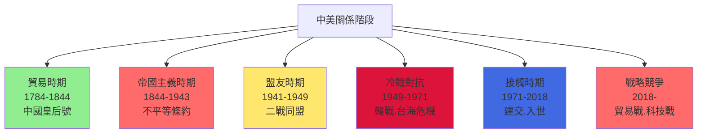
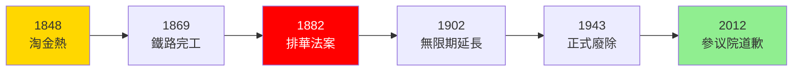
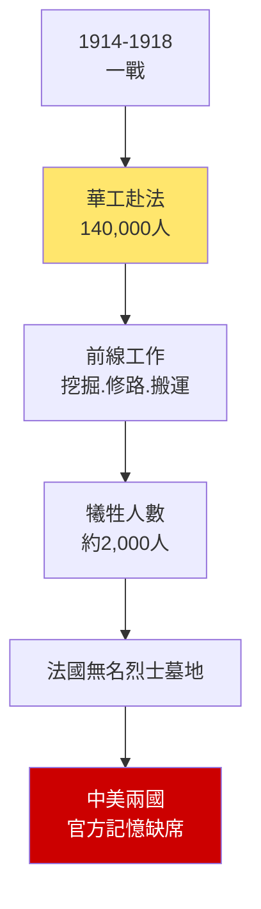
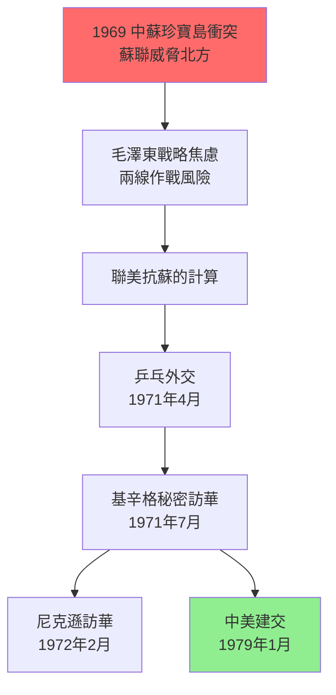
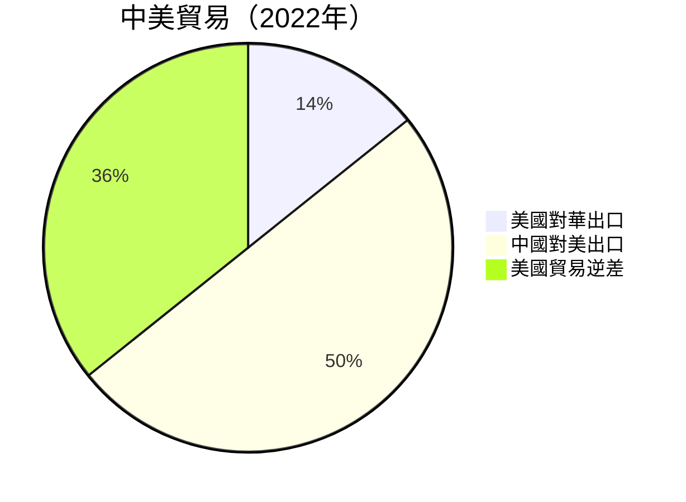

# HIST2118 中美關係史 / Chinese and Americans: A Cultural and International History

/** HKU | 6 credits | Instructor: Guoqi Xu (徐國琦) */

---

## 問題 1：5 個核心心智模型

### 1. 「共同歷史」框架——中美關係的另一種解讀
**定義**: 學者 **徐國琦 (Xu Guoqi)** 在 *Chinese and Americans: A Shared History* (2014) 中提出「共同歷史」（shared history）框架：中美關係不是單純的權力鬥爭，而是兩國人民在文化、教育、軍事和體育領域共同塑造的歷史。這種「共有」不同於「共同」（common）——它指的是雙方共同經歷過的歷史經驗，而非双方共同拥有的歷史。

**學者**: **徐國琦** — *Chinese and Americans: A Shared History* (2014); *Strangers on the Western Front* (2011); **Warren Cohen** — *America's Response to China* (2010); **Akira Iriye** — 研究中美日三角關係

**驗證**: 1868 年蒲安臣使團（Burlingame Mission）——中國首次派外交使團赴美；1908 年退款庚款——美國將部分庚子賠款用於中國教育（清華學堂由此成立）；1914-1918 年 14 萬華工赴歐參與一戰——中美在歐洲戰場並肩作戰。

**歷史事件**:
- **1784年2月22日**: 美國商船「中國皇后號」（Empress of China）抵達廣州——中美首次直接接觸
- **1844年7月3日**: 望廈條約（Wangxia Treaty）——美國獲得在華最惠國待遇，中美首個條約
- **1868年6月**: 蒲安臣使團——中國外交使團首次訪問美國，簽訂《蒲安臣條約》
- **1908年**: 美國退款庚款——每年退還部分庚子赔款資助中國學生赴美留學
- **1914-1918年**: 14萬華工赴法參與一戰，其中約2000人犧牲

### 2. 排華法案——美國首個種族主義移民法的歷史
**定義**: 1882 年《排華法案》（Chinese Exclusion Act）是美國首個針對特定族裔的移民法，嚴禁華工入境，並剝奪在美華人的入籍權——這部法律延續了 61 年（1882-1943），成為美國種族主義歷史中最恥辱的一頁。

**學者**: **Elliott R. Young** — *Alien Neighbors, Foreign Friends* (2014); **Andrew Gyorgy** 研究華裔美國人歷史; **John K. Fairbank** — 研究中美早期接觸

**驗證**: 1848 年淘金熱開始，大量華工赴美——高峰期 1852 年約 25,000 華人在加州；1869 年橫貫美國鐵路（第一條跨洲鐵路）完工——華工佔工人總數的 90%；1882 年排華法案後，華人人口從 1880 年的 105,465 人降至 1920 年的 61,639 人。

**歷史事件**:
- **1848年1月**: 加州淘金熱——華工開始大規模赴美
- **1869年5月10日**: 橫貫美國鐵路竣工——華工佔中央太平洋鐵路工人90%
- **1882年5月6日**: 格蘭特總統簽署排華法案——美國首個種族主義移民法
- **1902年**: 排華法案延長，涵蓋所有美屬太平洋島嶼
- **1943年12月17日**: 馬格努森法案廢除排華法案——但每年僅允許 105 名華人入境

### 3. 中美二戰同盟——「大國政治的諷刺」
**定義**: 1941-1945 年中美確實是正式盟友——美國通過《租借法案》向中國提供約 13 億美元物資，陳納德的「飛虎隊」在中國上空作戰。但這種同盟關係因蔣介石政權的腐敗、美國對共產黨的忽視、以及蔣-史迪威衝突而充滿矛盾。

**學者**: **Michael P. McClymond** — *Over the Himalayas and Through the Gateways* (2009); **Barbara W. Tuchman** — *Stilwell and the American Experience in China* (1971); **Odd Arne Westad** — *Restless Empire* (2012)

**驗證**: 1942 年美國廢除所有在美華人的移民配額限制（戰時同盟需要）；1943 年 12 月正式廢除排華法案；但同年蔣介石與史迪威將軍在緬甸戰役失敗後爆發嚴重衝突——蔣要求召回史迪威，羅斯福總統最終同意。

**歷史事件**:
- **1941年12月9日**: 中美正式對日宣戰——兩國成為正式盟友
- **1942年3月**: 陳納德「飛虎隊」在中國-緬甸-印度戰區作戰
- **1942年7月**: 史迪威中將任蔣介石參謀長
- **1944年10月**: 史迪威與蔣介石衝突加劇，被召回美國
- **1945年8月**: 原子彈投放廣島和長崎——蘇聯隨即對日宣戰——中國抗戰勝利

### 4. 冷戰與中美對抗——「失去中國」的迷思
**定義**: 1949-1971 年間，中美陷入敵對狀態——美國「失去中國」（Lost China）的話語成為美國外交政策最大辯論之一，並最終導致麥卡錫主義（McCarthyism）的政治迫害狂潮。但這種「失去」的叙事掩盖了美國對華政策的結構性失敗。

**學者**: **Odd Arne Westad** — *Decisive Encounters* (2003); **Michael H. Hunt** — *The Making of a Special Relationship* (2013); **Ross Terrill** — 研究中美冷戰

**驗證**: 1949 年 10 月 1 日毛澤東宣佈中華人民共和國成立；1950 年 6 月 25 日韓戰爆發——中美首次在戰場相遇；1950 年 10 月 19 日志願軍入朝——中美正式軍事對抗；1954-1968 年台灣海峽危機——中美多次在台海軍事對峙。

**歷史事件**:
- **1949年10月1日**: 中華人民共和國成立——毛澤東宣佈「中國人民從此站起來了」
- **1950年6月25日**: 韓戰爆發——中美首次軍事對抗
- **1950年10月19日**: 志願軍入朝——抗美援朝
- **1954年8月-1955年5月**: 第一次台灣海峽危機——中美軍事對峙
- **1971年7月9日**: 基辛格秘密訪華——小球轉動大球

### 5. 乒乓外交到建交——「意外外交」的歷史
**定義**: 1971 年的「乒乓外交」（Ping-Pong Diplomacy）展示了國際關係中「意外外交」的力量——一只乒乓球可以打開兩個超級大國之間的大門。但這種「意外」背後有其結構性原因：蘇聯威脅、美蘇核平衡、中國的安全焦慮。

**學者**: **James R. Shepley** — 研究尼克遜外交; **Esmond D. O. R. Wright** — 研究中美建交; **Robert S. Ross** — 研究中美安全關係

**驗證**: 1971 年 4 月 6 日，日本名古屋世界乒乓球錦標賽——美國運動員 Glenn Cowan 誤上中國代表團巴士，毛澤東親自拍板邀請美國乒乓球隊訪華；1972 年 2 月尼克遜訪華——21 年來首位訪華的美國總統；1979 年 1 月 1 日中美正式建交——同日台灣關係法生效。

**歷史事件**:
- **1971年4月14日**: 美國乒乓球隊抵達北京——小球轉動大球
- **1972年2月21-28日**: 尼克遜訪華——在上海發表《上海公報》
- **1979年1月1日**: 中美正式建交——同日台灣關係法生效
- **1989年6月4日**: 天安門事件——中美關係急劇惡化
- **2018年7月6日**: 中美貿易戰——特朗普政府對首批 340 億美元中國商品加徵 25% 關稅

---

## 問題 2：3 個根本分歧

### 分歧 1：中美關係史——是「友誼史」還是「帝國主義史」？
- **A 方（共同歷史派）**: **徐國琦** — 中美兩國人民在歷史上有大量共同經歷：蒲安臣使團、華工赴法一戰、退款庚款、飛虎隊——這些是真正友誼基礎
- **B 方（批判派）**: **Michael H. Hunt** — 美國對華政策從來以美國利益為先；門戶開放（Open Door Policy）從來不是慈善，而是確保美國商業利益能够均等進入中國市場

### 分歧 2：美國華人——是「模範少數族裔」還是「永遠的外國人」？
- **A 方（融合派）**: 華裔美國人今日在教育、收入、科技領域的表現證明其全面融合；2020 年數據顯示華裔美國人家庭收入中位數高於美國平均值
- **B 方（批判派）**: **Lisa Lowe** — 《排華法案》的遺產從未真正消除；華人永遠被視為「永遠的外國人」（Perpetual Foreigners）——從 2020 年新冠期間的歧視攻擊可見一斑

### 分歧 3：今日中美衝突——是「歷史必然」還是「政策失誤」？
- **A 方（結構主義/修昔底德陷阱派）**: **Graham Allison** — 當崛起大國挑戰既有大國時，戰爭是「大概率事件」——中美衝突是結構性權力轉移的必然結果
- **B 方（偶然論/政策派）**: **Robert S. Ross** — 如果 1972 年後美國政策更審慎、中國改革更持續，今日格局可能完全不同

---

## 問題 3：10 個深度問題

1. **1784 年「中國皇后號」的歷史意義**：為什麼一隻美國商船（載重 360 噸，造價 12 萬美元）可以建立中美關係？美國當時在全球貿易中處於什麼位置？這段接觸最終為何走向不平等條約？

2. **排華法案的歷史根源**：為什麼美國華人是所有亞裔群體中最先被歧視的？華工在加州淘金和鐵路建設中的角色（死亡率據估計高達 10-15%）如何被歷史記憶抹去？這種抹去本身揭示了什麼權力關係？

3. **蒲安臣使團的歷史諷刺**：蒲安臣（Anson Burlingame）是美國外交官，但他最終成為中國首任赴美外交使團的團長——為什麼一個美國人願意為中國服務？這種個人跨文化友誼與中美國家間的不平等條約如何並存？

4. **一戰華工的歷史貢獻**：14 萬華工在法國西線戰場工作，其中約 2,000 人犧牲——為什麼這段歷史在中國和美國的官方記憶中幾乎完全消失？學者徐國琦在 *Strangers on the Western Front* (2011) 中如何重建這段被遺忘的歷史？

5. **二戰中美盟友關係的內在矛盾**：史迪威將軍（1942-1944 任蔣介石參謀長）與蔣介石的衝突——揭示了盟友之間什麼根本矛盾？蔣要保存實力對付中共、而美要蔣集中力量抗日——這種利益分歧揭示了盟友關係的什麼本質？

6. **1949-1971 年「失去中國」的話語政治**：為什麼「失去中國」成為美國外交政策最大的內部政治鬥爭話題？這種話語如何服務了麥卡錫主義的政治迫害？「失去」的叙事掩蓋了什麼結構性現實？

7. **乒乓外交的結構性背景**：為什麼一個體育事件可以打開兩國外交大門？這種「意外外交」背後有哪些結構性因素在起作用——蘇聯威脅、美蘇核平衡、中國安全焦慮？

8. **1979 年中美建交的戰略計算**：為什麼卡特總統要在這個時間點與中國建交？建交意味着承認中華人民共和國為中國唯一合法政府——這種承認如何影響了台灣的國際地位？

9. **中美貿易戰的結構性根源**：2018 年以來中美貿易戰（涉及商品總額超過 3,000 億美元）揭示了什麼結構性矛盾？中國在製造業的「國家補貼」（State Subsidies）和美國「公平貿易」（Fair Trade）诉求之間的衝突，是否可以調和？

10. **如果你是美國總統（卡特/尼克遜/特朗普/拜登）**：面對中國崛起，你會採取什麼對華政策？接觸（Engagement）、遏制（Containment）、還是另類（A third way）？歷史告訴我們哪些關於政策選擇的經驗教訓？

---

# 核心心智模型深化（中英對照）

## 1. 共同歷史框架 / Shared History Framework

### 1.1 定義與背景 / Definition and Context
「共同歷史」（Shared History）是 **徐國琦 (Xu Guoqi)** 在其「國際化三部曲」（*China and the Great War*, *Strangers on the Western Front*, *Chinese and Americans*）中提出的一套研究框架，強調中美兩國人民共同經歷過的歷史經驗，而非僅僅兩國政府間的正式外交關係。

### 1.2 關鍵方程式或史料 / Key Evidence
- **蒲安臣使團（1868）** = 美國外交官 + 中國官員共同出訪歐美 = 中美外交合作的奇蹟
- **退款庚款（1908）** = 美國退還部分庚子赔款 → 成立清華學堂 → 資助中國留學生赴美
- **一戰華工（1917-1918）** = 14 萬華工在法國挖掘戰壕、修路，其中 2,000 人犧牲 = 被兩國官方記憶遺忘
- **飛虎隊（1941-1945）** = 志願航空隊在中國上空作戰，擊落日軍飛機 295 架 = 中美軍事同盟象徵

### 1.3 應用場景 / Applications
共同歷史框架挑戰了傳統中美關係史的「大國政治」叙事——它關注普通人（華工、留學生、傳教士、商人、運動員）的跨文化經驗，而非僅僅總統和將軍的決策。這種框架對於理解中美關係的「民間基礎」特别重要。

### 1.4 犀利觀察 / Critical Observation
> 「共同歷史框架最犀利之處——它讓我們看到，在兩國政府打得你死我活的時候，兩國人民却在默默建立友誼。但係最殘酷之處也喺呢度：呢啲民間友誼從來未能改變國家之間的敵對邏輯。蒲安臣幫中國说话，但他祖國美國仍然逼中國簽不平等條約；華工幫法國打德國，但他們在美國仍然是二等公民。」

### 1.5 深度思考題 / Deep Question
**考試題**：用「共同歷史」框架，分析中美兩國人民在哪些歷史時刻真正共同經歷過類似命運？這些共同經歷為何最終未能改變兩國政府的敵對關係？

---

## 2. 排華法案 / Chinese Exclusion Act

### 2.1 定義與背景 / Definition and Context
《排華法案》（Chinese Exclusion Act, 1882）是美國聯邦移民法，嚴禁華工（Chinese laborers）入境，並拒絕給予在美華人入籍權利——這是美國首個針對特定種族的移民法，開創了美國移民法中的種族主義先例。

### 2.2 關鍵方程式或史料 / Key Evidence
- **1882年5月6日**：格蘭特總統簽署——法律有效期至 1943 年，共 61 年
- **1884年修正案**：擴大定義「華工」範疇，包括熟練和半熟練工人
- **1888年斯科特法案**：禁止已離境華人返回美國，約有 20,000 人受影響
- **1892年蓋瑞爾法案**：延長排華期限 10 年
- **1902年**：延長至無限期，並擴展至所有美屬太平洋島嶼
- **1943年12月17日**：廢除——但每年僅允許 105 名華人移民，配額基於 1882 年的歧視性原則

### 2.3 應用場景 / Applications
排華法案的遺產：
- **《排華法案》被 2012 年參议院正式道歉**（S.Res.201）——遲到 130 年
- **2023 年 7 月**：加州成為首個為排華法案道歉的州
- 華裔美國人社區的「永遠外國人」心理——從新冠歧視攻擊可見

### 2.4 犀利觀察 / Critical Observation
> 「美國最鐘意話自己係『移民國家』『自由燈塔』——但係佢制訂咗世界上第一個種族主義移民法（排華法案），而且執行咗 61 年！而且最荒謬嘅係：排華法案废除唔係因為美國突然變得進步，而係因為二戰時中國係美國盟友——人權永遠係利益計算嘅附屬品。」

### 2.5 深度思考題 / Deep Question
**考試題**：分析排華法案如何影響了華裔美國人社區的形成和發展。為什麼這段歷史在華裔美國人的集体記憶中长期缺席？這種缺席本身揭示了什麼關於少數族裔歷史記憶政治的問題？

---

## 3. 中美二戰同盟 / WWII Alliance

### 3.1 定義與背景 / Definition and Context
中美二戰同盟（1941-1945）指中美兩國在抗日戰爭中建立的正式盟友關係——包括美國通過《租借法案》提供物資、陳納德的志願航空隊（飛虎隊）在華作戰、史迪威將軍協調中國戰場。但這種盟友關係從一開始就充滿矛盾：蔣介石要保存實力對付中共、美國要蔣全力抗日。

### 3.2 關鍵方程式或史料 / Key Evidence
- **1941年12月9日**：中美正式對日宣戰——兩國正式成為盟友
- **1942年**：美國提供 5 億美元《租借法案》信貸——物資包括飛機、坦克、軍火
- **1941-1945年**：陳納德飛虎隊——擊落日軍飛機 295 架，犧牲飛行員 200 多人
- **1944年10月**：史迪威被召回——蔣-史衝突標誌盟友關係的極限

### 3.3 應用場景 / Applications
二戰盟友關係的歷史教訓：盟友之間的利益分歧（蔣要對共、美要抗日）可以摧毁最亲密的盟友關係——這對理解今日中美關係（如貿易談判、氣候變化合作）仍有啟示。

### 3.4 犀利觀察 / Critical Observation
> 「中美二戰同盟最諷刺之處——兩國為共同敵人作战，但係從未真正信任過對方。蔣介石擔心美國支持共產黨；美國懷疑蔣的抗戰決心；史迪威公開鄙視蔣的軍事能力——呢種盟友關係，喺最需要信任的時候，偏偏最缺乏信任。」

### 3.5 深度思考題 / Deep Question
**考試題**：分析 1944 年蔣-史衝突的來龍去脈。蔣要求召回史迪威、羅斯福最終同意——這揭示了盟友關係中的什麼權力邏輯？盟友之間的利益分歧在什麼條件下可以調和、在什麼條件下無法調和？

---

## 4. 冷戰中美對抗 / Cold War Confrontation

### 4.1 定義與背景 / Definition and Context
冷戰中美對抗（1949-1971）指中華人民共和國成立後中美陷入敵對狀態的歷史時期。美國「失去中國」的話語（Lost China Narrative）成為美國外交政策最大內部辯論，並最終與麥卡錫主義（McCarthyism, 1950-1954）的政治迫害狂潮合流——數以千計的美國人被指控為「共產黨同路人」，職業被毀、名譽被玷。

### 4.2 關鍵方程式或史料 / Key Evidence
- **1949年6月**：麥卡錫主義開始——參议员喬·麥卡錫宣稱國務院有 205 名共產黨員
- **1950年6月25日**：韓戰爆發——中美首次戰場相遇
- **1950年10月19日**：志願軍入朝——中國傷亡约 197,653 人（官方數據）
- **1954年8月-1955年5月**：第一次台灣海峽危機——美國第七艦隊介入
- **1962年**：古巴導彈危機——中美均處於核戰爭邊緣

### 4.3 應用場景 / Applications
「失去中國」話語的遺產：這種叙事至今仍是美國對華政策的陰影——每當中美關係緊張時，「誰失去了中國？」的問題就會以不同形式出現。「接觸派」vs「遏制派」的辯論，實際上是「失去中國」話語的不同版本。

### 4.4 犀利觀察 / Critical Observation
> 「麥卡錫主義最可怕之處——它摧毁的不僅是共產黨員，還有所有被懷疑為共產黨同路人的無辜者。钱學森（導彈之父）被指控為共產黨員，被軟禁 5 年，最終在 1955 年交換回國——呢種歷史，最大贏家係蘇聯，最大輸家係中美兩國人民。」

### 4.5 深度思考題 / Deep Question
**考試題**：分析「失去中國」叙事如何在美國外交政策制定中持續產生影響。這種叙事如何服務了不同的政治利益集團？它如何塑造了美國公眾對中國的认知？

---

## 5. 乒乓外交 / Ping-Pong Diplomacy

### 5.1 定義與背景 / Definition and Context
乒乓外交（1971）指 1971 年日本名古屋世界乒乓球錦標賽期間，美國運動員 Glenn Cowan 誤上中國代表團巴士後，毛澤東親自拍板邀請美國乒乓球隊訪華，從而打開中美外交大門的歷史事件。「小球轉動大球」（Small ball moves big ball）成為中美關係史上的經典話語。

### 5.2 關鍵方程式或史料 / Key Evidence
- **1971年4月4日**：Cowan 誤上中國代表團巴士——運動員 Zhuang Zedong 送給他一件運動衫
- **1971年4月6日**：毛澤東批准邀請美國乒乓球隊
- **1971年4月10日**：美國隊抵達北京——首支正式訪問中國的美國代表團
- **1971年7月9日**：基辛格秘密訪華
- **1972年2月21日**：尼克遜抵達北京——21 年來首位訪華的美國總統

### 5.3 應用場景 / Applications
乒乓外交的歷史教訓：「意外外交」（Accidental Diplomacy）揭示了國際關係中的「個人因素」——毛澤東在確切批准那一刻（4月6日深夜）改變了世界歷史進程。但這種「意外」背後有深刻的結構原因：蘇聯威脅（1969 年珍寶島衝突）、美蘇核平衡、中國的戰略焦慮。

### 5.4 犀利觀察 / Critical Observation
> 「乒乓外交最有趣之處——它展示咗國際關係中最唔理性的一面。一個乒乓球運動員的一個錯誤，觸發咗改變世界格局的外交突破。但係這種『意外』之所以可能，因為背後有深刻的結構性原因：沒有蘇聯威脅，毛澤東唔需要美國；沒有中美建交的利益計算，一只乒乓球只不過是一只乒乓球。」

### 5.5 深度思考題 / Deep Question
**考試題**：分析乒乓外交背後的結構性因素。如果沒有 1969 年中蘇珍寶島衝突（雙方軍隊傷亡超過 100 人），乒乓外交還會發生嗎？這對理解國際關係中的「意外」有什麼啟示？

---

## 深度自測問題詳解

**Q1（中國皇后號）**：1784 年美國商船之所以能够建立中美接觸，因為當時美國是新兴國家，尚未形成歐洲列強那樣的殖民帝國野心——美國對華貿易從一開始就是商業利益驅動。但隨著美國實力增强（1820 年代制造业兴起、1840 年代西進運動），對華政策逐漸轉向霸權主義——望廈條約就是這種轉變的證明。

**Q2（排華法案）**：華人之所以最先被歧視，因為他們的文化差異最大（語言、宗教、飲食）、工作習慣不同（願意以更低工資工作）、而且不願融入（華人社區高度封閉）。加上 19 世紀加州白人工人受經濟危機衝擊時，華人成為方便的替罪羊。排華法案的通過不是因為華人威脅了美國安全，而是威脅了白人工人的飯碗。

**Q3（蒲安臣使團）**：蒲安臣之所以願意為中國服務，因為他真心欽佩中國文化，同時在美國外交部不受重用（他被稱為「不稱職的外交官」）。他成為中國首任赴美外交使團的團長，恰恰是中美關係中最具諷刺意味的一幕：美國人代表中國在歐美為中國說话——這種個人跨文化友誼與中美國家間的不平等條約並存，恰恰說明瞭中美關係的複雜性。

**Q4（一戰華工）**：徐國琦在 *Strangers on the Western Front* (2011) 中揭示：14 萬華工中大部分是農民和煤礦工人，他們在歐洲挖掘戰壕、修路、搬運物資——承受了與法國士兵同樣的危險，但傷亡從不被計入正式戰爭統計。這段歷史在中國被共產主義革命叙事淹没，在美國被排華法案叙事淹没——兩個國家都不願承認這段歷史，因為它們都不符合各自的官方叙事。

**Q5（蔣-史衝突）**：蔣-史衝突揭示了盟友之間的根本矛盾：蔣的優先目標是消滅中共而非抗日（他認為中共比日本人威脅更大）；美國的優先目標是確保中國在亞洲戰場牽制日軍。蔣在 1944 年的「一号命令」（要求所有非蔣系軍隊服從蔣的直接指揮）與史迪威的軍事指揮權直接衝突——這不僅是個人恩怨，更是盟友間戰略利益根本分歧的表現。

**Q6（失去中國）**：「失去中國」叙事之所以在美國外交政策中持续產生影響，因為它提供了一個簡單的道德框架：美國是「好人」，中共是「壞人」，美國的任務是「改正錯誤」（扭轉局勢）。這種叙事服務了不同的政治利益：鷹派用它推動對華遏制政策；商界用它反對過度敵對；左派用它批評美國帝國主義。它至今仍是中美關係辯論的底色。

**Q7（乒乓外交）**：乒乓外交之所以能够發生，因為有深刻的結構背景：1969 年中蘇珍寶島衝突後，中華人民共和國面臨兩線作戰（蘇聯北方威脅+美國南方封鎖）的戰略困境。毛澤東和周恩來計算：與其兩線作戰，不如聯美抗蘇。乒乓外交是這種戰略計算的結果，而非原因。

**Q8（中美建交）**：1979 年中美建交的戰略計算——卡特總統需要中國在美蘇冷戰中站在美國一邊（哪怕不是正式盟友），也需要中國的市場潛力。建交意味着承認中華人民共和國為中國唯一合法政府——這種承認最終埋葬了中華民國在國際上的大多數承認，是台灣國際地位的根本轉折點。

**Q9（中美貿易戰）**：中美貿易戰揭示了結構性矛盾：中國的「國家補貼+強制技術轉讓+知識產權侵權」與美國的「公平貿易+市場准入+知識產權保護」之間存在根本分歧。2018 年贸易逆差约 3,750 億美元——這個數字既是中美經濟互依的證明，也是中美經濟脫鉤的起點。

**Q10（政策選擇）**：接觸 vs 遏制——歷史教訓是：接觸政策在經濟領域有效（中國融入世界貿易體系、供應鏈高度互依），但在政治體制改革領域失敗（中國共產黨政權並未因接觸而西化）；遏制政策在安全領域有效（美國維持了台海現狀），但在經濟領域不可行（中美貿易總額超過 5,000 億美元）。歷史告訴我們：沒有單一政策可以解决中美關係的所有問題。

---

## 5 個 Mermaid 圖解

### 圖解 1：中美關係歷史階段

### 圖解 2：排華法案的時間線

### 圖解 3：一戰華工的貢獻與遺忘

### 圖解 4：乒乓外交的結構性背景

### 圖解 5：中美貿易戰的結構性數據

---

## 總結

**HIST2118 Chinese and Americans** 的核心價值：

1. **跨文化理解**——中美關係不是單純的大國政治，而是兩國人民共同經歷的歷史：蒲安臣使團、華工赴法、飛虎隊、乒乓外交——這些歷史經驗揭示了中美關係的民間基礎。

2. **批判性分析**——美國對華政策從未完全脫離帝國主義話語：門戶開放政策（Open Door）從來不是慈善，而是確保美國商業利益能够均等進入中國市場；排華法案是美國種族主義歷史的最大污點之一。

3. **當代相關性**——中美關係是 21 世紀最重要、也最複雜的雙邊關係。理解中美關係的歷史基礎，是理解當下中美貿易戰、科技競爭、地緣政治對抗的必備前提。

4. **方法論創新**——徐國琦的「共同歷史」框架挑戰了傳統中美關係史的「大國政治」叙事，關注普通人（華工、留學生、傳教士、商人、運動員）的跨文化經驗——這對任何研究跨文化關係的學生都有方法論啟示。

**research-based金句**：
> 「中美關係最有趣的地方——就是兩國人民都說自己係受害者，但又都話自己係正義一方。歷史真相就係：兩邊都有道理，兩邊都有問題。但係，最容易被忽略的，永远係在夾縫中被踐踏的普通人——華工、留學生、被驅逐的移民。」

---

## 延伸閱讀

1. Xu, Guoqi (徐國琦). *Chinese and Americans: A Shared History*. Cambridge: Harvard University Press, 2014.
2. Xu, Guoqi. *Strangers on the Western Front: Chinese Workers in the Great War*. Cambridge: Harvard University Press, 2011.
3. Cohen, Warren I. *America's Response to China: A History of Sino-American Relations*. 5th ed. New York: Columbia University Press, 2010.
4. Hunt, Michael H. *The Making of a Special Relationship: The United States and China to 1914*. New York: Columbia University Press, 2013.
5. Westad, Odd Arne. *Restless Empire: China and the World Since 1750*. London: Bodley Head, 2012.
6. McClymond, Michael P. *Over the Himalayas and Through the Gateways: Military Logistics in the China Theater*. Stanford: Stanford University Press, 2009.
7. Young, Elliott R. *Alien Neighbors, Foreign Friends: Asians among the American People*. New York: Columbia University Press, 2014.
8. Lowe, Lisa. *The Intimacy of Four Continents*. Durham: Duke University Press, 2015.
